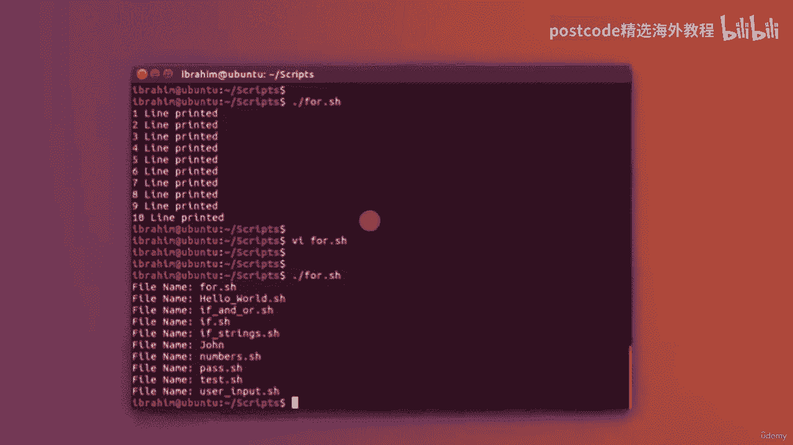
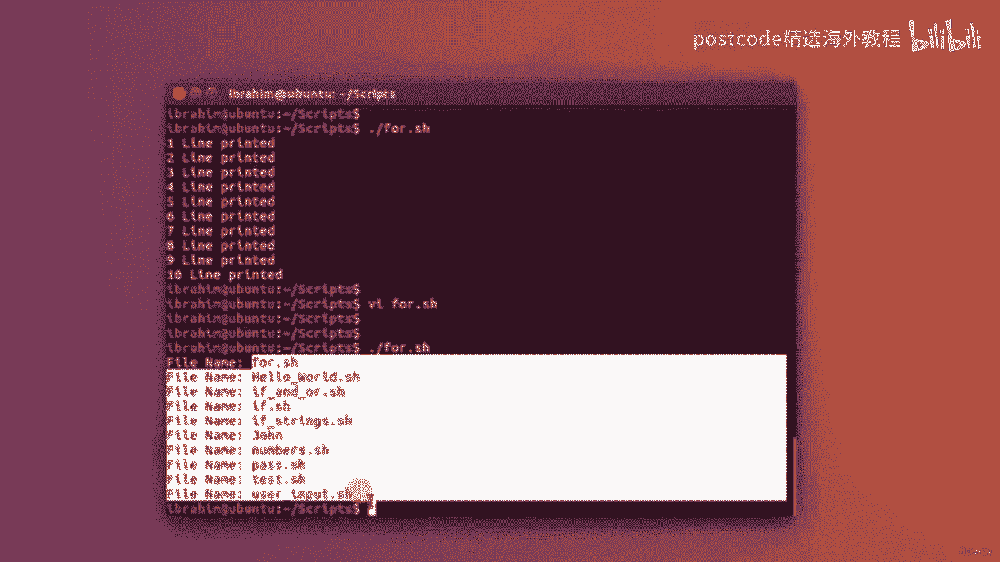
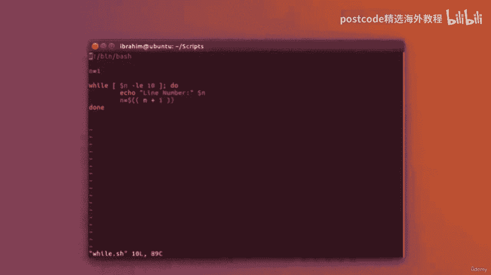

# 红帽企业Linux RHEL 9精通课程 — RHCSA与RHCE 2023认证全指南 - P56：05-05-006 Loops - 精选海外教程postcode - BV1j64y1j7Zg

And for that， I'm going to create a new script called4 dot S H。Put in the binbash， a bang line。

 So to write before loop。Goon to write 4 I N and write something now。

 and I'll explain in a couple of seconds。Do。Thank go。9ine printed。And done。

So let's take a look at this。4 I N。And I've given it a range from 1 to 10。

 So this is how we define a range in bash。 It is with two braces。 And then write the number， dot。

 dot， and the end number。So this is how we define range。 And here for I in that range。

Do the following lines in between the do and the done。 So for the first iteration。

 the I will be at one。 The second iteration I will be at 2， et cetera， until it reaches 10。

 So in order to see that， actually， I can put in here line printed。And before it， I can see。

Dollar sign I。So， this will say。1 line printed，2 line printed，3 line printed， et cetera。

 because this I will take the value of  one through 10。 So let's test this out。 Just write and quit。

Change mod。U plus x。And give it a run， and you'll see it has printed out that line 10 times。 Now。

 this is not the only usage for the for loopbe that I can do。 I can also iterate on multiple items。

 not just for a certain range。 so I can do the following。I can see， for I， N， L， S。Now， here。

 Ellis is a command， and I want to， for example， iterate or do a certain action。

On the output of that command。 So in order to accomplish that， I have to， first of all。

 evaluate this command and use its output。In order to do that， I'm going to use the back ticks。

 Now the back tick is located on your keyboard right next to the1 key。 And like so。

 these two backtics will evaluate whatever is in between them。

 they will actually run that command and then return the output。 So when I say for I in backtics Ls。

 what I'm actually saying is for every single item in the output of this command。And。

What I will do with that is。I'm going to echo out。File。Name。And then put here daughter sign I。So。

This should print out file name and first file name， file name in the second file name。

All the way up to the last one in that directory。 So let's save that。And give it a run。

And you'll see it says indeed file name， and then it wrote every single file in that directory。

If I take a look at these files， they are indeed the same。

 so I can use the for loop to run a certain action on a number of items or run the same action multiple times like we've seen in the first example and the bagtics are extremely useful and what they do is they evaluate what's in between them。

 they actually run that command and you turn the output of that command。

Let's take a look at the while loop。So I'm going to V I a new file， while dot S H。

Get everything prepared。 then bash a while loop keeps running until a certain condition is not met。

 So the fur loop， if you remember， for I N， and， for example， we give it a range。

 and it's going to iterate in that range。Executing the commands within the full loop。 However。

 the wild loop works with a condition。So， for example。

 I could say n equal one as my initial state and say the following。While。

Opening close square brackets。Doaughter sign n with a variable N。Is less than or equal10。

 I want to do the following。Echo。Line number。And then， daughter sign in。And we need to make N。

Equal to。Mathematic operation here。N plus one。Okay。Then close the while loop with a dun。

So what we're doing here is we're saying that while n is less than or equal 10。

 we're going to do the following，'re going to echo outline number and the variable n。

 and then we're going to increment the variable n with plus one， See without this line。

 this loop will go on forever because this condition will always stay true。

 but with the addition of plus1 every time after 10 iterations。

 this condition will no longer be true。So let's save that and quit。

And see how it looks like when we run it。While that is H。And give it a run。There we go。

 line number 1 through 10， just as expected。 So the while loop。

Should be used when you have a certain condition that you're checking for and you want to keep doing these commands or these lines。

Up until that condition is no longer valid。 This does not have to be an iteration like this。

 This could be， for example， checking if a certain。

Iput from a user equates to something you're looking for。 And if it's not。

 you just keep running the same commands。These are just a couple of examples of where a wild loop would be useful。

We're going to take a look on how to create some simple menus in your basket。So for that。

 I'm going to create a new file called options dot S。I'mGo to put in my bin bash line。

 And there are several methods to accomplish the look of a menu in your ba script。

 There is one using what's called a select。But this has some limitations that I do not like。

 So I use a while loop。So I'm going to write n is equal to one。And I'm gonna simply say， while。

Daughter sign in。Is equal to one。Okay。I'm going to do the following。

So this while loop will basically always be true unless I exit the program。

So I'm going to echo out here。Your。Options are。Go ahead and echo out。Number one。Option 1。Echo out。wo。

Option。2。And echo out。3 is great。And then， I'm going to ask。For a number， as input。After that。

 I'm going to read that input into a variable or call it input。

And then I'm going to do an if condition。So， let us say if。Dollaughter sign input。Is equal to one。

Then。What I'm going to do is， first of all， clear out the screen to make it look nicer。

 And then I'm going to echo option。one。Selected。I'm gonna say else， if。Input。

Is equal to option number 2。Then。I'm going to clear out the screen， and echo out。Option 2 select it。

Else， if is my last condition。I'm gonna say， input。Is equal to 3。

Then I'm going to also clear out the screen。Just like so， And echo out。Exiting。

And just can write the command exit， which is going to exit out from the script。

 ending this while loop as well。I'm going to put an L at the end here。我。Put in a clear。And echo out。

Inval。Selection。So anything else， it will just say that this is an invalid selection。

 and then I'm going to close that if condition。So as you can see， this wild loop。

 these options will always。Appear after they finish each option unless I choose number 3。

 which is going to exit from the wild loop and exit from the script itself。

So let's write that in quit。And take a look on how this will run。Going to change mind。

Execute that script。 And you see， it says your options are option 1， option 2 and 3。

 squt I say one and hit an enter， it's going to say option  one selected。

 And it's going to ask me for my options again。2 is option2 selected。If I say， for example 45。

 it'm going to say invalid selection， anything other than。

The scenarios I've written is going to say invalid selection。 if I hit3。

It's going to equate out of the script。是。

