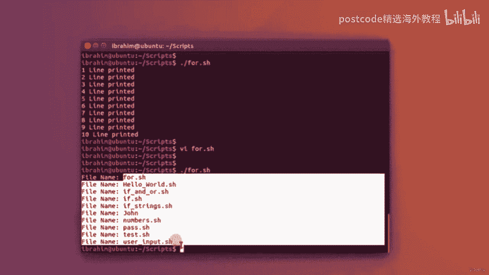

# RHEL 9 精通课程：05-05-006：循环结构

在本节课中，我们将要学习 Bash 脚本中的两种核心循环结构：`for` 循环和 `while` 循环。我们将通过创建脚本实例来理解它们的工作原理和典型应用场景，包括如何利用循环处理命令输出以及构建简单的交互式菜单。

---

## 创建并运行一个 `for` 循环脚本

首先，我们来创建一个名为 `for.sh` 的新脚本。

```bash
#!/bin/bash
```

接下来，我们编写一个 `for` 循环。其基本语法是 `for I IN` 后跟一个范围或列表，然后执行 `do` 和 `done` 之间的命令。

以下是定义一个数字范围并循环的示例：

```bash
for I in {1..10}
do
    echo "$I line printed"
done
```

在上面的代码中，`{1..10}` 是 Bash 中定义范围的方式。循环会迭代 10 次，变量 `$I` 的值会从 1 依次变为 10。每次迭代都会执行 `echo` 命令。

保存脚本后，需要赋予其执行权限并运行：


```bash
chmod u+x for.sh
./for.sh
```



运行后，你将看到终端打印出 “1 line printed” 到 “10 line printed”。

---


## 使用 `for` 循环处理命令输出

`for` 循环不仅能迭代数字范围，还能迭代多个项目，例如一个命令的输出结果。

我们可以这样写：

```bash
for I in `ls`
do
    echo "File Name: $I"
done
```

这里，反引号 `` ` ``（位于键盘数字 1 键旁边）的作用是执行其内部的命令（这里是 `ls`）并返回输出结果。因此，这个循环会遍历当前目录下的每一个文件名，并打印出来。

保存并运行脚本，你将看到它列出了目录中的所有文件。

---

## 理解 `while` 循环

上一节我们介绍了基于列表的 `for` 循环，本节中我们来看看基于条件的 `while` 循环。`while` 循环会持续执行，直到指定的条件不再满足。

创建一个名为 `while.sh` 的新脚本。


```bash
#!/bin/bash
n=1
while [ $n -le 10 ]
do
    echo "Line number $n"
    n=$(( n+1 ))
done
```

在这个脚本中：
*   `n=1` 设置了初始状态。
*   `while [ $n -le 10 ]` 是循环条件，意思是“当 `$n` 小于或等于 10 时”。
*   `n=$(( n+1 ))` 在每次循环后将变量 `n` 的值加 1。如果没有这一行，`$n` 将永远等于 1，条件会一直为真，导致无限循环。

运行这个脚本，它会打印出 “Line number 1” 到 “Line number 10”。

`while` 循环适用于需要持续检查某个条件的情况，例如等待用户的特定输入。

---

## 使用 `while` 循环创建简单菜单

最后，我们利用 `while` 循环来构建一个简单的交互式菜单。这能让你在脚本中为用户提供多个选项。

创建一个名为 `options.sh` 的新脚本。

```bash
#!/bin/bash
n=1
while [ $n -eq 1 ]
do
    echo "Your options are:"
    echo "1. Option 1"
    echo "2. Option 2"
    echo "3. Exit"
    read -p "For a number: " input

    if [ $input -eq 1 ]
    then
        clear
        echo "Option 1 selected."
    elif [ $input -eq 2 ]
    then
        clear
        echo "Option 2 selected."
    elif [ $input -eq 3 ]
    then
        clear
        echo "Exiting."
        exit
    else
        clear
        echo "Invalid selection."
    fi
done
```

这个脚本的工作原理如下：
1.  设置 `n=1`，使 `while` 循环条件恒为真，形成一个无限循环菜单。
2.  每次循环都打印出选项列表。
3.  使用 `read` 命令获取用户输入，并存入变量 `input`。
4.  使用 `if-elif-else` 结构根据用户输入执行不同操作：
    *   输入 1 或 2：清屏并显示对应选项被选中，然后循环继续。
    *   输入 3：清屏、打印退出信息，并执行 `exit` 命令结束脚本（同时跳出循环）。
    *   输入其他任何内容：清屏并提示选择无效，然后循环继续。

保存、赋予执行权限并运行此脚本，你将看到一个可以反复选择、直到选择退出才结束的菜单界面。

---


本节课中我们一起学习了 Bash 脚本中两种强大的循环结构。`for` 循环适合在已知的列表或范围内进行迭代，而 `while` 循环则用于在满足特定条件时重复执行代码块。通过结合条件判断，`while` 循环还能用来创建交互式菜单，极大地增强了脚本的实用性。