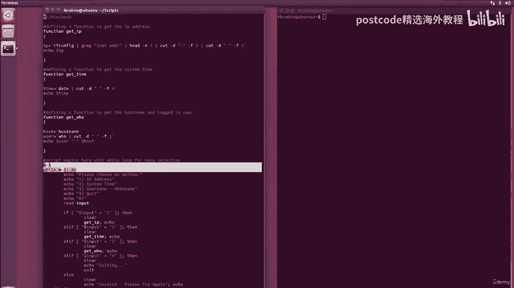
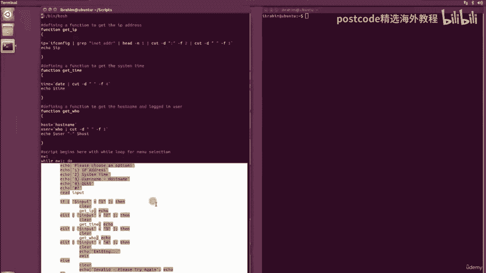
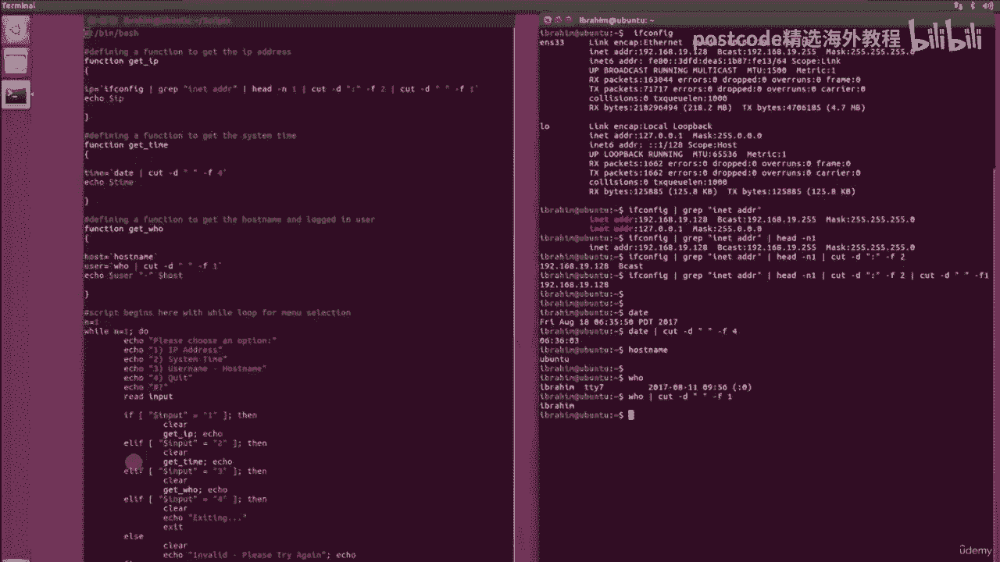
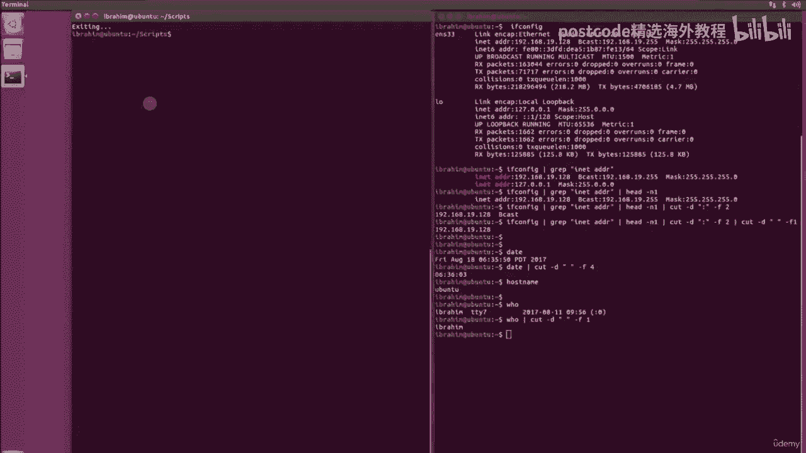

# 红帽企业Linux RHEL 9精通课程 — RHCSA与RHCE 2023认证全指南 - P57：05-05-007 Bash Project - 精选海外教程postcode - BV1j64y1j7Zg

In this lesson， I'm going to show you a little script。The script is called info， dot S， H。

And I've taken the liberty of already writing script ahead of time since。

It does not include any new commands or concepts， but rather it's a compilation of a lot of the things we have learned so far in the bage scripting portion。

So as you can see， I'm starting off by defining a function to get the IP address。

I going call this function， get underscore IP。And as you can see here， I'm saying I P equal。

And I have a command here that we've seen before。This gets me the I only。

 And these two bag ticks are useful to evaluate the command and then return its value。

So I'm storing that value in the variable I。The function will then echo the content of that variable。

In the same manner， I'm defining a function to get the system time。 again， from the command date。

 I'm simply using the cut to get the fourth field out of the command date。

And then I'm echoing out only the variable because， again。

 I'm using the back takes to evaluate the command and then throw the output into this variable。

Last but not least， I'm defining a function called get who， which is going to get me the host name。

 as well as the user who is logged in。So I'm getting the host from the command host name。

And I'm getting the user from the command who， and then I'm getting the first field again with the command cut。

After that， the function will echo the user variable dash and then the host variable。After that。

 it is pretty simple， just as we did in the menu lesson。

 So I'm doing an n equal one while and equal one do and done at the end and everything in between is really my menu selection options。

So I'm saying please choose an option， first one is IP address， then system time， username hosting。

 quit。I echo out what number does the user want， And I'm going to read that input。

I'm checking that input。 If it's equal to one， I'm going to call on the function， get I。

 If it's equal to 2，m gonna call on the function， get underscore time equal to 3。

 I'm gonna get the get who function。And if it's equal to 4， I'm going to say exiting and exit L。

Last but not least anything else。 I'm gonna handle the script write invalid， and please try again。

I'm using an extra echo after each function here， simply to。

Add an extra line after the output of every command。This is just aesthetics。

 So it's not really necessary to do。 but I just thought it looked a little bit nicer that way。

So I have another terminal here open because I just want to dissect very quickly these commands here。

So。Have I take this command。So IF config is going again to print out all the information like we've seen before。

Here， I'm doing a grip on E it。ADDR。After that， using the head command to get the first line。

And then I'm using the cut command to cut right here so I can get this portion。

And then I'm going to cut right here to get only this portion。So， cut dash D。And the colon。

And I'm going to go the second field。And after that， I'm going to cut again。Just like so。

 and get the first field。So this would be the first command。The second command。

 the date is just a simple cut again。And the white space and I'm getting the1，2，3， fourth field。

Just like so。This is the time command。And the host name is just a command that gets you the current host name is's nothing to complicate about that。

 And the who command actually gets you all the users that are logged in。

 This is a single user system that I'm using， so。At the time， I only have Ibrahim who's logged in。

 So， again， using a simple cut。To get the first field。I'm going to get the Abrahim portion。

So the purpose of this lesson is simply to show you what kind of options that you can do。

You can mainly define any function you want。With any functionality that you want。

Make a menu selection out of it。 If you want to have some sort of user interface。

 or maybe the function you're defining is simply。A process that runs in the background。

Maybe it's a function to back up some files。 Maybe it's a function to rename certain files。

 and you're going to run that on a regular basis。So last but not least， let's take a look。

At the script in how it runs。 So I'm going to run info thatt S H。It enter。 It says。

 please choose an option 1，2，3， and 4 for quit。 If I say one， it's gonna print out the I address。

 and you see that extra line that we've added with the empty echo。2 is system time。3 is the username。

 host name and any other input。It's going to see invalid。 And by hitting4。

 it's going quit out of that script。

