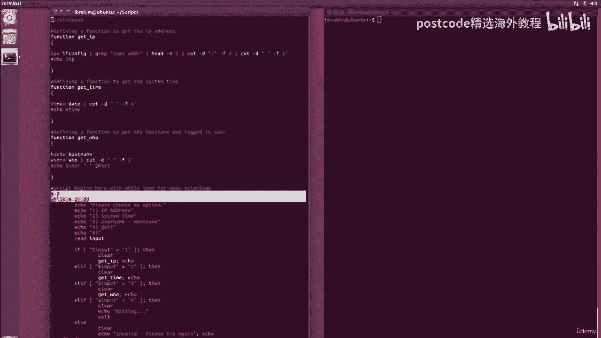
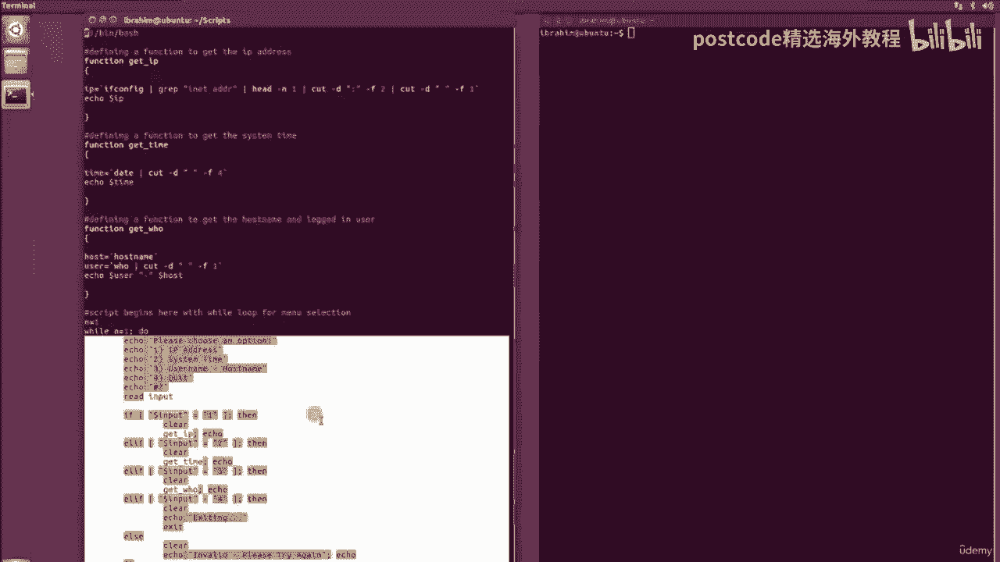
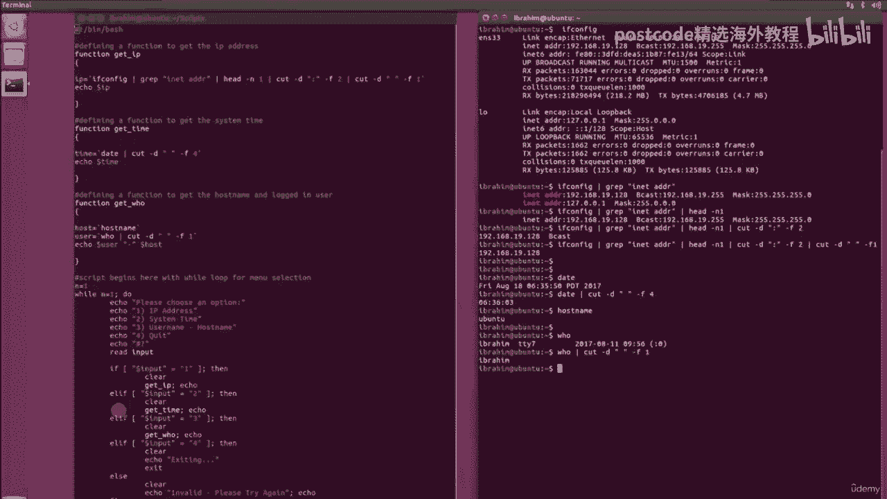
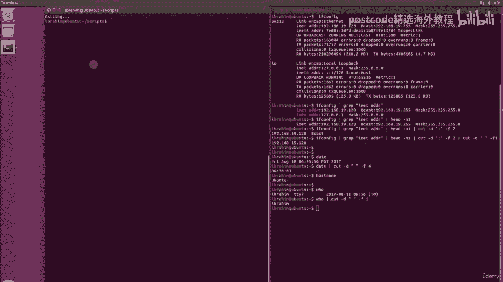

# 红帽企业Linux RHEL 9精通课程：05-05-007：Bash脚本项目实战 🚀

在本节课中，我们将学习如何将之前学到的Bash脚本知识综合运用，创建一个实用的交互式脚本。这个脚本名为 `info.sh`，它将展示如何定义函数、创建用户菜单以及处理用户输入。

## 概述

我们将创建一个脚本，它允许用户通过一个简单的菜单选择来获取系统信息，例如IP地址、系统时间以及当前登录的用户和主机名。这个项目不涉及新命令，而是对循环、条件判断、函数和命令替换等已学概念的整合实践。

## 脚本结构与函数定义

首先，我们来看脚本的核心部分：函数定义。函数可以将一系列命令封装起来，便于在脚本中重复调用。

以下是脚本中定义的三个函数：

*   **获取IP地址的函数 `get_ip`**:
    这个函数使用 `ifconfig` 命令获取网络接口信息，并通过管道组合 `grep`、`head` 和 `cut` 命令来提取出IP地址。其核心逻辑是：
    ```bash
    ip=$(ifconfig | grep -E “inet\s” | head -n 1 | cut -d ‘ ‘ -f 10)
    ```
    命令替换 **`$(…)`** 或 **`` `…` ``** 用于捕获命令的输出并赋值给变量 `ip`，最后函数通过 `echo` 返回这个值。

*   **获取系统时间的函数 `get_time`**:
    这个函数使用 `date` 命令获取当前时间，并用 `cut` 命令截取所需的部分。
    ```bash
    time=$(date | cut -d ‘ ‘ -f 4)
    ```





*   **获取用户和主机名的函数 `get_who`**:
    这个函数分别使用 `hostname` 和 `who` 命令获取主机名和当前登录的用户名，并将它们组合输出。
    ```bash
    user=$(who | cut -d ‘ ‘ -f 1)
    host=$(hostname)
    ```

## 创建交互式菜单

在定义了功能函数之后，我们需要创建一个用户界面来调用它们。这里我们使用一个 `while` 循环来构建一个简单的文本菜单。

以下是构建菜单循环的步骤：

1.  使用 `while` 循环设置一个持续运行的菜单。
2.  使用 `echo` 命令向用户展示选项列表。
3.  使用 `read` 命令读取用户输入的选择。
4.  使用 `if-elif-else` 条件判断语句，根据用户输入的数字调用相应的函数。
5.  选项4用于退出循环（`break`）或脚本（`exit`）。
6.  对于无效输入，给出错误提示。

为了让输出更美观，我们在每个函数调用后添加了一个空的 `echo` 语句来插入空行。

## 命令分解与原理

为了更清晰地理解函数中的命令，我们来分解一下获取IP地址的命令链：
`ifconfig | grep -E “inet\s” | head -n 1 | cut -d ‘ ‘ -f 10`
*   `ifconfig`: 列出所有网络接口的详细信息。
*   `grep -E “inet\s”`: 筛选出包含IP地址的行（匹配“inet ”后跟空格的行）。
*   `head -n 1`: 只取第一行结果（通常是主网络接口）。
*   `cut -d ‘ ‘ -f 10`: 以空格为分隔符，提取第10个字段（即IP地址）。字段编号可能因系统而异。

其他命令如 `date`、`who`、`hostname` 和 `cut` 的用法与此类似，都是通过管道和文本处理来提取特定信息。

## 脚本的灵活性与应用

这个项目展示了Bash脚本的灵活性。你可以根据需要定义任何函数，例如：
*   备份特定文件的函数。
*   批量重命名文件的函数。
*   监控系统状态的函数。



然后，你可以通过类似的菜单结构或定时任务（如 `cron`）来运行这些函数，实现自动化管理。

## 运行演示

最后，让我们运行这个脚本看看效果。执行 `./info.sh` 后，会出现一个菜单。选择1会打印IP地址，选择2显示系统时间，选择3显示用户名和主机名。输入无效数字会提示错误，选择4则会退出脚本。

## 总结



本节课中，我们一起完成了一个Bash脚本小项目。我们综合运用了函数定义、命令替换、条件判断和循环，创建了一个交互式的系统信息查询工具。通过这个实践，你应该对如何组织一个结构清晰、功能实用的Bash脚本有了更深入的理解。你可以以此为基础，扩展脚本的功能，将其应用到实际的系统管理任务中。