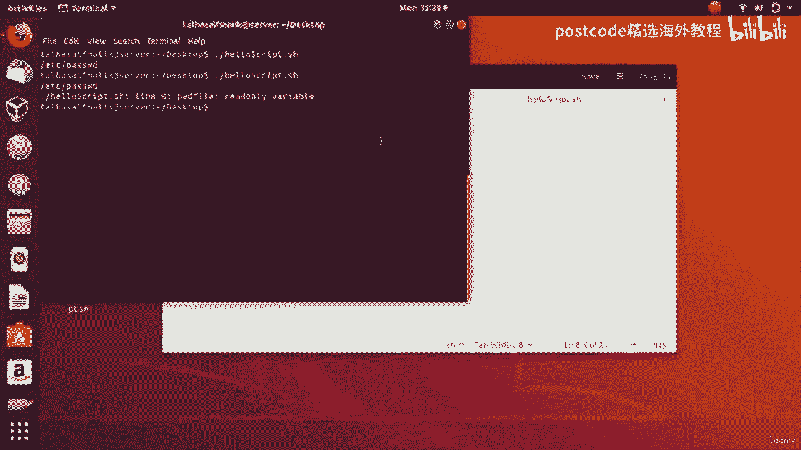
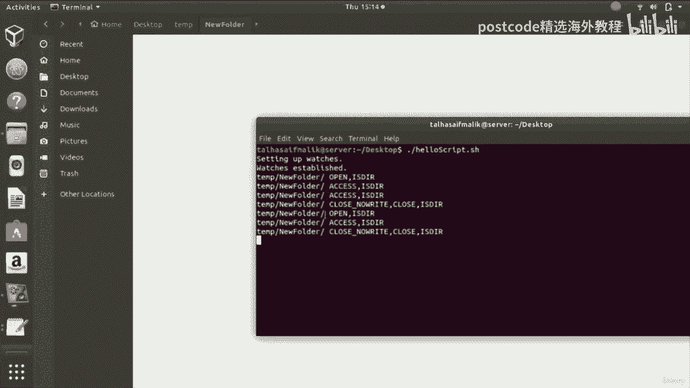

# 红帽企业Linux RHEL 9精通课程 — RHCSA与RHCE 2023认证全指南 - P58：05-05-008 Summary - 精选海外教程postcode - BV1j64y1j7Zg

In this video， we are going to talk about bash scripting。

 This video is gonna be a little bit longer than previous videos， but I promise you。

 it is gonna be worth it at the end of this video。 If you watch this video till the end。

 I guarantee it that you will know about bash scripting more than a lot more people。 Okay。

 so without a further ado， let's start。 So these are the 22 specific topic that we have selected for you。

 So what I'm going to do that I'm going to select one topic like number one topic and then we're going to do whatever that task that we have to perform。

 I'm going to explain to you first， that what we will discuss in this topic。

 then we will discuss it and then we move on to。😊，Another topic， the next topic， essentially， okay。

So let's start。 First topic is helloba scripting So in this topic we are going to discuss what is Ba scripting and we are going to create a file in which we would write the script essentially we are going to print the hello by abash scripting we are going to allow the file to be become executable Okay。

 so these are the steps that we are going to perform in this topic So without a further ado。

 let's get started So we press controltr al okay this opens up our terminal so what we are going to do here。

 we are going to write here CA slash ac slash shells So what this command does is that when you press enter it shows you all the shells available on your system and you can simply use any of them。

So our concern is only bash scripting。 Okay， so we will only select this。

 So we know that bash shall exist on our distribution。 So in order to know the path of the bash。

 So you'll right here， which bash and we know slash bin slash bash is the path of the。Bash shell。

 Okay， so what we are going to do is that we are going to add this path in every script that we write。

 which is related to bash， okay。So。We go to terminal， okay， and let me just go to desktop。

And we will create a file on desktop or a script。 So right now， if we Ls here。

 we have nothing on our desktop， our desktop is emptyy， as you can see from here as well。Okay。

 so what we are going to do is that we are going to create a script。 So touch。

 and then let's say hello script。Dot S H。 So we hit enter and you can see that we have Ho script here。

 Okay， so now if we open it up， this is hello script。

 So what we can do is that we are going to add that path， which is essentially slash bin slash bash。

 And now in here we are going to write a script。 So we will write here。 Ho。Back scripting， okay。

So bash basically stands for born again shellll。And when you do that its it's very simple。

 So you save it。 And now if you Ls here， you can see that you have Helloscript dot S。

 So now if you go into the details， you can see that Ho script dot S is not executable so the owner can only readwr the other groups can only you know read and the public can only read So the executable permissions are not there so we cannot really execute the script。

 So in order to make this script executable， what we have got to do。

 we have to write here CHMO and then we're gonna write here let me just clear at first。

So we're going to write here CHMO and then we're going to plus X。

 which is you know which will add the executable information or executable permissions。

 then you're going to write here file name which is essentially the script， hello script。Dot S。 Okay。

 so you hit enter， you know， it doesn't give any error。 So if we do again a less negative L。

 So you can see that now this file has become executable as well。

 And the color of it has changed okay， So now we can basically execute this script and we can see your result。

 So let's go ahead and let's try to execute our file。 So in order to execute this file。

 you just simply have to put this dot and then slash And then you can just simply write hello script dot S。

 you hit enter and you can see that we have got the output， which is hello bash script。

 So if you want to change it like hello bash。嗯。Linux and audience。So if we save this。

 if we come here again， if we try to run our script， you can see that this echo。

 that display text has changed。 okay， so now moving on to the next topic So what is our next topic Allright moving on to the next topic which is redirect to file So what we are going to learn in this topic is that how we can actually capture the output and we can send it to the file So from the shell how we can send the output to a file basically that's what we are going learn in this topic okay so let's go ahead and let's try to do that So this is our script hello script and let's say that we want this output to go into some random file that we create。

 we press here the angle bracket and let's call this file do text。

 So if we save this we go back to our terminal and let me just clear it So now。

What we are going to do is that we are going to run our script。

So you can see that it has created this file so if we go here we can see that hello bash Linux and audience the output of this file of this script has been stored in this file Okay so what else you can do you can actually take the output from this shell and you can actually store that in the file as well so now what we're gonna do that we will write here a script let's say we write here cat and then we will write here the file name which is essentially file do Txt okay so we save it and。

We， yeah， we go ahead and we try to run our script。 So we hit enter。

 and now you can see that it has become a sort of an editor。

 So whatever now we will write here on this shell hi， this is a shell。 This is Linux hint。Dot com。Or。

Our channel of flowerss。So now what we are going to do that if we want to come out of it we we have to press control D okay so when we press control D we come out of it and if we go ahead and if we try to open this file it says reload so when we reload you can see that it has the output hi this is the shell。

 this is Linux do co or channel of far。So this output that we were writing here is now displayed here in this file。

What it has done that it has basically replaced the old text。

 so there is another thing that you can do if you want that text not to be replaced。

But you want to append the text ahead of it so what you can do just put two angle brackets so you press control S you save it and then you come here and then you try to run your script so you hit enter and it says you know put some text it has become an editor so right here okay another line of text okay so we press control D we come out of it。

And now， if we go back here， we open this file， you can see that it has basically added the text next to it。

 Okay， so now it has appended instead of replacing。Okay， so now let's discuss third topic。

 which is comment。 So in this topic， we are going to perform one line comments first。

 we're gonna see that how we can do that。 and then we are going to move on to creating multiple line comments as well。

 Okay， then after that， we're gonna see the here doc syntax， you know， as an additional thing。 Okay。

 so now what we can do， we go we can go back to our script。

 So what a comment is basically that you know， it has no value。 So in the script。

 if you write a comment， you know， it does nothing， it just explains the code to the programmers。

 So for example， if I am a programmer and if I have written a code。

 and I would add comment into that code because let's say if I have left the company or if I'm not there。

 then the other programmers could actually take a look at the code and they could understand that what。

That code exactly is doing。 So that's why comments are essential。 So for example。

 if I write here hash。 and then I write here， this is a cat command。

 So it would have no effect on the code。 Okay， but what it is studying that this is a cat command。

 So this is a simple command。 So if I uncommon this And if I save this。

 And if I come here and if I try to run my script， which is hello。

 so you can see that it is giving an error。 Okay， so online3， there is an error。

 So if I just write here hash， now it is a comment， it has no value。 So if I go back here。

 and if I try to run my script， you can see that I can actually work with my script quite well。 Okay。

 so now this it would add this thing to the file do text， okay， so。This is a one line comment。

 So what if like you have like， let's say，500 lines of code。 How are you going do that。

 So you cannot actually put hash against every single line that is going to take a very long time。

 So， for example， let's say we have like 10。Okay， like this。

 So how you can actually make all of these lines invisible or of no value by commenting them。

 how you can comment all at once。 So this thing we call it as multi line commenting。

 So how would you do that。 you would come here， you put a column here， you would put a space。

 you you know， after column， you put a single code here， and then you put a single code here as well。

 So now all of it has been commented and if I save it and if I go back if I run my script so you can see that there is you know these lines have no value。

 all of them have been commented。 Okay， so that was basically multiline comment。 Okay。

 so now let's discuss the here doc syntax。 So here doc is basically I would say it it is basically a phenomena that。

It actually helps you interact with the shell。 So， for example。

 whatever we're gonna write here inside our script， it is going to be visible on our output。 Okay。

 so let's try to do that。 So for example， let's say we have a cat come on So in here dock we're not gonna write angle bracket this way。

 but this way， okay， and here we would have here dock delimmeter。 Okay。

 so the here do demeter would be like it could be anything。 it could be hello world。

 it could be you know it it is similar to the variable name。 Okay， so let's call it a here dock。Text。

 okay， so basically what it is that it is a hair do delimmeter。 So let me you know， name it mute。

 something like creative， so。Let's call it creative。Okay。

 so what it is that it is a here dock diameter and it could be anything。 So now in here。

 you can add any text like this is hello creative。Next， okay。So I can add another line。

 add another line。So now I would write here creative to end the hair dock demeter。 Okay。

 so now if I save it， I go back， I try to run my script。

You can see that it is basically showing this is hello creative text at another line。

 So this was basically the concept of here doc。 So for example。

 if you have any like sort of comments and if you also want to show those comments on the output。

 you can use this here do delimit alright and this this is here dog demeter and it could be anything like anywhere it is similar to like the variable name Okay so I hope you have got the point you have okay。

 so now let's come to our next topic which is conditional statements So in this topic we are going to discuss if statements if else statements if else if statements and the conditional statements of and operators and the conditional statements of our operators as well。

Finally， we will take a look at the case statement as well。 Okay。

 so let's go ahead and let's try to run all these conditional statements and let's see what are the results that we get。

 Okay， so we'll go to our script and。Inside our script。 we have this code。 we'll remove it。 Okay。

 so now we are going to write here the if statement。 So before if， let's say。

 let's declare a variable named as let's say count and then 10。 Okay， this is the value。

 So if we write here if And then in order to write a condition。

 you have to have this these big brackets。 And always remember to keep one space from both of the sides。

 Okay， otherwise it would give some sort of weird error。 So you can write here equal。

 and then you can write here 10。 So obviously we know that this station this statement is true。 So。

We write here then， and then we' write here， echo。So echo， let's say the condition is true。

 So for those of you who are not programmers who do not understand the if statements。

 I'm going to explain to you in deep。 Okay， so lets let's see what this thing will do。

 So count is a variable， it has a value of 10 So what happens is that inside this if condition it checks if the count is equal to 10 Okay。

 so obviously the count is equal to 10。 So this condition is true。 So if that condition is true。

 only in that case， it would execute this block， which is after10 okay。

 so I hope you have got the point。 so now if we just save it if we go back to a terminal and if we try to run our script。

 you can see that it says the condition is true。 so let's try to change this。

 let's say let's you know。NowMake it false on purpose。 So equal 9。 if we save it。

 if we try to run our script again， you can see that it does not give any output and the reason is that we do not have an else block right。

 the if statement， the condition， the cursor， the program doesn't know what to do if the condition is false。

 So for that， we have。This thing right here， else block。 And in else block。

 you can write the condition。Is false。 Okay， so the idea is that now what would happen that it would execute the else block because if block wasn't true。

 So now you can see that it it is showing here the condition is false。 Okay。

 so I hope you've got the point。 So there are other things that you can do but before that let me explain to you again。

 So count is equal to 10。 So count is not equal to 9 because count is 10 here。

 So obviously 10 is not equal to 9。 So this block cannot be executed at any cost because this is not this if condition is not true。

 So what it will do that it will skip this block and it will come here。

 and if it will basically print out this else block。 Okay。

 so you can actually check here not equal to as well， which is an E okay。

 so an E stands for not equal。 So obviously this condition is gonna be true now because we have 9。

So obviously9 is not equal to 10 Another thing that you can do is that you can write here GT。

 which stands for greater than and obviously if you will go ahead if you run your script。

 this would say the condition is true because 10 is greater than 9 okay so。

You can use angle brackets as well。 so if you want to use an angle bracket like this。

 so count is greater than 9。 So what you've got to do that you have to just replace these big brackets with these brackets。

 Okay small brackets alright， so now if I save this obviously we know that 10 is greater than 9。

 so the condition is going to be。True okay， so the condition is true。 Let's try to make it false。

 So if we， you know change the angle bracket， if we save it， if we go back。

 if we try to run our strip， now you can see that it says the condition is false。 Okay。

 so obviously10 cannot be less than 9 alright， so you can also have if else， if statements as well。

 Okay， so how you can work with them， let me show you let's say that we want to put another check。

 So how would we do， we would write here else if。And let me just， you know， have an else block here。

 Then we' write here then。 and then we write here E。 and let's say the condition。Is true。And in here。

 we put a condition like。You know。Got。Is less than。Or equal to， let's say9。 Okay。

 so we know that this condition is not true， right？ So what would happen that the cursor would come。

 It would check obviously 10 is not less than 9。 It would skip this and it would come again here and obviously the 10 is not less than 9 and it is。

 you know， it is neither less than 9 nor equal to 9， obviously。

 so this block will be skipped as well。 and then it will only execute this thing here。

 E is equal to the condition is false。 obviously okay， so I hope you have got the point here。

So now we'll press control S and we'll go here and we'll see what we can do with this。

 So if we run the script， you can see that the condition is false。

 So let's say if we write here greater than 9。 Okay， so now what would happen。

 let me write here second。Predition。Is true。 Let me write here。 First condition。Is true。

 and I received it。Let me just save it and if we go back。And let me clear it if we run our strip。

 you can see that it says second condition is true。 Okay。

 so that's how you can work with else if as well。 So till now we have discussed if statement we have discussed if else statements and we have also discussed if else if statements as well Okay。

 so I hope you have got the point So now let's move on and let's try to discuss and operator So how can we work with the and operator So that's pretty simple as well。

 So let me just remove all of that。Count， let's， let's make it as let's say age。

 So age is equal to 10。 Let's say。 And we write here。 And if condition， if the age is， let's say。

 let me write here。 double chs。 and then the。You know， variable name， which is essentially8。

Let's say if 8 is greater than 18。And。Then， we write here。啊。Double quotes and right here， H。

And then we'll write here less than。 and then we'll write here 40。So。

What this condition would do it it would check if the age is greater than 18 and if it is less than 40。

 only then it would execute whatever is inside the if block。 So right here echo。Age is correct。Okay。

 so else with say。E go。8。Is not correct。Okay。Then we'll close the if block or the if statement So right now we we know our areas 1。

 so obviously this statement will not be correct because in order to execute this block both of these condition conditions have to be true okay so。

If that condition alone is true and that is not true， then obviously。

 this block is not going to be executed。 So at the same time， simultaneously。

 these two conditions have to be true。 Okay， so right now。

 we know that none of the condition is true。 So obviously。

 it is going to execute this one age is not correct。 So we press control S。 we go ahead。

 We try to run our script。 So now you can see that it is giving some sort of error。At line 5。

 so let's see what the error is。So I think the error is that we have not given space here。 So okay。

 so that's what I was talking about previously。 So now let's go ahead。

 let's try to execute our script。 So you can see that it says age is not correct because both of the conditions are not true。

 So let's now let's try to make one condition true but let's try to make another condition false。

 So logically let's say we say age is less than let's say 15。 Okay， so now automatically。

 obviously age is less than 15。 this condition is true。 but this is not true。 Okay， this is false。

 age is not greater than 18。 So again， it would not execute this one。 it would execute this one。

 Okay， so if we control less here， we go ahead， we try to run our script。 we hit enter。

 you can see that it says age is not correct。 So again， it has not executed this block。

 It has executed this block rather and。Obviously， this condition is true。

 but this condition is not true， So both of the conditions have to be true。

So now let's write here greater less than。 and let's say， let's do it 40。 and let's change it to。

 let's say 30。 Okay， so now what would happen that age is greater than 18。 Yes， it is true。

 age is less than 40。 Yes， it is true as well。 So what's going happen that this thing is going to be executed。

 it would say age is correct。 Okay， so we press control S we save it。

 we go back to our terminal and we try to run our script and if we hit enter， it says age is correct。

 Okay， so I hope you have got the point。So now what we are going to do is that we can actually do something like this。

 So if we just remove this you know these brackets from here。And if we put double brackets。

 then it would give us the same result Okay， so that is just another way to do the same thing。 Okay。

 that is just a difference in syntax。 So if we you know run our script we would get the same result okay so there is another way that you can do if you just write here negative a or hyphen a with single brackets。

 then it would work as well。 So if we press control S， we go back we try to run our script。

 you can see that it has not changed， it is giving us the same result。

 So these are basically three synt to write down the and command okay or the and operator and work with it alright so I hope you have got the point you have learned something new regarding this so now let's move on to the or operator So let's keep everything same so our operator is basically if you write here。

Or0。So it means that one of those two statements have to be true like either it it has to be true or it has to be true in order to execute this block so。

This is negative O it is it is being used for the or operator so now the age is 30 both of conditions are true so obviously this block will execute so let's go ahead and let's try。

You can see that it says age is correct。 So now let's make one of them false。

 So let's say we we made this false intentionally。 So now you can see that obviously this block is this statement。

 this condition is false and this condition is true but still it would execute it because one condition is true。

 Okay， so R means only one Okay， this one or this one So we press control S we go back。

 we try to run our script again and you can see that it says age is correct。

So the only way this is gonna be false is that both of them are false Okay。

 so let's make it let's make it something like this negative Gt。

 it means that a is greater than 40 and age is less than 18。

 so obviously both of the statements are not correct now so you press control S we go back to our terminal and if we try to run on our script you can see that it says8 is not correct because both of the conditions are false now okay so I hope you have got the point and similarly you can actually write the or operator like this by writing here double。

Pippes， okay， pipe sign。 and then you have to write here double brackets as well。

So if you now press control S and if you go back， if you try to run your script。

 you would see it would give give the same result， Okay。

 so that is just a different syntax so you can also do something like this。And like this。

It would work the same way。 Okay， so these are basically two different three different syntax for or statement as well。

 So if we go back， if we try to run our script， you can see that we have got the same results。 Okay。

 so I hope you have got the point so till now we have learned regarding to the conditional topics we have learned if statements。

 if else statements， if else if statements， the and statements or or the and operator and the or operator as well。

 Okay， so now moving on to the next point we are going to discuss case statement。

So case statement is not very different from the if statement。

 so you can call the case statements as multiple if statements as well。

 so if the same thing that you can do with the case statement you can also do it with the if else statement multiple if else statement as well okay so now let's go ahead。

 let's take an example of core so we'll write here case and we'll write here car which is a variable we write here core equals let's say dollar。

So the next topic， you know， it's about loops。 Alright， so in this topic。

 we would discuss while loops， we would discuss until loops。 we would discuss four loops。

 and we would also discuss break and continue statements。 Okay， so let's go ahead and let's start。

 So well go back to our script。 And you know， for now， let's just remove all of it。 we don't need it。

 And right here， the while loop。 Okay， so we' would write here while。And right here， we'll write。

Any condition， let's say， first of all let us declare a variable， let's say a number。Okay。Equals。

 let's call it， you know， let's say one。 And we write here a statement。 Let's say number。Let's say。

 less than。Or equal to。Or less than。等。And in here。We I do。 We write here， echo。

So the idea is that the syntax of the while loop is something like this while。

And then you write here condition， and then you write here， do。

 and then you write here all the statements that you're going to write。 And then you write here done。

 Okay， at the end。So let me write here done Okay， so inside of that inside of this right here between do and done。

 youd write all the statements that you want to execute。 Okay。

 so now let's say we write here we want to execute and now we want to increment the n the number。

It's actually number here， right？So we' write here number。Equals。Then we write here dollar sign。

 Then we write here。Double brackets or double parentheesis and。Will increment。And plus one。 Okay。

 so now I'll explain to you what's happening here。 So first of all， we have a variable number， which。

 you know， it has a value 1 and it one comes here。 One is obviously less than 10。

 So it would go ahead and it would print it out one。 and then it would basically add。Inside number。

 okay， number plus one。So。It would one plus one。 it would be2， so it would come back here。

 Now the number is2， so two is less than 10。 it would come here again， it would check。

 it would print it out here and then it would incremented again So now two plus one is3 so it comes back here now it checks again three is less than 10 and then it basically repeats the cycle okay so if we save it if we go back to our terminal and if we try to run our script hello script do sets you can see that it basically prints out the value still 9 10 it has not printed out because when it was 9。

9 was printed out then it has incremented it it incremented it like。🎼9 plus1，10。 It goes back here。

10 is not less than 10。 Okay， that is false。 So basically it doesn't execute anything。 Okay。

 and it comes out of the while loop automatically。 So now if we do something like less than0 or equal to。

 So now this condition would be true because 10 could be equal to 10。 Alright。

 so now you can see that it has basically printed out 10 as well。 Okay。

 so that was basically while loops。 So you can basically you know， make it。

 you know as complicated as you can。 But that was basically the simplest introduction of while loops。

 So now let's go ahead and let's try to do the same thing with the until loops。

 So until loops are almost the same for until loop， we will just right here until。

And obviously we're right here。 So until is it's basically that greater than or equal to。

 So until we'll run until this statement is you know， until it becomes true， okay， so now， you know。

 when the one， one is greater than or equal to 10。 obviously it is not， it is false。

 So this loop will run until this condition is false。 Okay。

 so I hope you've got the point in the while loop the while loop was running until this condition was true。

 okay。But until Luke will run until this condition becomes true。Alright。

 so I hope you've got the point so now obviously we know that this until loop is going run until the value becomes 10 Okay。

 so then 10 is will be greater than or equal to 10 that condition would be true so it would break and it would come out of the loop okay so we save it and we go back here to our terminal and we try to run。

And we write here。And you can see that until loop has run until loop has run。

 and it has printed out the values 1，2，3，4，5，6，7，8，9， till 9。 Okay。

 it has not printed out 10 because when 10 came here， it basically， you know， it became false。 Okay。

 so sorry it became true。 and the until condition or the until loop became false and it， you know。

 came out of the loop。 Okay， so I'm explaining to you again。

So the idea is that this number one here it comes here。

 so1 is greater than or equal to 10 this condition is false okay right so if you write here while this this loop will break right away okay because this condition is false so it will not print anything。

But in this case， this this condition is false and we have until loop here。

 so until loop will run until this condition would become true okay。

 so as long as the condition is false， the until loop will keep on running alright。

🎼So I hope you have got the point。 So moving on to the next loop which is like for loop。 Okay。

 so we have done while loop and we have done until loop。

 So now we'll focus on while we'll focus on for loop Okay， so for loop。 you know。

 basically we can write for loop in two fundamental ways in ba scripting。 So I is basically。

 you know， you can name the variable I and then you write here in and then you can write here 1，2，3。

4，5。 Okay， so then you write here2。🎼And then you write here echo and then you print out basically I and done here。

 So basically I is gonna be printing out like 1，2，3，4，5。 Okay so we go here。

 we clear it and we run our script and you can see that it has printed out1，2，3，4。

5 So you can say that you cannot write actually till hundred。 Yes that's right。

 we cannot write that So for that we have an alternative we we but we would do that we write here 0 would go we put double dos here。

 we write here 10， let's say 20 So we save it and now if we run our script。

 let me just clear it first if we run our script。Now you can see that basically it has printed out from 0 to 20。

 Okay， all of that。 So now we can actually make a change here as well。 So if we do that。

 basically what it means that the first one is basically starting point。

 Then we have the ending point。Ending， and then we have the incriement。 Okay。

 so now it would print out all of that with the increment of twos。 Okay， so for like0。

 then it would print out。2， and then so on and so forth。 So let's save it。Let me actually delete。

That because it would give the error because it isn't a comment as well。

 So we save it and we go back here， we clear it。 we try to run our script and you can see that it has basically printed out everything with the increment of2 okay so I hope you've got the point So that is basically one way of writing for loop theres there is another way of writing for loop which is conventional across you know all programming languages this is a very famous way of writing for loop So you you do something like this。

 you put on double brackets and then you write the variable name you initialize it with zero and then you write here I。

 then you write here a condition let's say5。🎼And then you basically increment it。 Okay， I plus plus。

 Okay， then basically you it， it stays the same echo I and then done。 obviously， what it would do。

 it would print out from 0 to 4。 Okay， if， if the condition would have been I less than equal to 5。

 then it would have printed out 5 as well。 So now let's save it。

 Let's go ahead and let's see what happens。So now you can see that it has printed out from  zero to4 okay。

 so that was basically a while loop until loop and4 loop。

Now let's move on and let's discuss the break and continue statement。

 so let's let's use this same example so we write here let's say I is less than equal to let's say 10 okay so then we add a condition here。

 let's say we write here f。And then we write here， you know。Dollar I。And then obviously。

 we write here greater then。And then let's say 5。 Okay， and then we write here then。

 and then we write here。Bak。Like this， okay。And then we write here F5。

 which basically close you the if statement。 So what's going to happen is that it is going first of all。

 the fall loop is going to be executed。 Okay， and then inside the for loop， there is an if statement。

 So this if statement is going to check that if I is greater than5 or not。 okay。

 so obviously I first of all， I is going to be0 so that condition is false So it would basically not execute it would not execute this block。

 it would just go ahead and it would execute this one here。 then it would come back。

 it would increment it and it would start to increment it until it reaches5。

Okay so what would happen， this condition would become false。5 is not greater than 5。

5 is equal to 5 right finally， when this I would become6， it would come here，6 is greater than 5。

 yes， this if condition is now true。 So it would execute this one So it would basically break it would execute the brake statement。

 So what this brake statement would do that it would break this loop。 Okay。

 and it would come out of the loop。 So the loop increment would stop and the loop execution would stop and the program would come out of the fall loop。

 it would break the fall loop Okay， so I hope you've got the point。

 So now let's go ahead and let's save it and let's try to run our program or our script So we right here you know hello script and we hit enter you can see that it has printed out till5 but as soon as it has I has become6 it has basically you know。

This condition is true， and the brake statement was was executed。

 and it has broken out of the follow。 Okay， so I hope you have got the point。

 So now let's discuss the continuous statement， so。Let's go ahead and let's try to write here if。

 and then we would write here I， and then we would write here E Q， and then we' would write here3。

And then， let's say。We write here。 double pipe sign。Okay。And then let's say we right here， you know。

Dollar I。Then， we write here。Equal。Le say7。Okay。So then we write here then。

 and then we write here inside of that conum。Okay。So now we save it。

 So what's going happen is that it is going to print out everything， but it is going to skip 3 and 7。

 So basically when the condition is going become true， either one of them。

 this thing is going to execute。 Okay， so let's say when the I value is become3。

 this condition was true。 So the continue was executed。

 So continue basically takes you out of the loop。 Okay， it doesn't execute whatever is， you know。

Whatever is here， it takes you out and then it comes back and it starts to this。

 execute the loop again。 Okay， so the brake statement， it comes out and it basically breaks the loop。

 Okay， it goes here and it goes back okay so you can say that basically continue thing it goes back from here okay。

 the brake statement it comes here first and then it stays here。

 okay the continuous statement it basically goes back right here。 Alright。

 okay so when the I's value would become three， obviously this would be true。

 and it would execute the continuous statement。 So what continuous statement does。

 it doesn't go ahead， it goes back here。 So the brake statement was actually breaking the loop and going out of the loop but the continuous statement。

 it goes back here okay so when the value would become3。

 it would go back here and similarly when the value would become7， it would go back。Here again。

 okay after executing the continuous statement。 So for all other values， for example， for0，1，24，5。

6 and 8，9，10， it would be false the if condition， So it would not execute the continuous statement So it would echo all of them Okay so I hope you've got the point。

 so we'll go ahead and we press control as we save it so now let's try to run our script。

 so you can see that it has basically printed out from 0 to 10 except3 and 7。

 Okay so I hope you've got the point about break and continue statement。

 you have understand while loop for loops and until loop as well So now let's move ahead to the next topic Okay so the next topic is script input So inside this topic would see that how how do we deal with dollar $1 $23 the inputs that we give to the script。

Also discuss about the dollar hash and dollar at and we'll also see that how we can give an input as a file and how we can read that file using STDIN Okay。

 so let's start with this topic so we'll go back to our script。

And what we would do is that we just simply write here echo and then we' would write here  dollar 1 23。

 let's say。 So what this program or what this script would do that when we would run our script。

 what would happen is that lets let me just go to desktop first， Okay。

 because desktop is the place where our script resides so。

What we are going to do is that we're going to run our script and the first argument that we are going to give here。

 let's say we give the card company names。 So we would right here PMMW Mercedes。

都有了。Okay， so right now this thing represents this input represents dollar one。

 this input represents dollar2， and this input represents dollar。3， okay。

 so now if we would hit enter， you can see that we have got these three things on the output。 Okay。

 so we have given these three things as input and inside the script， we have printed them out。

 So obviously we have them on output。 So what if you just do a little addition here like let's say dollar0。

 So what would happen is that now this file name， this script name will also be printed out because we are giving it as on on the zeroth argument。

 So let's go ahead， let's try to run our script and let's say we type the car names again now let's try to change it on。

Toyota。 so we hit enter and you can see that because of dollar 0， the0 argument。

 the script name has been printed out。 and for because of dollar1， the BMW has been printed out。

 And because of the dollar 2， Honda has been printed out。 And because of dollar 3。

 Toyota has been printed out。 So there is another thing that you could do。

 And that is basically that you can take all the arguments in the form of an array。

 And then you can actually print them out。 So let's say。We go here and just remove this。

 So now what we would do， we would create an array。 and obviously。

 we do not know that how many number of inputs are gonna be there。 So what we're going do。

 which we will just right here at。And before a would write here dollar sign。 Okay。

 so this represents the unlimited number of like inputs。 so you can type in like 15 inputs。 Okay。

 that's no problem。 But if we would specify like three here， then we can only give three inputs。

 Okay， so we don't want that。 we are trying to get array and we would we would take unlimited inputs。

 So what we would do now， we would print out the each and every index of the array。

 So now what we would do would write here echo dollar sign。 And then inside of that。

 the name of the array， which is A Gs。 And then the index number。 Okay。

 so now we would simply copy and paste this thing from here。There's still this。 Okay，0。Wen。

And let's say， let's do it too。 So let's see if it works out。 So now we would go here。

 we try to run our script again。Let me clear it。 So would right here。Hello， script taught S。

 and then we'd give the arguments。 Let's say we gave three inputs， BMW。嗯How的。🎼Mercedes。

So now if we hit enter， you can see that we have got three outputs。 Okay， BMW Honda Mercedes。

 So now what has happened is that in the array， this BMW which was like taller one here。

 now it has been assigned zeroth index in the array as if you' are familiar with the programming。

 we are going to discuss arrays， you know ahead。 So if you don't know about arrays。

 don't worry because it's coming。 So the idea is for now just remember that the arrays always start from zeroth index。

 Okay so the first value that you're gonna give to the array。

 it's going to be stored inside the zeroth index of array。

 So right now you can see that the zeroth index of the array has this first value okay and the second value that we are giving the input it's been you know assigned to the first index。

 the one index which is actually the second index。The， okay。Then the index number two。

 which is actually the third index。 it contains the value Mercedes。

 the third input that we are giving。 Okay， so I hope you've got the point。

 So if you want to print out， you know， all the array， there is another way to do that。

 And that is basically now I have commented this line。 So it has no effect。

 it has no impact on the script。So if you want to print out like， you know， all the array like。

 you know， how many， no matter how many inputs you give， they are all gonna be printed out。 Okay。

 so now if we save this， if we go back here， we write here hellello script。

 then we write here BMW Honda Mer let's type Toyota as an addition， if we hit enter。

 you can see that all four inputs have been printed out because the array was there。

 so array has taken all four inputs and then because of this at dollar at the rate of because of this it has printed out all the values that it has taken okay。

So I hope you have got the point。 So if you want to know that how many indexes are there so in order to do that in order to measure the length of the array we have echo and dollar and the hash sign Okay so if you right here something like this dollar hash and if you echo it then what it would do that it would print out the length of the array So if we do something like this hello and then we would write your BMW and Toyota if we hit enter you can see that it has basically printed out the length of the array which is essentially3 allright so that was the arguments that we have played with so that was all about input so what we can do is that we can also read the file as well using STDN so let's try to do that let's write that code so first of all。

rite a while loop because we are going to read the file line by line。 Okay。

 so I'm going show you that if you don't select any file。

 then it the program would would actually just work you know in in a complete different way。

 So it would create a shell， it would assume the shell as a file and whatever you would write it would simply print that out okay。

So now we write here while and then we write here read and then we write here line and we write here do and then we write here echo and then we are just going to print out。

Line， okay。And then basically we're going to close the while loop。But here were gonna do an addition。

 so we are just going to write here something like this Do one dollar one would be basically it would basically the it would basically be the input that we are that we would give as the file name okay so dollar one and then we write here something like this and then we give the path of the STDN because we are using STDN to read the file Okay so that's it So now if we save it and we go ahead and we try to run our script so let me just square it so first of all。

 let's say if we don't give any file like right now dollar one would be the first argument here but let's say we don't give any file name okay if we hit enter so now you can see that it has basically created the terminal as a file So whatever I would write here this is a file if I hit enter。

 you can see that it has basically printed that out So now。What no matter what I would write。

 it would basically print that out Okay because I have not given an argument and because of STDI and it has assumed that the terminal is a file Okay。

 so it would take the input and then it would print out the output assuming that it's coming from the file。

 but that's not the case so。Pres control Z break that and come out and now wed give the argument so let's say I have this file on desktoptop untitled document one which has all the topics。

 so let's try to give the name of this file now as as an argument So dollar one so would' write here untitled document one and these slashes are here because we want it to assume one file okay so because of these spaces inside it would assume them as three files three argument but we just want all these three words to be assumed as a single argument okay so now if we hit enter you can see that it has basically read the file and after reading the file it has basically printed all the stuff out okay so that's how you basically read the file using STD and IN okay so now let's move on to the next topic。

Okay， so the next topic that we are going discuss is script output。 So in the script output。

 like we are gonna discuss the standard output and the standard error。 Okay， these two things。

 So in the previous topic， we have discussed standard input。 alright。

 so the idea is that the standard output is something like this， let me show you Ls negative ill。

 if we do that， if we do that， So this is basically our standard output。

 So what if we want to redirect this standard output to a file， of course we can do it。

 and I'll show you in a while。 So let's say the standard error。 So if we do something like this。

 Ls plus L。 So this is basically the standard error。 Okay， so。

What's going to happen is that we are going to write a script in which we are basically just going to redirect the standard output and the standard error to two fundamental basic files so we can do that in the same file as well I'll also show you that so we're going write here Ls negative a and then we're gonna write here1 and then we're gonna write here the file name。

 let's say file 1 do pxt and then we write here2 and then we write here file2 do Tt So basically this one represents the standard output and it will send the standard output to the file1 dot text and similarly this two represents the standard error and it will send the error to the file to dot text So right now we know that the command is right so they would be standard output and there would be no standard error so it would send the standard output in this file and this file would be。

Created， but of course， there would be no standard error。 So this file would be emptyy。 Okay。

 so we save it。 but go ahead and we try to run our script。

 So we hit enter and you can see that two files have been created。 So if we if we go to file one。

 you can see that this is our standard output that we have redirected to the file successfully。

 And if we go to this file to， you can see that it's emy because there is no error。

 but our standard error will be redirected to here。 Okay， so。Let's try to make a mistake。

 Let's try to create the standard error。 So now let's see what happens。

 So if we go here and if we run the script now if we come back to file one。

 if we if we reload you can see that there is nothing okay so if we go to file2 if we reload you can see that there is the standard error okay so standard output file is emy standard error file has something in it which is an error essentially okay so I hope you've got the point you can also basically transfer the standard output to one file so basically let's say if we delete these two files。

And let's say that if we just write something like this， if we do not specify anything like you know。

 if we just write something like this， so what's going to happen that this is going to automatically assume that this file is the standard output file okay。

 so if we save this and if we try to run our script like something like this。

You can see that it has created the file one and it has the standard output inside of it。

 so now let's try to do the error and let's see if it assume it as a standard error file as well so we go ahead。

And we do something like this。 and you can see that it has basically not created this file as the standard error file。

 Okay， rather what it has done that it has given the error， the standard error on the terminal。受啊。

You can also create one file for the standard output and standard error as well。

 So the way to do that is something like this。 So you would write2 and then you would write this and person sign and then one okay so now basically this file will be used for both okay standard output and standard input。

 So now the command is correct。 So if we run the strip so and if we go to file one you can see that。

Reload， we have this standard output here， but if we now。

 if we try to go to our script and if we make an error here， let's say something like this。

Now if we run our script。And if we go back to file1 dot text。

 says reload and now you can see that it has basically displayed the standard error in the same file。

 Okay， so there is a shortcut to do that like you know let's say if you don't want to write this thing right here so what you can do is that you can also just right here am person sign。

And it will do the work。 So now basically what has happened that it would redirect the standard output and standard error to the same file as well。

 So basically that is just simply a shortcut okay so now let's go ahead and let's try to run our script and you can see and if we go to51 dot text you can see that we have the standard output if we try to make a mistake。

We do plus。 And if we try to run our script again。Now you can see again in the file one。

 we have got the standard error。 Okay， so the next topic that we're going discuss is pipes。

 So I put pipes here because so what we are going do that we're not gonna discuss pipes。

 but we're going to teach you。 Let's name it as send output。From one script to another， okay。

From one script。Do another。Okay， to another script。All right。

So basically I have figured out an easy way to do it。 So with pipes。

 basically you transfer your one command output to another command。 Okay。

 so but if you want to transfer your whole script to another script there is a simpler way that I have figured it out。

 So let's go ahead and let's try to do it。 So we go to our script let me close that so in here。

 we are going to write， let's say this is our first script。 Okay。

 so this is hello script dot S and inside of that we write something like let's say message we create a variable and then we write here hello。

Linux hand audience。Okay， so now。What I do that I basically export this message to another script that I'm going to create。

 I have not created that script yet， but I'll create that， so。II'll name it as let's say。

 second script， Okay， not as such。So now what would happen is that basically this message variable。

 it contains hello Linux and audience， and I would export it to the second script， okay。

 which I would。Create， so now I would go here。 Let me just create a text file。Quickly。

 I'll basically write here slash。Slash bin， slash bash。And I would save it as a dot S file。

So I would basically name it。Second。scriptcr。

🎼Dot S。 So now basically I have created the bash file。

 but there's one problem that it is not executecutable。 If we go here do something like this。

 you can see that this second script dot S is not executable So what we've got to do we have to make it executeable as we as we have made this hello script dot S executeecutable So what we're gonna do we're going to write hereHM mod and then we're going write here plus X which would add executable executable permissions Ex me。

And then we're gonna write here the file name， which is essentially second script。

 because that's where we want to make changes， right， So now， if we clear it。

 if we let say negative A L， you can see that it has turned green。

 So it means that it is now executable。 So now inside of that， basically I have， you know。

 I have exported the variable message to this script。 So now inside of that。

 I'm just gonna echo I'm gonna write here the message。From hello strip。Let let me just write here。

 hello。Scrt。Is。And then basically I write here the variable name， which is essentially message。 Okay。

 so now I save that both of these scripts have been saved。

So now if I go ahead and you can see that in this script。

 there is no no such thing as the you know echo message。 the echo message is here。 Okay。

 so now what I'm going do I'm going run this hello script Okay。

 and let's see what happens So I run this hello strip and you can see that it says the message from hello script is and then hello Linux audience so basically what is happening that we are sending this from one script to another。

 Okay， so that's how you basically do it alright。So I hope you' got the So now let's go ahead and let's try to do a few things。

 So in string processing， let's do something like let's compare the strings and let's see if we can do it and then let's say let's see if we can actually compare if they are equal and if they are less or if they are more like greater than each other or smaller than each other。

 So let's try that and then well concatenate and then we can actually convert it to to the upper case in the lower case。

 yeah， things like that。 So let's go ahead and let's try to do it okay so。🎼First of all。

 what I'm going to do， I'm going actually take the input from the user。 Like obviously。

 I would give the input so we could do something like this。 enter first string。

 and then we can actually read it， read。S D1。And then we could actually， yes。

 we could actually do something like enter。🎼Second string。

 And then we could actually name it as read S T 2。And then we can actually write here the if condition。

Which would actually do what， which would actually compare。The string， S D1。With S T2。

 So if the string is like the same， then in that case。

 it is actually going to print out something like this。 So we right here then。Echo strings， match。

 or both strings。买。Okay。In fact， I think that is enough strings match。And then we write here else。

We write here， E。And then we write here， strings。 Don't match。Okay。So we write here F I。

 which basically ends the if statement， right， So now let's go ahead。

 let's save it and let's try to run our script by going back to the terminal。 Okay。

 we don't have terminal。 So control all D。🎼And obviously。

 we go to our text stop where our script resides。 and then we try to run our script。

It says enter first string。 So let's say I enter Linux hand。 and it says second string。

 Let's say I enter something else like ABC。You can see that it says strings don't match， right。

 because it has tried to compare it。 And， you know， they didn't match。

 So now let's try to do something like this again。 Let's try to run our script again。🎼Hello， yes。

 And then let's put in Linux hand again。 Linux hand。

 So now you can see that it says string strings match。

 So now in order to make sure that basically it isn't comparing the lens。 So what we can do。

 we can write here。 ABC。 And then let's do it like AB。 Okay， now the length is same。

 Now let's see it you can see that it says strings don't match。

 So it means that it is not actually matching the length。

 it is actually matching the actual order of the strings， okay。

So the next thing that we can do is that we can actually check if the string is smaller。

Then the other string， like if， if we have written down here， string， you know。

 Linux hint and we have written here ABC， then obviously string false string is， you know。

 it's greater。 So let's see how we can check that。So。That was basically the comparison for that。 Now。

 let's try to write down。A complete new condition。 So right here。啊。Something like this。Okay。

 and then we' write here then， obviously。And then we'll write here， echo。And。

Obviously you can see here the sign shows that the a string is smaller。

 right that condition is going to be true when the string1。

 the first string is going to be smaller than the string2。 So we would right here。

That taller S D 1 is smaller than。Or S1 is smaller than dollar。S T2， okay。

And then we're going write here else if。Okay， and inside the elseves， F。

 we are just going to reverse the order。 Okay， so let me just。Copy this from here， the condition。

And then we come back here， we paste it， and we just reverse the angle bracket， okay。

And then we write here， echo。We write here， S D。2 is smaller。Then。SG。1， okay， so you can write here。

 you know， S1 is greater than S2， you know， whatever you want， it it is personal preference。 Okay。

 so I just have written here S2 is smaller。 So now we write L statement if none of them happens then it means that the strings are equal Okay。

 so just right here both strings are equal。Like this we forgot to write here then。 Okay。

 so don't make these small mistakes。 So we clear it and then we try to run our script。

 So we'll write here Linux hand。And then we write here A S with hit enter。

 You can see that it says AS is smaller than Linux hint。 Okay。

 so now we come here and we try to run our program again。

 So now let's say if I write here Linux hint and then I write here LI N。

 you can see that it says LIN is smaller than Linux hint。 Okay， so now we do the opposite。 Okay。

 so we let's say we write here， you know， ABC， and then in the second string。

 let's say we write here let's say again， Linux hand。

So you can see that it says ABC is smaller than Linux hand。 Okay， so I hope you've got the idea。

 So now if we enter the same string， like let's say ABC， ABC。

 you can see that it says both strings are equal Okay， so now when we come to the concatenation。

 we can also do that。 So we just remove it and in here。

What we're going to do if we want to concatenate， so we' write here C。

 which would be another variable， then we would basically write here ST1。And then S2， okay。

 with a dollar sign。 and then we want to print out。

The concatetnation we just tried here echo dollar C Okay。

 so now let's go ahead and let's try to run our script So the first string。

 let's say a Linux hint and then the enter second string let's say hello。So if we hint and hit enter。

 you can see that it says Linux ando hello。 So basically， it has。Concatenated these two strings。

 Okay， so I hope you have got the point。 So now let's try to turn them into the uppercase and lower case。

 Okay， so let's see let's say that if we get the input have from S1。

 as let's say in smaller letters then what's gonna what what we're gonna do is something like this。

That we're going to write here the dollar sign， and then we're going to write here S1。

 and then we are just going to write here something like this。 Okay。

 and then we're going to write here twice。O。For upper case。 Alright， so let's try to do this。

 Let's do S1 as a lower case and S2 as uppercase。 Or let me just do that once。 Okay。

 for S1 in both cases。 So okay， control S。 And now we come back here。 we try to run our script。

 So we give a value here， let's say an extent。And let's say a we hit enter and you can see that basically it has printed out S1 in the lower case first。

 okay， and then it has printed out S1 in the upper case because of these two signs okay so I hope you've got the point if you want to turn the first letter into capital so what you've got to do is that you have to actually mention the letter let's say we are going to enter Linuxcent so we'll mention the letter L here and now if we save it and if we go back if we try to run our program。

Or if we try to run our script， we're going to write here， let's say Linux in。

 it send small so you can see that it has basically it has capitalized the first letter which is L okay so I hope you have got the point so now we'll move on to the next topic。

Okay， so the next topic that we are going to discuss is numbers and arithmatics Okay。

 so in this topic what we are going to do that were going to show you that how you can perform different arithmetic operations and we're also going to show you that how you can actually convert hex decimal number to a decimal number。

And let's， let's see how we can do it， how we can actually add different numbers and how we can do it。

 Okay， so let's go ahead and let me just clear it first。Okay。

 so let's go ahead and let's try to write code here。 So if I do something like this。

 if I do like echo 21 or 31 plus 21。 if I save it。 And if I go back here and if I try to run my script you can see that it has printed out 31 plus 21。

 it has not basically added both of these values。 Okay。

 so in order to add them there is a different there are two fundamental techniques that you can perform in order to add them。

 So first of all， let's say we create two variables like n1 is equal to 4 and we create n2 is equal to 20。

 let's say okay， so now let's say if we want to add them we have to do something like this。

Echo and then we write here dollar sign and then we write double parentheesis。

 then we give a space and then we write here n1 plus and2 okay。

 and if we save it and if we try to run our script now。Okay。

You can see that it has given a result 24。 It has basically added these two values， right。

So what we can do here is that we can perform the arithtic operations。

 all sorts of arithmatic operations in this way。 Okay， so division， okay。🎼We can subtract it。 Okay。

 we can actually multiply it。 We can divide it。 and actually， we can have。The remainder of it。 Okay。

 so we save it。 We go ahead and we try to run our script。So。If we。

If we run our script so now you can see that here we have the output 24 minus-16 a0 and 4。

 so if we divide it so the answer goes into something like you know zero point something okay so basically it is not showing the output in the floats it is showing in the integer rather okay so that's why it's0 and you can see that it has basically subtracted it。

 it has added it， it has multiplied it as well and it has given you the remainder as well okay so there is another way to perform the same operations and that way is something like this。

 let me show you that as well。So you can basically use EXPR。So you can use EXPR expression as well。

 So what you can do， you can write here EXPR and then you can remove this one parentheesis and you're good to go。

 but you just have to write here the dollar sign。To actually。Create it as a different variable。 Okay。

 so dollar n1 is not and N2 are not actually considered by this dollar sign now because it is been it is now associated with A XPR。

 So now。After writing E XPR， you have to write daughter sign here and here as well。

Let me just write here。 So now if we save it and if we go back， if we try to run our script。

 you can see that it gives us the same result。 Okay。

 so now we'd perform the same functions for you know like。Subtraction。

Mulipplication and division and remainder。We write here multiplication。

 and then we write here division， and then we' write here the remainder， okay， we control S。

 we save it and we go back， we try to run our script。

Here you can see that it says expression syn text error and it has given error because EXPR doesn't recognize the static sign。

 so we have to add a slash for it in order to recognize it so it right here slash hello script Now you can see that it has given the same results added as it was given with the previous method okay。

So these were the arithmetic operations that we have performed。

 We have seen that how we can add variables， we can how we can actually subtract multiply。

 divide and how we can have the remainder as well。 Okay。

 so now basically we will convert the hexa decimal number to a decimal number okay。

So what we can do is that we can take the X number as an input， okay from the user。

 so we would right here echo。And。🎼Heggs number。🎼Of your choice。 Okay， so once you have done that。

 So now what you got to do， you have to read the heggs number。 Okay， so you right here hes。

And then you move forward， then you echo here like echo， and then you write here the decimal value。

The decimal value。Of hacks。Which is a variable here， right， Hes is。Okay。

 and then we come to the next line and we echo it okay we now we are going to use basically O base and i base with the BC calculator okay。

 which is in bash so we're going to write here O base equals 10。

 which is for decimal number and then we're going to write here i base equals 16。

 which is for hex or decimal number okay， which is for hes number。

🎼And then we are basically going to write here， heggs。Okay， the very。

And then we're going to write here5。 and then we're going to write here Bc because we want it to be the B calculator。

 Okay， so basically， B calculator is being used to perform this current version。 And certainly。

 there are other ways， but I find it the easiest。 Okay， so now we control the asset。 We go。

So now we are going to run our script and if we run our script it says enter hes number of your choice we write here FffffFF and you can see that basically it has converted the hex value to the decimal value the decimal value of FffF is 65535 okay so that's how basically you convert the hex number into the decimal number okay so the next topic is declare command okay so the idea is that the bash it doesn't have a strong type system Okay so you cannot actually restrict the variables in in bash。

 however， to allow typelike behavior it uses attributes that can set by a command and that command is essentially called as declare okay so declare is a bash built in command that allows you to update attributes applied to variables within the scope of your shell。

AlrightSo in addition， it can be used to declare a variable in longhand and it allows you to peek into the variables as well。

 So now let's see how we can actually work with it。

 So if if we actually talk about the terminal so let me just go to the texto first okay so if I write here declare negative P it will show me all kinds of variables that are present here okay in inside the shell。

 it will show all variables of the system So the idea is that you can actually you know create your own variables using declare commands and first of all we're going to try it out in the shell and in the terminal essentially and then we're going write down a script and we're going to declare a variables using this declare command inside the script okay so if I do something like this declare space negative P if。

Press enter。 You can see that there are all sorts of variables here。

 So now if I do something like this declare， let's say my variable。

And if I hit enter and if I do something like this， declare negative P。

 then you can see that it has basically created a variable name as declare。My variable， okay。So。

What else I can do， I can give this variable a value as well。 So if I do something like this。

 declare。My variable。Equals let's say， 22。 So if I hit enter and if I go back and if I try to run。

 let me just clear it first quickly。 And if I write here， declare negative P。

Then you can see that basically my variable has now the value 22。 so now let's try to change it。

So if we write here declare and then we write here my variable。Equals， and then， let's say 11。

We hit enter。And now let's try to check if it has changed。So。You can see the variable。

 the value has changed。But we can also create read only variables as well。

 so this variable was not read only， so it was not restricted。

 but we can create read only variables as well So how how would we do that So for that let's go ahead and let's create a script and let's write here code and let's see if we can declare a variable which we can restrict okay so negative R is for read only so it right here。

 let's say PwD file password file， let's say we put in the path of the password file in this variable。

Let's say， PW D file。Or， I think。Bssword， yes。Okay， so。

🎼Then we come to the next line and then we basically simply echo it okay。

 we echo the variable PwD file， we come to the next line and in here we try to make a change let's say first of all let me save it and let's go ahead and let's try to run it and let's see what happens so if we hit enter you can see that slash ETC slash password has been printed out because of this Okay so now let's try to change it Okay so we right here declare。

🎼Or not declare just we write here PWD file and then we write here equals。

 and then we write here slash EDC。Slash let's say we create a text file ABc dot text， you know。

 So if we save it， if we go back， if we try to run our script again。

You can see that it says PwD file is a read only variable， so if we echo here again。

You can see。That。Let me save it。 We run our strip。You can see that basically it is printing out twice slash uTC slash password slash ETc slash password。

 So why is that Because the Pw D file， this variable is we have declared it as a read variable read only okay。

 so now we try to change it here but but it doesn't change， it gives us an error。

 and then when we print it out again it again prints out this value。 Okay。

 so this value has not changed。 Allright， so I hope you have got the point。

So that's how you work with the declare command Now let's move on to the next topic which is arrays Okay。

 so now let's go ahead and let's try to run a script first of all we try to write a script and then we will try to run the script and in that script we see that how we can actually you know declare an array and how we can play with it alright。

 so let's get started so let's create an array of cards Okay， so let's say the first core as BMW。

The second call， let's say， Toyota。And the third car， let's say。Hnda， okay。

So remember that this is the syntax of creating an array so you've got to have like these spaces inside each value and you've got to have these brackets around those values okay so you can add as many values as you want I would like to add three and then let's go ahead and let's try to print all of these values out so let's see how we can do that。

So there is a very simple way of doing it。 Then we'd write here after dollar sign we'd write here the curly braces and inside of those curly braces。

 we write the variable name of array， which is essentially core。

 And at the rate this sign basically you know， prints out all of the array。 So we go ahead。

 we write here， the script name， which is essentially hello。

And we hit enter， and you can see that basically we have all these three values printed out， right？

So now there are other functionalities that you can perform as well。

 Basically you understand that how to declare an array you understand how to print all the values So there is another way that you can actually print out the values by index as well So for example the first value of an array is always stored on zero index the second one is always stored on the first index and the third one is always stored on the second index so the array is the array basically it always starts from0 okay so01 to so let's say I want to access this value So I have to mention the index as0 okay here so now only BMW will be printed up So let's go ahead and let's try to run our script。

So you can see that only BMW has been printed out okay。So if you want to print out Toyota。

 so you have to just you know， change the index， so you go ahead， you run your script。Let me。

So you can see that basically Toyota has been printed out here， okay？

🎼So there is another thing that you can do。 and that is basically， you can。

 let's see what happens with this command。 I was actually。You know， working with it。

 so we put an exclamation mark here。

And we save it， we go back and it will basically it will show you the indexes， yes， so 01，2。

 so these are the present indexes in this area。 So for example。

 if I enter another value like let's say you know rowver so if I save it。

And if I run my script again， you can see that the index has been increased。From here。

 and the value has been displayed here as well， okay。

So the next thing that I would like to show you is that how many values are in there。

 so if you want to calculate that， so you would just simply you just have to write here hash， okay。

And you're good to go。 so you save it， you go back， you try to run your script。

 and you can see that its it tells you that how many values are actually in there in this area，1，2，3。

4， allright。So these kind of stuff， you know， these kind of things。

 these kind of tricks are valuable and very important when you're actually dealing with， you know。

 areas which have hundreds of values inside， okay？So。Then。

Once you have done that there are other things that you can do as well。 So for example。

 if you don't like any value， you want to delete that。 So for example， Honda。

 So I want to delete that。 So first of all I need to determine that on which index this value resides right So you know I know that 0。

1，2。 So the second index right， actually the third index。

 but with respect to the numbering it's 2 Okay so what I'm going do here I'm going to write here ns onsetet I'm going to write here the variable name and then I'm going to write inside of that the index which is essentially2。

So after doing that， I'm going to save it and when I'm going to run my script。

Honda is nowhere to be found， so you can see that the index。

 the2 has been removed as well and the value the values。

 total number of values have been decreased as well， okay。So in the similar way。

 let's say I want to add that value back， so there are you know two ways either I can you know。

 just simply remove this onset。Or let's say。I want to add another value。

 I want to replace this Honda sort of thing。 So for that， what I would do。🎼Actually。

 after this onset， I can you know set the value of the array by writing here just simply Car2。

 and then I would write here the value， let's say the new value Mercedes。Okay。So I save it。

 I go ahead and I try to run my script， and you can see。

That basically the values have got back to four。And we have got Mercedes in place of Honda on the second index。

 and it shows us thus2 the number to index as well here， okay， which is actually third。

🎼So I hope you have got the point So that's it from the array variable。

 So now let's go back and let's see what is our next topic。

 So the next topic is related to functions Okay so let's go back and let's try to run functions now okay so the way to write the function is something like this So you write here function and then you write the function name。

 whatever it is and then you write here brackets and then you basically create the body of the function inside which you will write code Okay so let's say I just write here a simple echo command。

 let's say echo。嗯。This is new function， okay。So the way to call this function， so first of all。

 to in order to make this function work you have to call this function。

 so the idea is that in programming when you are working you might have a lot of code like you know。

 for example， this line of code and let's say you have 60 lines of code。

 let's say and you have a total number of program， the total number of lines in the program that is 10。

000 and there is some specific piece of code which consists of 60 lines and it has been used in those 10。

000 line， let's say five times okay。So now you don't have to copy and paste those 60 lines over and over again for you know five times。

 you don't need to do that what would you do that you would paste those 60 lines inside this function here。

And wherever you need to use those 60 lines， you are not going to paste those 60 lines again。

 what you're going do。 You're just going to call the function。 Okay， so like here。

 I'm going to call this function and let's save it。 so first of all。

 let me show you what happens if I if we don't call the function。 Okay， so I'm going to go here。

 I'm going you know run my script and you can see nothing happens， Okay。

 because I haven't called the function so if I call the function now here。

 if I call the function here like let's say。Function name。 I save it。 I run my script again。

 and you can see that it says this is new function， right。

So now what you can do is that you can actually， you know， write different kind of functions。 So。

 for example， you can write functions with arguments。 So let's say， you know， this。

 I call this function， let's say。Function， print， okay。And I echo in here， let's say taller 1。 Okay。

 so I want to take the argument。 So what I'm going to do is that I'm going to write here function print。

And then I'm going to give it the argument。 Okay， so argument could be， let's say。Hi， O。

So now Ive save it and if I go back， if I try to run my script， you can see that it says hi， right。

 because I've given the argument， I have passed the I have asked for the argument and I have passed the argument。

And it has basically printed out the argument okay。

So another thing that you can do that you can actually pass multiple arguments as well。

 So for example。🎼I write here $1 $234 Okay， so I I say here I pass argument hi。

 this is Linux hand Okay， so I save it I go back here I try to run my script and you can see that it has basically printed out hi this is Linux hand so that's how basically you pass an argument alright。

So the next thing that I'm going to show you is that how you can actually check。

Whether you know the thing is working or not， so the function is actually working or not。

So what I'm going to do is I'm going to create a function here and we'll see that if that function basically returns our value or not。

 So were right here， let's say， let's call this function。Function， check。Okay。And we， you know。

 just right here， let's say， returning value。Equals。And we say。Using function right now。O。And then。

We echo this value inside this function。O。Echo。And then， we， basically。You know。

 right here returning。Value。All right， so we save it， so we come here and we basically you know。

 try to call the function。Okay， function， check。So we save it， and we go ahead。

We try to run our script and you can see that it says using function right now。

 so you can say that this is the local variable that we have created and we have printed it out inside the function and then we have called the function okay。

So。Using this thing， you can do another thing。 So let's say that we don't print out this value right now here。

And let's change the value to， let's say。I love Linux， okay？

And then let's say I create another variable here， returning value。And in here。I write here。

I love Mac。O。So。What happened is that now if I echo the returning value。

 let me just copy this variable。O。So I don't make any spell mistake。

 So if I echo it right here now you can see that you can tell that it would print out basically this value。

 I love Mac。 but if I call my function， which is essentially function check。

🎼And then I echo the same variable， like you know， the returning value。

 the result would be different。 Okay， so let's see how it would work。🎼So we' save it。

 we go back to our script， let me clear that， we try to run it。

And you can see that first it prints out I love Mac and then it prints out I love Linux。

 So the idea is that we have local function。 This is a local function sorry the local variable which is inside the function and this variable towards the value I love Linux then we create another variable So basically the idea is that you cannot access this variable outside this function because this is a local variable and it can only be accessed inside the function body right So when you create another variable returning value it doesn't mind and it let you create another variable okay。

And you change the value you give it I love Mac， so basically it prints out this one。

 I love Mac here， but when you call the function now when you when you're calling the function now we have got returning value as I love Linux okay so basically what happens is that this returning value has been updated right here okay because of the calling of the function。

And then when you echo it， you get this I love Linux Okay so you can see that it here we have I love Mac and then here we have I Linux。

 Allright， so I hope you have got a point so that was about functions So our next topic is about files in directory so we would go back to our hello script do S and in the topics of files and directories what we would do that first of all we would learn how to create directories and then we'd see that how to check if that directory。

 the current directory exists or not and then we would check how to create a file。

 then we' check how to check a file if that file exists or not and we'll also see that how we can append text to the file how we can read from the file line by line and finally we would see how can we actually delete the file as well so let's get started with this thing So first of all。

 let's create we all know that if you are familiar with。

The command line in order to create directory， you have to do something like NKD IR and then basically you have to create a folder right a folder name okay folder。

Like this。 Okay， or I I write here。Directy2。 Okay， so what would happen when you would create it。

 And if you execute this command twice twice， it would give you an error。

 So in order to avoid that error， in order to recreate the same directory or in order to you know。

 eat up the error in order to have that thing in the place， we write this flag negative P。

 So write here control S and then wed go to our terminal and we'd query it So。

Now we will try to run our script， which is Hello script。 We hit enter。

 and you can see that directory2 has been created。 Okay。

 so now if we want to check that if that directory exists or not for that。

 we have to write a formal script。 So right here echo。 and first of all， let's save right here enter。

Diiry name。Diirectctory name to check。Okay， so then we'd basically read it and we' write here direct。

 So let's say direct is the variable， which would basically store the name of the directory。 Okay。

 and then wed write here if and then obviously would write here the brackets and inside here we write a negative D flag。

 which basically represents the checking of the file， it will basically help us check the file。

 sorry， the directory if the directory exists or not。 sod write here the variable name。

 and the variable name will contain the file， the directory name， whichever the user would enter。

 Okay， so whichever name the user would enter， it would be stored in the variable name as direct。

 And then we'd write here then。And then we write here E statement。

 which would say something like this， you know， directory exists。Okay， and if it doesn't exist。

 if this statement is not true， then we'd echo that directory does not exist。Okay， simple is that。

 Then we' write here F I， which would basically simply end this if statement。 Okay。

 so now if we save it， we go ahead， we try to run our script。

We'd get something like this enter directory name to check。 So first of all。

 we'd enter a name that actually doesn't exist。 So it right here， let's say J K L。

 So we hit enter and it says J K L doesn't exist。 Okay， and that is true。 then again。

 we'd run our script。After running our script， what we would do we enter the name of the directory which does exist。

 So right here， let's say new folder。 So you can see that it says new folder exists。

 So if we do that the same thing for directory to you can see that it says directory2 exists okay so I hope you have got the point。

 So that's how basically you check if the directory exists or not So the next thing that we are going to do is that we are going to create a file Okay so we are going to write a script that will help us create a file。

 So we we'll just simply keep the code here， we right here echo enter the file name to create okay。

And after writing that with change the variable name， let's say we write here file。

Name okay and then we come to the next line and now what we do with right here a touch command so touch command basically helps us create the file so right here file name and obviously I think it we have to give a dollar sign here as well and then we save it we go back to our terminal we try to run our script。

 So first of all notice down here that we have only handful of files and folders here So if we run our script now and we enter a file name let's say I enter here Linux。

So you can see that basically this is the file Linux that have been created and it's on my desktop so now what I can do is that I can also check if this file exists or not right so for that what we can do is that we can actually you know bring back that if statement I think that we had yes and we can right here enter。

File name。To check okay and here we can have the variable named as file name and then we can here here we can have the negative F flag。

 which basically represents the file。 Okay， it works in the cases of file only So negative D was for directory。

 So here we write here the file name which is file name and then we write here。

🎼That file name exists， basically the variable， the whatever the file name is， it exists。

 And if somehow this statement is not true， it's false。

 then what we would do is that we would write here file name。🎼Doesn't exist。 Okay。

 so I hope you've got the point。 So we press control S we'd save it would come here。

 we run our script。 We hit enter。 It says enter file name to check。 So first of all。

 I intentionally am going to put a wrong file name so it says J E O doesn't exist Okay so again。

 I'm going run my script and now I'm going to put my file name and I'm going to write here Linux and you can see that it says Linux exist。

 So we can try it out for other files as well that we have on our you know here。 So for example。

 if I say if I say like file1 dot text。So let's see what happens。 It says file 1 dot text exists。

 Okay， so I hope you' have got the point。 So the next thing that we want to do is that we want to append the text into the file。

 So appending means essentially that you're basically adding the file adding the text excuse me inside the file and whatever text is already in there。

 it's not actually going to replace it。 it's not going to remove it。 it's going to add ahead of it。

 Okay， so we would see how we can do it。 Okay， so。We go ahead first of all。

 we see we would basically enter right here， enter the file name。In which you want to append， okay。

In which you want to app so first of all， obviously we're gonna check if the file exists or not。

 because if a user somehow enters the wrong file name。

 obviously then we cannot append into it right so file has to be there So we would check the file and now in here instead of echo what we would do we would write here。

In fact， we need echo with right here enter。The text。🎼That you want to app。 Okay， then we write here。

 read， and then we write here， file。Text。Okay， let's name this variable as file text。

 And then what we're gonna do is that we're gonna write here an echo statement。

 and then we're gonna write here the variable file text。

 and then now notice it that I'm going put double angle brackets here because I want to append in the file。

 Okay I want to append into the file。 And in case if I want to replace the text which is already there。

 I want to remove it and I want to put in this new file， I just have to you know， this new text。

 excuse me， I just have to just write this thing once。 Okay the angle bracket。

 But now I write here twice because I want to append。

 I don't want the previous text to be removed Okay。

 otherwise obviously if that file doesn't exist then this message is right。 So we save it。

 So first of all， we're gonna put in the wrong file name intentionally So at JK it says a JK doesn't exist。

 we're again gonna run our program。Or script。 And then we're going。Type in the file name。

 So let's say I want to append in this file。 and this file is basically empty right now。 Okay。

 so we right here Linux， the file name， It says it basically let me go ahead。

 It says enter the text that you want to append。 So I write here this。Is the Linux。

File from Linux hint。 Okay， so I hit enter and if I go back here， I check it。

 you can see that this is the Linux file from Linux hint that's the text that is inside the file。

 So now if I would run the script again and if I would do the same thing now it would not actually replace or remove that it would actually add into it So if I write here hi this is the second。

Time I am appending。 Okay， so if I hit enter and if I go back here。

 you can see that basically it has basically appended the text into the into the same file， okay。

 it has not removed it or replaced it， however， if I just go here and if I just simply removed this one angle bracket and if I save it and if I go back and if I try to run my script again and you know。

I am not app。If I add that， if I hit enter and if I go back to links。

 now you can see that basically those two lines are gone。 Okay， so now what it has done。

 it has replaced it。 Alright， so remember that in order to append。 Basically。

 you just have to put these double angle brackets。 Okay， I hope you've got the point。

 So now we would basically see that how we can actually read the file line by line as well。 Okay。

 so let's go ahead this is the。So I'm gonna add a few of the lines。 So let's say this is Linux。

 This is Linux hint。 Okay， so I save it。 And what I'm going do that I'm just going to make a few changes in this script。

 Okay， so I'm going I， I want to read this file line by line。 Okay， so I'll write here。

 enter file name。From which you want to read。 Okay， so from which。You want to read。Alright。

 so then what I would do is that I would go here and I would write here read file name and then after that I would go here and obviously I want to keep it because I want to check the file if the file exists then I want to read line by line right so what I would do I would come here and from here I would start writing the code okay so Id remove these three lines and I would write here a while block while。

And I write here ifFS equals， and then I' would write here read negative R。

 and then I' would write here line。Allright， that Ill right here do and I'llequate the line obviously that Im reading and then basically done。

 Okay， so now the while loop has finished here so one thing one thing to remember that this statement is while read negative R which is a reading flag and line So this ifFS here we have used it for dealing with white spaces。

 Okay so you can also write it like this so basically it is having what just an empty string right so you can do that this way or you can just simply remove it would assume that it has an empty string okay so I hope you've got the point so you know everything is fine so it control s and one thing that I'm forgetting is that I want to give here the file name right because from that file I'm going to read and on that file I'm going to implement this while loop right so I write here。

The file name So now if you have noticed that previously when we were appending or replacing the text in the file。

 the direction of this angle bracket， it was exactly opposite right because in that case we were basically adding into the file Okay so now basically you can see that the angle bracket is towards the file so it means basically we are reading from the file Okay so you've got the point so now which save it。

😊，And we'd go ahead and we try to run our script so first of all I put in the wrong file name it says doesn't exist。

 so I'm going to clear it， I run my script again and now I'm going to write here file name from which I want to read okay so I would write here Linux。

I hit enter end you can see that it is basically reading right from the file， okay。So， you can see。

Alright， so now finally we could see that how we can actually delete the file。 It's very simple。

 So obviously first of all， the file has to exist right So we're write here simply RM and then we' write here file name。

Actually， the radio name。🎼And obviously if we if we put in the wrong file name it doesn't it won't delete it okay。

 so like this it says doesn't exist obviously you can add the line that it doesn't exist and it can be deleted obviously okay。

🎼So I'd go here and I'd type in the file name， which is Linux。 I hit enter， and you can see boom。

 The file has been deleted。 What you can do is that you can echo here as well， echo。File。Has been。

Delet it successfully。Okay。So you save it and now let me go ahead and let let me try to delete this file1 dot text。

 Okay， we don't have anything inside that。 So yes， we save it。

 We go back and we try to run our script， okay。And you know we type in the file name which is file1 dot text we hit enter and you can see that file has been removed and it says file has been deleted successfully Okay。

 so I hope you have got the point and now let's move on to the next topic which is essentially I think we already have it open here。

Yes。So the next topic is sending an email via script。Okay。

 so the next topic is sending email via script， So there are several methods to send an email via script。

 but we're gonna follow a very simple one So first of all what you've got to do is in order to you know work with emails what you've got to do you have to install first of all pseudo app install S M Tp okay。

 you hit enter and you install this。 Okay， I already have it so it it has taken less time。

 but when you install it for the first time it would probably take longer okay。

So the second step that you've got to do is that you have to edit a file。

 we can also save the configuration file， but before that you have to go to your Google account。

 so I have created this testing Google account and what you've got to do you have got to go to the Google account here。

Now， after coming on this page， you have to click on this security tab。And you have to come down。

And from here， you have to turn the access on Okay， so I already have turned the access on。

 so you have to allow less secure apps and you have to turn it on Okay， so by default。

 it would be off like this。 but you have to turn it on。 Okay， make sure that this sign is blue。

So once you have done that， now what you've got to do is that you have to go back to your terminal。

And in here， you have to actually open up your file。Slash EDC， slash。S， SMTP slash S SMTP dot com。

 okay。

You hit enter， you open this file okay， and now what you're going to do is that you're going to edit it。

So I'm going to write here root。Equals here you are going to write your email。In my case。

 it's testing email430 at emailmail。com。Okay， so make sure whenever you're allowing access to less secure ads make sure that is some account that you really don't care about okay。

 otherwise， you know if if in case that account is important and you have very some important information in it。

 then I don't recommend trying it on that okay。Then you write here mail hub。🎼And then you write here。

 SMMTP dot Google。Our James Gmail。Dot co and then you write here column and then the TlS port number。

 which is 587 in case of SSL it is 465。And then you write here， authenticated user。

 which is going be obviously the user name， which is testing email 4，30。

Like the email that I have created。And then obviously。

 you're going to write here authentication password。Which I'm not going to write here right now。

 okay， because it is not in dark star sort， so it is in literal words， okay。

So I'm going to write down that later。Then we're going to right here， use start。DlS is equal to yes。

 Okay， so that's all that's all you have to do。 So now I'm going to write here my password and I'm going to save this file and close it。

 So after saving it， after saving this file， what you've got to do is that you have to come here。

And now you can actually， edit your script。And you can run， okay？Let me open that to。

So now there are basically two fundamental ways， either you can actually create a text file in which you structure your email and you basically redirect your command to that file or there is another way that is simpler so what I'm going to do I'm going to write here SSMTP。

And then I'm going to write here the email address， Okay， which is this one。And simple is that。 Okay。

 so I'm going to save it。Whenm to come here， I'm going to run my strip。

So when you run your script you would see something like this so in here you can actually structure your email first of all do to the person that you're sending an email to so you're going to write here the email address so for example。

 in my case this is the email address that I want to send to。Then I'm going to have from， obviously。

 I'm sending an email。I'm sending an email to myself， okay。Then I can have C。

And let's say ICC myself。那跟。4，30 at Gmail dot com。Then we can have your subject。Okay。

 and then we have party。 this is。Okay， so after that you press control D and you can you come out of it in control D。

 we would go back to our browser I would see that the email has arrived okay。

So here you can see that this is the email that I have sent to myself if I go to S you can see here it exists as well and in the inbox it exists as well。

 so that's how you basically send yourself an email using SSMTP not sending yourself essentially but you can send to other people as well。

 but I'll recommend that you use your extra account for these kind of activities because it's way too dangerous and that's why Google does not recommend that as well。

So certainly there are other ways to send emails as well。

 like using send email mail mail access as well， you can go ahead and check out that ways as well。

So our next topic is a curl。 Okay， the curl in script。 So if you have been working with the command。

 then you you must be familiar with this and if you want to know more about it。

 then you can just go and on your terminal write down man curl or I think curlhen help as well。

 these things would work and you you'd be able to see that how many things that you can do with this command。

 So basically today in this topic what you'm gonna do is that I'm gonna write here a simple curl and we try to download something。

 Okay， so right here URL and。But right here URL equals and inside these double chs。

 I'm going to write a URL so。I'm going to go to my browser and I'm going to write here， test。

 download。快有。I'm gonna hit enter and obviously it would show us that how many like test files that you can download。

 So let me just click on let me just I think this would work for us。

 So let me just download this small file， which is I think it's one MB。 I guess。

 so I copy the link Okay， I think this one is a one MB。 It is smaller than that。 So。

I'm just going to put in the URL， and I'm just going to save it。

Save the script and I'd go back to my terminal and I'd try to basically run the script okay。

So right here， hello doscript。set and you can see that it says it gives us some sort of warning because probably we are not doing it right。

 okay， so because we are doing it through script， it is showing some sort of problem so rather what we are going to do is that we are going to make a few changes。

We are just going to simply write here angle bracket。

 and then we're going to write here the file lane。 Okay， that that file lane that we want to give it。

 So would right here， let's say。Let me download it first as it is Okay， so first of all。

 if we do that we if we put here negative O， then it would inherit the file name。

 the actual file name okay， so if we control asset we go to our terminal and we try to run our script。

So you can see that it it has started to download and this is the original file name Okay。

 so basically it has inherited that file name okay1 M O dot D80 okay。

So it is like 44% it's been done。And obviously， total is almost 100。1001000， excuse me 1024 k。

 So it's around 1 M。 Okay， so it has downloaded that file and you can see that it has inherited the name。

 the original name of the file， which is you know one MIO file Okay。

 so that is the original line name that it has taken it from the website and website obviously they would have stored it in their database。

 So in their database， the name of the file is this one MIO dot T。 So what Im what I'm gonna do now。

 let's try to change the file name。 Okay， so let's try here curve。

Not here。 actually， I think inside here， Yes。 So what we're going to do is that we're going to write here negative O。

Allright， and。Obviously， negative O stands for options， save as options。

 and then we're going to write here the name of the file that we want to give。

 So let's give it like new file download。Or D W。 Okay， so we save it。

 We go ahead and we try to run our script again。Excuse me for that。

 So we try to run our script again and you can see that it has started to download。

 So once it would download， you can see that basically it has changed the file name here Okay so curve command is basically used is basically used to download different stuff。

 So what you can do is that you can also check if the file has the right data right so for that what you would do。

 you would just simply check the header and then you can decide if you have to download this file or not So we'd get into that。

 But first I think in order to do the same thing there is another way we'd write here an angle bracket this way and then we'd write here the file name let's say we write here output file Okay so we save it。

And we go ahead and we try to run it， run the script again。

 and you can see that basically it has started to download it。And this would be now our output file。

 but would in it would be actually in here on our desktop， okay？So I hope you've got the point。

 This is how basically you can do such stuff and now what we're gonna do is that we're gonna take a look at the headers So header as I have mentioned that you can check headers the data that is coming from headers you don't you don't have to necessarily download all the file or complete file to know if that file is okay or not or if that file is correct or not you can just download the header a small amount of the file and you can know that if that file is right。

 obviously you are not going to download 10 gigte of the file to know that if that file is right or wrong because that is going say based a lot of your time So in order to save your time this is the trick so write here curve and URL obviously would keep it the same but before that we write negative or hyphen and then we write here capital I okay。

Now wed save it， so that is very simple so we'll clear it and now we' right here the name of our script we hit enter and you can see that this is the information of the file that we would get。

Wwhichch will help us to make a decisionN if we had to download this file or not。

 so you can see that HtTP 1。1200 okay obviously if youre familiar with the networking。

 this is a message that you know this thing is okay with the networking you can download it or you can work with it。

 then we have got the date。Then we've got the server last modified obviously this is the information that could be very helpful。

 the except rangers， the content length， the connection and the content type okay so I hope you have got the point so this is how you basically get the information about the file this is the header of the file and based on that you can make the DCN if you have to download the file or not。

So the next topic that we're going to discuss is。Professional menu right so professionalal menus in this topic。

 we are going study select loop， how to work with it。

 and we're also gonna discuss that how you can actually wait for the input okay so that is also possible will see that how we can actually work with these two things。

 we've done a few examples。 so without a further ado let's let's go ahead and let's do that as well。

 So now we're just you know remove it。 So what we're gonna do is that we're going to write here as select loop and in that select loop you know I'm obsessed with cars。

 So I'm going to write here the car company names B AndW Mercedes Tesla Rover range Rover and then let's say Toyota So you can see that I have one。

2，3，4，5 car companies name and I write here do and the good thing about select loop is that it gives you。

Options okay automatically so what you've got to do is that you have to select one option and when you select that option what's going to happen that it is automatically going to print out that option in this variable it is going to actually store that option in this variable and then obviously using this variable you can print it out okay。

So I'm going to write here E and I'm going to write here you have selected。Dollar sign。

 and then call the variable name。 And then I write here done。 So all done。

 And we go back and we try to run our script。 Okay， and you can see that it says some sort of error。

 Select car。 I think after car， I have to write here in。 Yes， I forgot that。 So we save it。

 So these little mistakes， you know， you can everybody could make it。 So no big deal。

 So after writing in after improving the mistake， we run our script again。

 And you can see that we have five options。 So from these five options。

 we can select any of the options。 So let's say I select two。let me just by mistake。

 I press some other key so I press two so you can see that it says you have selected Mercedes one。

 it says you have selected BMW3， it says you have selected Tesla 4 pro5 you have selected Toyota So one thing if you have noticed that other than5 if I select any other option。

 let's say press D it says you have selected Okay so the car variable is basically empathy right。So。

There are basically fundamentally different ways to do that。 but what we do。

 you can you know write a statement and you can put a check on that but we can actually create a switch statement right inside the select loop and we can actually make it happen right so let's say in in the you know in the switch statement we've got something called as default statement Okay so in that default statement we could say error okay put the right number alright。

 so right now we go here case and then we write here the variable name。

 which is essentially car and then we write here in the keyword and then we write here BMW our first option and then we'll echo it right we echo let me just you know。

Acur。So E BMW selected。All right。Double Collins。 Then we come here。

 and then we write here the next car name， which is essentially Mercedes， and we write here。Echo。

Mercedes。Select it， okay， and then you put double columns。

 Then you come here and then you write here Tesla。 Let me just basically copy it and just edit it。

So I copy it， I come here。And I press here， you know， Tesla， I change it to Tesla， basically， okay。

And then I change that as well quickly， Tesla。I come here， I paste it again。 I change that first。

To roller。And then I change that to rover as well。🤧嗯。Excuse me。 So To right here， Toyota。

 and then obviously would right here， echo。Do you the selected。🎼And then finally。

 well write here a default statement by using stic okay。

 as we have learned previously as well when we were discussing case statements。

 So we are going to echo here error。Please。Select。呃。Between。Awen。Do。5， O。

So that's how you basically do it。 And in order to end the case statement。

 what you're gonna do you're gonna write here Eac。 Okay so basically that's how you do it。

 So now you see a different thing So when go ahead and when we will run our script you can see that it has like one to 3。

4，5 option。 So if I press2 it says Mercees selected if I press3。

 it says Teesla selected but if I press any other key， let's say n I hit enter and it says error。

 please select between one to 5 and if I select8， it says error， it says the same thing。

 So I have to select a number， which is between one and5 okay including one and5 select says select5 it says Toyota selected okay so it goes on and on and on So now discuss another example in which we wait for the input like for any key okay so you can use it as。

🎼like in professional menus as well you know， differently it depends upon you so so I'm just going to teach you so we'd right here echo and then we'd right here press any key to continue。

So basically what would happen is that in this program in this script。

 we are just going to wait for the user to press a key until then we're going to give him remainders okay。

So， we will keep him。So， we are going to use。So we're going to wait for the user to press any key until then we are going to give him or her reminders。

 Okay， so we' right here， let's say a while loop。And we're going to write here true if the while loop is true。

 what were going to do is that we're going to right here read。

🎼Remember here that we're going to write here T T basically stands for seconds。

 so after right after every three seconds it is going to print out a statement okay the else block let me show you what's going to happen so we're going to write here if。

And。After that， after writing if statement， we're going to write here question mark equals0。

If that happens， if that condition is true， then。What you do is that you basically exit。 Okay。

 and before exit， let's， let me just echo it here。You have。Dinated the script。Okay。

 so otherwise I write here else block。 and in else E， I say。Waiting。For you to press。🎼The key Sir。

Okay， so。Once the user press the key， it presses the key and what happens is that basically the script stops running。

 otherwise it would keep on running and it would。Keep on giving this， this reminder here。

 waiting for you to press the keyer， and it would give this reminder after every three seconds。

 and it would basically print it out just once， okay。🎼So after that。

 obviously we need to end the while loop as well， so we control us， we save it。

 we go back here and we try to run our script。So you can see that it expressed any key to continue。

 but after every three seconds it is。Printing it out， waiting for you to press the key sir。

 waiting for you to press the key sir， waiting for you to press the key sir。 So what I'm gonna do。

 I'm gonna press any key or my keyboard。 let's say I press， you know any key。

 So it says you have terminated the script。 so basically that's how you work with it。

 So I have pressed why so that why is here know it is showing up so you can see that it says you have basically terminated the script。

 Okay so that's how you basically wait for the input。

 you wait for the user to give you the input and then you can perform any action。

 So I have performed what I have printed out you know。

 this thing and I have exited the script you can do anything else whatever you want to do here Okay so I have you got the point。

 So let's move on to the next topic。 So wait for file system events with i notify So we're gonna discuss I notify this topic and what we're gonna do is that we're gonna wait for the。

And we're gonna make changes in the file and before using inotify， obviously you have to install it。

 So first of all inotify is basically iodeode notify okay so the i here it represents in and notifies like notify okay it is a Linux kernel subsystem that basically acts to extend file systems to notice changes to the file system applications and it replaces an earlier facility which was de notify I think and it had similar goals okay so whatever changes that you're gonna make to your directories or files inotifies when to tell you that these are the changes that have been made in your certain files and directories so that's how we're gonna use you can also say that basically it is you know we can use inotify to monitor the files and directories as well okay。

So now let's go ahead and let's start， let's see what we can do with I notify， so first of all。

 obviously you have to install it。In order to install。

 you have to write something like pseudo app install。And then you're gonna write here， I notify。Tool。

 so there are plenty of things that you can install with Inotify。

 but we want to install particularly inotify tools。 So wed hit enter。 It would ask us。

 do you want to continue， So obviously we'd press yes and it would start working on it and it would start downloading it and it would start installing it。

 Allright， so it would take some time So once it download and it installs in our system and we'd run a few scripts and then we'd see that what we can do So now you can see that it is installed in our system。

 So let me just square it So now wed go back and we' try to write our script。 Okay so。

Before we write our script so what I'm going do is that I'm just going to use i notify first of all on just an imaginary directory。

 So let's say there is let's say that there is a temporary directory that actually doesn't exist on our system right now on our desktop so let's see how I notify response to that so let's write here i notify and negative M or hyphen M and then I'm going write here slash temp and then slash new folder let's say。

And yeah， that's pretty much it。 So we control， save it， we save it。 and then let's go to here。

And then let's try to run our script。 So you can see that it says i notify command not found。 Okay。

 so I think we need to write here I notify weight。 Yes， I forgot to write here， i notify weight。

 we save it。 and then we go back， we try to run our script。

 you can see that it says setting a setting up watches。

 couldn't watch slash slash new folder no such file or directory exist。 Okay。

 so there is no file or or directory Okay， something like that。

 So what I'm going do is that basically I'm going to create such a file at end directory。

 So I'm going to write here MD IR。 and then I'm going write here negative P。

 and then I'm going to write here。 I told you that why we write negative P and we write here slash。

 then we write here slash new folder。 So once you have written this script and after that what you're going do is that you're going to press。

Ctrol S。 and then basically， you're going to go here and you're going to run your script and。

You know you'd see that basically the directory has been created and the watches the watches have been set to basically monitor your directories and files so right now we have created this one this is the temporary folder and there is a new folder inside of it or directories and you can see that we have set up an inotified wait command which is basically waiting and waiting and waiting for you know changes in this file so for example if I open it。

You can see that on the terminal， it has given up the message that the directory has been opened right？

 So if I again click it and if I go back here， you can see that it has given again。

 it has given a message that that directory was opened。

 So what you can do is that you can write another script。 So go ahead。

 this is your homework go ahead and create another second script and then you would do that。

 you would you you would do run that script in the second terminal and you would see that you know。

 those changes and obviously in that script in the second script。

And obviously in that second script you're going to make changes in in this directory。

 create another file， you know print out something inside that file and then lets then see that how these changes are made so we can create a file here actually that would be highly unprofessional because let's not do that let's create a file using command line or using a script so I'm just going do it quickly in the command in the terminal so what you can do is that you can actually create another script and try to run that script in another new terminal Okay so I'm opening up a new terminal and I'm just quickly going to create the new file so that you can see the changes that we are making okay。

So we go here， let me see the other terminal。I think we just have one terminal。 Yes， here we have so。

What we do is that we basically， you know， now you can basically see that what are the changes that have been made。

 Okay， so I do something like this， I'll create this one a little bigger。

🎼And here now if I try to create a file， let's say I create touch file 1 do test。

 you can do that inside the second script and run that script here。 Okay。

 that doesn't really make a difference so you can see that it you know basically tells us that you have created the file okay。

And let's say that I want to add something to this file。

 So what I would do is that you know add right here， let's say。

So let's say that I want to add something inside the file。 So let's say I echo here。

 This is Linux hint。And then I go ahead and， you know， I just。🎼Paste that thing inside the file1。

 Okay， so if I hit enter， you can see that it's， it tells us that the file has been modified。 Okay。

 it has been opened and it has been modified。 Alright。

 so it basically gives every bit of the information about this file。 So now if I。

 let's say I go ahead and I open it。

You can see that here we have the text， but if I go back to the terminal。

 you can see that it also has shown us that we have basically made opened up the file。 Okay。

 you can see that we have opened the file， we have accessed it。

So that's how basically you can actually monitor your files and directories using inotify so certainly there are you know a thousand I think if not thousand I'm exaggerating maybe you know nearly hundred hundreds of commands that you can perform in hundred different ways so you know you can you can always consult man pages for that so go ahead check out man pages and see that what else you can do with inotify and perform some of the commands so practice is very important so it's like kthetic learning so if you do that you get ahead of the curve okay so must try it alright so now let's go ahead and let's move on to the next topic I think which is let me see that here。

So our next topic is introduction to Gr。So in this topic we try to do an example and wed see that what we can actually do with this Gr command Okay so let's go ahead。

 let's go back to our script which is hello script I guess yes。

 so what we are going to do is that we are going to create a script that will actually search from some file okay so let's let's go ahead and let's try to create another file so let's create a text file。

Here， let's go back to terminal。And let's create a file here， touch。File， you know， file Gr。Not。So。

 we created it， and。Oops， I closed the terminal， but don't worry we will open it。 So inside here。

 we write something like this is。Limux。This is Windows。🎼And this is Mac。 Okay， so basically。

 these are the three lines that we have written。 And now what we can do is that we can just simply copy paste on。

 okay。So we save it and now what we're going to do that we are going to search inside this file using Gr command。

 al right， so we open this up。And we go to our text top because that's where our script resides and we go to our script。

 I think we need to open our script again。 So in here we remove this。And we write a program。

 So let's say we ask user to enter the input， the file file name。 So we write here E。And。File name。

To search extra。Okay， so then we read it and we say as file name。And then we go ahead。

 we write an if condition。 and in this if condition， we are going to check if the file exists or not。

 and that is something that we have done already as well。We use F flag。

 And then we write here the variable name， which is essentially file name。And then after that。

 we write here， then。Then we write here， E， and then we write here， file。Exist。In fact。

 we don't need to write that。 We would write here the code to receive the， obviously the text。

 the that user want to search。 Okay， the word or something like that。 So then we write here else。

 and then in here， were gonna write echo。File doesn't exist in the in that， in the case。

 a file does not exist in that case。I'm gonna write here。 file doesn't exist。 Okay。

 then I'm gonna end the if condition。 of course。 So now in here， I'm going echo enter。Text。To search。

 Okay， and once I've done that， I'm going to read it。

 and I'm going store it in a variable name as let's say。Grab variable。And once I've done it。

 now what I'm going to do， I'm going to use some simple G commands。 and I'm going to use G。

To actually perform the functionality。 So let's say in the file。

 let's say I entered the file name as let's say file grab dot text。 and in this file。

I want to search for Linux， let's say， Okay， so I write here Linux。

And then I write here the file name， which is file grab dot text， in fact。

I write here the file raable， which is file Ne。Instead of writing Linux here。

With right here the video name， let's say grab where， okay。So we save it。 We go ahead。

 press control See come out of the。Program the script。 and then again， we run our script。

And it says enter file name。 So we write here file grab dot text， we hit enter。

 it says enter the text to search we write here Linux。

 So now you can see that it has not shown any result because。L， we it is not capital。

 So it is taking it as case sensitive， okay。So what we want to do is that we can actually write here a flag。

 a negative I to remove the case sensitivity okay。So I press control as I go back。

 I try to run my script。And I enter the file name， which is essentially file rep dot text。

 It says enter the text。 So I write here Linux now and you can see that it has displayed all the lines which have this thing。

 This is Linux okay， so it has matched the Linux and it has displayed all the lines that contain the word Linux okay。

So there is another thing that we can do is that we can use the line numbers as well So for that we type here negative n so we go back。

 we try to run our script。And file name， which is essentially file graph dot text。Hit enter。

 It says the word that you want to search， which is essentially。Linux， let's say。

 So you can see that its it gives us the output and it tells us that on these lines， these lines。

 the Linux exists。 Okay， so first is number one line。 then we have number phone，4 line number 7。

 number 10， number 13，16，19 and 22。 Okay， so in the same way you can search for you know。

 Mac as well or Windows as well。 So let's say we want to search for Mac。

So you can see that on these lines， we have Mac。 Okay， I hope you've got the point。

So let me clear it。So now there is another thing that you can do is and that is actually you can use the negative C flag or hyphen C flag and let's see what that flag does okay。

So file graph or text， enter the text。 Let's say I add Windows。And you can see， okay。

 I have not added negative C here， okay。Native sea。We save it。We come here， we run our script again。

 and we write here the file name， which is essentially file grab。Dot text。Hit enter。

 right here windows。You can see that， because of that C。C flag。

 it has told us that basically Windows this word occurs eight times in our file， okay。

 so negative C basically gives you the number of times the word has basically existed in the file。

Another thing that you can do is that you can use the negative V flag as well。

 So let's see what this flag does。 So if we go back。

 we try to run our script and we write here the file name， which is essentially。File graph or text。

And hit enter we right here the word windows。 you can see that basically it has given us 16。

 So now what this 16 is representing。 let's in order to make it clear what we' are going to do that we're going remove this negative C and negative n flag。

We're going to save it。re we're going to come back and we're going to run here our script again。

File graph dot text。Windows。Now you can see that basically it is showing all the lines which are without。

Without that Windows word okay， so with that thing when we were having negative I in negative n and negative C in that case。

 the negative v was showing the number of lines which were which did not contain。🎼Their word windows。

 Okay， so the number was 16。 Okay，8 line can eight lines have windows。

 and we figured it out by using the flag C。A negative C and the number of lines that do not contain the word windows are 16 and we figured it out using the flag negative v Okay so I hope you' have got the point so that's how basically you can use G you can use your own regular expressions that you want to I think we have regular expression video on our channel as well so go ahead and watch that with put the link of that video in the description or in the i button so there are plenty of things that you can do with the Gr command。

 so in order to check that out what you can do is that you can go man G okay so you can go to the main pages and you can see that there are a lot of options for Gr and you can learn a lot of options you can practice them and you can see that what are those results that you have got okay。

So let's move on to the next topic。

So our next topic is introduction to AWK So the AWK command。

 basically it is a scripting language which is used for manipulating data and generating reports so today in this topic what we are going do is that we are going run this command inside our batchsh scripting file but the idea is that AWk scripting is a whole different topic and there are you know it has its own different files with the extension of dot AW as we have like in the case of bash we have the files with the extension dot S and in case of AWK scripting we have the files as dot AWK however it can also be used in the batchsh scripting and that's what we are going to do that we are going to use this AWk in the case of bash scripting so the AWK command。

Basically you can say that it is a programming language and it requires no compiling and it allows other users to use variables。

 numeric functions， string functions and logical operators as well okay so AWK basically you can say it is a utility and it enables the programmer to write tiny but effective programs in the form of statements and those statements basically define text patterns that are to be searched or you know that are to be searched in the document and the action that is to be taken when match is found within that file okay。

So you can say that what can we do with OC so basically three things number one that you can scan a file by line okay number two。

 you can basically split each input line into different fields and we're going to see that how can we do that basically we we do that by dollar123 dollar one stands for field number one2 stands for field number two so on and so forth so there is a fourth additional operation that you can perform and that is basically。

You can perform actions on matched lines Okay so another question that you could ask is what is this useful form that is a very valid question。

 So the idea is that basically AWK it transforms data files and it also produce formatted reports。

If we talk about programming constructs， it gives you a formatted output。

 it gives you the ability to perform arithmatic and string operations。

And it gives you the ability to use conditional statements and loops as well。

So now let's go ahead and let's try to do some sort of example。 So we go to our script， hello script。

And here we try to run， run a few things。 Okay， our batch script。

 So let's just go ahead and let's remove this。 And what we can do is that we can basically print a file using AWK。

 So how do we do that。 So， first of all， let me just， you know， use the previous program。

 So I would right here， enter file name。Do print。From AW K。 Okay， so in here， you know。

 the real thing that we're gonna perform is in here。So in here， we write AW K。

 and then we write single codes and inside these single codes we print。 Okay， so whatever operation。

 whatever functionality you're going to perform， you're going to perform inside these single codes。

 Then we're going to write here the file name， which is essentially the variable。File name。 Okay。

 so that's it。 So we save it。 and we go ahead to a terminal and we try to run our script。So。

We hit enter and it says enter file name to print from AWK。 So let's say I write here。

 let's say file grab。Whileil grab dot text。So I hit enter and you can see that it has printed out all of the things。

 Okay， so do not confuse yourself with the name file graph。 is it's just a name。 Okay。

 so it doesn't it it doesn't make it a graph file alright necessarily。

 So let me change the name so that you don't get confused so I'll name it as let's say。AWK。F。O。

So now what we can do， we can also basically print the lines which contain。You know， the， the word。

 basically a specific word。 Okay， so what we can do is that we can actually take another input。Or。

You can simply， you know， just go here。And you can write for slash for slash and inside of this for slash。

 you can write here， let's say we write Linux。So now what this program is going to do it is going to print out which is going to display all the lines in the file。

 which contain this word， which is essentially。Lux。Okay。So。Inside our script。

 inside the hello script。We're going write here。 Let's say we write here windows。Windows， okay。

So we save it， and we go ahead。And we try to run our script。 Basically。

 I think we have closed our terminal by mistake。So we go to our desktop。And we run our script。

It says En file Li to print from AWK。So we write here the file name， which is AWk file dot text。

Hit enter any agency that basically it has printed out on the lines only containing。Windows， okay。

Look at that。So there is another thing that you can do。

 You can actually the thing that I was talking about dollar $12。

 you can actually print out specific fields Okay， so let's say。

Let me just go ahead and let's remove all of the lines from here and just keep the three lines。

 And we add another fourth field as well。 So let's say we right here。 This is Linux 2000。

 This is Windows。嗯。This is Windows 3000。And this is Mac 4000。 Okay。

 now let me just copy and paste it。And let me save it。

 So now let's go ahead and let's try to do that。So if we go ahead and if we try to write your brand and then we write here。

 let's say dollar2。It would print out the second field， okay。And we go to our terminal。

And we try to run our script。And it says enter the file name， we write here AWK file dot text。

Hit enter。 and you can see that basically， it has printeded out。Is okay。So basically。

It has a search for Windows， the line which contains windows and from that line it has basically printed out only this one is okay so if you want to print out the fourth field then youd write here 14 okay so we go ahead in the program and we write here instead of $ dollar2 we can write here at 14 if we save it we go back。

And we try to run our script。Enter file name， which is a WK file or text we enter and you can see that it is printing out the number okay the the fourth field that we have here。

 which is this one okay。And it is displaying it for all windows。

 So there is another thing that you can do。 and that is basically， you can go here。Let me just。

Go inside the file。O。I think it's opened already。All right。

So you can actually print out two fields or three fields simultaneously as well。 So， for example。

 if I want to print out the field one。Or the field 3。Let me just change it to， let's say， Linux。O。

 so。If I save this。And if I go ahead。And if I try to run my script。AWK file do text。

You can see that basically it is printing out Linux Linux 2000， Linux 2000。

 Linux 2000 okay so that's how basically you roll okay that's how you're going to work with the AWK command so we have seen some basic use of it maybe were going to create an advanced course on it in the future you can basically create separate files for AWK in which you can write it using begin and end clauses and you can also go to terminal and you can basically check the man pages of AWK for further instructions so I think that's it from this topic so now let's move on to the next topic which is introduction to said。

So set basically stands for a stream editor and you can use it to manipulate text files and substituting purposes as well so the idea is that it can be used in a lot of different ways with a lot of complex files we're going to see a very basic use of it in this course Okay so let's go ahead and let's try to let me just close this file。

And let's go to our script and let's see how we can actually run it。 Okay。

 so what we're going to do is that we're going to keep the。Program the script same。

 let's just do a little bit change here enter file name to let's say substitute。

 let's say we try to substitute first。So entry file name to print。Or entry file name to substitute。

Using。Said okay， so now what we're going to do is that first of all。

 let's go ahead and let's see what is in our file。 So let me change the name of this file。Set file。O。

So， we hit enter。And。We go inside this file and you can see that this file contains all of that stuff。

So， what we can do is that。We can go back。Let me just close this file as well。

So we can go back here and we can actually start making changes using pipes okay so let's say we write here CA and then we write here the file name which is essentially set file dot text。

And then we write here a pipe sign， okay。And then after that， we write here set。

 which is a set command that we're going to use。And then we would put where。

And then we put double codes。 and then we write here，4 slash，4 slash，4 slash。And obviously。

 then we're going to write here in the beginning， we're going to write here S。

 which represent the substitution， and then we're going to write here。

 let's say if we go back to this file， let's say we want to substitute I and we want to replace it with capital I okay。

Here。As well。 So what we're going to do is that we're going to write here inside the script。Small I。

 because this is the one which already exists。 And then we're going to write here capital I。 Okay。

 because this is the thing that we want to。Replace okay， and we're going to write here control。

 we're going to control， save it and we're going to go back and we'll try to run our script and let's see what happens。

So it says entry file name to substitute using set。 So you right here set。F。Dot text。

 And we hit enter。And basically， you can see it has changed。Actually。

 I'm going to make the size of the file smaller so that you can actually view this thing very clearly。

So I'm going to control， save it， I'm going to come back。

And I'm going to run my script again so that you can see the change very clearly。

 so we're right here。And we put in the file name， which is said file dot text for hit enter and you can see that basically our program has worked。

 our script has worked。 So if we go back to our script。

We wanted to replace small I with the capital I。 So what has happened is that。This small letter I。

 the first one has been replaced with replaced with capital I okay but you can see the second one and the third ones。

 they are like the same so in order to do that if you want to replace all of the eyes what you have to do is that you have to go back to your script。

And you just have to write here G， okay。Which stands for Global another thing that you would notice that。

 you know using pipe is just a convention， so even if you don't use it。It would still work， okay？

So normally， I don't use it， but it's， it's just a convention。

 So we're gonna write here the file name， which is。Fi name。O。And we save it。

And then what we are going to do is。That we're going to go back。And we're going run it。

So now notice that we have added G， which stands for global and now it is going to replace all the I in the file with the capital I so we run our strip。

And we given the file name， which is set file ort text。

And you can see it has replaced all the eyes with the capitalise。

I hope you have got the point so what you can do is now if you notice that these are the changes which have not been made inside the file Okay。

 so if you open up your file you can see that all these letters are small right so this change is。

Has not been made inside the file rather it is just simply an output okay so what you can do is that you can also make changes to the file you can modify the file but what's usually I do that when when you know I'm working with the complex files or even when you are working with the complex file what youve got to do is that it is good that if you create the backup so you can do what you can do is that you can just simply go to your script hello script dot S and just simply write here any other file name。

 create a new file， new file dot text so what's going to happen that basically it is going to copy this thing into that new file if I run my script again。

And if I write here side sit file do text。And you can see that now it has not given any output what it has done。

 it has created a new file， and in this file， we have redirected the output and this file contains the output。

 So now you can say that what if I want to modify the file， which is already there。

So you can do that in two fundamental ways， you can redirect the file you know redirect this thing directly to the file as well or what you can do is that you can go here。

And you can use a flag。And that would be negative I。

 So make sure that when you do this thing negative I。

 you really want to do it because it is going to modify your file forever and there is no going back。

 You cannot undo that okay so。After doing it。What what you're going to have。

 you're going to have that new thing that you're trying to have， okay？

So let's go ahead and let's try to save it and let's try to run it。And let's see what happens。

 So it says enter file name substitute using said。 So we enter here the file name。

 which is essentially said。File or text， we hit enter and you will see that it has not given any output。

 what has happened that if we go back to that file and you will see that changes have been made。

Alright in that set file as well。 So there is another thing that you can do and that is basically you can replace whole words as well。

 So right now what we have done we have replaced you know， I think。

We have replaced only one single alphabet。 so you can replace complete words even。

 So let's say we won't replace Linux。With let's say Uni， Okay。

 so if we save it and if we go back and if we try to run our script， let's see what happens。

So enter files name file name。 So we write here set file ort text， we hit enter。

 and if we now go back to our set file。You can see that it has not replaced it because the eye is capital Okay。

 so make sure that you take care of the case sensitivity or you use any flag which actually care take care of the sensitivity as well So we write here Linux Okay this way So we save it we go ahead。

 we try to run our script。The file name， which is set file dot text。We hit enter。And if we reload。

 you can see that Linux has been replaced with。Unix， okay， you can replace the whole strings。

 So let's say I want to replace 2002000， and you want to replace it with 8000。 Let's say we save it。

 We try to run our script again。Set file the text。And now， if we go to our set file reload。

 you can see that 8000 has been replaced by。Sorry， 2000 has been replaced by 8000， okay。

So I hope you've got the point you have learned this said command for further things you can learn。

 you can manage it， you can see what what are those things。

 what are other things that you can do with said as well okay so now let's move on to the next topic。

Which is， essentially。Theybu in a ba script。So the idea is that bash offers an extensive debugging facility so you can actually debug your bash script and you know if something doesn't go according to the plan then you can actually take a look at it and you know that this is the thing which is happening So right now we have this hello script so let's say that we intentionally create some sort of like error。

 So if we remove the space， you know everybody knows that obviously it is going to give some sort of error right So we run our script and we give some name let's say set file dot text。

That was the program that we were running before right so you can see that it has given an error right so right now it is pretty clear that where the error is that we know the error is in the if lock right on the line6 but in some cases when you are having long scripts like  a thousand0 line or 2000 line scripts then most of the time it is hard to identify if there are multiple errors okay so for that what you can do you can debug your script and you can know that what's happening on each and every step okay so there are basically three fundamental ways in which you can debug your script。

So the first way is that you basically run your script。Like this。In fact。

 before writing before running your script， let me just clear it first。 Before running your script。

 you write here batchsh， then you write here negative x。 and then。U right here， the script name。

 Okay， so now what this batchsh negative x is going to do， it is going to debug your script。So。

 we hit enter。And you can see that basically it is showing step by step that which are those steps which are being executed。

 So the first step which has been executed is this one。

The echo command and then the step which has been executed is the read command。 Okay。

 so now we' right here the name， which is essentially set file。

The text so you can see that it shows that this line has been executed and this line has been executed Okay so it basically shows you step by step which lines are being executed so let's say if if if we would have a follow loop here then it would be showing like the iterations of the for loop like this is the first iteration it would be showing the number and then it would be showing the code that is been executed inside the for loop then it would be showing the second iteration with number two and then it would be showing the same code that is being executed right so that's how it shows you step by step procedure So there is another way to do the same thing you can basically put negative x here and now your script with debug as well so let's say we go ahead and we just try to simply run our script and you can see that our script is debugging in in the same way right so we write here set file or text and。

We see that it is giving us the same results and it is telling us that which lines are being executed。

So there is a third and final way you can basically select like from what point to what point you want your script to run。

 okay， so for example， let's say I want my script to start debugging here and I want my script to let's say stop debugging here。

So。The idea is that from the point where you from where you're starting you have to put set negative x there and at specific point where you want to stop you have to put set plus X Okay I hope you have got the point so that's how you basically you debug your script from one point to another point so let's go ahead and let's save it let's see what happens now So if we run our script like this you can see that it has debugged first two lines and let's see what happens next So if we put if we put in the file name which is set file dot text we hit enter and you can see that basically it has not shown anything like this。

It has shown plus x set plus x， Okay， so it means that basically the debugging ends here。

 So debugging was starting from here。And it ends here， okay。

 so it would print out set plus sex as well， okay。So I hope you have got the point。

 That's how basically you debug a bass script。 So these are the three fundamental different ways to debug in a script。

 They are quite， you can also go on and you can now also test the this debugging on other programs。

 other scripts as well， for example， in the case of while loops and fall loops。

 it would work the same okay。