# Bash脚本编程：P58：05-05-008 精选教程

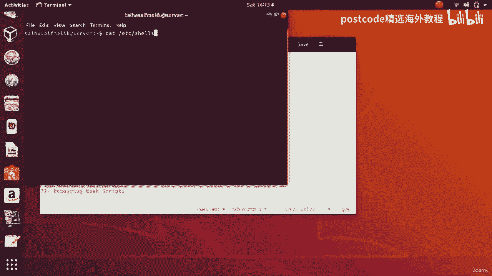

## 概述

在本节课中，我们将要学习Bash脚本编程的核心概念。我们将从基础开始，逐步深入到更高级的主题，包括变量、条件语句、循环、函数、数组、文件操作、调试以及与其他工具（如`curl`、`grep`、`awk`、`sed`）的集成。本教程旨在让初学者能够轻松理解并掌握Bash脚本的编写。

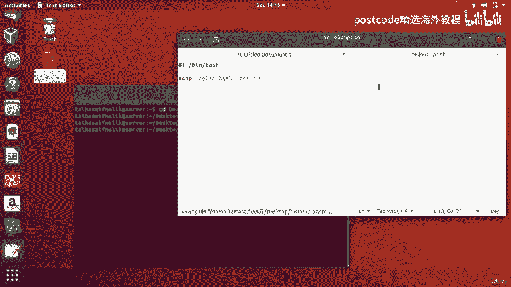

---

## Bash脚本编程：1：Hello Bash脚本

首先，我们来了解什么是Bash脚本，并创建一个简单的脚本来打印“Hello Bash Scripting”。

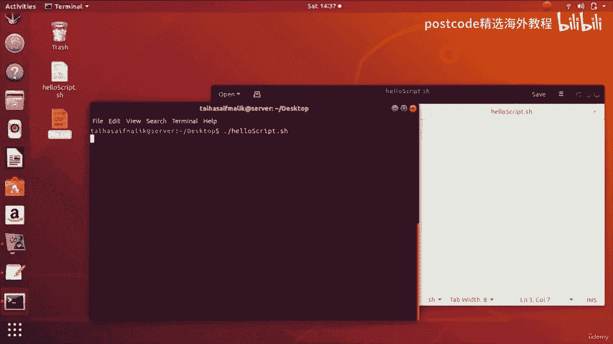

上一节我们介绍了课程概述，本节中我们来看看如何创建并运行第一个Bash脚本。

以下是创建和运行第一个脚本的步骤：

1.  **打开终端**：使用快捷键 `Ctrl+Alt+T` 打开终端。
2.  **确认Bash路径**：使用 `which bash` 命令确认Bash解释器的路径，通常是 `/bin/bash`。
3.  **创建脚本文件**：使用 `touch hello_script.sh` 命令在桌面创建一个脚本文件。
4.  **编写脚本**：在文件中写入以下内容：
    ```bash
    #!/bin/bash
    echo "Hello Bash Scripting"
    ```
    第一行 `#!/bin/bash` 是shebang，它告诉系统使用哪个解释器来执行此脚本。
5.  **赋予执行权限**：使用 `chmod +x hello_script.sh` 命令使脚本可执行。
6.  **运行脚本**：使用 `./hello_script.sh` 命令执行脚本，你将看到输出“Hello Bash Scripting”。

---

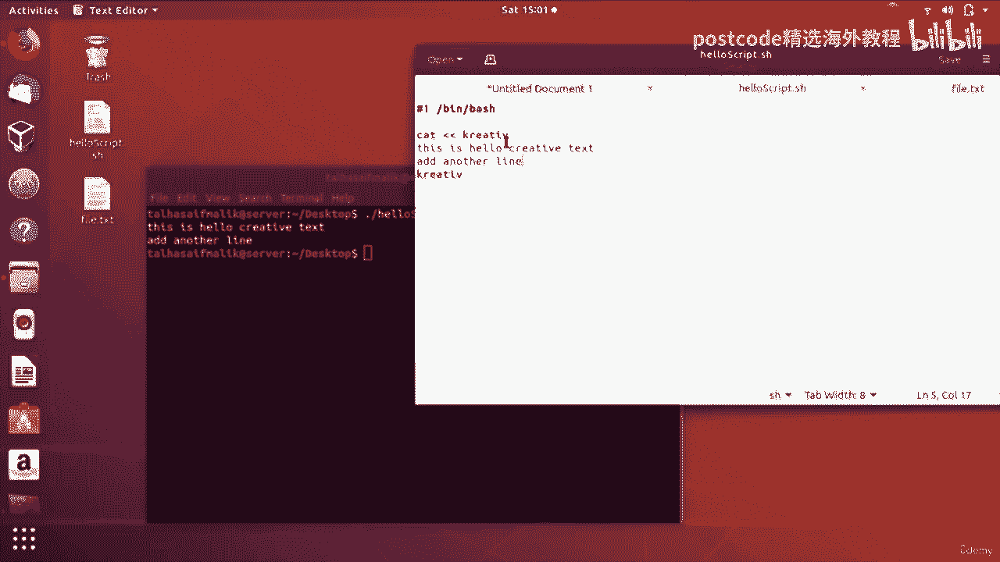

## Bash脚本编程：2：重定向输出到文件

在上一节我们创建了第一个脚本，本节中我们来看看如何将脚本的输出捕获并保存到文件中。

以下是重定向输出的方法：

*   **覆盖写入文件**：使用 `>` 符号可以将命令的输出覆盖写入到指定文件。
    *   例如：`./hello_script.sh > output.txt` 会将脚本的输出写入（或覆盖）`output.txt`文件。
*   **追加到文件**：使用 `>>` 符号可以将命令的输出追加到指定文件的末尾。
    *   例如：`./hello_script.sh >> output.txt` 会将脚本的输出追加到`output.txt`文件的末尾。

此外，`cat`命令结合重定向可以从终端读取输入并写入文件：
```bash
#!/bin/bash
cat > file.txt
```
运行此脚本后，你在终端输入的所有内容（按`Ctrl+D`结束）都会被保存到`file.txt`中。使用 `cat >> file.txt` 则可以追加内容。

---

## Bash脚本编程：3：注释

注释用于解释代码，对脚本的执行没有影响。在Bash中，有两种主要的注释方式。

上一节我们学习了输出重定向，本节中我们来看看如何在脚本中添加注释。

以下是添加注释的方法：

*   **单行注释**：使用 `#` 符号。`#` 之后直到行尾的所有内容都会被忽略。
    *   例如：`# 这是一个单行注释`
*   **多行注释**：虽然Bash没有专门的多行注释语法，但可以通过 `: '` 和 `'` 来模拟。
    *   例如：
        ```bash
        : '
        这是第一行注释。
        这是第二行注释。
        这是第三行注释。
        '
        ```
*   **Here Document**：这是一种特殊的语法，可以将多行文本块作为命令的输入，常用于生成文件或显示多行信息。它使用一个自定义的“分隔符”来标记文本块的开始和结束。
    *   语法：
        ```bash
        cat << DELIMITER
        文本行1
        文本行2
        DELIMITER
        ```
    *   例如，在脚本中：
        ```bash
        #!/bin/bash
        cat << CREATIVE
        这是第一行文本。
        这是第二行文本。
        CREATIVE
        ```
        运行脚本会输出两行文本。

---

## Bash脚本编程：4：条件语句

条件语句允许脚本根据不同的条件执行不同的代码块。Bash支持 `if`、`if-else`、`if-elif-else` 以及 `case` 语句。

上一节我们介绍了注释，本节中我们来看看如何使用条件语句来控制程序流程。

以下是条件语句的用法：

*   **`if` 语句**：检查一个条件，如果为真则执行代码块。
    *   语法：
        ```bash
        if [ 条件 ]
        then
            # 条件为真时执行的命令
        fi
        ```
    *   示例：
        ```bash
        count=10
        if [ $count -eq 10 ]
        then
            echo “条件为真”
        fi
        ```
*   **`if-else` 语句**：如果 `if` 条件为假，则执行 `else` 块。
    *   语法：
        ```bash
        if [ 条件 ]
        then
            # 条件为真时执行的命令
        else
            # 条件为假时执行的命令
        fi
        ```
*   **`if-elif-else` 语句**：检查多个条件。
    *   语法：
        ```bash
        if [ 条件1 ]
        then
            # 条件1为真时执行
        elif [ 条件2 ]
        then
            # 条件2为真时执行
        else
            # 所有条件都为假时执行
        fi
        ```
*   **比较运算符**：
    *   `-eq`：等于
    *   `-ne`：不等于
    *   `-gt`：大于
    *   `-lt`：小于
    *   `-ge`：大于等于
    *   `-le`：小于等于
    *   也可以使用数学符号 `(( ))`，例如：`if (( $count > 9 ))`
*   **逻辑运算符**：
    *   **与运算符 (`&&` 或 `-a`)**：两个条件都必须为真。
        *   示例：`if [ $age -gt 18 -a $age -lt 40 ]` 或 `if [[ $age -gt 18 && $age -lt 40 ]]`
    *   **或运算符 (`||` 或 `-o`)**：两个条件中至少一个为真。
        *   示例：`if [ $age -gt 40 -o $age -lt 18 ]` 或 `if [[ $age -gt 40 || $age -lt 18 ]]`
*   **`case` 语句**：用于匹配多个值，类似于多个 `if-elif` 语句。
    *   语法：
        ```bash
        case $变量 in
            模式1)
                命令1
                ;;
            模式2)
                命令2
                ;;
            *)
                默认命令
                ;;
        esac
        ```

---

## Bash脚本编程：5：循环

循环用于重复执行一段代码。Bash支持 `while`、`until` 和 `for` 循环，以及控制循环的 `break` 和 `continue` 语句。

上一节我们学习了条件判断，本节中我们来看看如何使用循环来重复执行任务。

以下是循环的用法：

*   **`while` 循环**：只要条件为真，就重复执行代码块。
    *   语法：
        ```bash
        while [ 条件 ]
        do
            # 要执行的命令
        done
        ```
    *   示例：打印1到10的数字。
        ```bash
        number=1
        while [ $number -le 10 ]
        do
            echo $number
            number=$((number + 1))
        done
        ```
*   **`until` 循环**：重复执行代码块，直到条件变为真。
    *   语法：
        ```bash
        until [ 条件 ]
        do
            # 要执行的命令
        done
        ```
    *   示例：打印1到9的数字。
        ```bash
        number=1
        until [ $number -ge 10 ]
        do
            echo $number
            number=$((number + 1))
        done
        ```
*   **`for` 循环**：遍历一个列表或范围。
    *   **遍历列表**：
        ```bash
        for i in 1 2 3 4 5
        do
            echo $i
        done
        ```
    *   **遍历范围**：
        ```bash
        for i in {0..20..2} # 从0到20，步长为2
        do
            echo $i
        done
        ```
    *   **C语言风格**：
        ```bash
        for (( i=0; i<5; i++ ))
        do
            echo $i
        done
        ```
*   **`break` 语句**：立即终止循环。
    *   示例：当 `i` 大于5时跳出循环。
        ```bash
        for (( i=0; i<=10; i++ ))
        do
            if (( $i > 5 ))
            then
                break
            fi
            echo $i
        done
        ```
*   **`continue` 语句**：跳过当前循环的剩余部分，直接开始下一次循环。
    *   示例：跳过数字3和7。
        ```bash
        for (( i=0; i<=10; i++ ))
        do
            if [ $i -eq 3 ] || [ $i -eq 7 ]
            then
                continue
            fi
            echo $i
        done
        ```

---

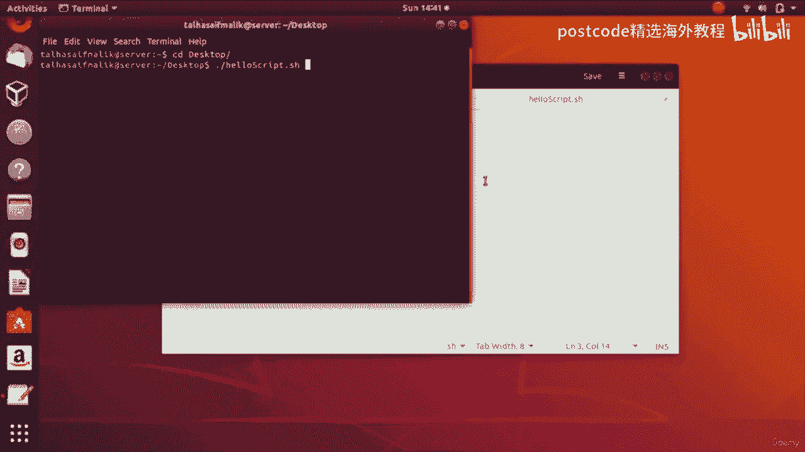

## Bash脚本编程：6：脚本输入

脚本可以接收用户输入的参数，这些参数在脚本内部通过特殊变量进行访问。

上一节我们探讨了各种循环，本节中我们来看看如何让脚本接收外部输入。

以下是处理脚本输入的方法：

*   **位置参数**：`$0`、`$1`、`$2`... 分别代表脚本名、第一个参数、第二个参数等。
    *   示例：`./script.sh BMW Honda Toyota`
        *   `$0` = `./script.sh`
        *   `$1` = `BMW`
        *   `$2` = `Honda`
        *   `$3` = `Toyota`
*   **所有参数**：
    *   `$@` 或 `${@}`：将所有参数视为独立的个体，通常用于遍历。
    *   `$*`：将所有参数视为一个整体字符串。
*   **参数个数**：`$#` 表示传递给脚本的参数个数。
*   **从文件读取输入**：使用 `while` 循环和 `read` 命令可以逐行读取文件内容。
    *   示例：读取作为参数传入的文件。
        ```bash
        #!/bin/bash
        while read -r line
        do
            echo "$line"
        done < "$1"
        ```
        运行：`./script.sh filename.txt`

---

## Bash脚本编程：7：脚本输出

在Linux中，命令通常有两种输出：标准输出（stdout）和标准错误（stderr）。我们可以分别对它们进行重定向。

上一节我们学习了如何向脚本传递输入，本节中我们来看看如何管理和重定向脚本的输出。

以下是管理脚本输出的方法：

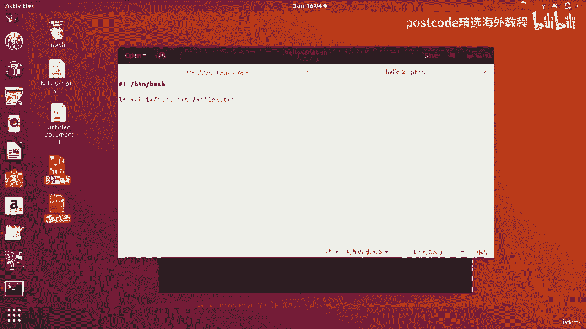

*   **标准输出重定向**：使用 `>` 或 `1>` 将标准输出重定向到文件。
    *   示例：`ls -l > output.txt`
*   **标准错误重定向**：使用 `2>` 将标准错误重定向到文件。
    *   示例：`ls +l 2> error.txt`
*   **同时重定向两者**：
    *   到同一个文件：`command &> file.txt` 或 `command > file.txt 2>&1`
    *   到不同文件：`command > output.txt 2> error.txt`

---

## Bash脚本编程：8：管道与脚本间通信

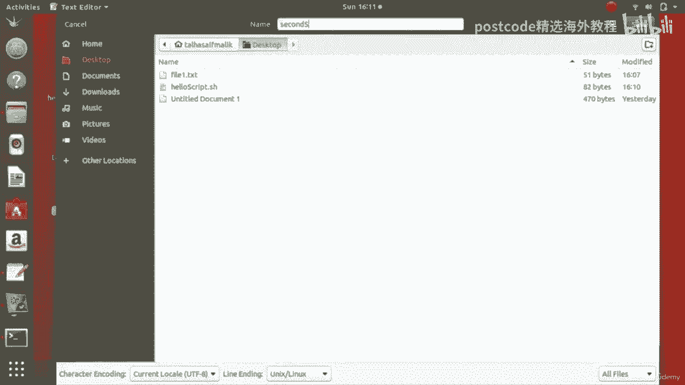

管道（`|`）可以将一个命令的输出作为另一个命令的输入。我们也可以在一个脚本中设置变量，然后在另一个脚本中使用它。

上一节我们处理了脚本的输出，本节中我们来看看如何连接不同的命令和脚本。

以下是管道和脚本间通信的方法：

*   **管道**：连接两个命令。
    *   示例：`ls -l | grep ".txt"` 列出当前目录下的所有txt文件。
*   **脚本间传递变量**：使用 `export` 命令可以将变量导出到子shell环境。
    *   **脚本1 (hello_script.sh)**：
        ```bash
        #!/bin/bash
        message="Hello Linux Hint Audience"
        export message
        ./second_script.sh
        ```
    *   **脚本2 (second_script.sh)**：
        ```bash
        #!/bin/bash
        echo "Message from hello script is: $message"
        ```
    *   运行 `./hello_script.sh`，第二个脚本将能访问 `message` 变量。

---

## Bash脚本编程：9：字符串处理

Bash提供了丰富的字符串操作功能，包括比较、拼接、大小写转换等。

上一节我们连接了命令和脚本，本节中我们来看看如何处理文本数据中的字符串。

以下是字符串处理的方法：

*   **字符串比较**：
    *   `=` 或 `==`：相等
    *   `!=`：不相等
    *   `<`：小于（按字典顺序）
    *   `>`：大于（按字典顺序）
    *   `-z`：字符串长度为0（空）
    *   `-n`：字符串长度非0
    *   示例：
        ```bash
        if [ "$str1" = "$str2" ]; then
            echo "字符串匹配"
        fi
        ```
*   **字符串拼接**：直接将变量放在一起。
    *   示例：`result="$str1$str2"`
*   **大小写转换**：
    *   转大写：`${str^^}`
    *   转小写：`${str,,}`
    *   首字母大写：`${str^}`

---

## Bash脚本编程：10：数字与算术运算

Bash可以执行基本的算术运算。有两种主要方法：使用 `$(( ))` 或 `expr` 命令。

上一节我们处理了字符串，本节中我们来看看如何对数字进行计算。

以下是进行算术运算的方法：

*   **使用 `$(( ))`**：
    *   示例：
        ```bash
        n1=4
        n2=20
        echo $((n1 + n2)) # 加法
        echo $((n1 - n2)) # 减法
        echo $((n1 * n2)) # 乘法
        echo $((n1 / n2)) # 除法 (整数)
        echo $((n1 % n2)) # 取模
        ```
*   **使用 `expr`**：
    *   示例：`expr $n1 + $n2`
    *   注意：乘法符号 `*` 需要转义：`expr $n1 \* $n2`
*   **进制转换**：使用 `bc` 计算器。
    *   示例：将十六进制数转换为十进制。
        ```bash
        echo "obase=10; ibase=16; FFFF" | bc
        ```
        输出：65535

---

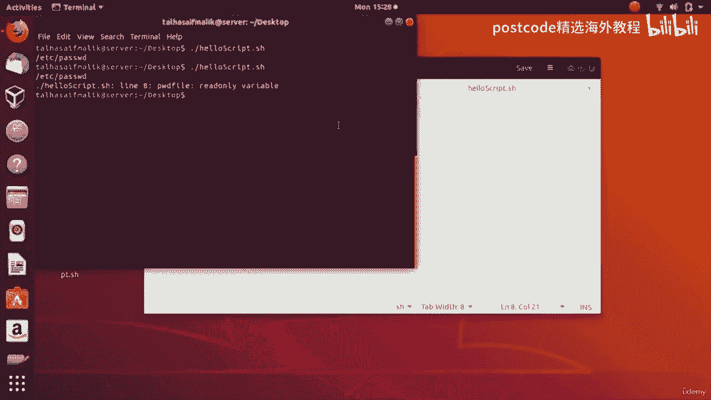

## Bash脚本编程：11：declare命令

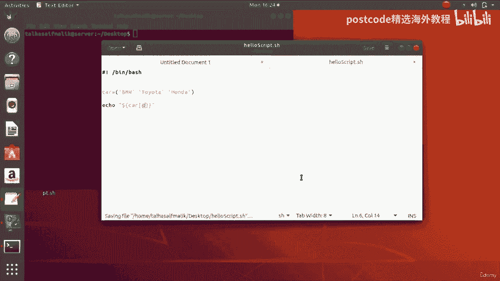

`declare` 是Bash的内置命令，用于声明变量并设置其属性（如只读、整数类型等）。Bash本身是弱类型语言，但 `declare` 可以提供类似强类型的行为。

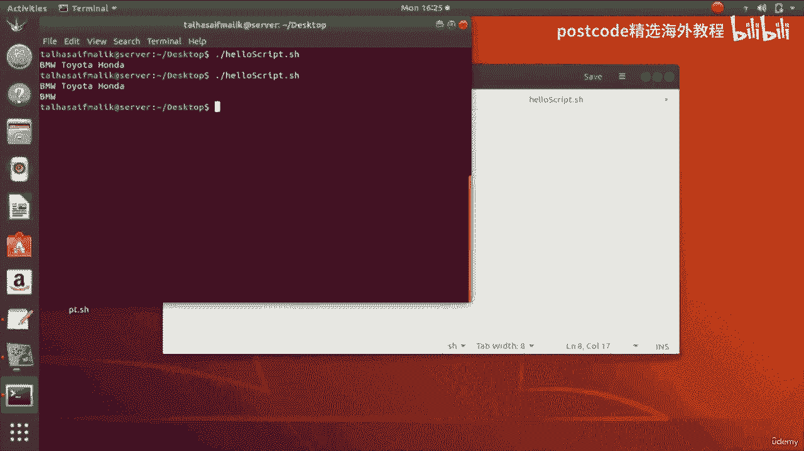

上一节我们进行了算术运算，本节中我们来看看如何更精确地控制变量的特性。

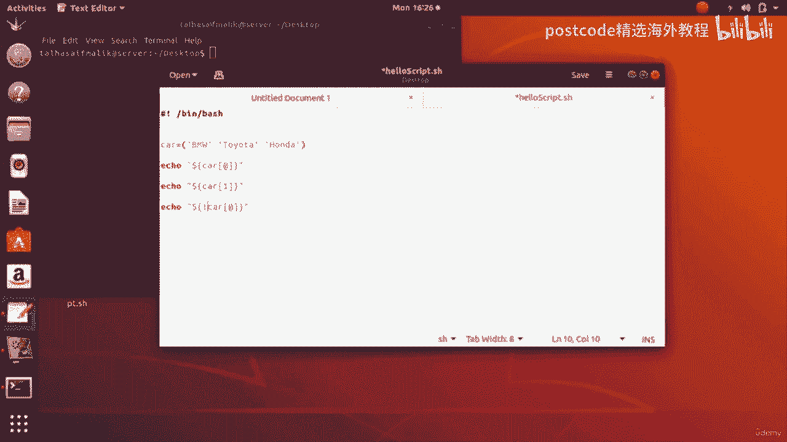

以下是 `declare` 命令的用法：

*   **查看所有变量**：`declare -p`
*   **声明变量**：`declare my_variable=22`
*   **声明只读变量**：`declare -r PWD_FILE="/etc/passwd"`
    *   尝试修改只读变量会导致错误。
*   **声明整数变量**：`declare -i num=5`
    *   尝试将字符串赋给整数变量会得到0。

---

## Bash脚本编程：12：数组

数组用于在单个变量中存储多个值。Bash支持一维数组。

上一节我们使用 `declare` 定义了变量属性，本节中我们来看看如何存储和操作一组相关的值——数组。

以下是数组的用法：

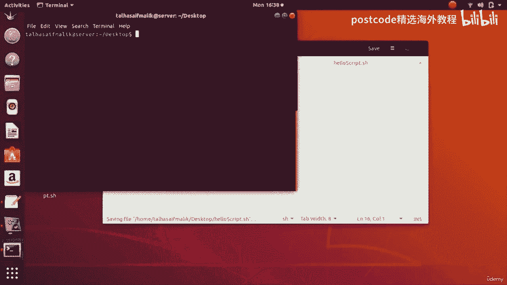

*   **声明数组**：
    ```bash
    cars=("BMW" "Toyota" "Honda")
    ```
*   **访问数组元素**：
    *   所有元素：`echo "${cars[@]}"`
    *   通过索引（从0开始）：`echo "${cars[0]}"` # 输出 BMW
*   **获取数组长度**：`echo "${#cars[@]}"`
*   **获取数组索引**：`echo "${!cars[@]}"`
*   **修改数组**：
    *   添加元素：`cars+=("Mercedes")`
    *   删除元素：`unset cars[2]` # 删除索引为2的元素
    *   修改元素：`cars[1]="Ford"`

---

## Bash脚本编程：13：函数

函数是一段可重复使用的代码块。使用函数可以使脚本更模块化、更易读和维护。

上一节我们学习了如何组织多个值到数组中，本节中我们来看看如何将代码块组织成可重用的函数。

以下是函数的用法：

*   **定义函数**：
    ```bash
    function function_name {
        # 函数体
        commands
    }
    ```
    或
    ```bash
    function_name() {
        # 函数体
        commands
    }
    ```
*   **调用函数**：直接使用函数名：`function_name`
*   **函数参数**：在函数内部，使用 `$1`、`$2`... 来访问传递给函数的参数。
    *   示例：
        ```bash
        function print_args {
            echo "第一个参数: $1"
            echo "第二个参数: $2"
        }
        print_args "Hello" "World"
        ```
*   **局部变量**：在函数内部使用 `local` 关键字声明的变量只在函数内部可见。
    *   示例：
        ```bash
        function test_local {
            local local_var="I am local"
            echo "函数内: $local_var"
        }
        test_local
        echo "函数外: $local_var" # 这里将输出空
        ```

---

## Bash脚本编程：14：文件与目录操作

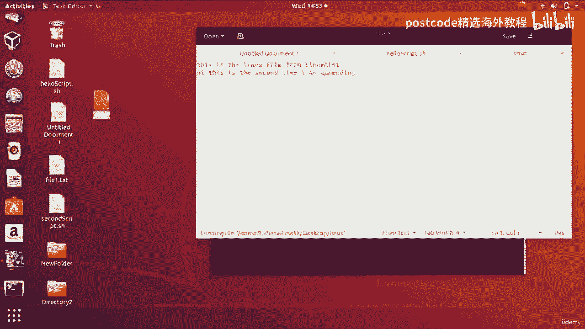

脚本经常需要与文件系统交互，例如创建、检查、读取、修改和删除文件或目录。

上一节我们将代码封装成了函数，本节中我们来看看如何使用脚本自动化地管理文件和目录。

以下是文件与目录操作的常见任务：

*   **创建目录**：`mkdir -p dir_name` （`-p` 确保父目录存在，避免错误）
*   **检查目录是否存在**：`if [ -d "$dir_name" ]; then ... fi`
*   **创建文件**：`touch file_name`
*   **检查文件是否存在**：`if [ -f "$file_name" ]; then ... fi`
*   **向文件追加文本**：`echo "text" >> file_name`
*   **替换文件内容**：`echo "new text" > file_name`
*   **逐行读取文件**：
    ```bash
    while IFS= read -r line
    do
        echo "$line"
    done < "$file_name"
    ```
*   **删除文件**：`rm file_name`

---

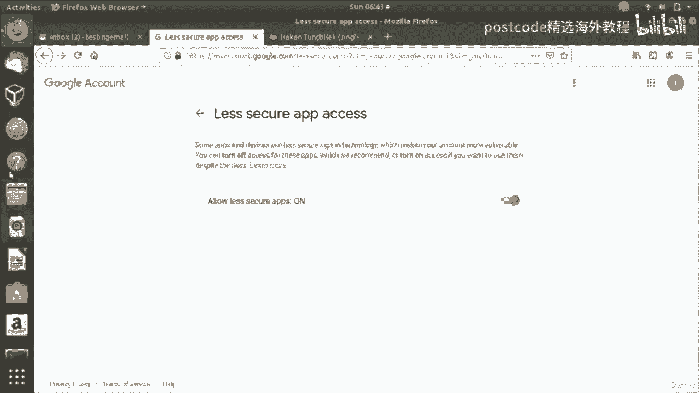

## Bash脚本编程：15：通过脚本发送邮件

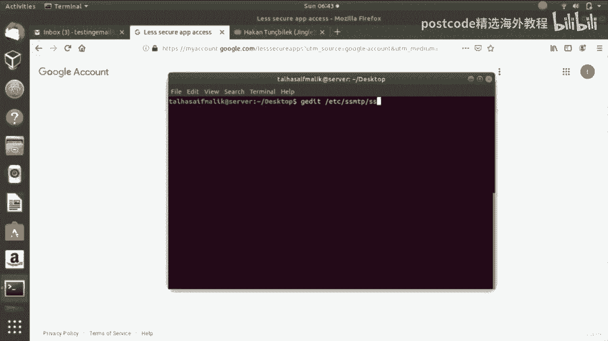

可以使用脚本自动发送电子邮件。一个简单的方法是使用 `ssmtp` 工具。

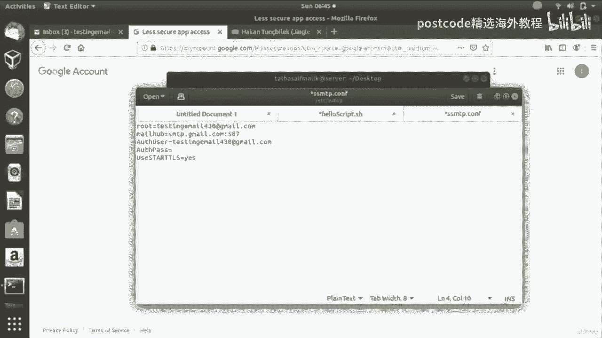

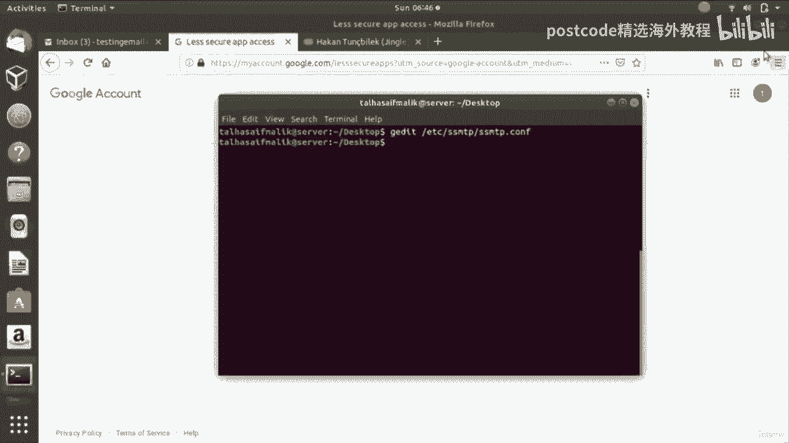

上一节我们自动化了文件操作，本节中我们来看看如何让脚本与外部服务（如电子邮件）进行交互。

以下是使用 `ssmtp` 发送邮件的步骤：

1.  **安装 ssmtp**：`sudo apt install ssmtp`
2.  **配置Gmail（或其他服务）**：
    *   在Google账户中启用“安全性较低的应用的访问权限”。
    *   编辑配置文件 `/etc/ssmtp/ssmtp.conf`，设置邮件服务器、端口、用户名和密码。
3.  **在脚本中发送邮件**：
    ```bash
    #!/bin/bash
    ssmtp recipient@email.com << EOF
    To: recipient@email.com
    From: sender@email.com
    Subject: 邮件主题

    邮件正文内容。
    EOF
    ```
    *   注意：出于安全考虑，建议使用专门的测试账户。

---

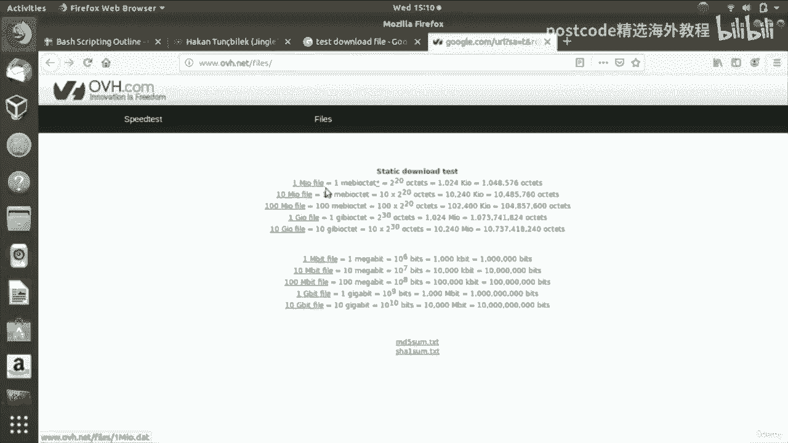

## Bash脚本编程：16：在脚本中使用curl

`curl` 是一个强大的命令行工具，用于传输数据。它常用于从网上下载文件或与API交互。

上一节脚本学会了发送邮件，本节中我们来看看如何让脚本从互联网获取数据。

以下是 `curl` 在脚本中的用法：

*   **下载文件**：
    *   使用原始文件名：`curl -O http://example.com/file.zip`
    *   指定新文件名：`curl -o newfile.zip http://example.com/file.zip`
*   **仅获取HTTP头信息**：`curl -I http://example.com`
    *   这在你决定是否下载大文件之前检查文件信息（如大小、类型）时非常有用。

---

## Bash脚本编程：17：创建专业菜单

使用 `select` 循环可以轻松创建交互式文本菜单。我们还可以让脚本等待用户输入。

上一节脚本能够获取网络数据，本节中我们来看看如何创建用户友好的交互界面。

以下是创建菜单的方法：

*   **`select` 循环**：自动生成带编号的选项列表。
    *   示例：
        ```bash
        select car in BMW Mercedes Tesla Rover Toyota
        do
            case $car in
                BMW)
                    echo "BMW selected"
                    ;;
                Mercedes)
                    echo "Mercedes selected"
                    ;;
                *)
                    echo "Error: Please select between 1 and 5"
                    ;;
            esac
        done
        ```
*   **等待用户输入**：使用 `read -t` 命令可以设置一个超时等待用户按键。
    *   示例：每3秒提醒一次，直到用户按下任意键。
        ```bash
        echo "Press any key to continue..."
        while true; do
            read -t 3 -n 1
            if [ $? = 0 ]; then
                echo "You have terminated the script."
                exit
            else
                echo "Waiting for you to press the key, sir."
            fi
        done
        ```

---

## Bash脚本编程：18：使用inotify等待文件系统事件

`inotify` 是Linux内核的一个子系统，可以监控文件或目录的变化（如创建、修改、删除）。`inotify-tools` 包提供了命令行工具 `inotifywait`。

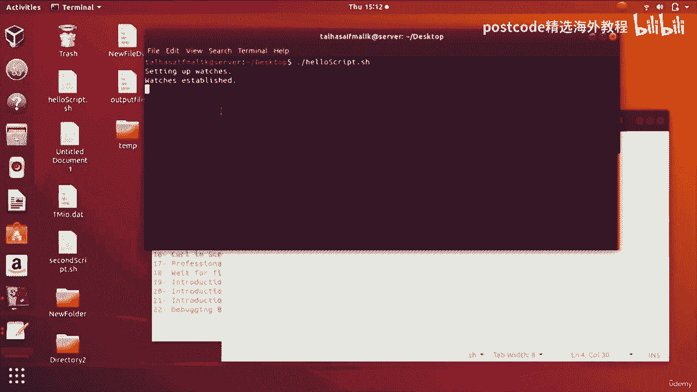

上一节我们创建了交互菜单，本节中我们来看看如何让脚本实时监控文件系统的变化。

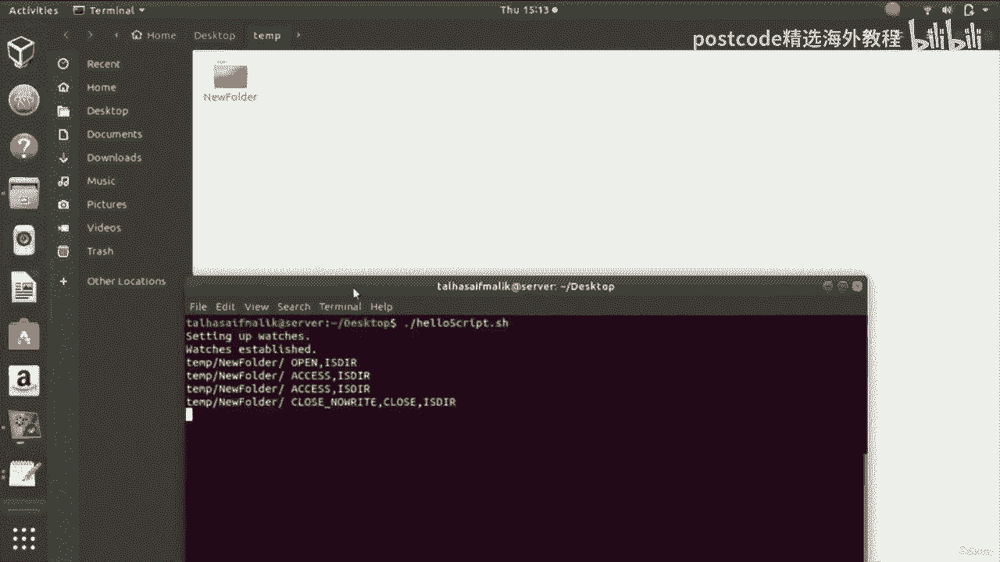

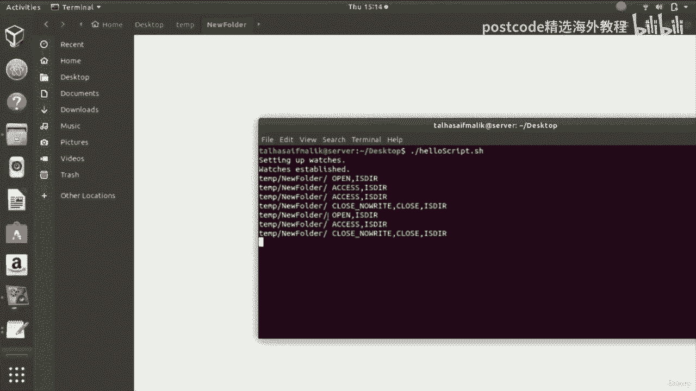

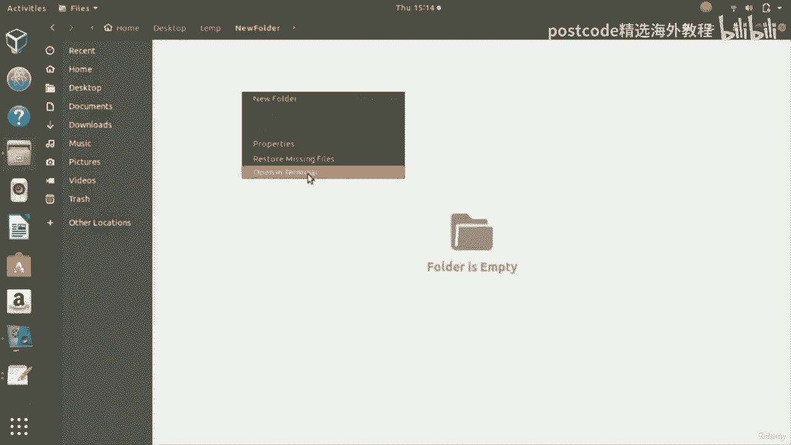

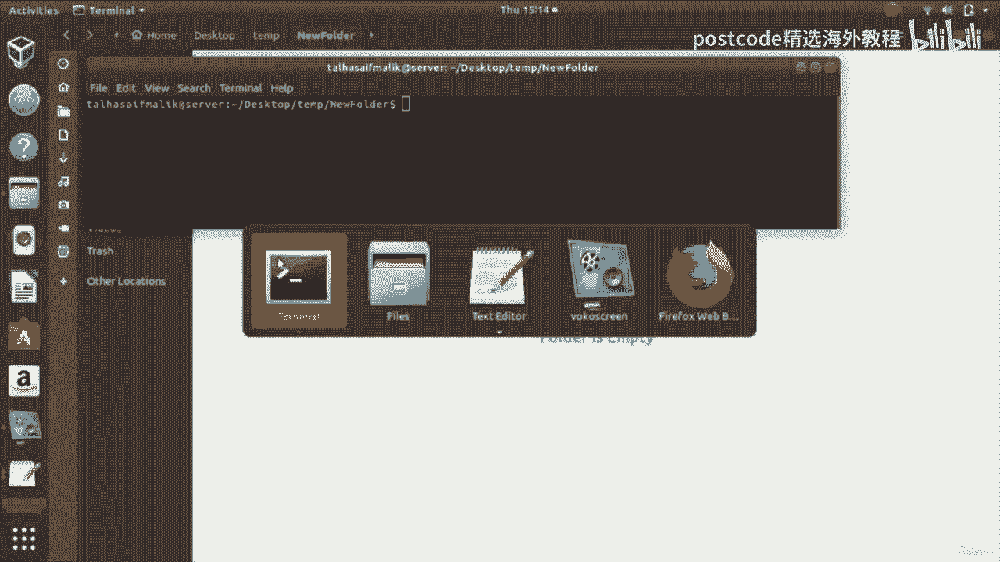

以下是使用 `inotifywait` 的基本步骤：

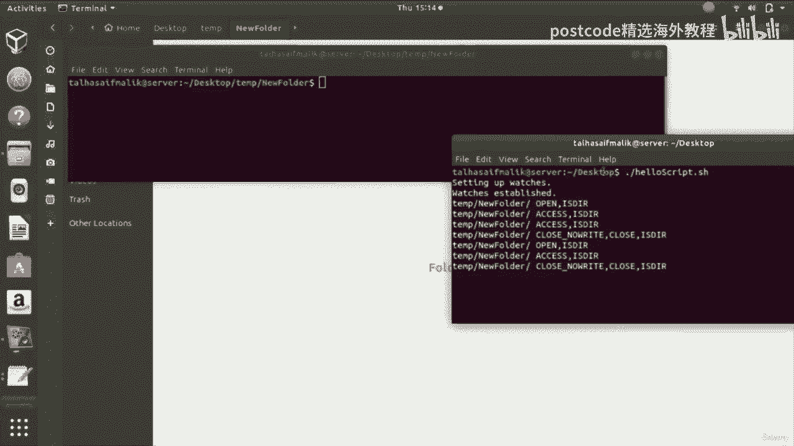

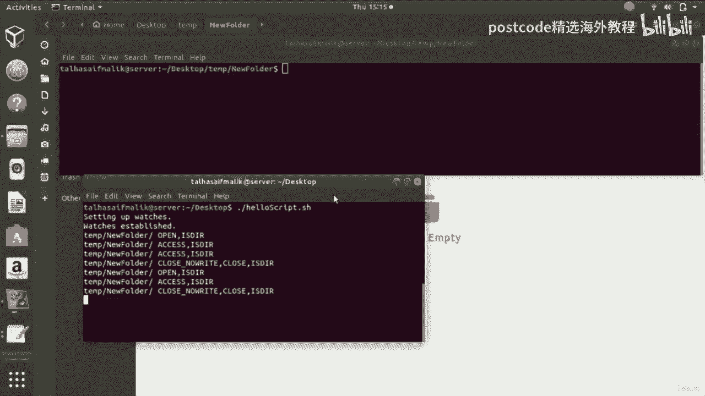

1.  **安装工具**：`sudo apt install inotify-tools`
2.  **监控目录**：
    ```bash
    #!/bin/bash
    inotifywait -m /path/to/directory
    ```
    *   `-m` 表示持续监控。
    *   运行后，脚本会输出发生在该目录下的所有事件（如 `OPEN`、`MODIFY`、`CREATE`、`DELETE`）。

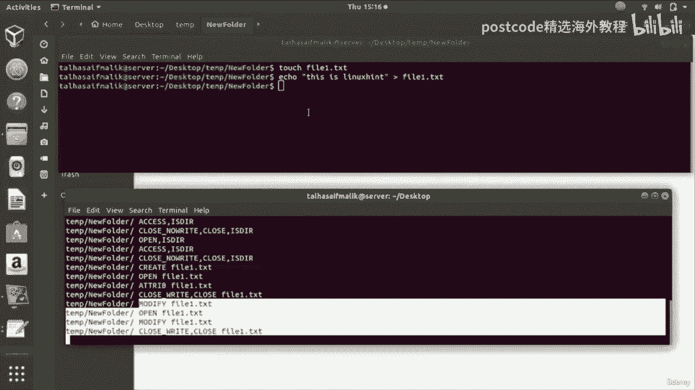

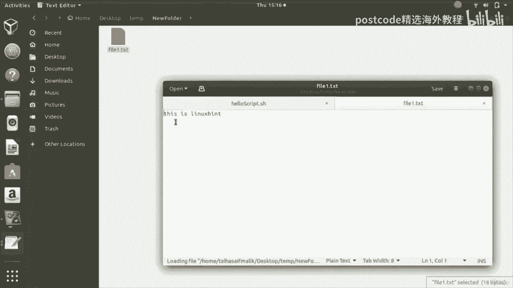

---

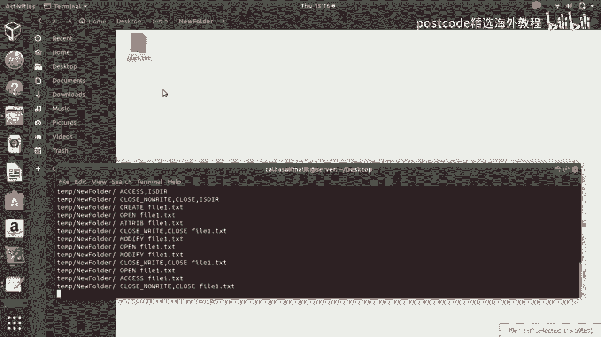

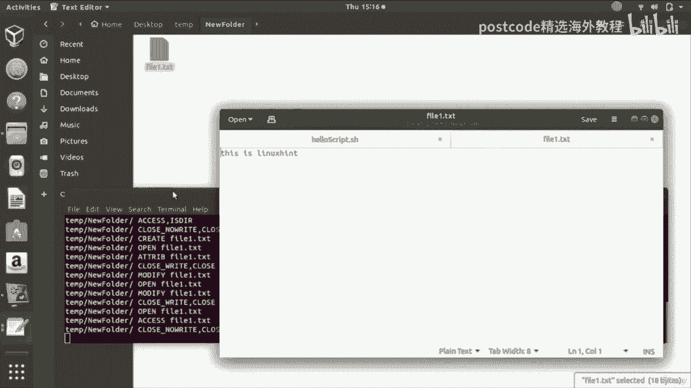

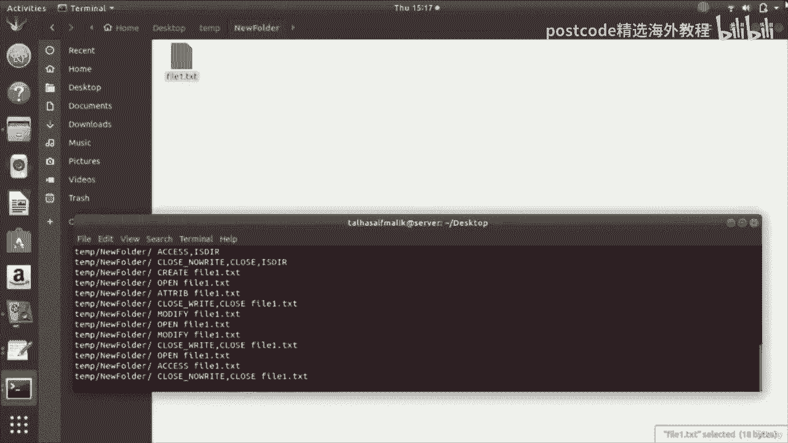

## Bash脚本编程：19：grep命令简介

`grep` 是一个强大的文本搜索工具，它使用正则表达式在文件中搜索匹配的行。

上一节脚本可以监控文件变化，本节中我们来看看如何在文件中快速搜索和过滤文本。

以下是 `grep` 的常用选项：

*   **基本搜索**：`grep "pattern" file.txt`
*   **忽略大小写**：`grep -i "pattern" file.txt`
*   **显示行号**：`grep -n "pattern" file.txt`
*   **统计匹配行数**：`grep -c "pattern" file.txt`
*   **显示不匹配的行**：`grep -v "pattern" file.txt`
*   **递归搜索目录**：`grep -r "pattern" /path/to/dir`

---

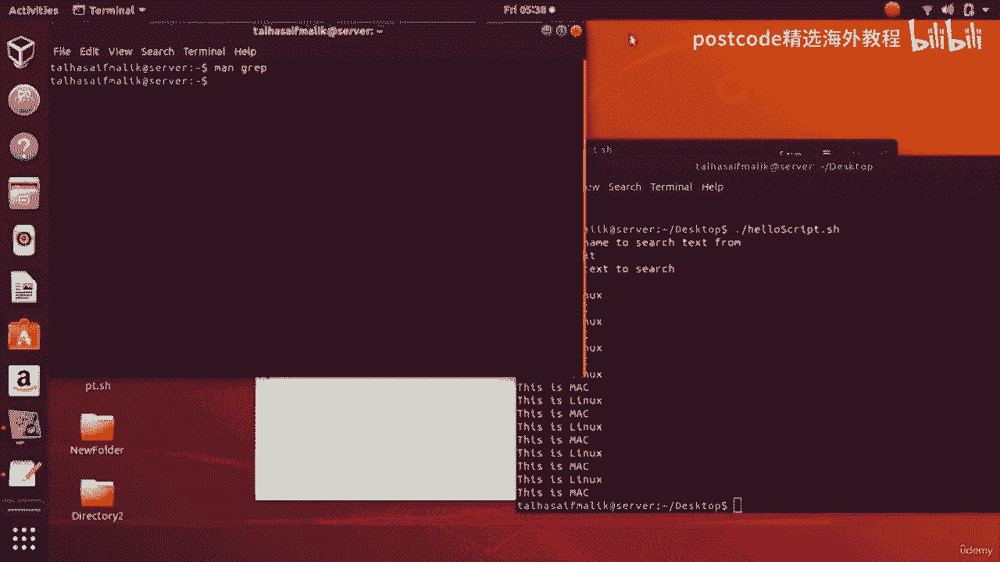

## Bash脚本编程：20：awk命令简介

`awk` 不仅仅是一个命令，它是一门功能完整的文本处理编程语言。它擅长处理结构化文本数据（如日志、CSV文件），可以按字段进行分割、计算和格式化输出。

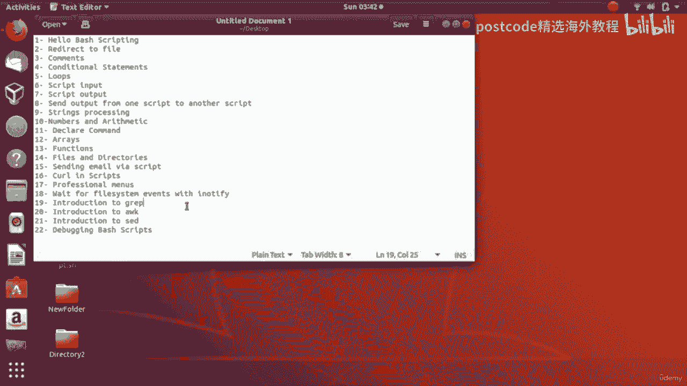

上一节我们用 `grep` 进行搜索，本节中我们来看看更强大的文本处理工具 `awk`。

以下是 `awk` 的基本用法：

*   **打印整个文件**：`awk '{print}' file.txt`
*   **打印特定字段**：默认以空格或制表符分隔字段，`$1`、`$2`... 分别代表第1、2...个字段。
    *   示例：`awk '{print $1, $3}' file.txt` # 打印每行的第1和第3个字段
*   **匹配模式后打印**：`awk '/Windows/ {print}' file.txt` # 打印包含“Windows”的行
*   **内置变量**：
    *   `NR`：当前行号。
    *   `NF`：当前行的字段数。
    *   示例：`awk '{print NR, NF, $0}' file.txt` # 打印行号、字段数和整行内容

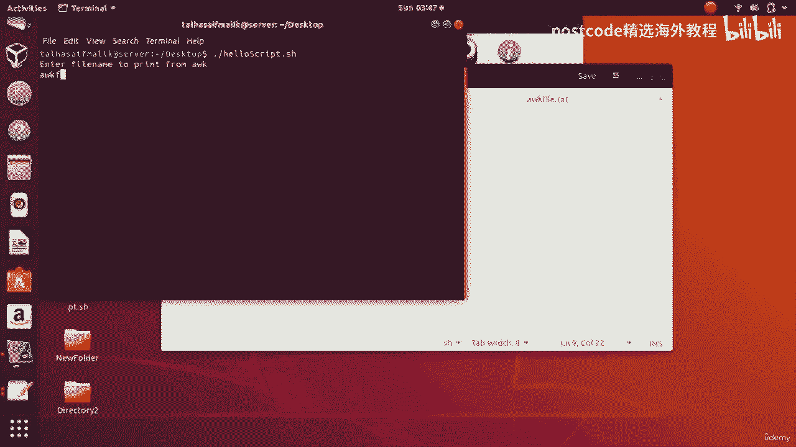

---

## Bash脚本编程：21：sed命令简介

`sed`（流编辑器）用于对文本进行基本的转换和处理。它最常用的功能是文本替换。

上一节我们介绍了 `awk` 的文本处理能力，本节中我们来看看另一个流编辑器 `sed`，它特别擅长查找和替换。

以下是 `sed` 的基本用法：

*   **替换文本（输出到屏幕）**：`sed 's/old/new/' file.txt`
    *   这会将每行中第一个匹配的“old”替换为“new”，但**不修改原文件**。
*   **全局替换**：`sed 's/old/new/g' file.txt`
    *   `g` 标志表示替换行内所有匹配项。
*   **直接修改文件（谨慎使用）**：`sed -i 's/old/new/g' file.txt`
    *   `-i` 选项会直接修改原文件。建议先备份。
*   **使用其他分隔符**：如果模式中包含 `/`，可以使用其他分隔符，如 `|` 或 `:`。
    *   示例：`sed 's|/old/path|/new/path|g' file.txt`

---

## Bash脚本编程：22：调试Bash脚本

当脚本行为异常或出错时，调试是找出问题根源的关键。Bash提供了几种调试方法。

上一节我们学习了文本处理工具，本节也是最后一节，我们来看看如何排查和修复脚本中的错误——即调试。

以下是调试Bash脚本的方法：

*   **在运行命令时调试**：`bash -x script.sh`
    *   `-x` 选项会打印脚本执行的每一行命令及其扩展后的参数，让你清楚地看到执行流程。
*   **在脚本内部启用调试**：在脚本开头添加 `set -x`，在结束调试的地方添加 `set +x`。
    *   这样可以只调试脚本的特定部分。
*   **组合使用**：你可以在命令行和脚本内部同时使用这些选项，进行更灵活的调试。

## 总结

在本节课中，我们一起学习了Bash脚本编程的广泛主题。我们从创建简单的“Hello World”脚本开始，逐步掌握了变量、条件判断、循环、函数、数组等核心编程概念。我们还学习了如何与文件系统交互、处理字符串和数字、接收用户输入、管理输出，以及如何集成强大的外部工具如 `curl`、`grep`、`awk` 和 `sed` 来增强脚本功能。最后，我们了解了调试脚本的技巧。通过本教程，你已经具备了编写实用Bash脚本的基础知识，可以尝试自动化日常任务或处理复杂的文本数据了。记住，实践是掌握编程的最佳途径，多写多练才能融会贯通。