# 红帽企业Linux RHEL 9精通课程 — RHCSA与RHCE 2023认证全指南 - P59：06-06-001 Bash completions - 精选海外教程postcode - BV1j64y1j7Zg

Hey， yo， this will be a quick video about the bash completion package。

 Bsh completion is a simple and extremely useful way to extend the context awareness of your shell built in tab completion。

 and it'll definitely come in handy on the RHCSA as well。 You can install bash completion like this。

 pseudo Yom install。😊，Dsh。

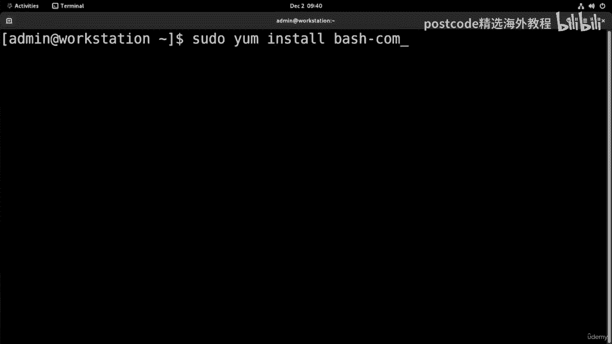

Comp。And just like that， we'll have it installed。

Bash completion installs itself into the ETC profile directory so we can just take a look at it like this。

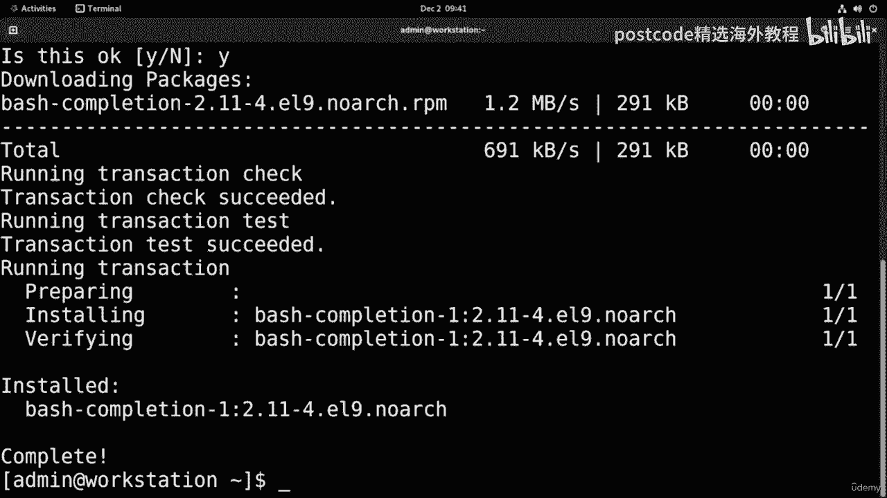

And there it is bash completion dot S， H。

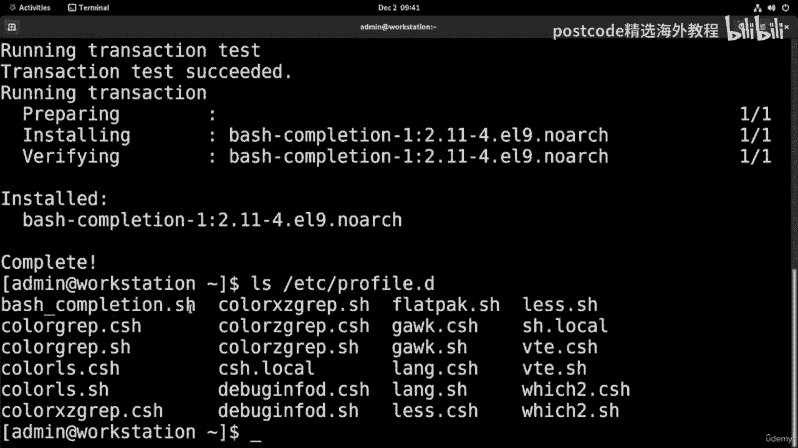

In new shells， bash completion will start working right away。

 but if we want it to start in our current shell， we can type in source。

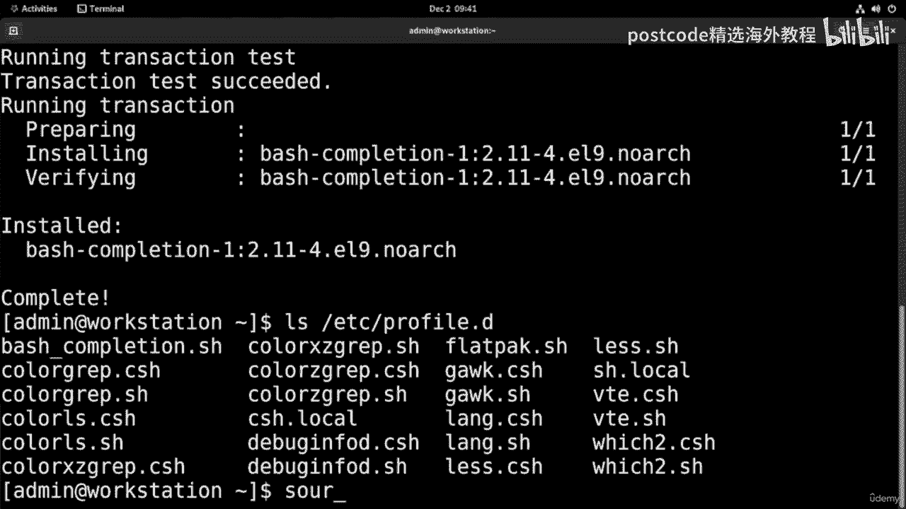

E T C profile， and that'll get it started up。

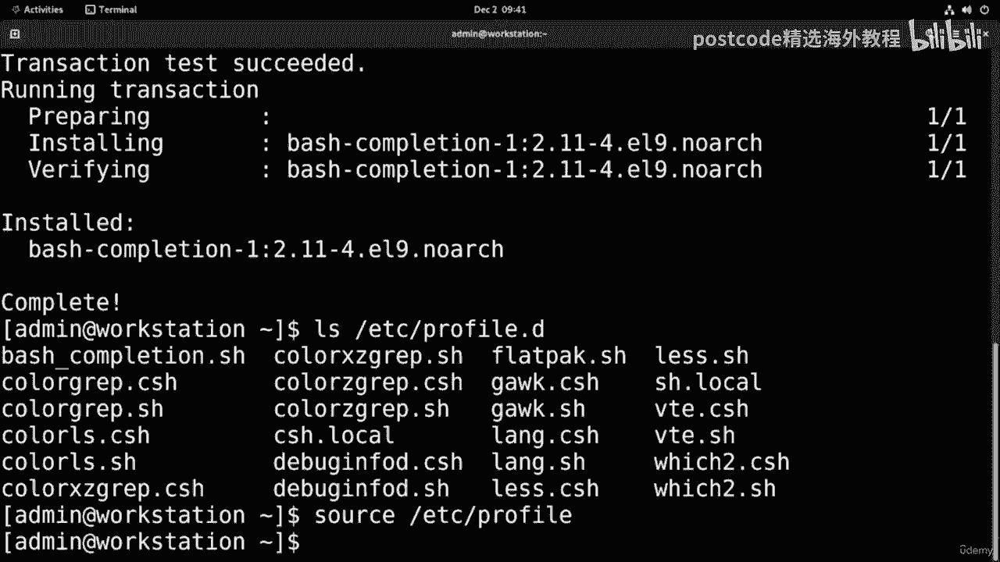

To demonstrate the usefulness， we can use the NM CI command。

 NM I has tons and tons of options as you drill down more and more。

 So it can be really handy to use bash completion to fill in those gaps。 And， I mean， check this out。

 We have 296 possible options for this command。

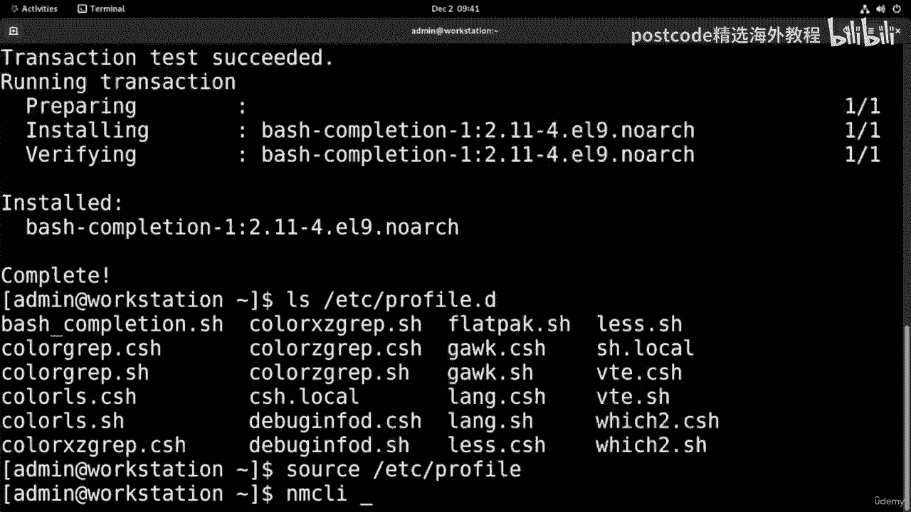

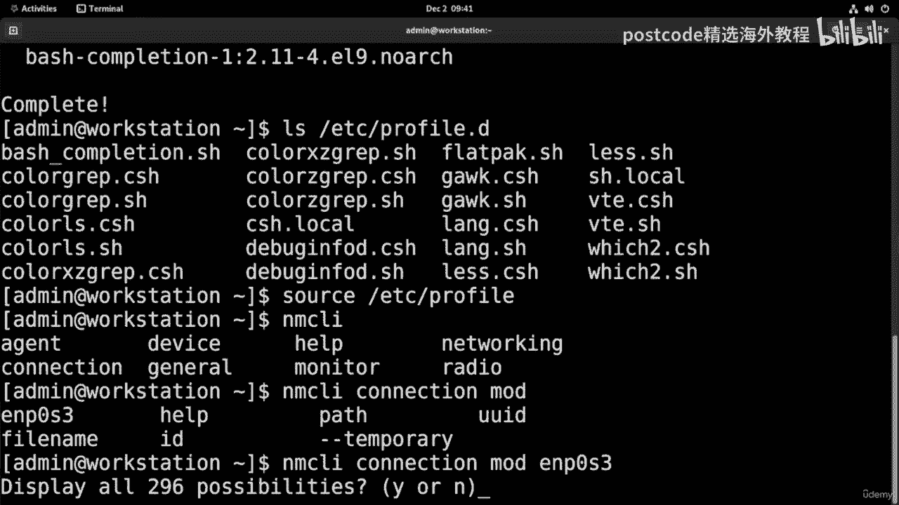

So no one's expected to memorize all of these。 So it's just really useful that it can fill everything in for you。

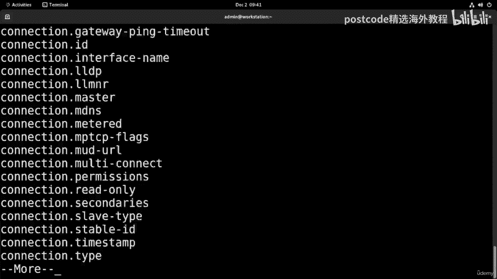

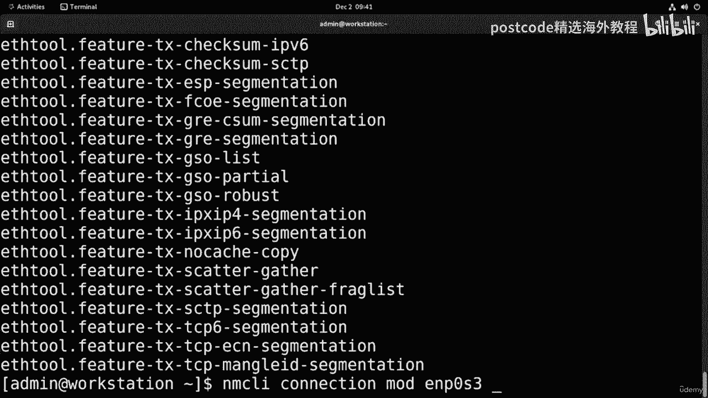

Now， in most cases， batch completion is really handy。

 but other times it can just be straight up annoying and really slow。 so if you ever need to。

 here's how to unload it。

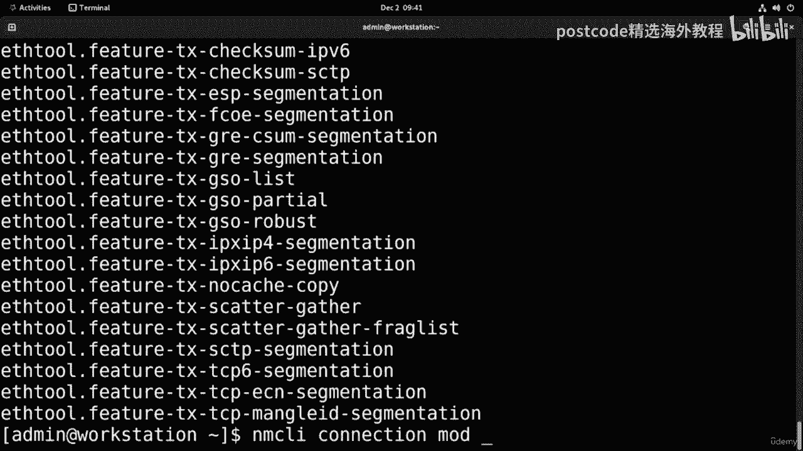

Just type in shop， dash you。Prod co。

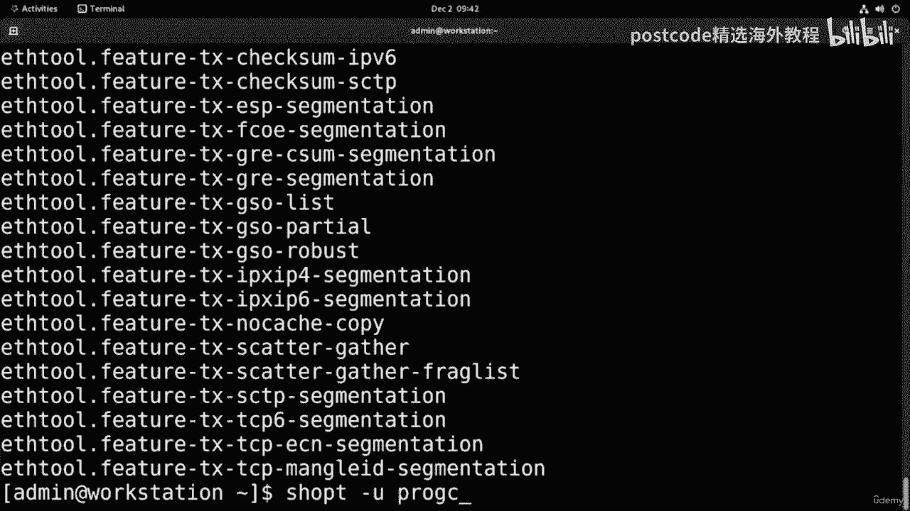

And this should unload ba completion。 So now if I go back to N C I。

 all I see are files and directories。

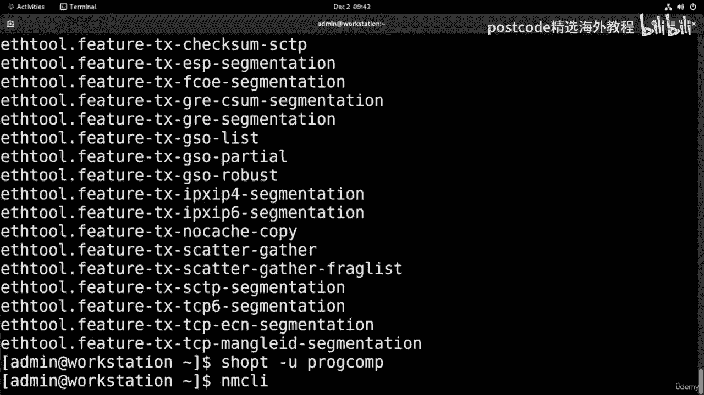

If you ever want to reload ba completion， just type in shop dash S。

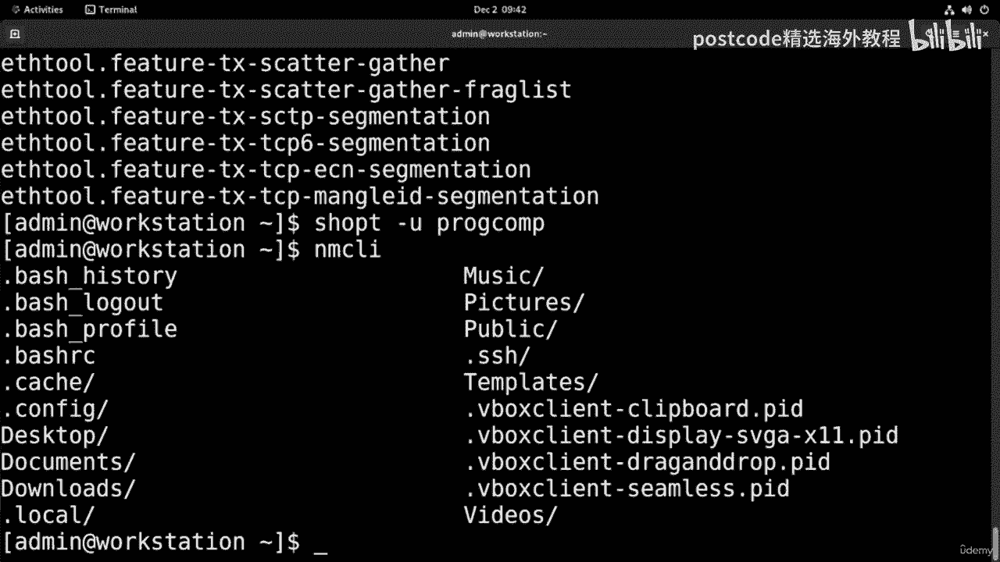

Prorog co。

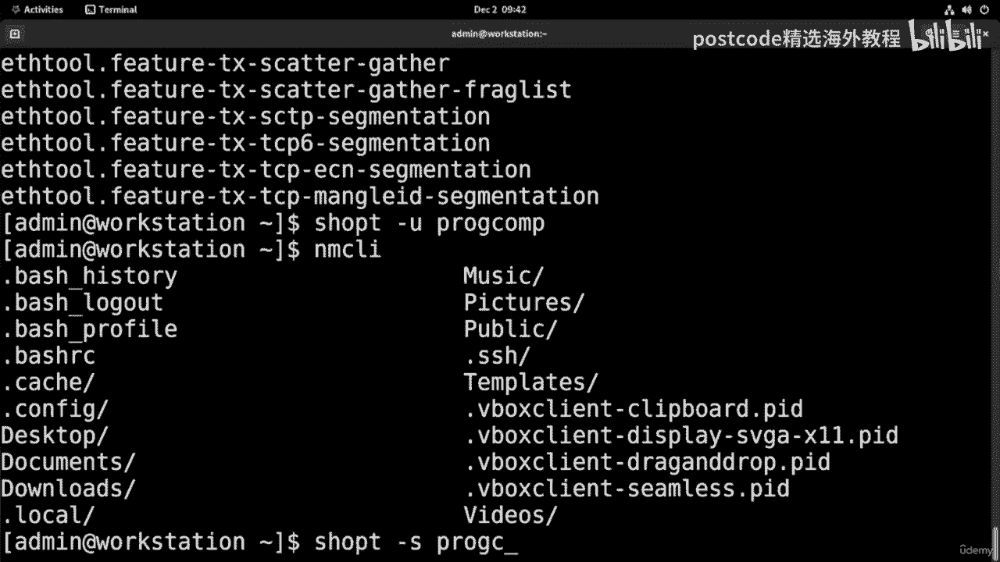

And that should bring it right back。There we go。

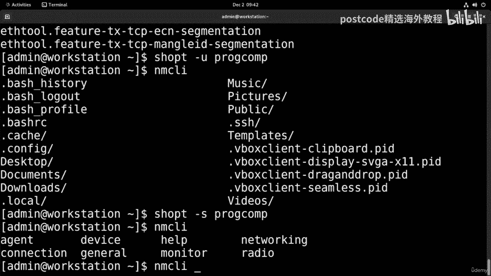

So that'll be all for this video。 I hope it was useful， thanks。

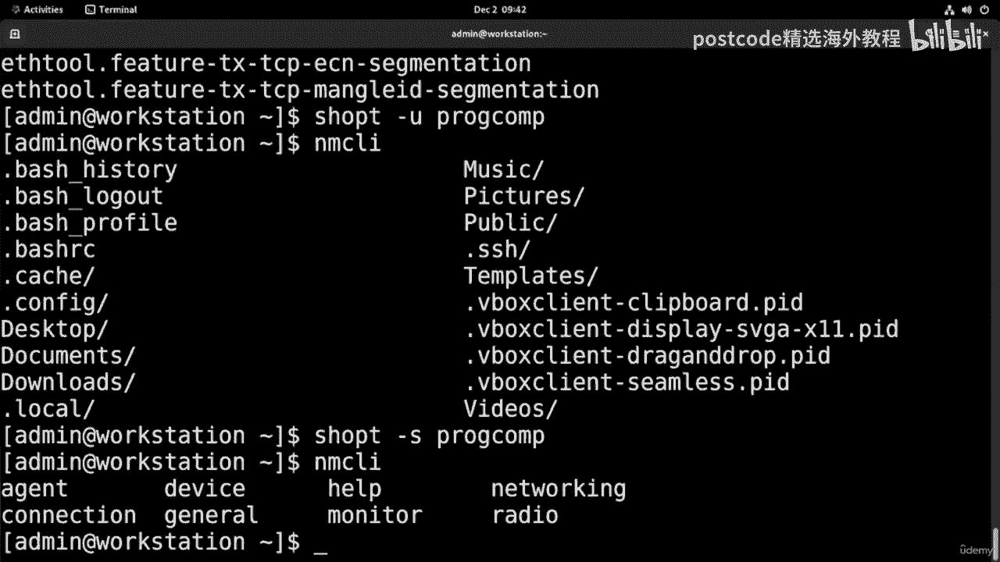