# 红帽企业Linux RHEL 9精通课程：P59：06-06-001 Bash自动补全

在本节课中，我们将要学习Bash自动补全（Bash Completion）的安装、启用、使用以及管理。这是一个能极大提升命令行效率的工具，对于准备RHCSA和RHCE认证考试也很有帮助。

## 概述

Bash自动补全是一个简单且极其有用的工具，它可以扩展Shell内置的Tab键补全功能，使其具备上下文感知能力。这意味着当你输入命令或参数时，按Tab键可以获得更智能、更精确的提示。

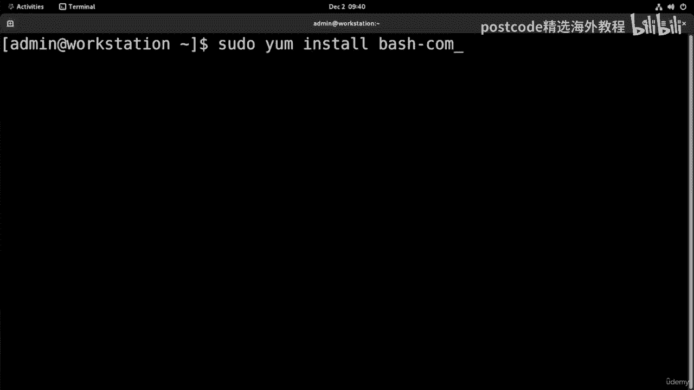

## 安装Bash自动补全


上一节我们介绍了Bash自动补全的概念，本节中我们来看看如何安装它。

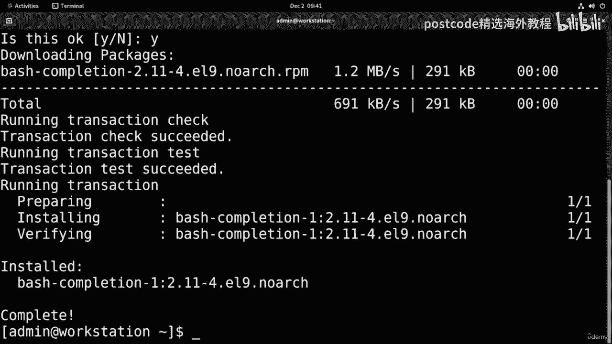

安装过程非常简单，只需使用包管理器执行以下命令：

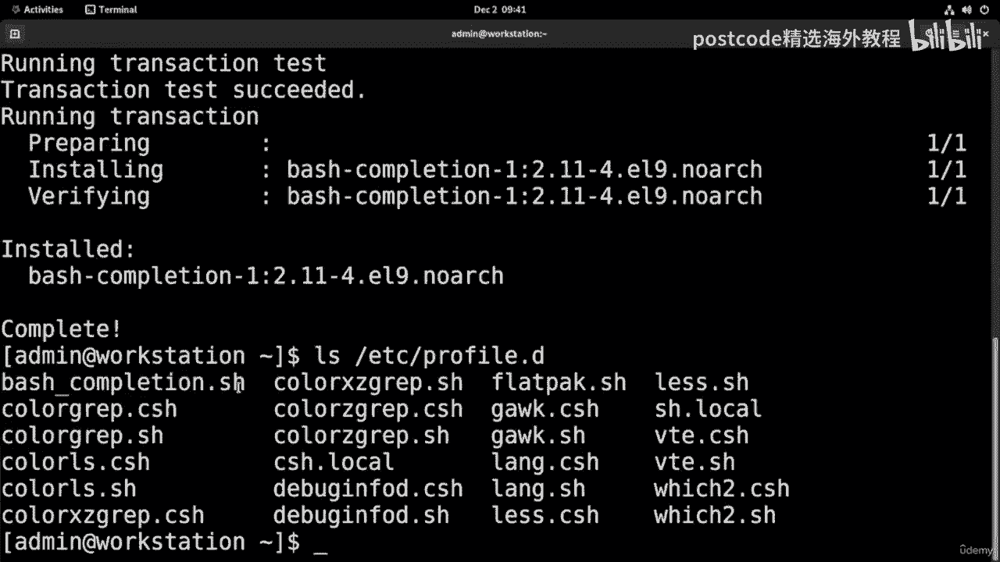

```bash
sudo yum install -y bash-completion
```

安装完成后，系统会自动将相关配置文件放置在 `/etc/profile.d/` 目录下。

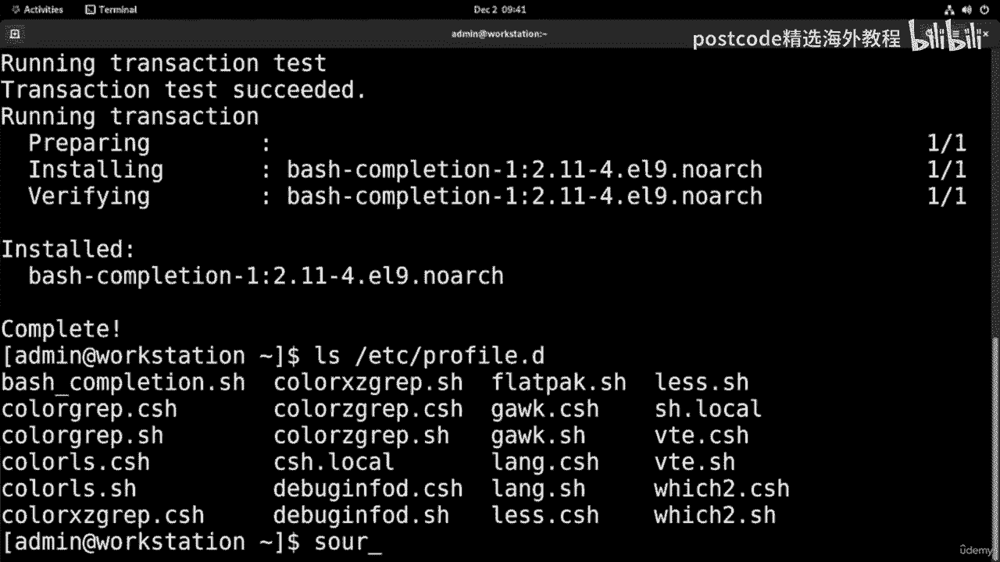

## 启用Bash自动补全

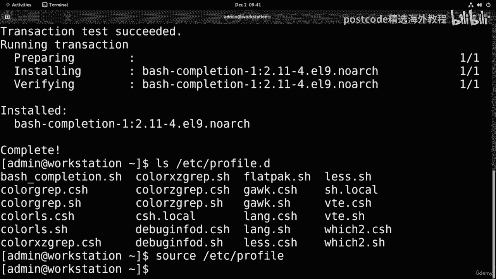

安装后，新打开的Shell会话会自动启用Bash自动补全。如果你希望在当前的Shell会话中立即启用它，可以执行以下命令：

```bash
source /etc/profile.d/bash_completion.sh
```

这条命令会读取并执行配置文件，使自动补全功能在当前会话中生效。

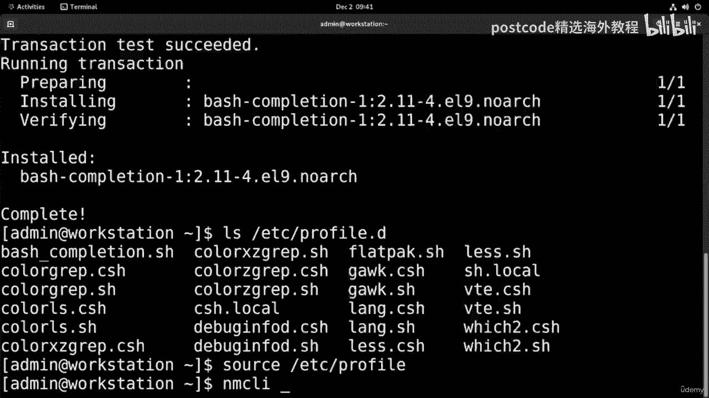

## 使用Bash自动补全

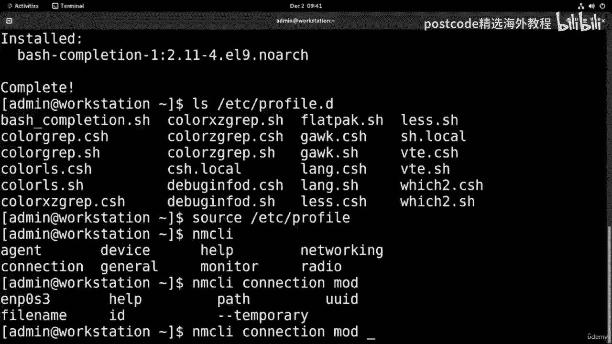

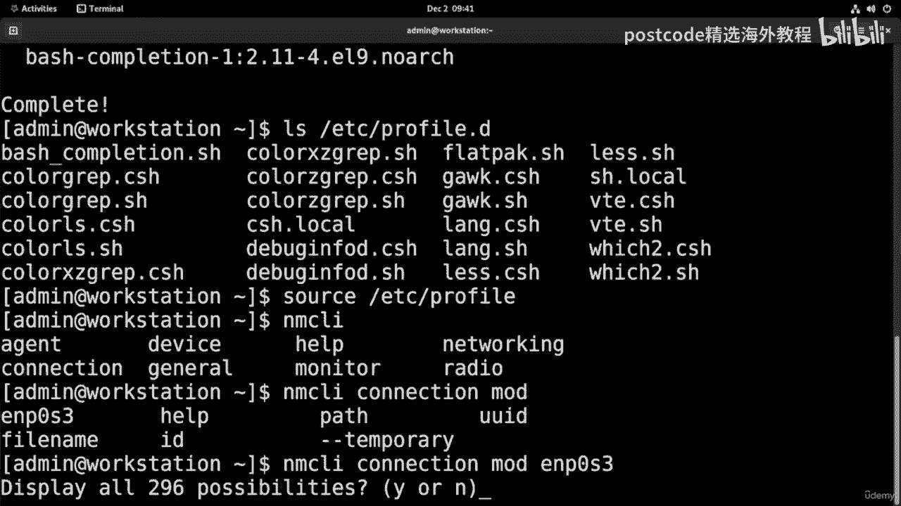

为了演示Bash自动补全的实用性，我们可以使用 `nmcli` 命令作为例子。`nmcli` 命令拥有非常多的选项，手动记忆所有选项非常困难。

以下是使用Bash自动补全的步骤：
1.  输入 `nmcli` 后按一次Tab键，会列出所有以 `nmcli` 开头的可能命令（通常就是它本身）。
2.  输入 `nmcli` 加一个空格，再按两次Tab键，系统会显示出该命令所有可用的子命令和选项。例如，它可能会列出多达296个可能的选项。

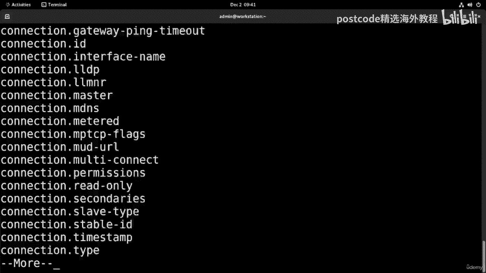

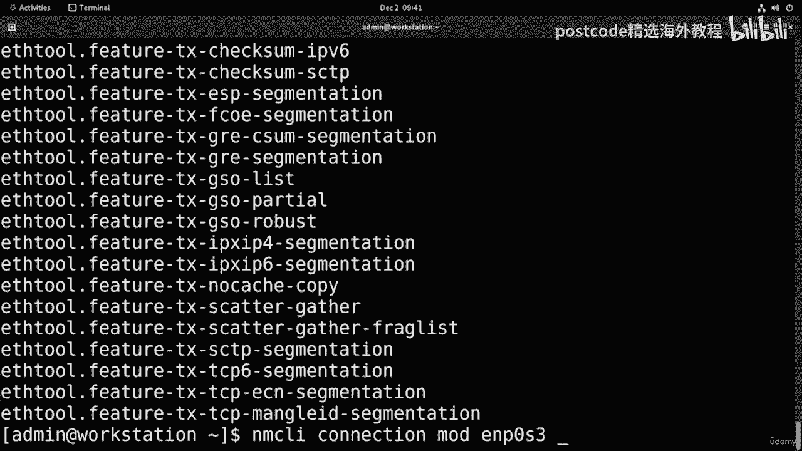

这个功能使得我们无需记忆大量复杂的命令参数，极大地提高了工作效率。

## 禁用与重新启用Bash自动补全

在大多数情况下，Bash自动补全非常方便。但有时，例如在处理大量文件或某些特定脚本时，它可能会变得缓慢或造成干扰。因此，了解如何管理它也很重要。

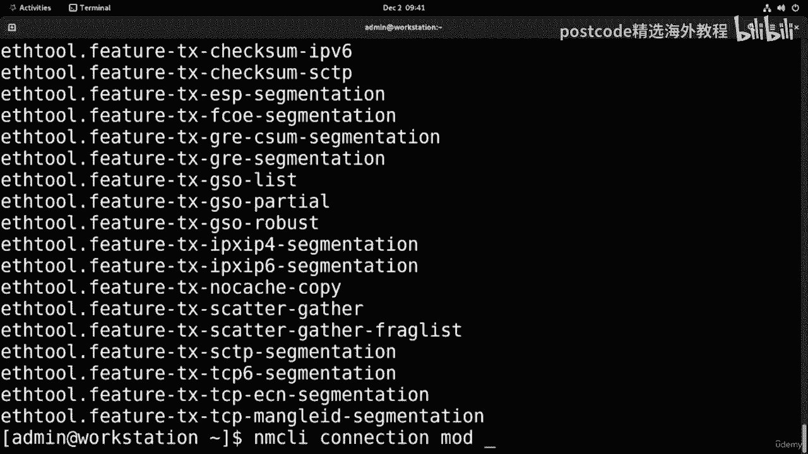

如果你需要临时禁用Bash自动补全，可以使用以下命令：

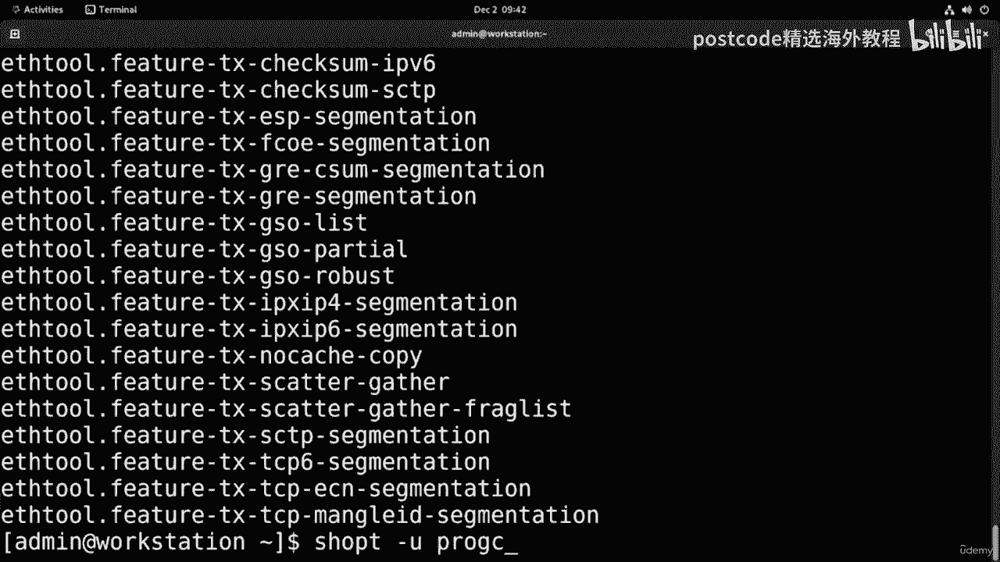

```bash
shopt -u progcomp
```

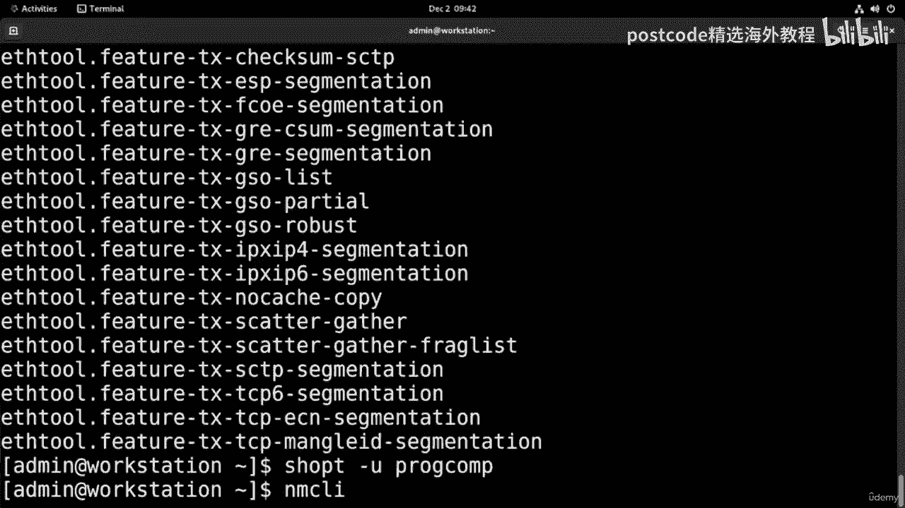

执行后，Tab键补全将恢复到最基本的功能，只补全文件和目录名。

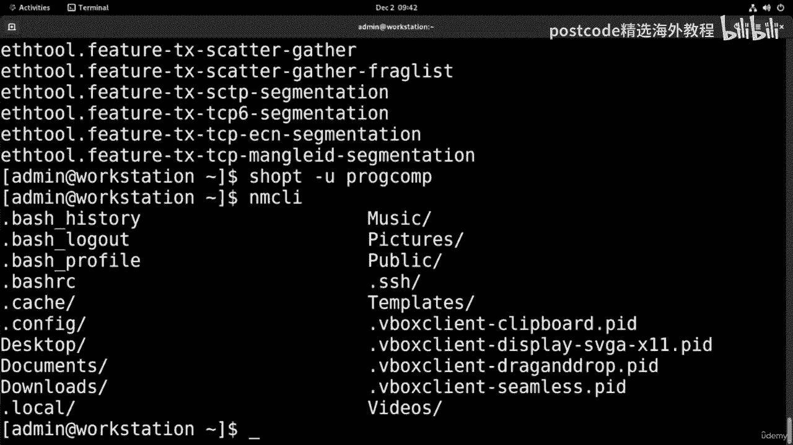

当你需要重新启用完整的自动补全功能时，只需运行：

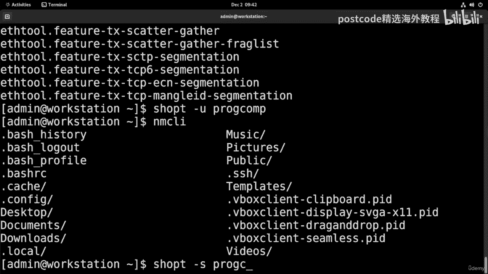

```bash
shopt -s progcomp
```

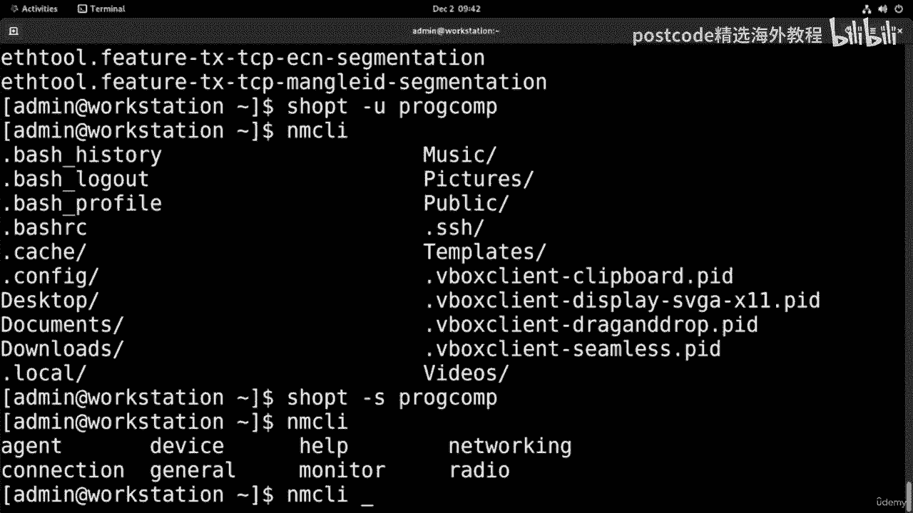

## 总结

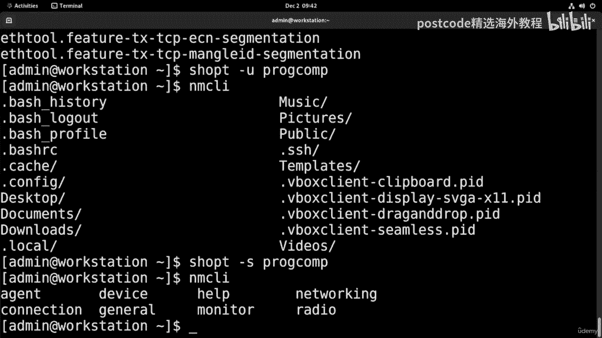

本节课中我们一起学习了Bash自动补全工具。我们掌握了它的**安装**（`sudo yum install -y bash-completion`）、**启用**（`source /etc/profile.d/bash_completion.sh`）、**使用方法**以及如何**临时禁用**（`shopt -u progcomp`）和**重新启用**（`shopt -s progcomp`）。这是一个能显著提升命令行操作速度和准确性的强大工具，建议在日常使用中熟练掌握。