# 红帽企业Linux RHEL 9精通课程 — RHCSA与RHCE 2023认证全指南 - P5：01-01-004 Features - 精选海外教程postcode - BV1j64y1j7Zg

好的。这些就是我们一直在讨论的程序功能。现在让我们更深入地讨论一些正在引入的技术特性，与现实生活。记住我们的支柱。好的。因此，我们首先讨论创新并希望能够跟上很多事情的潮流。因此。

我们在这里简化了开发人员体验。这意味着我们拥有最新的开发工具。从这些工具的新版本开始。但我们还重新定义了在 RHEL 8 中引入的应用程序流。所以我们有基础操作系统，它是核心操作系统。

是获取内核和一些所需的最小元素，基本支撑基础设施。但随后用户空间工具和应用程序被放置在应用程序流中，我们传统上构建，您可能还记得，其中一些是模块，RHEL 有八个模块，这使您可以。

在该系统上同时安装 Python 3 和 Python 2，以便您可以构建，当您过渡到 Python 3 时，适用于任一环境。因此，应用程序流和模块使您能够构建其中一些东西。但我们也意识到。

有时应用程序流本身对您来说不够快。因此，代码就绪的 Linux Builder 使您可以访问更高版本的工具。我们添加的另一项支持是针对桌面环境中的扁平包。您可能听说过一种新的打包机制。

它允许您下拉可能需要的元素，较新，可能与平台无关。我们已经完成了向 Python 3 的迁移，因此九号轨上没有 Python 2。如果你想让Python再次回到洛杉矶，Python 2本身就退休了。

死了。Python 社区不再支持它。已经有一段时间了，所以我们已经完成了迁移。RHEL 9 也是第一个基于 CentOS 流构建的版本。因此，如果您有兴趣为应用程序流、为基础操作系统等做出贡献。

或者使用下载和实现句子流可能是您集成的一种方式，与社区讨论 RHEL 的下一步发展。现在我提到了开发人员环境，我会为您提供 URL，所以它就在这里，个人开发者订阅。

我发现 RedHat 开发人员最有趣的事情之一就是内容的绝对数量，我们正在为这个环境做出贡献并投入其中。这里有一些引人入胜的博客、文章和操作方法，供您研究和了解。

了解并了解您可以使用 RedHat Enterprise Linux 完成许多不同的事情。也许您刚刚开始容器采用之旅。好吧，你可以找到一些关于如何直接在你的铁路箱上运行容器的信息，所有。

开发人员红帽中有。因此，我们进行了重新设计，试图让开发人员更容易地获取以下信息：他们需要。这里正在进行大量工作。同样，创新的一部分是确保我们运行最新版本的东西。因此 Pod Man 4。

0 包含在九号铁路中。这为我们提供了更好的 DNS 名称解析，改进了 IPV 6 支持。UPI 图像也得到了扩展。这些通用基础镜像可用于创建您自己的容器，它们有不同的风格，从标准到微型到最小化再到网络。

这意味着默认情况下包含在该入门容器映像中的内容。但它可能在大小方面与初始化图像只有七个半兆一直达到标准，它的大小为 80 兆，顺便说一下，它比 REL 8 中的要小。因此，我们一直在努力进行某种修饰。

以实现更紧密、更智能的通用性，基础图像。我们在内核中默认启用的另一件事是 C 组版本二。我们之前已经介绍过版本二，但请参阅现在在您的全新安装中默认启用第二组。您可能已经意识到，在 C 组的第一个版本中。

确实没有太多标准化，我们试图限制的许多定义和资源之间。C 第二组 我们现在已经做出了更好的定义等，所以现在更容易理解什么，资源在哪里受到控制。所以现在默认启用。

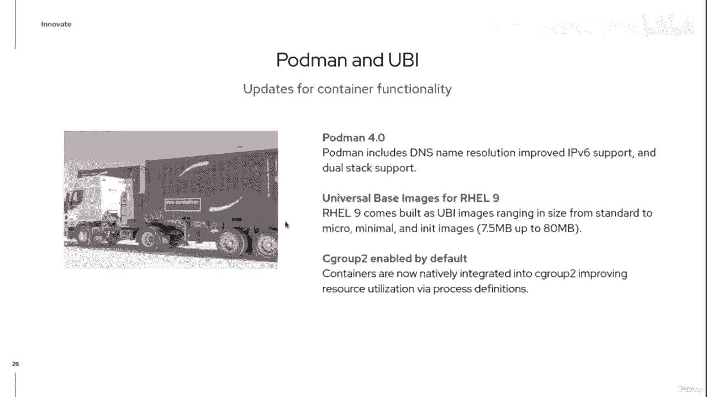

那么让我们继续讨论第二个支柱：优化。

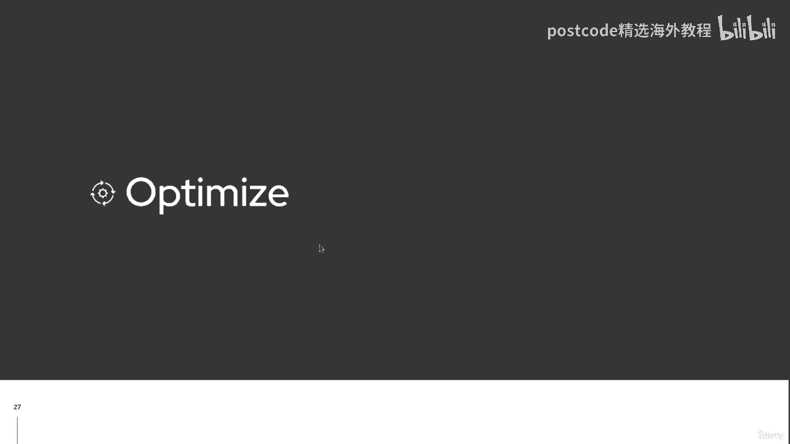

这里介绍了哪些技术特性？嗯，我已经提到了图像生成器环境。我们在这里通过 REL 9 介绍的是一个实际的图像生成器服务。所以软件即服务。传统上，在洛杉矶的图像生成器中，您必须建立自己的基础设施才能。

支持图像生成器。现在 RedHat 为您提供 Image Builder 服务，您可以利用我们的服务，创建和建造的基础设施。现在，图像生成器服务的美妙之处在于您可以通过并构建，您知道，裸露的，金属镜像。

你可以构建虚拟机镜像，你可以构建容器镜像，无论你做什么，需要，并且它在他们之间一致构建。映像生成器已得到增强，可以支持更好的裸机部署。从本质上讲，您可以创建部署到裸机所需的安装介质。

它将有一个内置的启动功能。整个过程是自动化的。您只需插入该媒体即可消失。我们还提供定制文件系统支持。这意味着我们可以拥有多个挂载点，而不仅仅是一个大型根文件系统。从历史上看。

您如何使用 Image Builder？好吧，首先我们选择我们要构建的平台。该图像是否会传输到物理、私有云、公共云或边缘？那么我们要使用我们提供的图像生成器服务吗？您可以通过红帽控制台来实现这一点。

或者您是否已经构建了本地私有构建环境？然后，您创建一个蓝图，在其中定义该图像的所有元素。然后点击构建。它将为我们构建镜像，以便在我们选择的任何平台上运行。

然后我们可以继续下载、发布或推送该图像到特定平台，我们为之而建。这就是构建图像的概念，我们希望让您更容易实现自动化，让您更轻松地创建一致的环境，优化并减少您的辛劳。

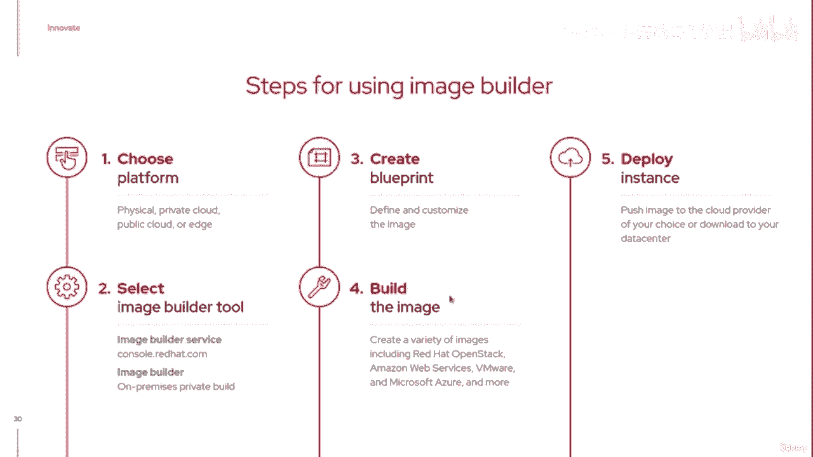

让我们看看我们的第三个支柱。

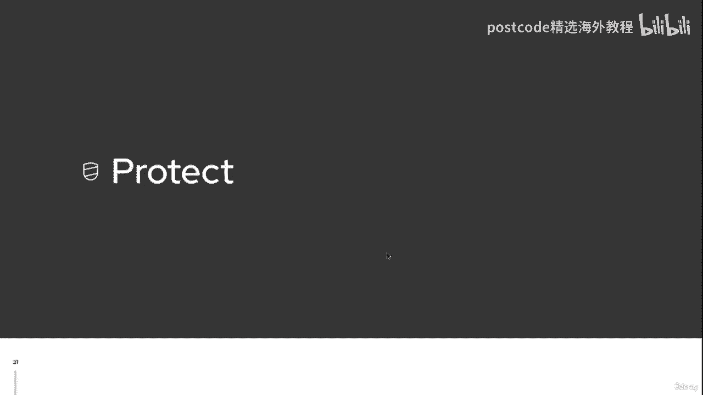

那就是保护。默认情况下，九号轨更加坚固。现在，这意味着什么？嗯，我们已经改进了 Linux 性能，真正关注其中的一些元素。坦率地说，可能会让您感到困扰的是 SSH 的 root 登录默认情况下是禁用的。

现在您无法使用密码以 root 身份登录。同样，我们很多人一直试图通过默默无闻的方式将 SSH 转移到另一个安全端口，以减少，剧本。您认识的小孩子正在运行并尝试使用密码连接到我们的系统。好吧。

默认情况下禁用密码，即使您使用端口 22，他们也无法进入。所以你必须有钥匙才能进去。我们一直在合作的另一件事是你们中的许多人可能知道你们的一些加密协议，比其他人弱。因此，有些暴力方法或许可以与之相关。

因此，我们一直在逐渐剔除其中一些。因此，在 Rail 9 中，我们默认禁用了一种加密方法。另外，正如我们提到的，看到第二组已经在那里。这也应该使您的环境更加安全，因为您对资源利用率的定义。

更清晰、更一致。我们也准备遵守。因此，我们支持各个政府组织所做的更多安全努力。我们扩展了开放范围配置文件，以便能够适应更多环境。因此，对所有这些元素的支持是为了更好地保护您的系统。

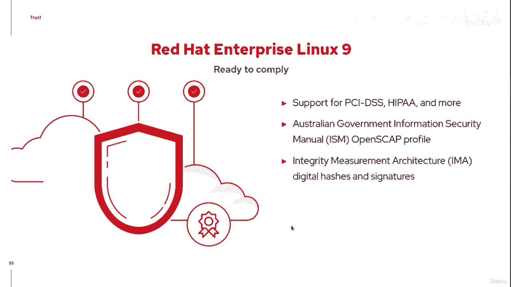

我们的最后一个支柱是谈论信任。

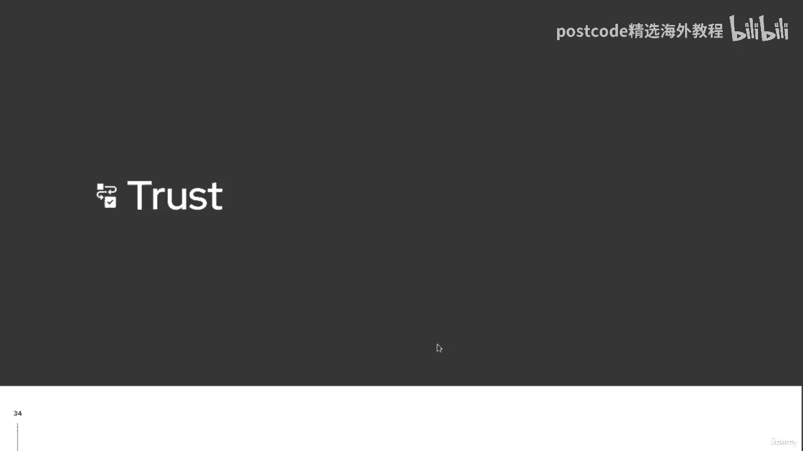

那么我们如何赢得这种信任呢？嗯，其中很多是为了自动化你和我需要完成的更多任务。因此，我们引入了额外的系统角色。这些角色可以以非常一致的方式再次检查和配置盒子，以便您可以信任，您的环境中。

您可以相信它正在按照您期望的方式运行。因此，对于这些系统角色，它们是 ansible 角色，本质上可以将您的盒子配置为，防火墙，成为 HR，集群，支持 SAP 实例。

也许是一个 Web 控制台并启用该元素。因此，所有这些系统角色都希望让您更轻松地管理您的环境和信任，你的环境。我们对 RedHat Enterprise 的高可用性组件进行了改进，Linux。

我们引入了额外的隔离代理来支持数据中心中的更多物理平台。再次记住，高可用性的目的是确保您的应用程序保持正常运行，跑步。所以这可以通过并支持这些。我们还完全支持集群系统角色。

以便我们可以继续将这些角色应用到，集群内的元素。Web 控制台。Web控制台为我们管理这些远程系统提供了一种新方法。因此，从您看到的 Web 控制台示例中，我可以看到不同的性能统计数据。

我可以看到有两个CPU。我可以看到正在使用多少 RAM、正在使用多少交换、正在使用哪些服务，其中大部分。我的磁盘空间用完了吗？我的网络带宽怎么样？我什至可以绘制其中一些元素的图表。

以了解一段时间内的利用率。但我们还添加了通过此 Web 控制台执行一些管理任务的功能。因此，不仅可以看到一些绩效指标，而且还能够出去做，例如，内核实时修补、内核生命修补，它允许您修补正在运行的内核。

无需重新启动。这将使您能够保持系统运行，但请相信该安全公告已被，应用。现在，当人们连接或连接时，Web 控制台支持通过 sudo 升级权限，使用 SSH 建立连接。

然后使用智能卡身份验证作为保护访问的另一种方式，到该网络控制台。另一个有趣的元素是 Web 控制台现在正在成为引入的首选方法之一，虚拟机控制台。

对于那些可能已经习惯使用 vert manager 来管理本地虚拟机的人，系统中，Web 控制台现在将是执行此操作的首选方法，因为 vert 管理器已被弃用。您是否知道 Web 控制台也适用于移动设备？

所以。现在还不是星期五，但我确信星期五，随着天气好转，我们都更愿意，在高尔夫球场上。正确的。因此，当您坐在那里并收到警报时，您可以在移动设备上调出 Web 控制台，设备位于 14 号发球台上。

修复该问题，检查日志，监控帮助，及时解决问题，以便轮到您处理，摇摆。因此，Web 控制台现在也可以在移动设备上运行。

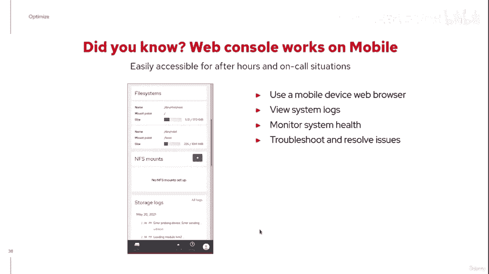

我们还改进了 Performance Copilot 的可扩展性，它已集成到 Web 控制台中。这将为您提供更详细的性能分析。被绑在这件事上。

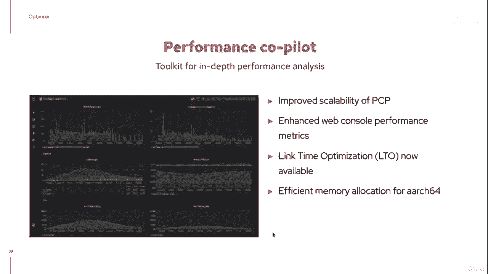

但是，遵守性能和安全性以及所有这些您希望信任的事情，环境。将其作为服务提供怎么样？那么，这就是 Red Hat Insights 发挥作用的地方，对吧？

因此，我们在第二季度中通过 Red Hat Insights 推出的一些新功能包括一些新服务，专注于资源优化，同时也调查我们所知道的任何恶意软件是否已被，介绍了。但我们的目标是提供洞察力。

为您提供有关您的环境的广泛视角，能够知道哪些系统当前已打补丁，哪些系统未打补丁，哪些系统合规，将他们的报告上传到见解以及哪些系统不上传。因此，能够将更广阔的视野作为一项服务绑定到您的系统中。

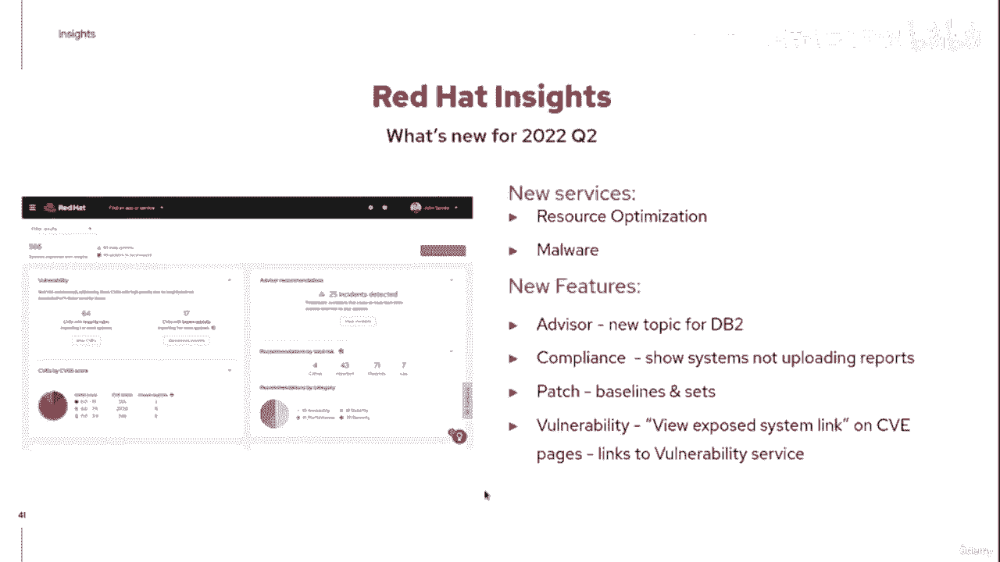

那么，红帽卫星怎么样？好吧，对于那些您的系统未连接到公共互联网并因此能够，将他们的信息上传到我们的公共服务 Red Hat&#39；s Insights。您可以使用红帽卫星对这些系统进行本地管理。

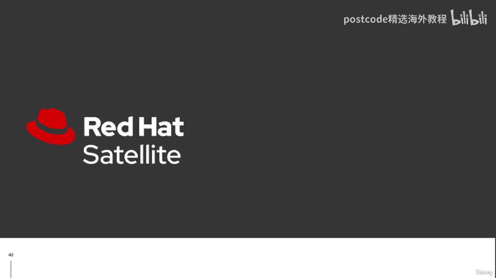

因此，就像这里的一个小脚注一样，红帽卫星将能够开始管理相关信息，随着卫星 6。11 的推出，今年夏天将有九个主机。好的。您无需做任何事情，只需将这些九号铁路系统注册到稍后的再现即可，卫星。

您将开始执行 RHEL 9 所需的所有功能。正确的。因此，我们今天想要完成的最后一点是给您一个机会亲眼看看，其中一些东西如何可用。我鼓励您做的一件事是注册个人开发者订阅。

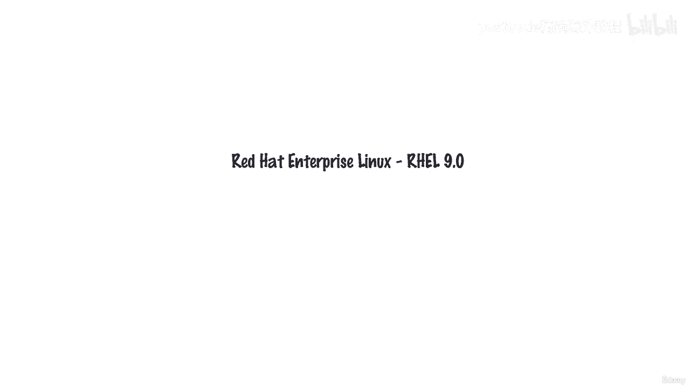