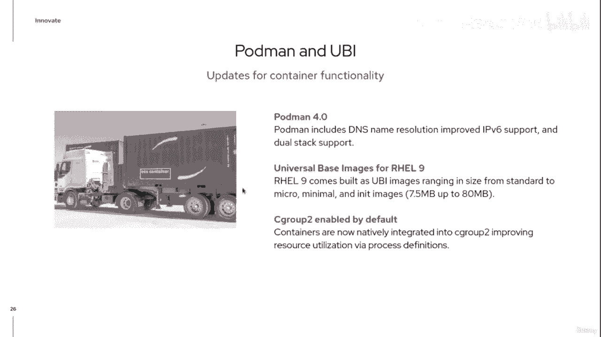
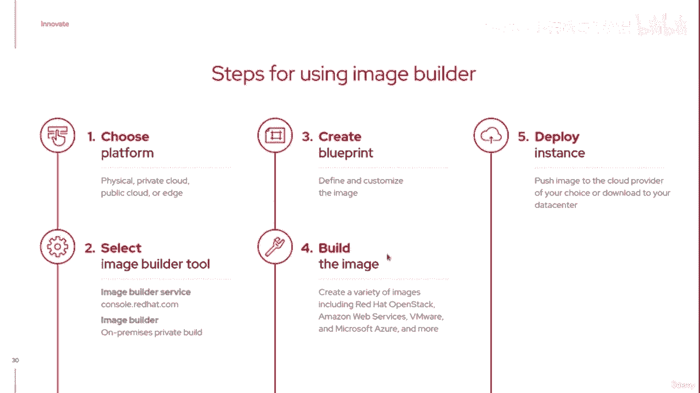
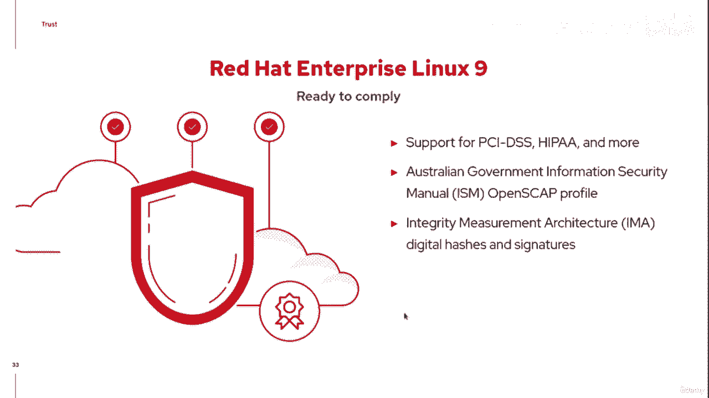
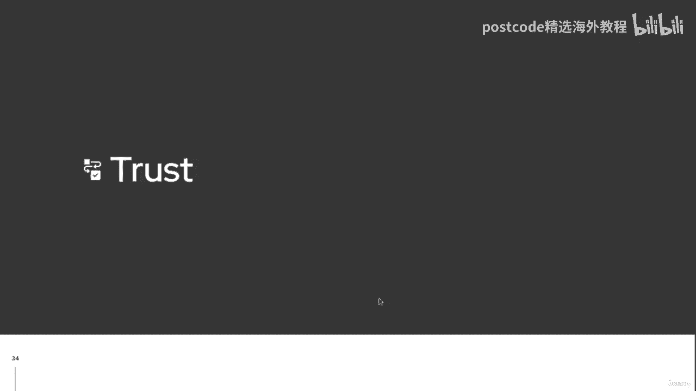
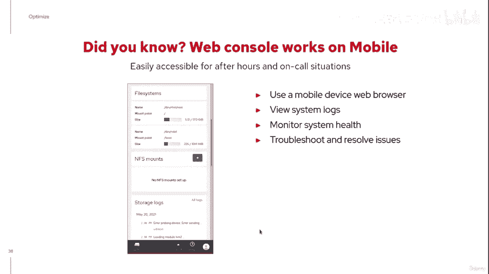
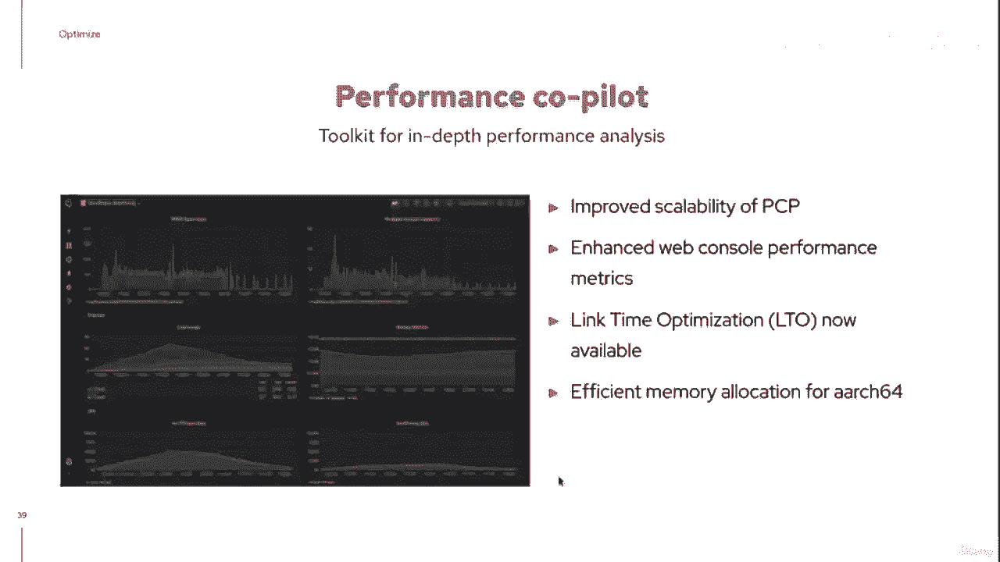
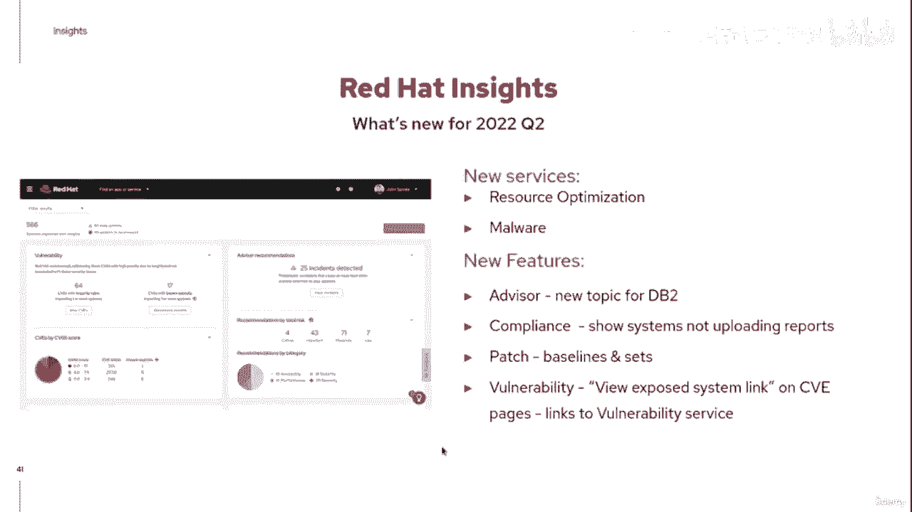
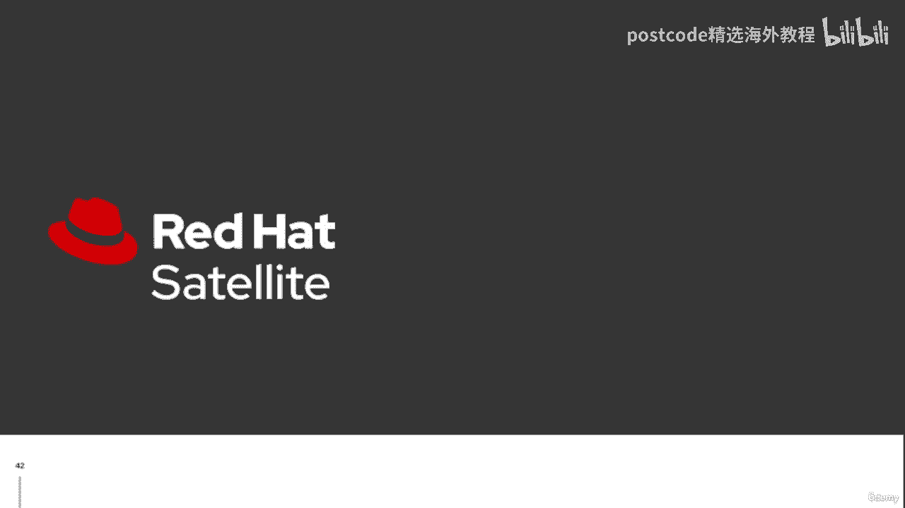
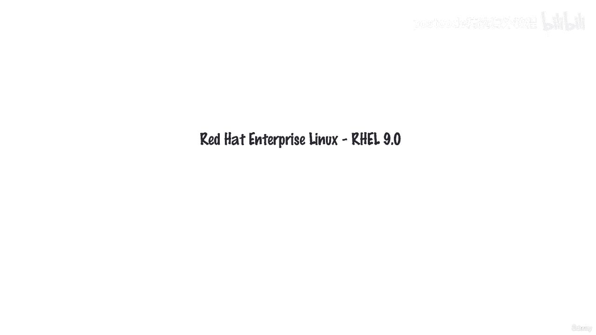

# 红帽企业Linux RHEL 9精通课程：P5：01-01-004 核心特性详解 🚀

在本节课中，我们将深入探讨红帽企业Linux 9（RHEL 9）引入的核心技术特性。这些特性围绕四大支柱展开：**创新**、**优化**、**安全**和**信任**。我们将逐一解析每个支柱下的关键更新，帮助你理解RHEL 9如何为开发和管理工作提供更强大、更安全、更自动化的平台。

## 支柱一：创新 💡

上一节我们概述了RHEL 9的四大支柱，本节中我们首先来看看“创新”支柱下的具体特性。RHEL 9致力于简化开发者体验并引入最新技术。

以下是RHEL 9在创新方面的主要改进：

*   **简化的开发者体验**：RHEL 9提供了最新的开发工具，并重新定义了RHEL 8中引入的**应用程序流（Application Streams）**。系统由**基础操作系统（BaseOS）** 和用户空间工具/应用程序所在的**应用程序流**构成。这允许在同一系统上并行安装不同版本的软件（如Python 3和Python 2），便于环境过渡。
*   **CodeReady Linux Builder**：当应用程序流的更新速度无法满足需求时，开发者可以通过CodeReady Linux Builder访问版本更高的工具链。
*   **Flatpak支持**：为桌面环境添加了对Flatpak打包格式的支持，允许用户轻松获取较新且与平台关联性较低的应用程序。
*   **完成向Python 3的迁移**：RHEL 9已完全迁移至Python 3，不再包含已停止社区支持的Python 2。
*   **基于CentOS Stream构建**：RHEL 9是首个基于CentOS Stream构建的版本，为开发者提供了参与RHEL未来发展的途径。
*   **个人开发者订阅**：红帽为开发者提供了丰富的资源，包括博客、文章和操作指南，涵盖容器化等多种主题。开发者订阅是获取这些资源的关键。
*   **Podman 4.0**：集成了Podman 4.0，提供了更好的DNS解析、改进的IPv6支持以及扩展的**通用基础镜像（UBI）**。UBI镜像有多种风格（标准、微型、最小化、网络），镜像体积相比RHEL 8更小。
*   **默认启用cgroups v2**：内核默认启用了**cgroups v2**。相比v1，v2在资源限制的定义和控制上更加清晰和标准化，使得资源管理更容易理解。




```yaml
# 示例：RHEL 9系统结构概念
系统组成：
  - BaseOS: 核心操作系统（内核、基础支撑）
  - Application Streams: 用户空间工具和应用程序（如Python, Node.js）
```

## 支柱二：优化 ⚙️

在了解了创新特性后，我们来看看RHEL 9如何帮助用户优化系统部署和管理。优化的核心在于提升自动化能力和一致性。




以下是RHEL 9在优化方面的关键特性：

*   **镜像构建器服务（Image Builder Service）**：RHEL 9引入了软件即服务（SaaS）形式的Image Builder。用户无需自建基础设施，即可利用红帽提供的服务创建裸机、虚拟机或容器镜像，并保持构建的一致性。
*   **增强的裸机部署**：镜像构建器得到增强，支持创建带有自动化安装和启动功能的裸机安装介质。
*   **定制文件系统支持**：支持在镜像中创建多个挂载点，而不仅限于一个大的根文件系统。
*   **镜像构建流程**：流程通常为：1. 选择目标平台（物理机、云、边缘）。2. 使用红帽控制台服务或本地环境。3. 创建定义镜像所有元素的蓝图。4. 执行构建。5. 下载或发布镜像。

## 支柱三：安全 🔒





优化部署之后，确保系统安全至关重要。RHEL 9在安全方面进行了多项加固，默认配置更为严格。

以下是RHEL 9在安全方面的默认强化措施：

*   **默认禁用SSH root密码登录**：无法使用密码通过SSH以root用户登录，必须使用密钥认证。
*   **默认禁用弱加密算法**：禁用了一些已知较弱的加密方法，以防范暴力破解。
*   **cgroups v2**：如前所述，更清晰的资源控制也有助于提升安全性。
*   **合规性支持**：扩展了对**OpenSCAP安全配置文件**的支持，以适应更多政府或行业的合规性要求。

## 支柱四：信任 🤝

最后，我们探讨RHEL 9如何通过自动化和管理工具来建立用户对系统环境的信任。信任来自于可预测性和可控性。





以下是RHEL 9在建立信任方面的主要工具和改进：


*   **额外的系统角色（System Roles）**：引入了更多Ansible角色，用于以一致的方式自动化配置系统，例如配置防火墙、高可用性集群、SAP实例或Web控制台。
*   **高可用性改进**：对高可用性组件进行了改进，引入了额外的隔离代理以支持更多物理平台。
*   **Web控制台（Cockpit）增强**：
    *   **集中监控**：提供CPU、内存、磁盘、网络等性能指标的视图和图表。
    *   **管理任务**：支持通过Web控制台执行内核实时修补等任务，无需重启。
    *   **权限与认证**：支持通过sudo提升权限，使用SSH隧道或智能卡进行安全连接。
    *   **虚拟机管理**：正成为管理虚拟机的首选工具，逐渐取代virt-manager。
    *   **移动设备支持**：可在移动设备上访问，便于远程管理。
*   **性能协管器（Performance Co-Pilot, PCP）**：集成到Web控制台中，提供更详细的系统性能分析。
*   **红帽洞察（Red Hat Insights）**：一项SaaS服务，提供环境全景视图，包括补丁状态、合规性检查、资源优化建议和恶意软件调查。
*   **红帽卫星（Red Hat Satellite）**：对于无法连接互联网的环境，可以使用红帽卫星进行本地系统管理、补丁和内容管理。Satellite 6.11将支持管理RHEL 9主机。





---



本节课中我们一起学习了RHEL 9的四大核心支柱及其下的关键技术特性。从**创新**的开发工具和容器技术，到**优化**的镜像构建服务；从**安全**的默认强化配置，到**信任**相关的自动化角色和先进管理工具（如Web控制台和Insights），RHEL 9旨在提供一个更现代化、更安全且更易于管理的企业级Linux平台。我们鼓励你注册**个人开发者订阅**，亲身体验这些特性。