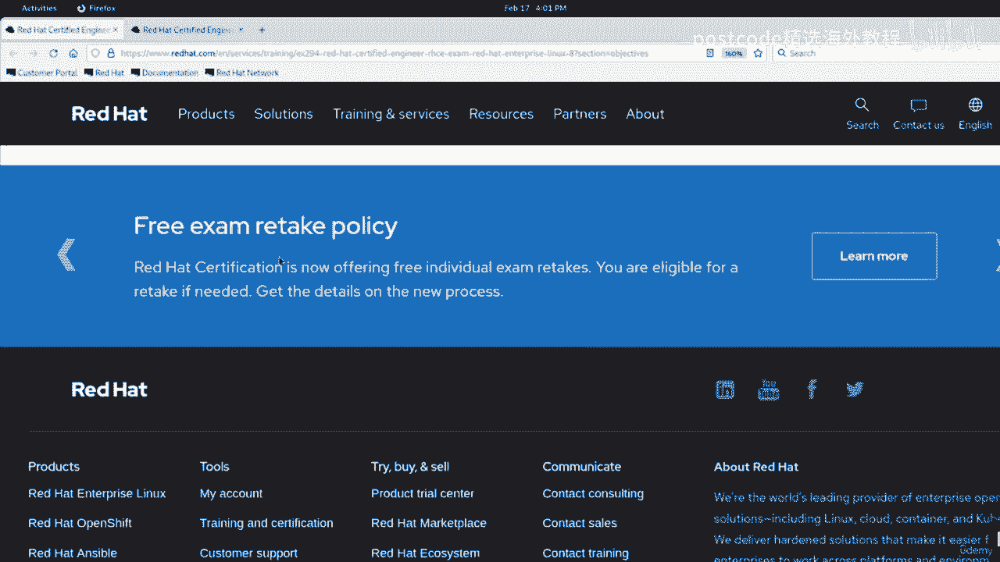
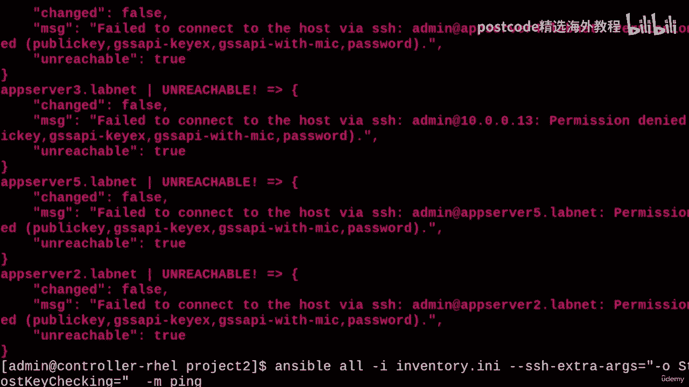
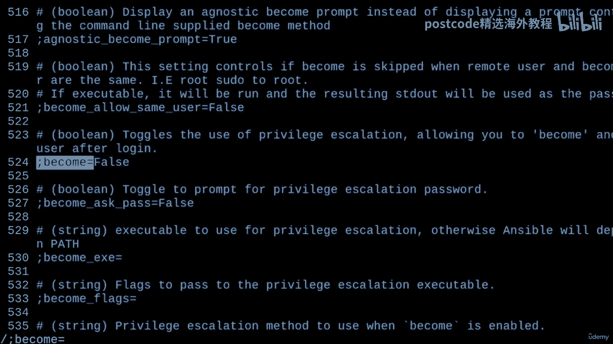
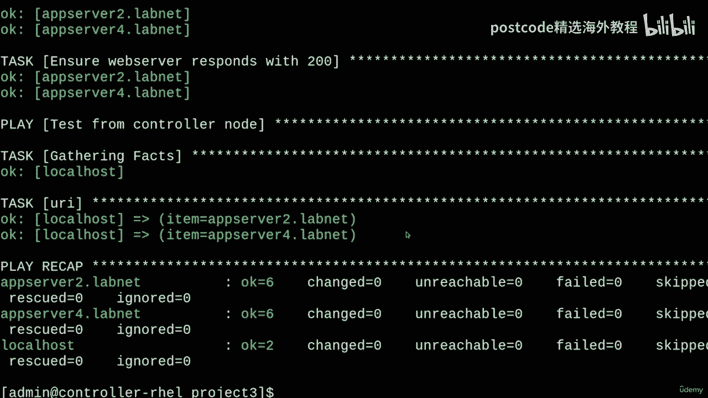

# 红帽企业Linux RHEL 9精通课程 — RHCSA与RHCE 2023认证全指南 - P60：06-06-002 Ansible tricks - 精选海外教程postcode - BV1j64y1j7Zg

What's going on everybody？In this video， we'll be learning about ad hoc ansible commands to practice for the RH CE。

 of course。Now we already got a taste of this at the end of the last video。

 but what I want to show you today are some additional options you can pass to the Ansible command。

This has the potential to be useful on the exam because you can use ad hoc commands to validate some of your work。

In fact， that used to be an objective that appeared on this page before see I've got the way back machine pulled up here and it's set to April 5th。

 2022。And it says right here， validate a working configuration using ad hoc andsible commands。

So they definitely expected us to be able to do this in the past。

 so I don't see why it wouldn't help even today。There's also another objective， actually。

 about writing scripts with ad hoc Ansible commands。 So we'll do a little bit of that as well。

 It sounds pretty useful。And of course， just to be clear。

 the current exam objectives no longer mention ad hoc commands at all。

 I just believe that it's extremely useful to know about， so I'm covering it anyways。

And quote。If my eyes aren't mistaking me， it looks like Red Ha's going to introduce a free exam retake policy。

 So that's pretty neat。

But yeah， let's get into the video。

Okay， so we can go ahead and get started now by creating a new project directory for today's activity。

You can see here in the past videos， we got a project zero and a project one so far。

 so let's continue on with a make project two。Pretty cool。And I'll see the into there。And okay。

 so now I'll just write a short inventory file for us to use， so just give me one moment， please。

 will I type that out。Yeah， so this is all pretty arbitrary。

 but I tried to make it sound a little bit Devopy， I guess。

 and something cool that I learned recently， by the way。

 is that you can set the Ansible underscore host variable to something like an IP address or a fully qualified domain name。

And then what essentially would happen is that the name on the left right here would be treated more like an alias for something like the IP address on the right。

 So that's pretty cool right， especially if you don't have DNS。

I wish I knew how to show that in the inventory video， but at least I'm showing it now。Okay， anyways。

 moving on， what we won't be doing right away is creating an answerible dot CfG file。 Instead。

 we'll be using flags in the Ansible command to tune how we want to interact with our managed notes。

 So as usual， documentation is just a man page away。And so if you just run man Ansible， there you go。

Here is pretty much everything you'd want to know about when it comes to doing ad hoc anciible commands。

So yeah， like there's a lot of stuff in here， but we'll make it easy。

So let's first try to get to square one without using an Ansible do Cfg。

 this is going to be a bit of an iterative process， so just bear with me。If I run ansible。

All dash M and try to use the Ping module with Ping on all of my hosts。

It's not going to work exactly right away and that's because we're going to need to first specify our inventory file with a dash eye。

So we remember dash I from the inventory video right， it's just dashinventory。 I I。

 and let's run this and see what happens。Okay， so we're getting a bunch of errors and you know what。

 I think that's all right because we're making some progress here。

You'll also notice for app server3's entry in the inventory， it's pointing to 10。00。13。

 which is the same thing I set in that Ansible_ host variable。 So that's pretty cool。

 that's it going on in action。But anyways。The errors that are showing up here are probably due to a issue with logging in with SSH。

So I'm going to need to pass an option to SSH to disable stuff like host key checking and also probably to enable Ansible to ask for the SSH password because I don't have passwordless public key authentication set up yet。

Okay， so。That'll just be a dash dash SS S H， dash extra dash As equals。 And then in quotes。

 I'm just going to type in dash O strict。Post。至。Checking equals no。

And I can remove that extra space。And now I'll run this。Yeah。

 so it looks like I also need to do the Ask passs featured in Ansible。Okay， so we're getting closer。

 now let's try this。And it's asking for my SSH password。So that's looking promising。And there we go。

 it's all green， excellent。So yeah， we're indeed getting somewhere now ping works。

 but we're still living on a couple of coincidences。So like SSH by default。

 we'll try to log into a remote host as the same username as the one on the client host。

So that's why it was using the admin account earlier， which I mean is okay in this case。

 that's the account I set up for this purpose。But if you were using a different username。

 then I just want to point out that it wouldn't work。

So a different username on your controller node specifically。So for example。

 if I was running this with pseudo， then I'm going to be SSching as the root user and by default it's going to try an SSH to the root user on the manage node so I don't know the root password I can just type in whatever in here。

And it's going to return errors because of the incorrect password。

 But the point is it's trying to log into the root user all of a sudden。

So this is where we would want to explicitly specify what remote user we want to use with the dash U flag。

 and then I can just say admin in here。

Now， if I run this again， we're going to get all greens， so that's good。

And I can remove this pseudo Now。 We don't need that。

 I wasn't ever saying that you should run ansible as fruit。 That's unnecessary。

Yeah so we've almost reached parody with what our Ansible。 CFfg file gave us before。

 we can also take care of privilege escalation now by adding the dash dash become flag and the dash dash ask become pass。

But I think you can also shorten this down to just lowercase B and dash capital K that works too。

Now if I run this。It's going to ask for the become password， which is good。

And it'll still do the same thing。 So let's actually switch out this Ping module for something else like shell。

And then pass some options， and I'll do this in single quotes。

 and I'll just make it do something like echo。And then in double quotes inside of the single quotes。

 I'm going to say s。People。And then I'll redirect that into the root directory and just call it something like greetings。

And this should work just fine。Would become privileges as well。And there we go。

goinging back to the RHCE objective about like verifying your configurations。

 let's say that we wanted to verify that a service was enabled or something on all of our hosts。

 that would be a good example of when we could use something like the command module and then a dash A and then in here we could run something like system CTO。

Is dash enabled。 And then a service like SHD。Sure， that's going to be true， but we'll just find out。

And if I do this。And of course， SSHD is indeed running， that's how we're accessing the systems。

But yeah， this is one way for us to check on them。Okay。

So there we go we got a bunch of information on a bunch of computers all at once。

 that's always awesome。And I hope going through it in this iterative type of way made it a little bit more clear about how we can do stuff in well in ad hoc kind of way。

That's really like the best word to describe it。And a lot of these flags also nicely translate over into the Ansible Playbook command as well。

 so that'll definitely help a lot。And of course， just to show you again， if I copy the Ansible。cfg。

Where is it project？1。In symbolable dot CFfg。If I copy that to my current directory and run Ansible D version。

It's going to be picking up this file。And now I don't actually need all of these options。

 I can omit a bunch of them。Like I can get rid of this， this， this。This。

I can even get rid of the dash eye inventory thing。And if I do this， let's see what happens。

It works just fine。So obviously having an Ansible。cfg simplifies things a lot。

He don't have to keep such a long command at hand。But I just wanted to show you all of the useful flags just so that we're aware of them in case we're in a situation where we shouldn't be using an anible。

cfg。So yeah。Next， I'd like to share how you might want to go about writing a simple script that uses ad hoc Ansible commands。

 so I'll just need a moment to come up with something off camera and then I'll be right back。Okay。

 so this is what I've written， it's pretty simple。What it does is it writes a string。

To the ETC message of the day file。And it's doing that using the Ansible copy module。And this string。

 by the way， happens to be all of the arguments that have been passed to this script。All right。

And another cool thing that I did in here is I set forks to two。

 so this basically tells Ansible to run in two chunks at a time I didn't go over that before。

 but I thought hey， I might as well put it in here。呃。What else the host pattern thing。

 this variable is pointing to deploy， which is the hosts group in my inventory for app servers4 and 5。

 so that's why I did that one Sure anything would have been fine。呃。

And I guess another thing is down here。 I didn't specify a module。

 and that might look a little bit weird， but if you don't specify a module and then start giving arguments for one。

 Ansible is going to default to the command module。

 So this is basically ansible and then my host pattern and then a module is command and then the arguments is cat message of the day。

 And， of course， we're doing this to verify the contents of ETC MOTD。RightAnd so yeah。

 this is basically how the script works。I guess like this might be a little bit confusing how I'm escaping these double quotes。

 but I hope that's clear enough how I'm able to pass this variable into here。Um， you know。

 did you have to escape the quotes？So without further ado。

 let's go ahead and just like run this script。So I'll just do a bash。Ad ho script。

 and then I'll pass some arguments。Something like that， maybe I'll put a question mark。

 some arguments， who knows。Though， mysterious。AndThen I'll just type in my SS S H password。

 the become password。 and we're going to see some changes。 So changed is true。

 and the destination was the message of the day。And then the second ad hoc command is asking for its password。

 so I'll just do that。And we're getting the output of the ETC message of the day cat command。

 so it's saying some arguments and that's because of what we wrote just over here。

So that's pretty cool， that's how it works out。And， I mean。

When it comes to writing scripts like these， just for your practice。

 like your imagination is basically the limit。But as we'll see in the future。

 playbooks are a lot better suited for doing this kind of thing， like I mean。

 this command module is always going to return a changed status。

 even if I run this again without really needing to do any changes。

The first part's O because I use the copy module， so it says change is false because it knows it doesn't need to do anything。

 But for the second command， since it's using the command module。It's always going to say changed。

So this is where doing things in the identpotent ansible way really comes into play。

 this is what you would really want to be doing， actually when you're writing playbooks。

 not really using command module too much and stuff like that。

 you might only need to use it when you need to use it， you know？

Like that's all I can really say about that。And before I close the video， here's another cool thing。

 I can use the implicit local host group in my inventory to execute ansible commands onto my controller node。

 So what I could do is just run ansible。😊，Local host。And then dash you。

 and then I'll give in my user。So I'll just use the user variable that should be fine。And then dash。

 dash connection。Equals local。And then I can run a moduleable like。And so it'll ask for the password。

 That's a little bit strange。That's probably because it's using the Ansible。cfg file。

 so let me move that。Okay， let's try that again。So yeah。

 it just pinged my own machine just like that， it's not an ICMP ping， by the way。

 it's just running a Python script。But I could also do more complicated things like run the setup module。

And this is going to print a bunch of facts about my system。So like if I scroll up here a little bit。

 let's see。There's the ansible node name， and it says controller Re movess。Yeah。

 it says controller URL right here， pretty cool。So I mean。

 that's how you would use the setup module to gather facts about your system and output them to the screen。

And I mean， that's all I really have to show for this video。

 I hope to see you in the next one and as always， thanks for watching。

Hey， everybody， I hope you're all doing well Today。

 we'll be learning about the C a configuration file objective from the RHCE。

It's similarly also mentioned up here as just configuration files， by the way。

But what these objectives are almost certainly referring to is the Ansible。 CFfg file。

 which is where you would set various options and defaults for Ansible。

You can do a whole lot with this file， but in this video。

 I just want to narrow it down to the more common stuff that I would focus on in my study for this exam。

So with all of that being said， let's jump right into this。

We can get started by checking out the system wide Ansible configuration file。

So that's located in slash ETC， Ansible， and it's called Ansible dot CfG。Here it is。And these days。

 this file is going to be pretty boring， as you can see。

It's just telling us to run something called Ansible D config in it to generate the actual file that we're looking for。

So let's do that。We have two commands here that we can run。 There's this one。

 and then there's this second one， but we'll go with the second one since it claims to provide us with a more complete file。

Although out of the box， both of these commands are likely to do exactly the same thing。

 since we didn't get any additional plugins。So yeah， I'm put out of here。

And I'm going to make a directory called Project1 for this video。And I'll see the into there。

And then I'll just paste that command。Here it is。And I'm going to rename this output file to Ansibleash template。

 Cfg since we're going to be using this sort of like a template for our purposes。And there we go。

So I'll open this up。And yeah。Let me first just say right off the bat that this file is ginormous。

 but don't be overwhelmed。 There are just a couple of things in here that I'd like to highlight for our purposes。

 and that'll be the defaults and privilege escalation sections。So first things first。

 let's talk about defaults。You'll notice here that this is the biggest section of the file if you keep track of the line numbers。

 but there are just a couple of options to be aware of that I found to be quite useful。

So I'll search these ones out real quick， first we'll start with the inventory key。Right here。

And so this is how you would tell Ansible where your inventory file is at。

This is definitely extremely handy， we'll be using this all the time in our Ansible。cfg files。

 so I think it's really important to remember。And next， there is the remote。

Underscore user key right here。So this is how you would tell Ansible what user to try and initially log in as over SSSH or whatever connection protocol you happen to be using。

So this is also going to be super useful as well。Next。

 I'd like to tell you about the ask underscore pass key。This is disabled by default。

 but it can be useful if you don't have key based authentication set up with SSH and you need to manually enter in your login password for the manage notess。

So yeah， we'll be using that one quite a bit in the beginning until we get key based authentication set。

In a similar stride， there's also the connection。Paword file option。

 So this isn't actually super important。 In fact， I'd say that this is a terrible idea if you don't implement it securely。

 but I thought I'd at least show you what it is or at least mention it because this is one way that you could automate entering in your SS SH password for the managed notes。

 I'm not saying that we should use it， though。In the future， like I was saying。

 we'll set up a public key authentication scheme， so we won't need to manually enter in the password every time。

But that'll just be until we get acquainted with playbooks and stuff so that we can deploy the keys at scale properly。

That's just a bit of foreshadowing for you。Anyways， next， I'd like to tell you about the host。

Underscore key。 underscore checking。K。😊，And so this controls whether you want SSH to vet that the connection to the server isn't potentially compromised by an on path or man in the middle attack。

The effect of setting this to false is that the host key will automatically get accepted when you log on。

And that might be useful， it'll surely save us a couple of extra steps when we're connecting to our managed nodes for the first time。

But in a similar way to what I was talking about before。

 this is not exactly secure in a production setting。Okay。

 so the last key in the default section that I'd like to bring up is ors。

So this is a basic way to control the parallelism that Ansbil employs when managing a lot of posts。

By default， it'll work in chunks of five， but you can change that to something else depending on your needs。

Okay。So the next major section that I'd like to show you is privilege escalation。

So here's where it begins。And I'd like to start with the become key。 So let's see if I can find that。

 It says become a lot， but I'm talking about this one。And yeah。

 you can toggle this key to true or false if you want your playbook to escalate privileges right away after login。

 and it'll always do that， by the way， whether or not it actually needs those privileges to do its work。

 so just keep that in mind。There is a similar instruction you can use to dictate this kind of thing in a play。

 by the way， I'll show you that in a future video。

But next， I'd like to show you the become underscore Ask pass key。And as the name suggests。

 this enables prompting for your password so that Ansible can run the privilegege escalation command。

 which is pseudo by default。And speaking of which there is the become underscore method key。

And this is the type of program that you can set for escalating privileges and usually like I said。

 this is going to be pseudo， but there are indeed alternatives to pseudo like PK Exec。

 Duaz and the classic SU command， so that's always nice。

 but yeah we're just going to stick with Su for these videos。

And finally， I'd like to show you the become underscore user option， So this is of course。

 how you would name what user you would like to escalate to by default。

 This is almost always going to be the root user， but of course you can change it to something else if you want。

Okay， so that'll be all for this file， I'll just quit out of here and I'll clear the screen。

And I guess now let's go ahead and start planning some stuff out for using our own file。

And I guess one thing to think about is whether we even want to use the system wide Ansible do CFfG file in the first place。

So you'll see here if I run anible dash dash version。

That the file in ETC is taking top priority right now。So in my opinion， when using this file。

 it might seem convenient at first， but in reality it's not super flexible because you need root privileges to work with it and usually we would want to try and get as much done as possible without using root。

 right？So yeah， let's move on to the next option。And so that would be to make a configuration file for our local user account by adding a dot file to the home directory just like this。

 and we would call it dot ansible dot CFfg。Just like that。And I mean， this is a little bit better。

 obviously we won't need to use root to edit this file， so that's always good。And I mean。

 it's nice to be aware of this one。 Of course， you can tell that it's working now if I run Ansible dash dash version。

 the config file is set to the one in my home directory now。Pretty cool。😊。

But we might not want to solely rely on this file for every project。

 So we'll move right along to something else。 And by far， this is the most flexible option。

 And that is to create a new ansible dot Cfg file for every project directory that we work on。

 So I'm in Project one's directory right now。 and I can go ahead and touch an ansible do CFfg file for this project just like so。

And if I run the command again。You'll see here that is' pointing to the one in my current directory now。

Kol。So yeah， this method has the benefit of centralizing the configuration for our project in one place instead of having it scattered around。

 which I really like a lot。And while I'm at it， let me tell you about some things to be aware of。

 so yeah， when I was showing you the Ansible version command。

 you probably were able to tell that Ansible prioritizes the dot C of G files in a certain order with the one in the current directory being the highest priority and the next would be the one in your home directory and last would be the one in ETC。

And so just another thing to take note when Anible does choose a configuration file to use。

 it only picks one。 It doesn't mix in the settings from the lower priority ones。

 It only takes what's in a single file， and nothing else。

The other thing that I want you to keep in mind is that world Wable directories are a big no no for Ansible。

 CFfgs。 That's the security posture you get with Ansible They don't want anyone to be able to tamper with your ansible。

 Cfg file because it's a security risk。So we can check right now that I'm in a good position by doing this。

Actually， I need LS D LD。There we go， so my directory isn't worldriable so we can tell that it's going to work。

 but make sure to keep that in mind and check if you're having trouble with Ansible getting to recognize your file。

Okay， so I know that was a ton of information， but now we have the easy part left。

 which is just applying what we know now to write our own Ansible。cfg。

I'll just go ahead and open up the Ansible do CFfG file I just touched。

And I can start with some square brackets and create the defaults section。

And as I was saying earlier， one of the first things you're going to want to do in default is specify your inventory。

 so I'll just type in inventory equals， and then I'll set it to something like dot slash inventory dot I and I。

I don't think I actually have a file like that in this project directory so I'll need to create one later on。

 but yeah， anyways I like to throw in the remote underscore user option and I'm going to set this to admin because I know I have the admin account set up on all my managed nodes so I'd like to use that。

And another thing that I like to do is set ask underscore pass to true。

So this is false by default that's why we're overriding it。

 but I'm making it true because I don't have public key authentication set up with my managed nodes yet。

 so I'm going to need to enter in the password manually and if you have it false it'll just throw an error back at you unless you you know set up PKI。

Okay， next， I'm going to set host。Underscore key， underscore checkname。To false。

And the reason why I'm doing this is because I haven't logged into these managed nodes properly yet。

 so the fingerprint or hostkey fingerprint， whatever you want to call it。

 has not been saved to my known host file， so it's going to complain at me unless I disable that right now。

But we'll take care of all of this later on when we set up a PKI later， like I was just saying。

Another thing that I'd like to do is just set forks equal to something else like two Then we can see that it'll work in chunks of two at a time。

 why not？And then moving on to the privilege escalation section。

 I always have to make sure I spelled this right。It lives。Underscore escalation。There we go。

 sometimes I forget the underscore， sometimes I spell privilege wrong and so on and so forth。

 I would just double check that if you have difficulty with that as well。Anyways。

 I'm going to set become equal to true。And so that means that immediately after logging in。

 it's going to try to escalate to a higher user and that will be the becomecom。Underscore user。

 which offset set to root， so it's going to try and escalate to the root user right away。Anyways。

 next I can set become underscore， ask， underscore pass to true。

And what this will do is ask for the pseudo password。

 which will be useful in this current configuration because I don't have the no password option set up in pseudo yet for my managed nodes。

 otherwise we're going to get errors if I don't do that。And lastly。

 we can just go ahead and do this for fun。 I'm just going to set become。Underscore method to pseudo。

 This is the default。 So we didn't actually need to specify this in the file。

 but it is something that we just went over earlier。 So why not name it， right。Anyways。

 so I can just save this file now。9。And to show you that it's actually working。

 I'm going to have to overlap a little bit of this content with the content of the next RHCE video。

 which is going to be about ad hoc commands。But this is the only way I'd be able to show you how to test this out properly。

 So here's a teaser for the next video， I guess let's write a quick and dirty inventory file like this。

 I'll just call it inventory dot I and I like I named in the CFG file。

 and I'll just put in app server1 dot labnet。Uses port 22。

22 because that was one of the quirks with that machine。 and then app server。2 through 5。

Dot labbnet are normal， and we'll just put them in the ungrouped group。

I guess that was a nice short review of what we did last time。

 and now I can quickly demo this by running ansible。

And then giving a host or group so I can give app server 1。 Labnet， for example。

And that's something named in my inventory file， so it's okay。

And then I'll give a module with a dash M。 and the module I'll use is pink。So if I run this。

 it's going to ask for the SSH password， so that's a good sign， I'll just type that in。

It's also going to ask for the become password， so that's good that's what we told it to do and by running that you'll see that it worked out pretty well。

Um， so that basically that P command ran a Python script on the remote host。

 that's basically what happened。And yeah， we can also do something else that requires elevated privileges this time。

 so we're actually using that capability。By running ansible。And then， will give the ungrouped。Group。

And then dash M for a module， and I'll give the command module。

And then I can give options with dash A for this command， and I'll just make it touch。

Slash test file。So obviously， we're going to need root privileges to write in the slash directory。

So if I just run this， it's going to ask for the SSH password again， that's all good。

 it's also going to ask for the become password， I can just hit En and now it ran that on all of the hosts and you might have noticed how quickly it was going it was doing it in two forks at a time basically that option that we set earlier。

Cool， so yeah， I mean， it just created that test file on all of the hosts。

 We can even check that by just doing an LS。Of the test file。Right， I'll just make it LS D L。

And I'll just do this again。And there we go， there is the listing of that file and it is indeed available on all of our hosts。

 pretty cool。Yeah， so I'm going to keep my lips tight about the rest of this wizardry with ad hoc commands so that I have something to show for the next video。

 This video is getting pretty long anyways， so there was a little taste of what's coming up in the next RHC E video。

And with that being said， I hope the information I presented here helped you out。

 I try to make it as accurate as I can with the understanding I currently possess。

 but you can let me know if I made any error at any time in the comments that'll surely help others who watch the video stay well informed。

 And yeah， that about wraps it up。 So as always， thanks for watching。

Hey， everybody， I hope you're all doing well Today。

 we'll be learning about the C a configuration file objective for the RHCE。

It's similarly also mentioned up here as just configuration files， by the way。

But what these objectives are almost certainly referring to is the Ansible do CFfg file。

 which is where you would set various options and defaults for Ansible。

You can do a whole lot with this file， but in this video。

 I just want to narrow it down to the more common stuff that I would focus on in my study for this exam。

So with all of that being said， let's jump right into this。

We can get started by checking out the system wide Ansible configuration file。

So that's located in slash E TC， Ansible， and it's called Ansible dot CfG。Here it is。And these days。

 this file is going to be pretty boring， as you can see。

 it's just telling us to run something called Ansible D config in it to generate the actual file that we're looking for。

So let's do that。We have two commands here that we can run。 There's this one。

 and then there's this second one， but we'll go with the second one since it claims to provide us with a more complete file。

Although out of the box， both of these commands are likely to do exactly the same thing。

 since we didn't get any additional plugins。So yeah， I'm put out of here。

And I'm going to make a directory called Project1 for this video。And I'll see the into there。

And then I'll just paste that command。Here it is。And I'm going to rename this output file to Anszeibleash template。

 Cfg since we're going to be using this sort of like a template for our purposes。And there we go。

So I'll open this up。And yeah。Let me first just say right off the bat that this file is ginormous。

 but don't be overwhelmed。 There are just a couple of things in here that I'd like to highlight for our purposes。

 and that'll be the defaults and privilege escalation sections。So first things first。

 let's talk about defaults。You'll notice here that this is the biggest section of the file if you keep track of the line numbers。

 but there are just a couple of options to be aware of that I found to be quite useful。

So I'll search these ones out real quick， first we'll start with the inventory key。Right here。

And so this is how you would tell Ansible where your inventory file is at。

This is definitely extremely handy， we'll be using this all the time in our Ansible。cfg files。

 so I think it's really important to remember。And next， there is the remote。

Underscore user key right here。So this is how you would tell Ansible what user to try and initially log in as over SSSH or whatever connection protocol you happen to be using。

So this is also going to be super useful as well。Next。

 I'd like to tell you about the Ask underscore pass key。This is disabled by default。

 but it can be useful if you don't have key based authentication set up with SSH and you need to manually enter in your login password for the manage notess。

So yeah， we'll be using that one quite a bit in the beginning until we get key based authentication set。

In a similar stride， there's also the connection。password file option。

 So this isn't actually super important。 In fact， I'd say that this is a terrible idea if you don't implement it securely。

 but I thought I'd at least show you what it is or at least mention it because this is one way that you could automate entering in your SS S H password for the managed notes。

 I'm not saying that we should use it， though。In the future， like I was saying。

 we'll set up a public key authentication scheme， so we won't need to manually enter in the password every time。

But that'll just be until we get acquainted with playbooks and stuff so that we can deploy the keys at scale properly。

That's just a bit of foreshadowing for you。Anyways， next， I'd like to tell you about the host。

Underscore key， underscore checking。K。And so this controls whether you want SSH to vet that the connection to the server isn't potentially compromised by an on path or man in the middle attack。

The effect of setting this to false is that the host key will automatically get accepted when you log on。

And that might be useful， it'll surely save us a couple of extra steps when we're connecting to our managed nodes for the first time。

But in a similar way to what I was talking about before。

 this is not exactly secure in a production setting。Okay。

 so the last key in the default section that I'd like to bring up is ors。

So this is a basic way to control the parallelism that Ansbil employs when managing a lot of posts。

By default， it'll work in chunks of five， but you can change that to something else depending on your needs。

Okay。So the next major section that I'd like to show you is privilege escalation。

So here's where it begins。And I'd like to start with the become key。 So let's see if I can find that。

 It says become a lot， but I'm talking about this one。And yeah。

 you can toggle this key to true or false if you want your playbook to escalate privileges right away after login。

 and it'll always do that， by the way， whether or not it actually needs those privileges to do its work。

 so just keep that in mind。There is a similar instruction you can use to dictate this kind of thing in a play。

 by the way， I'll show you that in a future video。

But next， I'd like to show you the become underscore Ask pass。き。And as the name suggests。

 this enables prompting for your password so that Ansible can run the privilege escalation command。

 which is pseudo by default。And speaking of which there is the become underscore method key。

And this is the type of program that you can set for escalating privileges and usually like I said。

 this is going to be pseudo， but there are indeed alternatives to pseudo like PK Exec。

 Duaz and the classic SU command， so that's always nice。

 but yeah we're just going to stick with Su for these videos。

And finally， I'd like to show you the become underscore user option。 So this is， of course。

 how you would name what user you would like to escalate to by default。

 This is almost always going to be the root user， but of course you can change it to something else if you want。

Okay， so that'll be all for this file， I'll just quit out of here and I'll clear the screen。

And I guess now let's go ahead and start planning some stuff out for using our own file。

And I guess one thing to think about is whether we even want to use the systemwide Ansible do CFfG file in the first place。

So you'll see here if I run ansible dash dash version。

That the file in ETC is taking top priority right now。So in my opinion， when using this file。

 it might seem convenient at first， but in reality。

 it's not super flexible because you need root privileges to work with it。

 and usually we would want to try and get as much done as possible without using root， right。So yeah。

 let's move on to the next option。And so that would be to make a configuration file for our local user account by adding a dot file to the home directory just like this。

 and we would call it dot Ansible dot CFfg。Just like that。And I mean， this is a little bit better。

 obviously we won't need to use root to edit this file， so that's always good。And I mean。

 it's nice to be aware of this one。 Of course you can tell that it's working now if I run Ansible dash dash version。

 the config file is set to the one in my home directory now pretty cool。

But we might not want to solely rely on this file for every project。

 So we'll move right along to something else。 And by far， this is the most flexible option。

 And that is to create a new Ansible dot Cg file for every project directory that we work on。

 So I'm in Project one's directory right now。 And I can go ahead and touch an Ansible dot Cfg file for this project。

 just like so。And if I run the command again。You'll see here that it's pointing to the one in my current directory now。

Ku。So yeah， this method has the benefit of centralizing the configuration for our project in one place instead of having it scattered around。

 which I really like a lot。And while I'm at it， let me tell you about some things to be aware of。

 so yeah， when I was showing you the Ansible version command。

 you probably were able to tell that Ansible prioritizes the dot C of G files in a certain order with the one in the current directory being the highest priority and the next would be the one in your home directory and last would be the one in ETC。

And so just another thing to take note when Anible does choose a configuration file to use。

 it only picks one。 It doesn't mix in the settings from the lower priority ones。

 It only takes what's in a single file and nothing else。

The other thing that I want you to keep in mind is that world Wable directories are a big no no for Ansible。

 CFfgs That's the security posture you get with Ansible they don't want anyone to be able to tamper with your Ansible。

 Cfg file because it's a security risk。So we can check right now that I'm in a good position by doing this。

Actually， I need LS D LD。There we go， so my directory isn't world Wable so we can tell that it's going to work。

 but make sure to keep that in mind and check if you're having trouble with Ansible getting to recognize your file。

Okay， so I know that was a ton of information， but now we have the easy part left。

 which is just applying what we know now to write our own ansible。cfg。

I'll just go ahead and open up the Ansible do CFfG file I just touched。

And I can start with some square brackets and create the defaults section。

And as I was saying earlier， one of the first things you're going to want to do in default is specify your inventory。

 So I'll just type in inventory equals， and then I'll set it to something like dot slash inventory。

 dot I and I。I don't think I actually have a file like that in this project directory so I'll need to create one later on。

 but yeah， anyways I like to throw in the remote underscore user option and I'm going to set this to admin because I know I have the admin account set up on all my managed nodes so I'd like to use that。

And another thing that I like to do is set S underscore pass to true。

So this is false by default that's why we're overriding it。

 but I'm making it true because I don't have public key authentication set up with my managed nodes yet。

 so I'm going to need to enter in the password manually and if you have it false。

 it'll just throw an error back at you unless you you know。Set up PKI。Okay， next。

 I'm going to set host。Underscore key。 underscore check。To false。

And the reason why I'm doing this is because I haven't logged into these managed nodes properly yet。

 so the fingerprint or hostkey fingerprint， whatever you want to call it。

 has not been saved to my known host file， so it's going to complain at me unless I disable that right now。

But we'll take care of all of this later on when we set up a PKI later， like I was just saying。

Another thing that I'd like to do is just set fors equal to something else like two。

Then we can see that it'll work in chunks of two at a time， why not？

And then moving on to the privilege escalation section。

 I always have to make sure I spelled this right。Hillage， underscore escalation。There we go。

 sometimes I forget the underscore， sometimes I spell privilege wrong and so on and so forth。

 I would just double check that if you have difficulty with that as well。Anyways。

 I'm going to set become equal to true。And so that means that immediately after logging in。

 it's going to try to escalate to a higher user and that will be the become。Underscore user。

 which offset set to root， so it's going to try and escalate to the root user right away。Anyways。

 next I can set become underscore ask， underscore pass to true。

And what this will do is ask for the pseudo password。

 which will be useful in this current configuration because I don't have the no password option set up in pseudo yet for my managed nodes。

 otherwise we're going to get errors if I don't do that。And lastly。

 we can just go ahead and do this for fun。 I'm just going to set become。Underscore method to pseudo。

 This is the default。 So we didn't actually need to specify this in the file。

 but it is something that we just went over earlier。 So why not name it， right。Anyways。

 so I can just save this file now。Gu。And to show you that it's actually working。

 I'm going to have to overlap a little bit of this content with the content of the next RHCE video。

 which is going to be about ad hoc commands。But this is the only way I'd be able to show you how to test this out properly。

 so here's a teaser for the next video， I guess let's write a quick and dirty inventory file like this。

 I'll just call it inventory do I and I like I named in the CFG file。

And I'll just put in app server1。 labbnet。usess port 2，2。

22 because that was one of the quirks with that machine。 and then app server。2 through 5。

Dot labbnet are normal， and we'll just put them in the ungrouped group。

I guess that was a nice short review of what we did last time。

 And now I can quickly demo this by running ansible。

And then giving a host or group so I can give app server 1 dot Lanet， for example。

And that's something named in my inventory file， so it's okay。

And then I'll give a module with a dash M。 and the module I'll use is pink。So if I run this。

 it's going to ask for the SSH password， so that's a good sign， I'll just type that in。

It's also going to ask for the become password， so that's good。

 that's what we told it to do and by running that you'll see that it worked out pretty well。Um。

 so that basically that P command ran a Python script on the remote host。

 that's basically what happened。And yeah， we can also do something else that requires elevated privileges this time。

 so we're actually using that capability。By running ansible。And then， will give the ungrouped。Group。

And then dash em per a module， and I'll give the command module。

And then I can give options with dash A for this command， and I'll just make it touch。

Slash test file。So obviously we're going to need root privileges to write in the slash directory。

So if I just run this， it's going to ask for the SSH password again， that's all good。

 it's also going to ask for the Be password， I can just hit En and now it ran that on all of the hosts and you might have noticed how quickly it was going it was doing it in two forks at a time basically that option that we set earlier。

Cool， so yeah， I mean， it just created that test file on all of the hosts。

 We can even check that by just doing an LS。Of the test file。Right， I'll just make it LS D L。

Then I'll just do this again。And there we go， there is the listing of that file and it is indeed available on all of our hosts。

 pretty cool。Yeah， so I'm going to keep my lips tight about the rest of this wizardry with ad hoc commands so that I have something to show for the next video。

 This video is getting pretty long anyways。 So there was a little taste of what's coming up in the next R H C E video。

And with that being said， I hope the information I presented here helped you out。

 I try to make it as accurate as I can with the understanding I currently possess。

 but you can let me know if I made any error at any time in the comments that'll surely help others who watch the video stay well informed。

 And yeah， that about wraps it up。 So as always， thanks for watching。

Hey everyone， it's been a good while since I've made a video but now I'm back and today what we're going to do is learn more about Ansible facts and that should help us better prepare for this RHCE objective right here it's just called facts In this session I'll also be sure to cover service facts package facts and custom facts by the way So yeah this will be a jam but before we really get started here let's just quickly recap what Ansible facts are supposed to be。

Basically facts are little information snippets about our remote systems。

 usually this includes hardware， network， storage and operating system details， among other things。

 and you would pretty much use this data to make better automation decisions， it's as simple as that。

Now by default， when you run playbooks with Ansible。

 the setup module is going to kick in and it automatically gathers facts about each targeted host before doing any of your other tasks。

 then those facts are in scope under the Ansible_ F variable which is a dictionary type。

 and we'll get to see it represented in JSON format here in just a moment。Quick aside。

 you can also disable the initial fact gathering if you don't need it。

 and I'll also make sure to show you that as well so yeah， without further ado。

 let's get our hands dirty and try this out。

I have a directory here called Project 7， and I've already went ahead and populated the inventory and ansible do C of G files。

 Here are those files just for your reference。 It's pretty standard stuff。 we've seen it before。

 And now let's try to check out the facts of one of our managed notes。

 We can do that using an ad hoc command。 So I'll just run ansible and then pick on a machine like app server2 do Lanet。

And then run the setup module with dash M setup。I'll hit enter here。

 and what I'm going to find is that I am flooded with all of this green stuff。

 and it's green because of this thing we see here at the bottom changed is false。

 So running the setup module to gather facts about a host is a passive operation。

 It's not going to make any meaningful changes to the target。Yeah， it's pretty neat right。

 like I can scroll through a bit of this just to show you。

 but on your own time I would highly recommend reading through these facts so that you can get a good feel of what data is available for you to use。

Okay。😊，Now sometimes we might not need all of this information。

 it can be a bit overwhelming so we can be selective and filter which facts we want to see Let me show you how to do that。

So just like before， I can take this command and just add dash A over here on the end。

 and then this is for arguments and then I can add the filter option to the setup module and filter down to one of the subbackacts like date_ time。

I'll hit En here and what I'm going to find is that I'm just looking at the date time information and nothing else。

Pretty cool。😊，So this is about as far as we'll go with ad hoc commands。

 and now let's move into playbooks where all the cooler stuff happens。

So I'll clear the screen and I'm going to make a Yaml file here， which I'll call factdemo。yml。

There we go and now just give me one second while I fill out the skeleton of this playbook and I'll be right back。

Okiki so I have this boring looking playbook set up here and what I want to show you is that you can set gather。

 underscore facts to know on the play level and this is going to disable the initial fact gathering when we run the play。

Personally， I like to set it to false instead of no， I just like how it syntax highlights。

 but you can do whatever you want。And yeah， this can be useful in scenarios where gathering facts is time consuming and unnecessary so now let's just do a little speed comparison。

 I'll save this file and since we aren't using anyenssible facts we can leave gather facts turned off right now。

And then I'll just run the playbook through the time command， so I'll just do Ansible playbook。

And then fact demo dot YMl。There we go。And it looks like it took about half a second。Okay。

 so well what we'll do is turn on back to gathering again。And try this once more。

So it's definitely taking longer and yeah， there we go， it took about a second longer。

So there's definitely a difference， but it's really only going to add up when you're provisioning a lot of systems with Ansible。

Okay， cool， that was a nice little experiment with that and what we'll do now from now on is just stick with fact gathering enabled so we can even remove this lie the default is together facts。

All right， now let's talk about using the Ansible_ Fact dictionary。

You can access individual facts using the dictionary syntax like this。It's a variable。

 so I'm going to need to template it like this， and then I'll just type in anible underscore effects。

Just like that。Now， maybe I should change the name up here， Maybe I want to look for。

Date time in seconds， something like that。 There's a fact for that。 It's called Ebog。

So what I can do is just put in date underscore time as the sub fact。

 and then in there I can drill down to a dictionary item like Epoch。And there we go。

 So I'll run this。 And what we're going to see is I don't need the time command。 I can remove that。

What we're going to see is the epoch seconds from the remote machine。

 and we can check how accurate that is just for fun， date， dash D now。Plus， percent S。And yeah。

 that looks to be in the ballpark， there we go。Now just be aware that not all facts are dictionaries。

 some are lists and others are just like text values， so I'll go back into the fact demo file now。

And just allow me to cut away for a second and I'll give you a list of common facts。All right。

 so see it in a bit。Okay， cool， so here you go， this is in no way an exhaustive list。

 but I just wanted to show you how you might access some of the data。See， so over here。

 this is actually a list， this interfaces fact， so I'm drilling down into it using an index number like this。

Most of these others are just like text values like architecture and distribution。

 and like over here is an example of a really long dictionary syntax where you might need to drill down into the UUI of one of your partitions and it would work sort of like this。

Now let's actually go ahead and try this out and run this and see what happens， so I'll save this。

And I'm going to just do the Anable playbook command。And let's see what goes on。Okay。

 so it looks to be all right， we'll scroll up here a little bit and yeah。

 this is what I was actually looking out for for the default IPV6 fact。

 it says variable is not defined。So this looks to make sense since my lab doesn't seem to use IPV6 very much。

 so when a fact is not set it's going to say it's not defined like this this is actually a good example we can get a closer look at why it's blank by just running the ad hoc command and filtering down to the default IPV6 fact。

So I can just scroll down here again， go back to my ad hoc commands from before。Where are they。

 There we go。So， default。Underscore IPB6， let's see what's going on there。And yep， as expected。

 it's a blank dictionary just like that。So that's why it's said it's undefined。So yeah。

 now let's go over service facts and package facts， I guess。So let's go back into the file here。

 I guess these are going to be little modules that extend the information in the Ansbol facts dictionary。

So what I could do is make a new task here that runs the service F。

Module and another task here to run the package。As module just like that。And then just to show you。

 what I can do is make a debug。Task that print some bars out of the anzeible。

Backs dictionary and what's it going to get， it's going to get the services。Just like that。

 so that's what the new addition to the AnsibleF dictionary is going to be called。

 it's going to be called services。Similarly here， I could also do debug。The bar。

And do the same thing very similar， except for packages。Packages。And there we go。So just like this。

 now I'll be able to run this playbook again， so I'll save it。And I'll go back up here。

And I'm actually going to pipe it into less this time so that we'll be able to see what's going on in those new structures because it's going to be really long。

 we won't be able to scroll around very efficiently。Okay， so I'll run this， wait a moment。And yeah。

 we can scroll down to the end and you can see some of the packages here， just like that。But really。

 like I could search for services as well。 I could just search for the start of the services dictionary。

Services。Looks like I need to。O。There we go。 it's right there， and that's where it begins。 Similarly。

 there's also the packages， dictionary just like that。And as you'll see in just a moment。

 I'm going to be playing around with the kernel package。

 so like I can search for that as well here to kernel。

And there it is and so you'll notice that it's actually part of a list each one is like a dictionary inside of a list。

 keep that in mind it's going to be important in just a moment when I show you an example。But yeah。

 I'll quit out of here。And what I'll do now is whip up an example playbook in a new file。

 which I'll call Pfaax。yml or package facts。And then I'll just type this out and I'll be right back。

Okay， this is a pretty cool example， I think you'll like it。

 and I'd encourage pausing the video just so you can read through it as well。

 but this play is going to roughly show us if the current running kernel version matches the latest kernel package that we have installed and we're doing that thanks to the information provided by the package f。

So I mean， this is probably not the greatest way to do this type of check。

 but the idea here is that maybe you might need your playbook to be able to recognize when a system is not running the latest kernel package it has available。

 like perhaps after a big update， you didn't reboot the system and it's running the older kernel。

 so this would be able to tell you about that particular state。And I mean。

 you can see that I'm using a debug message here， but you could take this a step further and reboot the node with the reboot module when you find that this condition is met。

So another thing is the reason why I'm using this negative one index up here is because it looks like the last package in the list of packages is the latest one and minus one is how you would wrap around to the last value in the list。

Anyways， I could probably make a dedicated little video about conditionals to cover things like when statements like the one you see over here。

 but it's pretty simple you probably get the idea based on this example。And yeah。

 what we can do now is just run this Pfaax playbook， so I'll save it， and then I'll do an ansible。

Playbook E。And we'll just see what happens。And as expected。

 the conditional task is getting skipped because I don't have a newer kernel package than the current running kernel on this app Server2 machine。

But these variables up here， let me see if I can show that they should give you a pretty good idea of how the check would have worked if a difference was found between these values。

 so specifically this one and。The one over here， so。This and this， the version and the release。

 that's how I put it together。Kuo。So you know what， actually？

Let me run a system update off camera so I can show you this working。

 We can do that with an ad hoc command so I can do something like ansible。Appbsserver2。labnet。Dash M。

Yong。And then I'll do a name equals star state equals latest。

And hopefully this doesn't break anything， but we'll just give it a go。

 I'm feeling a little risky today， and I'll be right back。Okay， it looks like I did something wrong。

 Oh， I forgot the dash A。 there we go。Yeah， so this will take a moment。Ohあ。One more thing。

 I have to do dash B because this needs to run its route。So we mean。Okay。

 now I'll wait and be right back。Already then I'm back from my little break there and assuming that there was a new kernel in this update。

 things should look a little more interesting now So if I scroll up here。

 it looks to be based on the number of packages that this is a minor release update So going from E 9。

1 to E 9。2 and yeah let me see here it looks like there is a new kernel and it's just been installed。

 So yeah we can check on the factax structure again as well by going up to the fact demo play in less。

Like this。And if I search for kernel here。And go to one of these Yep， there we go。

 We can see that we have a new kernel in this list of packages。Ptty cool。😊。

So I'll quit out of there and it looks like we got an error but that's fine and yeah。

 what we'll do is just run this playbook again which one is it yeah PFax。

yMl and it's going to probably print the message about there being a new kernel but we'll get to see just now。

Yep， so it worked successfully， it says try rebooting to run the latest kernel package and that's exactly what I wanted to see so there we go we can see that it's working。

Ku。What I'll do now is just clear the screen。And I'm going to go ahead and get my service facts example together now。

 So I'll make a file here called S factsax。Dot YM L。Just like that。

And just one moment while I filled this out。Okay， you can see that this one is targeting my local controller right here and when it comes to the service facts。

 I thought one thing that might be useful is to check if a system D service is masked because usually you manually mask a service when you don't want people to start it up and mess something up so one example is Firewall D you know you might mask Firewall D and use the NF table service instead。

 and maybe you want to wait to check that you're working with the system that's been configured to specifically not use Firewall D。

So here's one way to do that type of checkup， you can see here that I'm just looking at the status value for the Firewall D service sub fact and I'm just checking if it's masked。

 that's what this one statement does。So I mean， it's kind of an edge case， but it's a relevant one。

And it wouldn't be too interesting if I run this sense。Well， firewall D is not masked。

 So what I can do is just do an anible。Just to show you Ansible Playbooksax。yMl。

 we'll see what happens。Yep， it skip the task， so that's because the status is enabled right now。

But to make this a little bit more fancy and interesting。

 what I can do is just mask the firewall D service on my controller node with a pseudo system CT TL。

Mask， Barw D。Enter my password。 And there we go。 Now I can run this playbook again and we'll see if it works。

And there we go， so the message showed up we don't use farwall D here。

 and that's just to demonstrate that this condition is going to spring into action。Cool。

I'm going to go ahead and reenable Bar WalD。Unmask。I think that should be enough unaskask and enable。

There we go。Yeah， and I'll just clear the screen now and what we'll do next is talk about custom facts so you can create custom facts by adding scripts or ini files to the fax。

d directory under ETC Ansible on on the remote host and these scripts can be written in any language as long as they output Json So let's try this out a little bit I'll make an ini file here called Frus do fact and remember the dot facting extension。

 even though it's an ini file you need this extension like that。

And then I can just put some basic variables in here， so I'll call this data。

That'll be the group name， and then I'll just say Apple equals true。Hair equals false。There we go。

So I mean， this is pretty silly， nobody really cares about fruits。

 but we'll go ahead and deploy this to see it working in just a moment。

So I'll save that and now actually let me show you a custom fact that's powered by a script。

 so this will be much more powerful， it's going to be powered by Python， so I'll create a file here。

 which I'll call userinfo。 fact。And I'm going to go ahead and fill this out with a Python script that I have prepared。

Okay， cool， so here's that Python script I was talking about and you know what。

 let me actually save this and reopen the file so that the syntax highlighting works there we go。

So yeah this is a much more useful example at the cost of a little bit more complexity and so the Anible facts don't tell you very much about the users on a system and with that in mind we have a new gap to fill in using the script that gets that information out from the password file and outputs it in JSON format so JSON format is required for custom facts that are executable programs and I mean this script it's pretty simple but you would probably want to design a better one than this for a production use case you can see that I was doing something a little silly here I just said booboo for the error that's not very professional but yeah it's okay I can just show you a bit of running the script now so I'll just save it。

And then I'll have to make it executable that's really important。User info dot fact。

And we'll just run it。There we go， we're flooded with all of this JSON and yeah。

 it looks like a real jumple here， but when Anszeible uses it。

 it's going to beautify the JON into something a little more readable when we need to check it out in like an ad hoc command。

So what we'll do is go ahead and deploy these custom facts with a playbook。

 so I'll just create something called C factsax。yml。Open this up。

And I'll just write this out because it's going to be a pretty belong playbook。

 and then I'll explain it afterwards just to save some time。Allright。

 so here's the custom facts playbook and I'll just walk through a bit of this it's going to create the f。

d directory as needed right here that's required because that's where Ansible looks for the facts and then we're just going copy the custom facts Now something kind of special did here I needed to look up how to do this is this width file glob thing This is going to be able to glob the names of the files using a wild card like this and then that goes into this item field and then it copies it sort of like the loop It's sort of like with items which is like a type of loop but we'll talk about that stuff later I just thought it was pretty interesting。

Then midplay we're actually going to reload all of the facts with the setup module again。

And then finally， we just double down by using the custom facts just like so。

 so it looks pretty long here， but that's just because it's really verbose what you have to drill down to to get to the fact。

 but we'll just be able to see it working in just a second。So I'll save this。

And I'm going to clear the screen， this looks like it missed。And yeah。

 we'll just run an ansible playbook。And Cfas。yMl and we'll see what happens。Okay。

So it looks like it created that directory， it copied the facts and it's using them。

 so there's our fruits factory there， Apple is true pair is false and there is a piece of information from our users' dynamic custom fact like that。

Pretty cool right， I think that was a bigbua， it definitely worked。And yeah。

 now we can even check these out using an ad hoc command。 so I could just run ansible。

Obsserver2 do labbnet。Dash M setup。Dash a， and I can filter。For ansible underscore local。

 that where the that's the sub fact that contains our custom facts。So I'll run this。

And what we're going to find is the user account information down here at the bottom。

Honestly so there it is。As well as the Apple and pairarfax appear。So that's pretty cool。

 It's kind of an Easter egg egg here。 you'll notice that there's this Jchann user。

Right here and that's because of the previous video I made where I introduced the s userer， but yeah。

 I guess that's kind of funny Yeah， so it's it's great that it's working。Now to close off。

 let's just explore a teeny tiny bit about magic variables in Ansible so what are they first of all what are magic variables。

 well they're pretty much just meta information about the state of Ansible as you use Ansible and that data is obviously going to be represented in variable form。

So I mean like I can just show you some of the common ones that I find to be quite handy so that would be the let's see if I can find it the host vs right here groups this just shows the dictionary of groups in the inventory and also the hosts that are inside of it it's pretty useful there's also the inventory host name I think I've used that in a previous video as well。

And then there's these directories like inventory dure， playbook du。And roll path。

So these are all pretty useful， especially once we get into roll roll path can be quite nice to have around。

And yeah， I mean it's completely situation dependent for when you might find yourself needing to use these variables。

 but I thought I might as well just bring them up so that we know that they're in our toolbox and we can use them。

So yeah， that's going to about do it for this video。

 I'm wrapping it up here and I hope the content has been helpful and see you later。Hey。

 what's going on folks， I hope you're all doing well。Today。

 we're going to dive into ansible loops to practice some core concepts for the RHCE。

Now this will be pretty straightforward， so let's get started here by checking out some simple loops。

ok。So I have a file prepared called loopsimple。yMl， I'll just open that up。

And it's a pretty simple looking play， I just have one task here that runs the young module to install some packages。

 and we're using the loop keyword to streamline this process quite a bit。Now。

 before I explain more about loops， I just want to say that this specific example task is fine as just an example。

 but I want you to be aware that the young module can take a list of packages right here in the name section。

 you don't actually need to use a loop for this specific use case and it's actually far more efficient than using a loop actually So please keep that in mind。

 I'll try to show you that in just a moment， but let's just get the basics covered about loops here。

 So you've definitely noticed this already， but the loop keyword goes on the same indentation level as the module name for the task。

 and the data type you hand over to a loop should be a list。

So you can have the list declared right here where the loop keyword is at。

 and that's fine for short lists。 And when the data isn't getting reducedused anywhere else。

 But in the spirit of flexibility， it's also possible to template a variable containing a list and give it to the loop like this。

 So what I'll do is I'll just cut this stuff over here， move up to the top and create a bar section。

Make a variable that'll call packages， I guess。 And then I'll just paste that in。

 and I'll fix the indentation real quick。And there we go。

So now I can just go down here to the loop and template that packages variable just like so。

 And we're all good to go。Okay。And I mean， I should also mention this as well。 right here。

 this item variable thing represents the current list item in focus in the iteration of the loop。 So。

 I mean， that was probably really obvious， but it's worth mentioning， right。And yeah。

 let's just go and give this a run now。So I'll save and quit this file。

And then I'll just run an insible。Playbook loops， simpleimple dot YML， and let's see what happens。

Okay， so it's installing those packages one by one。And yeah， everything worked out just fine。

Now let's go back to the file a little bit here。Loops， simple， not YMl。

I really just want to show you that we can completely omit the whole looping thing right here。

And just hand over the package's variable straight to the name section。Like this。Right。

 and so this is just going to do the thing that I mentioned just a moment ago。

It's going to work exactly the same。Well， not exactly， exactly the same。

 you can see here that it's not announcing each package like it did up here iss just going through all of it in one shot。

And so I mean you might you might find that to be less satisfying。

 but it's actually faster than using a loop， so I hope that wasn't confusing I just wanted to show that off。

 but to make up for that possible confusion here are some more recommended examples of using loops Okay。

 so I'm going to go ahead and clear the screen here。

And I'm going to open up my next file here called loops more dot YM L。

 just to show you some more loop examples。 So this is pretty simple。

 It just adds some groups and users。 And I mean， this isn't super interesting just yet either。

 But that's okay because we're going to take this play and build on it in just a moment。First。

 though， let's just run it to make sure it works。 Just do a bit of unit testing。 I guess。

 So Ansible Playbook loops more do Y M L。 we'll just see what happens。 So yep。

 it added the forest and desert groups。 and the Alice and Bill users just fine， cool。Okay。

 so now this is actually a great segue into the next thing I want to talk about。

 which is using loops with a list of dictionaries， so that's going to be a more complicated data structure And there are some additional nuances when it comes to that Okay。

 so bear with me， I just want to show you that we can modify this list of users here。And replace it。

 I guess， with a variable called users。Just to make things easier。

 and then we'll go up here to barss。And we'll make that user as variable。 And just like before。

 it's going to be a list， but it's going to be a list of dictionaries。 All right。

 so I can have a name key here that says something like Alice， just like before。

 I could have a name key for Bill。That's fine， and。

We're also going to want to have some additional properties here。

 if we're going to go with the dictionary， then we can add plenty of other pieces of information like the user shell or maybe what groups it's a member of。

 So let's actually do the groups thing because I think it's a good example。

 So I could have a membership key for Alice that says Alice is a member of the For。

And the desert groups。And then for Bill， I could also have a member。やくき。

That says Bill is a member of the forest group， just like that。

Then I can go back down here and then change this out for item， bracket name。Like that。

 So it points to the name item。Name value， I guess。And then I could also do something like groups。

 So this is going to set the group membership in the user module。And then， I could do a。Andlate here。

Item。And then， membership。Just like that， membership。And then I probably would also want to say。

 aend。It's true so that it doesn't override the。Default group membership as well。 That's a good idea。

Yep， okay， so that looks good。So I mean， we have a bit of a complex data structure going on up here。

 we have a dictionary and then we have a dictionary key and the dictionary key has a list inside of it so。

This is pretty cool， I guess， but。Like the thing is。

 is that we can use this loop to iterate through each list item and drill down into the areas that we're looking forward to using in this task that makes it all useful。

Okay， so， I mean， that was quite a mouthful， but let's just go ahead and run this now， I guess。

 so I'll write and quit。Clear the screen。And yeah， I'll just run it。Okay， so let's see what happens。

So yeah， as expected， we didn't need to add those groups again， that's fine。

 but the membership has definitely changed， that's why we're getting these changed messages here。

So that's good， I mean。That's exactly what we wanted it to do。Now。

 while we're talking about dictionaries， it might be a good idea to discuss how to filter a dictionary into a type of list that you can iterate over in a loop。

 So let me clear the screen here。 And I'm going to go ahead and drop into a different file now。

 called loops died dot Y M L。Where I want to show you what I think really shines here is this dicked to items filter I've got going on。

 right， Like， let's say that I had my classic fruits dictionary up here。 It's pretty simple so far。

 And I wanted to see this represented as a list of some form。Well。

 I can do that by using diict to items。 So I have a debug message here set up to show what the fruit dictionary looks like as a list using this filter。

 So I think the best way to demo this is just to run it。

 So I'll quit out of here and do an answerible。Playbook， loops， V dot YMl。And yeah。

 so as you can see， what we ended up here is actually a list of the dictionaries。

 So list is the square bracket dictionaries， the curly brace。

And so this actually allows us to preserve the data and still be able to use it in a loop now by following the default key value pair that it had set up for us。

Then to use a subset of these values in the loop， it's just going to be as simple as we've just seen before。

 So we'll go back into the file again and make a new debug task。 I'll just call it。

Something like print。Dict values。我这 loop。手地bu。Message。我。And we're going to loop over。

The dicta items filtered version of roottes。And then the message could just be item。Value。

Just like that。So that should work out pretty well。 Let's see what happens， I'll just save and quit。

And so yeah， I'm just going to run the playbook again。And it's going to look like this。

 So we see true or apple and false for pair。 and that's just the values that we were looking for。

Okay， so I'll just clear the screen now。 And let's finish off with registering variables with a loop。

 So we've definitely played around with registering variables before in the variables video。

 So this should be pretty simple。 The only quirk here is that when you use the register keyword on a task that also has a loop。

 you'll wind up with a data structure that contains a list called results。

 And each list item in the results list corresponds to the individual task results from the original looped task。

 So that sounded like a bunch of mumbo jumbo。 But let's actually get our hand dirty and try this out。

 So I have a little playbook here called loops Reg do YMl。

 And it's pretty simple is just going run a list of commands with the command module right here。

 So that's gonna to be P S up time in you name。And yeah。

 it's going to store this in a variable using the register keyword， just like so。

Then we have a debug task here to print the registered variable。

 so that's my commands underscore task。So let's just run this as is so we can get a feel for the data structure。

 so ansible playbook。Loops， red do YMl。So it'll take a second， but yeah， let me scroll up here。

You can see that we have this results list that contains the results for each individual action that the loop did。

Okay。So we can like kind of look through this a little bit like there's P and you can see the P output right there。

There's uptime。And finally， there is you name。So let's just go back into the text editor here。

And all I want to show you is that we can access the command standard out like this。

 So I'll make a new debug task。I'll call this one。What is the kernel。Release， and， of course。

 you could figure that out with a fact。 but we're just going to be weird here and user our command results。

 So debug。Message。And then this is going to be a bit verbose bear with me。

We're going to do my commands。Underscoed task。 that's this right here。

And we're going to look for the results list。And then what index is actually you name。

 It's index number two， because remember it starts from 0。 So 0，1，2。 So we're looking for number2。

And then we're looking inside of their first standard out。Just like that。Okay， so。

I should just be able to save this and run this again with no problems， but let's find out。And yep。

 there we go， So what is the kernel release， it's 5。14， blah， blah， blah。Okay， so yeah and I mean。

 there we go。 that's basically all I wanted to show you in this video。

 I hope it was a nice refresher on ansible loops and the ways that we can use them and see you later。

Hey， everyone， today， we're going to work with Ansible Navigator for the R， H， C， E V 9。

 As you can see， the E X 2，9，4 exam objectives have a whole section dedicated to the automation content Navigator。

 also known as Ansible Navigator。 So it's definitely going to be worth something to check out。

In fact， ansible Navigator is the product that Redhead prefers to to use these days for your ansible control node。

 However， there shouldn't really be anything stopping you at this time from using the standard ansible utilities to get at least most of your work done。

 But it's possible that could change as time goes on， though。

 So for the sake of future proofing the series， I'm going to try and show the ansible navigator tool will get out more from now on。

 But I'll also make sure to present the old method， too， if we're doing something special。Okay， cool。

 So to keep these videos shorter and more to the point， I'll be splitting this up into two parts。

 This video will be sort of an introduction to Ansible Navigator。

 like getting it set up with the execution environment and some tips on configuring it。😊。

In the next video， I'll demo a playbook that uses execution environment based collections and will also manage our inventory under Ansible Navigator as well。

 And from there， anys， we're just going to try our best to use Navigator so that should hopefully answer any questions that arise as these series continues。

All right， so let's just make sure that we have our installation covered real quick。Now。

 the documentation for Ansible Navigator tells you to install it using the Python Pip command。

 but I would not recommend doing that if you're practicing for the RHCE and or have an insible subscription。

 because the redhead supported way to install ansible Navigator is to use the package manager。

So I already kind of show how to do this sort of thing in the first video of the series。

 but I'll just quickly recap here。 So to get all set up first， you're going to want to become root。

 then you're going to want to make sure your subscription manager is registered。

Okay， so from there we're going to want to check our available subscriptions with subscription manager list。

 double dash available。And we're going to want to find the subscription that includes Ansible Auto platform。

 so right here。That's all good and if you're just practicing。

 you're probably using the Red Hat Develop subscription for individuals， which is perfectly fine。

So we're going to want to copy this pool ID down here。Just copy that。

And we're going to want to run subscription manager attach， double dash pool and provide the pool ID。

Next， we're going to want to list the available repos with subscription manager Reos double dash list。

And Grep or Ansible。So yeah， you're going to see a bunch of Rpo IDs and you're going to want to enable the standard Ansible automation platform Rpo right here。

 So not the source RPMs or the debug RPMs we're talking about this one。

So I'll just do that subscription manager reppo。Double dash enable。And we'll give that Repo ID。

Now you can install Ansible Navigator with ym install。Ansible navigator。

And if you're just starting out， you might as well make sure you have ansible core in the REL system。

Rolls as well， and maybe even a text editor if you need it。And we'll just let that install。

And finally， you can drop out of your root shell because we're not going to need it anymore。Okay。

 now with that taken care of， how do we work this thing， Well。

 a good place to start would be to run ansible navigator， double dash help。

So just on a high level， we can already see that the application exposes some subcommands that we pass in the arguments like collections。

 config， images， Exec。RightSo actually let me just go ahead and show you a short list that roughly tells us what the standard anciible commands that the navigator subcommands are equivalent to。

 so I'll just put up a picture here。 This is taken straight off the Ansciible Navigator documentation website。

And yeah， as you can see， it's pretty straightforward。

Now Ansible Navigator primarily works by using Docker or Podman containers to isolate and standardize your control node workspace。

 and they call this an execution environment。And so with that being said。

 we're going to need to pull down this so called execution environment container image to use Navigator effectively。

So it's a good idea to make sure you're logged into to the right container registry and in our case we can use registry。

 redhat。io， which is the standard source for this kind of thing。

 but the source could vary depending on your situation Like I mean it's always possible to host your own local container registry for your organization which you might need to use instead So I'll be sure to show you how to do that in just a moment it's pretty simple。

 So now I'm logged into registry。 redha。io and now I can take advantage of ansible navigator auto detectecting and fetching the standard execution environment when we run it for the first time by simply just running ansible navigator。

And yep， as you can see， it's pulling down the supported REL8 based execution environment right now。

Right here。So this is the default one at this time of the recording。And yet。

 we'll just wait for that to take care of。And after that。

 we're going to get dropped into this text interface where we can check on that a little more clearly by navigating to the images section。

So it's pretty much like VI style， so you type a colon character to signify your command。

 and then you just type the command。So I'm going to wind up here and there's the image of just auto pulled and if I hit the corresponding number on the side。

 which is0 in this case， I'll get some more details about it。

Like that so I can like go the image information and just check that out。And yeah。

 so that's pretty cool and like I was just saying， if you need to fetch a specific image from a different registry possibly。

 you could use the standard Podman pull command to do it since it's all just containers under the hood。

So I'll go ahead and just pull down the creator execution environment from the Quay registry purely as an example。

But please keep in mind that this particular image is probably not relevant for the RHCE。

What I'm just interested in showing you is that the Ansible navigator auto detects the presence of this execution environment from my pulled podman images from my user。

 and it's going to display in the images list like I'm going to show you。

So I could go back to Ansible navigator images and it'll just take a second to load up and as you can see。

 there it is。So now if I wanted to use this specific image to do my work。

 I would either need to set it up in my Ansible Navigator configuration file。

 which I'll be sure to show in just a moment， or I can always pass the double Eei option to Ansible Navigator to specify which execution environment image I want to use。

So let's try that by just doing a little comparison real quick。So。If I say Ansible Navigator。

Collections to view my collections。And I specify the red hat image like this。 E E supported。Rll 8。

And I'll compare this with the creator image I just pulled down in just a second。

You can see that the supported Relate image has plenty of stuff ready to go that Redhead supports。

And now on the other hand， if I go ahead and do the creator image。As you can see。

 it comes with less stuff。 And this is not surprising。 This is what I was expecting。

 what I was going for。 but I just wanted to make it really obvious that in real life。

 you would use this sort of isolation to organize the dependencies and the environment needed to get your playbooks running。

 Okay， so let me go ahead now and remove the creator execution environment so that there's no more ambiguity about which one we're using。

So now， as promised， let's also configure Ansible Navigator from a configuration file。

So I think this is extremely useful to do because the defaults of navigator can be kind of annoying if you're used to the regular interval utilities。

So luckily， you can generate a sample config file that you can tweak to your needs by doing this。

So ansible navigator settings。Double dash G S for generate sample。 and then double dash P， P never。

Or turning off the pull policy， which controls whether it tries to grab the latest container image。

And finally， double dash DCc fall to disable the display colors。

 so that'll turn off the colors and we're going to want to redirect that to a file in our current directory。

 we'll just call it temp。And we're naming it temp first。 And we're going to rename it to ansible。

Dash Navigator。DotMl So why are we doing it like this。

 Well the Anible Navigator tool is going to try and parse the file immediately if we just redirect it with the full file name right from the get go。

 which is pretty irritating， but that's how it works。 So oh well。And yeah。

 so if you go with this naming convention ansiblenavigator。yMl in your current directory。

 it's going to be only effective when you're in this directory if you move to a different directory。

 it's not going to take up this configuration file anymore So if you want to apply this to your whole user account go ahead and move it to your home directory like this and put a dot in front of the file name make it a dot file。

 a hidden file So ansible navigator do YMl there we go。And yeah。

 this is going to make sure that it's the expected file name for a user wide setup。

Now you probably already noticed up here in this Ansible navigator command that we had to get a bit verbose to wind up with what we wanted。

 so we wanted some cleaner output so that's why we needed to give these options。

And so disabling this stuff that we don't always need every time can get a bit exhausting。

 so for example， you probably would want to change the execution environment image pull policy to something else so that it doesn't waste a bit of time checking for a newer tag of the image every time you run navigator。

This is what I'm talking about， by the way。 So if you run Anciible Navigator。

 it's always going to take a moment to check for a new image every time it starts up。

 And this can waste a lot of time if you're on a slow network and you're running a lot of playbooks and just running that command a lot。

So yeah， this is going to be our perfect opportunity to set things up in the way we like it by editing the Yal file。

So I'll just do a vim。Tillda/lash。tenssiblenavigator。yMl。There we go。And so as an example。

 I'll just change the pull policy to fix that issue I just demoed。

I'll go down to the execution environmentvi section。Here it is。And I'm going to uncomment this line。

And remember to remove two characters， the pound sign and the space to fully un the line so that the indentation doesn't get messed up。

And I'm also going to need to modify the pull section down here。Pall un comment that。And finally。

 I'm going to need to uncomment the poll policy。So there's the policy and the default is to check for the latest tag of the image。

But we're going to change that to missing。 So if the image is missing。

 it's just going to pull it if it's missing， which is a lot less time consuming than checking for a new tag of the image every single time。

Okay， cool。So let's go ahead and give this a go。 So I'll quit out of here after saving the file。

 and I'm going to run ancible Navigator again。And bam were dropped right in a lot quicker。So yeah。

 that's pretty cool。And feel free to explore the config file and find other things you might want to change to your liking。

 I know I also mentioned you might want to pick a default execution environment image if you need to use a non standard one。

So yeah， how about I just show you that too just in case。So if I go over to settings here。

I just want to show you the execution environment image。It says execution environment I。

 but the full thing is image。The default is what's going on right now。

 so it's trying to check registry。readha。o every single time。

So we can go ahead and change that if we want to by going back into our Yal file。And going up here。

To uncomment the image key， remember to remove two characters， the pound sign and the space。

 And we can change this to whatever execution environment image we want to use。

 So I could just make this E E supported。Rll 8。Latest。Like that。And yep。

 that's pretty much all there is to it。 so I can just quit out of here。

And if I open up Navigator again， it's still going to be quick just like before。

 but now if I go into settings。And check the execution environment image。

 it turned yellow now because we're not using the default settings。

 we specified the exact image we want to use。And it should work just fine。

 Like I can go to images and just check it out。 and it's still working。 It's all good to go。So yeah。

 that's pretty much how that works。And remember， you can always override this with the command line option。

As well。So let me just quit out of here。Remember， you can always override this with Ansible Navigator and then maybe I want to do something like collections。

Double dash E E i。And then specify the image I want to use just like we went over earlier。

 I can just show you E E supported。R it。

And that's just going to work as it would before。 It's all good。And yeah。

 that's going to be about it for this video in the next one we'll demo running playbooks and using content collections like the ones that I'm showing you here。

And dealing with inventories using Ansible Navigator， so I hope this helped take care。

Hey there everybody。Today， we're going to write some ansible plays and playbooks to learn about some more core skills for the RHCE。

 We can start out with the typical hello world stuff and then move into writing a playbook that deploys a simple web server。

Now I know that the web Silver thing is pretty cliche。

 but I also find it to be a great initial example， so that's why I'm going with it。😊，However。

 just to make things a little more interesting， what we'll do is utilize some host level variables to allow us to run the same play in sort of a dynamic way where it'll install Engine X on one machine and HtTPD on another machine。

And of course， I mean this is just my plan right now， there's nothing super officialic about this。

 and that's because writing playbooks is quite an open ended thing there's a lot that can go wrong。

So I expect to run into a couple of roadblocks during this demo， and if that happens。

 I hope that it just makes for a better learning experience for all of us， that's the goal here。

Anyways， that'll be an enough introduction， let's get right into this。

So here I am once again on the controller node and as usual with these videos。

 what we'll do to get started is just make a new project directory。

 so I'll just make project 3 and CD into there there we go and as I often like to do for each of these projects is practice writing an inventory and ansible。

 CFfG file and this is just so that we can get those steps burned into our head。

So I'll just dimm and inventory。ini real quick。And in here I'm going to create a hosts group called Web and inside of this group。

 I'm going to add app server2。labnet and app server 4。labnet。To this group。

 and there's no particular reason why I chose these machines。

 they just happen to be turned on in my lab right now。Okay。

 next I'm going to set some host level variables， so you just do that by putting a space after the inventory host name and here I'm just going name some variables for the web server package。

 so I'll just call that web underscore package and I'll set it equal to Engine X for App server 2 and I'll set web underscore package to HttPD for App server 4。

But we're not done yet， what I think will also be beneficial for us later on is to set another variable that'll call web_ Do root。

And I'll set this equal to the document route， the default document route for these respective web server applications。

 So for Engine X that's going to be user， share， Engine X， HTML。And for H TTPD。

 that's going to be web doc root equals。Slashva WWW Html， just like that。And there we go。

 that looks pretty good。 You can see that the syntax highlighting kind of went a little bit wonky there。

 but it should be fine。 We can go ahead and just save and quit and make sure of that by running an anible dash inventory command dash dash list。

Dash， dash， yaml。And then passing our inventoryvent。ini。And there we go。

 you can see that it picked up the variables just fine。

Now I haven't shown this command in the inventory video， so I apologize for that。

 this is something that I learned relatively recently， but at least I'm showing it now right。

 this is all just a learning process as always。So anyways。

 what we'll do next is just write an ansible。cfg file。And in here。

 it's typical for us to use the defaults group to name some defaults。

 So that'll be the inventory key that we always love to use。

 and that'll point to my dot slash inventory。ini file if I can spell that right， inventory。ini。

 there we go。Next will be the remote underscored user。

 and this is a good practice to always set it to something， so it's going to be adminted in my case。

Next will be the。Ask， underscore pass key。PaThere we go。 And I'm setting that to true。

 and I'm also going to set post underscore key underscore checking to false。

 And the reason behind these last two keys is because I have not set up public key authentication yet。

 It's only password authentication。 So I want to make sure that I'll go smoothly for now。

 but don't worry in the next video we're taking care of that。Okay。

 next we'll make a new group called Pri Vi underscore escalation。Hopefully， I spell that right。

 We'll check in just a moment， and I'll create a key here called become underscore ask underscore pass and set that equal to true。

 So this is going prompt us for the suit ofverse password all the time。

 but it's only going to use it when it needs to use it， but it'll prompt us all the time。

 you'll see that in just a moment。 it can be a little bit annoying， but there we go。

What we'll do now is just save this file， and I'm going test this out by just running a quick ad hoc command。

 So I'll do an anible web。 that's the group dash M ping and we'll see if this ping runs。

 So I'll type in my SSH password that looks good。 Be come password we can just hit En。

 and there we go。 We got all greens。 fantasticastic。😊，All right。What we can do now。

 since we know that everything is working as it should。

 is we can write a simple Yaml file that'll be our first playbook。 So I'll create a Hello dot Y M L。

There we go and in a Yal file， what is a good idea to do is put three dashes at the top to indicate that it's a Yal file and another optional practice that I've heard about is that you should put three dots at the bottom to indicate the end of the Yaml file However。

 you almost see nobody ever do this the three dots at the bottom so I'm not really going to do that either It just saves time to you know not type in three dots so。

Anyways， what we'll do now is just think about this。A anible playbook contains a list of plays。

 So what we're going to want to do is use a list item with a dash in a space and start specifying some properties for this item in the list。

 So that's how Yaml works。 you have a list item with a dash in a space just like that。

 And so one of the properties that we can give here is a name for this play。 So I'll just call this。

The hello clay。And after that， we'll give some other properties here like the hosts。Heward。

 and we'll point this to the web group。After that， we can set something else like become to false。

 That's a boolean。 And I guess that's enough there。

 So what we can do now is use the tasks keyword and start naming some tasks and tasks also takes a list So we'll use a dash in a space and then give a name a task。

 So I'll just call this task， say hello。And we'll use the debug module， which is， of course。

 used for debugging and printing variables and things like that。

 And we'll use the message option in the debug module to print a string。

 So this string is going to say hello。I am， and then I'm going to use a variable。

 I'll explain that in just a moment， but I'm going to use a variable here that says inventory underscore store host name。

And my Web package is。We package。Just like that。 So the variable thing is pretty self explanatory。

 you inset it using double curly braces， just like I showed you here。

I'll show you another quirk about this in just a moment。

 so one more thing is that you can give a task without a name， you don't have to put a name here。

 the name is optional for a lot of stuff so I could just say debug and then give another message。

And here's something interesting that I want to show you。

 If you want to give a variable directly to this message option。

 it's not going to work like this unless you put quotes in it。 So unless you put it in quotes。

 So let me demonstrate。 So I'll just say something like Ensible underscored user。

 something like that。 That's another special variable like inventory host name that gets filled in my ensible And so this is not going to work unless I put this in quotes。

 And the reason why you would need to do this。 is because there's a shorthand version of naming a dictionary or writing a dictionary in Yal that uses the curly braces and so the Yaml parer is going get confused if we have double curly braces right at the beginning。

After a colon space。Basically， so I hope that cleared that up。

 we don't want any ambiguity in our playbooks， so there you go。And speaking of it being a playbook。

 we only have one play in here， but we can make it more playbooky by having another play so I could do something like named。

And I'm giving it a name， I actually want it。I can use space here name。

And I'll call this hello ro localco controller。And you can see where this is going。

 I'm going to set hosts to local host。I can spell that， right， post。

And I'm going to set become to false， not that we need it。

 It's like a default is false and then some tasks。I'll just make it say。What up。Something like that。

And then over here， I'll just use the debug module again。Debug message。What's up。I am。Inventory。Ot。

You can tell that I'm having a bit of fun with this。Anyways。

 so we'll just save this and what we can do now is just run an ansible playbook， dash syntax， check。

To check the syntax and see if it's all good。So there we go， it didn't blow up in her face。

 That's always nice to see。 And next， what we'll do is just run this playbook and see what happens。

 So I'll just run it。It's asking for the SSH password， the become password we can just hit enter。

And there we go， the hello play， let's see how it plays out。If I move up here a little bit。

 you can see it says our message and it works just fine and even our web package variable is getting used here。

 so it means that we did all of that right as well in our inventory。And down here。

 this second play from the local controller， it says what's up I'm local host。

 so everything worked as expected， that's always nice to see。All right。So what we'll do now。

 since we already got the basics covered is write a more complicated playbook that we'll call web serverver。

And it's pretty self explanatory what this is going to do。 But yeah。

 we're going just give it a name called provision。也是。A web server。

And we'll set the hosts to web that that's the web group next we'll become too true this time because we're going to be doing some privilege actions。

And after that， we'll set some tasks。 So in here， the tasks。

 it takes a list and we'll just give this one a name。

 and it'll be insurer H T T or actually web server。Package is installed。I almost said HttPd there。

 but you know， this is a agnostic playbook， it's going to work for EngineG X and HttPD。Allright。

 and you might have noticed this name and convention that I'm going by here。

 I'm saying insure web package is installed instead of saying install web server package。

 And so the reason why I'm using that kind of perspective is because ansipible is idemppotent or it's supposed to be when you write playbooks with it。

 So that means that we're defining a state here。 it's a declarative type of thing so。

With that being the case， it's appropriate to name things also in that declarative sort of perspective。

 I guess。Of course you can name it whatever you want， I'm not going to judge you。

 sometimes I name it like completely in nonsensical things as well and it works just fine。So anyways。

 whatever makes sense to you， just go for it， it's all good。

What I'm going to do here is use the y module。And the young module takes a name for a package。

 and I'll give the。Web underscore package here。 Then you can see how I'm doing it in quotes like that。

And after that， I'm going to give a state。Called that present so there you go。

 that's what I'm saying when I'm talking about id， we're defining a state basically。

 and so that state's going to be met when we run the playbook。

Okay doki next I'm going to give another task here and you know usually when you're setting up a web server。

 you install your packages， you enable the service， you set some firewall exceptions。

 you copy over some documents to serve and maybe you do a bit of testing so that's like kind of the model that I'm going to go by over here。

So next， yeah， what we'll do is ensure。The web server service is enabled and running。Or starting。

There we go。And over here， I'll use the system D module。And you know。

 I'll show the documentation for a couple of these modules when I come to a point where I don't really remember one。

 but yM and system D are pretty common ones， so I still have it in my head。

 but you know it's a goal to remember all of the common modules so that you don't have to spend time checking the documentation so much。

Anyways， so I'll give the name of a service so that'll be the web underscore package variable I can just reuse that here。

Ill set the state。You started。And enabled it a boolean and willll set that to true。Okay。

 looking good next， like I was saying earlier， will make a firewall exception。

 So ensure port 80 is open。There we go， and so in here we'll use the ansible dot poussics。Ps。

firewalld module and you'll notice I used the fully qualified name over here and there's no particular reason why other than I'm trying to build a good habit I don't really use the fully qualified name for the builtin modules but for these external ones。

 I feel like it is pretty important to do that seems like it makes things more specific but you know on the exam I'm probably going to try and save as much time as possible and get away with using you know the shorthand version。

Anyways， so like I was saying， I don't exactly remember the syntax for this module。

 So what I'll do is pull up another terminal tab and run ansible dock。

Dash hell to view all the modules here。And this actually reminds me。

 let me show you something else pretty cool。 notice how this description gets cut off Well that can be kind of annoying when you're trying to search for things。

 so a workaround I found is to use dash JL to put it in JSson format。

And what this will do is give you the full description。

 So now it makes it a little bit easier to search， I would assume that's just a quick little tip for you。

 I don't know if that's the best way to do it， but it works。Anyways。

 so we'll grab full firewall deep。And there we go。 there's two modules that have to do with that。

 but we want the one that's just about farwell D。 So Inible doc， farwell D。And yeah。

 so this actually reminds me this immediate thing is super duper important。

 this is going to make sure that the changes take effect immediately。

 so we're going to want to keep that in our head and usually what I like to do when I'm viewing the documentation is to check out the examples first because they replicate almost what most people would be doing with these modules。

Okay， so here we have a service and then we have a Boolean for permanence and then state so we'll replicate that over here in our playbook。

 so the service。Will be HtTP。The what is it called state and permanent？So state。Will be enabled。

Permanent。Permanent。Will be true and immediate。Will also be true。

So remember that immediate thing that I was talking about， that's where it comes into play。Okay。

So there we go。 We got that farwall module taken care of。 What else did we want to do， Well。

 we wanted to ensure that we have some content for our web server to serve。

 So we'll say ensure there is content。Sharton， that's pretty vague， but whatever。

 And so I'll use the copy module to copy some content。And I'm going to make this a special string。

 so it'll say。Yo。I am running。Web underscore package。That's pretty cool。And after that。

 I'm just going to say the destination for this will be。

What's it called web underscore Door So that variable that we set in the inventory。Okay。

 and actually one more thing that's important here is that I should put in slash index HTML。

Because this dock root is just pointing to the path of the directory of the document route。

 but we still need to specify a file name as well。 So there we go。

 I almost saved myself from a little bit of trouble there。And yeah， we can make another task here。

That will ensure。Web server responds with 200 or something like that。And to do this。

 we'll use the UI module and UI takes a URL。 So like what this URI thing does is it's similar to the curl command。

 I guess that's like an analog to it， I guess。And so this URL will just be H TTP colon slash slash。

 and then I'll just be lazy here and give the inventory。hot name。Right there。And yeah。

 that should work fine。 and then I can say the status code。Should be 200。

 I think that's the default that this module expects。

 but it's always nice to be specific just so that you can change it if you want to later on。Okay。

 so notice I didn't really use quotes here and that's。Perfectly fine， didn't need to use quotes。

 but yeah。Okay， so before we write another play that would test the web server from our control node。

 that's something that I kind of want to do， we'll just test it how it is so far。

 do a bit of unit testing here， so we'll run an ansible dash playbook dash dash syntax。Check。

And then give my web server。ym。And there we go， everything looks nice over there。

 but does it mean that it will run。 Will it run， is the question。 So I'll just do this。

And type in my SSH password and here's the moment of truth。

 So provision of web server ensure the packages are installed。 let's see how that plays out。

It'll take a moment， but what we should see is a couple of changes。

 We should see all changes basically。

And yeah， there we go。 no errors。 I'm very happy about that。

So another thing that I'd like to show you is that if you run the playbook again。

Since we did everything in an idempent way， using the default ansible modules and nothing custom with like command or shell。

 everything is going to be okay since it knows that it didn't need to do anything special the second time around。

So that's pretty cool， you'll notice that it says changed equals  zero here。

 while it said changed equals 4 up here。

So yeah， I just want to point that out。

So something cool that I'll just show you to confirm that it's working is that we'll go over to the browser。

And then just go to H T TP slash slash observer。Two server to almost spelled that wrong。And it says。

 yo， I'm running N Gen X。And that's pretty nice。 So episode four。

 let's see how it's doing and it says， go， I'm running H TtPD over here like yay。Everything works。

 That's so nice。

Similarly， you could also use curl so I could do a curl dash I to get the response headers and then go for HDtKPD。

App server here and there on the response head you can see that the server is indeed engine X and same thing over here with Appserv4 it's an Apache server so there you go there's no smoke mirrors and its working just fine。

And I guess this about ends the video， but I do want to do one small extra thing。

 and that is to experiment here a little bit by adding another play to this playbook that will test from controller。

So it'll test the server from the controller node， so it'll set hosts to local host。

Will set the tasks to use the。A URI module。And I'm not giving it a nameca I'm being lazy but we'll give it a URL and that'll be a well。

 this is actually going to tread on a bit of what we'll be doing in the future， which is using loops。

 but I just want to expose you to this I guess it's always nice to give little hints in these videos because there's a lot of content。

So yeah， I'll just do that。And。Oh yeah， so I need a loop。And I'll just give it a list。

 That's what loops like to use lists。 So that'll just be。What。Observer。2 dot labnet。

And have server board。And I guess I should put an HTTP colon slash slash over here just to make sure everything's good。

And yeah， let's run this again and see how that works。 So I'll do a syntax check。

 Nothing blew up in our base。 That's always good。yet we'll run this again。

 we'll get all OKs for the tasks that run on the web group。

 but let's see what happens for our controller node。

And yeah， so it also returned an okay and that's because it did exactly what I expected。

 it got a 200 return code， but yeah， so instead of checking the browser to see if everything worked from your controller node or your workstation or whatever。

 you can also put that into your Ansible Playbook， that's kind of what I want to show you。Okay。😊。

So yeah， I mean what we did here was gotten our feet wet with writing playbooks so now I'm very excited to say that I've built up enough continuity in these videos to now cover more specific topics like writing plays that would deal with SSH keybased authentication。

 writing playss that deal with privilege escalation you know all of the stuff that it talks about over here like all of these specific things so yeah we just opened the door up to many more specific videos hopefully they'll be shorter than this one and yeah I hope this video made your day better and as always thanks for watching。

Hey， everyone。Today， we're going to work with Ansible variables to practice for the RHCE when it comes to exam objectives。

 we have this one， obviously， and there's this other one here at the bottom that talks about registering command results to a variable。

All right， so that's what we'll be covering in this video and without further ado， let's get going。

As usual， what we'll do to get started is just make a new project directory。

And that'll just be Project six for today's activity， and I'll seed into there。

And just to save us some time， I'm going to go ahead and copy the project5。Anible。cfg and inventory。

ini file to this directory。And let me just cat that out so you can get an idea of what's going on。

 It's pretty standard stuff from the last video。And next， I'll just create a new Yaml file。

 which I'll call experiment。1。yml， and it's going to be a playbook this time。Allright。😊。

So just give me one moment to fill this out with the basic skeleton of a playbook。

 and I'll be right back。Already， this is a pretty boring looking playbook， as you can see。

 it doesn't do much， but what I really need to show you here is the bars directive。

So you do this on the play level and you can define variables in this area for your specific play。

Now there are some rules to follow for defining variables。

 basically you should just stick with regular letters and underscores。

 avoid dashes and periods and not start a variable name with a number I'll put up this table from the Ansible documentation for your reference and what you'll see is that it also mentions to avoid using keywords from Python or ansible playbooks as well and that should help prevent conflicts。

Okay， so with that covered， let's just go ahead and define some variables in this var section。

And we'll also make sure to de into the world of the ML lists and dictionaries in just a moment as well。

So I'm sure we're already familiar with variables that just store a single value or string like this。

 I could make something called satellite。Hold the value spputnik。

Just like that makes sense pretty simple。And we can even have multilined strings for our value by using the pipe character。

 for example， I could have a variable named compass。

And I can use the vertical bar or pipe and start punching in some values for this variable that will be split up into multiple lines so I could do something like Nord。

East， south， west。And it's going to be on its own individual lines。

 or at least have the new align character。Okay， so that's pretty cool。

 But let's say that we wanted to fold the new lines into spaces。 Well。

 we could use the greater than sign instead of a pipe。

 So I'll make a variable here called complement。😊，And I'll use the greater than sign and then just put in a compliment like you are fool。

 pretty cute。And yeah， that's all nice and good， it's going to take those new lines and convert them into spaces or fold them into spaces。

 actually。Okay， so now let's just go ahead and try defining a variable that contains a list。

 I'll call this variable something like planets。And I'll just fill in some items here。 Now。

 remember to indent and use a dash in a space for each item。And I'll just fill this in Mercury。Venus。

 Earth， Mars， Jupiter， Saturn， Uranus， Neptune。And everyone's favorite。Llace hold。Nice。So yeah。

 that's pretty good。 And I'll make another variable here that contains a dictionary。

 So going along with this space theme， I'll call this one outer。Space。

And I'll put some keys here like。Pressure equals low。Radiation。Radiation， it's high。

And you get the idea， we can use a bulloleing here， too， like is cold is true。

And we can even nest dictionaries inside of this dictionary， like I could have a key named object。

And inside of objects， I have the sun and the sun is a cold。No， it's not。 So that's false。 You know。

 like something like that。 But that's pretty cool。 And we can get even fancier， though。

 let's make a variable that contains a data structure made of both lists and dictionaries。

 I'll just write that out and give a quick example of that one moment。😊，Yep， here we are。

 We have a list and each item in the list contains properties using the dictionary form。

 You can see that I had some fun with this。 but now let's try to access the values of these variables that we defined by going down here to test and using the debug module to print some vs with the var option and then I can just give the name of a variable like satellite。

And this will just help us easily see that value， so that's pretty cool。And also with debug。

 as we've seen before， there's also the message option。

 which allows you to print out a full on message。And so if I wanted to just print the value of one of my variables such as complement。

嗯。It's not actually going to work right away just like this。

 I'm going to need to template it obviously。And since I'm starting this colon space with a curly brace character。

 I'm also going to need to quote this as well， and that's because we don't want to confuse the Yaml parser about whether this is like a shorthand dictionary right so that's why we're quoting it。

And anyways， we'll move on to printing one of our list items so I can be debugged。玩儿。And then。

 the planet's list。And I'll just print number four now remember that the index for a list starts from zero。

 just pointing that out。And we'll also do something similar with our dictionary items。 so debug。然而。

And then our dictionary was called outer space。And one of the keys was ra mediation。Just like that。

We can also drill down just like before I can show you the。

Nested dictionary item with ebug bar outer space。And then our nested dictionary was called objects。

And it included the sun。And there was a Boolean variable。Ced is true。Not is true。 I cold。

And that's right there。 And so this is going to grab that boolean value for the is called property inside of this nested dictionary。

 right？Now， in practice， though， you're usually going to be using the templated form like this。

Because that's like what you would pass to most kind of options for modules in Ansible， right？

Like I could switch this out per message and it's going to work just fine if I do it this way as well。

And yeah。So finally， let's try out our combo list and dictionary。We can grab a variable from there。

 So I'm just going to stick with the templated form this time。 So I'll use a message again。

And in here。I'm just going to pull out the user info。And then item number two。And then get the name。

Just like that。Simple， right？And when dealing with the dictionaries。

 I strongly encourage using the square bracket notation， like I'm showing here。

 That's also what the ansible docs recommend as well。

 But the alternative is to use the dotted notation。

 which also just opens up the possibility for more conflicts。 So those will be hard to debug。

 So it's just better to just type in the extra few characters to prevent that from happening in the first place。

 I can give you an example of the dotted notation， though。 I could do something like this。

Just get rid of these。Put some dots。And that should work out just fine。

 but we'll find out when we try this playbook。I'll save this， and I'll run an Anible laybook。

Experiment1。yMl， and let's just see what happens。There we go， so it worked just fine。And， yeah。

You can see the。Bolded string here for the complement variable。

There's my planets and all that good stuff。Nice。Next， I'd like to show you the Vs files directive。

Now sometimes you might want to keep your variables in a separate file。

 so I'm going to show you one way that you could do that。

So I'm going to go back into the experiment1。yMl file。And I'm going to go ahead and cut out。

All of the stuff that we put in vs。 So I'll go into visual mode with the V key。

And I'm going to go ahead and grab this stuff。Just like that。I think this is better and there we go。

And I'm going to create a new file calledMybars。mMl。And inside of this new file。

 I'm actually going to paste in what I just cut。And I'm also going to go ahead and fix the indentation。

 as well。Just like this。There we go。And yeah。Now I have a plain Yaml file with the various variables in it。

So that sounded kind of fun， but I'm going to save that and I'm going to change this bars directive out for bars underscore files。

Just like that。 And so this takes a list， so I'll just do my little dash right there。

And I'm going to add the relative path to my new bars file in here， so that'll just be my bars。

yMl just like that。And yeah， I'll just save this and if I run the same playbook again。

 the output should be exactly the same as before， as long as I didn't mess anything up。

I will try it out。 and yeah， it looks good。 thanks to that refactoruring。

 the output stayed essentially the same。So let's go over a couple of other ways to define variables I've actually touched on some of these methods before。

 but to define host and group level variables， you have the option to do it in the inventory。

inI file， or you could also use the file system with the hostVs and groupVs directories。

Let me just show you the inventory method real quick， so I'm going to open up my inventory。ini file。

And I can add a host bar like this， so app server1。labnet， and then I can say tool equals yes。

 just like that。We can also target a group with some variables so I could do app servers。Bars。

And then I could say something here like moon equals cheese。 I guess why not。And yet。

 now this variable will be available when I have a play targeting the app servers。

So I can save this and do an anible dash inventory double dash list。Yaml and it should pick it up。

 and yet， so that moon cheese variable is available for all of the app servers， and the app server 1。

 Lanet machine also has the cool variable。So I mean this has limitations like we've just seen with our YamL variable file。

 this inventory。ini is not an intuitive place to define some more complex data structures like lists and dictionaries。

 so this is where the host vars and group vars directories come into play。

I've actually showed a little bit of how to do that in the SSH key distribution video。

 but basically it just boils down to making a directory called Group。Bars。

And making a directory called hostst。Bars， and then from there。

 you can just put files in here that are named after each host that we want to assign variables under。

 For example， host bars Ab server4 dot Lanet。DotYMl remember the dot YMl extension。

But keep in mind that you can't do something like a range here。 So I can't do。

Or coal in5 in brackets like that for my testing， I've just not been able to get that to work。

 so stick to the inventory II file for that specific use case。Anyways。

 I'll just do App server4 like that。And I can set a variable here， I'll call a variable option。

And just punch in some values like。Ocean props。经验。It's salty。It's blue or something like that。

And yeah， I can just save this file， and now if I check the Ansible inventory list command again。

We'll see that those new variables and that new special data structure with the dictionary in the list has actually been picked up under this host。

 so that's good。Okay。Likewise， we can also set group variables。

 so we have the app servers group that's pretty simple。

 but we also have the implicit all group up here。So let me just show you that because I think that's pretty important。

 You essentially can have global。Similarly to global variables， so group bars all do YMl。

Or maybe I should just。Let's try it with the dot YML extension。So I could just say carrots。

Our orange。Banana。Is yellow， something like that。 Let's try that real quick。

 Hopefully it doesn't break。 Yeah， I was worried that the dot Y M L extension would cause an issue。

 but it's not。 It's fine。And yeah， so now this variable is accessible with all of the hosts in my inventory。

 see banana， yellow， carrots， orange， moon， cheese， all that one's just for the observers。

 but you get the idea pretty cool。And yeah， one more thing is that you can define extra variables to the Ansible command with the dash E option。

 so check this out。Ansible dash inventory。 Well I can just pull this one up。And yeah。

 I can just do a dash E and then say。Potato equals hot or something like that。And yeah。

 we'll see it right there。 And this is also a variable that's globally available， essentially。

Right there， cool。And so this dash E flag also will give that variable a very high precedence。

 in fact， it might even be the highest precedence， so for example。

 I could also override a variable in my playbook by going back up to the ansible playbook command anible。

回book。Experiment do YMO。 and I could do a dash E。 Maybe I should do the dash E here， dash E。

 and then I could override the satellite。Variable。To something else， like Expr。And if I run this。

And I scroll up a little bit。We can see that satellite is now equal to Explorer just like that。Sorry。

There we go。And yeah， moreover， I can do some other stuff with the extra bars like run an ad hoc command andsbil local hose。

And then dash一。Potato equals hard。And then I can use the debug module。And have it prints out a bar。

 like potato。I'm just trying to show you all different kinds of angles of how this works。

And let's try that out。 And yep， the potato is indeed hot。 So， yeah， that's pretty cool， right。

Now let's finish out the video by trying to use variables to retrieve the results of running a command。

So this boils down to using the register statement， which you can use with a task in your playbook。

 so let's try that out。Say we wanted to grab something important like the UU ID of a network manager connection for one of our interfaces。

 So I mean that's oddly specific， but we can do that in the shell with NMCI con show， right。

But actually， the。Turse option is a little bit better suited for this。

And then we can just use something like O。And give it the field separator。

And then maybe we want to limit it to only one specific interface name。

 So we'll search for EN P1 S 0 and then an end of line character。And then， we'll print。

The second column。Whoops， the second column just like that。 Let's try that out。 There we go。

So now what we can actually do is take this command right here。I'll just copy it。

And we'll implement it in a playbook that will run。

 and it'll basically run this command on all of the hosts。

And we'll be able to grab the UUI and then we'll register it into a variable。

 that's what I'll show you in just a second。So I'm going to open up a new file。

 I'll call it experiment。Dermin2。yMl。And I'll just fill this in and I'll talk about it afterwards。

All right， here's what I've come up with。 We just have a play here that targets the app servers。

 and there's a task that runs a shell command and we use the register。

Keyword to grab the results from this task and store it in a variable called NMCLI command results。

And then we can just print that just like this with a debug and the bar option。

So I'll just show you that first。 I'll to save this and do an in。Playbook。

Experiment 2。yMl。And what we're going to see for each machine is basically the results of each of the commands。

 each of the shell commands， you can see that the UUI is actually the same on each of these machines and that's nothing to worry about that's because they're clones of each other。

 but on a real like production setting where you're not having like clones of machines that are going to have different UUIs。

But anyways， so the standard out is one of the keys inside of this data structure that we have here。

 So what we can do is actually drill down into that by going back here。And doing something like this。

A standard out。Just like that。

And now let's try this again。So now we're just getting the UUI。

 which was the standard out of that shell command that ran on each of the hosts。

So I hope that's super clear。 One more bonus thing I guess I'll show you as well is how to use the set fact module。

Not sure if it's exactly a module or a plugin， but we'll just call it a module。So。We can do a set。

Fed right here。 So I'll just call this。Setting back that just contains the U U I D。And set fact。

And I'm going to make this new variable called E and P1 S0， underscore U U ID。

And make it equal basically what we wrote up here， except I'm going to need to template it。

Do the once。なか。And then I can just take this。And put it right there。Just like that。

And now I could double down by。Using one new bag。And I'll use the debug module， once again。

I could spell it。Debug bar。EN P 1 S 0， U U Y D。Let's try that out。Hopefully it'll work。

And we're going to basically see the same information multiple times。

 but you can see that the value of this new variable or effect that we created is what we want it to be。

And yeah， so it it all worked out really well。 And that's going to do it for this video。

 I hope it helped you review some more about Ansible。 and yeah， see ya around。

Hey， everyone， today will mark the beginning of a new series on this channel called R， H C。

 E V 9 Learning。 These videos will be a way for me to demonstrate what I've learned in preparation for the R H C E exam。

 Since I'm only in the learning process。 I can't guarantee the accuracy of these videos。 In fact。

 I can't say that for any of my content。 In any case， I still do my research， like I always do。

 So that's always going to be worth something。Anyways。

 today's video will be about setting up an Ansible control node。

 and we're going to focus on the installed required packages objective right here。

So to start， I'll switch to my terminal and log into one of my row based virtual machines。Okay。

 so this machine is running a fresh minimal installation of REL。

 so we're going to need to connect it to the Red Ha subscription services First。

 make sure that you're signed up for a red Ha developer account， by the way。

 that's going to be important for this step。Well， I should grab a root shelf first with pseudo SU。

There we go。 And now we can run subscription manager。Register。

And then type in our red Ha credentials。So this account previously had something called simple content access mode enabled。

 which is the default setting on new red hat loggings。 But I disabled it， as you can see。

 so that I could show you the extra few steps you'll need to do if you're without it。

 It's all very simple。 All we're going to do is attach her machine to a developer subscription。

You can view the subscriptions you have access to with subscription Manager。List。That's。

 that available。And by scrolling up a little bit， you'll see here that the developer subscription for individuals gives you access to Red Hat Ansible Autoation platform and Red Hat Ansible Engine。

Here it is。So go ahead and copy this pool ID down here。This one。

And then we're going to run subscription manager。Attach。Dash dash pool equals。

 and then give our pool I D。And now， after a moment， you'll be able to run subscription manager list。

 B dashash consumed。And you'll see here that we have consumed the RedheadDevelop subscription for individuals。

So that's pretty cool。Now， keep in mind， like I said。

 you'll only really have to do this if your account does not use simple content access mode。

 The rest of the steps will be the same in any case， though。

We're going to check the Reos that we're entitled to now with subscription manager。Res。Dash。

 dash list。And I'm going to do a surrounding grit。Or the string answer。

And so that dash a4 in the grip command is going to help us make sure that we can see the Rpo ID corresponding to the ansible Rpo。

So。Here are a couple of results and let's see。Here's Ansible Autoation platform 2。2 for RE 9。

And this is the one that I'm looking for that I want to practice on， but keep in mind that 2。

3 is also available if you'd like to use that instead。

Just make sure you aren't looking at the debug or source RPMs， by the way。

So now we can just copy the Repo ID right here。

And then we'll just run subscription manager。Res。Dash， dash， enabled。

And then provide our Repo ID for Ansible automation platform。

After all of that is done， it's a good idea to update now with yum update。

So it might take a little bit。Let's just wait for that。There we go， okay。

Now we're ready to install Ansible and stuff。Based on my current understanding。

 some of the relevant packages well want on our control note are ansible core。Anible dash Navigator。

And row system rolls。So I'll just install that。And there's just say yes to that。Okay， there we go。

 And now with these basic packages on our box， we're now free to grab any supplementary modules from Ansible Galaxy。

 So going back to the study points， there are some objectives here that allude to working with Ansible Galy。

 And it's these two。 So I'm honestly not sure how the exam environment would allow you to access the galaxy server assuming that there's zero internet access allowed on the exam。

 but I also can't imagine any other way to look at this。

 So maybe there's some special exception for Ansible Galaxy or maybe they run like a localized instance of it on the exam。

 Again， it's all just a guess。😊。

So we can grab some common collections like this。First。

 I'm going to hop out of my root account because we're not going to need it anymore。

And then we can run ansible dash galaxy。Collection。Install。

And install the official posics collection for Ansible Co。 So that's ansible。God posits。

So this comes with the Ansible navigator execution environment。

 so I'm decently confident that this is going to be a helpful one to pull down。

We can also get the community General Collect with Ansville Galaxy Collect install community。

Dot general。

Like that。And take this with a grain of salt though because I have doubts that the community modules would be relevant on an exam like the RHCE again。

 though I have no way of knowing and even if I did know after the exam。

 I wouldn't be able to tell you。So we'll just wait for that to install。

So now this finally finished installing。 And lastly。

 we can search for rolls with ansible dash Gal search。

And then query for a role so I'm not going to actually install any for this video。

 but I can just search for one， I guess， because like I'm only really familiar with the REL system rules and we already have that installed on our system。

So yeah， here are some rules related to Java， by the way。Pretty cool。

So we can also list the roles with Ansible Galax with the list subcom。 So that would just be ansible。

Galaxy list。And these are the roles installed on our system。

So yet here are the REL system roles and the Linux system roles。

 which are just a same link to REL system roles， so that's pretty cool。And yeah， there we go。

 One more helpful thing that might be useful is to install a text editor like Vim so we can write playbooks so we can just do that with pseudo young install vim。

Remember， this is a clean install。 So I didn't have that from the get go。And there we go。

 Bm is installed。And so yeah， now we have a pretty basic control node set up， as always。

 I hope this video was helpful for you and thanks for watching。

Hey everyone， today will mark the beginning of a new series on this channel called RHCEV9 Learning。

These videos will be a way for me to demonstrate what I've learned in preparation for the RHCE exam。

Since I'm only in the learning process， I can't guarantee the accuracy of these videos。 In fact。

 I can't say that for any of my content。 In any case， I still do my research like I always do。

 so that's always going to be worth something。Anyways。

 today's video will be about setting up an Ansible control node and we're going to focus on the installed required packages objective right here。

So to start， I'll switch to my terminal and log into one of my row based virtual machines。Okay。

 so this machine is running a fresh minimal installation of REL。

 so we're going to need to connect it to the Red Ha subscription services first make sure that you're signed up for a red Ha developer account。

 by the way， that's going to be important for this step。Well。

 I should grab a root shell first with pseudosU。There we go。 And now we can run subscription manager。

Register。And then type in our redhead credentials。

So this account previously had something called simple content access mode enabled。

 which is the default setting on new red hat logins。 But I disabled it， as you can see。

 so that I could show you the extra few steps you'll need to do if you're without it。

 It's all very simple。 All we're going to do is attach her machine to a developer subscription。

You can view the subscriptions you have access to with subscription manager。List。Dash。

 dash available。And by scrolling up a little bit， you'll see here that the developer subscription for individuals gives you access to Red Hat Ansible Autoation platform and Red Hat Ansible Engine。

Here it is。

So go ahead and copy this pool ID down here。This one。

And then we're going to run subscription manager。Attach。Dash dash pool equals。

 and then give our pool I。And now， after a moment， you'll be able to run subscription manager list。

 B dashash consumed。And you'll see here that we have consumed the RedheadDevelop subscription for individuals。

So that's pretty cool。Now， keep in mind， like I said。

 you'll only really have to do this if your account does not use simple content access mode。

 The rest of the steps will be the same in any case， though。

We're going to check the Reos that we're entitled to now with subscription manager。Res。Dash。

 dash list。And I'm going to do a surrounding grip。For the string answer。

And so that dash a4 in the grip command is going to help us make sure that we can see the Rpo ID corresponding to the ansible Rpo。

So。Here are a couple of results and let's see。Here's Ansible Autoation platform 2。2 for RE 9。

And this is the one that I'm looking for that I want to practice on， but keep in mind that 2。

3 is also available if you'd like to use that instead。

Just make sure you aren't looking at the debug or source RPMs， by the way。

So now we can just copy the Repo ID right here。

And then we'll just run subscription manager。Res。Dash dash， enabled。

And then provide our Repo ID for Ansible automation platform。After all of that is done。

 it's a good idea to update now with yum update。So it might take a little bit。

Let's just wait for that。There we go， okay。Now we're ready to install Ansible and stuff。

Based on my current understanding， some of the relevant packages well want on our control node are ansible core。

Anible dash navigator。And real system roles。So I'll just install that。

And there's just say yes to that。Okay， there we go。 And now with these basic packages on our box。

 we're now free to grab any supplementary modules from Ansible Galaxy。

 So going back to the study points， there are some objectives here that allude to working with Ansible Galaxy。

 And it's these two。 So I'm honestly not sure how the exam environment would allow you to access the galaxy server assuming that there's zero internet access allowed on the exam。

 but I also can't imagine any other way to look at this。

 So maybe there's some special exception for Ansible galaxyy or maybe they run like a localized instance of it on the exam。

 Again， it's all just a guess。😊。

So we can grab some common collections like this First。

 I'm going to hop out of my root account because we're not going to need it anymore。

And then we can run ansible dash galaxy。Collection。Install。

And installed the official posss collection for ansible quarter。 So that's ansible。God posits。

So this comes with the Ansible navigator execution environment。

 so I'm decently confident that this is going to be a helpful one to pull down。

We can also get the community general collection with Ansville Galaxy collection install community。

Dot general。

Like that。And take this with a grain of salt though because I have doubts that the community modules would be relevant on an exam like the RHCE again though I have no way of knowing and even if I did know after the exam。

 I wouldn't be able to tell you。So we'll just wait for that to install。

So now this finally finished installing。 and lastly。

 we can search for rolls with anible dash galaxy search。

And then query for a role so I'm not going to actually install any for this video。

 but I can just search for one， I guess， because like I'm only really familiar with the REL system rules and we already have that installed on our system。

So yeah， here are some rules related to Java， by the way。Pretty cool。

So we can also list the roles with Ansible Galax with the list subcom。 So that would just be ansible。

Galaxy list。And these are the roles installed on our system。

So yet here are the REL system roles and the Linux system roles。

 which are just assim link to REL system roles， so that's pretty cool。And yeah， there we go。

 One more helpful thing that might be useful is to install a text editor like themm so we can write playbooks so we can just do that with pseudo young install them。

Remember， this is a clean install。 So I didn't have that from the get go。And there we go。

 Bm is installed。And so yeah， now we have a pretty basic control node set up， as always。

 I hope this video was helpful for you and thanks for watching。

Hey there people today we're going to write a static Ansible inventory file to learn more about this RHCE objective right here。

I think static inventories are pretty cool。 They're just simple text files that define what servers we can automate with Ansible。

That might be a gross oversimplification of it， though。 You can certainly do more than that。

 like to groups that are made of other groups and even set special variables for specific hosts。

 which is some of what we'll tackle in this video。😊，And from what I've seen。

 the format of an inventory is typically in INI， but it could also be done in Yaml or JSO if you really wanted to。

And just to throw this in here， there is something called a dynamic inventory that's generated by a script or a program。

But we'll just be working with static ones for now。

So with all of that being said， let's jump right into this。

I have a session here open on the controller node we set up in the last RHCE video。

And since we installed Ansible through Ym， there will be a file called ETC Ansible Hosts。

 which is the default system wide inventory。We can just take a look at that file real quick。

 ETC andsible hosts。And here it is。So the point of this file is if you don't have your own inventory defined find in your ansible。

 Cfg， which we'll talk about in the next video or within the ansible command that you're running。

 this file will be the default inventory。Personally。

 I would really only write in here if the exam was telling me to。 this file is very general。

 and it doesn't offer us that much flexibility。However， it's always there if we need it。

Everything's also commented out by default as you can see， so it won't do much。

 but this should actually encourage us to come up with our own specialized inventory anyways。

So with that in mind， I'll get out of here and we'll do just that。

We can begin by preparing a directory for our little project。

 So I'll just make sure something like project0。 I guess that sounds kind of cool。

And then we'll see thee into there。And now we can create a file for our first inventory。

So usually we would just call this something like inventory。ini。

 but the name could be something else if you want， but let's just go what standard practice is here。

Okay， so just like how the sky is blue， Inventories are composed of groups。 that kind of rh。But yeah。

 now， before we even define a group ourselves， let me tell you that any host names or I addresses we write in this file will automatically fall under an implicit group called ungrouped。

We can start by putting our hosts in this ungrouped zone and work our way up to something more specific。

 So now that begs the question， what are my hosts， Well， for my particular lab。

 I have several virtual machines， and the machines I want to use for my managed nodes follow the naming convention app server and then a number from  one to5。

This is also their host name and they belong to a domain called Labnet。It's a nice and simple setup。

There is a DNS server in this lab network handled by a VM calledNe Server that resolves these app server host names to their respective IP addresses。

And when it comes to those I addresses， they are on an infinite DHCp lease。

 so they won't be changing any time soon either。 This is handled by the DNS mask service， by the way。

Here's a sneak peek at that config file if you're interested， so yeah。

 I'll just show you the infinite leases down here。And basically， we have two choices here。

 DNS host names or IP addresses。 so we can start by using the DNS host names in our inventory。

So to do that， I'll just type in here app serverver。labnet。

And then I'll yank and paste this a couple of times。There we go。

And then I'll just fill in the numbers， so this is one， two， three， four， and five。Good。

Now we can test this basic inventory by saving our file and running anible。All dash， dash list。

 dash hosts。And then passing the inventory with dash I， inventory do I and I。And there we go。

Here are our hosts defined in our inventory and Ansible shows to have no problem understanding what we wrote。

 so that's great。And since they're in the ungrouped group。

 we can get a similar output by running ansible ungrouped。There we go。And running that。

 and as you can see， it looks just about the same。So in case that wasn't clear。

 when you run the Ansible command， the first thing you're going to put is the group that you want to work on from your inventory。

You can also name a specific host， but for my testing， it has to belong in your inventory as well。

I can just show you that if I replace ungrouped with。Controller。Dash Re， our host name。

That's not going to work。However， if I put in something like。Apppt serverver2 doc Labnet。

That's going to work just fine。And just for kicks， I'll show you what would happen if we didn't define our inventory with this command。

So I'll go back up to the all version and I'll remove the dash I。And let's see what happens。

And so look at that Ansible is trying to use the system wide Ansible host file。

 but it's not getting too far because it's all just comments。

 which is why it's complaining that the list is empty。All right。

 then we can go back to our inventory file and make this even better。

So it's looking pretty boring right now， so let's spice this up literally。

We'll make two groups for app servers to live in， one called Pepgria。And another1， I guess。

 I'll call cinnamon。Hopefully I spelled that right。And yeah。

 so I'll just go ahead and cut and paste some of these into these groups。 So I'll put。Abs serverer 1。

And app server 5 in the paprika group。And then I'll put App server2 through4。In the cinnamon group。

So let's see if I can make that work。Ku。So yeah， now we have two separate groups。

And let's get out of the editor and check on this again。So the last time we checked on our inventory。

 we ran something like Ansible。All dash dash list posts。 And then past our inventory file。

And that still works， albeit， it's showing up in a different order because we defined it in a different order this time。

But we can also do something like name a specific group inside of our inventory， like Papgrika。

And as you can see now， we're only seeing apps server 1 and 5。

But I want to show you all a better command to check out your hosts。

So if you run Anible dash inventory。And then dash dash graph。 This is a really helpful option。

 And then past your inventory file。 This will show you a hierarchy view of your inventory and how it's actually sorted out。

What's really cool is that we can see the members of both groups。

 Paprika and cinnamon at the same time。So this gives us a nice view of what's going on and how our inventory is actually getting parsed out。

 pretty useful stuff。Now let's make this even spicier。We'll go back into our file。

And we'll create a parent group down here。Called spices。And when you create a parent group。

 which is a group composed of other groups， you need to put a colon and then this specifier called children。

Right here。In your group ID。And then we would just define our existing groups。

 so that would just be Peprika。And cinnamon。Okay， cool， but we're not done yet。

 We can consolidate our inventory even further to squeeze a bunch of host names into just one entry in our file。

For example， here we have app servers 2，3， and 4。And the only variable between these lines is the number。

 and it's a consecutive one as well。 So replacing this with a range would be a good fit。

Here's how we can do that。We can remove all but one entry in this group like this and replace the number with square brackets。

 and inside of those square brackets we'll put two colon 4 to match for a range from app server 2 Labnet to app server 4。

 Lanet。This will do the same thing that we had before。

 but we're saving the potential effort we would have to use to type a long list of similar host names。

So we can go and back out of this file。And run ansible inventory graph again。

 and this will show us how our groups played out。So as you can see here， we have the Sps group。

And we also have our cinnamon and paprika groups inside of there。Pretty cool。Now。

 let's try one more thing here， which is host level variables。 So going back into the file。

 for example， I could create an entry up top in the ungrouped zone called local host。And of course。

 that refers to our own machine。And something you would commonly do in this situation is pass a variable。

 like ansible underscore connection equals local。Like that。

Doing this will allow us to target our own system and run the ansible instructions using a local connection method instead of the default。

 which is SSH。 pretty useful stuff。We can also set variables for entire groups so I could go down here and write cinnamon。

嗯。Colon bars like that。 And specify an example variable here。 So I could just call a variable。

 like package name。And make it equal something like alua， I guess， sure。

And now this variable would be accessible when we use App servers2 through four。

 which are part of the Cinnamon group。And yeah， one more thing that I'd like to show you is how to set the SSH port to access the servers。

 So by default it's going to be port 22， of course。

 but let's say that one of our servers SSH demons listens on a nonstand port。

Then what we can do is assert the port number in two different ways from what I've found。

So one way is with the ansciible underscore port variable。

 and we can set it equal to something like 2222 if that's what it listens on。

Another way is just to put a colon after the host name and then put the port number right there。

So I could go ahead and state the obvious that as 2 through 4 listen on port 22 by doing that。

So we can save the file and check our ansible graph command again it's not going to look too different because all we did was just set variables and stuff。

 but I just thought that showing this was important at least because it seems like it would be a curveball that they could throw at us on the exam。

 you know， like setting the SHport number or doing local commands on our control node。

 things like that。 And after all， it is on the ansible。com documentation site。

 So it's all fair game for them to do that。Okay， then， so it looks like we're in a good place。

 but before I close the video， let's just hypothetically say that our DNS server went Kaput。

And we have no choice but to use IP addresses now。 So at the current moment。

 our inventory is completely reliant on host names， DNS host namess。

But let me show you some quick examples of using Is in our inventory instead。

So I'll make a new file called inventory2。Dotini。And we'll drop the spices analogy this time and just make two groups。

Prorog。And develop for production and development。And these groups will be children to a parent group that we'll call app servers。

Right， and so we would write fraud and Gal in here。

And now all that's left to do is to fill in the I addresses。

 So I'll pull over to another team mug screen， and I'll show you a little script I wrote to resolve the I addresses from her app server domain names。

Though it's in scripts。And I called it getname IP。sh。And there we go， here's our IP addresses。

And I mean， I made it pretty simple， it's just going from 11 to 15 for App server 1 to5 respectively。

And here's what the script looks like， by the way， just in case you were curious。U so yeah。

 if you read some of the comments， it's kind of funny， but anyways。

 let's go back to our inventory number two。And bring this to life。 So for Prad。

 we could put in something like 10 dot0 dot0 dot11 and 10 dot0 dot0 dot15。And for deve。

 we could put 10 dot0 dot0 dot square bracket。And then，12。Pull in 14 for 12 through 14。

And we could also put the port number for SSH by doing a colon in here and putting 2222 because that was one of the quirks with App server 1。

And yeah， this is looking good。So we can test this out by saving the file and running the graph command again on inventory 2。

 of course， this time。And there we go， it looks a little bit similar to what we had before。

 except with different names and using IP addresses。And I mean， that about does for this video。

 I hope it was as helpful for you as it was helpful for me to make it stay tuned for the next video where I talk about the Ansible CFG file and as always。

 thanks for watching。

Hey there， people today we're going to write a static Ansible inventory file to learn more about this RHCE objective right here。

I think static inventories are pretty cool。 They're just simple text files that define what servers we can automate with Ansible。

That might be a gross oversimplification of it， though。 You can certainly do more than that。

 like to groups that are made of other groups and even set special variables for specific hosts。

 which is some of what we'll tackle in this video。😊，And from what I've seen。

 the format of an inventory is typically in INI， but it could also be done in Yaml or JSO if you really wanted to。

And just to throw this in here， there is something called a dynamic inventory that's generated by a script or a program。

But we'll just be working with static ones for now。

So with all of that being said， let's jump right into this。

I have a session here open on the controller node we set up in the last RHCE video。

And since we installed Ansible through Ym， there will be a file called ETC Ansible Hos。

 which is the default system wide inventory。 We can just take a look at that file real quick。

 ETC Ansible hosts。And here it is。So the point of this file is if you don't have your own inventory defined find in your ansible。

 Cfg， which we'll talk about in the next video or within the ansible command that you're running。

 this file will be the default inventory。Personally。

 I would really only write in here if the exam was telling me to。 This file is very general。

 and it doesn't offer us that much flexibility。However， it's always there if we need it。

Everything's also commented out by default as you can see， so it won't do much。

 but this should actually encourage us to come up with our own specialized inventory anyways。

So with that in mind， I'll get out of here and we'll do just that。

We can begin by preparing a directory for our little project。

 So I'll just make sure something like project0。 I guess that sounds kind of cool。

And then we'll see thee into there。And now we can create a file for our first inventory。

So usually we would just call this something like inventory。ini。

 but the name could be something else if you want， but let's just go what standard practice is here。

Okay， so just like how the sky is blue， inventories are composed of groups。 that kind of rh。But yeah。

 now， before we even define a group ourselves， let me tell you that any host names or I addresses we write in this file will automatically fall under an implicit group called ungrouped。

We can start by putting our hosts in this ungrouped zone and work our way up to something more specific。

 So now that begs the question， what are my hosts。 Well， for my particular lab。

 I have several virtual machines， and the machines I want to use for my managed nodes follow the naming convention app server and then a number from one to 5。

This is also their host name and they belong to a domain called Labnet。It's a nice and simple setup。

There is a DNS server in this lab network handled by a VM calledNe Server that resolves these app server host names to their respective IP addresses。

And when it comes to those IP addresses， they are on an infinite DHCP lease。

 so they won't be changing anytime soon either。This is handled by the DNS maskask service。

 by the way。

Here's a sneak peek at that config file if you're interested， so yeah。

 I'll just show you the infinite leases down here。And basically， we have two choices here。

 DNS host names or IP addresses， so we can start by using the DNS host names in our inventory。

So to do that， I'll just type in here app server。labnet。

And then I'll yank and paste this a couple of times。There we go。

And then I'll just fill in the numbers， so this is one， two， three， four， and five。Good。

Now we can test this basic inventory by saving our file and running ansible。All dash dash list。

 dash hosts。And then passing the inventory with the dash I inventory。in I。And there we go。

Here are our hosts defined in our inventory and Ansible shows to have no problem understanding what we wrote。

 so that's great。And since they're in the ungrouped group。

 we can get a similar output by running ansible ungrouped。There we go。And running that。

 And as you can see， it looks just about the same。So in case that wasn't clear。

 when you run the Ansible command， the first thing you're going to put is the group that you want to work on from your inventory。

You can also name a specific host， but for my testing， it has to belong in your inventory as well。

I can just show you that if I replace ungrouped with。Controller。Dash Re， our host name。

That's not going to work。However， if I put in something like。Apppt serverver2 doc Labnet。

That's going to work just fine。And just for kicks， I'll show you what would happen if we didn't define our inventory with this command。

So I'll go back up to the all version and I'll remove the dash I。And let's see what happens。

And so look at that。 Ansible is trying to use the system wide Ansible host file。

 but it's not getting too far because it's all just comments。

 which is why it's complaining that the list is empty。All right。

 then we can go back to our inventory file and make this even better。

So it's looking pretty boring right now， so let's spice this up literally。

We'll make two groups for our app servers to live in， one called Peprico。And another1， I guess。

 I'll call cinnamon。Hopefully I spelled that right。And yeah。

 so I'll just go ahead and cut and paste some of these into these groups。 So I'll put。Absservver 1。

And App server 5 in the Peprika group。And then I'll put App server2 through four。

In the cinnamon group。So let's see if I can make that work。Ku。So yeah。

 now we have two separate groups。And let's get out of the editor and check on this again。

So the last time we checked on our inventory， we ran something like Ansible。All dash dash list posts。

 and then past our inventory file。And that still works， albeit。

 it's showing up in a different order because we defined it in a different order this time。

But we can also do something like name a specific group inside of our inventory， like Papprika。

And as you can see now， we're only seeing app server 1 and 5。

But I want to show you all a better command to check out your hosts。

 So if you run anible dash inventory。And then dash， dash graph。 This is a really helpful option。

 And then past your inventory file。 This will show you a hierarchy view of your inventory and how it's actually sorted out。

What's really cool is that we can see the members of both groups。

 Paprika and cinnamon at the same time。So this gives us a nice view of what's going on and how our inventory is actually getting parsed out。

 pretty useful stuff。Now let's make this even spicier。We'll go back into our file。

And we'll create a parent group down here。Called spices。And when you create a parent group。

 which is a group composed of other groups， you need to put a colon and then this specifier called children。

Right here。In your group ID。And then we would just define our existing groups。

 so that would just be Peprika。And cinnamon。Okay， cool， but we're not done yet。

 We can consolidate our inventory even further to squeeze a bunch of host names into just one entry in our file。

For example， here we have app servers 2，3， and 4。And the only variable between these lines is the number。

 And it's a consecutive one as well。 So replacing this with a range would be a good fit。

Here's how we can do that。We can remove all but one entry in this group like this and replace the number with square brackets。

 and inside of those square brackets we'll put two colon 4 to match for a range from app server2 dot labnet to app server 4。

 labbnet。This will do the same thing that we had before。

 but we're saving the potential effort we would have to use to type a long list of similar host names。

So we can go and back out of this file。And run ansible inventory dash graph again。

 and this will show us how our groups played out。So as you can see here， we have the Sps group。

And we also have our cinnamon and paprika groups inside of there。Pretty cool。Now。

 let's try one more thing here， which is host level variables。 So going back into the file。

 for example， I could create an entry up top in the ungrouped zone called local host。And of course。

 that refers to our own machine。And something you would commonly do in this situation is pass a variable。

 like ansible underscore connection equals local。Like that。

Doing this will allow us to target our own system and run the ansible instructions using a local connection method instead of the default。

 which is SS SH。 Pret useful stuff。We can also set variables for entire groups so I could go down here and write cinnamon。

嗯。Colon vrs like that。 And specify an example variable here。 So I could just call a variable。

 like package name。And make it equal something like A Lua， I guess， sure。

And now this variable would be accessible when we use App servers 2 through four。

 which are part of the cinnamon group。And yeah， one more thing that I'd like to show you is how to set the SSH port to access the servers。

 so by default it's going to be port 22， of course。

 but let's say that one of our servers SSH demons listens on a nonstand port。

Then what we can do is assert the port number in two different ways from what I've found。

So one way is with the ansible underscore port variable。

 and we can set it equal to something like 2222 if that's what it listens on。

Another way is just to put a colon after the host name and then put the port numbered right there。

 so I could go ahead and state the obvious that appss 2 through4 listen on port 22 by doing that。

So we can save the file and check our ansible graph command again。

 it's not going to look too different because all we did was just set variables and stuff。

 but I just thought that showing this was important at least because it seems like it would be a curveball that they could throw at us on the exam。

 you know like setting the SSH port number or doing local commands on our control node。

 things like that。 And after all it is on the ansible。com documentation site。

 so it's all fair game for them to do that。Okay， then， so it looks like we're in a good place。

 but before I close the video， let's just hypothetically say that our DNS server went Kaput。

And we have no choice but to use IP addresses now， so at the current moment。

 our inventory is completely reliant on host， DNS host namess。

But let me show you some quick examples of using Is in our inventory instead。

So I'll make a new file called inventory2。Do I I。And we'll drop the spices analogy this time and just make two groups。

Prorog。And develop for production and development。And these groups will be children to a parent group that we'll call app servers。

Right， and so we would write fraud and deve in here。

And now all that's left to do is to fill in the IP addresses。

 So I'll pull over to another teamuc screen， and I'll show you a little script I wrote to resolve the IP addresses from her app server domain names。

So it's in scripts。And I called it getname IP P do S H。And there we go， here's our IP addresses。

And I mean， I made it pretty simple。 it's just going from 11 to 15 for apps server 1 to5 respectively。

And here's what the script looks like， by the way。Just in case you were're curious。So yeah。

 u if you read some of the comments， it's kind of funny， but anyways。

 let's go back to our inventory number two。And bring this to life。 So for Prad。

 we could put in something like 10 dot0 dot0 dot11 and 10 dot O dot O dot 15。And for deve。

 we could put 10 dot0 dot0 dot square bracket。And then，12。Coll in 14 for 12 through 14。

And we could also put the port number for SSH by doing a colon in here and putting 2222 because that was one of the quirks with App server 1 and yeah。

 this is looking good。So we can test this out by saving the file and running the G command again on inventory 2。

 of course， this time。And there we go， it looks a little bit similar to what we had before。

 except with different names and using IP addresses。And I mean， that about De for this video。

 I hope it was as helpful for you as it was helpful for me to make it。

 Stay tuned for the next video where I talk about the Ansible CFG file and as always。

 thanks for watching。Hey， what's going on， everybody。

 I've got a quick video here to explain how to optimize your text editor for writing Yaml files。 Now。

 my original plan was to talk about this in the upcoming RHCE video。

 which is going to be about playbooks， but I thought I could make this its own topic so that the next video could be more focused。

 Allright。😊，So we can go ahead and get started here by working with the BIM editor。

And let me just say right off the bat that themm doesll support editing Yal right out of the box。

 or maybe I should say out of the package。But yeah。

 like I can open up a file and then just start typing away。Right。

 so I'd encourage you to play around with the default behavior to see if you like the way that Bm handles it and if that's the case。

 then go with whatever you're comfortable with， it's all good。However。

 if you'd like to try some settings that a large number of other people really like to use for editing YamL。

 then stick around， that's what we'll be doing right now。

So I'm going to create a fresh dot BmRC file in my home directory and I'll open this up and I'm going to just type in here set number。

 this is going to set the line numbers as default for all of our editing sessions。

And next I'm going to want to type in something like this， so auto command or auto CMmD。

File type in proper case。 Yaml is the file type， and then set local。

And then I'm going to put in some settings like auto indent。Tab stop equals 2， and expand tab。

So I mean， this is mostly self explanatory， but I will explain it a little bit。

This line is going to set some options to the editor when it detects that we're working with a Yaml file。

 so the auto indent is going to save us some tabing when we go to a new line。

 the tab stop is supposed to control the level of indentation and we're setting it to two levels expand tab is supposed to expand our tabs into space characters。

 which it' really good because Yaml parsers really like spaces。And yeah， I mean。

 this does look like quite a mouthful though， but don't worry。

 we can shorten it down to just AI for Autoindentt。TS for T stop and ET for expand tab。

 so you might find that easier to remember Similarlyly up here。

 we can just do set number as set M and that also works as well。Okay。

 and I'll also just throw this in here， some people online recommend setting the shift。Whiip to two。

And of course， you can also just shorten this down to SW。

So this shift width thing is best demonstrated when we actually write our files。

 so I'll show you a little bit of shifting around， and I guarantee you that it will come in handy when you need to fix a lot of indentation all at once。

Okay。😊，So yeah， I'll save the file and we can go ahead and test this out。

 so I'll create a simple example dot YMl。And I'll start writing this out。

 so I'll speed this up or I'll be right back just in one moment。

Alrighty then here we are with this little playbook。 It's pretty lame。

 but we might try it at the end just for fun。 What I want to do is just show you how the shift indentation level thing actually works like that shift with thing that I was showing earlier。

So let's say that I wanted to put these two tasks， grab username and print message into a block。

 and I'm going to explain all of these things in future videos， but just bear with me。

 I'm going to create a block here。And I need to indent， I don't need a new line there。

 but I can indent these so that they fit in the block。 Alright， so to do that。

 I can just select what I want to indent with a visual mode selection。And from there。

 I'm just going to do a。啊。Greater than sign to move at one indentation level forward。

And so if you want to repeat this action， you can just type a period character and there you go。

And now for this block item here， I can make it do something sort of useful， I guess。So in the block。

 it'll only happen when。Birthday is true， sure。Okay， so now it does something sort of novel， I guess。

 And likewise， so if you wanted to bring the indentation level back。

 if you just completed an indentation， you could do an undo with the Uki， but you could also。

Double tap or just tap the less than character。 Yeah it's a double tap and this is going to send you one indentation level back。

 So that's what I'm doing right now。And you can move it forward。Okay。

 so that'll also work with a selection as well， moving it back。😊，And yeah， there we go。

 There are those Vm settings in action。Okay so I'll save this file and we might play around with it in a little bit。

 but I'd like to also show you a nano。rc or nano do a dot nanoRC file that'll make it easier to write Yaml with nano as well So for all those people who like to use nano here you go So nanoRC just dot nanoRC and in here I'm just going to type in set auto indent。

Set。Tab size to2。And set tab to spaces。Oh， it's actually tabs to spaces， sorry。So yeah。

 this looks pretty familiar， doesn't it？And yeah， so I can just go and write this out。And quit。

And if I try to edit some Yaml with nano。It's not highlighted。 That's kind of a shame。

 but I should be able to just start indenting stuff and going on my merry way。 so like。

I could just start typing。And I should make this like a dictionary item。

 and I can do like my two space indentation and it works just fine。

So that's really all I wanted to show you。 and yeah。

 we can also try to play around with that playbook sorry about that。I'll just try to run it， I guess。

 ansible。Dash playbook。If I can spell ansible， correct， Ansible D playbook。And then my playbook。

 So I'm going to just do example dot YMl。Ihy is it not filling in， okay？

Let's run this and see what happens。So babies first play and it saysHappy birthday admin。

That's a marvel right there， It works， even though it was like a kind of a pointless play that I just did at Hawk。

Okay， cool。 So yeah， that's all I have to show for this video。

 I hope you like what you saw and I'll see you next time， thanks。😊。

Howdy everyone？Today， we're going to work on configuring privilege escalation on our managed nodes。

 and that should help us learn more about this RHCE exam objective right here。Now。

 the core plan of this video is going to be to write a playbook that'll create a dedicated automation user。

 which will be able to run pseudo commandmans without a password。

You'll remember that so far we've been logging into our nodes as an ordinary user called admin。

And you know what， that's just not going to fly anymore because we'd rather have a dedicated account to do our automation work from now on。

So when it comes to implementing this new account， we're going to need to reuse some of what we learned in the previous video about SSH key distribution in order for us to get up and running。

So yeah， these two videos do sort of go hand in hand， just keep that in mind。All right。

 with all of that being said， let's go ahead and do this。

Okay， to start， this will be a bit strange and familiar at the same time。

 what I'm going to do is actually delete my dot SSH directory in my home folder。Now。

 why did I do this you might ask？Well， I want to clear out the SSH keys that we generated in the last video。

 and this is so that I can clearly show us pivoting from a regular password based authentication method to a completely passwordless version。

Now I mean， of course we partially got the way there in the last video because we did set up key based authentication。

 but this time we're taking it a step further with a new user and the passwordless pseudo configuration。

 so I just thought a clean slate would be nice。Anyways。

 what we'll do now is just create a new project directory so that'll be project 5 and I'll seeD into there。

There we go， and now bear with me， I'm just going to type in an inventory and Anszeible。

cfg file real quick。So inventory。ini。And in here I'm going use a group called app servers。

 and inside of app servers， there's going to be app server1 dot labbnet。

 which listens on port 2222 and then app server。2 through5 dot labnet。

 which listen on the standard port 22， So no extraction required。

 there we go and next for the ansible dot CFfG。And here we have some defaults。

And an inventory key that points to our inventory。Just like that。

The remote user will be admin one more time。And asked pass similarly。

 will be true because we're going to need to log in with a password one more time or maybe a couple more times。

 host he checking。Will be false， and that's because I deleted my SSH directory and we want things to be easy this time。

And then for privilege。Escalation。I'm going to set becomecom ask tasks to true。

 and that's because we're going to be using become privileges in the playbook。

 so we're going to need to make sure that it grabs the password so we can use pseudoUo with Ansible。

 there we go。So as long as everythings spelled right， that should work out just fine。

And now what I'm going to do is actually copy over some of the resources from Project4 because I think it's going to be a little bit more efficient for us to start with an existing playbook that mostly accomplishes what we already sought out to do so I'm going to copy the SSkeys。

yMl from last video over here and I'm also going to copy the project for group vs so I need to do a recursive copy for that to work properly and there we go so now I have the group vs and I have SSkeys。

yMl。Now I'm actually going to rename SSHkeys。yMl to something else like Bostrrap。

That YML because we're going to be bootstrapping an account I feel like that's an appropriate name for it。

 and then for the group bars， let me just go into there just a quick review。

 we have an all file in here that points to all of the hosts and the all group。

 which is all of the hosts。That was kind of redundant but you get the idea so this my SSH is just pointing to the SSH directory。

 the dot SSH directory on the controller node so I used a lookup to get an environment variable to grab that correctly and yeah so。

Just to show you that it would also work， I could hard code this to just home admin。

 ssh and that would work fine as well if we want to go that route this my key file thing I'm going to rename it from ID ansible RSA to just ID underscore RSA that's the default name for it and this is going to save us an extra step where we won't have to specify what private key file we want to use after we generate our keys and try to set it up。

So there we go， that's enough of the group bars。Let's go ahead and edit that Botpped。yMl file。

So up here， I'm going to just change this comment to something a little more appropriate like。

Bott strap。An automation account。With passwordless pseudo and S SH key or pub key， I guess。

There we go。 That's pretty verbose， but yeah， yeah， there we go。

So the key preparation play can stay basically exactly the same， we don't need to even touch it。

And then for this key installation play， I'm going to modify this a little bit， we'll call it Botrap。

Booottrap， there we go。 its not very descriptive， but we kind of made up for it with the comment up here。

 So this is going to target the app servers and for some tasks before we even add an authorized your public key。

Like this task says down here， we're going to want to make sure that we have a user account to actually install it in。

 So I'm going to say automation user exists。 That's the name of this task。

 And I'll use the user module to do that。 So the user name will be automation。

And then for another option I'm going to give here is create home and set that to true。

So let me just quickly review that， let me go over to a new tab and go over to Ansible Doc user。

So this create。Home option is a boolean and basically like the name suggests it's going to make sure that home directory is created。

 So this is the default on these kinds of systems anyways。

 but we can just make sure of that because we're definitely going to need that home directory in order to be able to save our public key into that accounts do SH folder right So yeah。

 that's enough for that one another thing we're going to do is set up pseudoers。Access or pseudo。

Passwordless。Access for automation user。There we go。So in here。

 we're going to make an amendment to the suitorers file so that we're able to。

You know have suitable access for the automation user it can run commands as root。 So to do that。

 I'm actually going to use the copy module。And copy some content。Into。

E T C pseudoers dot D and call the file automation。

 I feel like that's the easiest way to go about this。 And for the content。

 we're just going to make a basic pseudoer entry。 So first things first would be the username。

 So automation。There we go。😊，Next would be hosts so we can just say all hosts and then equals and then all users you can run is all users and then for commands。

 we'll just do all， but I've got to stop myself there。

 One more thing is that we need to do no password。All like that because we want passwordless authentication or passwordless pseudo。

 right， so there we go。That should be all good。 One extra thing that I can throw in here is actually。

 let me pull up the doubt for this copy。Validate。So there is a option called validateate in the copy module and this is where you can tell it to run a command and that will be able to check the syntax of a file and if the command returns a good return code then that means that it succeeded and then you know we can have a slightly safer operation going on so let me just show you an example of that going down here。

This is perfect actually， this VI pseudo command dash CSF， this is exactly what we need。

 we can even just copy this entire line。Right， and right there。

So let me just go back over here and paste that in。So this VI pseudo command is going to do a check。

 that's what the C is for， and the percent S， I believe is just the file that we're trying to get it to check。

So there we go， just like that， we can have a very safe suiters amendment installation， I guess。Okay。

 that was a bit much， but anyways， moving down here to installing the public key。

 we'll just change the username to automation and we'll be on our way there we go。So yeah。

 one more thing actually that I almost forgot is that we need to set come to true up here。

 That's because we're doing some pretty big things。

 We're creating users we're copying stuff to ETC and we're also installing a public key in a different user than we're actually logged in as So we're logged in as the admin user and we're setting up something for an automation user。

 So right we need route to actually do this。 So there we go save myself from a little bit of a mishap over there。

 And yeah， we'll just write and quit this file and just run it。

 So amsible dash playbook I don't feel like doing a syntax check today。 we'll just go right into it。

Type in my SSH password， the become password， and let's see how this plays out。So there we go。

 no errors， I'm very happy about that I can run the play again or the playbook again。

Do the same thing， but it's going to be all okays because we did everything the ident way。

 so that's always nice to see。

Now what we can do actually is test this out。 so I'll make a new directory called like， I don't know。

 LOL。That's very funny， I guess。 And I'll just run an ad hoc command。

 but I don't have an ansible dot CFG。 So I'm going have to improvise quite a bit here。So Ensible ups。

Dash I， and then that's my inventory file。 And then dash U。 That'll be automation。

 That's the automation user。And I guess dash M thing。 let's just try that and see what happens。

So yeah， we were able to do a regular ping。 Can we do anything with become privileges without getting prompted for the password either。

 Let's try that。 So I'll do something like a command。Dash a， and I'm going to head dash N to。

 I guess， two lines of the ETC shadow file。So that's definitely something you need to do as root。

 so what we'll do is just do a dash B for become and let's see what happens if I run this。

So there we go， this is clearly something that you would need Suor's privileges to do。

 and it's working just fine and we can take it a step further by actually fixing our ansible。

cfg file if we wanted to。So。Actually， like I could back this up and。cfg。old。Right。

 and then just open up answerable about C G again。So in here I can disable AskPass or remove it。

 I don't need those lines， I don't need this line， I don't need that line。

 and I can change the remote user to automation。Autommate。There we go。

 So now I should be able to run a very similar ad hoc command just without all of the fluff。

And it would work perfectly， okay， so。One moment， let me just figure that out。Ubsservs， there we go。

So permission denied， why is that， as's probably because become is false by default in the anciible dot C of G。

 So maybe a little bit of fluff needed here and there。 I need to do the dash B。And there we go。

 it works just fine。Of course， if you said become to true in your ansible do CFfg then that would work just fine without the dashB。

 but there you go， we can now move forward using a easy to use automation account that doesn't need us to enter in the password all the time to use it。

 that's great。 I mean that's really all I wanted to do in this video。

 So yeah there we go pretty cool。 thanks for watching。

Hey， what's going on， everybody？Today， we're going to learn about this RHCE exam objective。

 which has to do with creating and distributing SSH keys to our managed notes。Now。

 there are several ways to actually go about doing this。

 but here are two notable methods that I'd like to cover in this video。

One way is to use the good old SSH key gen command to generate a key pair and then to run SSH copy Id to copy the public key to each managed node。

 And， of course， this totally works， but it is a bit laborious。

 especially if you have a lot of systems to manage。 So here's the other way。

 we can write an ansciible playbook using the equivalent modules to those commands to do essentially the same thing。

 but with the benefit of being a lot more automated。And this is just a quick aside。

 I'm sure many of you are already familiar with using SSH copy I。

 So what I've decided to do is just save that stuff for the end of the video。

 We'll go over the Ansible playbook method first， since it's a lot more interesting。Sounds good。

 All right， then let's go。

So as usual， what we'll do to get started is create a new project directory for today's activity。

So that's going to be project4 and I'll seed into there there we go and from here I'm going to take a moment to type out an inventory and ansible。

cfg file， so I'll speed this up don't worry it won't take too long。So yeah， there we go。

 That's a pretty standard looking inventory right there。

 We're just targeting all of our managed nodes in this app servers group and you know what I'm actually going to leave app server5 out of this。

 We'll use that later on at the end of the video but there we go that looks good。

And for the Ansible dot CFfG， it's also pretty familiar looking。

 we just have the Ask pass option turned on right now and that's so that we can log in with a password one less time before we switch to using keys and host key checking is also disabled by the way。

 so that we don't need to manually accept the fingerprint by logging into each note。

And that reminds me actually， for this demo， I'm going to go ahead and delete my dot SSH directory in my home folder and the reason why I'm doing this is to simulate what a fresh controller node would actually be like。

 so there we go poof， it's gone。Also， I think we ought to install the community crypto collection from Ansible Galaxy this is going to give us a module to generate SSH key pairs so that we don't need to fall back on using the command module to do that not that there's really anything wrong with doing it that way that's fine too。

 but we'll try to be as convenient as possible。So anyways。

 I think I already have this installed on this node， so I'll just do Ansible Gal collection。

Install community dot crypto。And there we go。 I already have it installed。 That's good。 So yeah。

 what we'll do is just make a playbook now。Let's just call this SHkeys。

yMl There we go that sounds good， and in here I'm going to put the three dashes at the top to indicate that it's a Yaml file。

Okay， here's something else that I just like to do。

 I'm going to put a comment here that describes what this entire playbook is all about。

 so it's going to create and distribute。S SH keys to the managed nodes。 There we go。

 That's a nice reminder for us。 But what's the plan here， actually。Well， we'll have two plays。

 one that runs on the local controller node to generate the keys。

 and a second play that targets the managed nodes to install the public key on them。So to do that。

 it's pretty simple， we're just going to create a play here and I'll name this play E preparation。

And of course， the host that it's going to be on is local host。

Because we need to prepare the keys on here。And so now for some tasks， what are we going to do。 Well。

 here's something really important。 Remember when I deleted my dot S H directory， Well。

 we're going to need that back。 So we need to make sure that exists。 So how about this my。

Dot SH directory exists。 that's the name of this task。 And also when I say my。

 I'm really referring to the controller node by the way。Okay。

 so when we want to make sure a directory is present。

 we're going to use the file module to do that and I'm going to give it a path so that could just be home admin SSH and you know what I'm actually going to stop myself there I don't want to hard code the directory like this because we're going to use it a couple of times we can be a little bit more flexible and actually use some variables。

 some group variables actually so I'm going to save and quit out of here。

And actually create a directory called group bars。And inside of group bars。

 I'm going to make a file called all and so this is basically the same thing as making variables set in your inventory file itself。

 this is just a more flexible solution， it's actually the preferred method of setting host level and group level variables。

So yeah， I'm going to open up this group virus all file and yeah。

 so this is going to be variables that are going to be available no matter what host that we're targeting in our playbook。

 So let's make a variable here， I'm going to just call it my SSH。

And so this is actually going to point to our SSH directory now just because I think we should be super super duper flexible。

 I'm going to do something really fancy here。I'm going to use a lookup plugin。

And this lookup is going to look up environment variables and find the home environment variable。

Just like that。 So this is actually going to point to slash home admin， but it's dynamic。

 So if my username was different， it's going to point to the correct username Another thing we need to do is just make it slash dot SSH because that's the director that we that we want to target。

Okay， another thing that I want to just put in here is my underscore key。File。

 so I want to give the key a special name you could always just go with ID underscore RSA。

 which is the typical thing， but I want to show you what happens if you have a special name for your key and how you would need to specify that in the ansible。

 C ofG so I'll call this ID ansible。RSA like that。 Okay， looks good。 So I'll save this。

 Hopefully I made that clear how that look up thing works。And we'll go back into our playbook file。

And we'll use that variable。 So that's my SSH du。Just like that。 And yeah， that's fine。

Another thing that is really important for the SSH directory is to set the correct mode。

 so that should be 700， just like so。And the state is going to be directory。

 that's going to make sure that it's a present directory。Okay케이， cool。So yeah， the next thing。

 the next task is going to be。I guess while making sure that the key pair exists in that SSH。

 So we'll just call this one my SS H key pair。Exists。So in here we're going to use the community。

Dot crypto。Do open SH。He pair module。And so let me pull up the man page for this actually。

 it's not really a man page。 It's the anible doc page。Or open S a s。He pair。Just like that。

And let me go down to the examples just to show you。

So here they are if you want to generate a key pair almost with all defaults。

 you just need to specify the path and then you're on your way so that's basically what we're going to do。

Cool， I'm going to go here and just type in P。And that's going be。My SH du。

Forward slash and then what。My key file。There we go。

 so that's the name of the key and it's going to go in the SSH directory。And yeah。

 I mean that's all pretty good for this controller node targeted play。

 we can actually move on to the second play now。So that's going to be called， I guess。

The installation makes sense。 I'm going to space it down a little more。He installation。

 And so the hosts are going to be observers。And the tasks， this is important。

I'm going to make a name here that says my。Public key。Is in。The remote， authorized。Ease file。

 That's a bit verbose， but sure。And I'm going to use the authorized。E马jo。This is built into Ansible。

And I'm going to give it like a user。So let me actually show you the documentation for this as well。

So I'll go back here and look up。Authorized。第一。There it is， so back down to the examples。

 let's see if I can find them。Yeah， here they are。So you'll notice that it's using the lookup plugin once again over here in these examples to show you how to actually get the contents of a file and stuff that into a variable like key。

 not variable， it's a option， sorry。So yeah， we're going to replicate basically what this is doing。

 except we're going to use our variables， the variables that weve set in the group bars。

So I'll go back over here。And so for user it's going to be let's make this super duper dynamic we'll use the anible user ID fact that's nice we'll talk about facts in a future video in more detail and then for the key So by the way。

 that's just going to point to the username that we log into as on our remote host in case that wasn't clear So for the key。

That's just going to be a lookup。Let me close that so it's going to be a file。

And that file is going to be。My SS S H here。Forward slash。My t bio。

Close that off and then put a dot hub at the end because we want to copy the public key。Okay。

 hopefully I didn't mess up that you know， variable encapsulation or whatever you want to call it next we'll just say the state that's going to be present。

So that's actually on there。And yeah， I mean， we're done。 We should be done。

 hopefully there's no problems。 So yeah， this is our playbook。

I'll just quit out of here after saving。And what we'll do now is actually like test this up。

 So of course， we'll run an ansible dash playbook， dash dash syntax。Check on our SSH keys。yMl。

Looks good。 And now we can just go ahead and run it。 So we'll just do that。Before I run it actually。

So if I Ls。Home dot S H。It doesn't even exist， we can't even look at it。

So running this playbook is actually going to fix up a lot of stuff。

You'll also notice that if I tried to SSH into something like app server 1。labnet。

Actually a nonstand port。 sorry。 And yeah， so we didn't accept the hostkey fingerprint。

 And I also am going to be prompted for a password as well。

 So all of this is going to change once we run this playbook。

 That's just kind of what I wanted to show you a little bit of a comparison there。 I'll run this。

 I'm going to type in my SSH password to log into the nodes。And let's get going。

It created that dot SH directory。What else did it do？It made sure that the key pair exists。

 so it added that key pair。And it went ahead and installed a public key in the remote authorized keys file。

 Okay， so I like the names that I gave to these tasks is' pretty clear what's going on。 And as well。

 if I run this again， we're going to get all O because it didn't actually need to do anything the second time around。

So yeah， there you go。Let me show you the output of this。

 So now we have that ID Ansible underscore RSA and dot pub file。And as well。

 I should be able to just say SSH。Apps server1。lenet。

And it looks like I actually need to provide the identity file。

 that's kind of what I was looking out for。So that's going to be dot SH。ID underscore AnciL RSA。

 that's my identity file。And bam， I'm logged in。 So there we go。

 it changed a whole bunch of things right there。And yeah， that's pretty cool， isn't it？

So I'll clear the screen and what I want to show you as well is so we can change our anible。

 CFfG file a little bit。 we can turn off Ask pass。We don't need that anymore。

And we can also just remove these lines， actually。We can go with the defaults now。

 that's pretty nice。And another thing that I'm going to put in here。

 since we used a non standard name for the identity file or the private key or whatever you want to call it。

 we're going to need to specify the private underscore key file here in the Ansible dot C ofG and point that to。

Actually， tilde slash dot SSH I D underscore Ansible underscore RSA。Just like that。

 so there's my private key。And I can just save this。 And now let's run an ad hoc command。 So ansible。

Observers。Dash M ping。And bam， I didn't need to enter them the password at all。 So there you go。

 that's pretty nice。 I guess what we'll do now is just use SSH copy I to get app Ser 5 up to speed because if you remember。

 I left that one out in my inventory so。Appps Ser 5。Let's speed through this real quick。

 The video is getting pretty long anyways。 I'm sure many of you are already aware of how to use SSH keygen interactively like this。

 Like that's all fine and good。 But let's use it the noninactive way just to speed things up。

 So I'm going to give an RSA type。 I'm going to set the pass phrase to nothing。

 And I'm going to set the output file to home dot SSH。And I'll call this ID underscore RSA。 Sure。

 it'll just be the default name。 There we go。 So it got created。And from there。

 I'm just going to do an SSH dash copy dash ID。Admin at Appserver 5 dot Lavnet。There we go。

So it's I don't even need to specify like the identity file like this because I'm just using the default name of the key so I'll just run this and you're gonna notice I'm getting this strange error。

 nu error it's just an indicator that the host key fingerprint is basically the same on all of my machines and that's because they're clones of each other so there's a bit of a spoiler for you。

 they're not unique， they're clones but that's okay I can just accept this and just type in the password one last time so that's there we go。

And yeah， now I should just be able to do an answerible。Well， I'll add this to my inventory again。

So app server。5 dot lab minute。And I'll do an inible dash app server。5 dot Lavnet。SM Ping。

And there we go。 So actually， note it's。Using the identity file that I passed in the inventory。

 So let me show you how that default actually plays out。 So if I remove this。

And go back here it's gonna to work just fine so you need to be careful。

 make sure that all of your machines use the same private key file if you're gonna to go that route or just if you don't even want to bother with typing in private underscore key file in your An。

 CFfg then just go with the default ID_ RSa SSH key pair So that was a mouthful， but there you go。

 we just went over SSH key distribution and yeah that was a jam。As always。

 I hope this video was helpful for you， informative， all of that good stuff， and yeah。

 thanks for watching。

