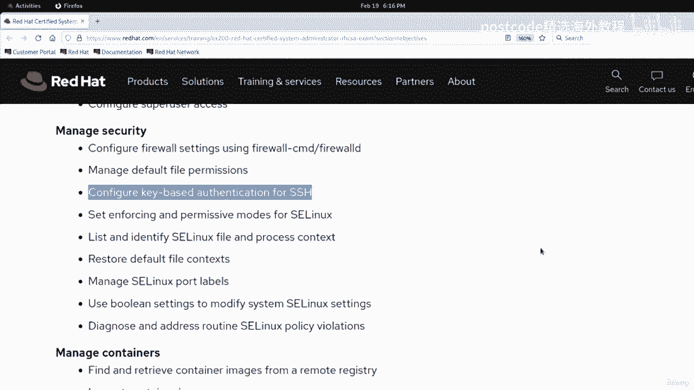
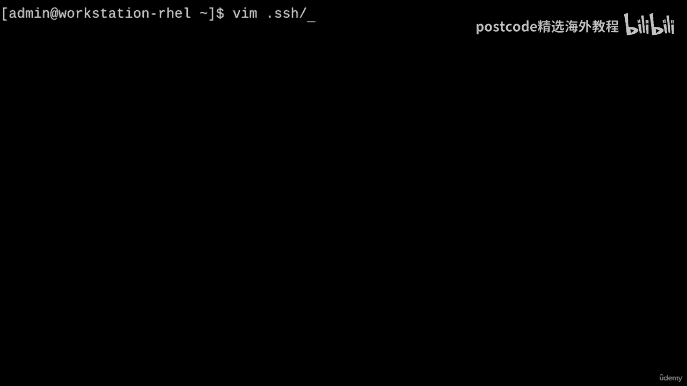
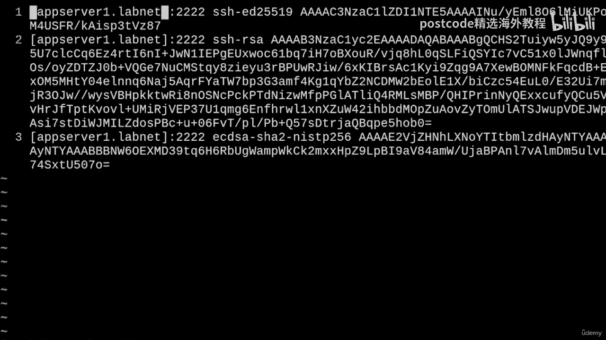
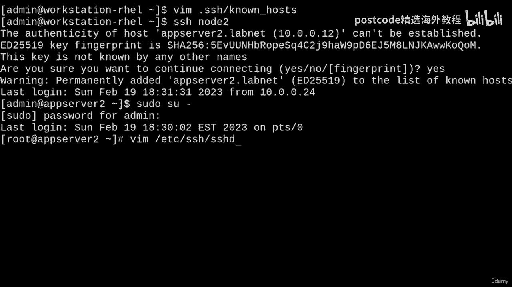
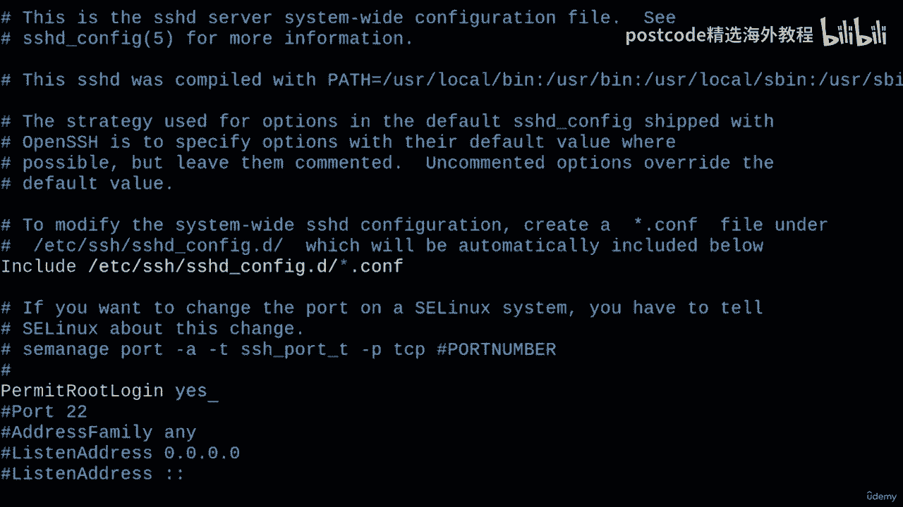
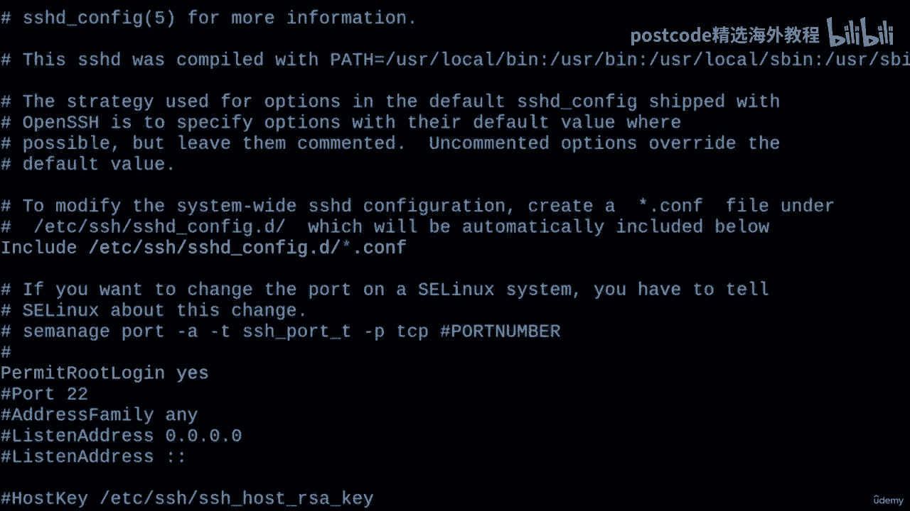
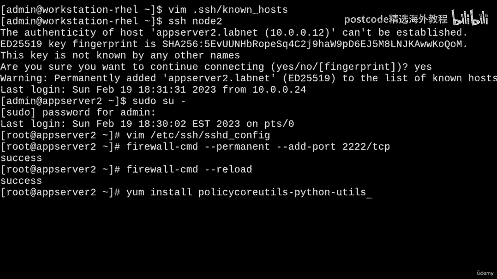
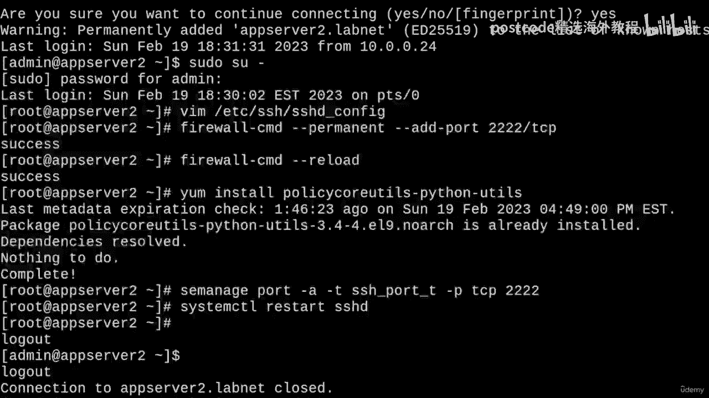
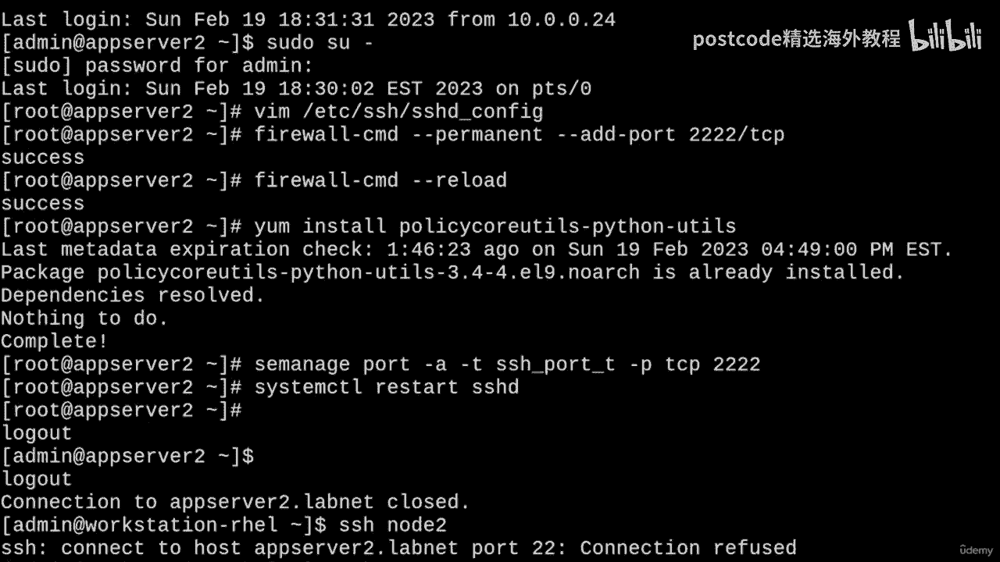
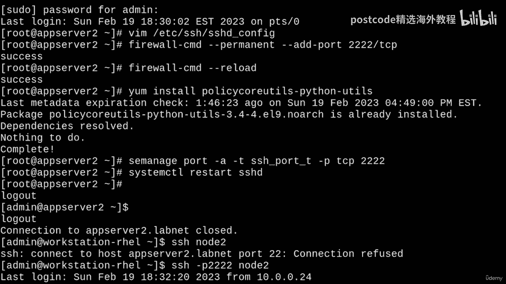

# 红帽企业Linux RHEL 9精通课程 — RHCSA与RHCE 2023认证全指南 - P61：06-06-003 OpenSSH - 精选海外教程postcode - BV1j64y1j7Zg

Hey there， everyone。In this video， we'll be working with Open SSH。Now。

 when it comes to RHCSA exam objectives， we have one up here called Access Remote System using SSH。

And the second one down here in managed security called configurefi key based authentication for SSH。

And I mean this is all nice and simple stuff， but what I'll do is save some bonus content for the end of the video if you're interested in a little bit about troubleshooting and configuring the SSH server。

Okay， so with all of that being said， let's start simple。

If you want to access another system with SSH using a username and password。

 you can simply just run SSH and then your username so I'll just type in admin。

At and then a host name or IP address。 So I'll just do app server2。 labnet。There we go。

And when you try to log in for the first time， SSH will prompt you to accept the host key fingerprint of the remote host。

 so I'll just say yes， I accept。And then I just have to type in my password。Andvoila。

 I'm logged into this remote system。But what if the SSH server listens on a non standard port I hear you say？

Well， in that case， we can just pass a dash P to the SSH command and provide a port number like 2222。

And then I'm just going to change this host to app Ser one since I know it listens on this non standard port。

And if I do this， I'll have to accept the host key fingerprint again。 that's okay。

 And then I just type in my password and there we go， I'm logged in once again。Okay。

 so cool beenlogy， but we already knew how to do that， we do this like all the time。Yeah。

 I'm talking to myself now， but anyways， if I log out here and run LsL。

What you'll see here is that this new dot SSH directory was created when I tried to log into a remote system for the first time。

And the permissions are 700， by the way， if you need to create this directory manually。

 that's just there for you。But you probably already knew that as well。

So here's something else that's pretty neat that you can do。

 We can create a small configuration file in the dot SSH directory called config。

And in here we can start specifying some options for an alias for one of our SSH connections。

Don't know what I mean let me clarify， so for example。

 let's say that we didn't want to remember such a long name like App server1。

labnet and not have to worry about supplying the port number as well。Well。

 then what we can do is create an alias for that host name called node 1 and have it point to apps server 1。

laveinate， we can also do the same thing for apps server 2 and just call it node 2 by doing something like this。

So I'll just type in host。Notode 1。And SSH likes to do this in proper case。

 so just keep that in mind。And then I'm going to move to the next line and indent a little bit。

And type in hosts。Name。And then set this to app server1 dot Lanet。And on the next line。

 I'll type in user admin， that's the username。And then on the third line， I'll just type in port。2，2。

2，2。Just like that。And like I was saying， I can do the same thing for App server2。

 I'll call it node 2， so I'll just do a host node2。And in here， I can just say the host。

Name is app server 2 dot Lavnet。And the user is admin。Cool。

 so now whenever we want to SS S H into app server 1， we'll just be able to run S S H node1。

And it looks like there's a permissions issue。 So this is a good thing。

 This means that I can show how to correct this。 We'll just run C， H modd 600 on the dot S， S H。

Config file。And this should fix it right up。 So now if I run SSH node 1。It works just fine。Cool。

So now let's get into working with public key authentication。

 so I'll log out of here and clear the screen。And we can get this going with the SSH dash keygen command。

So if you run SSH Keygen with no arguments， you'll get an interactive questionnaire asking about how you'd want to set up your key pairair。

So I can generate a simple key pair with the default file name by just hitting En a bunch of times。

There we go and you'll wind up with a private key named ID underscore RSA right here。

And a public key named ID_rssa。pub， and it's important to remember you'd only want to ever share the public key。

Right， so instead of that， let's also make a slightly more specialized key pair as well。

So we can do this by passing the arguments directly to SSH keygen。Like this。

 So I'll just do a dash T for type， and I'll set this key to be an RSA type。

And then dash B for key size， and I can do a decently sized key， like 4096 bits。

And if you leave these options out， by the way， you'll get the defaults。

 so that's just important to keep in mind。And then dash capital N is for a new pass phrase。

 so I can just blank this out by using double quotes like that。And the pass phrase， by the way。

 is something that SSH will ask you every time it tries to use this public private key pair to authenticate。

 so I'm just leaving it blank because I want to save an extra step。

We want passwordless authentication， right。 So anyways， dash lowercase F is for output file。

 So maybe we want to store this key in dot S H and call it something like cool key。

Because that's pretty cool。Or if you can think of a better name than that， then do that。And now。

 if I run this。Two files will be createdCool key， which is the private key and coololkey。 pubub。Okay。

 so let's copy our public keys to the server's authorized Keys file。So we can do this with SS S H。

 dash， copy， dash Id。And what I'll do first is just give it the default key。

 so I don't need to pass any options right now。 I can just type in something like node1。

And I'm going to copy the default ID RSA key to node1 because I'm not providing an identity file。

 I'll get into that in just a moment。So if I do this， it'll ask me to authenticate with my password。

And it'll copy that key。Okay， so now if I try to run SSH node1。

I'm able to log in without the password。Okay， so what about our special key pair， cool key。 Well。

 if we wanted that instead， let's do this to node 2。 actually。

 We'll just run S S H dash copyied dash I D and then pass a dash I for identity file。

 and then give the path of our private key。 So I'll just do dot S S H cool key。😊。

And I want the just cool key， not cool key do pub SSH will be able to tell that it wants to copy the public key。

 even if I provide the private key like this。Okay， and then I'll just give node to like that。Okay。

 so it asks for the password of node two， I'll just type that in。And there we go。

 now I can type in SSH node2 and I should be able to log in with no problems。

Now this might not always work because we're passing a special identity file。

 so if we want to be extra specific and make sure that it works。

 what we should do is edit our dot SSH confiIg file。Wheres that？And here it is。Why did that not work。

 Oh， I'm still logged into Appurber tube， whoops。So yeah， Ill want to edit the dot SSH on big file。

And what I'm going to add here is identity。Whileile。And point it to home directory。 SshH。Cool key。

All right。And we already knew that we were able to log in without the password just out of the gate。

 but this will make sure that we're being extra specific， which is always good。Okay， so。

With all of that being said， the defaults for SS S H keygen are perfectly all right for most use cases。

 The additional cool key that I showed you here might only really help if you're asked to set up a very specific scheme with your keys。

So with that covered， all I really have left is just some troubleshooting tips and some stuff about the SSH server。

Okay， so you may have seen the dreaded host key verification failed error before。

And what I'll do is show you why that happens and how you can remove the cached fingerprint on your client so that you can get back up and running。

So first， what'll do to simulate this situation is log into node 2 and elevate through a root shell。

And I'm going to Cd to the slash ETC SSH directory。

And I'm going to want to delete these SSH hostt blah， blah， blah key files。

So I'll just Rm SSH underscore host。Star， and I'll do an RM dash F。So make sure it's all gone。

And now all of those files are missing。 so I can regenerate the host key with S H， dash keygen。

 dash capital A。And so this is going to pretty much simulate how it would be if I reinstalled the OS on this machine or something like that。

So now if I log out of root and log out of this user。And try to S S H back into node 2。

 I'm going to get this scary message that says remote host identification has failed。

 It's possible someone's doing something nasty。 Oh， my。Yeah， so。If you see this uncalled forward。

 then that probably means there is something wrong， but we created this situation by ourselves。

 so everything's okay。Now， one way to get around this is just to pass a dash O。And then， set strict。

Post the checking to no。And that'll work。U albeit， it's still going to show us that error。

But I have a better way to get around this， I would not recommend turning that off， by the way。

 although it'll partially solve a problem。So the better thing to do would be to go into your dot SH directory。

And clear the entries in the known hosts file for App Ser2。So I'll just do that。

 I'll remove these entries for App server 2。 I can leave App server 1 alone。

And then I'll just write and quit。And now if I tried to connect without any options， of course。

It's going to ask me to accept this new host fingerprint。So I'll just do that。And there we go。

 everything is back in business。Yay。😊，Okay， and lastly。

 allow me to show you how you can change some various settings and the default port on the SSH server。

So now that I'm back into node 2， this time， I'm going to elevate to a root shell again。

And I'm going to edit the slash ETC SH SHD underscore config file。

Okay。And in here， there's a lot of stuff that you can change， for example。

 by default on REL 9 root login over SSH is disabled。

 but what I can do is bring that back by adding a new line and typing in permit。Root login。

And sending that to yes。And yeah， this will enable us to use root login。

 Not that I'm gonna show that because it's not really that interesting， but I'll turn it on。 Why not。

Another thing that we can do is enable stuff like X11 forwarding like over here。

So like I could switch this on to yes and uncomment this line。

 although I think it's already set to yes by default。But we'll just do that， why not？Okay。

 and the really important thing that I want to show you is the port setting。So let me go over here。

This highlighting thing is really annoying。I'm going to uncomment this line。

And I'm going to set the port to22，22。And what you'll notice up here is that there's this comment reminding us to run Se manage port。

To allow SSH to listen on this port and add this to our systems SE Linux policy。Okay。

So we'll just copy this line actually。And that makes everything easier。I'll just do that。

And then we'll just save this file。So instinctively。

 what we'll do is make a firewall exception for port 2222 with firewall dash CM D， dash dash add。Pt。

And then I'll do 2222 slash TCP。And I'm also going to add the dash dash permanent option to this。

Everything's got to be persistent on this exam， right。

And then ourwall dash CM dash dash reload to reload the configuration。 there we go。And next。

 we'll need to install the Se managed utility by doing a yum install policy core。Uils， dash， Python。

 dash uils。 I think I already have it installed on this box。

 but we can always just make sure of that。

And now we can run that command that we copied。Right here， and I'm going to change this to port 2222。

And then I'll just run this。And so it updated the SE Linux policy。

And now if I restart SSHD with a system CTL， restart SSHD。We're getting no errors there。 That's good。

 I'll log out of here。And now if I try to SS agent to node 2。

 it's going to say port 22 connection refused， which is fine。 we changed the port number。

 so we'll do port 2222。

And that works just fine。And yeah， so that's going to be about it for this video if there's anything important to take away from this。

 it would be the basic stuff we did to cover the objectives all of the additional things that I showed you are just to help us understand SSH better and how to configure network services Okay so I hope this was a helpful video and as always。

 thanks for watching。

