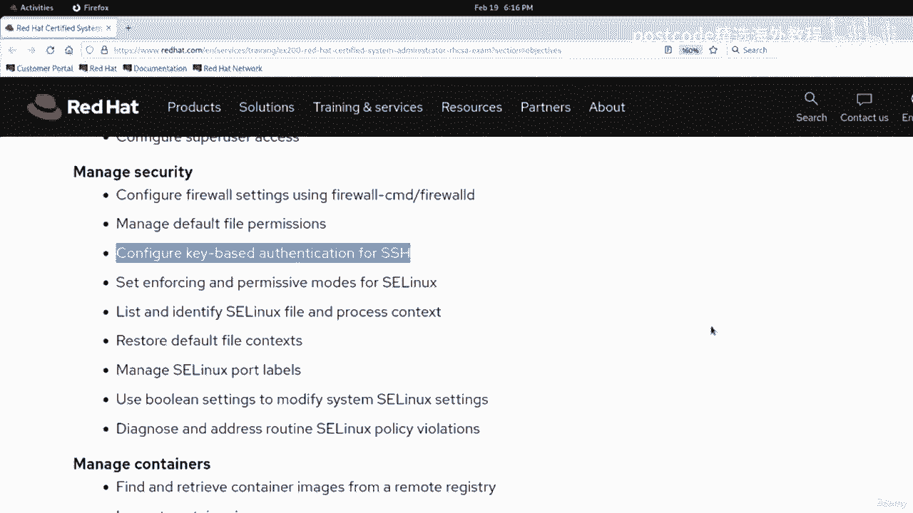
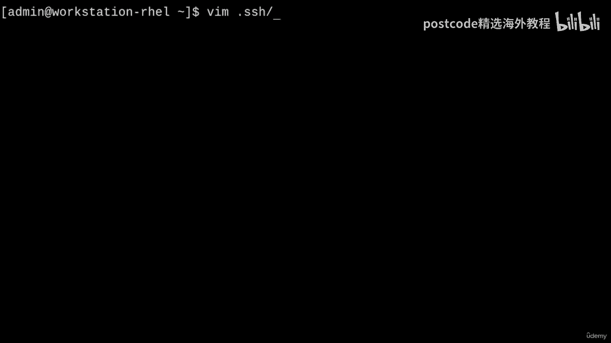
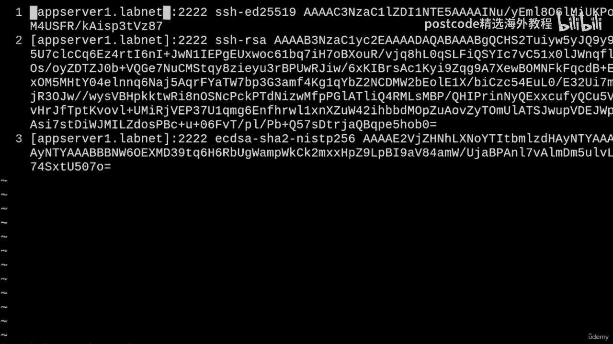
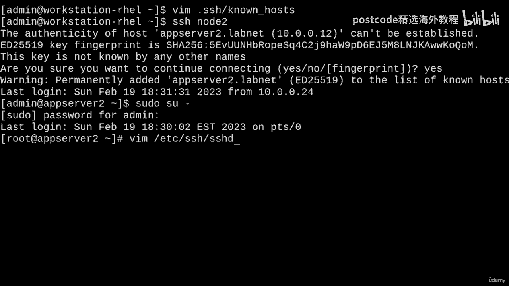
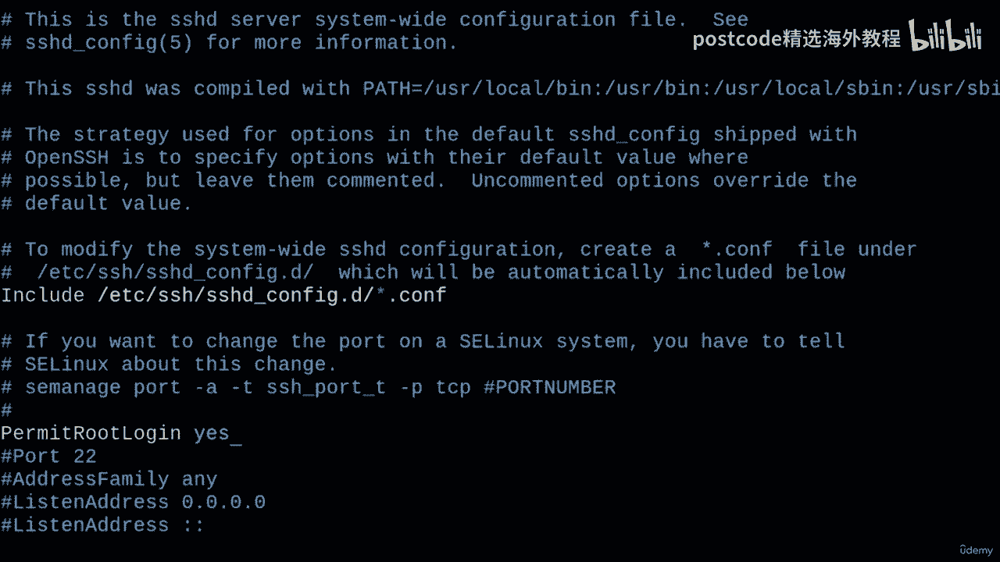
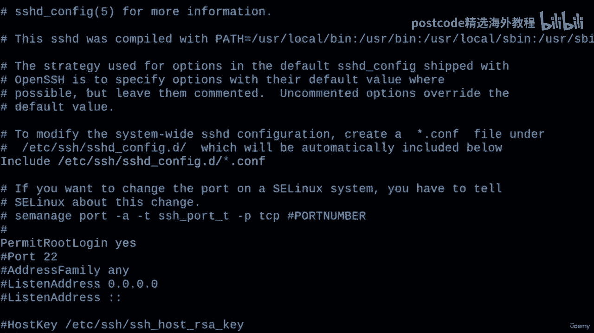
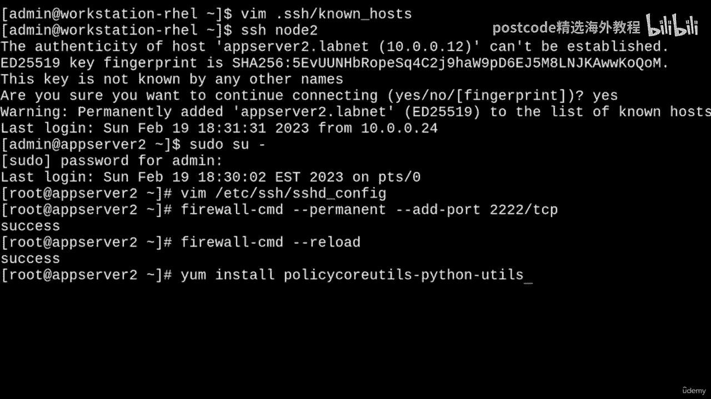
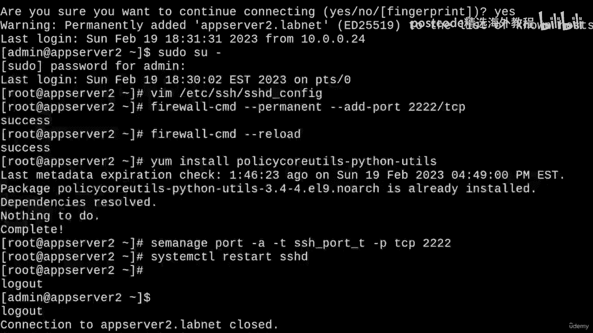
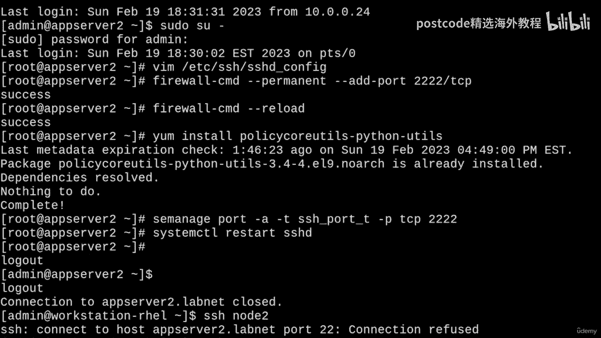
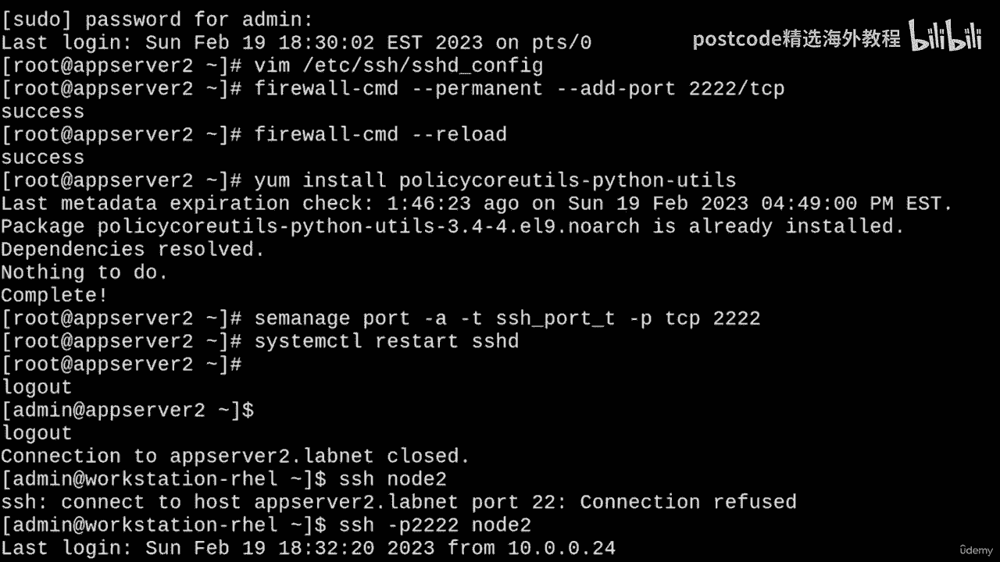

# 红帽企业Linux RHEL 9精通课程：06-06-003：OpenSSH配置与管理 🔐

在本节课中，我们将学习OpenSSH的核心操作，涵盖RHCSA和RHCE认证考试的相关目标。主要内容包括使用SSH访问远程系统、配置基于密钥的身份验证，以及一些高级的服务器配置和故障排除技巧。



---

## 使用用户名和密码访问远程系统

上一节我们介绍了课程概述，本节中我们来看看如何使用SSH进行最基本的远程登录。

要使用用户名和密码通过SSH访问另一台系统，只需运行 `ssh` 命令，后跟用户名和主机名或IP地址。

```bash
ssh admin@appserver2.labnet
```

首次尝试登录时，SSH会提示您接受远程主机的密钥指纹。输入 `yes` 接受，然后输入密码即可登录。

如果SSH服务器监听的是非标准端口，可以使用 `-p` 选项指定端口号。

```bash
ssh -p 2222 admin@appserver1.labnet
```

---

## 配置SSH客户端别名

为了简化连接过程，避免记忆冗长的主机名和端口，我们可以配置SSH客户端别名。

以下是创建别名配置的步骤：

1.  在用户家目录的 `.ssh/` 文件夹中创建或编辑 `config` 文件。
2.  为每个主机定义别名，并指定其对应的真实主机名、用户名和端口。

例如，创建 `~/.ssh/config` 文件并添加以下内容：

```bash
Host node1
    HostName appserver1.labnet
    User admin
    Port 2222

Host node2
    HostName appserver2.labnet
    User admin
```

**注意**：`config` 文件的权限必须设置为 `600`，否则SSH会出于安全原因拒绝使用它。

```bash
chmod 600 ~/.ssh/config
```

配置完成后，即可使用别名进行连接：

```bash
ssh node1
```

---

## 配置基于密钥的身份验证

上一节我们介绍了如何简化连接，本节中我们来看看如何实现无需密码的登录，即配置基于密钥的身份验证。

首先，使用 `ssh-keygen` 命令生成密钥对。不提供参数时，命令会交互式地询问配置选项。

```bash
ssh-keygen
```

连续按回车键使用默认设置，将在 `~/.ssh/` 目录下生成私钥 `id_rsa` 和公钥 `id_rsa.pub`。

您也可以直接指定参数来生成特定类型的密钥：

```bash
ssh-keygen -t rsa -b 4096 -N “” -f ~/.ssh/coolkey
```
*   `-t rsa`：指定密钥类型为RSA。
*   `-b 4096`：指定密钥长度为4096位。
*   `-N “”`：设置空密码短语（实现无密码登录）。
*   `-f ~/.ssh/coolkey`：指定生成的密钥文件名。

生成密钥后，需要将公钥复制到远程服务器的 `~/.ssh/authorized_keys` 文件中。可以使用 `ssh-copy-id` 命令自动完成。

对于默认密钥（`id_rsa`）：
```bash
ssh-copy-id node1
```

对于自定义密钥（如 `coolkey`）：
```bash
ssh-copy-id -i ~/.ssh/coolkey node2
```

执行命令后，输入一次远程用户的密码，之后即可实现无密码登录。

为了使使用自定义密钥的连接更可靠，可以在 `~/.ssh/config` 文件中为对应主机指定身份文件：

```bash
Host node2
    HostName appserver2.labnet
    User admin
    IdentityFile ~/.ssh/coolkey
```

---



## 故障排除：主机密钥验证失败



在管理SSH连接时，可能会遇到“主机密钥验证失败”的错误。这通常发生在远程服务器的主机密钥发生变化后（例如重装系统）。

模拟此情况：在服务器上删除旧的主机密钥并生成新的。
```bash
# 在远程服务器上执行
sudo rm -f /etc/ssh/ssh_host_*
sudo ssh-keygen -A
```

此时，客户端再次连接会收到警告。**不推荐**使用 `-o StrictHostKeyChecking=no` 来忽略检查，这会降低安全性。



**推荐**的做法是：编辑客户端上的 `~/.ssh/known_hosts` 文件，删除对应旧服务器的条目，然后重新连接并接受新的主机密钥。



---



## 配置SSH服务器

最后，我们来看看如何配置SSH服务器端的一些常用设置。

主要的配置文件是 `/etc/ssh/sshd_config`。修改前请备份。

以下是几个常见的配置项：

1.  **允许Root登录**：在RHEL 9上默认禁用。
    ```bash
    PermitRootLogin yes
    ```
2.  **启用X11转发**：
    ```bash
    X11Forwarding yes
    ```
3.  **更改默认监听端口**：
    ```bash
    Port 2222
    ```



**重要**：更改SSH端口后，必须执行以下步骤：

*   **更新防火墙规则**，允许新端口：
    ```bash
    sudo firewall-cmd --permanent --add-port=2222/tcp
    sudo firewall-cmd --reload
    ```
*   **更新SELinux策略**，允许SSH在新端口监听：
    ```bash
    sudo yum install policycoreutils-python-utils
    sudo semanage port -a -t ssh_port_t -p tcp 2222
    ```
*   **重启SSH服务**使配置生效：
    ```bash
    sudo systemctl restart sshd
    ```





---

## 总结



本节课中我们一起学习了OpenSSH的核心配置与管理。我们涵盖了使用密码和密钥进行远程登录的方法，学习了如何配置客户端别名以简化操作，并深入探讨了如何处理主机密钥变更的故障。最后，我们还介绍了服务器端的基本配置，包括更改监听端口和更新相应的防火墙与SELinux策略。掌握这些技能对于通过RHCSA/RHCE认证及日常系统管理都至关重要。