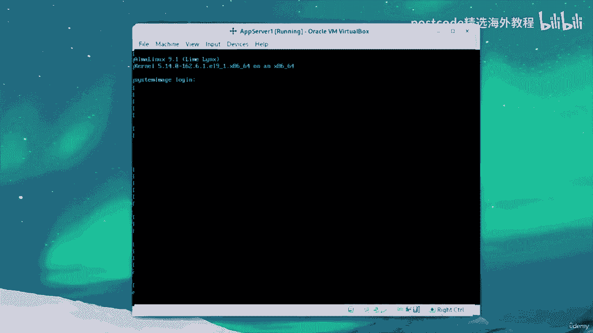
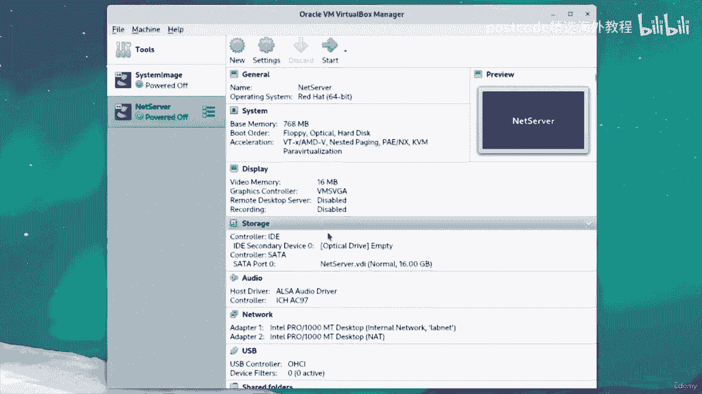

# 红帽企业Linux RHEL 9精通课程 — RHCSA与RHCE 2023认证全指南 - P62：07-07-001 Virtual lab setup - 精选海外教程postcode - BV1j64y1j7Zg

Hi， everyone。 This is the first part in a series of videos about creating a virtual Linux home lab。

 In this video， I'd like to overview the procedure and the network topology so you can get a feel for what we'll be doing。

 Let's begin。

First of all， the goal of this home lab is to emulate an enterprise computer network for experimentation and trying new things and virtual machines。

 On this channel， we'll get to use this lab to practice Linux system administration for redhead exams and the like。

The really important part here， I'd like to stress is that our home lab will provide a consistent learning environment that' will make it easy to follow along with future videos。

And the last thing is， well， to have fun。 Yeah， very cliche。

 but it'll be a lot easier to pick up new skills when you're having fun doing it。😊。

The hypervisor will be using is virtual box。 Virtual box is easy to use。

 open source and available for free on various platforms。

The design of this type of lab won't be dependent on any virtual box specific networking features。

 so you're free to recreate this setup up on other hypervisors， if you wish。

Another benefit of managing the network appliances ourselves is that it affords more control over what is actually going on in our lab network。

The operating system will be using on these virtual machines as enterprise Linux。

 You have a couple of options to choose from。 If you want。

 you can use Red Ha Enter Linux with the developer subscription。

 And there are also community rebuilds of the rail source， such as Rocky Linux and Alma Linux。

For these videos， we'll use the community district so we don't have to worry about unregistering and re registergistering the subscription whenever we clone on our VM。

Keep in mind， though， that you'll have to stay on top of that if you'd like to use real。

Here is a big picture view of the topology of our network。

 will standardize the provisioning of systems by creating a base image that all of our other Vms will be derived from。

 This base image is called system image on this diagram。

A big part of our little network is our net router called Ne Server。

 This machine will be our internet gateway for the rest of the V Ms and provide useful network surfaces like DN S and DHC P。

 So we don't have to memorize any I P addresses as our lab grows。

The net server Vm will have an extra interface card for connecting to the internet and have firewall rules in place to enable network address translation for all of this to work。

 Our Vms will be connected by a bridge， which is like a virtual network switch。

 And this will make up or an internal network called Lavenet。

We will also image out a workstation oriented VM， which will be our central point of contact for administering the other missions on the network。

From there， we can image more systems as we need them by following the same general steps we took for the other clones。

 I've just decided to call these machines app servers。Two of them is fine enough for this diagram。

 but it's not unlikely that we'll need more for future projects。Overall。

 having different hosts on the network is especially useful for experimenting and practicing the different tools that willll use。

 Ansible， for instance， will make healthy use of the apps of R Vms。

 as they'll be our managed nodes and our workst。 Hey， everyone。

 I hope you've been enjoying the series so far。 This is a fifth video。

 And what we'll be doing here is pretty easy and familiar to you If you saw the last two parts。😊。

All we're going to do is clone a few more systems from our system image VM and conduct some basic administration on them from our workstation to get started。

 make sure that you have net server running I have it running in headless mode。

 so that's why we can't see it。And then we'll just do the same rinse and repeat to clone system image。

So we'll make a clone and call it app server。And generate a new Macdress policy for all network adapters and hit next。

 make it a full clone and hit clone。And if I haven't said this already。

 the names are completely arbitrary。 You can set whatever name you want as long as you're being consistent with it。

 I just like to call them app server， workstation， et cetera。

So we're going to make another app server and call it app Ser2。

Same policy。Just like before。And we'll make it a full coin。We'll do the same for app server 3。

 just like so， name it App server 3。Set the policy， hit next， make it a full clone and hit clone。

So that's pretty good and we'll make a final app server clone just like this， app Silver4。

Same old policy。Full clone in the Rio。Now， if you're worried about resource usage when running all these VMs。

 bear in mind that we're trying our best。 We've lowered our memory and we're using a dynamically allocated disc。

 So in most cases， this is more than enough to keep things relatively lightweight。So anyways。

 now we have a whopping four count of four app servers。

 and we're going to do the same procedure that we've always done before。

 which is we're going to start each of them and change the host name。

So give me a moment just to get this sorted out。

And will start with number one since it should be booted up first。

Will log in this admin。And run pseudo。Host name， C T L。Host name and call this app server  one。

Then we just type our password and one more thing we can do is just reboot the VM。

So that the host name change takes effect immediately。Remember to do that with Su。

Then we can go ahead and minimize that Vm and move on to number two。

 We'll log in this admin once again。And type in pseudo， host name， C T L。

 host name and call this app server2。Enter your password and then weo pseudo reboot。Okay。

 we're almost there for App Ser3， we'll log in as admin， do the same thing。

 we'll change our host name with pseudo host name CTO， host name app Ser3。And then， reboot。

Now if you don't want to reboot， you can just restart network manager and that would do the same thing for our host name situation。

Lastly， we'll do number four。Host name CTL， same old thing。And we'll call it app server4。

What would webo？

And finally， we're done， that was a lot。So we can just minimize our VMs and start up workstation now。

When workstation boots up， we'll log in and open up the terminal。

All right， so now in our terminal， I'm going to make the font size a little bit bigger。

 what we're going to want to do is generate some SSH key pairs。

 So first we'll create a dot SSH directory just like this。

And give it the correct permissions with CH modd 700。Dot s h。

Then we're going to want to run S S H dash keygen。To generate a key pair。

Will save that key pair in dot SSH and call it WS key for workstation key。

We won't enter a pass phrase。And that should be it。And then from there。

 we're going to run S SH copy I D。And pass a dash I for the identity file， which would be dot S H s。

Worktation key dot pub。 and then we'll type in the username and host name of app server 1。

 So that would be admin at app server 1。 So we'll just say enter and say yes to that and type in our password。

So that should be good now we copied the ID and we're going to do the same thing for apps server2，3。

 and 4。So we'll just say yes， enter our password。And do it for three。Say yes。

 our password and lastly number four。Enter password and there we go。

So now we should be able to log into any one of these without any problem。

So let's try it on App server 4 SSH Admin app server4， and there we go， we're logged in。All right。

 So for the purposes of this series， that's going to be about it。

 We've set up a home lab with five control nodes， including net Server， our Linux router。

 and we have a nice central management console that being workstation in future videos。

 we'll be making healthy use of our new home lab to experiment， break stuff and pick up new skills。

I hope this video helped。 Thanks for watching。Welcome back。

 This is the second part in a series of videos about creating a virtual home lab。 In this video。

 we'll download and install a copy of all Malens 9 in virtual box to get started。

 head over to all Millens dot org and go to the download section。😊。

On this page， we're looking for the X 8664 architecture and the latest minor release of version 9。

 So in my case， that's 9。1。From here， just choose a mirror nearest to you and select the latest boot ISO and we'll want this boot ISO so that the download goes by a little quicker and we get the latest packages over the internet when we install。

So I'll be right back when the downloads through。Allright。

 so the download just finished so we can put away our browser and start a virtual box。

Here in virtualr box， we'll create a new virtual machine and name system image。

Willll select the version as red hat 64 bit and hit next。

We'll give this VM2 gigabytes of memory so the installer works properly and create a virtual hard disk using the VDI format。

We'll select dynamically allocated disk since we'll be cloning this VM lot。

And will give it 16 GB of space。And that should be good。 so we can just hit create。

Now that we made our profile， we can start it up。On first boot virtual box will prompt you to add a disk。

 so we'll add our installer media like so。And。Hit start。When you get to this screen。

 I recommend testing the media before we install， so I'll just do that and I'll come back when it's all booted up。

Okay， now that the installer is booted， we can choose our preferred language and hit continue。

Over here， I urge you to check your key map and time zone and make sure they're correct。

 mine look good， and then head over to Sulur selection。Over here。

 we'll choose a minimal install and hit done。Your installation source should say closest mirror mind does。

 so that looks good， and then we can head over to disc partitioning。

Select your virtual hard disk and go to custom。We're going to create an automatic logical volume scheme。

So there we go， and I like to fiddle around with the numbers and the names a little bit。

 so I'll just do that。But obviously， you don't have to。Okay， so all of that looks good。

 so we'll just press done and accept the changes。Okay。

 we're going to leave K dump disabled since it just takes up memory and going to network and host name。

 we're going to set the host name to system image。And just hit apply。

We won't be setting a security profile， so we'll just leave that alone and we'll also leave the root account disabled。

We're just going to create a normal administrator account named admin。

And we'll set a phenomenal password just like so。And you might need to hit done twice。

Then we can begin our installation。So this will take up a couple of minutes depending on your internet connection。

 so I'll be right back when it's done。Okay， so our installation is finished so we can just reboot our VM。

And when it comes back up， we can start logging in。All right。

 we'll log in as the user admin that we created。And just a coast on the safe side will run Su。Yong。

Update。Type in our password。And let's see here。As expected。

 we don't need any new packages so that looks good。

And now we'll go ahead and grab a root shell with pseudo SU。

Another thing you can do is install a text editor so we'll just install it with Su Y Vim。

 just hit yes， and you might get prompted about GPG keys so you can also say yes to that too。

Okay， cool。 So that's looking good。 And what we're going to want to do now is reconfigure LVM a little bit so that it doesn't freak out when we clone our VM。

 So just go ahead and type in vim。ET C。LVM。LVM dot com。

And what we're going to do now is search for the string use devices vial。And uncomment that line。

That's all we need to do。 so we can just write and quit。

And that should be good for configuring our VM。 What we'll want to do now is power off。

And head back to the virtual box console。We'll just change a couple of settings to prepare a VM for cloning。

 so just head over to settings。And then， system。And we're going to reduce the amount of memory to just about under a gig。

The reason why is we'll be cloning our system a lot。

 so this will be pretty necessary when we're running a lot of VMs at once。Anyways。

 we'll head over a network， and we're going to change this net attachment to an internal network。

 we'll call Lanet。 You should already be familiar with this if you saw the first video。

If you're using a different hypervisor， the equivalent to this would be a bridge interface。Anyways。

 we can just hit done， and that should be good。 we configured our VM， and it's ready for cloning。

 So in the next video， we'll be cloning this Vm into a nett router。 So that'll be pretty fun。

 And yeah， that's about it。 Thanks。 Hi again。 you're watching the fourth part in a series of videos where we set up a virtual Linux home lab。

 In this video， we'll be cloning our system image VM into a workstation roll for our lab network。😊。

This workstation will pretty much be our control node to access and administer the other VMs with SSH and Asible。

We will set up a graphical environment with a few helpful programs installed as well。

 So just like in the previous video， where we set up net serverver。

 we'll do the same cloning process for workstation。 So once again。

 right click on system image and click clone。 We name or clone works stationation。😊。

And set the Mac address policy to generate a new Mac address。

 then click next and we'll make our clone a full clone just like before and hit clone。

When that's done， we'll change a few settings to make this workst a little bit faster。

 So go over to settings system， and we're going to boost up the base memory to about 4 GB。So。

 that should be good。And next we'll set the number of CPUs， two CPUs should be all right。

 but you can do more if you wish I'm actually going to set four。And for our display。

 we're going to add some more video memory in fact。

 we'll make it the max of 128 mebytes to make sure our graphical environment runs smoothly。

The last important thing I'd like to point out is that we're still indeed connected to Lanet。

 and that's actually all we'll need to get online and communicate with the other host on our network。

 So we'll just click O to that。 And what we're going to do now is actually start up net serverver if you haven't already。

 So you can start in a headless mode so you don't actually have to look at it。

And then we can start workstation。We'll need net server running at all times when we want network access for anything connected to Lanet。

 So now you know why we're doing that。

So now that workstation is started up， make sure to first of all， log in。 And just like before。

 we're going to change the host name with Su。Host name， C， T， L， host name and workstation。

Just like that。And once weve done that， we can also use pseudo S u dash to get a login shell。

And just a coast on the safe side， we're once again going to run yum update。

And so all of that looks good。 And next we're going to install a couple of package groups。

 So you're going to want to type in yum group install。And in quotes， development tools。

And you won't need quotes for the other two。 We're just going to want base dash X and fonts with a capital F。

Okay， so we'll just say yes to that。And this will install the tools we need to build the virtual box guest edition kernel modules。

 and also some basic packages for a Gui。So we'll come back once that's been installed。Okay。

 now with our package groups installed， we're going to need to install just a couple of more regular packages。

 So just run youngum install GDM。Genome terminal。Nutilus。Firefox。And G edit。Okay。

We'll just say yes to that。And now we need GDM so that we can log into our graphical session and the rest of the tools are there to just make it actually usable as a workstation。

 So if we need to look things up， we have Firefox handy。 If we want to start using the terminal。

 we have a graphical terminal to do that， and we also have a file manager。

 so all of those things will definitely make this a lot more of a comfortable experience。

So we'll just allow that to install and come back when it's finished。Okay。

 now that the packages are ready， we'll need to change our default system de target to graphical just like this system CTL set default graphical target。

Just like that。 And there we go。 We can also jump right into the graphical session without rebooting with system CTL。

Iolate。Graphal。And just hit En to that， and this should take us straight into the login manager。

So now we can just log in as amin。And we should be right in。

Now， for the best experience， we should install the virtual box guest editions just like this。 First。

 head up to the top after hitting your host key and go to devices and get the virtualrbox guest edition image。

Sometimes it might ask you to download， so I'll just do that。And itll take a second。

And then we'll insert it into our VM。You should now get an automatic prompt that asks if you'd like to run the software。

 so just say run。And type in your password。

And this should start building the virtual box guest edition kernel modules。

 so it'll take a little bit to rebuild the init Rammificest and do a couple of other things。

 and then we can move on。

Okay， cool， so we just finished building so we can just press enter to quit。

And you might have even noticed this already because the kernel modules get loaded right away。

 but now we can move our mouse cursor inside and outside of the window without having to use the host key。

 so that's pretty cool， but for best results we should reboot。

So we'll do that and it'll take a moment。And what we'll notice now is instead of getting dropped into the command line environment。

 we get a graphical display manager， so that's pretty cool。 And so now we can just log in again。

And yeah。

Now we have the kernel modules installed so we can do all kinds of cool things like resize the window。

To change the screen resolution。You can change the resolution now much more easily to have a more comfortable viewing experience。

We can do a couple of other things， too， I guess。We can。 let's see here， make the font bigger。

 We can ping our own host name。Worktation。And notice that it gets attached to the domain labnet。

 So that's pretty cool。 And the same thing should happen if we ping net server。

So yeah， we're pretty much able to access the other host on our network as well as access the internet。

I mean， that was already proven since we' were able to install packages。

 but we can also test that with ping so as you can see it's working well。

So I just wanted to show that off。 That's pretty cool。And that'll be all for this video。

 So stay tuned for part 5 where we clone a couple more VM so that we have some host to configure on our network。

So that'll be about it for this video。 I hope it helped。 See ya。 And thanks for watching。What's good。

 everyone。 You're watching the third installment in this series of videos on creating a virtual Linux home lab。

 In this video， we'll clone our system image Vm to build a user friendly router and name server role on our network。

😊，Before we clone the system， make sure that your system image VM from last video is connected to LaveN。

So let's see here all of that looks great， so we'll just hit okay。

We'll come back to these network settings in just a moment。 But first。

 we're going to right click on system image and hit clone。

We're going to name our new clone net server。And will set the Mac address policy to generate a new address for all network adapters。

We'll hit next and create a full clone and hit clone。Okay， with our new clone created。

 go to settings and network。And check here that we still have our network labnet that we made before。

 but now we're going to add a second adapter。Enable it and attach it to the built in net network so we can get online。

So that should be good so we can just hit OK and start our VM。

All right。 Now that our Vm has started up， the very first thing we want to do is log in。

 And as you can see， our host name is still system image and we don't want that。

 So we're going to type in pseudo。Host name， CT T L， host name and name it net serverver。 That way。

 there will be no conflicts。So we'll just do that。And get a new prompt by saying， pseudo S U dash。

Okay， now that we've set up our host name， we can start setting up our router since setting up a Linux router isn't really part of the RHSA or RHCE。

 which is sort of the focus of these videos。 I've written an ansible playbook to automate this part。

 However， at the end of the video， I will briefly explain how the playbook works。

 If you're curious about what configurations I've said。

So we'll need a few packages to clone and run the playbook。 So first run yum。Update。

Just to make sure that we're up to date。And next run， yum， install git。Ansible dash Co。

And RE dash system， dash rolls。And then just say yes to that。 and we'll come back when it's done。

 Now that the installation has finished， you can clone my repository with git， clone H T T P。

 S colon slash slash Gitthub dot com slash Aki fun。

 That's A A K Y F U N slash Rel router Ansible separated by dashes。

So we'll just do that and it'll clone my repository and when that finishes。

 change into the directory。Now before we run the playbook， let's check out a couple of things。

 notably if we run IPA for address。We'll see that the first interface in our list is loop back。

 The second interface is our Lanet interface， which does not have an IP address。

 and the third interface is our Na network from Virual box。

 which is why we're still able to access the internet。Well。

 one of the things that this play will remediate is that it'll assign a static IP address to a router and then set a dynamic DHCP address to all of our other nodes that' will show up on our network in the future。

So with that being said， we can also check out NMCLI con show and we'll see something similar。

 We have a working wired connection and we also have an inactive connection。

So with all of that put together， now it's time to run the playbook with the command Ansible D playbook。

And then dash I for inventory and then type in inventory。ini that's the name of the inventory file。

 and then we'll provide the name of the playbook， so that's RElror。yml。And we'll just run that。

 and it'll gather some facts， do some configurations and package installs。 and in a moment。

 it'll finish up。Now we're running this playbook against our local machine since doing things like network configuration over remote connection with Ansible is prone to errors just because you're getting disconnected from the network in the middle of it。

 so that's why we're running it locally by the way。So it finished。

 and now we can just reboot our system to make sure the changes take effect。But the system back up。

 log in and will' check out a couple of cool things。So if you run I for address。

You'll see here that our Lanet interface has a static IP address of 10。0。0。1。

So that's pretty cool。And if you run NMCI con show。You'll see two network connections。

 an external one and an internal one。 The external one is connected to the Nat adapter that virtual box provides。

 and the internal one is connected to our labnet bridge。

So that's pretty nifty and if we run System CTL's status DNS maskask。

 we can tell that indeed DNS maskask， our DHCP and DNS server is running and working well。

So that'll be all for setting up the router。 You may stop watching here if you want。

 but for the remainder of the video， I'll brieflyfully explain how the playbook sets up our VM if you're curious about the defaults I chose。

So I'll go ahead and do that now。So over here on Gitthub。

 here's a view of my repository we'll take a look at RErouter。yMl。Okay， so here at the top。

 I set some facts。For the configuration files used by DN S， mask and network manager。

Which are providing the service for the setup。As you can see， the DHCP address range is pretty small。

You can pump up those numbers if you want to， but I'm just going to leave them as is。

Over here I do a couple of different things， I make a few adjustments and do some checks to tele apart the Internet connected interface。

 our virtual boxnet adapter from the internal network interface， so that's Lanet。

It's sort of hacky and depending on how you look at it， it might be even a little messy too。

 but it works for our purposes and this is my first playbook。I guess， that's fine。Okay， down here。

Wei。Clear out any old network connections in network manager。

 So we're just like really starting from scratch。And next。

 we install some configuration files using templates to fill in the variables。

Nextex we install D n S mask。And installed a configuration file for DNS mask。

 also using templates and start it。And this last part over here is to add the net server host name to the host file so that all of the other computers can see it in our lab network。

And we also enable IPV for forwarding in our kernel。

This final section here is just for setting up firewall D。 So as you can see。

 I couldn't set the default zone to internally using the ruless。

So what I did was I used a shell command to do that。

And this last part is just adding DNS and DHCP exceptions to the firewall and enabling masquerading。

 which is basically networking just translation on the internal zone。So。That's pretty much it。嗯。

If you take a look at my Github， youll also see I made a similar thing to this playbook。

 except it's a script。It does pretty much the same thing。

 but I recommend using the Anible version since it's a little more up to date and easier to kind of read。

Anyways， I hope that helps you understand how the router VM is getting set up。

 Stay tuned for the next video， thanks。

