# 红帽企业Linux RHEL 9精通课程：P62：07-07-001 虚拟实验室搭建教程

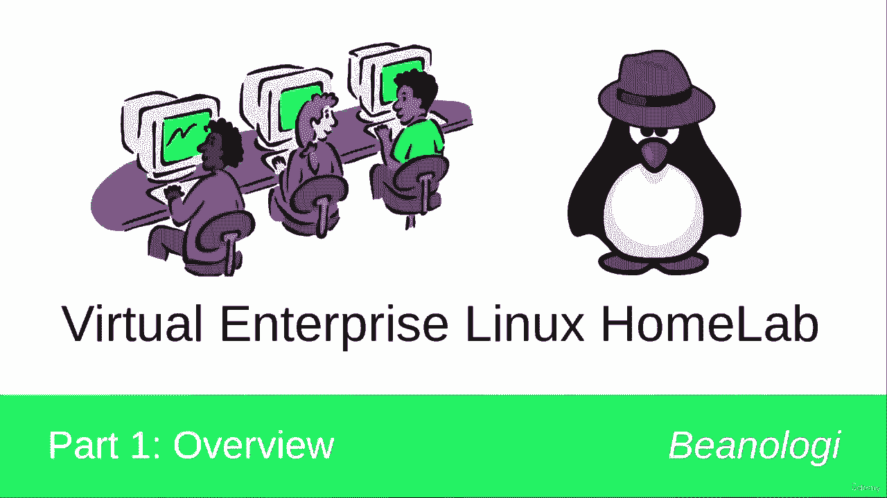

## 概述
在本节课中，我们将学习如何搭建一个用于学习和实验的虚拟Linux家庭实验室。这个实验室将模拟企业网络环境，帮助我们练习Linux系统管理、准备红帽认证考试，并提供一个稳定、一致的学习平台。

---

## 第一部分：实验室目标与设计 🎯

上一节我们介绍了课程概述，本节中我们来看看搭建这个家庭实验室的具体目标和整体设计。

家庭实验室的主要目标是创建一个用于实验和尝试新技术的虚拟企业计算机网络。我们将使用这个实验室来练习Linux系统管理，特别是为红帽认证考试做准备。

一个非常重要的部分是，我们的家庭实验室将提供一个一致的学习环境，使得跟随后续视频教程变得更容易。最后，搭建过程本身也应当充满乐趣，这能让我们更轻松地掌握新技能。

我们将使用VirtualBox作为虚拟化平台。VirtualBox易于使用、开源，并且可以在多种平台上免费获取。本实验室的设计不依赖于任何VirtualBox特有的网络功能，因此你也可以在其他虚拟化平台上复现此设置。

自行管理网络设备的好处是，我们可以更精确地控制实验室网络中发生的一切。

虚拟机上使用的操作系统将是企业级Linux。你有几个选择：可以使用带有开发者订阅的Red Hat Enterprise Linux，也可以使用社区重建版本，如Rocky Linux或Alma Linux。在本系列视频中，我们将使用社区发行版，以避免在克隆虚拟机时处理订阅的注册与注销问题。

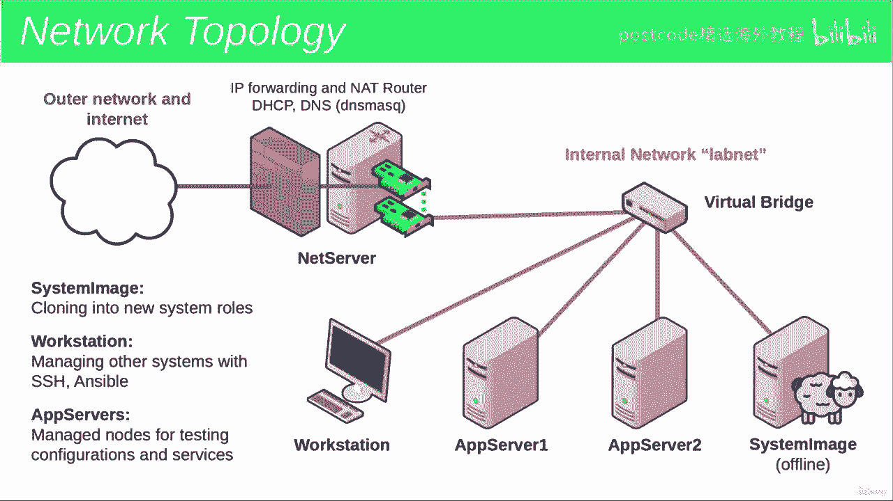

以下是我们的网络拓扑概览图。我们将通过创建一个基础镜像来标准化系统部署，所有其他虚拟机都将从这个基础镜像派生。这个基础镜像在图中被称为“系统镜像”。

我们网络的核心是一个名为“Net Server”的路由器。这台机器将作为其他虚拟机的互联网网关，并提供DNS和DHCP等有用的网络服务，这样随着实验室的扩展，我们就不必记忆任何IP地址。

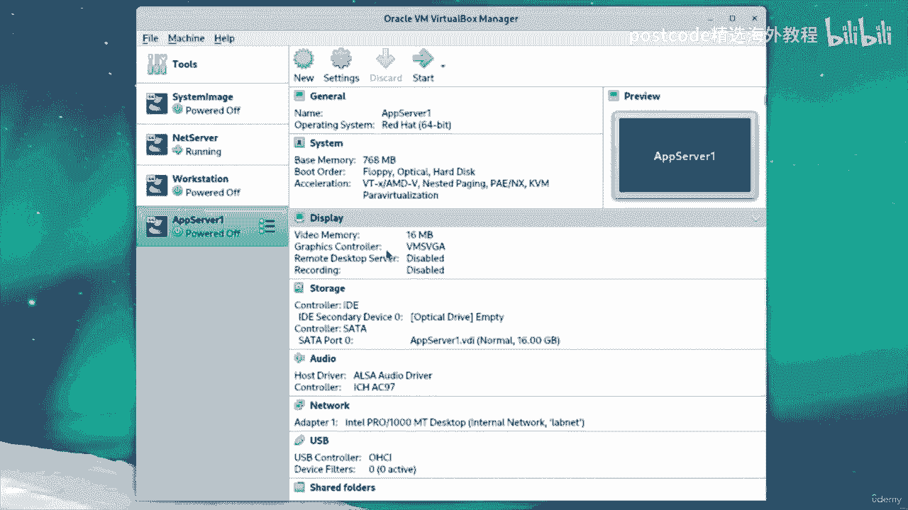

Net Server虚拟机将有一块额外的网卡用于连接互联网，并配置防火墙规则以实现网络地址转换，从而使整个网络正常工作。我们的虚拟机将通过一个桥接网络（类似于虚拟网络交换机）连接，构成一个名为“Labnet”的内部网络。

我们还将创建一个面向工作站的虚拟机，它将作为管理网络上其他机器的主要接触点。

之后，我们可以根据需要，按照克隆其他虚拟机时采取的通用步骤，创建更多系统。在图中，我们称这些机器为“应用服务器”。图中显示两台就足够了，但为了未来的项目，我们很可能需要更多。

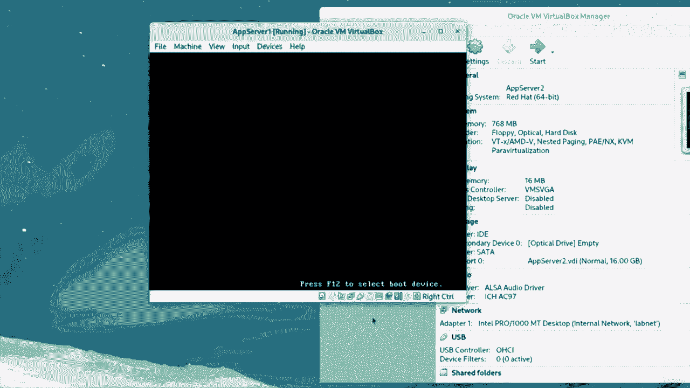

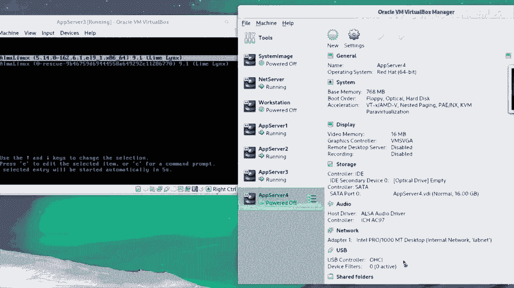

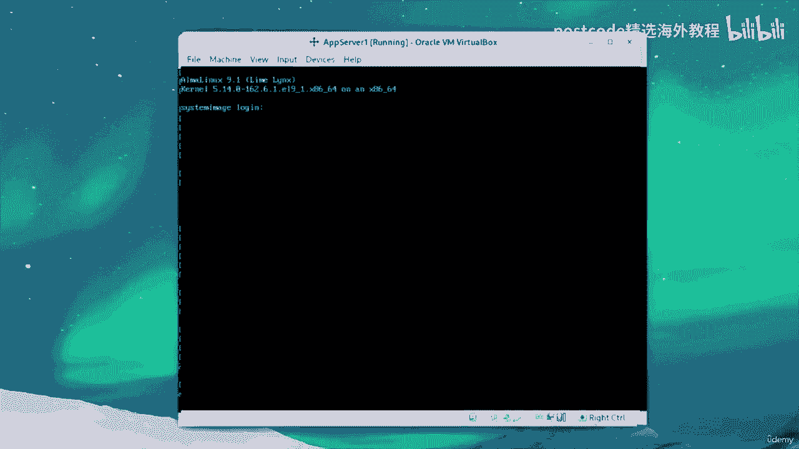

总的来说，在网络中拥有不同的主机对于实验和练习我们将要使用的各种工具特别有用。例如，Ansible将充分利用这些应用服务器虚拟机，因为它们将成为我们的被管理节点。

---

## 第二部分：下载与安装基础系统镜像 💾

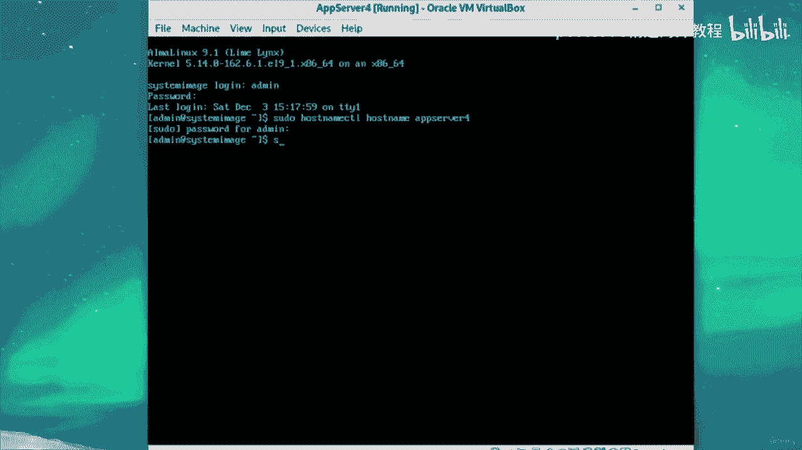

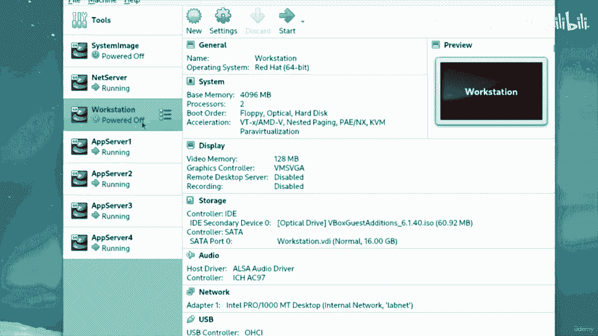

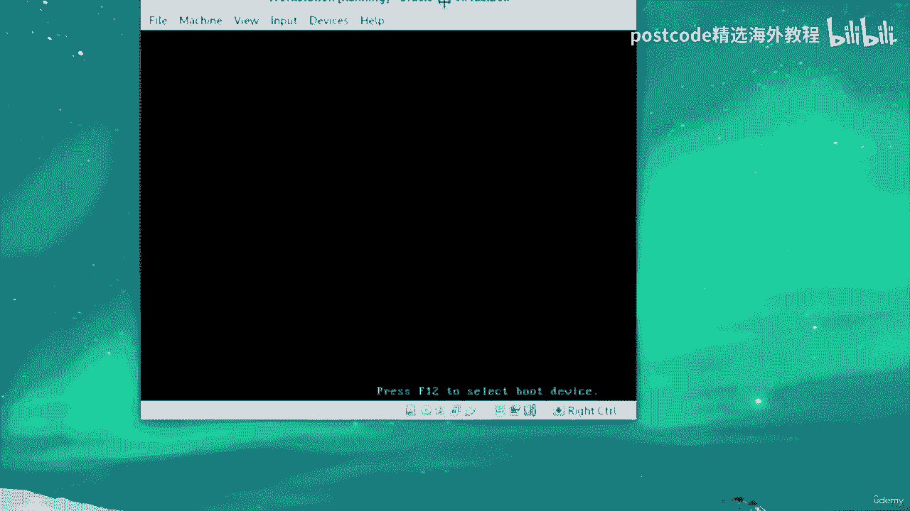

上一节我们了解了实验室的蓝图，本节我们将开始动手，下载并安装作为所有虚拟机基础的系统镜像。

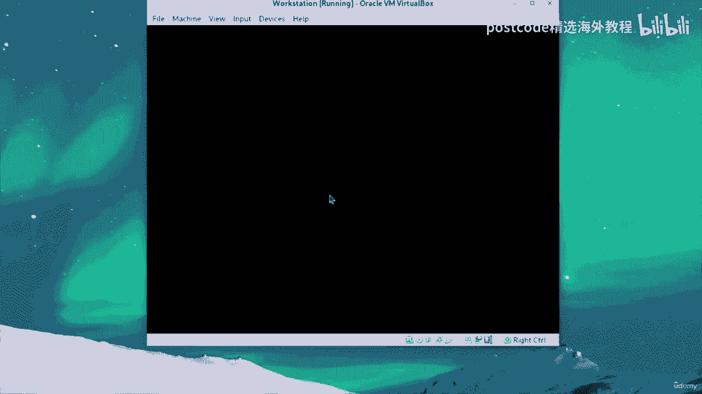

首先，访问AlmaLinux官方网站的下载页面。我们需要选择x86_64架构和版本9的最新次要发行版（例如9.1）。选择一个离你最近的镜像站点，下载最新的“boot ISO”。使用boot ISO可以让下载更快，并且在安装时通过互联网获取最新的软件包。

下载完成后，打开VirtualBox。创建一个新的虚拟机，命名为“system-image”。版本选择“Red Hat (64-bit)”。为虚拟机分配2GB内存以确保安装程序正常运行。创建一个虚拟硬盘，使用VDI格式，并选择“动态分配”。分配16GB空间即可，然后点击“创建”。

创建配置文件后，启动虚拟机。首次启动时，VirtualBox会提示你选择安装介质，选择我们下载的boot ISO文件，然后点击“启动”。

启动后，建议先测试安装介质，然后选择首选语言并继续。检查键盘映射和时区设置是否正确，然后进入“软件选择”。在这里，我们选择“最小化安装”。安装源应显示为“最近的镜像”。接着进入“磁盘分区”。

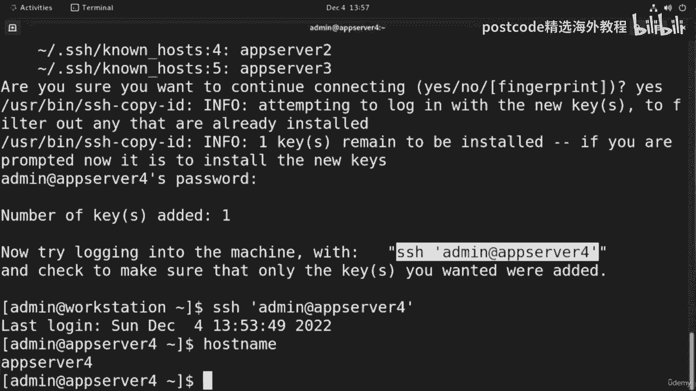

选择你的虚拟硬盘，进入“自定义”。我们将创建一个自动的逻辑卷管理方案。你可以调整数字和名称，但这不是必须的。完成后，接受更改。

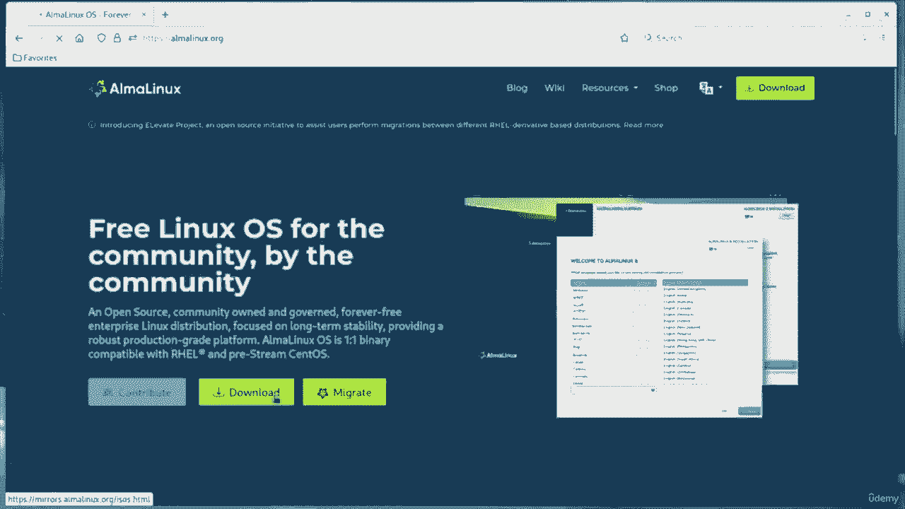

我们将禁用Kdump以节省内存。进入“网络和主机名”，将主机名设置为“system-image”，然后点击“应用”。我们不设置安全策略，保持root账户禁用。创建一个名为“admin”的普通管理员账户，并设置一个强密码。然后开始安装。

安装过程需要几分钟，取决于你的网络连接。安装完成后，重启虚拟机。

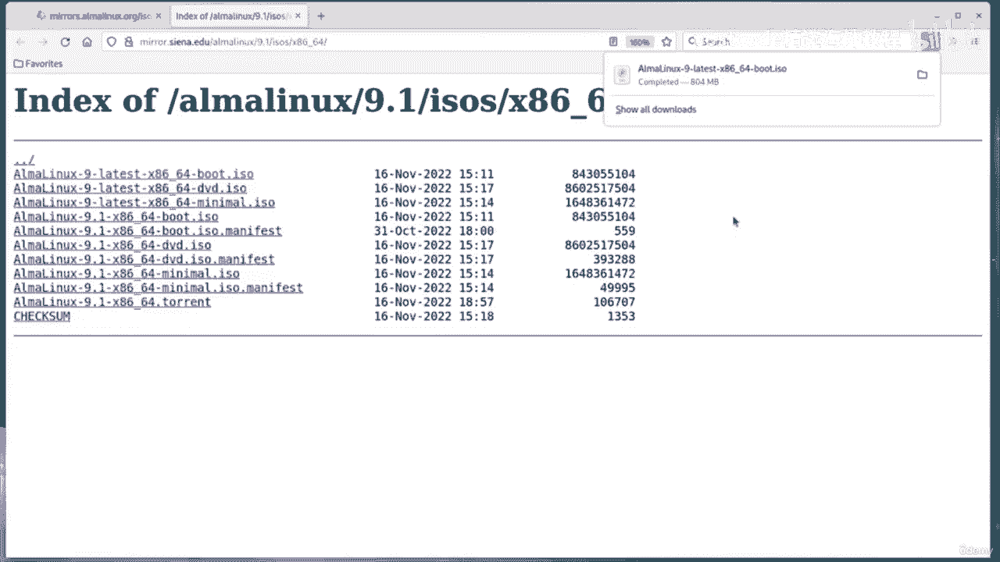

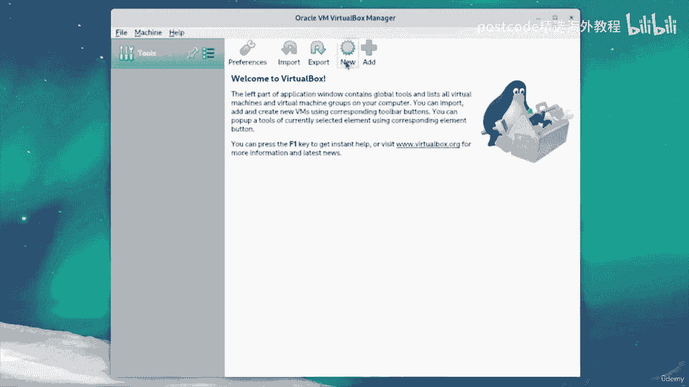

重启后，以我们创建的“admin”用户登录。为了安全起见，我们更新系统：`sudo yum update`。通常不需要新软件包。然后获取root shell：`sudo su -`。

安装一个文本编辑器，例如Vim：`sudo yum install vim`。安装过程中可能会提示GPG密钥，选择同意。

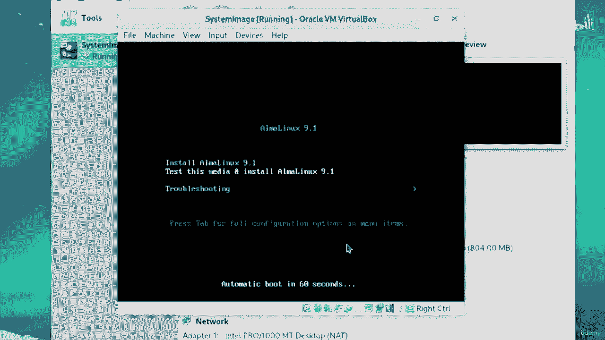

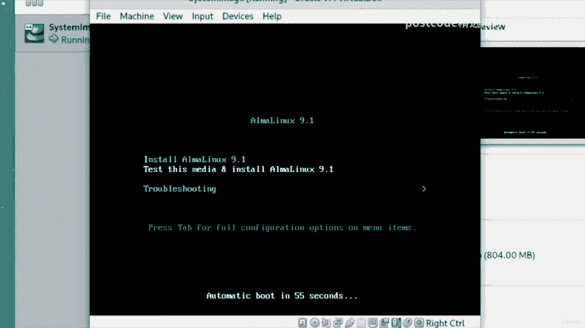

接下来，我们需要重新配置LVM，以防止克隆虚拟机时出现问题。使用Vim编辑配置文件：`vim /etc/lvm/lvm.conf`。在文件中搜索字符串“use_devicesfile”，并取消该行的注释。保存并退出。

现在，关闭虚拟机，回到VirtualBox控制台。我们需要更改一些设置，为克隆做准备。进入“设置”->“系统”，将内存减少到大约1GB以下。这是因为我们将频繁克隆此系统，当同时运行多个虚拟机时，这很有必要。

接着，进入“网络”设置，将网络连接从“NAT”更改为“内部网络”，并将其命名为“Labnet”。如果你使用其他虚拟化软件，这相当于一个桥接接口。完成后，我们的基础虚拟机就配置好并可以用于克隆了。

---

## 第三部分：克隆并配置网络路由器/服务器 🌐

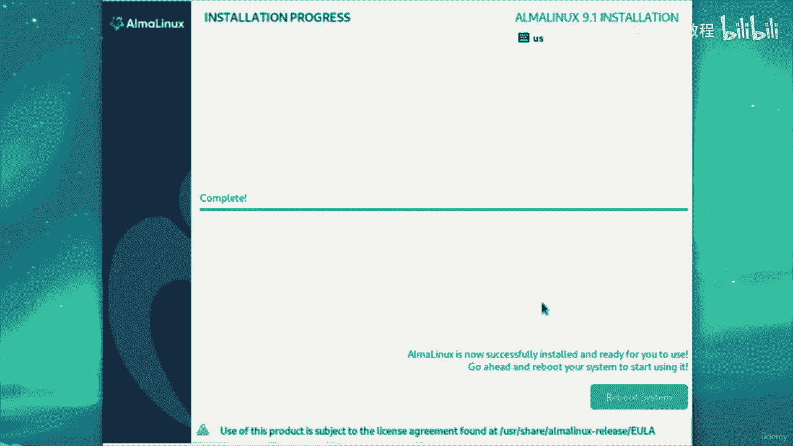

在上一节我们准备好了基础镜像，本节我们将克隆它来创建我们实验室网络的核心——路由器兼服务器。

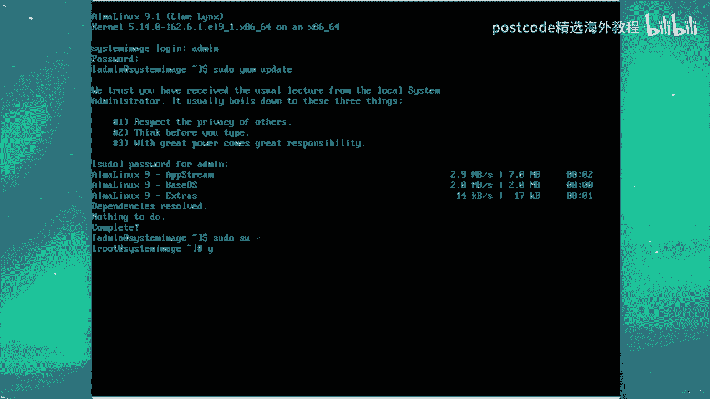

在克隆之前，请确保你的“system-image”虚拟机已连接到“Labnet”内部网络。然后，右键点击“system-image”，选择“克隆”。将新克隆的虚拟机命名为“net-server”。将MAC地址策略设置为“为所有网络适配器生成新的MAC地址”。点击“下一步”，创建一个“完整克隆”，然后点击“克隆”。

克隆完成后，进入新虚拟机的“设置”->“网络”。确认第一块网卡仍连接到我们之前创建的“Labnet”网络。现在，我们需要添加第二块网卡：启用它，并将其连接到VirtualBox内置的“NAT”网络，这样虚拟机就能访问互联网了。点击“确定”保存设置。

启动“net-server”虚拟机。启动后，首先登录。你会发现主机名仍然是“system-image”，我们需要更改它。输入命令：`sudo hostnamectl set-hostname net-server`。然后获取一个新的root shell：`sudo su -`。

设置好主机名后，我们可以开始配置路由器。由于配置Linux路由器不是RHCSA或RHCE考试的核心内容，为了简化，我们使用一个Ansible剧本来自动化此过程。在视频最后，我们会简要解释剧本的工作原理。

首先，运行 `yum update` 确保系统是最新的。然后安装必要的软件包：`yum install git ansible-core rsync`。安装完成后，克隆包含配置剧本的Git仓库：`git clone https://github.com/aakyfun/rhel-router-ansible`。

进入克隆的目录。在运行剧本之前，可以检查一下网络状态。运行 `ip addr` 可以看到，第一个接口是环回接口，第二个接口（Labnet接口）还没有IP地址，第三个接口（NAT网络）使我们能够访问互联网。运行 `nmcli con show` 也会显示类似信息：一个活跃的有线连接和一个非活跃的连接。

现在，运行Ansible剧本来配置路由器：`ansible-playbook -i inventory.ini rhel-router.yml`。这个剧本会收集信息、进行配置和安装软件包。由于网络配置在远程连接时容易出错（可能会在配置中途断开连接），所以我们直接在本地运行这个剧本。

剧本运行完成后，重启系统以使更改生效：`reboot`。系统重启后，再次登录。现在运行 `ip addr`，你会看到Labnet接口已经获得了静态IP地址 `10.0.0.1`。运行 `nmcli con show` 会显示两个网络连接：一个外部连接（NAT适配器）和一个内部连接（Labnet桥接）。运行 `systemctl status dnsmasq` 可以确认我们的DNS和DHCP服务器（dnsmasq）正在正常运行。

至此，路由器就设置完成了。如果你想了解Ansible剧本具体做了什么，可以继续阅读下面的简要说明。

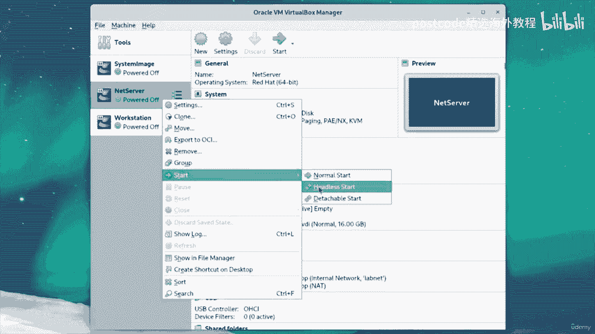

**Ansible剧本工作原理简要说明：**
该剧本主要执行了以下任务：
1.  设置了一些变量，用于DNSmasq和NetworkManager的配置文件。
2.  通过检查区分了连接到互联网的接口（VirtualBox NAT适配器）和内部网络接口（Labnet）。
3.  清除了NetworkManager中任何旧的网络连接配置。
4.  使用模板安装配置文件，并填充变量。
5.  安装并配置dnsmasq服务，然后启动它。
6.  将“net-server”主机名添加到`/etc/hosts`文件中，以便网络中的其他计算机能够识别它。
7.  在内核中启用了IPv4转发。
8.  配置了firewalld：将默认区域设置为“internal”，为DNS和DHCP服务添加防火墙例外规则，并在内部区域启用了伪装（即网络地址转换）。

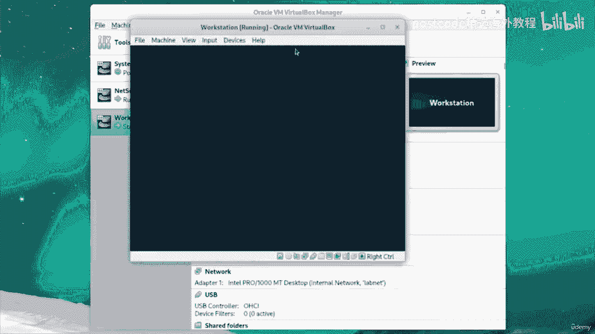

---

## 第四部分：创建管理工作站 🖥️

在上一节我们成功搭建了网络核心，本节我们将创建一个用于集中管理的工作站虚拟机。

这个工作站将作为我们通过SSH和Ansible访问和管理其他虚拟机的控制节点。我们还将为其设置图形化环境并安装一些有用的程序。

克隆过程与之前类似。右键点击“system-image”虚拟机，选择“克隆”。将克隆命名为“workstation”。将MAC地址策略设置为“生成新的MAC地址”。点击“下一步”，创建一个“完整克隆”，然后点击“克隆”。


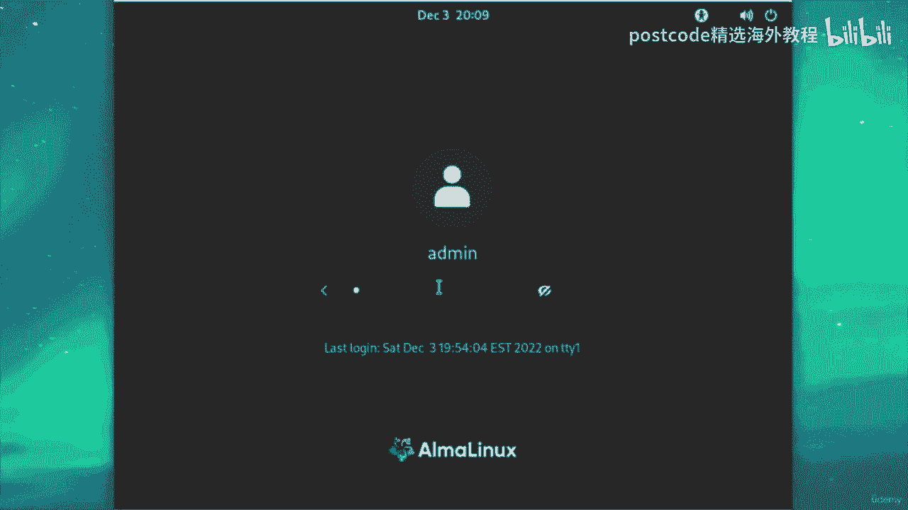

克隆完成后，我们需要调整一些设置以提升工作站性能。进入“设置”->“系统”，将基础内存增加到约4GB。接着，将CPU数量设置为2个或更多（例如4个）。然后进入“显示”设置，增加视频内存，最好设置为最大值128MB，以确保图形环境运行流畅。

最后，确认网络适配器仍然连接到“Labnet”。这就是我们上网并与网络中其他主机通信所需的全部配置。点击“确定”保存。

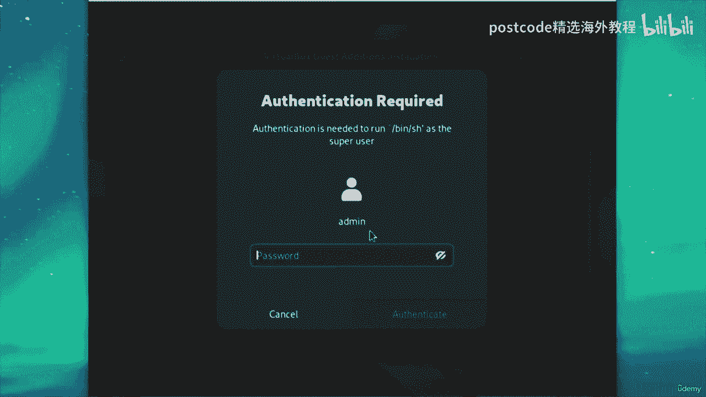

在启动工作站之前，请确保“net-server”虚拟机已经启动（可以无头模式运行，这样就不需要打开其窗口）。工作站需要Net Server始终运行才能获得网络访问。

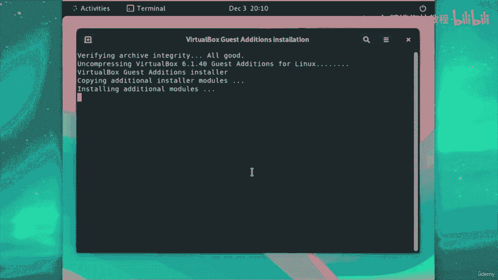

现在启动“workstation”虚拟机。启动后，首先登录。和之前一样，我们需要更改主机名：`sudo hostnamectl set-hostname workstation`。然后获取root shell：`sudo su -`。

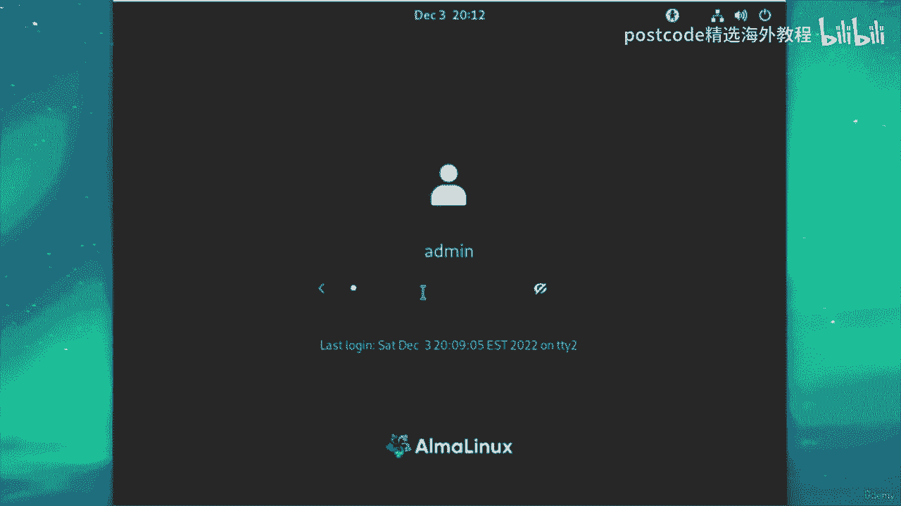

为了安全起见，再次运行 `yum update`。接下来，我们需要安装几个软件包组来构建VirtualBox增强功能内核模块和基本的GUI环境：`yum groupinstall “Development Tools” base-x Fonts`。

安装完成后，再安装一些常规软件包：`yum install gdm gnome-terminal nautilus firefox gedit`。GDM是图形登录管理器，其他工具（终端、文件管理器、浏览器、文本编辑器）将使工作站更易用。

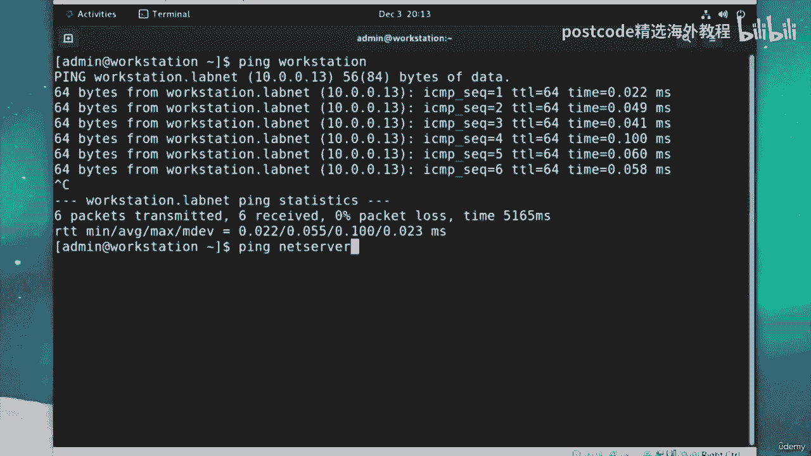

现在，将系统的默认目标更改为图形界面：`systemctl set-default graphical.target`。我们也可以立即切换到图形会话而无需重启：`systemctl isolate graphical`。这会直接带我们进入登录管理器。

以“admin”用户登录图形界面。为了获得最佳体验（如无缝鼠标集成、调整分辨率），我们需要安装VirtualBox增强功能。点击VirtualBox窗口顶部的“设备”菜单，选择“安装增强功能…”。有时会提示下载，完成后会自动插入光盘镜像。系统通常会弹出自动运行提示，选择“运行”，输入密码。这将开始构建VirtualBox增强功能的内核模块，需要一些时间。

构建完成后，按回车退出。你会立即注意到，现在鼠标可以在虚拟机和主机之间自由移动，无需按宿主键了。为了最佳效果，建议重启一次。

重启后，我们将进入图形登录管理器。登录后，现在可以轻松调整窗口大小和屏幕分辨率，获得更舒适的视觉体验。我们还可以测试网络连通性，例如 `ping workstation.labnet` 或 `ping net-server`，确认可以访问网络中的其他主机以及互联网。

---

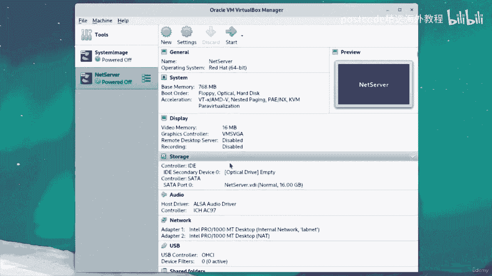

## 第五部分：克隆并配置应用服务器 🖧

在上一节我们准备好了管理控制台，本节我们将克隆多个应用服务器虚拟机，为后续的配置管理练习准备被管节点。

我们要做的是从“system-image”虚拟机克隆出几个更多的系统，并从工作站对它们进行一些基本管理。

首先，确保“net-server”正在运行（可以无头模式运行）。然后，我们重复之前的克隆过程。

1.  克隆“system-image”，命名为“app-server1”。MAC地址策略选择“为所有网络适配器生成新的MAC地址”。创建“完整克隆”。
2.  同样地，克隆出“app-server2”、“app-server3”和“app-server4”。

如果你担心同时运行这么多虚拟机的资源消耗，请记住我们已经尽力优化：降低了内存分配，并且使用的是动态分配磁盘。在大多数情况下，这足以保持相对轻量。

现在，我们有了四个应用服务器。接下来，我们将启动每一个并更改其主机名。

*   **应用服务器1**：登录用户“admin”。运行 `sudo hostnamectl set-hostname app-server1`，输入密码。然后重启以使主机名生效：`sudo reboot`。
*   **应用服务器2**：登录，运行 `sudo hostnamectl set-hostname app-server2`，然后 `sudo reboot`。
*   **应用服务器3**：登录，运行 `sudo hostnamectl set-hostname app-server3`，然后 `sudo reboot`。如果不重启，也可以重启NetworkManager服务达到类似效果：`sudo systemctl restart NetworkManager`。
*   **应用服务器4**：登录，运行 `sudo hostnamectl set-hostname app-server4`，然后 `sudo reboot`。

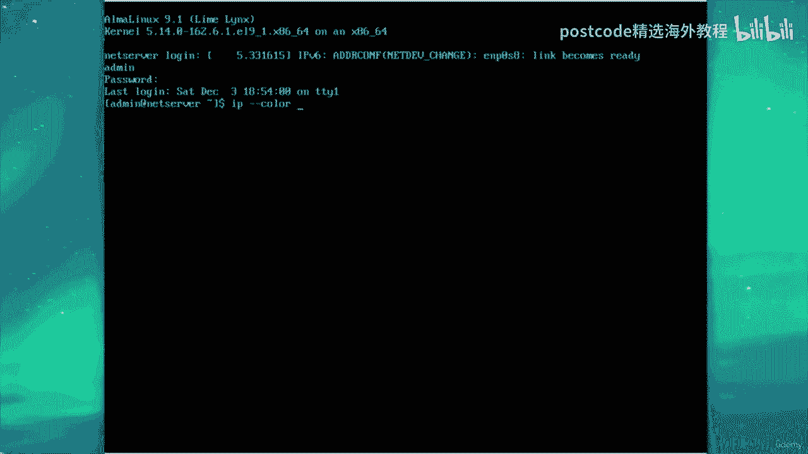

所有应用服务器配置完成后，最小化它们的窗口，然后启动“workstation”工作站。

工作站启动后，登录并打开终端。我们将生成SSH密钥对，以便无需密码登录到各个应用服务器。

首先，创建SSH目录并设置正确权限：
```bash
mkdir ~/.ssh
chmod 700 ~/.ssh
```
运行 `ssh-keygen` 生成密钥对。将密钥保存为 `~/.ssh/ws_key`（代表工作站密钥），无需设置密码短语。

生成密钥后，使用 `ssh-copy-id` 命令将公钥复制到每个应用服务器：
```bash
ssh-copy-id -i ~/.ssh/ws_key.pub admin@app-server1
```
输入“admin”用户在app-server1上的密码。对 app-server2、app-server3 和 app-server4 重复此过程。

完成后，我们应该能够无密码登录到任何一台应用服务器。测试一下：`ssh admin@app-server4`，成功登录。

---

## 总结
在本节课中，我们一起学习了如何从零开始搭建一个完整的虚拟Linux家庭实验室。我们完成了以下步骤：

1.  **规划与设计**：明确了实验室的目标、选择了VirtualBox作为平台，并设计了包含内部网络（Labnet）、路由器（Net Server）、工作站（Workstation）和应用服务器的网络拓扑。
2.  **创建基础镜像**：下载并安装了AlmaLinux 9，配置了LVM，并优化了虚拟机设置，为后续克隆做好准备。
3.  **搭建网络核心**：克隆基础镜像创建了“Net Server”，通过Ansible剧本自动化配置了其作为路由器、DNS服务器和DHCP服务器的功能。
4.  **创建管理节点**：克隆创建了“Workstation”，为其安装了图形化界面和必要工具，并配置了SSH密钥。
5.  **准备被管节点**：克隆创建了多台“应用服务器”，统一更改了主机名，并从工作站配置了SSH免密登录。

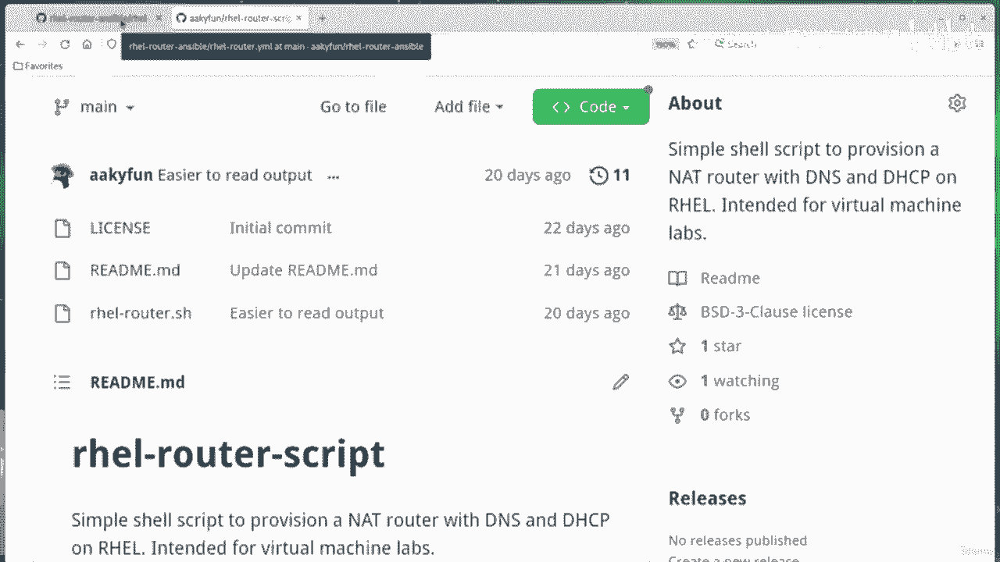

现在，我们已经拥有了一个包含五个节点（一个路由器、一个工作站和多个应用服务器）的完整家庭实验室。这个环境将作为后续学习、实验和练习新技能（如使用Ansible进行自动化配置）的稳定平台。