# 红帽企业Linux RHEL 9精通课程 — RHCSA与RHCE 2023认证全指南 - P63：08-08-001 How to take a Red Hat Exam - 精选海外教程postcode - BV1j64y1j7Zg

Welcome to this tutorial on how to take a Red Hat exam， let's get started。

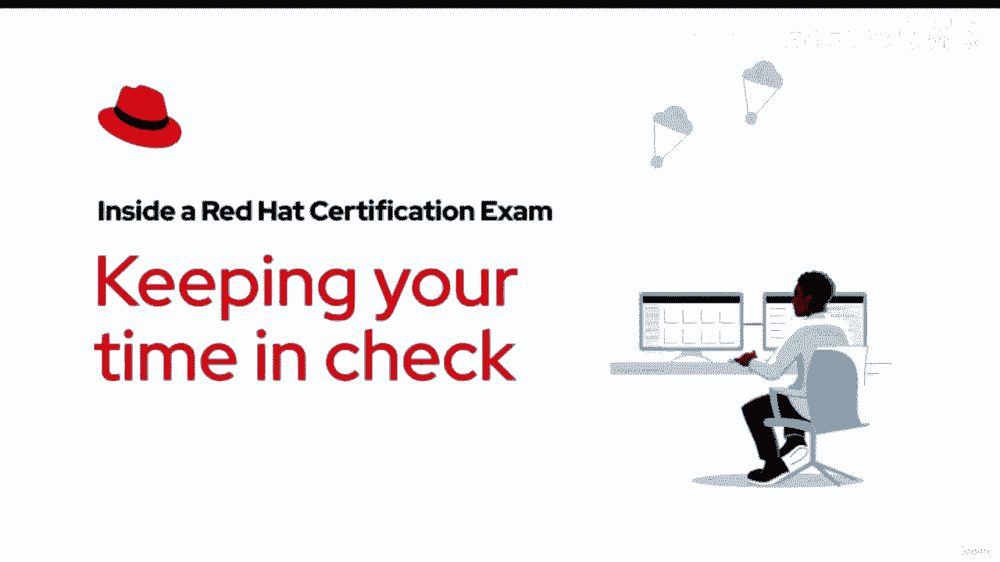

Once your exam begins， so does the timer you can see how much time you have left by looking in your exams browser remember it's your responsibility to be aware of the time you've used as well as how much you have remaining it's also important to note that each exam's time limit is different so please plan accordingly。

You can choose the exam Docu language here， this will only change the language that's viewable in the exam browser。

 everything else like applications you use， terminals。

 as well as the operating system will remain in English。

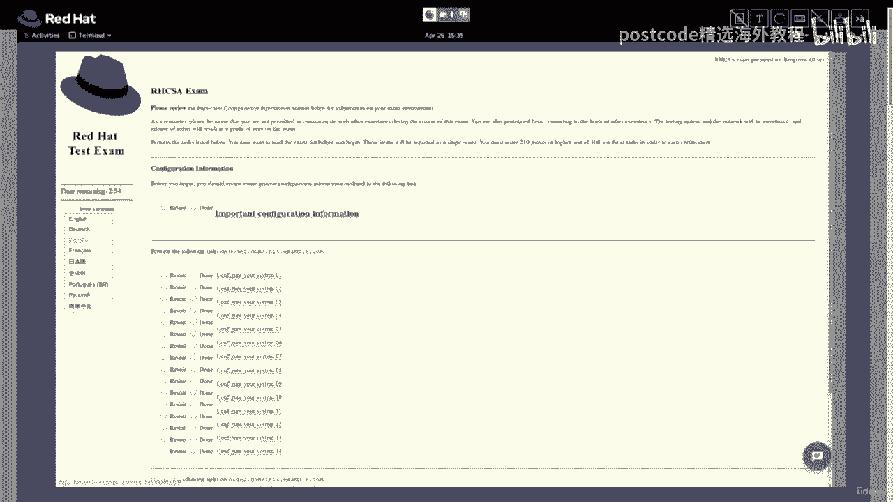

If you remember back to when you set up your machine for the exam。

 it was possible for you to change your keyboard's layout and language there。

 it's important to remember that all of your exam's machines will always be in English by default while you can certainly make changes to each of these machines keyboard layouts it's not guaranteed that these will match the layout that you selected during setup we recommend that you keep your keyboard layouts set to English so that changing these layouts is not just another task for you to have to do during your exam。

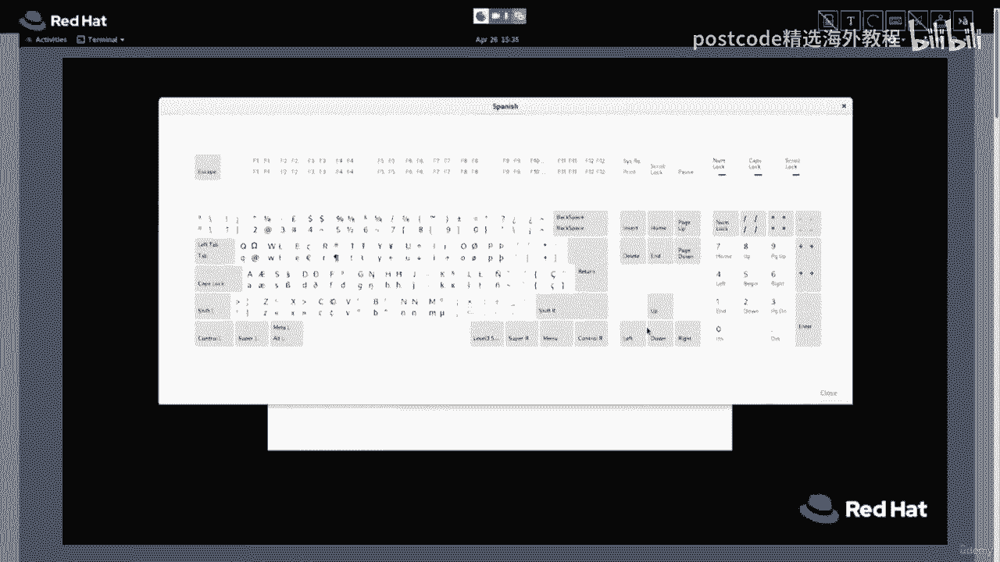

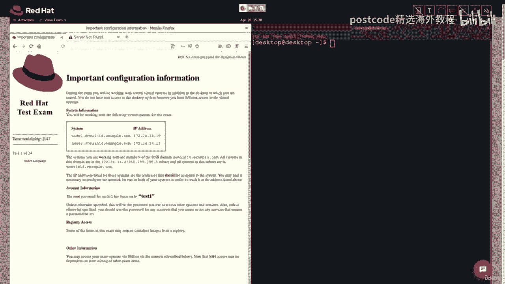

Next to each task is a revisit or done button these are there for your reference the exam system does not take them into account if we click one of these tasks or hyperlinks。

After you perform the action， you can click the back button to move on to your next task if you happen to have any comments or ideas about this item。

 click the feedback button to leave us your thoughts any feedback that you leave us is not part of your grade。

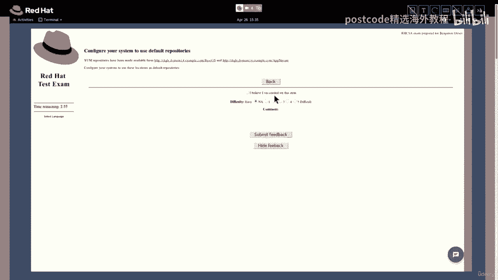

To bring up a terminal， simply click the Activ button and then click on the terminal icon。

 you can open up multiple terminals as you need。

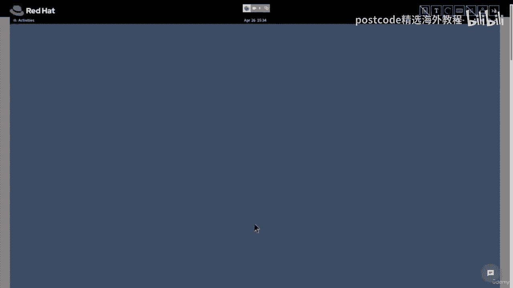

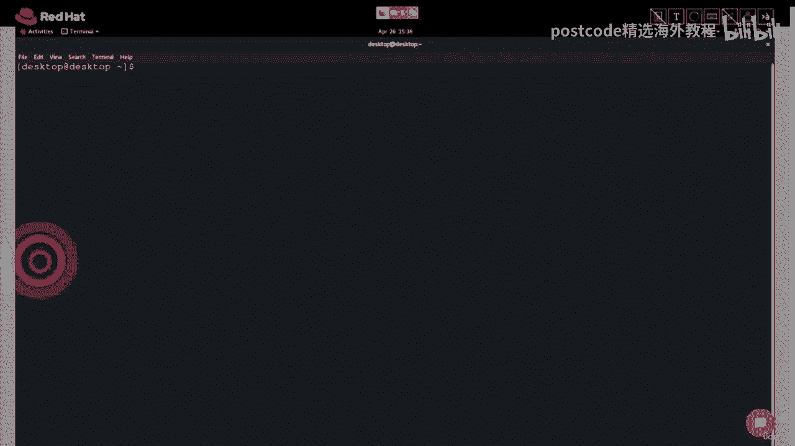

To open the VM Manager， click the Activities button。Then click the VM manager icon here Okay。

 let's connect to node2 we'll click the node 2 icon here。And then we'll click status。

It appears that this note is active。Let's use the SSH command to connect to that node。

The IP address is located in the configuration information instructions to log into node 2。

 we'll use the SSH command SSH Space Route at 172。24。14。11。Okay， next。

 the commander asks us to enter a password。You can see here that the password is test1。

The command perimp has now changed to root at node 2 Next let's open up node2 via the console in the VM control click console node2 VM。

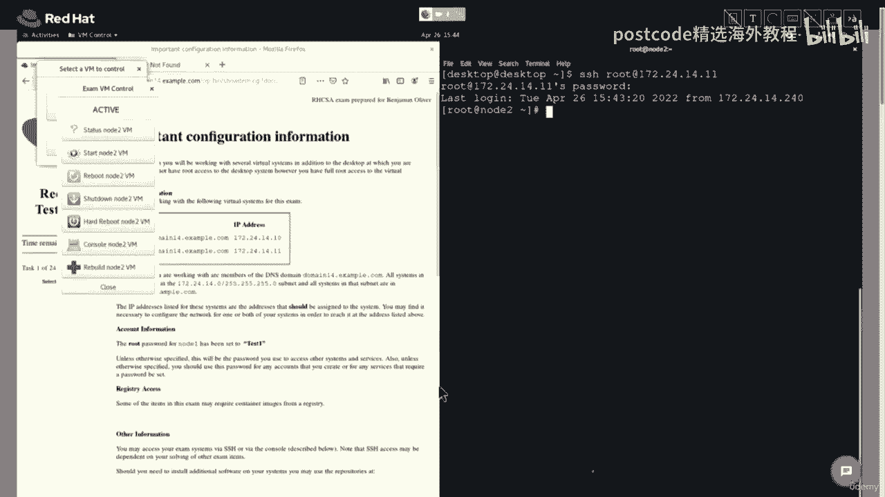

Once the console loads fully， hit the En button to bring up a command prompt。

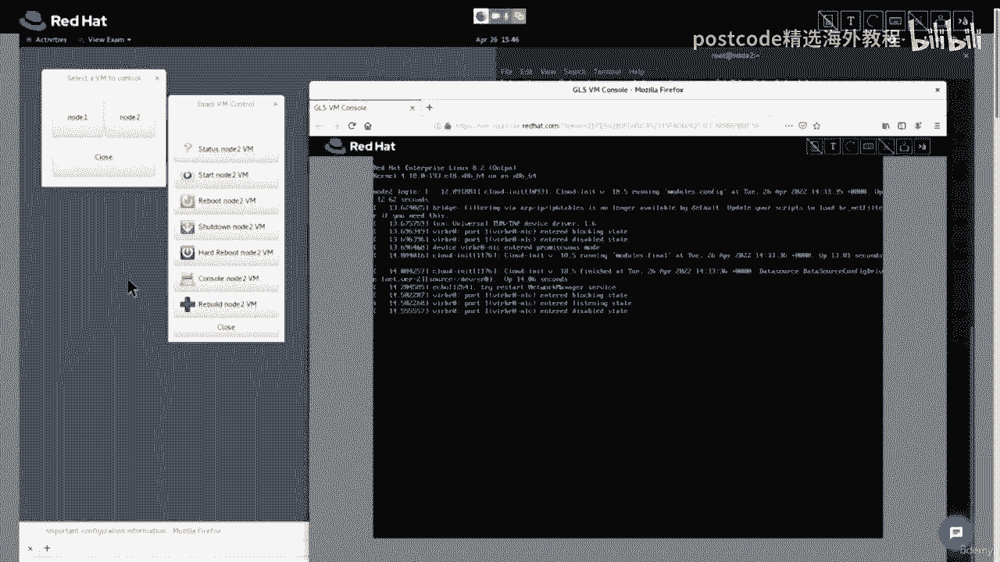

To log in its root， type in root and then hit enter。Enter the password。

 which again is test 1 and hit Enter。And you can see here， we're logged in as rootot at nodede2。

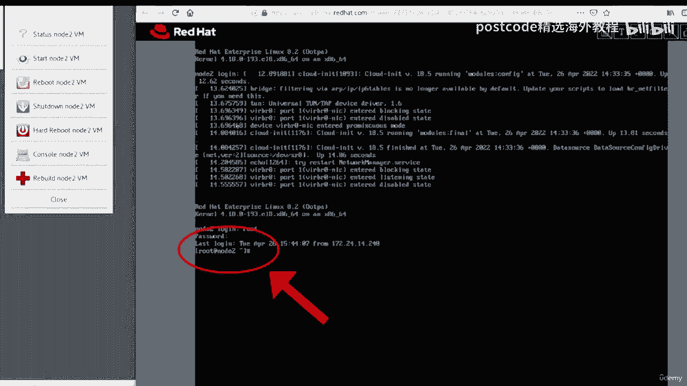

To best demonstrate this， I'm going to run a few commands I'll enter the date command and then I'll enter the history command and as you can see the history command shows that we've run three commands total on this machine。

 then from exam VM control we'll select shuttdown VM。Click yes。

 I am sure I want to shut down the system。Now this can take a moment。

 but eventually you'll receive a notification that the command is completed and you can see here that the terminal is reporting that the connection is closed。

Okay， now let's rebuild node two。It's important to note that rebuilding a node will erase and then reset that machine。

 so to rebuild that node， we'll click the rebuild node2 button。

We'll be asked if we really want to revert the system， we'll click yes。

Next we have to type in confirmfi in all caps in order for us to initiate the rebuild next click OK。

We're alerted that the VM control window might be unresponsive while our node is being rebuilt。

 I'll click OK again。Okay， so now to prove that this node is being reset。

 we're going to attempt to log in via SSH into node2 I'll type that command in and hit enter。

You can see here that the node is not ready， so we'll be patient， we'll wait a few more minutes。Okay。

 we're back and it looks like the VM control is ready to go， it's no longer grayed out。

 so we'll run the SSH command。We'll enter the password， which is test 1。

And success we're logged in as root Now if I run the history command。

 you can see that the previous machine history has been erased。And in fact。

 this is a brand new machine that's ready to be used in the exam。

To increase your terminal's font size， hold down， control， and shift while pressing the plus button。

To increase the text size in the exam browser， select the hamburger icon here and then click the plus button to increase the Zoom percentage。

Use of shortcuts like control C， control X or control V are not recommended sometimes using them can cause terminals or the exam browser consoles or the virtual keyboards to freeze up this then forces you to use precious time resetting your virtual machines and maybe even redoing some of your work so we recommend that you use your mouse to do copy paste。

So to copy paste text into the terminal， simply highlight text with your mouse。

 right click and choose copy。And then we'll move back to the terminal。

 we'll right click here and select pastste。

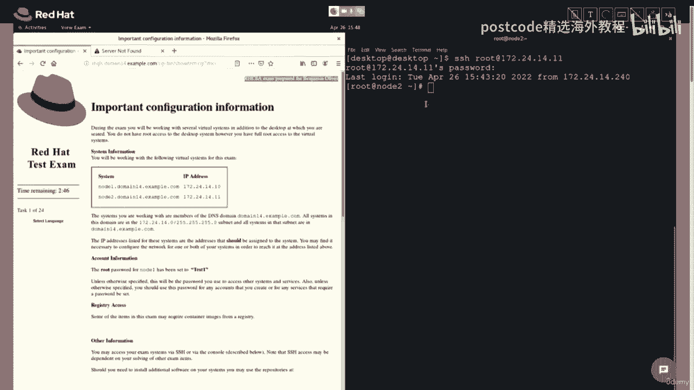

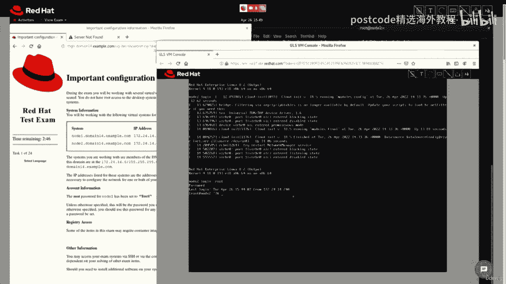

If you need to paste text into a console， select text like we did earlier。

 click the open textex dialog button and then right click and paste that text into the dialog box。

 then click send。

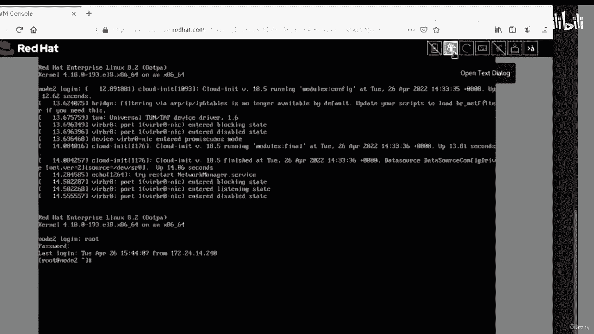

On the main page of the course， navigate to the available documentation section and click on the attached URL。

Find the documentation that you need， right click and save that PDF to your hard drive。

We recommend using the PDF browser that's built into your operating system in order to help optimize your system's memory during the exam。

 also to help maintain your system during the exam。

 we recommend not opening up additional items in browser tabs as this can lead to back buttons not working in your system becoming unresponsive。

To take a break， open up the chat icon in the bottom right。Click the break icon。

This will alert the proctor that you need to take a break your break begins when you see the large coffee cup icon on your screen。

Remember that while on break your exam timer is still running it's important not to use items like cell phones。

 tablets or anything that could be used to cheat remember your exam session is being recorded and your proctor could consider accessing certain items is cheating whether conscious on your part or not this could result in forfeiture of your exam when you're ready to resume taking your exam send a chat message to your proctor alerting them that you're ready。

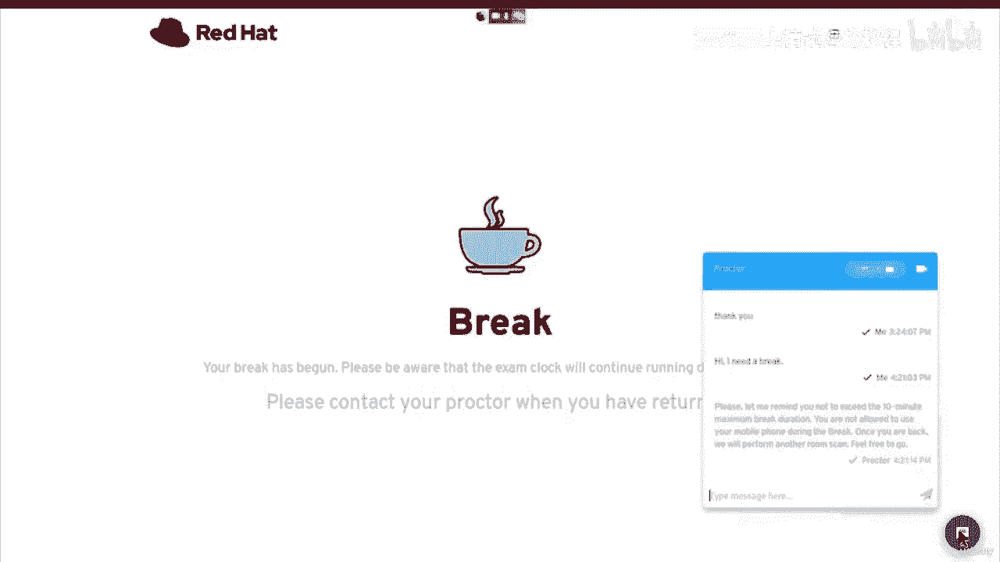

Your proctor might have you perform another room scan before your exam restarts。

When starting up your computer to take your remote exam。

 you are tasked with performing multiple tests in order to validate that your machine and network connection met our requirements。

 however， sometimes connection issues can happen， your connection could be slow due to the fact that some internet service providers have large numbers of users at certain times of the day or perhaps your connection to the candidate side of our servers might not be stable in these cases it's possible that your proctor will inform you about these problems。

 they could ask you to restart your machine or your internet router or perform other tasks to mediate this issue。

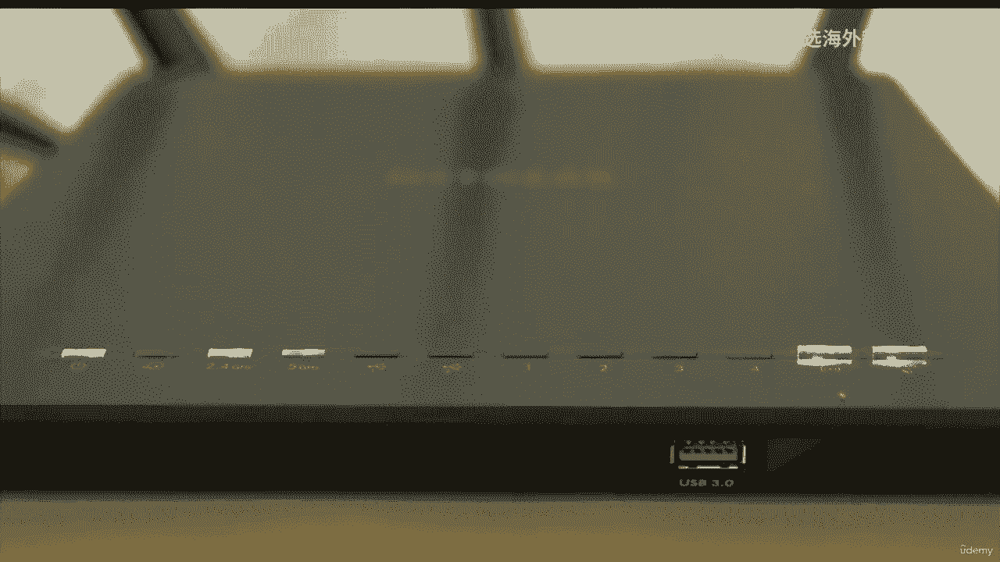

If while taking your exam and you find yourself having connection issues and don't know what to do。

 contact your proctor right away so they can assist you。We hope this video has been helpful。

 thank you so much for watching， good luck on your exam。

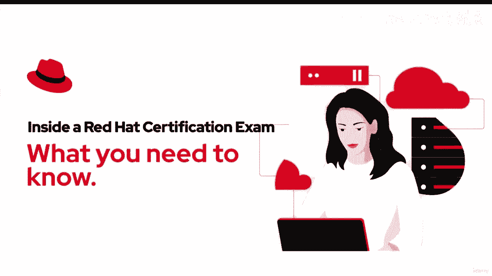