# 红帽企业Linux RHEL 9精通课程：08-08-001：如何参加红帽考试 📝

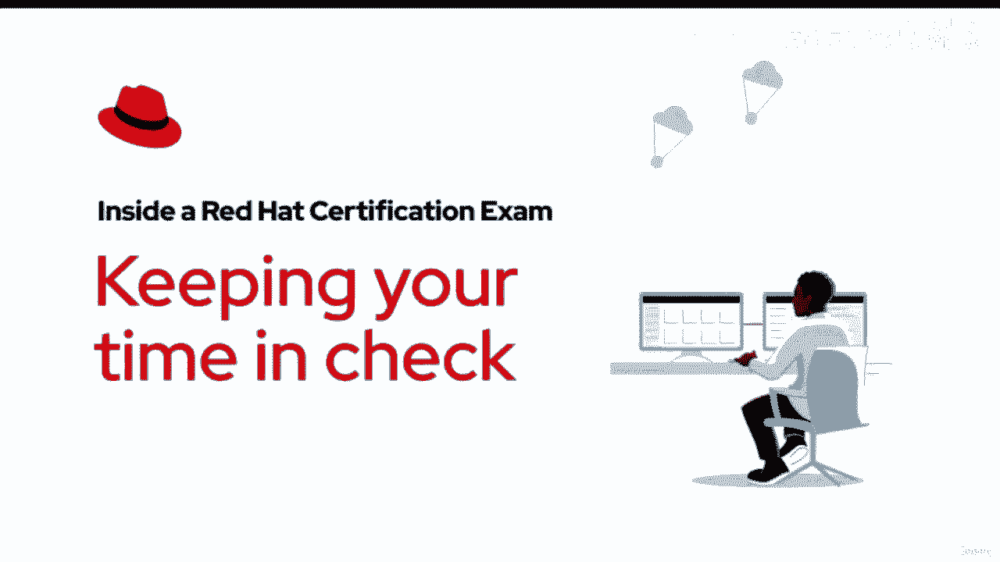

在本节课中，我们将学习参加红帽远程认证考试的具体流程和操作界面。我们将了解考试计时器、语言设置、虚拟机操作、文本复制粘贴以及处理连接问题等关键环节，帮助你顺利完成考试。

## 考试计时与界面

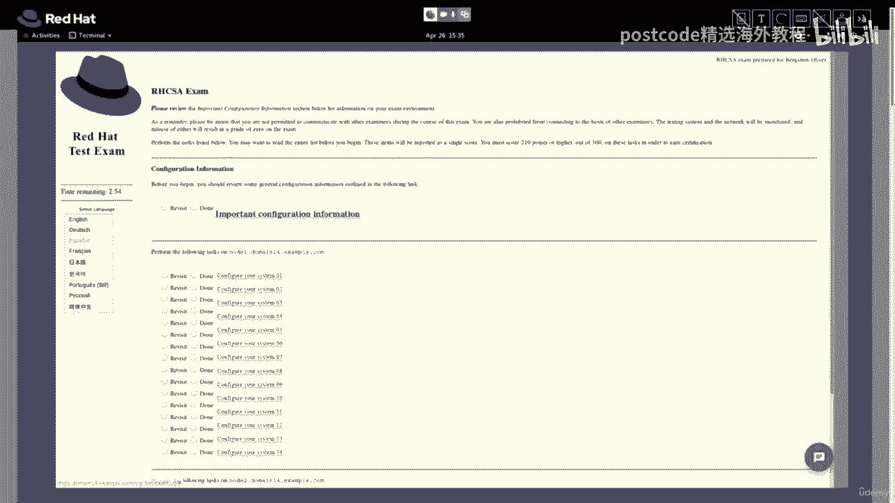

考试开始后，计时器即启动。你可以在考试浏览器中查看剩余时间。你有责任留意已用时间和剩余时间。请注意，每场考试的时间限制不同，请据此规划时间。

## 语言与键盘设置

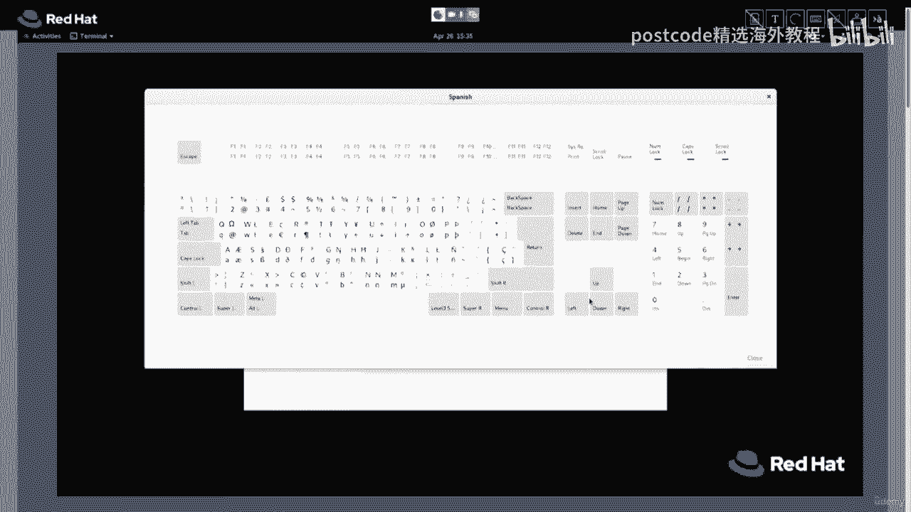

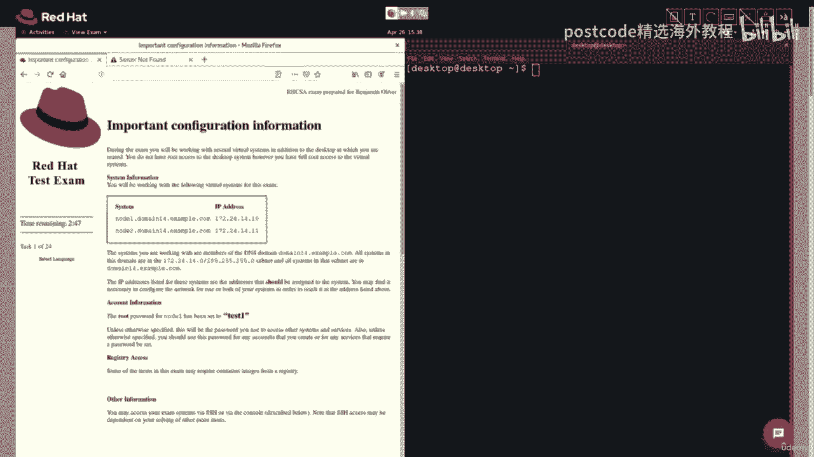

你可以在考试浏览器中选择考试文档的语言。此设置仅改变考试浏览器中显示的语言。你使用的应用程序、终端以及操作系统本身将保持为英文。

在设置考试机器时，你可以更改键盘布局和语言。请记住，所有考试机器默认均为英文。虽然你可以更改每台机器的键盘布局，但这并不能保证与你设置时选择的布局完全一致。我们建议将键盘布局保持为英文，以避免在考试中额外花费时间调整。

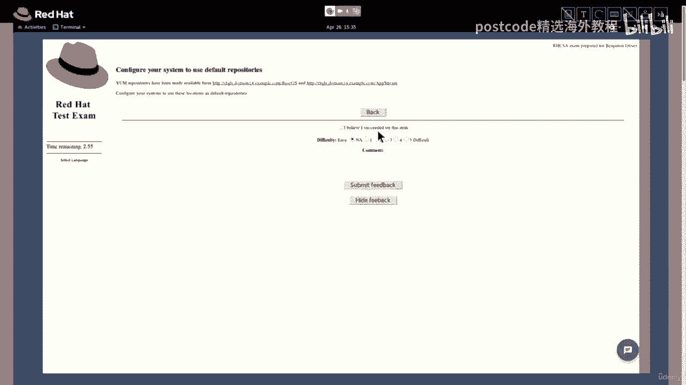

## 任务列表与操作

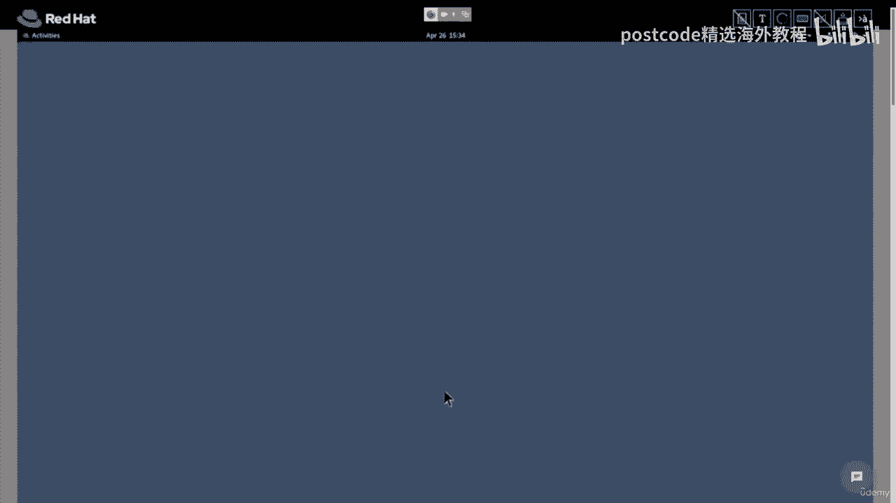

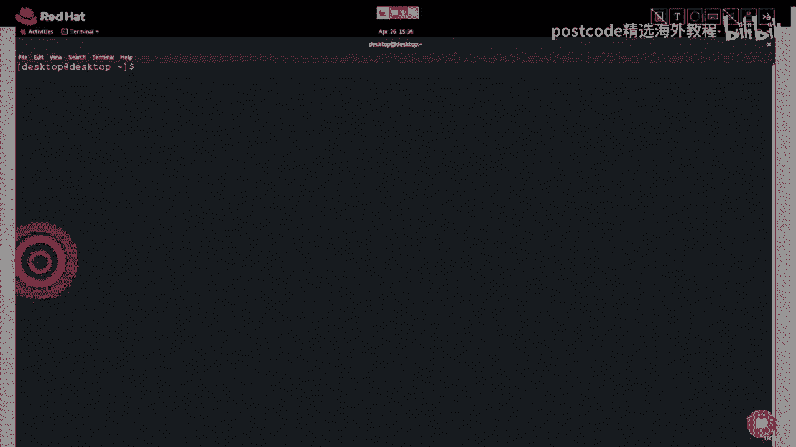

每个任务旁边都有一个“重新访问”或“完成”按钮，供你参考。考试系统不会记录这些按钮的状态。点击任务或超链接后，你可以执行相应操作。

操作完成后，点击“返回”按钮可继续下一个任务。如果你对该任务有任何意见或想法，可以点击“反馈”按钮留言。你提交的任何反馈都不会影响你的成绩。

## 使用终端与虚拟机

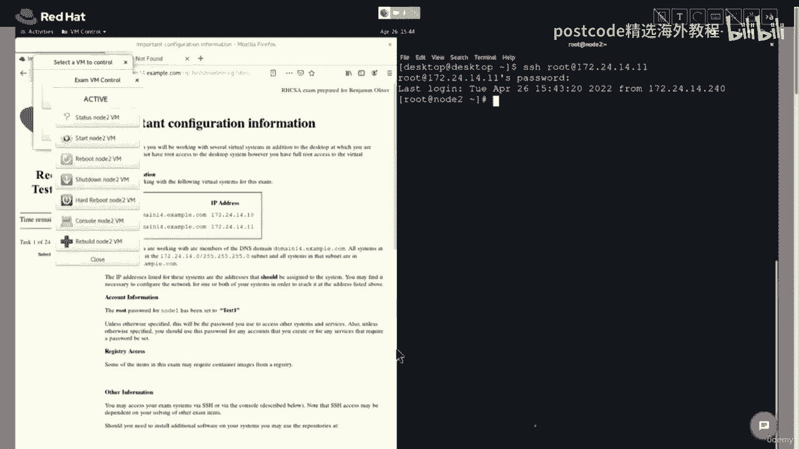

要打开终端，只需点击“活动”按钮，然后点击终端图标。你可以根据需要打开多个终端。

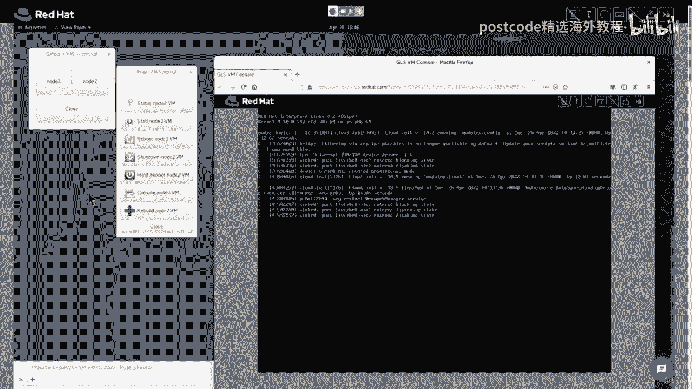

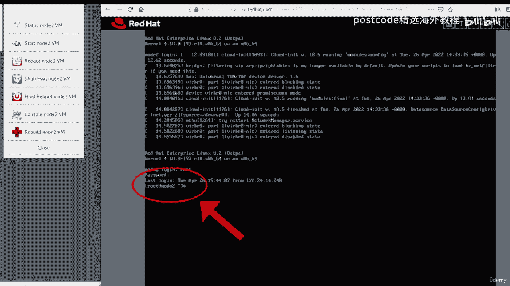

要打开虚拟机管理器，点击“活动”按钮，然后点击虚拟机管理器图标。我们将连接到 `node2`。点击 `node2` 图标，然后点击“状态”。可以看到该节点处于活动状态。

我们将使用 SSH 命令连接到该节点。IP 地址位于配置信息说明中。登录 `node2` 的命令是：
```bash
ssh root@172.24.14.11
```
接下来，系统会提示输入密码。密码是 `test1`。命令提示符将变为 `root@node2`。

接下来，通过虚拟机控制台打开 `node2`。点击 `node2` 虚拟机的“控制台”。控制台完全加载后，按回车键调出命令提示符。以 `root` 身份登录，输入 `root` 并按回车。输入密码 `test1` 并按回车。可以看到，我们已作为 `root` 用户登录到 `node2`。

## 虚拟机重置与历史记录

为了演示，我将运行几个命令。输入 `date` 命令，然后输入 `history` 命令。可以看到 `history` 命令显示我们在这台机器上总共运行了三个命令。

然后，从考试虚拟机控制中选择“关闭虚拟机”。点击“是，我确定要关闭系统”。这可能需要一些时间，但最终你会收到命令完成的通知。可以看到终端报告连接已关闭。

现在，让我们重建 `node2`。请注意，重建节点将擦除并重置该机器。要重建该节点，点击“重建 node2”按钮。系统会询问是否真的要恢复系统，点击“是”。接下来，必须输入全大写的 `CONFIRM` 以启动重建，然后点击“确定”。系统会提示虚拟机控制窗口在节点重建期间可能无响应，点击“确定”。

为了证明该节点正在重置，我们将尝试通过 SSH 登录到 `node2`。输入命令并按回车。可以看到节点尚未就绪，请耐心等待几分钟。现在，虚拟机控制已准备就绪，不再显示为灰色。运行 SSH 命令，输入密码 `test1`。成功，我们以 `root` 身份登录。现在，如果我运行 `history` 命令，可以看到之前机器的历史记录已被擦除。这确实是一台全新的、可供考试使用的机器。

## 调整字体与复制粘贴

要增大终端字体大小，按住 `Ctrl` 和 `Shift` 键，同时按加号键。要增大考试浏览器中的文本大小，点击汉堡菜单图标，然后点击加号按钮以增加缩放百分比。

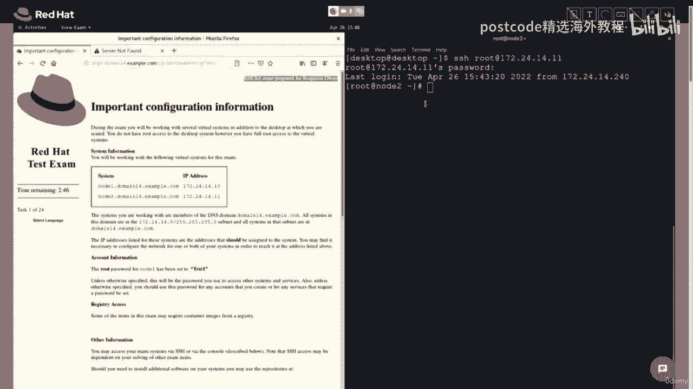

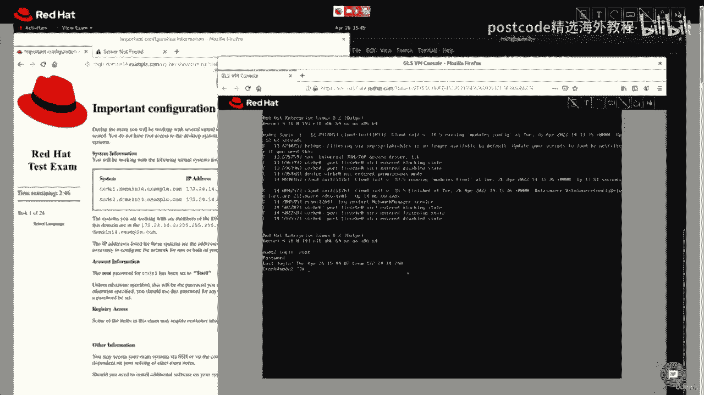

不建议使用 `Ctrl+C`、`Ctrl+X` 或 `Ctrl+V` 等快捷键。有时使用它们可能导致终端、考试浏览器控制台或虚拟键盘冻结，迫使你花费宝贵的时间重置虚拟机，甚至重做部分工作。因此，我们建议使用鼠标进行复制粘贴。

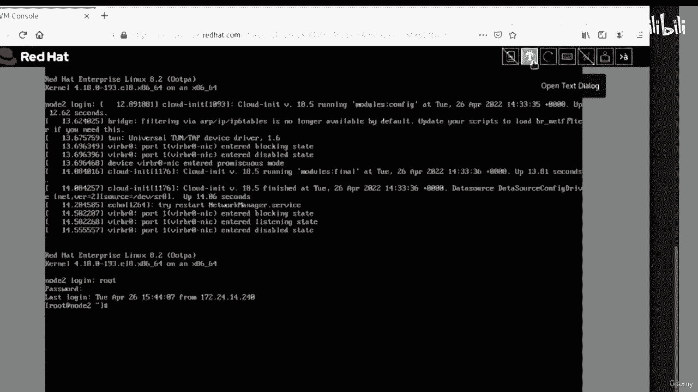

要将文本复制粘贴到终端，只需用鼠标高亮选中文本，右键单击并选择“复制”。然后回到终端，右键单击并选择“粘贴”。

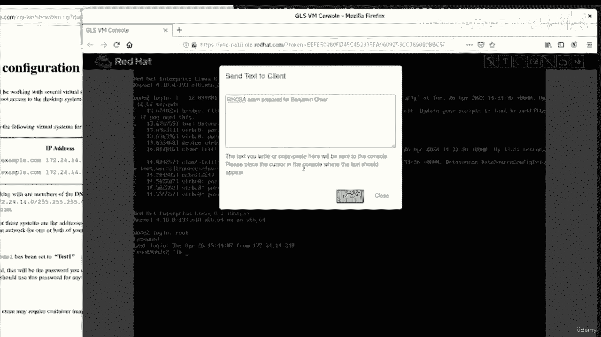


如果需要将文本粘贴到控制台，像之前一样选中文本，点击“打开文本对话框”按钮，然后右键单击并将文本粘贴到对话框中，最后点击“发送”。

## 访问考试文档

在课程主页上，导航到“可用文档”部分，点击附带的 URL。找到你需要的文档，右键单击并将该 PDF 保存到硬盘。我们建议使用操作系统内置的 PDF 浏览器，以帮助在考试期间优化系统内存。

同样，为了在考试期间维护系统，建议不要在浏览器标签页中打开额外项目，因为这可能导致返回按钮失效或系统无响应。

## 休息与连接问题处理

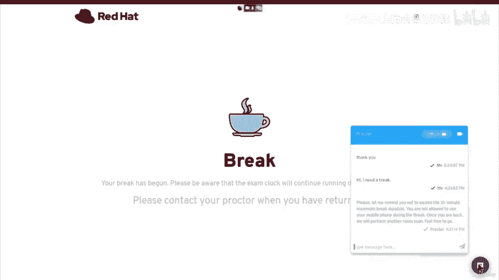

要休息，请点击右下角的聊天图标。点击“休息”图标。这将通知监考员你需要休息。当你看到屏幕上出现大咖啡杯图标时，休息开始。请记住，休息期间考试计时器仍在运行。重要的是不要使用手机、平板电脑或任何可能用于作弊的物品。你的考试过程正在被录制，监考员可能认为访问某些物品是作弊行为，无论你是否意识到，这都可能导致你丧失考试资格。当你准备恢复考试时，向监考员发送聊天消息，告知他们你已准备好。监考员可能会要求你在考试重新开始前再次进行房间扫描。

在启动计算机参加远程考试时，你需要执行多项测试以验证你的机器和网络连接符合要求。然而，有时可能会出现连接问题。你的连接可能因为某些互联网服务提供商在一天中的特定时段用户过多而变慢，或者你连接到我们服务器考生端的连接可能不稳定。在这些情况下，监考员可能会通知你这些问题。他们可能要求你重启机器或互联网路由器，或执行其他任务来缓解此问题。

如果在考试期间遇到连接问题且不知如何处理，请立即联系监考员以获得帮助。

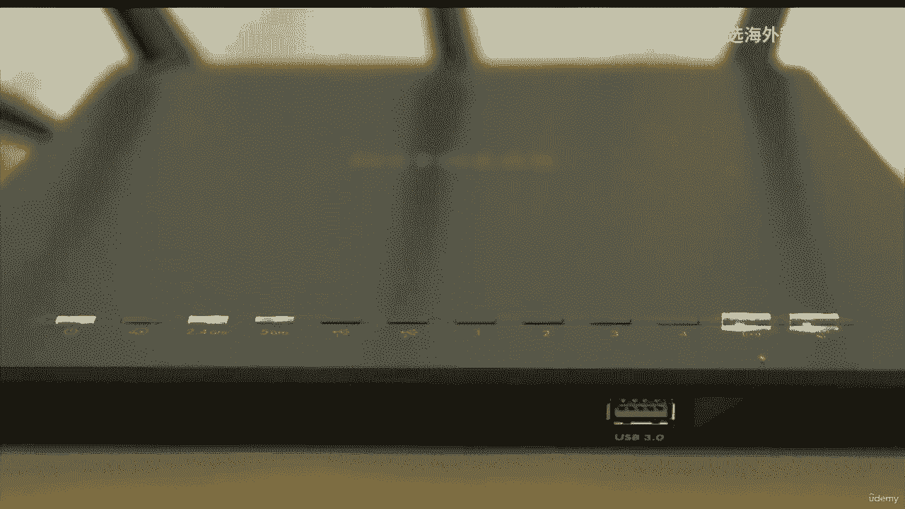

## 总结

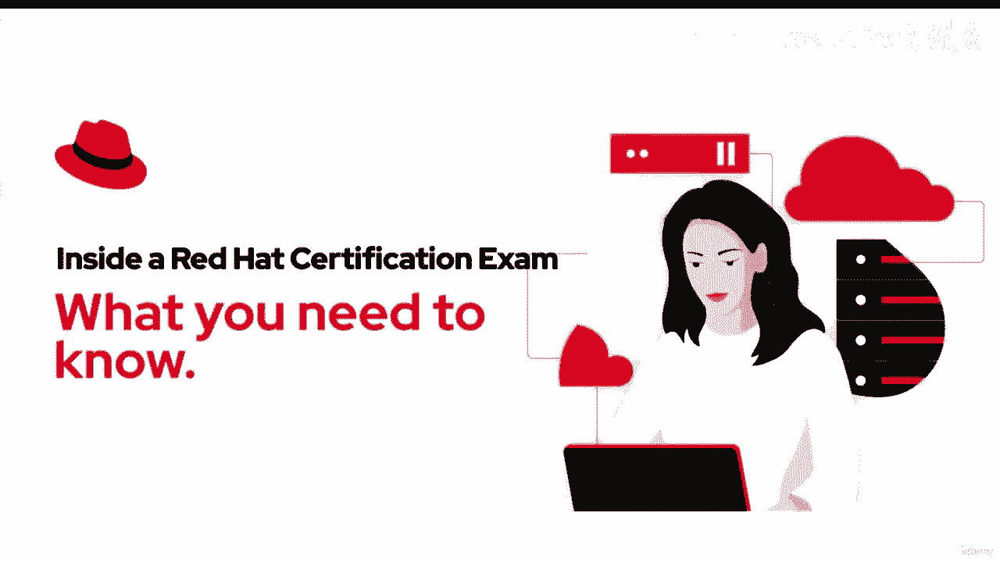

本节课中，我们一起学习了参加红帽远程考试的完整流程。我们了解了如何管理考试时间、设置语言和键盘、操作虚拟机和终端、进行文本复制粘贴、访问文档、处理休息以及应对可能出现的网络连接问题。掌握这些操作细节，将帮助你在实际考试中更加从容和高效。祝你考试顺利！