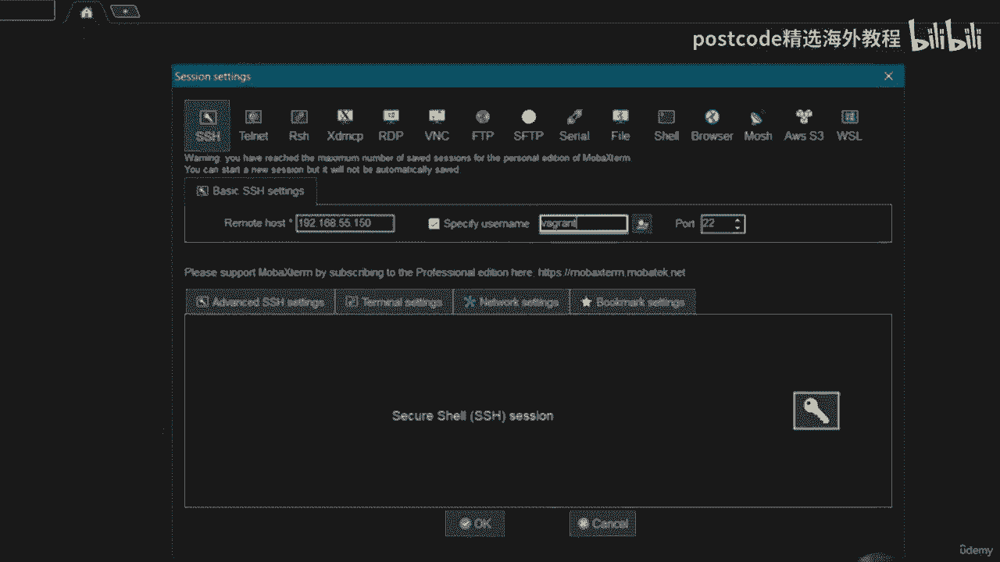
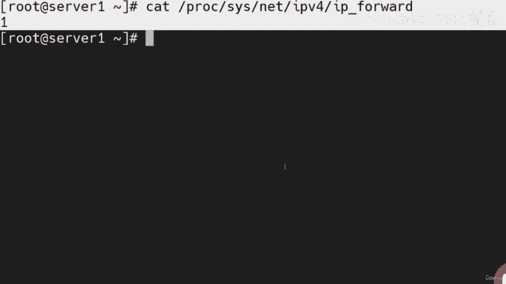
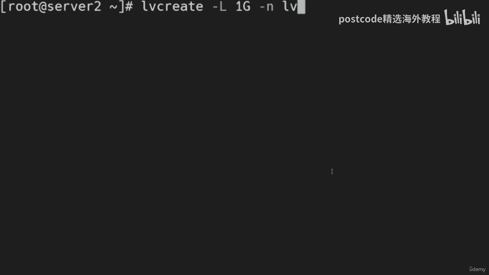
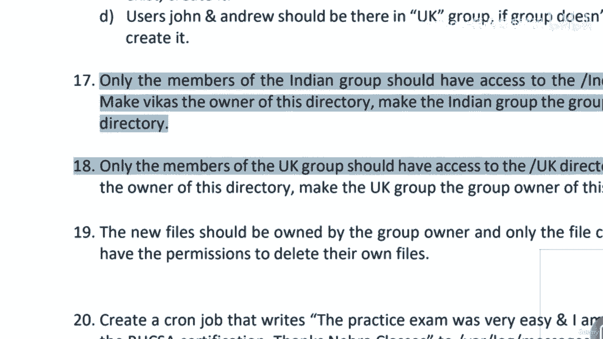

# 红帽企业Linux RHEL 9精通课程 — RHCSA与RHCE 2023认证全指南 - P64：08-08-002 RHCSA Exam - 精选海外教程postcode - BV1j64y1j7Zg

I will be providing you the solution of the R CSS 8 exam the code for the same is EX 200。

 but before starting the exam let me provide you some information related to this exam。

This is totally practical based exam。And。The maximum marks are 300 and the passing score is 210 out of 300。

The duration for the same is 2。5 hours or 150 minutes。To practice this exam in your own PC。

You can set up the RSCSA lab and there are two methods of doing that either you can use the automatic exam setup using Viagrant I have already provided you a detailed video on this topic。

With which you can easily set up the RHCSA8 lab in your PC。

And the second method is the manual method where you create the virtual machines manually and there you manually configure everything like free IP DNS and the other servers。

So either you can use the manual method or you can use the。

Vagrant method to set up the practice lab in your PC。

Since we have already set up the practice lab by using v there。

We have already set everything and these are the details for the servers。

And let me show you the lab here， three virtual machines are available server 1 server2 and the master repo server。

In many cases if the sufficient space is not available in your seat drive it will only set up two machines here。

 so that is not an issue you can conduct the exam on those two machines as well but if you want to create all the machines make sure you have the sufficient space available and after that you can again execute the vibrant up command on the power shell it will automatically deploy each and every machine there including all the services。

Now， let me show you the question paper。This is the sample question paperaier for the RHCS8 exam and here you have to keep in mind that while conducting this exam or while appearing in this exam。

 all the tasks are implemented with Firewall and SC Linux enabled and your server should be able to survive the reboot。

So without wasting time， let's get started with the exam。So， we will start the machines。

We will go on server 1 and we will start the server and we will start the master reppo server as well。

Now we will go on the first question。The first question is interrupt the boot process and reset the root password and change it to red hat to gain access to the system。

So we will go on the server number one。We can directly reboot the machine。

By clicking here on the reset button。

And as soon as it provides us the grab menu here on the first line。

 we have to press E key on the keyboard。Then， we will go。

In the kernelal parameters line and there we will remove this RH Gb quite and here we will mention。

R d dot。Break。Space。Enforcing。Is equal to 0。So it will boot up the machine in the single user mode and since we have mentioned enforcing is equal to0 it will make the as excmacy when we don't need to relabel the files later After that we will press control and x on the keyboard and。

It will provide us the prompt where we can fire the commands。

So we are at this switch root prompt now。And here。We can execute the mount command。Mo台0。Remount。

Commer read Wright slash sciss root。After that。We will execute C root， slash C root。

And here you can see that we are。In the root user account。

Without using the root password there we don not need to do anything we can directly execute the past W command to change the root password and we will provide the new password as read at。

After that。We can exit。And we can log in in the machine as the root user。By the password as red hat。

 and we can follow the same steps on the other machine also if required。

So I'm not going to show you that。Let's log in as the root user。Here it is。

Now we are in the root user account。Now I'm going to log in in the machine。From the mobile external。

 because it will provide us the better view while firing the commands。

So the IP address for this machine is 192 dot 168 dot 55 dot150。And。

Let me mention the username as background。

Here it is。Now I will switch in the account of the root user by using the pseudo SU command。

Here it is。So we have completed the first question。

Now， we have。To set up the repositories and repositories are available。

On the reos server and these are the URLs。

So let me show you that the repositories are not configured on this machine。

So I can execute the DNF rep command。And let me go to the ATC ym dot repose dot de directory and there。

There are no repoophiles present。So， there are two methods of configuring the repositories either we can create a file here and mention each and everything manually in that file or we can do it by executing the DNF config manager command I am going to show you this with the help of command because it is very easy。

So we will mention DNF config manager。Hhen， iPhone add hyphen Repo。

 and after that we will mention the URLs， so let me copy and paste this URL。

Here。This is for the base OS。And。We will add the second one also that is for the app stream。

So we will copy this URL from here。And we will paste it。On the terminal。Now。

 if you will execute the LS command， you will find two repository files in our machine。

And with the help of these files， the repositories are configured。

And we can execute the y reppoliist whole command。To see whether the repositories are enabled or not。

 so you can see that。We have successfully configured the repositories in our machine。

 and we can follow the same process on the other machine as well。

Now let's proceed towards the question number three。Here， the system time should be。Set to your。

Time zone and ensure that the NTP sync is configured。

So let me execute the time date CTL command。So， NTP is active。And the clock is also synchronized。

 but we are going to ensure。Whether all the settings are correct as per the requirement。

So we will manually check each and everything and we will configure it if it is not configured earlier。

 so let me first set the time zone because。There we need to set the local time zone。

So here we can execute time data CTL， set hyphen time zone command。And in the double chs。

 we will mention here， Asia slash。G gar。After that。We can execute the time date CTL command again。都。

Sat the NP， this time we will mention set hyphen NTP， and here we can mention yes。

But it is already enabled。They will execute this command if it is not enabled at clear。

Now we will check whether the crony package is installed in our machine or not。

 so either we can use the RPM hyphen Qa command。And there we can grab crony。

Pronny package is there or we can check it by the DNF command as well if it is already installed。

In that case， it will show us the details of the same。

So this package is already installed in our machine。 We don't need to。Install it manually。

 and we can verify the status of the service of the crony at the same time。

 so we can execute system C TL status。Crony D。Dot service command。

And the service is up and running fine。We will also verify。Whether it is using。

The server there are in the crony dot co file or not for the NP so we can。

Open slash ETC slash cry dot con file in V editor and there。It is using this server。For the NTP。

 So everything is correct。

We can execute the time date CTL again to verify the details。

So here the time zone is our local time zone。Clock is synchronized and TP is active。So。

 everything looks good。Now， we can proceed further。

Now the next question is verify that server one use using the network IP DNS and gateway settings as mentioned above in the instructions and if not make the necessary corrections so let's check。

The details for the server one。Here the IP address is this。

DNS is this。And great where is this。So， let's check。The adapters by executing the config command。

And here。We have two adapters。It is 0。 It is using。4。8 K B of data and E TH1， it is。112。3。

 So this is the active adapter so we can open its file。To see the details。

 So let's go to the ETC S config。Network， hyphen scripts。Diiry and open。The adapter file， IFC C F G。

 E T H1 and here。Everything looks good。 IP address is the same。

 which is mentioned there in the document DNS is also same。So everything looks good here。

 We don't need to make any changes。We can proceed further。

The next question is add the following secondary IP address statically to your current running interface。

And it should be done in such a way that it does not compromise。Your existing settings。

 so we need to add this IPV4 address there and IPV6 address there to the active interface。

We know that ETH1 is our active interface here。So。Let's see the details first by running the NMCLI connection So command。

So these two are the interfaces。And this one is our active interface。E TH1。

Here we will add these IP addresses so we can execute an MCLI。Connection， modify。And after that。

 we will mention the name。That is system space ETH1 we are giving a backwards last year for giving this space。

And there we will add the IP address。 So we will man， we will mention here plus IP P v 4。Dot address。

And。😔。

We will mention the IP address， which we want to add。 So this is the IP address。

 which we are going to add。So we can copy it from here and let's paste it on the terminal and press enterer。

So we have added the IP address。 Now we can reload the connection so we can execute an MC CLI connection reload command。

And。Again， we can execute NMCI。Connections show。And this time。

 we will mention the name of the connection。And here it is。Our I P address should be visible here。

Let's check。Here it is。 So we have successfully added the IPV4 address。Now。

 we will add the IPV 6 address。To this adaptor。So we can execute NMCLA。Connection。Modify。

And the name of the interface。IPV 6 dot。Method。Manuel。😔，IPV 6。Dot addresses。

And we will mention the IP address。Which we want to。

Set， so we can copy it from here and paste it。Now， we will。Again， reload the connections。

 So an MCI connection。Reload。And。😔，Again， we will check by executing the NMCI connection show command。

 and we will mention PH1 there。And here we will check for the IPV 6 address。And here it is。

 It is the same IP address， which we mentioned in the command。

 So we have successfully set the IPV 4 and IPV6 addresses in our machine。

Let's proceed further。The next question is enable packet forwarding on server 1 and it should persist。

After reboot。So we are on the server one and here。And here we will enable IP forwarding so。

We can open this slash ETC slash6 C Tl。Dot con file in via editor。And here。We will add a new line。

 and in this line， we will mention net dot IP PV4。Dot i P underscore。Forward。Its equal to 1。

And we will save this file。Let me check whether。The IP forwarding was enabled earlier or not。

 so we can execute。Cat processes。Net。I PV 4。😔，I P underscore forward。So it was not enabled earlier。

Now， we have to reboot the machine。To enable it， because we we have already made an entry in this file。

And system will read this file if we will re the machine。

We can do that by executing this Cl hyp P command also。

 but we want to make sure that it must withstand the system remote so lets remove the machine。

And we will， again， check。没得。The IP forwarding is enabled successfully or not。If our machine is back。

 let's switch in the account of the root user。And again， check。

Whether we have successfully enabled the IP forwarding or not。

 so again we will open the CAd pros net IP v4 IP underscore forward file and here it is this time it is showing the result as1 so we have successfully enabled it。

Now， let's proceed towards the next question。

The seventh question is server should boot in the multius target by default and boot messages should be present there。

They should not be silenced。

So， let's。Set the default multius dot target mode so we can execute system。C， T L。

Set highphone default。Multius dot target command press enter。

 and we will verify the same by running the system CTtl get iPhone default command。

So we have successfully enabled the multi user dot target as the default。Run level。

Or the default target。 And now we are going。To check， or we are going to enable。The boot messages。

 So for that， we will open。These slash ETC slash default slash G file in via editor and there。

We will go to this line， grabub， underscore CMD line， underscore Linux。And。At the end of this line。

RH G B quite is mentioned。 So what we will do， we will simply go in the insert mode and we will remove this RH G B quite。

 and after that， we will save this file。Now。Since we have made the corrections。

 we have to regenerate the Gub dot cf G file， so for that we will execute Grub 2 hyphen Mk confit command。

Gra up 2 hyphen M K config， hyphen O。Slash boot。 we will mention the exact path。Grub 2。

 and we will mention here Grub dot C of G。Pre enter so it will regenerate the Gub dot cf g file as per the new settings。

Now we can reboot the machine and we will check if we are able to see the boot messages or not。

Pre enter。 And let's go。To our machine。 And we will check whether we can see the boot messages there or not。

 So there。

Our machine is booting up and here we can see the boot messages。

So we have successfully enabled the boot messages。And we will also check。

Whether the machine is booting up in the multius target mode or not。So， let's refresh。

This session here and let's switch in the account of the root user。And。Let's check。

The default mode by executing system C TL get default command。 and here it is。

 Ma is booting up in the multi user dot target mode。

So guys that said the third question is create a new volume group of 3Gb having name as VG exam。

 so let's go to the machine and there we will check for the additional discs if they are present there。

So with the help of LS BLK command， I can see that there are two disks present。SD B and SD D C。

So out of these two， one of the disc we can use， so we are going to use the risk as SV here to create the volume group。

For more details we can execute a diskhen L command and here we can see that。

On both these disks SDb as well as SDDc， there are no partitions so we can use any of these discs while on SD。

 there are two partitions and the root file system is there。

So， we are going to use。Slash dev slash S B disk。So first， we will create the partition。

By executing the F disk command here， F disks， slash Df slash S DB。

And for new before primary partition number one。And here， we are going to create。

A partticition of 3 G B。 so we can write here plus 3，0，7，2 m。

So a partition of 3Gb has been created now we can change the type。

Here we will change the type 2 Linuxux L VM so we can write here at E。

And after that we will write the changes， we will simply press W and press enter here。

Now we can execute the part probe command so that the kernel can read these changes。Now。

 if I will execute F diskk hyphen L for slash dev slash SDb here。

 the partition of 3GV would be visible。Or we can see the details of the same by executing the LSBLK command as well。

So， here we can see that the partition is visible now we are going to use this partition to create the physical volume so we can execute the PV create command here。

P we create slash dev slash S D B1。So the physical volume has been created。

And we can see the details of the same by executing the PB command。This is the physical volume。

 and there are no volume groups present on this physical volume。Now。

 we are going to create the volume group so we can execute Fiji create command here。 And after that。

 we will mention the name to。

This volume group， which is B T exam。

So we will mention ViG create Vji exam。 And after that。

 we will mention the name of the physical volume here that is s da s as D1。Here it is。

 we have successfully created the。Volume group as V G exam of 3 G B。

 and we can see the details of the same by executing the V GS command。So this is。

The volume group of 3 Gb and it will be visible in the output of Pbs also。So here。😔。

The entry is present。

Now let's proceed further。Now let's go to question number nine。

Here it is asking us to create a new logical volume of 1Gb having name as LB exam on VG exam volume group。

So let's go to the terminal and there we can execute L we create command。

 L we create hyphen capital L。After that， we will mention the space。

We will write here 1 g because we want to create the LVM of 1 Gb after that we will mention the name so we can write here hyp n for new and then we can give the name so let me give the name as LV exam let me check the name first yes。

We will need to create the logical volume with the name as LV exam。

 so we will write here LV exam and then we will mention the name of the volume group。

 which is VG exam。

So the logical volume has been created and we can see the details of the same by executing the LVS command。

So the LV exam logical volume of1 G B is created on the V G exam volume group。And。

We can see the details。By executing the LSP LK command as well。 So this is the disk S DV。

 and this is the physical volume S D V1， this is。The volume group， which is V G exam and。

This is the logical volume， which is showing up here as LB exam。

So we are done with the question number nine。Now we can proceed to question number 10。

The question number 10 is saying the LV exam logical volume should be formatted with X FS file system and mount persistently on slash MT slash LV exam directory。

 so we are going to format it now。

So we can execute the MkFS dot X Fs。Command to format it in the X FS file system type。

 and after that we will mention the complete path。That is S dev， s PG exam。Slash LV exam。So， the。

LVM has been formatted， and。We can see the U U I D for the same by executing LSBLK， hyphen F。

And you can see that the file system type is XFs and this is the UU ID for this file system。

Now we need to mount it persistently， so first we will create the directory。

On slash 70 within the M as LV exam。So we have created the directory successfully with the name as LB exam on s 70 and now we will make an entry in the FS step file for the same because we need to mount it persistently so we will open the slash ETC slash FS step file in V editor。

And here we will make an entry by using the UU ID so we will right here UU ID is equal to and we will paste the UU ID of the file system then we will mention the amount point name that is less MT s LV exam。

 then we will mention the type of the file system as XFs。Then we will write defaults。0，0。

 and we will save this file。Now， let's check。So let me show you that we have not mounted it yet and。

We can execute the mount hyphen a command， which will mount。The file systems automatically。

 which are present in this less ETC less F step file。No。

This should be visible in the output of DF hyp edge。And here it is。

It means the entries are correct and they can withstand the system remote。

 so we have persistently mounted it。On slash MT slash LV exam directory。

So we are done with this question also。Now let's go to the next one。Question number 11。

Here it is asking us to extend the XFS file system on LV exam。By 1 gb。

 so we need to extend it by 1 gb。

So what can we do， We will check for this space in the volume group first。

So this is the volume group， V G exam。And here，2 Gb of space is available。

Let me check in the output of LvS。So currently LV exam LVM is of 1 gb， so we want to make it 2 gb。

 we want to extend it by 1 gb more and there is sufficient space available in the volume group so we can easily extend it We don't need to extend the volume group here fast。

So let me execute the L V extend command， LV extend hyphen L。 After that。

 we will mention the size with which we want to extend it。 So we will write here plus 1 g。

Then we will mention the complete path for this salviium。

That is s dev slash V G exams s LV exam press enter。 so we have successfully extended it。Now。

 let me show you the output of LVS here， you can see that the LVM is showing up of 2 gb。And。

There is only 1 Gb space available。In the volume group。So we have successfully extended it。

 but it is not visible in the output of DF5 and edge。It is still showinging it as of 1 gb。

 So here we will execute the G FS command to extend it。

So here we can execute XFS underscore G FS command， XFs underscore G Fs。Slash 70 slash LV exam。

And here it is。LVM has been extended。 Now we can see the details by executing D F5 edge command and here also it is visible。

Now， the size is showing up as2 G B。

So we are done with this question also。We can proceed further， let's move to question number 12。Here。

It is asking us to create a 4 TBb thin provisioned volume。

So let's go to our terminal check for the additional disk。

So SD DC is present there， but this extra disk to directory is mounted over there so we will unmount it first so we can execute U mount slash slash S DC command。

Now again， we will check by LSBLK。So。The disc is there and the directory is not mounted。

Now we will see the details by running Fs high funnel for this slash dive slash SDc。

And there are no partitions。 We can use it。To create a thin provisioned volume。

 we would require some packages which we will install first so we can execute DNF install command for that D NF install。

VD。Kay mode。😔，Hphone K video。

So we will install these packages from the repositories that we have configured earlier。

After installing these packages， we will execute the video create command。To create a thin。

 provisioned volume。The packages are getting installed。

 let me go back to the paper and check the size so here it is asking us to create a thin provisioned volume of 4 t。

So that's not an issue we can easily do that。The packages have been successfully installed。

 now we can proceed further。To create a thin provision volume of 5 TV。

 we will execute the video create command V D O。Create。Hyhen， hyphen name。

 And there we will give the name。 Let me give the name as V D O 1。Then we will mention the device。

 so we will mention the option hyphen hyphen device here。Devicice is equal to slash。Slash S DC。

Then we will use option hyphen， hyphen， V D。Lo。Size。And here we will define this size。Of 4 t。

 so we will right here is equal to 4 t。And after that， we will。Mention here， right。Policy。

Is equal to auto。And。Press enter。So it is saying that。There was E XT4 file system signature detected。

So what can we do， We can forcefully create it。 So we will simply write here hyphen， hyphen force。

You don't need to mention hyphen iPhone 4 if you are using the roaddes if there are no。

File systems present earlier。So have a look at this。 We have successfully created。

The thin provision volume。Whi is ready， and we can see the details of the same by executing the Fdes L command。

A this skyhen L slash dev slash mappers slash B D01， and here it is。You can have a look at this。

Thin provision volume of 4 t is available here。 and if I will execute the LSBLK command there you can see the details as well。

So we are done with this question also。We can proceed to question number 13 here it is asking us to create a basic web server that displays welcome to Hla once connected to it。

 ensure the firewall allows STTP as well as STTP as services。

We will install the SJ TP D package， first。So we can execute DNF install hyphen y， S T T PDD。

This will install the required S TP D package in our machine if it is not present。 Now。

 we can start the service so we can execute system C T L start。S T TPD。

Now we can enable the same so that the service can start at its on even after reboing the machine。

So we can execute system CTtL enable STTPD command and we will verify these status of the same also by executing system CTL stat STTPD command。

So here you can see that the service has been enabled and is up and running fine。No。

We will go to slashware， slash Www slash STml directory。

 and there we can create a file with the name as index。t STml。

And in this file， we can mention the same line。Which we want to show on the website。

So there we can write welcome to Neha classes。 So we will simply go in the insert mode and。

Paste this line。After that， we will save the changes。Now we will check the farable rules。

So we can execute firewall， hyp， CMD， hyphen， hyp list， hyphen all command。So， you can see that。

In the services option， ST T TP and ST Tps are not present。

 so we will add the services in the farwall so we can execute farwall hyp C D。Hyhen， hyphen。

 permanent hyphen， hyphen add hyphen service is equal to。

 and there we can define both the services at the same time， or we can one by one define them there。

 So let me write here S T T P as well as S T T P S。Pre enter。

So both these services are added now we can re the farwall configuration so that these rules can get implement。

So we can execute firewall hyphen C D， hyphen reload command for the same。 Now。

 we can see the details。By executing farwall， hyp CMD，hen，hen list。

 hyp all command here you can see that STTP as well as STTPS， both services are added in the farwall。

Now。Lerts。Check the details of the。Page that we created there in the slash where slash w， W。

w slash H Tml。Directly with the name as index dot estimate。 So it is showing。

As welcome to Ha classes。Now let's check the functionality of this web server so we can execute the curl command call。

Local host。It will show us the same page。Welcome to NHRA classes。

 or we can execute the W get command。It will download the index dot S Tl page now。

Let me try to access it from the web browser。So let me open Google Chrome here and let me mention the IP address of my machine that is 192 do 168 dot 55 dot151。

And press enter here， and here it is we can see the page there， welcome to Nha classes。

So we have successfully configured the web server as per the requirement now。

The question number 14 is find all files that are greater than 4 MB in ETC directory and copy them to slash find slash large files。

So let's create a directory first。On route with the name as find。

And now we will use the find command。To find such files which are actually greater than 4 MB in size in ETC directory。

 so I will use find slash ETC， then I will use option hyphen type here and here we will mention f for the files。

Then I will mention here hyphen size option， and here we will specify this size。

That is plus 4 m because we are only concerned with the files which are actually greater than 4 MB in size。

 so it will show us the files which are actually greater than 4 MB in size in ETC directory so there are only two files and let me check the details of the first one and here it is it is actually greater than 4 MB。

In size， it is about 8 M B。Now， what we are going to do。We are again going to use this find command。

 and now we will use the redirectional operator。 We will use the angle bracket。

And we will redirect this output to。The large files。Large files file。

Which will be created in this s find directory that we have created earlier。 Just press enter。

 And now let's check so we can execute the。Cat command， CA slash find s large files。

 and here we can see the entry for such files。So we are done with question number 14。

Now we can proceed further。Now the question number 15 is we need to write a Sha script program。

We will create a script with the name as narrow classes dot as such in row directly and there。

We will use different arguments and for different arguments。

This script should print the different output。 Let us suppose。

 if I give the argument as narrow classes， then the script should。

Give the output as narrow classes are awesome if I。

Give the argument as subscribers in that case this script should give the output as our subscribers are great and if we don't give any argument or anything else。

 then it should print this output。So let's create the script。

We can use the VI editoror for that， let me mention the name of the script as NARA classes dot as。

We go in the insert mode and we will write here hashb says spin slash pass。

 and here we will use the conditional operators。We are going to use if and L operators here。

 So we will write here if。And inside these square brackets。

 we can define the arguments here we will first define the first argument。

 So here we can write Do one for the first argument。And we can write here。Is equal to and。

In the double courts， we we。We will mention the first argument that is Nehara classes。

We will give this space there before。And afters。The brackets。Then golan。

Then we can write it here then。So if we will give the Nha classes as argument in that case。

 it should print the output as Nha classes are awesome， let me check。

So we need this output。So we can copy it from here and we can paste it like this。

Maao。We will use elsesif condition here。And we will define the second argument。Let me copy and paste。

 and here we will mention。The argument as subscribers。Our second argument is subscribers。 Again。

 we will write here then， and now we can define。The output， which we want to see on the。Scr。And。

It should print the output as our subscribers are great， so we can mention the same there。

Let me remove this additional double record from the first one， and。In other conditions。

It should print。The other output。So we will use the al operator and we can define the output。

 So let me copy it from here。And。Paed it。Now， we will close the if condition。

And we can save this file。After that， we will set the execute permission on this file so we can mention C mode 700 and the name of the file。

And let's test this script now。So， first。We will simply execute this script without giving any argument。

 so this time it should print the third output which we mentioned there。So here it is saying us。

 please use dots s narrow classes dot as such， then define the argument to get the output。

Now lets test it with the first argument。And the first argument is Nhara classes。

This time it should print the output as NRA classes are awesome。And here it is。

It is giving the exact。Output， which was required。Now again， test it with the different one。

This time， we will mention the argument as subscribers。

This time it should give the output as our subscribers are great and here it is。

That means our script is working perfectly fine。Now， let's test it with some other argument。

This time， let me mention here Linux as argument。So， again。

It is giving the same output which was required。So in all the other conditions。

 if we give the empty argument or if we define some other argument there。In that case。

 it is giving us the desired output。 that means。Our script is working perfectly fine。

So we are done with this question now we can proceed further， We can go to the 16th question。

And here it is asking us to create four users because Har， John and Andrew。

And there are some conditions all the new users should have a file。

With the name as welcome in their respective home directories after the account creation。

The user password should expire。After 45 days and should be at least eight characters。And。After that。

 Viikas and Hash should be there in the Indian group。

And John and Andrew should be there in the UK group。

So， first。We will。Create a file in the ETC scale directory。

 so lets go to slash ETC slash skill directory。And。Let's check。The files that are there。

 so only profile files are there， we can create a file here。Let me write E。Welcome to Nha classes。

And we will。Use this statement to create a file with the name as welcome。And now， let me check。😔。

We have successfully created the file here。Fileles which are present in the slash ETC slash scale directory are copied automatically to the new user home directories when we create the account。

Now we can define the password expiry date in the login dot devs file。

 so let's open slash ETC slash login。

Dot depths file in V editor。And we will scroll down to this pass underscore max underscore days option and there we can mention 45 because。

These are the maximum number of days after which the password will expire。And here。

The minimum password length。Here， we can make it 8。And。The rest of the。Options are correct。

 We can save this file。

Nao。We can create the user accounts， so we need to create Vikas， Hash， John and En。

So let's create these users。Newer ats。Now we will define the password for because。

Give the password two times。Now we will create the account for Harsh。

So we will write here user at Haish。Now define the password for Haish。

Now we will create the user John。So， user add John。Ps WD。John。Said the password。Now， the new user。

 which we want to add is。Andrew。Now we will define the password for entry。Okay。

 so we have successfully added these four users and we can verify the same by the help of slash ETC's lastpa WD file。

 so these are the users which we have just added in our machine now lets go to their home directories and check。

If we can see the welcome file there or not， so let's go to the home directory of Viicas user first。

And there we will execute the LS command。 And here it is。 We can see the same file。Now。

 we will borrow。To the home directory of Hash。And there this file is also present。

 now let's go to the home directory of John。The file is present there also。

Let's go to the home directory of Andrew and here it is we can see the welcome file there as well。

So these two parts are done。Now， we need to add Vikas and Harrisish user to Indian group。 So first。

 we will check for the groups so we can open。

Slash E TC slash group file。

And here。We don't。

Find these groups。Let me grab。The Indian group there。So we don't find the Indian group。And。

U group is also not present。Now we can add these groups first so we can execute the group add command group add。

Indian。And group add。有给。Now， again， we will check if the。Groups are present there in the group file。

So we can grab for Indian group there first。So Indian group is present now。And。

We can check for the yoga group， as well。So both these groups are present。And we can see the details。

By simply opening the group file as well。So groups are added now we can add the users to these groups either we can use the VI editor to edit this file and we can make the entries。

Here for the users in front of the group lines or。We can simply execute the user mode command。

 user mode， hyphen A， hyphen G。For the group。Then we can mention the name of the group。Indian。

And after that， I will mention the name of the user whom I want to add in this group。

So Viass is added to Indian group Now I'm going to add Harsh there。No。I will add John。Do UKグ。And。

Andrew。To UK group。Now we can verify the details with the help of the ID command ID ViC。

 so ViAs is the member of Indian group。Id。😔，Harish。He is also the member of Indian group。ID， John。

Hes the member of UK Group。And Andrew， he is also the member of UK Group。And。

We can also see them there in the graph file。So John and Andrew are there in UK group。

And Wkas and Hash are there in the Indian group。So we have added the users and we have added the groups and we have also added。

The users to these respective groups。So we are done with question number 16。

 also now we can proceed further。The question number 17 is only the members of the Indian group should have access on this s Indian directory。

Make because the owner of this directory， and。Make Indian group the group honor of this directory。

 So first， we will create。

The directory on route with the name as India。So we can execute M KD IR slash in D end。

So we have successfully created the directory now we are going to change the honor so we can execute C h on command C on Vi。

Colan， Indian。And we will mention the directory name that is slash Indian。

Now let's check the details。By running LShen LD command。

So Vis is the owner and Indian group is the group for this directory。

And here when more condition is there， only the members of Indian group should have access on this directory。

So here we can change the permissions also。

So let's check the permissions on this directory first。And。Honor is having the full axis。

The group and others are having the read access only so we can change the permissions so we can use C mode command here。

 C mode 7，7，0。Slash Indian。Because we want to give。Full access to user and group。Again。

 verify the same。 So now you can see that honor and group。Are having the full axis。

 while the others are having。

No permissions。So we are done with question number 17 also。Now we can proceed to question number 18。

 question number 18 is only the members of the UK group should have the access on the UK directory make John the owner and UK group。

The group honour of this directlyy。

So we can create the directory first MkD IR slash UK。After that， we can change the permissions。

 C mode 770。Slash you。We will verify the permissions。

So full permissions are there for the owner and group and no permissions are there for the other users now we need to change the owner and the group from route to。

John。And UK group。

So we can execute C on command， C on。John。郭林 you嘅。Slash UK。Again， we will verify the same。

Now the honor is John and UK Group is the group for this last UK directory。

So we are done with question number 18 also。Now we will move to question number 19。

And the question number 19 is the new files should be owned by the group owner and。

Only the file creators should have permissions to delete their own files。So first。

 we will use the SG I bit there because we need。

That the file should be owned by the group owner only。So on both these directories。

 we will use the SGID bit。First， we will check the permissions。On Indian and UK。

 both the directories。So on both these directories。No special permissions are there。So first。

 we are going to set the set GI debate on this last Indian directory。So， we can execute。See it mode。

G plus S。Slash Indian。And again， we will verify the permissions。So you can have a look at this。

SGID is set on slash Indian directory。And now we are going to set the same on slash UK directory。

Let's verify the permissions。So on this directory also， we have set this set GI D。No。

It is saying that the file creators should have permissions to delete their own files。

 so here we need to apply this check a bit。

So how can we apply this stick a bit。That we can do with the help of C H mode command again。

 C H mode plus t。Slash Indian。So we have set this stick a bit now lets see the permissions again and here。

You can see this。Capital is prudent because it is there without execute permission for the others。

And we can apply the same on UK directory as well。And let's check the permissions there。

So sticky bit is also set on both these directories now now let's switch in the account of ViA user。

And。😔，Let's go to slash Indian directory。And。Let's check。And let's create a file here。

We will check the permissions。On this file。So the file is owned by Viikasnerra and the group owner is slash Indian。

It is the same group。Of its parent。And why it is possible because。We have applied the S GI debate。

Nao。Let's switch in the account of。The other user。Haish。And。Let's go to slash Indian directory。

Let's see the files there。 So this is the file which was created by the Vi Na user。

And let's try to remove it。RMt dot t xt， So it is saying operation not permitted and why it is possible because we have applied this stick a bit。

Only the file owner can remove their own files。And let me try to create a file here。Har is dot TXt？

And let see the permissions on this file。And here。The honor is Haish， and the group is Indian。

 It is because of。

The SGI debate。So we have done question number 19 also。

The last question is create a cr job of that rights the practical exam was very easy and I am ready to clear the RHCS certification thanks Nala and it should be appended to sware s Lo s messagesage file at 1 pm only at the weekdays so。

What we are going to do， we are going to set the crown job for the same。

But before that， let me check the date and time in this system it is 1257。

So we can start the Ch job by running the Chown tab hyphen e command there。I can mention the time as。

1 PMm per mention0，0 there。4 minutes。13 for hour。A strict for date and a strict for month and I want to print it only on the weekdays。

 So I will mention here1 does 5 because。1 represents Monday and5 represents Friday After that。

 I will there echo。I will mention the message after the echo command， which I want to append and。

To append this message， we will write double greater than slashware slash log slash messages。

And after that， we can save this file。Noo。Let's see the date and time。

So nearly one minute is remaining for this job。First。

 we are going to check the Ch log so we can execute tail where log。Cron。And there。

We can see the same message。In the Ch log， that means the job was executed successfully。And。

 let me show you。The Ch tab entry。Here it is。 So this job will execute on big days at 1 PM。

So， guys。We are done with the exam。 We have completed all the 20 questions of the RHCS8 exam paper。

