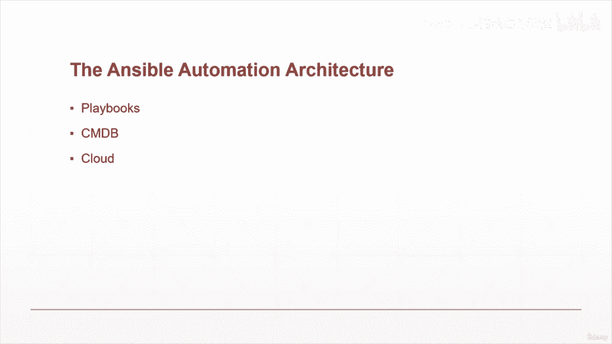
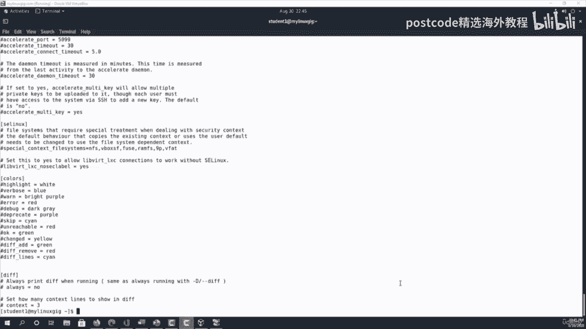
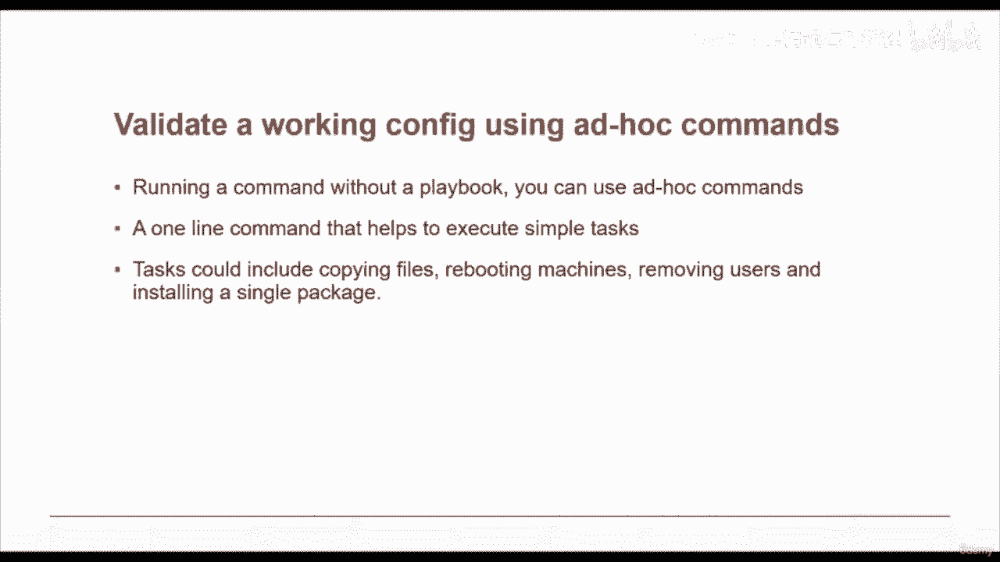

# 红帽企业Linux RHEL 9精通课程 — RHCSA与RHCE 2023认证全指南 - P65：08-08-003 RHCE Exam (Ansible-based) - 精选海外教程postcode - BV1j64y1j7Zg

Okay， let's discuss what is Ansible。 Ensible is an open source automation platform。 It is very。

 very simple to set up and yet powerful。AnsL can help you with configuration management， application。

 deployment， task， automation， etcter。 It can also do IT orchestration。

 where you have to run T in sequence and create a chain of events which must happen on several different servers or devices。

Ansible is rapidly rising to the top in the world of automation tools。

 So now let's look at some of the advantages of using Ansible。First and foremost， it is free。

 Ensible is an open source tool。And as we mentioned， it's very simple to set up and use。

 and no special coding skills are necessary to use sensibleible playbooks。It's very powerful。

 Ensible lets you model even highly complex IT workflows。It's extremely flexible。

 You can orchestrate the entire application environment no matter where it's deployed。

 You can also customize it based on your needs。Anible is agentless。

 You don't need to install any other software or firewall ports on the client systems you want to automate。

 You also don't have to set up a separate management structure。

AndSible is very efficient because you don't need to install any extra software。

 There is more room for application resources on your server。Okay， what En can do for you。

First and foremost， configuration management Ensible is designed to be very simple。

 reliable and consistent for configuration management If you are already in IT。

 you can get set up and running with it very quickly。

Anible configurations are simple data descriptions of infrastructure and are both readable by humans and parsable by machines。

 All you need to start managing systems is a password or an SS。K。

 an example of how easy Ansel makes configuration management。

 If you want to install an updated version of a specific type of software on all the machines in your enterprise。

 all you have to do is write out all the Is of the notess and write an Anl playbook to install it on all the notes。

 then run the playbook from your control machine。Next one is orchestration。Archestion。

 as the name suggests， orchestration involves bringing different elements into a beautifully run whole operation similar to the way a musical conductor brings the notes produced by all the different instruments into a cohesive artistic work。

 For example， with application deployment you need to manage。

 not just the frontend and backend services， but the databases， networks， storage， and so on。

 you also need to make sure that all the tasks are handled in the proper order。

 Ansible uses automated workflow provisioning and more to make orchestrating task easy。

 And once you have defined your infrastructure using the Anible playbooks。

 you can use that same orchestration wherever you need to。

Thanks to the portability of Anible playbooks。Next is application deployment。

When you define your application withsible and manage the deployment with Ansible tower Teams are able to effectively manage the entire application lifecycle from deployment to production you won't need to write custom code to automate your system。

 you list the task required to be done by writing a playbook and Ansible will figure out how to get your systems to the state you want them to be in。

 In other words， you won't have to configure the applications on every machine manually when you run a playbook from your control machine and Ansible uses SSH to communicate with the remote host and run all the tasks。

Next one is provisioning the first step in automating your applications lifecycle is automating the provisioning of your infrastructure with Ansible you can provision cloud platforms。

 virtualize host， network devices and beer metal servers。

Security and compliance when you define your security policies in Anible。

Scanning and remediation of sitewide security policy can be integrated into other automated processes and it will be integral in everything that is deployed。

 It means that you need to configure your security details once in your control machine and it will be embedded in all of the node automatically Moreoverover。

 all the credentials admin user IDs and passwords that are stored within Ensible are not retrievable in play and text by any user。

Now， let's quickly look at the Enible architecture。As you can see in this diagram。

 the Ensible automation engine has a direct interaction with the users who write playbooks to execute the Ensible automation engine。

 It also interacts with cloud services and configurationration management database， or CMDV。

The Enible automation architecture consists of。Inventories。

 Enl inventories are lists of hosts or nodes， along with their IP addresses， servers， databases。

 etc ce， which needs to be managed。 Anl then Enscible then takes action via transport like SSH4 Uni Linux or networking devices and Win RM for Windows systems。

Also included in NCil automation architecture are APIs。

 APIs in NsL are used as transport for cloud services， public or private。Then we have modules。

 modules are executed directly on Re Mo hosts through playbooks。

 the modules can control system resources like services， packages or files。

 anything really are execute system commands， modules do it by acting on system files。

 installing packages or making API calls to the serviceNe。The architecture also consists of plugins。

 plugins allows to execute an Nible task as a job built setup。

Pluins are pieces of code that augment Ansible's core functionality。

 Ansible ships with a number of handy plugins， and you can easily write your own。 For example。

 action plugins are front ends to modules and can execute tasks on the controller before calling the modules themselves。

 Ca plugins are used to keep a cache affect to avoid costly fact gathering operations。

There are some other components as well， like networking。

 Ansible can be used to automate different networks。 Ansible uses the same simple。

 powerful and the agent less automation framework IT operations and development are already using。

 It uses a data model， a playbook or role that is separate from the Ansible automation engine that easily spans different network hardware。

Hosts are also part of the。Architecture， the host in the Ansible architecture are just node systems which are getting automated by Ansible。

 It can be any kind of machine， Windows， Linux， red hat， etc cetera。Then we have playbooks。

 Playbooks are simple files written in Yaml format。

 which disguise the task to be executed by Ensible。 Playbooks can declare configurations。

 but they can also orchestrate the steps of any manual order process。

 even if it contains jump statements。 They can launch tasks synchronously or asynchronously。CMDV。

 it's a repository that acts as a data warehouse for IT installations。

 it holds data relating to a collection of IT assets commonly referred to as configuration items or CI。

 as well as to describe relationships between such assets。

And also cloud cloud is a network of remote servers hosted on the Internet to store。

 manage and process data rather than a local service。

 You can launch your resources and instances on cloud and connect to your server。So in conclusion。

 EnSible is a radically simple IT automation engine that automates cloud provisioning。

 configuration management， application， deployment。

 In service orchestration and many other IT needs it uses no agents and no additional custom security infrastructure。

 so it's easy to deploy and most importantly it uses a very simple language YaML that allows you to describe your automation jobs in a way that approaches plain English。

Okay， now we are at the point we are getting ready to install Ansible。

So you install Ensible on a control node， and that in turns will connect to the node that you are trying to control or trying to install applications on。

On the managed host nodes， you need a way to communicate， which is normally by SSH。

 by default this uses secure FTP。If for whatever reason secured FTP is not installing your machine。

 you can switch to secure copy or SCP in the file encible。cfG， you also need Python 2， version 2。

6 on later or preferably Python 3。

And the installation is pretty simple。 You either use DNF or yM。And then。The install command。

 and then answerible。The file is about 125， 123 Meg， and I'll say yes on this。

Shouldn't take too long because the file size is not that big。

 So it should be getting done pretty soon。 As you can see， we have cross 50% now。Okay。

 it's doing the testing， the running transactions now。And just making sure everything is in place。

 especially the Python。And the version that you're going to be installing of Ansible is 2。9。Pot10。

Dash 1， that's the latest one that's available， right。 Okay， we are done with the installation less。

Clear the screen so you can get on top of the screen。

 And then you can just to confirm that it is installed， we type Anible dash dash version。

And as you can see， Anible 2。9。10 is installed currently on this machine， so that's all you need。

Prety simple and straightforward。Hello and welcome again In this section。

 we will demonstrate how you can install and configure an answerible control node on Red Hat Enterprise Linux 8。

Although you are not restricted to this version of Linux， it has to be Linux。

 but you can install then Ubutu or any other Linux of your choice。

A typical anciible setup would look something similar to this。In my setup， I have four nodes， node 1。

 two，3， and4， and I have one answerible control node。And then I have SSH enabled。So that way。

 I can connect from my answer node。To all of the four remote nodes。

So you have to make sure that SSH is enabled， usually it is enabled by default on Red Hat Linux。

But you just have to double check and make sure that it is enabled in order for it to communicate to the remote host。

In our setup， we are going to use one Nsible server and for remote host， as I mentioned。

 and these are the details of my servers， my control node， I named it my Linux gig。

And all four of five of my servers are running RHTL 8。But as I mentioned before。

 can be any other flavor of Linux。 And then I assigned them IPp addresses in the 192168 range is starting with 254 for the。

Control node。 And then the remote servers are 112 all the way to 115。

 I've divided them into two groups。 One is Web01。Our web servers group and the other one is database servers。

 So Web servers have Web1 and Web 2， and database servers are。DBO1 and DBO2。

So while installing Ansible， one thing you have to make sure of that you have Python。

Running on your machine， Python 3 would be the recommended one and the way you can find out if you have Python running on your system or not on red hat。

 by the way， is it installed by default When I say red hat I mean sentos as well because they are both identical I am running centos because that's the free version red Ha Linux of course。

 is the paid version。So if I want to see if I have Python running on my machine and installed。

 I can just run Python 3 space dash。Capital V。And yes， I do have Python 3。6。8 running on my machine。

So you just have to make sure that you have。Python 3 is。If for any reason。

 if you don't have Python installed， then of course， you can。Become super user and command。

For installing Python is pretty simple。 You can use either DNF or Ym。DNF install。Python3。

That's all you have to do and it's going to install all the dependencies first and then eventually it'll install Python in your machine。

Suppose if you have multiple versions of Python running on your machine。

 one thing you can do is you can set alternatives。Dash dash set。Python。User。Been。Python。

If you run this command， then it's going to automatically set Python 3 as your default Python。

 So that way you'll be sure that Ansible is using the latest version。Okay，Once installed。

 then all you have to do is check， make sure that the right version is installed。

And if I run Ansible Space dash dash version should give me。

 this is the version that I have installed right now。So as you can see， this is version 2。9。11。

It gives me a location for the config file。And the executable location and the pipeline version。Now。

 in order to create our inventory file。We can。This is my home directory。 I'll do a PwD。

 and I've created a directory called Anible。And I can create an inventory file in it。

And then put my host in two separate groups in it。So the first one would be you start off with brackets。

Thatft server。End with a bracket。And then I'll put the this time I'll go ahead and put the IP address instead of the host name。

 192。168。0。112。192。168。0。113。Then I'll leave a space in between and create Db。Svers。

And then put the IP addresses 192。168。0。114。192。168。0。

115 of course as I have shown in a previous lecture。

 you can also use ranges so I could have used D servers 192。0168。0。

114 colon 115 instead of putting two entries for two separate IP addresses but since this file so far is very simple to begin with we are not going to use groupings in here。

 but feel free to do so if you want to and also in this example although I'm using four remote hosts and one control server but if you want to you can reduce the number of remote hosts to just two if that's easier for you or if you just have access to two nodes。

The easiest way to create these nodes is either to use some kind of cloud service either。AWS。

 or Azure， our Google Cloud。Or if you can download。Virtual box， which is that's what I have done。

 this is my virtual box and as you can see I have quite a few machines in here out of which I'm using these five right now。

 node1 through Note4 and my control node。

So it's a very， very easy software to download， install， and then configure virtual machines in。

They saved this。Get out。 And okay， so once we have saved our inventory file。

 then just double check to make sure that Ansible is recognizing them。 So in my case， Ansible。All。

To check on all host dash I。And then I'm going to use the inventory file。 that's the name of my file。

 which I just created in my current working directory。And if you have named youre working directory。

 something different， you can use。That name instead of the inventory。

 and then dash dash list dash host。And it should list all my four remote hosts。

So now all my four remote hosts are configured in my control node。

Okay， let's quickly go over all the components that Ensible has before we get into the live demos。

So Enible as mentioned before， is a free and open source automation framework by Red Hat。

It enables you to manage and control host from a central control node。

You can perform a repetitive task on multiple machines using Ansible。

This way you don't have to log into each host individually。

This provides consistency in application deployment and reduce human error。

Alternatives to Ansible include puppet， chef and salt。

Anible is easier to use and learn as compared to its counterparts。

AnCible uses YaL in its configuration and automation jobs。

Yammal is human readable and quite easy to follow。It uses SSH protocol to communicate with remote servers。

Other frameworks require you to install an agent on their remote nodes in order to communicate with them。

These are the main components again， inventories， modules， variables， facts， plays， playbooks。

 configuration files。And then we'll look at how to use provider document to look up specific information about anth modules。

 And here， let's talk about inventories。It is a text file that contains a list of servers or node that you' are managing。

Servers are listed based on their host names or IP addresses。An inventory file may look like this。

Or it may have fully qualified domain names as well。Inventories can be listed in groups as well。

 for example， if we have two set of servers。One group is a web server group。

 and the other one is database group。 Then we can。Separate them in two different groups like this。

Okay， next let's talk about playbooks。A playbook is a set of configuration management scripts that define how tasks are to be executed on remotemo hosts。

Are a group of hose machines。 The scripts or instructions are written in Yal format。 For instance。

 you can have a playbook file to install the Apache web server and call it HttPd。 YMl for Yaml。

To create the playbook， you can run the command， touch。

 And then the format is playbook name dot Yael。 For instance， if you want to create。

In httPD playbook， you can run this command。 touch httPd dot Yal。

A YamL file begins with three hyphens inside the file， we can add instructions after that。

 so these three dashes represents that it's a YamL file and then we have a comment that says named this installs and starts Apache Ser。

This example here， the playbook installs a patchy web server on a remote system defined as web servers。

In the inventory file。 So we have already looked at the inventory file。

 the group in there that's called Web servers。 that's going to be the only group that's going to be affected by this。

Playbook。Then the task performs the actual task it installing Apache web server。

Andum isum is a command in red hat for an installation。And App gett in Ubutu。

And the name of the software， of course， is HTTPD。And we are installing the latest。And afterwards。

 after the installation of the web server， Anabbel later checked if the Apache web server is started and running。

Okay in this lecture we're going to talk about some configuration files。

 so the best way to find out where a configuration file is located is once you log into your control node control node。

 by the way， is the main system where youre going to control the rest of the machines from so I am logged into my control node I have Anible installed in it。

And I want to see where my Ansible dot CFfG file is located。So if I were to type and symboly。

Dash dash。Version。It should give me a location and the config file location is。Esy Ensible， Ansible。

 that CFfG。 Now， let's take a look at that。K and this is what the Ensible CFfG file looked like。

 It's a very good idea to get yourself familiar with this file because we're going to be talking about this in this entire section on Ansible and even further。

And as you can see， all of these lines here are commented out， they have a hash sign next to them。

And the line that we are interested in right now is pretty much on the top here。

 And this is the inventory。 This is the location for the inventory file by default。

 So let's take a look at that。 We're going to exit out of here right now。And our path is slash ETC。

 slash answerible slash host。So let's take a look at that。O。

So this is the default host file for Ansible and here as well you can see everything has been commented out。

 but you can see the groups here， this is a set of ungrouped machines。That are shown as examples。

 you can have either a fully qualified domain name or like green。example。com or blue。example。

com or you can simply have an IP address。In the second example is a collection of posts belonging to the web servers group。

 so as you can see the heading is web servers within these brackets。

 and then you have four machines two with IP addresses， two with fully qualified domain names。

Then also you can have the system in a range。 So what you're looking at right here is a range。

The machines in this range will have www001 through 006。example。com。

 so there'll be six machines in there altogether。Here's another example， these are database servers。

 a collection of database servers in the D servers group。Similar concept。

 You have two day database servers， and then。Two servers with just IP addresses。

 two with fully qualified domain names。Here's an example of host ranges in this case。

The host range is 99 to 101， so instead of spelling out all three of them。

They used the shortened notation DB hyphen 99， colon 101， which means 99 itself。

 then 100 and then 101 dashnode。example。com。Okay， so we're going to get out of this file and。

What we're going to do is。Currently， I am in my home directory slash home slash student 1。

 I'm going to create a directory here so we can work。On ansible related stuff， we'll call it Ansible。

And then I'm going to CD to Enible， so all my related files reside in that。Right now it's empty。

And instead of。Dealing directly with the Ey Anible host file。

 we can create our own inventory file in our home directory。And what I mean by that is LviI。

Inventory。It's a new file we' just creating。Okay a brand new file。

 What we're going to do is I'm going to be using four servers in this course。

 so I'm going to start adding those here， very simple。Let's start off with Web01。

Then second one will be web 02， third one would be DV01 and the last one would be。DV O2。

In its simplest form， which by the way in Anible terms is also called an INI notation。

 this file format is called INI， the other one is Yaml that I mentioned earlier in a previous lecture。

And this is a static file。 You can also have dynamic file for inventory that we're going to discuss later on。

 Now， either in order to make this。More clear， what we can do is add groupings in here。

 So let's make some room here。 And I'm going to start off with。Brackt here。And then， we'll add。

Web servers grouping here。And then。Come down a bit， and。Create some space here。

 And then we're going to add a second grouping。 we're going to call this。Databases。Okay。

 so these are our two groups。We are done with that。 And if we want to further change it to like。

 how you saw the。Default file， and you want to use ranges in here also。

 although with just two database servers， ranges really don't make a whole lot of sense。

 but just to show you what it's going to look like， what I can do is add a bracket over here。

And then。Delete this。Db。After the bracket，01。Quin，02。If I had four servers， database servers。

 I could have had 01 colon 04 as my range， and I'm going to end it with the other bracket and the line below I can simply delete it。

Deleted so here in the simplest form， we have just created our first inventory。

And it has two web servers， two database servers， one with individual holes。

 the other one has a range。Okay， now we are done with this file。

 we're going to go ahead and exit out， save it and exit。Now that we have saved our inventory file。

 we're going to use the Ensibles inventory command to see if everything is in place and the inventory file looks as it's supposed to look。

So for that， we use the Ensable Dash inventory， we use the dash I option with it。

And then the name of my file is inventory， and we're going to list everything， so list。And his。

What the JSON formatted file looked like？As you can see。

 it's got the two groups that we have created， the database group and the Web serverver group。

 and also there's an all children group that we're going to talk about later。

 which could have ungrouped servers in it and then of course our two main groups database and web servers。

Okay， now that we have set up our inventory file and also tested it。

 we're going to set up the password less SSH to connect to remote host。

 This is going to happen on the Ansible control node。

So for the Anible control node to manage the remote host。Systems。

 we need to set up passwordless SSH authentication to the remote host。For this to happen。

 you need to generate an SSH key pair and save the public key to the remote nodes。

On the Ensible control node， we' are going to log in as a normal user and generate the SSH key pair by running this command。

Once that is done， next we're going to copy the public key to remote node like this。

Of course you're going to replace the user underscore name with your actual username。

And for the IP address， you're going to use your IP address， in my case。

 I have a range of 112 to 115 for four of my nodes。

Okay， so the first command that I'm going to run is SSH。Dash。Qijian。Okay。

 and it gives me a default directory tells me that this is where it's going to save it。

 So if I want to I can just take the default and that's what I'm going to do。

And then it asks you to put a pass phrase。 So I'm going to put。A pass phrase。Then you put it again。

Okay， my key has been generated already。And now the next step is I'm going to copy it。Actually。

 in order for me to do it， let's move into the directory base saved， so its saved into dot SSH。Okay。

And if I do an LS here， you can see the public key is located right here because that's the default location and I didn't change it。

 so thatsboard saved it。So I'm going to run the SSH copy command from here。

 so that way it will be able to find the ID。And then。Student1 is my user at the other host and 1。

92 dot 1，68 dot 0 dot 1，1，2 is one of my。It's my first toast， which is web 01。Okay。

 and I'm going to say because this is the first time it's connecting it。

 it's going to ask me for this。And password。For that host。

Okay and as you can see it says number of keys added one。

 now try logging into the machine with SSH and all that check just to make sure that you can log in。

Okay， so once our key is copied， now what I'm going to try to do is。S the stage to it。

So the command is SSH and student1 is my user。And then the IP address of this system。

And as you can see， it didn't ask me for a password。

 it directly let me in because it has the key already copied Now I'm going to repeat the same with the other three nodes as well。

Okay， now in order to perform a p test。To make sure that I can connect from my control node to all the remote node。

 what I have done is in the Etsy Anible host file。I have made a change at sea。Answible。Host file。

And if you see， I have。Uncommented。The web service section。And then I have added these two entries。

 which are my two web servers。WebO1 and Web02。 Then again， I have uncommented the D server section。

 and I've added。The two。DB servers， DBO1 and DBO2。So once you're done with that。

 you can just quit and save。Cled the screen。 and then I'm going to run the An pink command。

This is not the ICMP thing， but it's a trivial ad hoc command that we use in Ensible， Anible M。

Space paying， space all。 And this is going to look at。The Etsy Anible host file。

To see which host groups I have configured in there。

 and it's going to give me the response if it can connect。It'll take just a few seconds， okay。

 so I get a response back。From all of my machines， this is 113， 115， 114， and 112。

And that tells me that I do have secure connection with all of these machines。

Okay， what are modules？Modules are discrete units of code used in playbooks for executing commands on remote hosts or servers。

Each module is followed by an argument。The basic format of a module is key colon value。

An example would be。Dash name， colon， install Apache packages。And then yum colon name equals H T TPD。

Space state equals present in this code， snippet， dash name and yum are module。 And next。

 let's talk about plays。An Enible plays a script on an instruction that defines the task to be carried out on a server。

 the collection of plays constitute a playbook， in other words。

 a playbook is a collection of multiple plays， each of which clearly stipulates the task to be carried out on a server。

Plays exist in YAl format。Next， let's talk about variables。If you have a background in programming。

 then most likely you have used variables。Variables represent a value。Variables can include letters。

 numerals， and inter discourse， but must always begin with letters。

Variables are used when instructions vary from one system to another。

 This is especially true during the configuration are of various services and fee。

There are three main types of variables in Ansible。One is playbook variables。

 the second is inventory variables， and the third is special variables。

Inensible variables are first defined using the vs。

 then followed by the variable name and then the value， and the syntax is shown as this vs， colon。

 then var name， the first variable and var name the second variable and so on。

Consider the code below。Host dash host。Vb servers。Vars。Dash web underscore directory。

 and then the path of the directory is Var www slash HTMLm In this example。

 the variable here is web_ directory and it instructs Ensible to create a directory in the VWWW HM path。

Okay， now let's talk about facts， F are system properties gathered by Ensible when it executes a playbook on a whole system。

The properties include host name。OS family， CPU type and CPU core to mention a few to have a glimpse of the number of facts available for use。

 you can issue the command Anible space local host dash M。Set up。Once you run this command。

 the output is going to be very huge。And we're going to show you in live demo in a second。

And if you want to filter it out and to more specific。

 say IPV4 entries only you can use this filter in addition to the command above。

 and this will give you a much smaller output， so let's take a look at on a real system。

Okay， first you're going to run the command without the filter。So you start off with Ensible。

Local host。Dash m。Set up。And as you' going to see， you're going to get a huge amount or huge number of facts。

That this system has。Which is my control node。It's a very lengthy file and very hard to decipher。

 So if you want to。Filter out something in it。Can use the same command。But。Include a filter in it。

 And in order to do that， all you have to do is just add dash A。Colon。Filter。Equals。Etra。IP V4。

 if that's what you want to filter。And then it's going to show you only one entry because the system only has。

1 I address so far in it。

Okay， now let's discuss the integration files。In Ensible a configuration file is a file that contains different parameters。

Settings that determine how Ansible runs the default configuration file is the Ensible do cfg file located in Esy Ansible directory。

 You can view the configuration file by running cat slash ETc slash Ensible slash Ensible。 cfg。

 So let's do that。

And as you can observe， several parameters are included such as inventory and library file pads。

 pseudo user， plugin filters， modules， etc ce， these parameters can be adjusted simply by commenting them out and modifying the values therein。

When logged in as regular user， you may be required to perform certain tasks。

On managed notes that require elevated privileges or root privileges。

These tasks include package management， adding new users and groups。

 and modifying system configurations to mention just a few to achieve this。

 you need to invoke certain directives in the playbook to run the task as a privileged user on the remote host。

The first directive that you're going to talk about is become。

AnCl allows you to become another user on the managed node different from the one currently logged in。

 the become colon yes Directive elevates your privilege and allows you to perform tasks that require rude privileges such as installing and updating packages and rebooting the system。

Consider a playbook httPd。yml。That installs and startss Apache Web serverver as shown in this example。

The becomecom calling yes Directive allows you to execute commands as a root user on their remote host。

Next directive is becomecom underscore user， This is another directive that you can use to become another user。

This allows you to switch to a user。On the remote host upon logging in and not the user you're logged in as。

 for example， to run a command as a student one user on the remote。System。

 you can use the directive as below。Next one is。Become underscore method。

 This directive will override the default method set in Ansible do CFfg file。

 which is usually set to pseudo。And the last directive that we going discuss is becomecom underscore flags。

These are used at play or task level。For instance， when you need to switch to a user when the shell is set to no log in。

And the example would look something like this。

Now we're going to look at some command line options in privilege escalation。

 this is something you can use to elevate your privilege when running commands。

If you use dash S becomecome dash pass and dash uppercase K。

 this prompts you for the password of the pseudo user on the remote system that you're trying to connect to。

An example would be something like this。 The dash dash become dash B。

 This allows you to run the task as a root user without prompting for a password。

 The dash dash becomes dash user equals to become user。 It allows you to run task as another user。

 An example would look something like this。 Next， we're going talk about validating a working config using ad hoc commands。

 Sometimes you may want to perform。Quick and simple tasks on your most hosts are servers in ansible without necessarily having to create a playbook。

 In that case， you would require an ad hoc command。

 So what is an ad hoc command and ansible ad hoc command is a one line command that helps you execute simple tasks in a simple yet efficient manner without the need of creating playbooks。

 Such tasks include copying files between host， rebooting servers。

 adding and removing users and installing a single package。In this section。

 we're going to talk about actually showing you a demo where we're going to explore various applications of Ensible aocc commands。

The most basic usage of Ansible and ho command is pinging a host or group of hose。

 So I have a group of hosts configured in my host directory。 Let me show you that first。At sea。

Ansible。And then in here I have the host directory if I were to do a cat on host。

You will see that I have a couple of app servers located here and a couple of database servers here。

So that's what we're going to p。And the command we'll use is Ensible。Dash M ping all。

And you should get， if everything is working， you should get an output something similar to that。

 So in this command， the dash M parameter is the module option。 Ping is the ad hoc command。

 and the second parameter all represents all holes in the inventory file。

 The output of the command was look something similar to this one。To ping a particular group of host。

 you can replace all parameters with the group name， so let's try that。In this example。

 we can our test connectivity with hosts under the Web servers group。So， I'm going to。Type Ansible。

 dash M ping。Bed。Servers。And the only two servers that should respond are the ones that are listed under web servers。

Additionally， you can use the dash A attribute to specify regular Linux commands in Additionally。

 you can use the dash A attribute to specify regular Linux commands in double quotation marks。

 for example， to check system up time of remote systems。 You can use ansible。Dash a。Up time。

Db servers。And it should show me the uptime of the two database servers。And as you can see。

 they have been up。For 37 minutes on this and one minute for this one。

And I can run the same command for all of my servers。I'll just replace the up time。To our time all。

And that's showing the up time of all four of my servers。You can check the disk usage of remote host。

And for that， the command is ensible。Dash， dash a。Df。Dash。T。哦。

And this shows you the output of the D F dash T H command on all of your。

Notes that are under this control node。If you want to view the entire list of module with their descriptions。

 you can run the command answerable。Dash doc。Dash L。It'll give you a long list。

Of the answerible modules that you have access to。And you can keep hitting enter。

 and you can see all the modules that you can use。To view the detailed information about a particular module。

 you can run Ansible。Dash dock。And then the module name。 suppose I want to pick。

ACI underscore filter module。Okay， it gives you the description， just like a man page。

