# 红帽企业Linux RHEL 9精通课程：08-08-003：RHCE考试（基于Ansible） - 精选海外教程

在本节课中，我们将要学习Ansible自动化平台的基础知识。我们将了解什么是Ansible、它的优势、核心架构以及如何安装和配置一个基本的Ansible控制节点。通过本教程，你将能够理解Ansible的基本概念，并准备好开始使用它来管理你的系统。

## 什么是Ansible？🤖

Ansible是一个开源的自动化平台。它非常易于设置，同时功能强大。Ansible可以帮助你进行配置管理、应用程序部署、任务自动化等。它还可以进行IT编排，即你需要在多个不同的服务器或设备上按顺序运行任务并创建一系列必须发生的事件。

Ansible在自动化工具领域迅速崛起。

## Ansible的优势 ✨

以下是使用Ansible的一些主要优势。

*   **免费开源**：Ansible是一个开源工具。
*   **简单易用**：正如我们提到的，它非常易于设置和使用，使用Ansible剧本不需要特殊的编码技能。
*   **功能强大**：Ansible允许你模拟甚至高度复杂的IT工作流。
*   **极其灵活**：无论应用程序部署在何处，你都可以编排整个应用环境。你也可以根据自己的需求进行定制。
*   **无代理**：你不需要在想要自动化的客户端系统上安装任何其他软件或防火墙端口。你也不必设置单独的管理结构。
*   **高效**：因为你不需要安装任何额外的软件，所以你的服务器上有更多的资源可供应用程序使用。

## Ansible能做什么？🔧

以下是Ansible的主要应用场景。

*   **配置管理**：Ansible被设计得非常简单、可靠和一致，适用于配置管理。如果你已经在IT领域，你可以很快地设置并运行它。Ansible配置是对基础设施的简单数据描述，既可供人类阅读，也可供机器解析。开始管理系统只需要一个密码或SSH密钥。一个展示Ansible如何简化配置管理的例子是：如果你想在企业中的所有机器上安装特定类型软件的更新版本，你只需要列出所有节点的IP地址，并编写一个Ansible剧本来在所有节点上安装它，然后从你的控制机器运行该剧本。
*   **编排**：顾名思义，编排涉及将不同的元素整合成一个运行良好的整体操作，类似于音乐指挥将不同乐器产生的音符整合成一个有凝聚力的艺术作品。例如，在应用程序部署中，你不仅需要管理前端和后端服务，还需要管理数据库、网络、存储等。你还需要确保所有任务都按正确的顺序处理。Ansible使用自动化工作流、资源调配等使编排任务变得容易。一旦你使用Ansible剧本定义了你的基础设施，你就可以在任何需要的地方使用相同的编排，这得益于Ansible剧本的可移植性。
*   **应用程序部署**：当你用Ansible定义你的应用程序并用Ansible Tower管理部署时，团队能够有效地管理从部署到生产的整个应用程序生命周期。你不需要编写自定义代码来自动化你的系统，你通过编写剧本来列出需要完成的任务，Ansible会找出如何使你的系统达到你想要的状态。换句话说，当你从控制机器运行剧本时，你不必在每台机器上手动配置应用程序，Ansible使用SSH与远程主机通信并运行所有任务。
*   **资源调配**：自动化应用程序生命周期的第一步是自动化基础设施的资源调配。使用Ansible，你可以调配云平台、虚拟化主机、网络设备和裸机服务器。
*   **安全与合规**：当你在Ansible中定义安全策略时，全站范围安全策略的扫描和修复可以集成到其他自动化流程中，并成为所有部署内容中不可或缺的一部分。这意味着你只需要在控制机器上配置一次安全细节，它就会自动嵌入到所有节点中。此外，存储在Ansible中的所有凭据、管理员用户ID和密码都无法被任何用户在剧本和文本中检索到。

## Ansible架构概览 🏗️

现在，让我们快速了解一下Ansible的架构。如下图所示，Ansible自动化引擎与编写剧本以执行Ansible自动化引擎的用户直接交互。它还与云服务和配置管理数据库（CMDB）交互。

Ansible自动化架构由以下部分组成。

*   **清单**：Ansible清单是主机或节点的列表，包含它们的IP地址、服务器、数据库等信息，这些是需要被管理的。然后Ansible通过传输方式（如针对Unix/Linux或网络设备的SSH，以及针对Windows系统的WinRM）采取行动。
*   **API**：Ansible中的API用作云服务（公共或私有）的传输。
*   **模块**：模块通过剧本直接在远程主机上执行。模块可以控制系统资源，如服务、包或文件，或者执行系统命令。模块通过作用于系统文件、安装包或向服务网络进行API调用来实现。
*   **插件**：插件允许将Ansible任务作为作业构建设置来执行。插件是增强Ansible核心功能的代码片段。Ansible附带了许多方便的插件，你也可以轻松编写自己的插件。例如，动作插件是模块的前端，可以在调用模块本身之前在控制器上执行任务。缓存插件用于保持缓存效果，以避免代价高昂的事实收集操作。
*   **网络**：Ansible可用于自动化不同的网络。Ansible使用IT运营和开发已经在使用的相同简单、强大且无代理的自动化框架。它使用一个数据模型（剧本或角色），该模型与Ansible自动化引擎分离，可以轻松跨越不同的网络硬件。
*   **主机**：Ansible架构中的主机只是被Ansible自动化的节点系统。它可以是任何类型的机器，如Windows、Linux、Red Hat等。
*   **剧本**：剧本是用YAML格式编写的简单文件，描述了由Ansible执行的任务。剧本可以声明配置，但它们也可以编排任何手动顺序过程的步骤，即使包含跳转语句。它们可以同步或异步地启动任务。
*   **配置管理数据库**：它是一个作为IT安装数据仓库的存储库，保存与IT资产集合（通常称为配置项或CI）相关的数据，以及描述这些资产之间关系的数据。
*   **云**：云是托管在互联网上的远程服务器网络，用于存储、管理和处理数据，而不是本地服务。你可以在云上启动你的资源和实例，并连接到你的服务器。

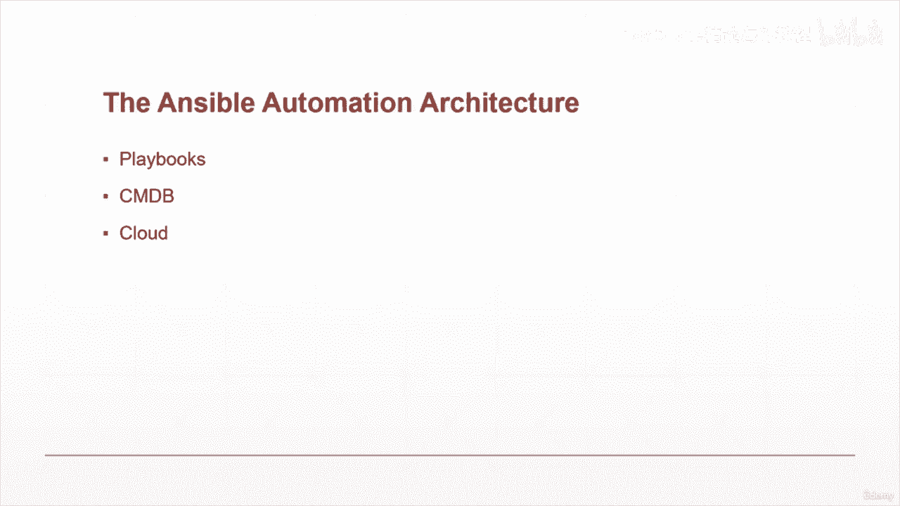

## 安装Ansible控制节点 💻

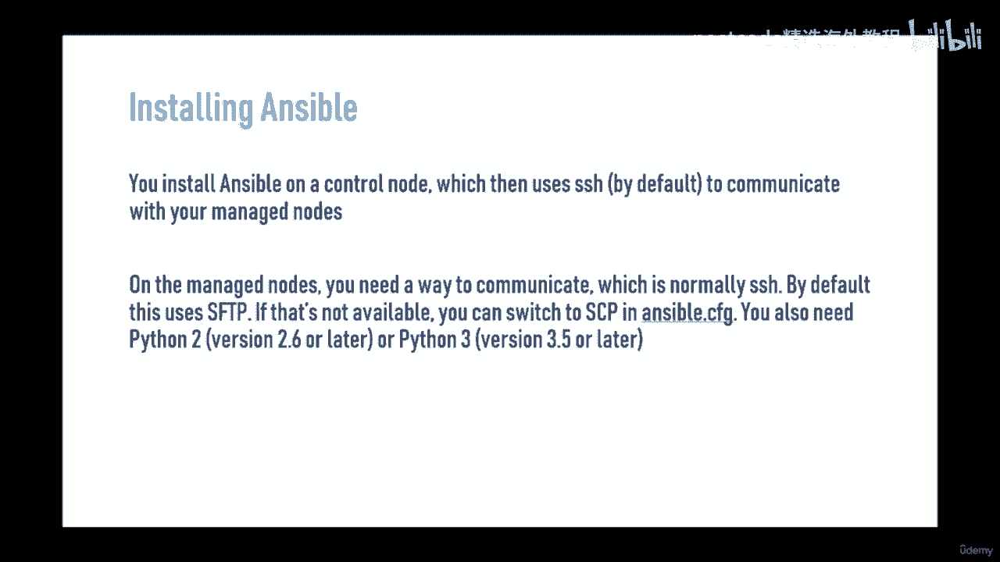

现在，我们到了准备安装Ansible的阶段。你在一个控制节点上安装Ansible，然后该节点将连接到你要控制或尝试在其上安装应用程序的节点。在受管主机节点上，你需要一种通信方式，通常是通过SSH，默认情况下使用安全FTP。如果出于某种原因安全FTP没有安装在你的机器上，你可以在文件`ansible.cfg`中切换到安全复制或SCP。你还需要Python 2（版本2.6或更高）或最好是Python 3。

安装非常简单。你可以使用DNF或yum。然后使用安装命令，接着是`ansible`。文件大约123兆，我在这里选择“是”。因为文件大小不大，所以应该不会花太长时间。如你所见，我们已经超过50%了。它正在进行测试，现在正在运行事务。只是确保一切就位，尤其是Python。你将安装的Ansible版本是2.9.10-1，这是目前可用的最新版本。安装完成了。清屏以便你能看到屏幕顶部。然后，为了确认它已安装，我们输入`ansible --version`。如你所见，Ansible 2.9.10已安装在这台机器上，这就是你所需要的。

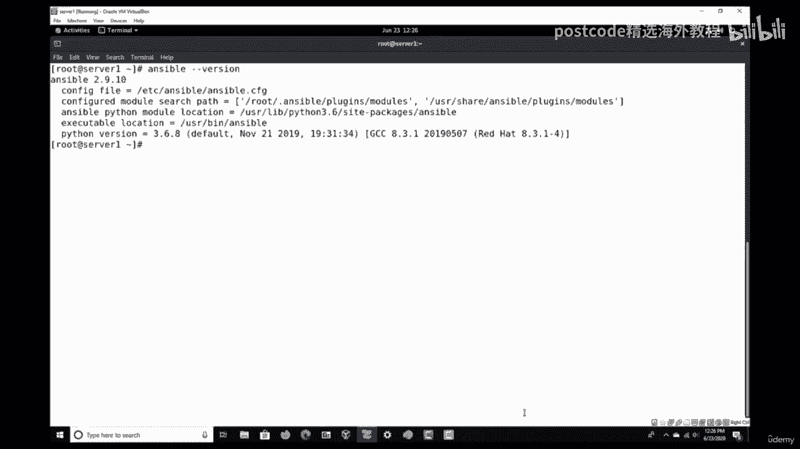

## 配置Ansible环境 🛠️

再次欢迎你。在本节中，我们将演示如何在Red Hat Enterprise Linux 8上安装和配置一个Ansible控制节点。虽然你不限于这个版本的Linux，但它必须是Linux，你也可以安装Ubuntu或你选择的任何其他Linux。

一个典型的Ansible设置看起来类似于这样。在我的设置中，我有四个节点：node1、node2、node3和node4，还有一个Ansible控制节点。然后我启用了SSH。这样，我就可以从我的Ansible节点连接到所有四个远程节点。所以你必须确保SSH已启用，通常在Red Hat Linux上默认是启用的。但你只需要仔细检查并确保它已启用，以便与远程主机通信。

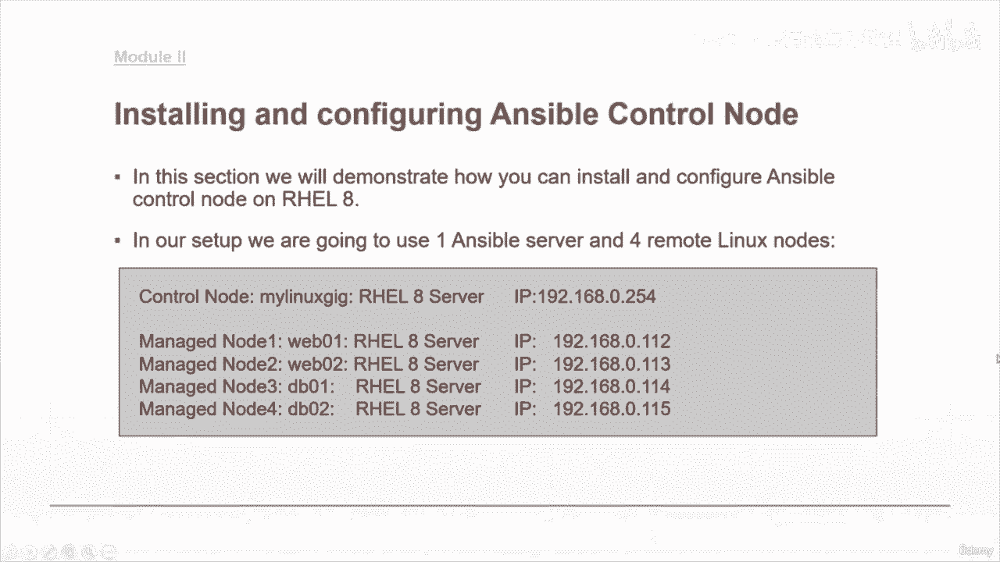

在我们的设置中，我们将使用一个Ansible服务器和四个远程主机，正如我提到的，这些是我的服务器的详细信息。我的控制节点，我将其命名为`my-linux-gig`。我的所有五台服务器都运行RHEL 8。但正如我之前提到的，也可以是任何其他风格的Linux。然后我给它们分配了192.168范围内的IP地址，控制节点以254开始。然后远程服务器是112到115。我把它们分成了两组。一组是Web服务器组，另一组是数据库服务器。所以Web服务器有Web1和Web2，数据库服务器是DB01和DB02。

## 确保Python环境 ✅

在安装Ansible时，你必须确保的一件事是你的机器上运行着Python。Python 3是推荐的版本。在Red Hat上，你可以通过以下方式找出你的系统上是否运行着Python。顺便说一下，它是默认安装的。当我说Red Hat时，我也指CentOS，因为它们两者是相同的。我运行的是CentOS，因为那是免费版本。Red Hat Linux当然是付费版本。所以如果我想看看我的机器上是否安装并运行着Python，我可以运行`python3 -V`。是的，我的机器上运行着Python 3.6.8。所以你只需要确保你有Python 3。如果出于任何原因你没有安装Python，那么当然，你可以成为超级用户。安装Python的命令非常简单。你可以使用DNF或yum：`dnf install python3`。这就是你需要做的，它将首先安装所有依赖项，然后最终在你的机器上安装Python。

假设你的机器上运行着多个版本的Python，你可以做的一件事是设置替代方案：`alternatives --set python /usr/bin/python3`。如果你运行这个命令，那么它将自动将Python 3设置为你的默认Python。这样你就可以确保Ansible使用的是最新版本。安装完成后，你需要做的就是检查，确保安装了正确的版本。如果我运行`ansible --version`，应该会显示我当前安装的版本。如你所见，这是版本2.9.11。它为我提供了配置文件的位置、可执行文件的位置和Python版本。

## 创建清单文件 📄

现在，为了创建我们的清单文件。这是我的主目录。我执行`pwd`，并创建了一个名为`ansible`的目录。我可以在其中创建一个清单文件。然后把我的主机分成两组放进去。第一组以方括号开始，以方括号结束。这次我将继续使用IP地址而不是主机名：192.168.0.112，192.168.0.113。然后我在中间留一个空格，创建数据库服务器组。然后放入IP地址192.168.0.114，192.168.0.115。当然，正如我在之前的讲座中展示的，你也可以使用范围，所以我本可以使用`db_servers 192.168.0.114:115`，而不是为两个单独的IP地址写两个条目。但由于这个文件目前非常简单，我们不会在这里使用分组，但如果你愿意，可以随意这样做。另外，在这个例子中，虽然我使用了四个远程主机和一个控制服务器，但如果你愿意，可以将远程主机的数量减少到只有两个，如果这对你来说更容易，或者如果你只能访问两个节点。

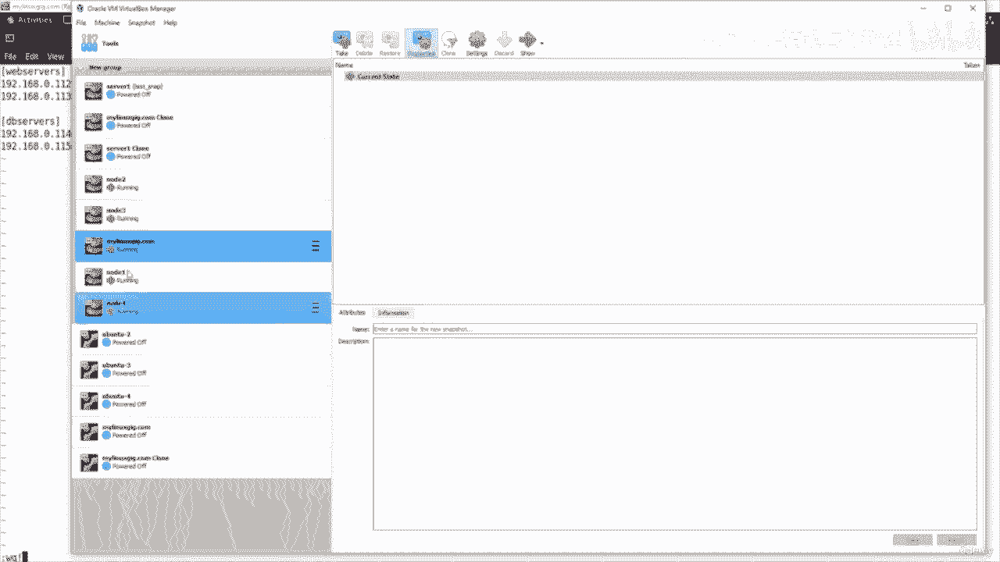

创建这些节点最简单的方法是使用某种云服务，如AWS、Azure或Google Cloud。或者如果你可以下载VirtualBox，这就是我所做的。这是我的VirtualBox，如你所见，我在这里有不少机器，其中我现在正在使用这五台：node1到node4和我的控制节点。

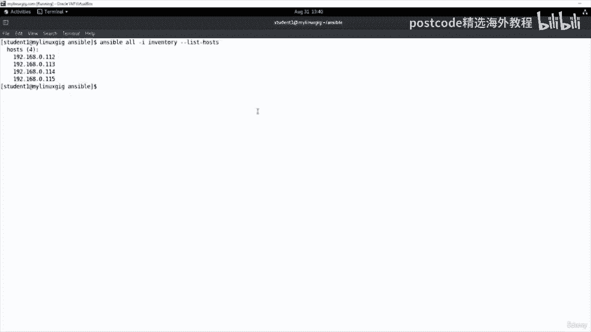

## 验证清单配置 ✔️

保存这个文件。退出。好了，一旦我们保存了清单文件，只需仔细检查以确保Ansible能识别它们。所以在我的情况下，`ansible all --list-hosts -i inventory`。然后我将使用清单文件，这是我当前工作目录中创建的文件的名称。如果你将工作目录命名为其他名称，你可以使用那个名称而不是`inventory`。然后它应该列出我所有的四个远程主机。现在，我所有的四个远程主机都在我的控制节点中配置好了。

## Ansible核心组件回顾 📚

在我们进入实际演示之前，让我们快速回顾一下Ansible的所有组件。如前所述，Ansible是Red Hat提供的一个免费开源的自动化框架。它使你能够从中央控制节点管理和控制主机。你可以使用Ansible在多台机器上执行重复性任务。这样，你就不必单独登录每台主机。这为应用程序部署提供了一致性，并减少了人为错误。Ansible的替代品包括Puppet、Chef和Salt。与同类产品相比，Ansible更易于使用和学习。Ansible在其配置和自动化作业中使用YAML。YAML是人类可读的，并且相当容易理解。它使用SSH协议与远程服务器通信。其他框架要求你在远程节点上安装代理才能与它们通信。

这些是主要的组件：清单、模块、变量、事实、剧本、配置文件和角色。然后我们将看看如何使用提供者文档来查找有关特定模块的信息。这里，我们来谈谈清单。它是一个文本文件，包含你正在管理的服务器或节点的列表。服务器根据其主机名或IP地址列出。清单文件可能看起来像这样，或者也可能包含完全限定域名。清单也可以分组列出，例如，如果我们有两组服务器。一组是Web服务器组，另一组是数据库组。那么我们可以像这样将它们分成两个不同的组。

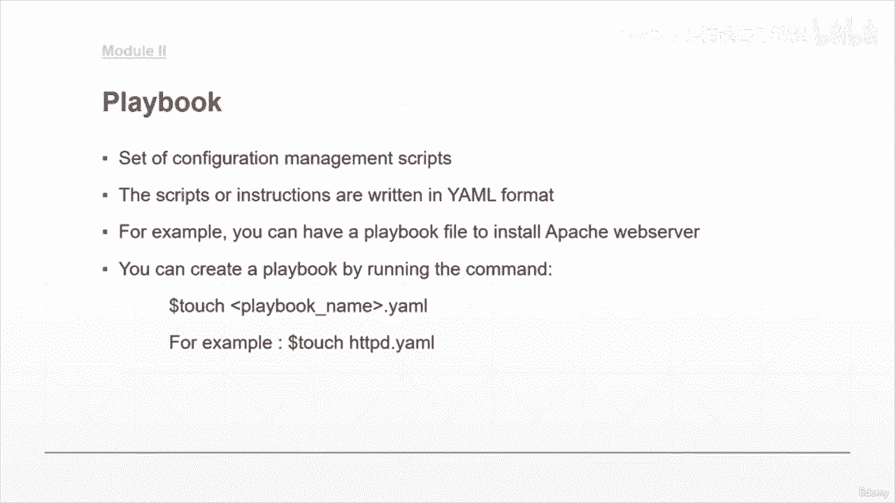

## 理解剧本 📜

接下来，我们来谈谈剧本。剧本是一组配置管理脚本，定义了如何在远程主机或一组主机上执行任务。脚本或指令以YAML格式编写。例如，你可以有一个剧本来安装Apache Web服务器，并将其命名为`httpd.yml`（Yaml格式）。要创建剧本，你可以运行命令`touch`，格式是`playbook_name.yml`。例如，如果你想创建一个HTTPD剧本，你可以运行这个命令：`touch httpd.yml`。

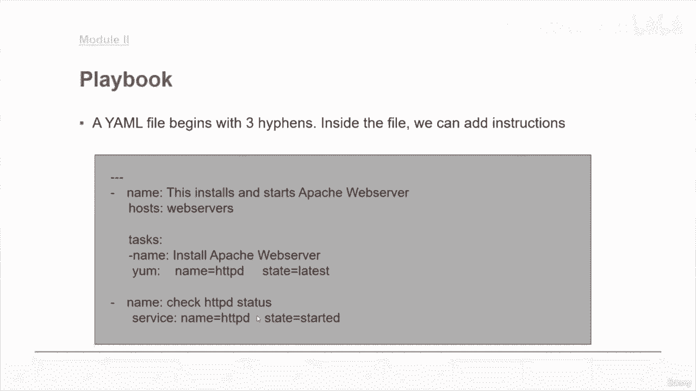

一个YAML文件以三个连字符开始。在文件内部，我们可以在那之后添加指令。这三个破折号表示它是一个YAML文件，然后我们有一个注释，写着“这个剧本安装并启动Apache服务器”。这里的这个例子，剧本在远程系统（在清单文件中定义为Web服务器）上安装Apache Web服务器。所以我们已经看过了清单文件，里面那个叫做Web服务器的组将是唯一受这个剧本影响的组。然后任务执行实际的任务：安装Apache Web服务器。`yum`是Red Hat中用于安装的命令。在Ubuntu中是`apt-get`。当然，软件的名称是HTTPD。我们正在安装最新版本。之后，在安装Web服务器之后，Ansible稍后会检查Apache Web服务器是否已启动并正在运行。

## 配置文件详解 ⚙️

在本讲座中，我们将讨论一些配置文件。找出配置文件位置的最佳方法是，一旦你登录到你的控制节点（顺便说一下，控制节点是你将从中控制其余机器的主要系统），我登录到我的控制节点，并在其中安装了Ansible。我想看看我的`ansible.cfg`文件在哪里。所以如果我输入`ansible --version`，它应该给我一个位置，配置文件的位置是`/etc/ansible/ansible.cfg`。现在，让我们看看那个文件。熟悉这个文件是个非常好的主意，因为我们将在整个Ansible部分甚至更远的地方讨论它。如你所见，这里的所有行都被注释掉了，它们旁边有一个井号。我们现在感兴趣的行基本上在顶部，这是清单的位置。这是清单文件的默认位置。所以让我们看看那个。我们现在要退出这里。我们的路径是`/etc/ansible/hosts`。所以让我们看看那个文件。

这是Ansible的默认主机文件，这里你也可以看到所有内容都被注释掉了，但你可以看到这里的组，这是一组未分组的机器，作为示例显示。你可以使用完全限定域名，如`green.example.com`或`blue.example.com`，或者你可以简单地使用IP地址。第二个例子是属于Web服务器组的主机集合，所以如你所见，标题是方括号内的Web服务器，然后你有四台机器，两台带有IP地址，两台带有完全限定域名。然后你也可以让系统处于一个范围内。所以你现在看到的是一个范围。这个范围内的机器将有`www001`到`006.example.com`，所以总共会有六台机器。这是另一个例子，这些是数据库服务器，D服务器组中的数据库服务器集合。类似的概念。你有两台数据库服务器，然后两台只有IP地址的服务器，两台带有完全限定域名。这是一个主机范围的例子，在这种情况下，主机范围是99到101，所以与其拼写出所有三个，他们使用了缩短的表示法`db-99:101`，这意味着99本身，然后是100，然后是101-`node.example.com`。

好了，我们要退出这个文件。我们要做的是：目前我在我的主目录`/home/student1`下。我要在这里创建一个目录，以便我们可以处理Ansible相关的东西。我们称之为`ansible`。然后我将`cd`到`ansible`，这样我所有相关的文件都驻留在那里。现在它是空的。与其直接处理`/etc/ansible/hosts`文件，我们可以在我们的主目录中创建我们自己的清单文件。我的意思是`vi inventory`。这是一个我们刚刚创建的新文件。一个全新的文件。我们要做的是：我将在这个课程中使用四台服务器，所以我要开始在这里添加它们，非常简单。让我们从Web01开始。第二个是web02，第三个是DB01，最后一个是DB02。以最简单的形式，顺便说一下，在Ansible术语中也称为INI表示法，这种文件格式称为INI，另一个是我在之前的讲座中提到的YAML。这是一个静态文件。你也可以有动态的清单文件，我们稍后会讨论。

现在，为了使这个更清晰，我们可以在这里添加分组。所以让我们在这里腾出一些空间。我将从这里开始，方括号。然后，我们将在这里添加Web服务器分组。然后下来一点，在这里创建一些空间。然后我们将添加第二个分组，我们称之为数据库。好了，这是我们的两个组。我们完成了这个。如果我们想进一步改变它，就像你看到的默认文件那样，并且你也想在这里使用范围，虽然只有两台数据库服务器，范围真的没有太大意义，但只是为了向你展示它会是什么样子，我可以做的是在这里添加一个方括号。然后删除这个。在方括号后，`db-01:02`。如果我有四台数据库服务器，我本可以使用`01:04`作为我的范围，我将在下一行用另一个方括号结束它，我可以简单地删除它。删除了，所以这里以最简单的形式，我们刚刚创建了我们的第一个清单。它有两台Web服务器，两台数据库服务器，一组是单独的主机，另一组有一个范围。

好了，现在我们完成了这个文件。我们将继续退出，保存并退出。现在我们已经保存了清单文件，我们将使用Ansible的清单命令来查看一切是否就位，以及清单文件看起来是否符合预期。为此，我们使用`ansible-inventory`，我们使用`-i`选项。然后我的文件名是`inventory`，我们将列出所有内容，所以`--list`。这就是JSON格式文件的样子。如你所见，它包含我们创建的两个组：数据库组和Web服务器组，还有一个“all”子组，我们稍后会讨论，其中可能包含未分组的主机，当然还有我们的两个主要组：数据库和Web服务器。

## 设置无密码SSH认证 🔐

好了，现在我们已经设置好了清单文件并进行了测试，我们将设置无密码SSH以连接到远程主机。这将在Ansible控制节点上进行。为了让Ansible控制节点管理远程主机系统，我们需要设置到远程主机的无密码SSH身份验证。为此，你需要生成一个SSH密钥对，并将公钥保存到远程节点。

在Ansible控制节点上，我们将以普通用户身份登录，并通过运行此命令生成SSH密钥对。完成后，接下来我们将像这样将公钥复制到远程节点。当然，你要将`user_name`替换为你的实际用户名。对于IP地址，你将使用你的IP地址，在我的情况下，我的四个节点有一个112到115的范围。

## 生成并分发SSH密钥 🔑

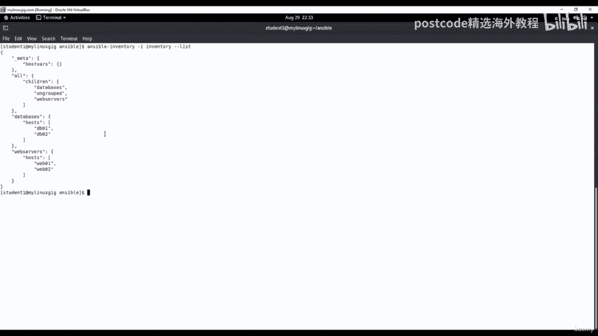

所以我要运行的第一个命令是`ssh-keygen`。它给了我一个默认目录，告诉我它将保存在哪里。所以如果我愿意，我可以直接接受默认值，这就是我要做的。然后它要求你输入一个密码短语。所以我要输入一个密码短语。然后你再输入一次。我的密钥已经生成了。现在下一步是我要复制它。实际上，为了让我做到这一点，让我们进入它保存的目录，所以它保存在`.ssh`目录中。如果我在这里执行`ls`，你可以看到公钥就在这里，因为那是默认位置，我没有更改它，所以它保存在那里。所以我要从这里运行`ssh-copy-id`命令，这样它就能找到`id_rsa.pub`。然后`student1`是另一台主机上的用户，`192.168.0.112`是我的第一台主机，也就是web01。因为这是第一次连接它，它会问我这个。以及该主机的密码。如你所见，它说添加的密钥数量为1。现在尝试用SSH登录机器，并检查以确保你可以登录。

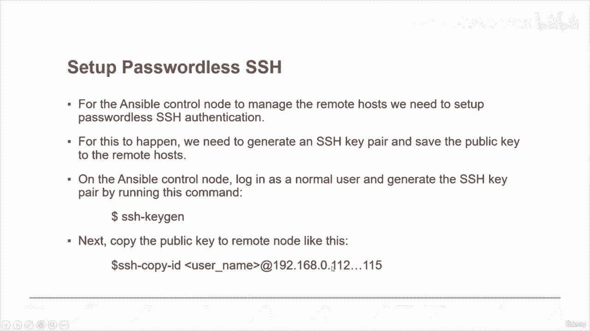

好了，一旦我们的密钥被复制，现在我要尝试做的是SSH到它。所以命令是`ssh`，`student1`是我的用户。然后是这台系统的IP地址。如你所见，它没有要求我输入密码，它直接让我进去了，因为它已经复制了密钥。现在我将对其他三个节点重复同样的操作。

## 测试连接与Ad Hoc命令 🧪

现在，为了执行一个ping测试，以确保我可以从我的控制节点连接到所有远程节点，我所做的是在`/etc/ansible/hosts`文件中做了一个更改。如果你看到，我已经取消了Web服务器部分的注释。然后我添加了这两个条目，这是我的两个Web服务器：Web01和Web02。然后再次，我取消了D服务器部分的注释，并添加了两个数据库服务器：DB01和DB02。所以一旦你完成了，你可以直接退出并保存。清屏。然后我将运行`ansible ping`命令。这不是ICMP ping，而是我们在Ansible中使用的一个简单的临时命令：`ansible -m ping all`。这将查看`/etc/ansible/hosts`文件，看看我在那里配置了哪些主机组，如果它能连接，它将给我响应。只需要几秒钟，好了，我得到了所有机器的响应。这是113、115、114和112。这告诉我，我与所有这些机器确实有安全连接。

## 模块、剧本与变量 📦

什么是模块？模块是剧本中使用的离散代码单元，用于在远程主机或服务器上执行命令。每个模块后面都跟着一个参数。模块的基本格式是`key: value`。一个例子是：`- name: install Apache packages`，然后`yum: name=httpd state=present`。在这段代码片段中，`- name`和`yum`是模块。接下来，我们来谈谈剧本。Ansible剧本是一个脚本或指令，定义了要在服务器上执行的任务。剧本的集合构成了一个剧本，换句话说，剧本是多个剧本的集合，每个剧本都明确规定了要在服务器上执行的任务。剧本以YAML格式存在。

接下来，我们来谈谈变量。如果你有编程背景，那么很可能你使用过变量。变量代表一个值。变量可以包含字母、数字和下划线，但必须始终以字母开头。当指令因系统而异时使用变量。这在配置各种服务和费用时尤其如此。Ansible中有三种主要类型的变量：剧本变量、清单变量和特殊变量。

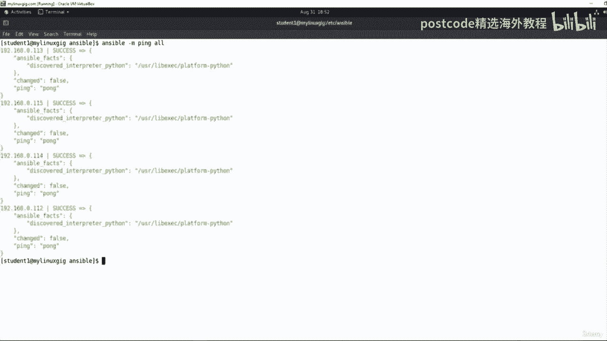

在Ansible中，变量首先使用`vars`定义，然后是变量名和值，语法如下所示：`vars:`，然后是第一个变量名和第二个变量名，依此类推。考虑下面的代码：`hosts: host_vars servers`，`vars:`，`web_directory:`，然后目录的路径是`/var/www/html`。在这个例子中，这里的变量是`web_directory`，它指示Ansible在`/var/www/html`路径下创建一个目录。

## 事实收集与过滤 🔍

现在我们来谈谈事实。事实是Ansible在整个系统上执行剧本时收集的系统属性。这些属性包括主机名、操作系统系列、CPU类型和CPU核心等。要了解可用事实的数量，你可以发出命令`ansible localhost -m setup`。一旦你运行这个命令，输出将会非常庞大。我们稍后会在实际演示中向你展示。如果你想过滤它并使其更具体，比如只显示IPv4条目，你可以在上面的命令中添加这个过滤器，这将给你一个更小的输出。所以让我们在一个真实系统上看一下。

首先，你将在没有过滤器的情况下运行命令。所以你以`ansible localhost -m setup`开始。如你将看到的，你将获得大量的事实，这个系统拥有的数量非常多。这是一个非常长的文件，很难解读。所以如果你想过滤其中的某些内容，可以使用相同的命令，但在其中包含一个过滤器。为了做到这一点，你只需要添加`-a 'filter=ansible_ipv4'`，如果那是你想过滤的。然后它将只显示一个条目，因为系统目前只有一个IP地址。

## 配置文件详解 📋

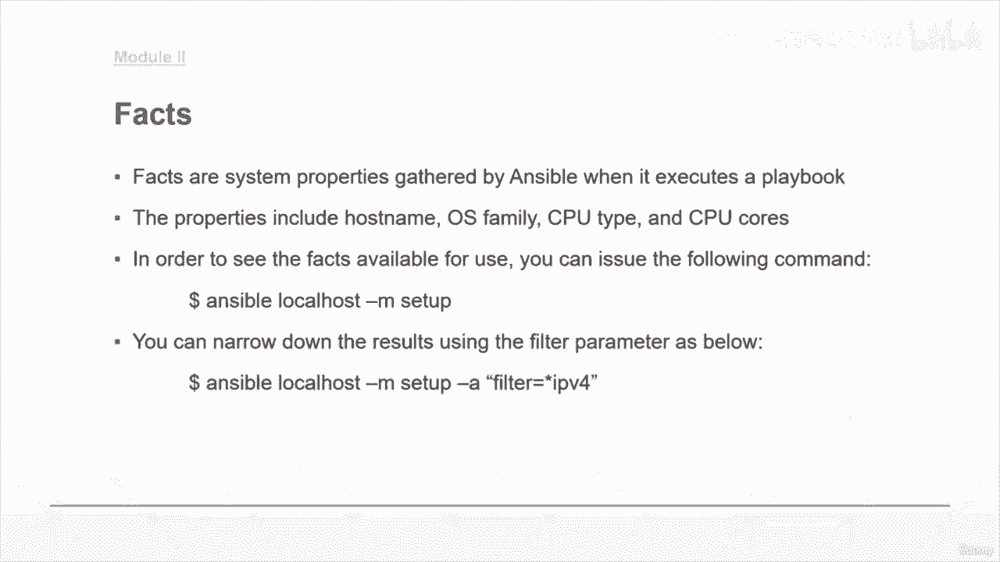

现在我们来讨论配置文件。在Ansible中，配置文件是一个包含不同参数、设置的文件，这些参数和设置决定了Ansible的运行方式。默认的配置文件是位于`/etc/ansible`目录中的`ansible.cfg`文件。你可以通过运行`cat /etc/ansible/ansible.cfg`来查看配置文件。所以让我们这样做。如你所观察到的，包含了几个参数，如清单和库文件路径、伪用户、插件过滤器、模块等。这些参数可以通过注释掉它们并修改其中的值来调整。

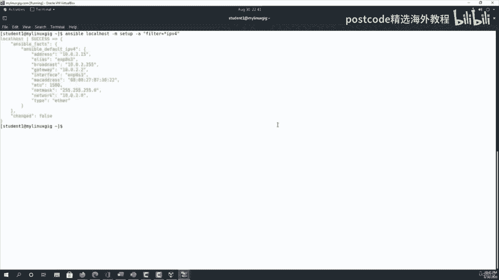

## 权限提升与Ad Hoc命令 🚀

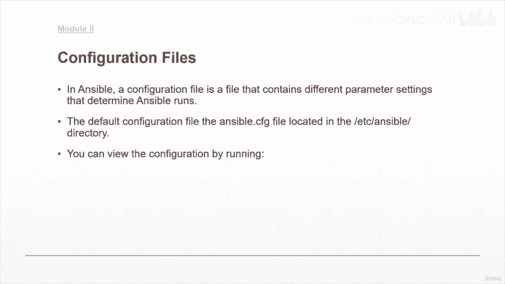

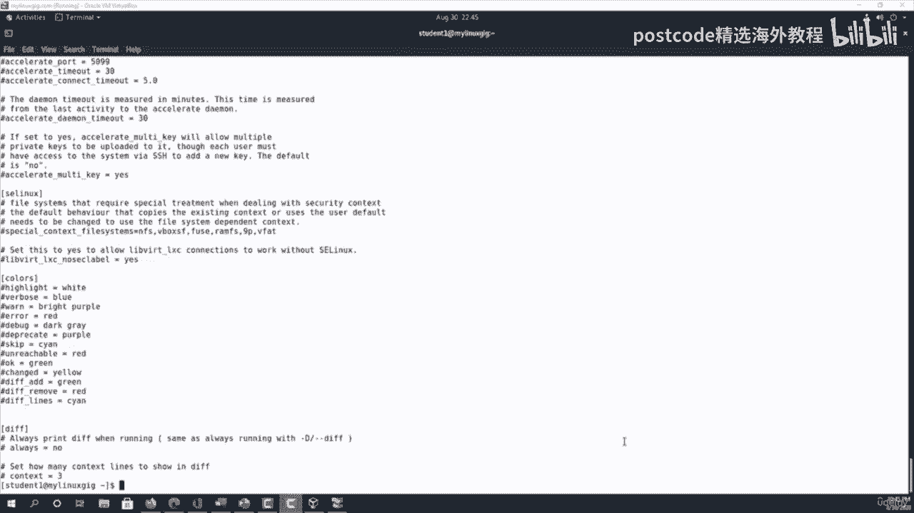

当以普通用户身份登录时，你可能需要在受管节点上执行某些需要提升权限或root权限的任务。这些任务包括包管理、添加新用户和组以及修改系统配置等。为了实现这一点，你需要在剧本中调用某些指令，以在远程主机上以特权用户身份运行任务。

你要讨论的第一个指令是`become`。Ansible允许你成为受管节点上的另一个用户，不同于当前登录的用户。`become: yes`指令提升你的权限，并允许你执行需要root权限的任务，例如安装和更新包以及重启系统。考虑一个剧本`httpd.yml`，它安装并启动Apache Web服务器，如本例所示。`become: yes`指令允许你在远程主机上以root用户身份执行命令。

下一个指令是`become_user`。这是另一个你可以用来成为另一个用户的指令。这允许你在登录后切换到远程主机上的一个用户，而不是你登录的用户。例如，要在远程系统上以student1用户身份运行命令，你可以使用如下指令。下一个是`become_method`。这个指令将覆盖`ansible.cfg`文件中设置的默认方法，通常设置为`sudo`。我们要讨论的最后一个指令是`become_flags`。这些在剧本或任务级别使用。例如，当你需要切换到一个用户，而该用户的shell设置为无登录时。例子看起来像这样。

## 命令行权限提升选项 ⚡

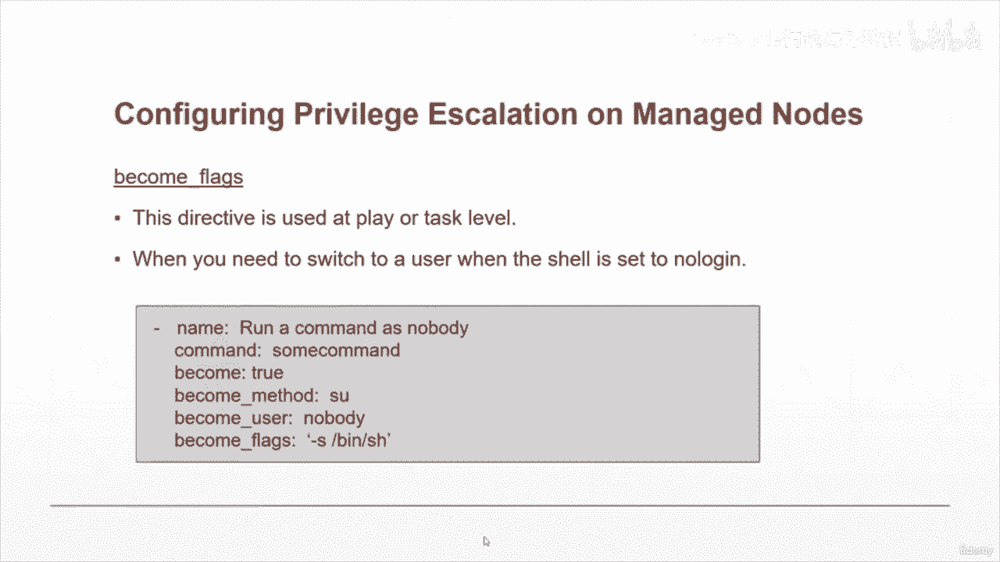

现在我们将看一些命令行选项，用于权限提升。这是你可以在运行命令时用来提升权限的东西。如果你使用`-s`、`--become`、`-K`，这会提示你输入远程系统上你试图连接的伪用户的密码。一个例子是这样的。`--become`或`-b`允许你以root用户身份运行任务，而无需提示输入密码。`--become-user=`允许你以另一个用户身份运行任务。一个例子看起来像这样。接下来，我们将讨论使用临时命令验证工作配置。有时你可能想在Ansible中的受管主机或服务器上执行快速简单的任务，而不必创建剧本。在这种情况下，你将需要一个临时命令。

那么什么是临时命令？Ansible临时命令是一行命令，帮助你以简单而高效的方式执行简单任务，而无需创建剧本。此类任务包括在主机之间复制文件、重启服务器、添加和删除用户以及安装单个包。在本节中，我们将实际向你展示一个演示，我们将探索Ansible临时命令的各种应用。

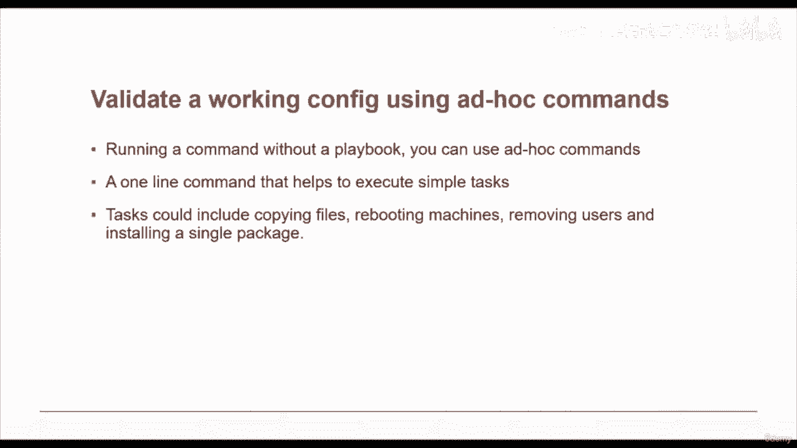

## 使用Ad Hoc命令进行测试 🧪

Ansible临时命令最基本的用法是ping一个主机或一组主机。所以我在我的主机目录中配置了一组主机。让我先向你展示一下。`/etc/ansible/`，然后在这里我有主机目录，如果我对`hosts`执行`cat`，你会看到我这里有几个应用服务器和几个数据库服务器。这就是我们要ping的。我们将使用的命令是`ansible -m ping all`。如果一切正常，你应该得到类似这样的输出。所以在这个命令中，`-m`参数是模块选项。`ping`是临时命令，第二个参数`all`代表清单文件中的所有主机。命令的输出看起来类似于这个。要ping特定的主机组，你可以用组名替换`all`参数，所以让我们试试。在这个例子中，我们可以测试与Web服务器组下的主机的连接性。所以，我要输入`ansible -m ping web_servers`。应该响应的只有列在Web服务器下的两台服务器。

此外，你可以使用`-a`属性在双引号中指定常规的Linux命令。例如，要检查远程系统的正常运行时间，你可以使用`ansible -a "uptime" db_servers`。它应该显示两台数据库服务器的正常运行时间。如你所见，这台已经运行了37分钟，另一台运行了1分钟。我可以为我的所有服务器运行相同的命令。我只需将`uptime`替换为`uptime all`。这显示了我所有四台服务器的正常运行时间。你可以检查远程主机的磁盘使用情况。命令是`ansible -a "df -Th" all`。这向你显示了在你的控制节点下的所有节点上执行`df -Th`命令的输出。

如果你想查看带有描述的整个模块列表，你可以运行命令`ansible-doc -l`。它将给你一个很长的Ansible模块列表，你可以访问这些模块。你可以一直按回车键，可以看到所有可以使用的模块。要查看特定模块的详细信息，你可以运行`ansible-doc`，然后是模块名。假设我想选择`aci_filter`模块。它给你描述，就像一个手册页。

## 总结 📝

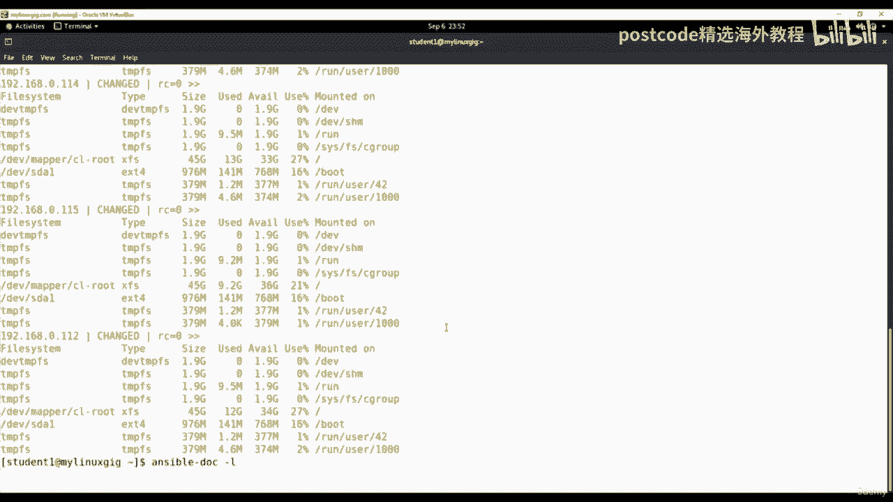

在本节课中，我们一起学习了Ansible自动化平台的基础知识。我们从了解Ansible是什么、它的核心优势以及它能做什么开始。我们深入探讨了Ansible的架构，包括清单、模块、插件、剧本等关键组件。接着，我们一步步演示了如何在Red Hat Enterprise Linux系统上安装和配置Ansible控制节点，包括设置Python环境、创建清单文件以及配置无密码SSH认证以实现对远程主机的管理。我们还介绍了Ansible的核心概念，如模块、剧本、变量和事实收集，并学习了如何使用临时命令进行快速测试和简单任务执行。最后，我们了解了配置文件的作用以及如何进行权限提升。通过这些内容，你现在应该对Ansible有了一个基本的理解，并能够开始使用它来自动化你的IT任务。