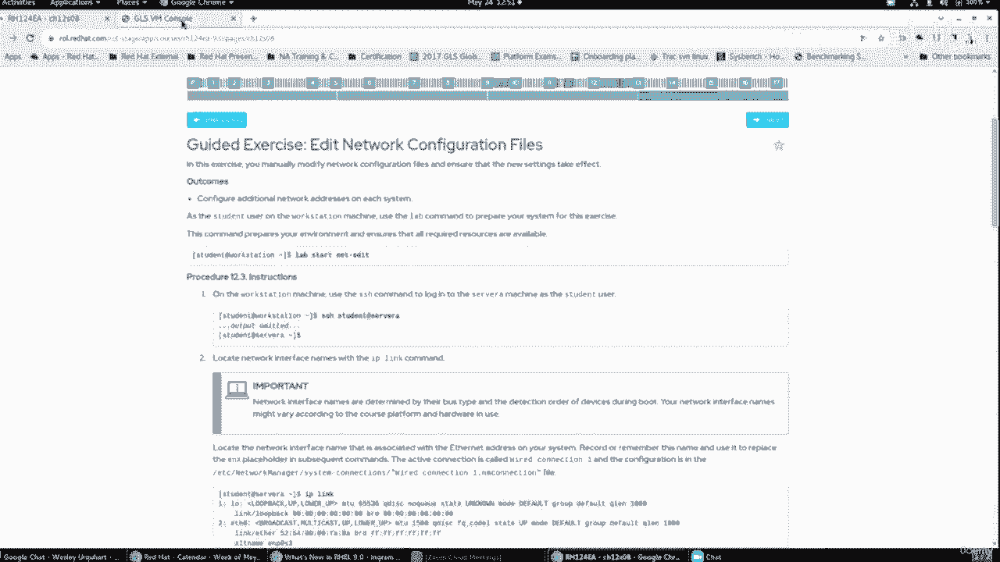
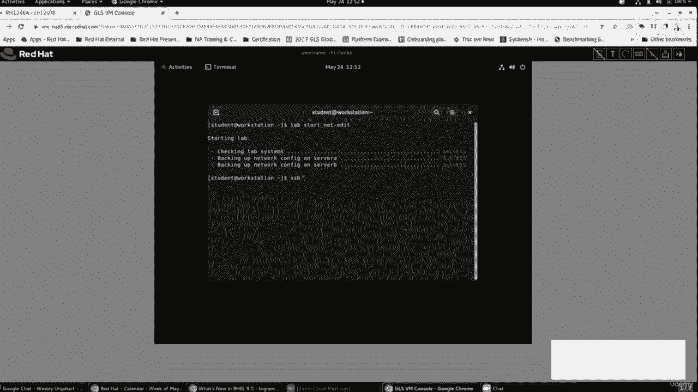
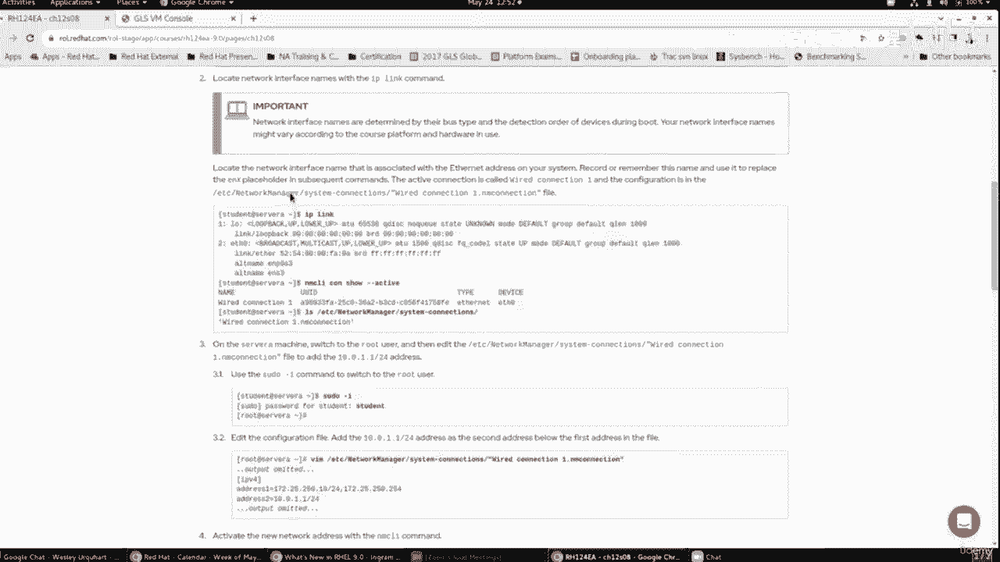
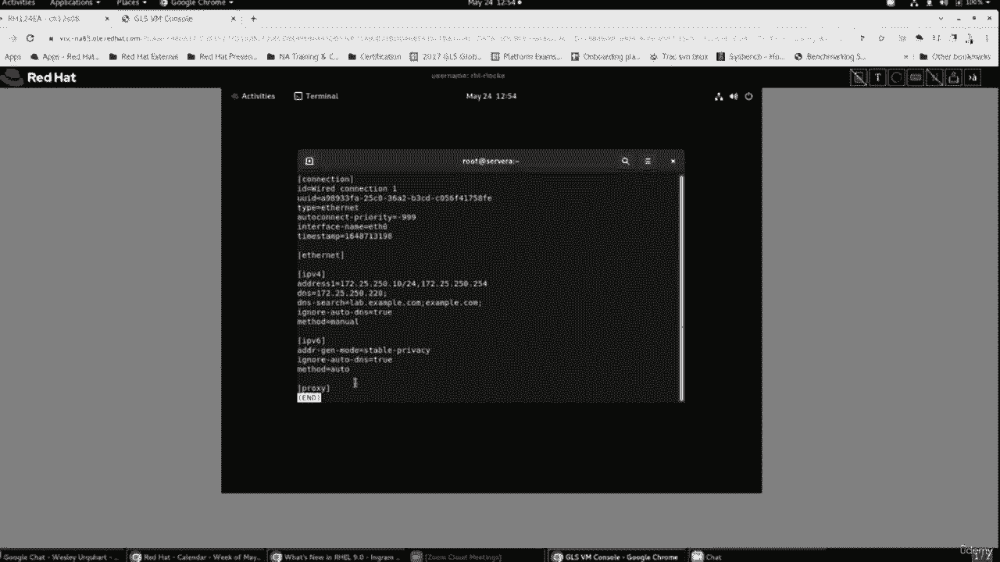
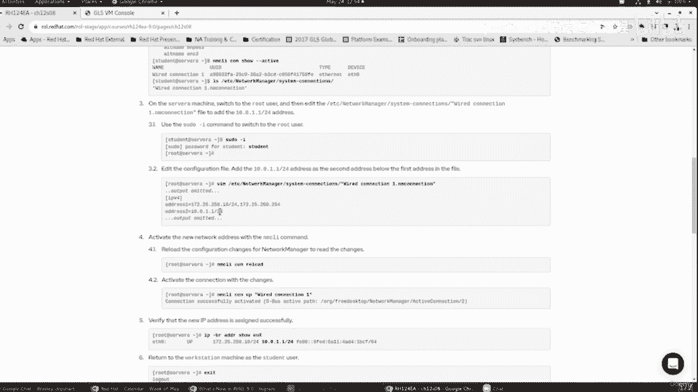
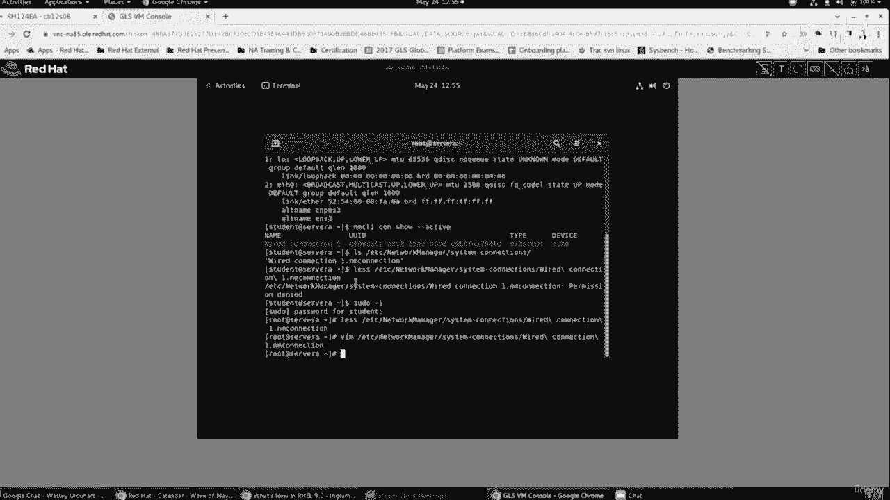
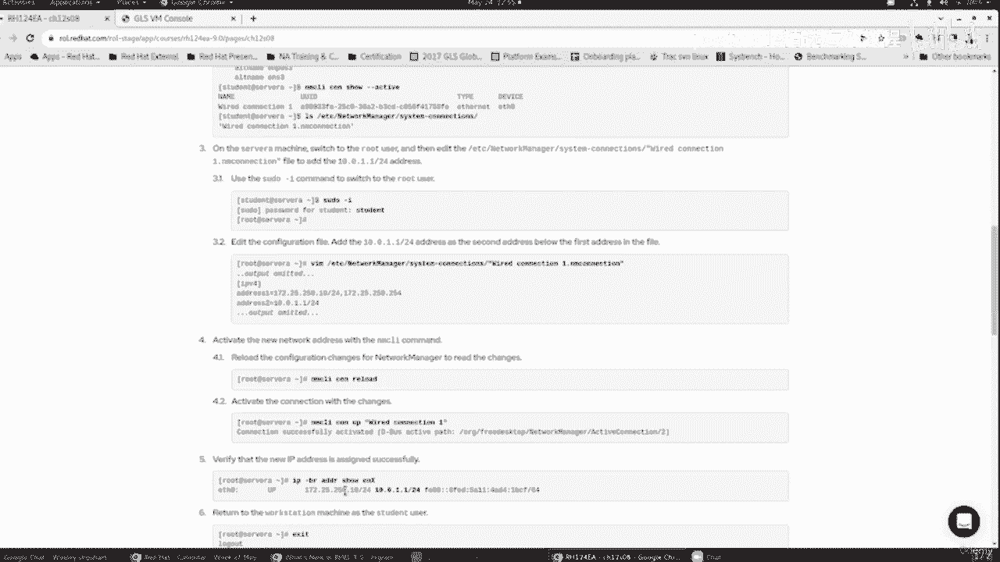
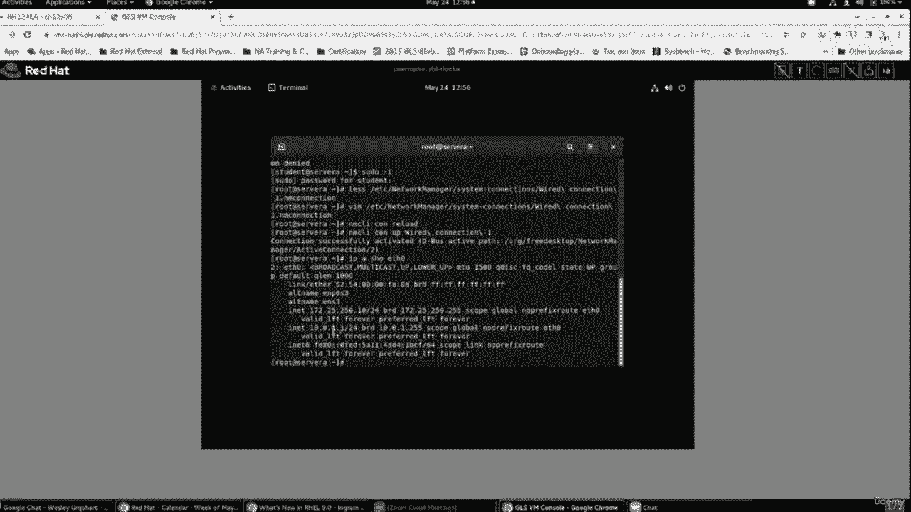
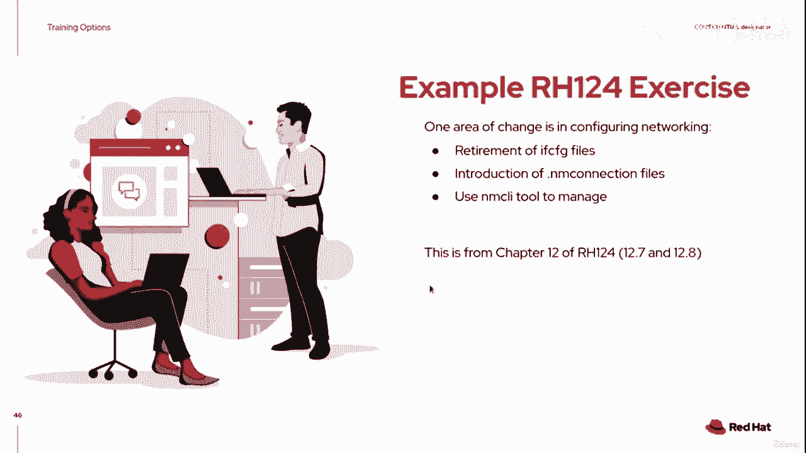
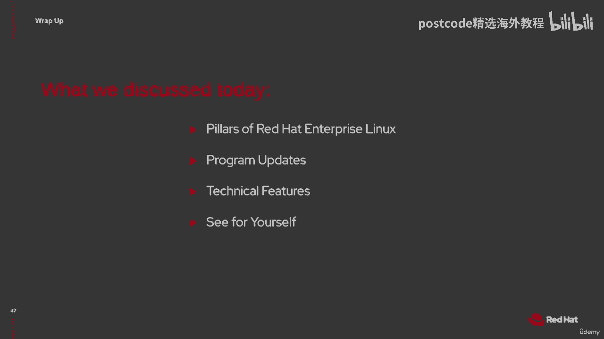

# 红帽企业Linux RHEL 9精通课程 — RHCSA与RHCE 2023认证全指南 - P6：01-01-005 RHCSA changes - 精选海外教程postcode - BV1j64y1j7Zg

并弄清楚铁路线将如何为您服务。由于我是培训和认证团队的一员，您还可以做的是，您可以查看，到我们的 RHEL 9 的 Linux 课程，因此我们更新了我们的基础 Linux 课程，星期。

我不确定该公告是否应该在本次演示之前发布，但它即将到来，这周出来了。我们更新了 RH 24 和 RH 134 的基础部分以反映已发生的变化，在 RHEL 9 中。当然，与此相关的是我们的认证考试。

红帽认证系统管理员，RH CSA。因此，所有这三个都将于本周交付。其他正在更新的课程，我知道这些课程正在开发中，但我无法真正给出日期，开但不应该太远。RH 199，即 RH CSA 快速课程。

是 RH 124 和 RH 134 的组合，参加，这两个课程的十天培训减少到 RH 199 的五天培训。它旨在作为经验丰富的 Linux 管理员的课程，也许正在寻找，那么。

Red Hat 是如何在 Linux 中完成这些事情的呢？或者，您可能是一位经验丰富的 HP UX 管理员，并且您正在转向 Linux。199可能是您合适的选择。另一个是完善我们的红帽认证工程师计划。

RH 294 以及与之相关的相应考试也正在进行中。但让我让您稍微了解一下我们希望在那里实现的目标。我想向您展示 RH 124 中 REL 9 的一个示例。这实际上来自 RH 124 第 12 章。

我将向您展示该课程的第 12、7 和 12、8 部分。REL 9 正在改变的事情之一，我们介绍并警告您这即将到来，回到 RHEL 七。好的。我们大多数人七点都没注意到。第八条规则提醒我们。

这种情况即将发生，但我们中的一些人并没有费心去完成迁移。所发生的事情是您如何配置网络。现在，在 REL 9 中，橡胶已经上路了，我们确实需要退役我们的 CFG 文件。现在我会让你知道。

如果你处于升级状态，你有一个 rel 7 或一个 Rail 8，正在使用配置文件的系统，您可以将该系统升级到 REL 9，它将处理这些配置文件，如果配置文件能够启动并运行网络。但如果您正在进行全新安装。

请不要尝试执行配置文件。我尝试过，但没有成功，但我的升级仍然有效。但在某些时候你会想要做出改变，更新一些东西，诸如此类的东西。我们确实需要继续前进。随着网络管理器的引入来管理我们的网络。

这一切才真正开始出现，连接。现在我们有了连接与设备的概念，因此引入了 NM 连接，文件。嘿，今天过得怎么样？因此引入NM连接文件来最终取代if cfg文件。现在要管理它。

您可以使用名为 MCI 的命令行工具，这在本章前面已讨论过，12。但我想做的是让你对一些信息有一点了解，可以在书中找到与NM连接文件相关的内容。那么让我继续看看这是否会带来影响。

每个人都可以通过红帽学习订阅看到该书的在线版本吗？乌干达。好的。好的。好的。因此，正如我提到的，这是第 12 条之七。您将在书中看到它正在谈论编辑这些网络连接文件。

所以它谈到了 if config 格式的退役。但当我们往下走时，最棒的事情之一就是这张小桌子，它本质上向我们展示了，zmcl 命令行就是我们在上一节中刚刚教给您的，以及相应的内容。

语法将在 NM 连接文件中。现在，NM 连接文件的设计与您可能使用过的任何文件非常相似，在其他平台上。所以它被分成几个部分。有一个 IPV 四个部分，然后每个部分中都有键值对。因此。

如果我们希望静态配置 IPV 4 地址，我们可以指定 IPV 4，方法等于手动，而在下一行中，方法等于自动，这就是我们正在配置的地方，它会查找 DHCP 服务器。因此，所有这些不同的方法。

所有这些不同的键值对都在这里标识。它。然后稍后给我们提供了一个示例，说明该连接文件可能是什么样子。因此，我们看到一个示例，其中连接定义或部分标识了中的一些元素，一般的。在 IPV 4 下。

该方法已设置为自动，甚至某些识别 MAC 的以太网元素，我们希望这个系统具有的地址。对文件进行更改后。我们需要确保权限设置正确，然后运行 ​​MCI 来重新加载。

告诉网络管理员我们已经对其底层的一个文件进行了更改，然后 Zmcl con，up 将显示已编辑的文件。正如我们课程中的许多元素一样。谈论一场关于我们希望看到你做什么的讲座。当然。

还有加强联系、指导性锻炼。所以这个指导练习告诉我要完成并进入工作站计算机，使用实验室，命令去准备东西。好的。因此，在工作站计算机上，使用 SSH 命令登录服务器 A，让我有另一个选项卡。

这里。这里是虚拟机控制台。您可以看到我已经打开了工作站终端。我已经运行了实验启动命令，但它要我做的下一件事是通过 SSH 连接到服务器。

A 所以我已经这样做了。我以学生身份登录。它让我调查一些有关系统的事情。那么，我有哪些接口？当前正在使用哪些连接，该连接是否存在？

那么让我们看一下。我可以运行 IP 链接，并且看到我的以太网连接在此处命名。目前已定义预计到达时间为零。它有备用名称和 P 零、s 3 和 NS 3，只是指代该设备的其他方式。

但 IP 链接显示了该设备信息。然后它要我做一个。让我们看看它是否活跃。我们看到我们有一个活动连接。请注意右侧，它链接到设备 ETA 零。因此，我可以继续执行 FC 网络管理器系统连接的 LHS。一。

我忘记目录了，是的。哦，系统破折号。我正在做一个点。哦，好吧，我们开始吧。在这里，我看到有线连接文件。如果我看一下那个文件。我不能。唔。所以伪减去 I。成为被允许访问该文件的人。

在这里我可以看到里面的元素，连接信息，以太网，IPV四信息。我们可以看到它是静态分配的。我们可以看到一些 IPV 6 的东西，但我们没有使用它们。

那。那之后你想让我做什么练习呢？它要求我编辑该连接文件，然后添加一行以为其提供辅助 IP 地址。

十个011。所以。我将继续编辑该文件。我会来到一号地址下方。我将添加地址。您会在该地址上注意到它是 IP 地址。我只有一个 IP 地址，其中一个地址有一个逗号，它看起来像另一个地址，网关。

即连接到该网络的路由器。然后我们在那里看到 DNS 是一条单独的线。所以我做出了这样的改变。我们将继续保存它。现在，您可能还记得，当我编辑文件时，我必须运行几个命令来激活该文件。

改变。好吧，让我回顾一下指导练习，看看它的建议是什么。我已经进行了编辑。是的，我需要进行一次 con 重新加载，然后我进行一次 con up，然后我可以继续看看有什么。

IP地址已被应用。因此，MCI con 重新加载和 MCI con 有线连接一我们看到它已被激活。如果我查看每个 h 0 的地址，我会看到原始地址 1 7225 2 5010 和。

我看到我的新地址 10 011。

现在这个练习让我们继续前进并建立相应的相同网络，第二个系统上的 IP 地址。然后我们可以在两者之间进行 ping 操作，以确认该地址确实有效，因为对，现在我真的没有办法测试这个。

但是当你回来时你可以做这些，系统。这是我们可以在课堂上继续做的一些事情的例子。

那么我们今天讨论了什么？我们讨论了 RedHat Enterprise Linux 的支柱。

