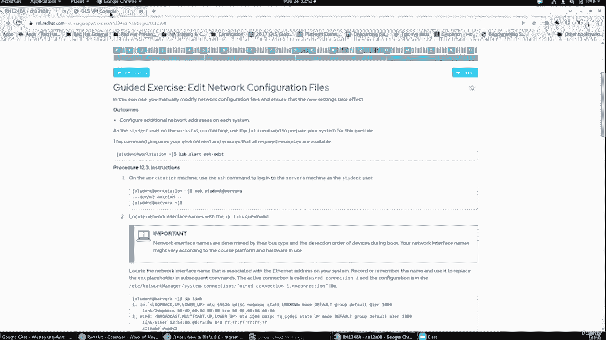
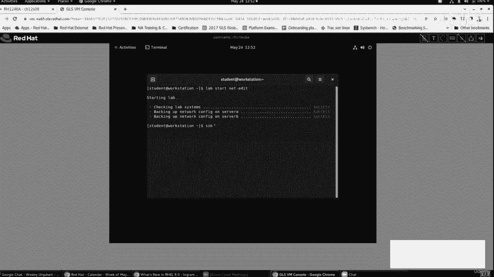
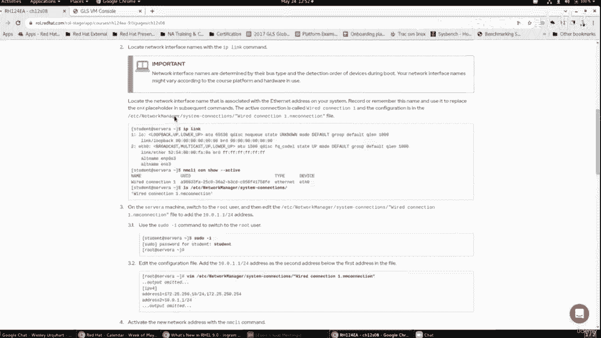
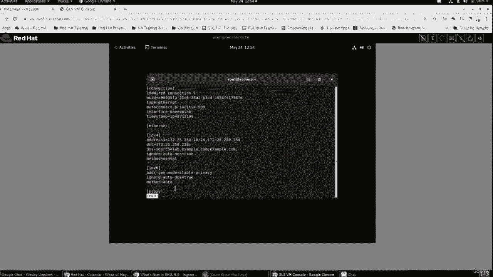
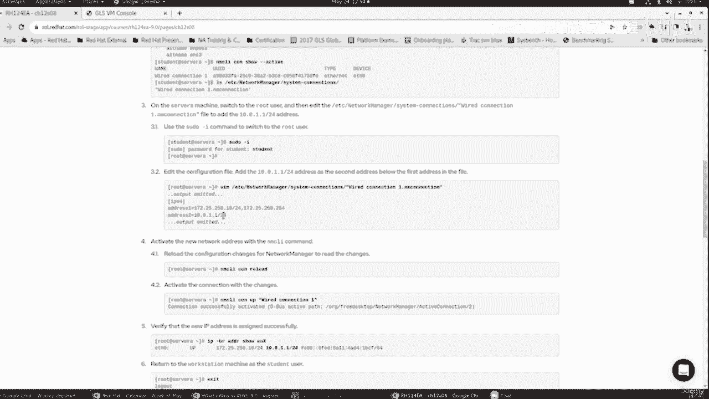
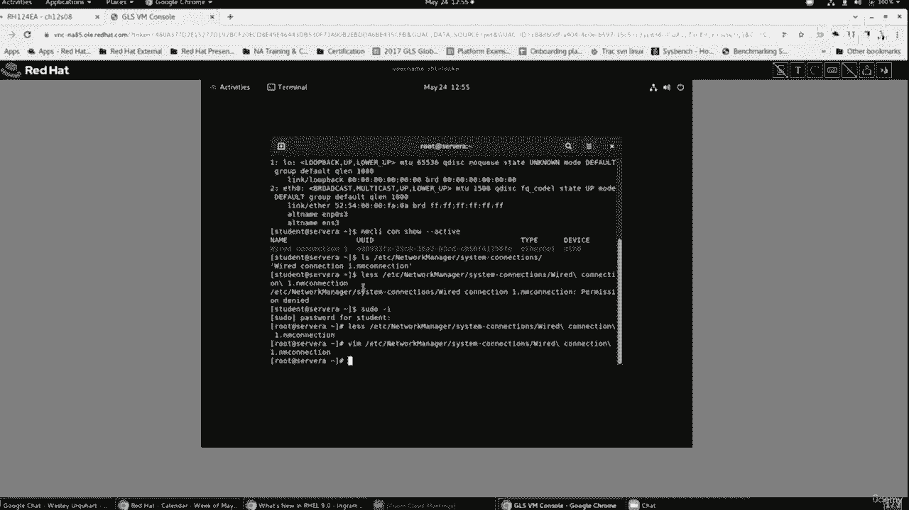
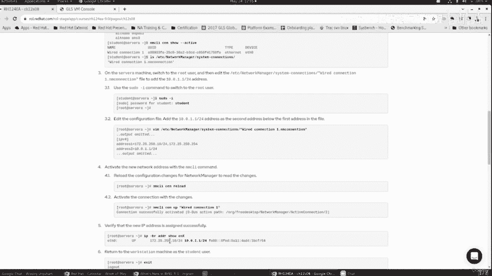
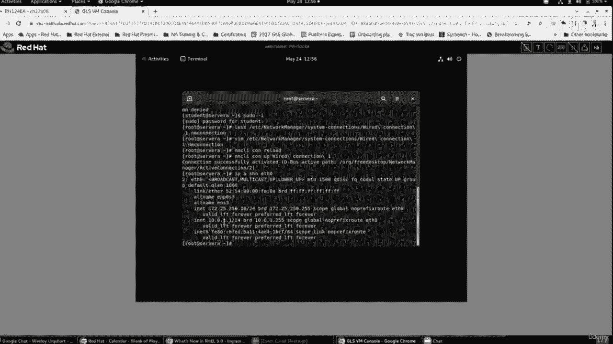
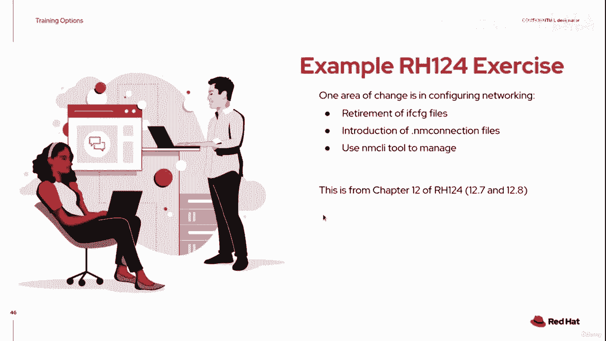
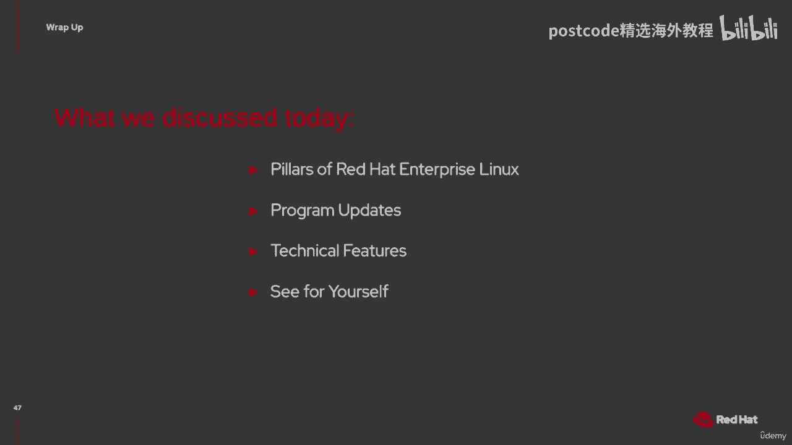

# 红帽企业Linux RHEL 9精通课程：P6：01-01-005 RHCSA 变化

在本节中，我们将了解红帽企业Linux 9（RHEL 9）中与RHCSA认证相关的一些重要变化。我们将重点关注网络配置方式的更新，这是从RHEL 7和8升级到RHEL 9时需要特别注意的一个关键领域。

## 课程与认证更新概述

红帽培训和认证团队已经更新了相关课程以反映RHEL 9的变化。基础Linux课程RH124和RH134已更新。相应的红帽认证系统管理员（RHCSA）考试也已更新。这些更新均在本周发布。

此外，其他课程也在更新中。RH199是RH124和RH134的组合，是为经验丰富的系统管理员（例如从其他Unix系统转向Linux的管理员）设计的快速课程。红帽认证工程师（RHCE）相关的RH294课程及考试也在更新中。

## RHEL 9网络配置的重大变化

上一节我们介绍了课程更新的整体情况，本节中我们来看看RHEL 9引入的一个具体且重要的变化：网络配置方式的演进。

从RHEL 7开始，红帽就预告将逐步淘汰传统的`ifcfg`网络配置文件。在RHEL 8中，这一提醒被重申。现在，在RHEL 9中，这一变化正式生效，`ifcfg`文件需要被退役。

**核心概念**：RHEL 9使用`NetworkManager`及其关联的`NM连接文件`来管理网络，取代了传统的`ifcfg`文件。

*   **升级场景**：如果您从RHEL 7或8升级到RHEL 9，且系统正在使用`ifcfg`文件，升级过程会处理这些文件，网络可以继续运行。
*   **全新安装**：在RHEL 9的全新安装中，不应再尝试使用`ifcfg`文件进行配置。

## 理解NM连接文件

随着`NetworkManager`的引入，我们开始使用“连接”和“设备”的概念来管理网络。`NM连接文件`最终取代了`ifcfg`文件。

您可以使用命令行工具`nmcli`来管理这些连接。`NM连接文件`的结构与许多其他平台的配置文件相似。

**文件结构示例**：
文件被分成多个部分（section），每个部分内包含键值对（key-value pairs）。



```ini
[connection]
id=wired-connection-1
type=ethernet



[ipv4]
method=manual
addresses=192.168.1.10/24,10.0.0.11/24
gateway=192.168.1.1
dns=8.8.8.8



[ipv6]
method=auto
```

*   在`[ipv4]`部分，`method=manual`表示静态配置IP地址，`method=auto`则表示使用DHCP自动获取。
*   您可以指定多个IP地址，用逗号分隔。

修改连接文件后，需要执行两个步骤来激活更改：
1.  运行 `nmcli connection reload` 命令，通知`NetworkManager`重新加载配置文件。
2.  运行 `nmcli connection up <连接名>` 命令，激活修改后的连接。





## 实践练习：编辑NM连接文件

以下是课程中的一个指导性练习，演示如何编辑`NM连接文件`并添加一个辅助IP地址。



**练习目标**：登录服务器，检查现有网络连接，并为其添加一个额外的IP地址。



**操作步骤**：
1.  使用SSH登录到目标服务器（例如`servera`）。
2.  使用 `ip link` 命令查看网络接口。例如，可能会看到名为`eth0`的接口。
3.  使用 `nmcli connection show` 命令查看活动的连接及其关联的设备。
4.  连接配置文件通常位于`/etc/NetworkManager/system-connections/`目录下。使用 `ls` 命令查看，例如看到一个名为`wired-connection-1.nmconnection`的文件。
5.  使用具有适当权限的文本编辑器（如`sudo vim`）查看并编辑该文件。
6.  在`[ipv4]`部分的`addresses`键后，添加新的IP地址（例如`10.0.0.11/24`），与原有地址用逗号分隔。
    *修改前*: `addresses=192.168.1.10/24`
    *修改后*: `addresses=192.168.1.10/24,10.0.0.11/24`
7.  保存文件。
8.  运行 `sudo nmcli connection reload` 重新加载配置。
9.  运行 `sudo nmcli connection up wired-connection-1` 激活更改。
10. 使用 `ip addr show eth0` 命令验证新的IP地址（`10.0.0.11`）是否已成功配置。



完成此操作后，您可以在另一台服务器上配置同网段的IP地址，并通过`ping`命令测试连通性，以确认网络配置生效。



## 总结



本节课中我们一起学习了RHEL 9中与RHCSA相关的重要变化。我们了解到红帽已更新了RH124、RH134等基础课程及RHCSA考试以适配RHEL 9。我们重点探讨了网络配置从传统的`ifcfg`文件向`NetworkManager`的`NM连接文件`的转变，并通过一个实践练习掌握了如何编辑和激活这些新的连接文件。理解并掌握这些新方法是成功通过RHEL 9环境下的RHCSA认证的关键。