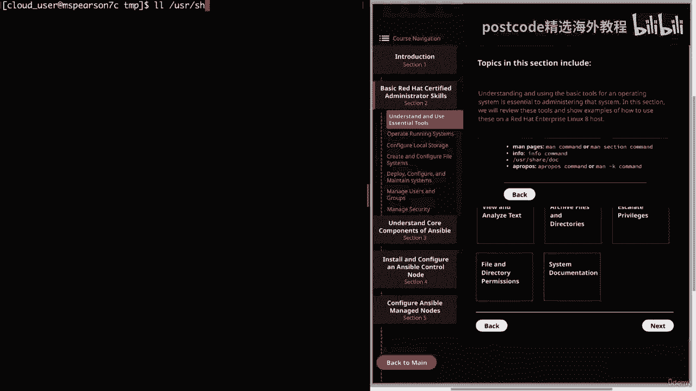

# 红帽企业Linux RHEL 9精通课程 — RHCSA与RHCE 2023认证全指南 - P7：02-02-001 Understand and use essentials tools - 精选海外教程postcode - BV1j64y1j7Zg

该视频将从第二部分开始，这是基本的红帽认证管理员技能。这只是对一些预期任务和职责的简要回顾，红帽认证系统管理员。请记住，每个 RHC 都应该具备 HSA 的技能和知识。现在你可以参加 RHC 考试。

但即使你通过了，也不会被授予，直到，您已获得 HSA。这在很大程度上是因为 RHC 中的所有材料都将建立在该材料的基础上，来自 HSA。很大一部分目标与 Ansible 相关，它将允许您实现自动化。

许多常见的行政任务。但为了实现自动化，您需要了解手动流程。

因此，让我们继续前进，我们可以转到我们的图表并单击第二部分。

这将带我们进入第 2。1 节，即理解和使用基本工具。

因此，为了扩展我在介绍中所说的内容，理解和使用操作的基本工具。

系统对于管理该系统至关重要。因此，在本节中，我们将回顾这些工具并展示如何在 Red Hat 上使用它们的示例，企业Linux 八．，因此，您需要做的第一件事就是使用 SSH 登录远程服务器，因为您。

可以管理您无法登录的主机。简单说明一下，每个红色方框都会有一个主题，然后发出以下命令。

与他们有联系。因此，我们需要做的就是单击该主题，这将显示更多信息。

因此，为了登录远程服务器，我们需要做的就是使用 SH 和我们的用户名。然后在我们要登录的主机上。出于本视频的目的。

我在 Cloud Playground 中创建了一台 Red Hat Enterprise Linux 8 主机，仅使用一台设备。因此，如果您想继续操作并测试这些命令，请继续并暂停视频，然后您就可以。

可以花掉。请记住，对于发行版，请选择 Red Hat Enterprise Linux 8。我将转到命令行，然后我们需要做的就是运行 SH，然后运行名称，我们的用户，这将是云下划线用户应用程序。

我只需粘贴我的 IP 地址，然后按 Enter 键即可。继续并提供密码。正如您所看到的，我们已登录到主机。现在，您可以与 SH 一起使用一些附加标志，但我不打算详细讨论这些，对于这个视频示例。

但请随意奔跑，伙计。搜索更多信息。好的。现在我们已经登录了，让我们继续进入下一个主题，即创建文件，和目录。

所以我们就回到图表上来。这是我的用户主目录。因此，让我们继续使用 mkdir 创建一个新目录，我们将其命名为 test。

因此，如果我在这里列出，您可以看到我的测试目录。

所以我们要将目录更改为 test。然后我们将创建一个文件。

我将向您展示如何执行此操作的第一种方法是只需键入 touch。然后我们要进行一项测试。

因此，如果我们再做一个列表，我们会看到有一个名为 Test one 的文件。您还可以通过简单地使用文本编辑器然后指定新文件的名称来创建文件。

所以我将使用 VI，我们将这称为测试二。

正如您所看到的，它将打开一个新文件，然后您可以添加文本。

这是一个新文件。

在学校里，想做什么就做什么。然后你可以使用 WQ 保存它。

如果我们再做一个列表，我们会看到我们有两个文件。

为了删除该文件，我们只需输入 rme，然后输入文件名即可。

测试一号。正如您所看到的，该文件不再存在。

然后要删除该目录，我们只需返回一个即可。

所以我们回到了家庭云用户。我们看到我们的测试目录。

因此，为了消除这种情况，我们有几个选择。我们可以使用我们的。

但正如您所看到的，它不是一个空目录。因此，当我们尝试运行它时，最终会出现错误。所以我们需要做的是使用递归标志运行它们。然后指定我们的目录。我们再次列出，我们看到我们的测试目录不再存在。

因此，让我们继续清理我们的目录，然后我们可以继续下一个主题，即输入。

和输出重定向。

首先我们有标准输出，这将是您将在屏幕上看到的输出。因此，当您像我们刚才那样运行列表时，它会将该列表的结果打印到标准输出。然后，如果需要，我们可以使用重定向将该输出重定向到文件中，甚至可以使用另一个命令。

通过使用大于号。所以让我们继续快速尝试一下。所以我要对 var log 做一个快速的 LZ dash al 。我们看到这个目录中有大量不同的文件。因此，让我们继续将该输出重定向到文件中。

所以我们将调用该日志文件。

好的。现在我们看到我们有了日志文件。让我们继续打开它。您会看到 LZ dash 命令的输出已放入文件中。与标准输出非常相似，我们有标准错误。唯一的区别是它会打印错误。假设我尝试列出一个不存在的目录。

因此，我们将其称为不存在，然后我们看到一条错误消息，指出没有这样的文件或目录。

然后我们制定了标准，在该标准中，我们将允许输入数据，而不是输出数据。作为一个例子，我们可以使用 sort 命令。这将使我们进入排序提示，然后我们可以输入数据，然后排序。

对我们的数据进行排序。所以我们就这么做吧。约翰。干的好。莎莉。亚当。马特然后我只需点击控制 RD 即可关闭，您会看到它按字母顺序对我的名字进行排序。然后我们可以使用标准重定向来将数据输入排序。

因此，我们将输入 sort，然后继续向其提供我们的日志文件。

您会看到数据不再按文件名的字母顺序排列，但事实确实如此，实际上将转到它在线路上看到的第一件事，在本例中将是，权限，它将以这种方式排序。然后我们甚至可以在同一行中使用输入和输出。因此。

让我们继续再次运行我们的剑，我们将从日志文件中输入数据，并且，然后我们将其输出到一个新文件中，我们将其称为日志排序。

然后我们可以对文件进行猫处理。

现在我们看到保存排序命令的输出。然后我想向您展示如何重定向标准错误。因此，让我们继续在此处不存在的目录上运行 LZ Dash L，然后我们将，重定向那个。使用两个然后大于两个的文件。

我们将其称为目录错误。好的。所以我们在屏幕上没有得到任何输出。因此，让我们继续投射我们亲爱的错误文件，我们看到它捕获了我们的错误。好的。我想向您展示的关于输入输出重定向的最后一件事是管道。

您可以在此处获取一个命令的输出，然后将其输入到另一个命令中。

因此，让我们继续查看我们的日志排序文件。然后我们将把它的输出通过管道传送到“grip”中，这将允许我们搜索。

一个字符串。我只是要去寻找克朗。我们看到只有一个条目与 Krone 有关。我们还可以用它来搜索其他东西。

让我们看看读取、写入、执行的内容。我们看到有几个条目具有 RW X。

因此，这只是一个简单的示例，说明如何使用管道来获取输出。

命令并将其放入另一个命令中。但当您管理 Linux 系统时，这非常有用。好的。现在我们要结束这个，然后我们将继续查看和分析文本。所以，再次回到命令行。其中一些最终会显得有点多余。

因为我在一些示例中做到了这一点，已经。但为了更彻底，让我们快速讨论一下这个问题。因此，为了查看和分析文本，您始终可以使用文本编辑器之类的工具，这将，如果安装了 VI 或 Nano 或 Vim。

我目前没有这个系统，否则我会使用它们，这是增强的。六．，但无论如何，您始终可以使用文本编辑器打开文件。这将允许我们查看文本，然后我们还可以使用以下命令搜索文件中的内容，削减。

您可以使用 VI 做很多不同的事情。但这只是向您展示如何查看文件。您还可以使用像 Less 这样的程序，它不允许您编辑文件，而只能查看，它。然后，正如我们已经看到的。

您可以使用 cat 将文件内容打印到标准输出。

所以我们已经看到了。然后您可以使用夹点来打印与您提供的特定图案相匹配的线条。

所以我们先说 grep，然后说 samba。

我们将查看日志文件，grep 将返回与我们提供的字符串匹配的任何行。请记住，您还可以将正则表达式与 grep 一起使用来搜索特定的。

文件中的东西。

为了说明这一点，我可以执行 grep，然后执行单引号，然后我们会说 samba。

然后添加我的美元符号。所以我要查找以 samba 结尾的任何行，然后指定我们的文件名，即 log。

文件。我们看到该行是 return 并且它是唯一以 samba 结尾的行。同样的道理，我们也可以搜索任何以 Let&#39；s just use RW X 开头的行。

在同一文件中搜索。我们看到每一个石灰，从干燥开始，都被归还。好吧，它将完成理解和使用基本工具的第一部分。让我们继续并将其标记为完成，然后我们可以继续第二部分。

因此，对于本主题，我们将使用 tar 命令来归档和压缩文件，目录。并且有多种不同的压缩选项，例如 GZIP 和 V、ZIP 或 Z 以及其他。因此，为了创建存档，我们将运行 tar 命令。

然后运行 ​​Dash、CVS、，XF，然后是我们的存档的名称，然后是我们想要放入该存档中的文件。因此，实际上让我们知道我们将创建存档，然后 Dash V 会说，使用详细选项，这将为我们提供更多信息。

然后，Dash Z 选项是我们告诉 TAR 实际上使用 GZIP 进行压缩的地方，但是，例如，我们还可以使用破折号 J 来表示 B zip。然后 Dash F 将允许我们指定存档的名称，并随意查看。

TAR 的所有选项的主页，因为有几个。假设我们想要创建日志文件的压缩存档。因此，为了做到这一点，我们将使用 TR 命令，然后使用 CVS。F 然后是我们的存档名称，我们将把日志调用到 Z。

然后我们可以指定，我们创建的日志文件。所以我们看到我们有日志文件。然后我们还对日志进行排序。

让我们继续进行列表，我们会看到我们有日志、TDS 存档。

然后，如果我们想提取我们的存档，只需将 CD 放入 temp，然后运行 ​​tar dash x， f，然后，我们的 tar 文件的路径，它将是家庭云用户，然后是日志。

我们在临时目录中看到了两个文件。或者，您也可以指定大写 C，这样您就可以输入您要查找的目录的路径。想要将您的档案存档到。所以这是值得牢记的好事情。好的。接下来，我们将讨论升级权限。为了执行特权任务。

您需要以 root 用户身份登录或运行，代表 root 用户执行命令。所以要成为root用户，我们可以简单地使用pseudo dash AI或pseudo dash。请记住。

通常不建议假设 root 用户，而是运行命令，通过伪作为 root 用户。当谈到伪时，你会听到人们说伪或伪。老实说，没关系。这真的是你喜欢的任何东西。我只是更喜欢说pseudo。

但是使用pseudo 而不是仅仅成为root 用户来运行命令，将作为额外的安全措施，防止您意外地以 root 身份运行命令，还允许您有机会锁定根用户，以便外部参与者无法获得访问权限，到那个帐户。

为了说明这一点，我将在 Etsy 目录中创建一个文件。因此，我将接触 Etsy，然后我们将调用此测试文件。正如您作为云用户看到的那样，我的权限被拒绝。让我们继续列出 Etsy 上的权限。

我们看到唯一对该目录拥有正确权限的用户是 root 用户。因此，如果我们想使用云用户创建文件，我们只需要返回到原始命令，然后我们可以运行伪触摸etsy测试文件。然后它会要求我们提供云用户的密码。

并且您必须正确输入该密码。

就这样吧。因此，让我们快速列出一下以确保我们的文件在那里。

我们看到我们能够使用pseudo 创建我们的文件。

请记住，这是您需要在伪中为特定用户设置的权限。

文件。我将在稍后的视频中向您展示如何执行此操作。

那么让我们继续并关闭它，我们可以转到倒数第二个主题，即文件和目录，权限。首先你看到的是改变所有权。这是通过电话、命令或电话来完成的。并且使用该命令时，可以只更改用户，也可以更改组中的用户。

正如这里使用冒号所看到的。您也可以使用 C group 或 group 命令更改组。然后我们来到 C mod 命令，或者正如我想说的，有时命令，这将允许，我们更改文件或目录的权限。

当使用此命令更改权限时，您可以使用数字模式或符号模式，模式。在数字模式下，权限由将使用的三位八进制数表示，037。如果您指定我们将在刚刚讨论的特殊权限，则这也可以是四位数，一分钟。然后。

如果您使用符号模式，则权限将由字符表示。所以第一个命令，七，六，四，将为用户读取，写入，执行，然后，读取该组的权限，然后读取所有其他用户的权限。然后在第二个示例中，我使用符号模式来添加读、写权限。

只给用户。最后，我们有特殊的权限。就像标准的常规权限一样，这也可以用于数字模式或符号模式。当使用数字时，数字将出现在用户组其他权限之前。所以我们有这个模七、六、四，我们将在七之前写下您要指定的位置。

特殊权限。首先我们设置了UID，这个权限将允许正在执行的文件被执行，拥有业主的特权。因此，这样的一个示例是您希望由 root 用户执行的命令，但您希望，允许主机上的所有用户都能够运行它。

所以如果你使用set UID权限，只要用户对文件执行过，它仍然会执行，以 root 用户身份运行。接下来我们有设置 ID，当在目录上设置此位时，该目录中创建的所有文件，将继承该目录的组所有权。最后。

我们还有粘性部分。并且设置后，只有 root 用户、目录所有者和文件所有者可以删除，目录中的文件。因此，即使您对文件拥有正确的权限，如果您不是 root 用户并且不是所有者，的文件或目录。

您无法删除该文件。好的。现在我们的最后一个主题是系统文档。因此，作为系统管理员，您可以使用的最好的工具之一就是系统文档。因此，作为系统管理员，您可以使用的最强大的工具之一就是能够，查看系统文档。

原因是记住所有不同的命令确实很困难，可供您使用，以及他们的所有选项，并从记忆中回忆起来。因此，熟悉本文档非常重要，尤其是手册页之类的内容。你将会经常使用它们。我将快速向您展示一个示例。

它将是 man C mod 或 mod。正如您在这里看到的，它将为您提供名称以及命令语法的一些概要，就是要看一下，还有描述。然后，如果您进一步向下滚动，您将看到一个选项部分。

这将向您展示可用于命令的所有不同标志和参数。正如您可以想象的那样，这将非常有帮助，不仅对于考试，而且对于，只是日常管理。因此，除了人工页面之外，您还可以使用 info 命令。这将为您提供一些额外的信息。

很多时候只使用手册页。它将满足您的大部分需求，但如果您需要更多信息，也可以使用它。然后我们还有用户共享文档。

该目录将包含许多不同系统级程序的文档。因此，请随意仔细阅读并检查其中是否有您特别需要了解的内容。知道它就在那里也很好，以防万一您需要它。最后我要提到的是 apropos 命令。噢，伙计。好的。

因为有时候你。您知道命令必须处理什么，但不记得命令的确切名称。因此，您可以使用 apropos 或 man K 来搜索该命令。因此，为了使用它，您实际上需要确保安装了手册页的软件包。

所以我会很快地做到这一点，这样我就可以很快地向你展示这个，因为我认为这是，一个非常方便的工具。因此，进行伪安装，然后我们将执行 man dash 页面。因此，即使我们有手册页，我们也可以查看它们。

man dash page 包提供了一些实用程序，例如 apropos，因此我们需要，安装它才能使用它。

好的。现在已经安装好了，让我们继续清理它。假设我们想要找到一个命令，并且我们知道它与权限有关，但我们想不出它是什么，这是。

所以在这种情况下，我们可以先运行a​​propos，然后再perm。这将拉出任何具有烫发或许可的内容。因此，正如您所看到的，我们有 Mod 命令以及其他在，标题或命令。好了，最后一个主题结束了。

这将结束我们关于基本工具的课程。