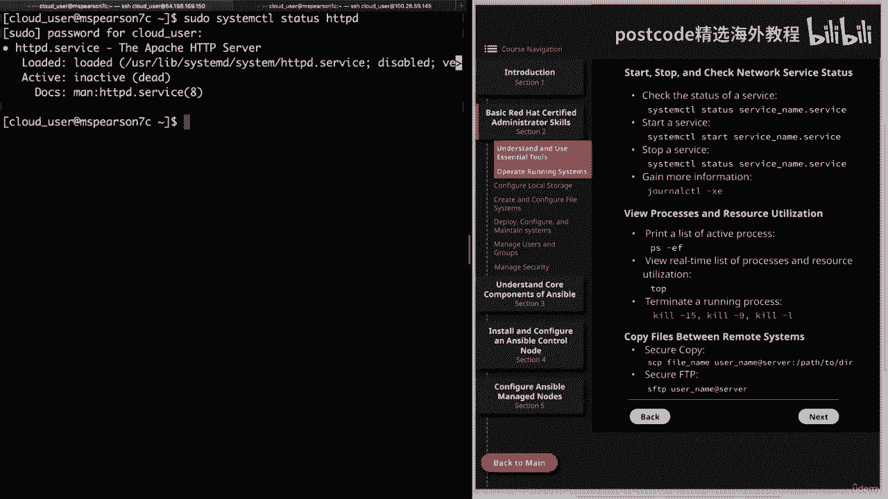
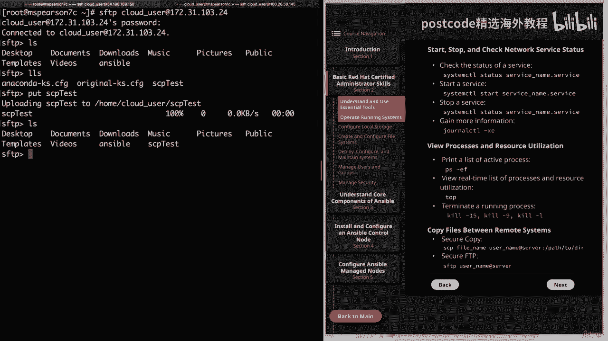

# 红帽企业Linux RHEL 9精通课程 — RHCSA与RHCE 2023认证全指南 - P8：02-02-002 Operating running system - 精选海外教程postcode - BV1j64y1j7Zg

这是红帽认证管理员基本技能部分的继续。

因此，让我们继续单击第二部分，然后操作正在运行的系统。因此，我们需要讨论的第一件事是关闭和重新启动系统。如果您曾经在这方面工作过，或者甚至只是拥有自己的个人计算机，那么这是很常见的知识。

正常关闭或重新启动系统很重要，而不仅仅是拔掉插头，或关闭开关，因为这可能会导致某些正在运行的进程出现问题。因此，要关闭系统，您只需输入系统 CTL，关闭电源，或者如果您想重新启动它。

您可以重新启动 sys CTL。有关更多信息，您可以随时键入 sys CTL help 或 man system CTL 来查看不同的选项，是。但这几乎是关闭或重新启动服务器的基础知识。请记住。

您需要使用伪或假设 root 才能运行这些命令。我想快速记录一下 Red Hat 的早期版本。因此，在过去，您只需运行“关闭电源”或“重新启动”，因此您不会添加 sys CTL 前缀。

但现在我们有了系统 CTL，应该在运行命令之前添加它。下一个主题是中断启动过程以更改 root 密码以获得访问权限，到一个系统。这非常重要，因为有时您需要访问您正在使用的系统，拒之门外。

正如我们在讨论 SSH 时所说，您无法管理您无权访问的系统，到。因此，首先您需要按 E 编辑内核启动参数。因此，当屏幕首次加载时，您将看到 E 列表，这样您就会移动到最后。然后您可以删除行崩溃。

然后添加 RDP 中断，然后强制执行等于 0。然后你可以按control x 启动系统。进入命令行后，您需要重新安装系统的根目录。这是通过输入 Mount Dash 来完成的。哦。

然后提供重新挂载和读取的选项。正确的。这将位于囊肿根目录中。重新挂载目录后，您可以使用 FF、Root 或 taproot 切换到该目录，然后，您将可以将其作为特殊的根目录进行交互。因此。

一旦进入该目录，您只需执行一次即可重置 root 密码。完成后，您就重置了密码，这就是您的目标。所以现在您只需要通过创建自动重新标记文件来启用 SELinux 重新标记。最后，您可以退出 shell。

好吧，现在让我们进入下一页，然后我们可以按顺序进入命令行，使用这些服务。所以在观看此视频之前，我已经安装了 HTTP 服务器。

那么让我们继续检查一下它的状态。我将运行伪 sys CTL。地位。HTTP DD。输入错误。现在您可以在此处添加 DOT 服务，但如果将其留空，则该命令将假定，DOT 服务。所以我将继续并将其留空。

输入我们的密码。我们看到该服务已加载，但当前处于非活动状态。因此，让我们继续清除此处的屏幕，然后我们就可以启动服务了。

现在，在我们这样做之前，我将继续切换到 root 用户，因为我们要。

正在执行一些特权命令。那么我们就和我一起做吧。

然后我会把它弄清楚。那么让我们继续启动 HTTP。我们将输入 system CTL，启动 http PD。好的。现在我们可以再次运行我们的状态。我们看到我们的服务现在已激活并正在运行。问退出。

然后如果我们想关闭服务或停止它，我们可以执行 sys ctl stop。然后再次是服务的名称。然后如果我们再次运行我们的状态。我们可以看到服务已经停止了。现在让我们继续获取更多信息。

我们将使用日志 CTL 来做到这一点。

我们还将添加破折号 X 和破折号 E 标志。

因此，添加破折号 X 将从消息目录中添加解释性文本，然后 E 将采用，你直接到目录的末尾。因此，如果您当前正在处理某件事并且遇到问题，那么该信息是最重要的，可能会在目录的末尾。因此。

让我们继续输入日记帐 CTL，然后输入 Dash XY。正如您所看到的，它将其放入文本查看器中。如果我们向上滚动到这里，我们就会看到。当我们发出关闭 HTTP 服务的命令时。它为我们提供了一些相关信息。

如果继续向上滚动，您将看到更多信息。当我们启动时我们可能会看到。就在那里。但如果您正在解决服务问题或者您只是需要，以获得更多信息。因此，让我们继续并点击队列退出，然后我们将清除屏幕。在我们继续之前。

让我们继续并再次启动该服务，然后我们将启用，它。因此，为了启动它，我们知道它将是系统启动。那么让我们继续了解一下状态。这样就开始了，然后我们可以继续运行我们的启用。您会看到，当我们启用此服务时。

它将在 ETSI 系统 DX 中创建一个 Simulink，系统多用户目标希望它指向此用户库系统、dx 系统、http dx 服务。您始终可以在此处复制此内容。我们只是做一个列表。

并且您可以看到系统DH创建的所有链接。我们希望能够列出我们的一四马力柴油机，我们看到它就在那里。然后如果我们运行禁用。我们看到 Simulink 已被删除。因此，如果我们尝试再次列出它。

就会说没有这样的文件或目录。好的。因此，让我们继续并重新启用它，然后我们就可以清除屏幕了。好的。所以接下来要讨论的是查看进程和资源利用率。我觉得我一直在说一切都很重要，你需要知道这一点。

从很多方面来说这是事实。但这对于至少对主机上的问题进行故障排除来说是非常重要的。如果您遇到资源利用问题并追踪导致该问题的进程，这是您需要具备的一项非常基本的技能。因此，让我们继续打印出活动进程的列表。

然后我们就可以做到这一点。您还可以使用 SOX。现在，正如您所看到的，这将打印出大量不同的正在运行的进程。所以我们使用达世币。这基本上就是说列出所有进程，然后 Dash F 将列出完整的格式列表。

所以它将为我们提供一些额外的信息列。那么让我们继续澄清这一点。因此，知道如何打印所有过程固然很好，但能够通过管道传输也很重要，信息转化为诸如点滴之类的东西，这样你就可以真正利用它。因此。

我们将继续执行此操作，然后为用户 Apache 执行 grep 操作，结果是，将向我们展示以该用户身份运行的所有进程，该用户将运行我们的，HTTP 服务器。

但请记住，这只是当时正在运行的内容的快速快照。

但如果你想要实时或者至少更实时，我认为 top 每 2 秒更新一次。

可以使用top命令。那么让我们继续运行它。因此，每隔几秒钟，这个进程列表就会更新一次。

因此，它将向您显示哪些进程正在运行，哪些进程消耗最多，CPU 和内存。

它还会让您了解平均负载以及正在运行的进程总数。跑步。因此，这里有很多动态更新的好信息。您还可以通过一些不同的方式使用 top 进行过滤。例如，我可以只输入“您”并搜索特定用户。

所以我想寻找 Apache 用户。所以它只显示 Apache 用户。然后我会继续并退出。很快，我只想再向您展示一次顶部。我们也可以输入 H 来寻求帮助。因此，这将向您展示一些可以执行的操作。

以以下方式过滤或查看顶部：

最适合您和您需要的。我要退出并控制 C，然后我们就可以清除屏幕了。接下来我们要讨论终止正在运行的进程。再说一次，这非常重要。如果您需要终止一个未正常关闭的进程，或者您只是遇到了某个恶意程序。

你需要杀掉PID。正如您所猜到的，我们将使用kill 命令来做到这一点。因此，如果您想获取可以使用的不同信号的列表，只需输入 Kill，达什·L。它会向您显示您可以执行的所有不同信号的列表。一般来说。

大多数人最终都会使用两种方法，即被杀死 15 或，杀死九个，这将是 sig term，然后是 sig Kill。因此，病态术语将尝试让进程自行正常终止。但是，如果由于某种原因这不起作用。

那么您通常想要使用它来防止任何，问题的发生。但如果这不起作用，那么你可以使用kill 9或kill dash 9，这将发送，病态杀死，这将立即终止进程。无话可问。因此，如果我们很快再做一次列表。

只需 grep Apache 即可。正如您所看到的，第一列将是用户名。请记住，这里有一些包装，所以不要对此感到困惑。

每一个都是一个新行，后面跟着进程 ID 以及父进程。

进程ID。

因此，让我们继续杀死该进程的进程 ID。3299 真快。

我将使用kill dash 15。事实上，让我们继续做九个。让我们积极进攻吧。

然后我们要指定 PID，即 32、99。

繁荣。好的。现在让我们再次运行我们的列表。

我们看到进程ID为3299，它不再运行了，但实际上，另一个进程正在运行。

启动了，这是因为这个父进程 3295 正在运行。

所以如果我们想杀掉子进程，就需要杀掉父进程。那么让我们继续杀死那个 PID。这次我们将使用 Dash 15，因为我们想要更正常地关闭，时间。所以将会是 32、95。好吧，我们看看它是否已经关闭了。

我们看到它已成功关闭。因此，让我们继续清理屏幕，然后我们可以继续讨论最后一个主题，即，在远程系统之间复制文件。我们要谈论的第一件事是安全复制或 SEP。这将成为您复制远程文件的基本手段。

它超级快速、简单，使用 SSH 协议，因此非常安全。您还可以使用破折号 r 选项来递归复制文件和目录。所以现在我在路由主目录中。密码，我们这里有几个文件，但我将继续讨论 SEP 测试文件。

那么我们要怎么称呼它呢。我们已经把它放在这里了。我将把它复制到我的 MZ Pearson one C 服务器上。让我们继续获取 IP 地址。

好的。让我们继续进行私人演讲。然后清除这个，然后我们就可以睡觉了，这将是 SAP 测试文件，我要去，以云用户身份执行此操作。它将前往 MZ Pearson One c。复制它，然后将其放入临时目录中。

所以继续并点击此处输入。那我们就接受这个。我需要为云用户提供密码，如您所见，文件已复制。但为了验证这一点，让我们继续回到我们的第二个主机。

清除这个，然后我将在我们的临时目录中列出一个列表。

我们在顶部看到 SAP 测试。那么接下来我要讲的是FTP和安全FTP。我绝对推荐使用安全 FTP over FTP，因为 FTP 默认情况下不会加密您的数据。但要使用 SFTP，您只需输入 SFTP。

然后输入用户名，然后输入您要使用的服务器。想要复制到。让我们继续清除这个，然后我们将返回到原来的服务器，我只需输入，SFTP，然后使用我们的 IP 地址进行云用户。我需要给出密码。正如您所看到的。

它让我进入了这个 SFTP 提示符。你会注意到这个桌面文档，下载，所有这些目录都在这个目录下，实际上在云用户主目录下。所以LZ和LZ的区别就是LZ只是在你已经在的服务器上做一个列表，连接到。

然后LZ准备在本地上市。正如你所看到的，它在我的路由目录中包含 anaconda cfg 和我们的 skp 测试文件，所以你可以看到我可以在两者上查看文件。所以让我们继续奔跑吧。放置然后啜饮测试。

如您所见，它正在上传 SEP 测试。我不确定我之前是怎么说的，但是对家庭云用户进行 SEP 测试，然后当然是。

文件。然后我们可以通过 LHS 进行远程列表，我们会看到我们的文件，这几乎总结了，SFTP。

当然，您还可以使用许多其他选项，但请随意查看相关的手册页，获得更多信息，但这将完成本节关于运行操作的课程。

系统。因此，让我们继续并将其标记为完成，然后我们可以继续下一部分。

有关该内容的手册页可获取更多信息，但这将是本课程的结束。

在操作系统上。

