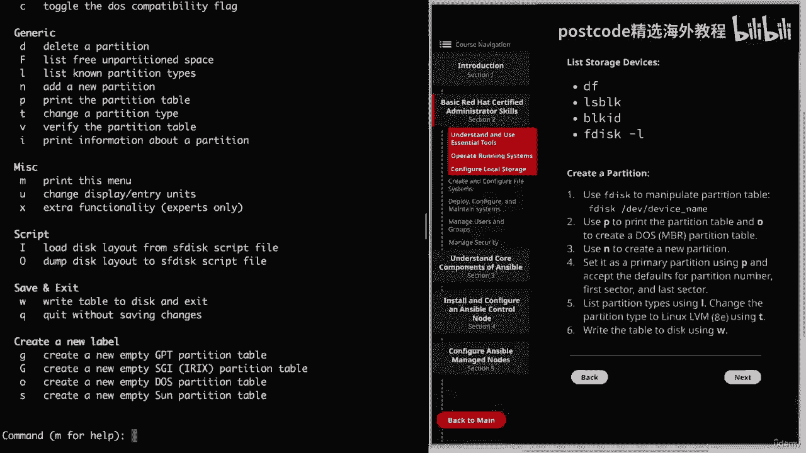

# 红帽企业Linux RHEL 9精通课程 — RHCSA与RHCE 2023认证全指南 - P9：02-02-003 Configure Local Storage - 精选海外教程postcode - BV1j64y1j7Zg

我们将继续回顾我们的 TSA 基本技能并讨论在本地配置存储，主持人。因此，让我们继续单击第二部分。

然后我们将进入 2。3，即配置本地存储，然后我将转到，到命令行，我们将通过一些不同的命令来获取信息，关于我们的主机以及不同设备上的存储。因此，我想向您展示的第一个命令是 DF。

我们将使用破折号标志来实现人类可读。

这实际上只是向我们显示当前可用的磁盘空间量，挂载的文件系统。我们看到 VMS 0 和 1p2 中的该设备已安装在我们的路由目录中。当我们继续前进并挂载文件系统时。

我们将看到这些文件系统通过 DF 命令显示。

下一个命令是LZ Blk。

这将向我们展示我们的块设备以及我们的分区及其它们的列表。

尺寸。所以你会看到在类型下你将拥有磁盘。如果它是一个分区，你就会有一部分。它还将为您提供一些有关安装点的信息。

那么接下来我们要讲的是黑ID或者黑ID。

这将为我们提供块设备的 UID 以及一些附加信息。所以你可以看到第一个文件系统是 ZFS，然后它会向我们展示我们的，分区并注意该类型是 DOS。这让我们知道这是一个 MBR 分区表，这很重要。

因为您真的可以，如果您认为自己正在使用 MBR 表，但实际上使用的是 GPT 表，那就会把事情搞砸了。因此，在 R 中，您可以使用 F 磁盘，但使用 GPT 3，您将需要使用磁盘，或原谅。

我要向您展示的最后一件事就是 f desc dash l 命令。所以，如果我能输入的话，我们将执行 f desc。然后我们将进入 dev 目录，这是一个我们不会列出所有内容的列表，在我们所有的设备中。

我们将使用 NVM 设备。这实际上是一个暂停并告诉你的好点，如果你正在跟进，我已经添加了，通过 Cloud Playground 提供额外的磁盘。

因此您所需要做的就是前往 Cloud Playground，然后单击您的服务器，然后您可以单击左下角的操作按钮，然后就可以一一添加dev nvm了。因此，如果您还没有这样做，请继续暂停视频。

然后添加它没有，需要很长时间。您必须重新启动服务或任何其他操作，或者重新启动服务器或其他任何操作，然后我们才能继续。不管怎样，我这里有几台设备，我将使用一台和一台 Nvme。

所以我们将继续完成它。这只是给我们一些信息。

当然，它会告诉我们我们的设备名称，以及有多少空间。

你看，有 2 GB，但它也会告诉我们以字节为单位以及有多少个扇区，我们有。我要指出的另一件事是我以 root 用户身份登录。因此，您可能想要这样做，因为我们只是快速运行其中一些命令来显示它。

当您使用这些命令时，您也可以使用pseudo，但这当然取决于您。我这样做只是为了在我们浏览材料时方便起见。

但无论如何，让我们继续前进，我们可以在 nvme 一台和一台设备上创建一个分区。

所以我要澄清这一点。所以我们只需输入 F 盘即可。然后是我们设备的路径。我们的设备名称是 Nvme 一和一。

它将向我们发送欢迎消息，并让我们知道我们的设备不包含可识别的。

分区表。所以这是我们必须添加的内容。

在我们这样做之前，我将快速向您展示您可以输入 M 寻求帮助，那就是，将向您展示您可以执行的所有各种选项。

因此，在底部，您会看到创建一个新标签，并且该选项将创建一个新的空 dos。

分区表，这将为我们提供 MBR 分区表。

那么让我们继续输入它。当我们使用磁盘标识符创建一个新的 DOS 磁盘标签时，我们可以按 P 来打印它。

它将为我们提供有关磁盘、有多少空间以及磁盘标签的信息，类型和我们的磁盘标识符。现在我们需要创建我们将使用的分区。请愿类型必须是主要的。因此，我们只需按 Enter 键设置默认值，然后再次执行默认值。

这就是其中之一。对于第一个扇区，我们将从头开始，然后使用其余部分，磁盘。所以我们将一直使用默认值直到最后。如果你愿意的话，你可以把它分开。你有磁盘吗，如果你想练习多种不同的，那么还有另一半磁盘，物理卷。

但出于本视频的目的，我们将使用整个磁盘。然后我们需要将分区类型更改为Linux LLVM，即DF使用T，但你也可以，只需键入 L 即可列出不同类型的分区，这将向您展示不同的分区类型。

您可以使用的类型以及我们的代码。正如你所看到的，这里有很多不同的选项，我们将使用 Linux，LLVM，这是一个 E。并且我们将位置类型从默认的Linux更改为Linux LLVM。

现在我们可以继续使用 W 来运行我们的更改。我们看到我们的分区表已被更改。现在让我们继续清除屏幕，然后我们可以进入下一页。我们可以创建一个LLVM逻辑卷。如果记住，如果你想查看该分区。

你可以使用 LSB。K 并且它将一一显示我们在 Nvme 下的分区。

因此，让我们继续使用 PV create 创建物理卷，然后创建分区的路径。

在 VME 1 和 1p1 中。

如果您要列出物理卷，则可以使用 PVS，现在我们需要创建卷，团体。为此，我们将使用 VG Create，然后使用卷组的名称，我将调用。

该测试强调卷。然后我们的物理卷的路径当然是 dev nvm one 和 1p1。然后我们可以使用 VTS 列出这些，与 PVS 非常相似。现在让我们继续使用 LVT Create 创建逻辑卷。

我们将传递 Dash，L 标志，它允许我们指定逻辑卷的大小。

所以我们要为 1 GB 做 1 G，然后破折号，我们可以指定我们的逻辑名称，体积。所以我将其称为测试 LVT，然后我们需要指定卷组，即测试卷。然后要列出我们的逻辑卷，我们可以简单地执行 LVS。

现在让我们继续清除屏幕，我将向您展示如何删除逻辑卷。

作为卷组和物理卷。首先，我们将使用 LRV remove 删除逻辑卷。

然后我们只需要指定卷组和逻辑卷即可。所以记住它是测试卷，然后测试 LV。询问我们是否真的要删除它，我们会继续这样做，然后我们就可以删除，我们的卷组已删除 VG。而这次我们只要指定卷组名称。

就可以测试可测试了。然后，正如您可能已经猜到的，我们可以使用 PV 删除来删除物理卷。

然后是我们物理卷的路径。他赢了。好了，本节关于配置本地存储的课程就到此结束了。

在我们结束之前我想注意一件事，那就是，当然，有很多。

您可以与这些命令一起使用不同的标志，尤其是在创建逻辑卷时。

这只是为了作为您将要创建的一般方式的概述，逻辑卷。请记住，您始终可以使用系统文档（例如需求页面）来查找这些标志，并获得有关每个命令的更多信息。好吧，让我们继续将视频标记为完成，然后我们可以继续下一课。

使用系统文档（例如手册页）查找这些标志并获取更多信息，关于每个命令。

