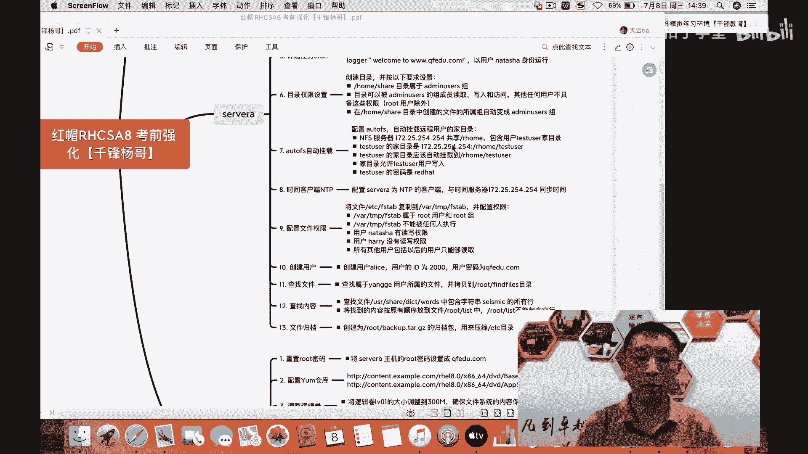
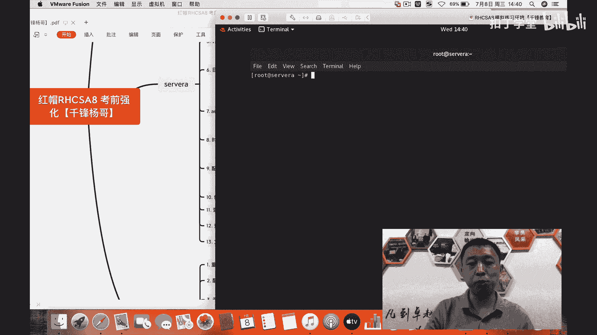
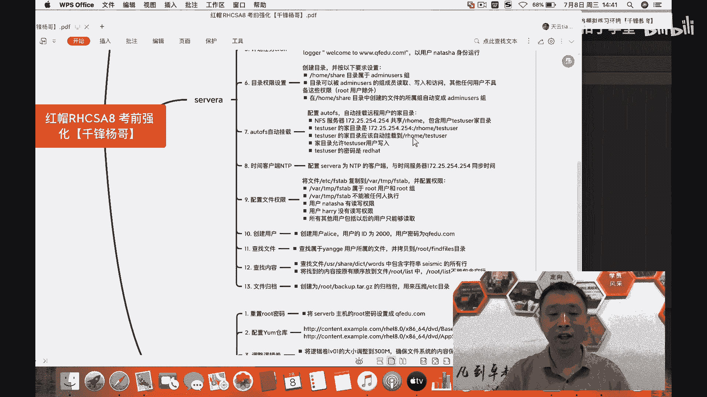
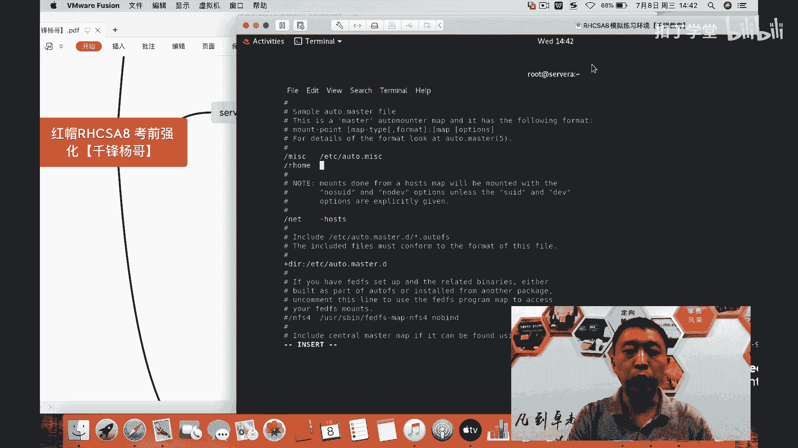
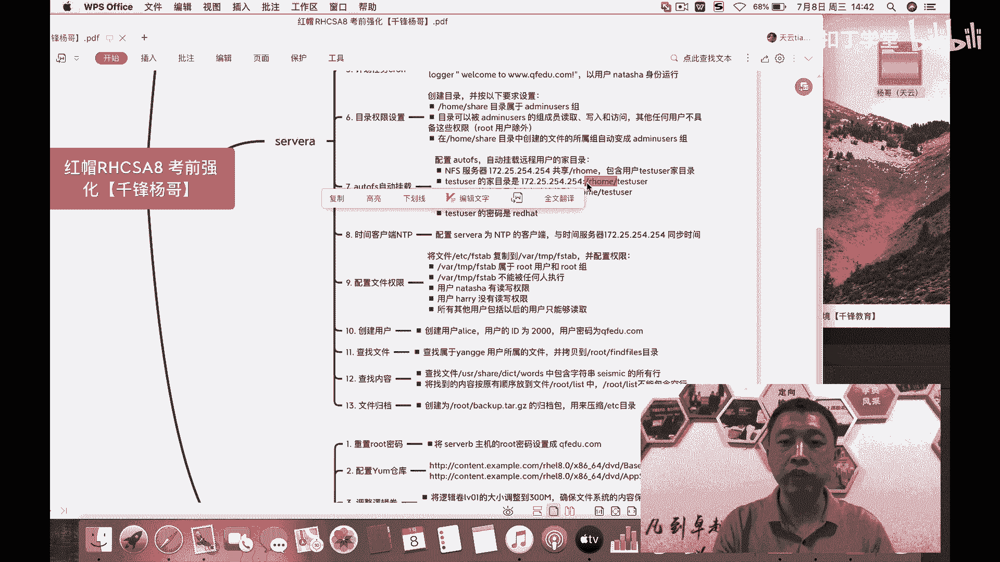
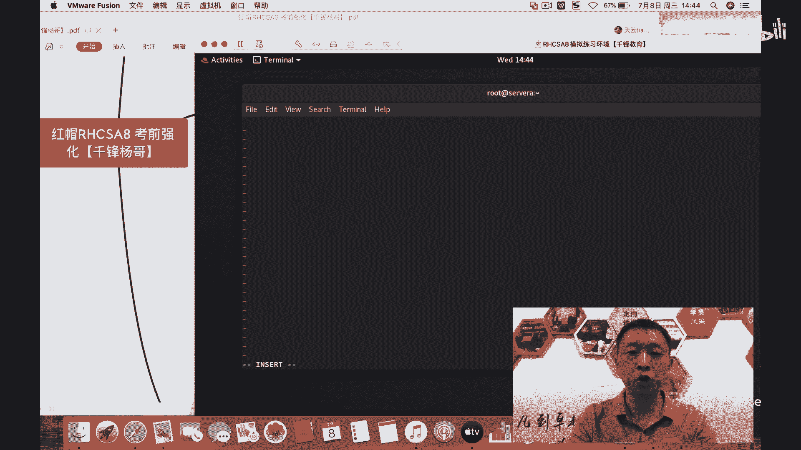
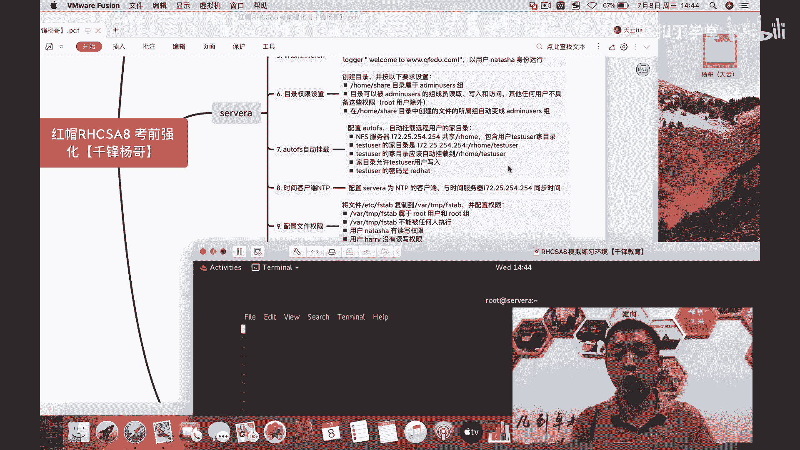
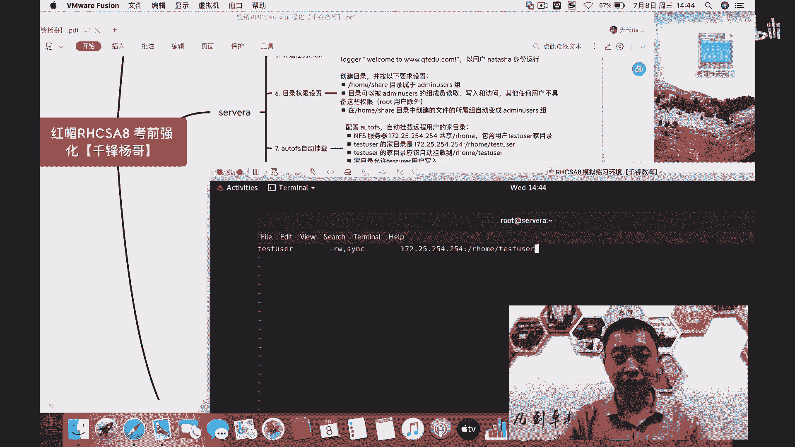
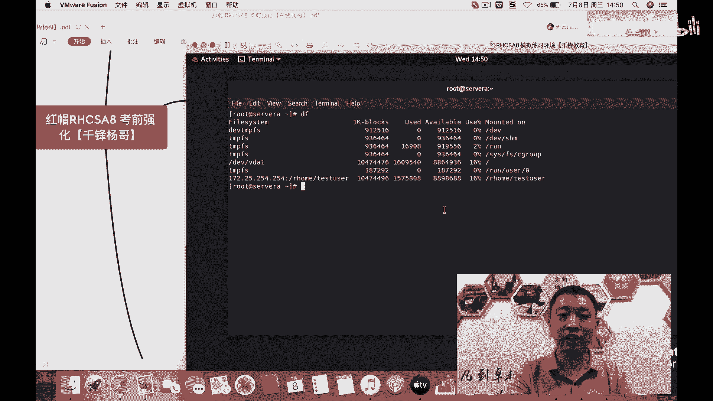

# RHCSA认证课程：第10章：autofs自动挂载配置 🚀

在本节课中，我们将学习如何配置和使用autofs（自动挂载）服务。autofs的核心特点是“按需挂载”，即挂载由访问触发，卸载由超时触发。这对于挂载远程网络共享非常有用，可以节省系统资源和网络带宽。



## 概述

我们将通过一个具体场景来学习：用户`testuser`的家目录位于远程服务器上，我们需要将其自动挂载到本地。目标是实现当用户访问其家目录时，系统自动挂载远程共享；当一段时间不访问后，系统自动卸载。

## 配置步骤详解



上一节我们概述了autofs的作用，本节中我们来看看具体的配置步骤。整个过程主要涉及两个配置文件的编辑。

### 1. 安装autofs服务



首先，确保系统已安装`autofs`软件包。如果未安装，请使用yum进行安装。

```bash
yum install -y autofs
```

### 2. 编辑主配置文件 `/etc/auto.master`

主配置文件用于定义“监视目录”。这个目录本身无需手动创建，autofs服务会管理它。当访问此监视目录下的特定子目录时，将触发挂载。





我们需要添加以下一行：
```
/home/guests  /etc/auto.home
```
*   **`/home/guests`**：这是本地的监视目录。
*   **`/etc/auto.home`**：这是对应的映射配置文件（名称可自定义），其中定义了具体的挂载规则。

### 3. 创建并编辑映射配置文件 `/etc/auto.home`

这个文件是自定义的，用于详细说明在监视目录下访问特定“关键字”时，应如何挂载远程共享。



针对我们的场景，文件内容应为：
```
testuser  -rw,sync  172.25.254.254:/home/guests/testuser
```
*   **`testuser`**：这是“关键字”或挂载点。当用户访问`/home/guests/testuser`时触发挂载。
*   **`-rw,sync`**：挂载选项，表示以读写（rw）和同步（sync）模式挂载。
*   **`172.25.254.254:/home/guests/testuser`**：这是远程NFS共享的路径。



### 4. 启动并启用autofs服务



配置完成后，需要启动autofs服务，并设置为开机自启，以确保监控机制持续运行。

```bash
systemctl restart autofs
systemctl enable autofs
```

## 验证与工作原理

配置完成后，让我们来验证其效果并理解其工作原理。

最初，根目录下不存在`/home/guests`目录。即使启动服务后，该目录被创建，其下也是空的。

```bash
ls /home/guests/
# 此时输出为空
```

当用户（或任何进程）尝试访问定义好的关键字目录时，例如执行`cd /home/guests/testuser`或`su - testuser`，autofs会立即触发挂载操作。

```bash
su - testuser
# 此时会自动挂载远程目录，用户成功进入家目录
ls -la /home/guests/
# 此时会看到 testuser 目录
df -h
# 可以在输出中看到对应的挂载项
```

挂载成功后，用户即可正常访问其位于远程服务器上的家目录。一段时间（默认5分钟）无访问后，autofs会自动卸载该共享。

## 核心概念总结

本节课中我们一起学习了autofs自动挂载服务的配置与管理。关键点总结如下：

1.  **按需挂载**：挂载由访问触发（`/home/guests/testuser`），卸载由超时触发。
2.  **两个核心配置文件**：
    *   **`/etc/auto.master`**：定义监视目录及其对应的映射配置文件。
    *   **`/etc/auto.home`（自定义）**：定义关键字与远程共享路径、挂载选项的映射关系。
3.  **服务管理**：必须启动并启用`autofs`服务。
4.  **适用场景**：特别适合管理远程网络文件系统（如NFS）的挂载，有助于优化资源和网络使用效率。



通过掌握autofs，你可以实现网络共享目录的智能化管理，这是RHCSA认证及日常Linux系统管理中的一项实用技能。