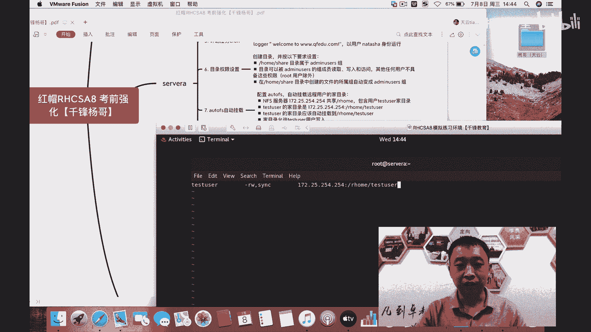

# 红帽认证RHCSA8-autofs自动挂载 - P1：10. 杨哥红帽RHCSA8-autofs自动挂载 - 扣丁学堂 - BV1PA411j7hv

好，亲爱的小伙伴们，大家好，我是杨哥。欢迎各位再次回到我们的课堂。那在前面我们给大家介绍了关于这个RRPCAC前面的几个题的讲解啊。然后我相信大家可能应该没有问题的。那这些题其实我们多练习就可以啊。

也不是很难，但是最关键是在企业当中应用的时候呢，可能更加复杂一些，所以呢我再次强调啊，我们虽然说可能每一个题大家发现就每一个练习啊讲的比较简单，但实际上它的这种企业应用还是比较复杂的。

所以我们一定要去看一下我们就业课程的一些内容。好，那下面呢我们来就是给大家介绍的是第71个auto FS自动挂载。那这个题呢给大家也在之前也提过，也就是我们的用户。

我们当前有一个用户叫test user这个用户。他这个用户的加目录是他不在本地的啊。所以现在如果我们去切换这个用户，大家会发现他没有他的加目录。我们可以先试一下啊。各位啊。

好，这边我们看到有一个叫test user用户，对吧？然后我们如果切换这个用户的加切换这个用户啊SU杠test user这个用户，大家发现它是找不到他的家的，他根本就没有去到他的家里面无家可归啊。

没有找到任何的这个文件或目录，因为他的加目录是在远端是一个共享共享在我们远程的这个啊服务器上面的，远远端服务器各位这边描述的啊，远端服务器呢是172。25。254。254。

它是将这它是将整个这个根下的H home这个目录共享出来了。这个目录里面包含我们这个叫什么test user这个用户的加目录啊，所以我们希望把它挂到本地，挂到哪个地方呢。大家也要看嗯这个应该是很清楚。

一定是挂到我们用户的加自己这边的加目录这样一个位置。

好，所以我们这里面有两个各可以看一下，有两个这个注注意的点，一个是远端的啊这个远端的啊，就是我们的远端共享的共享的这个目录呢是在呃17225。254。254冒号 home下的test user。

这是远端共享的加目录。那我们应该把它挂在哪呢？挂在本地的hho testest user上面去。而且这个加目录是允许用户写入的test user的用户密码呢是re hard。

那这个题呢我们首先要安装的就是auto fS这种自动挂在文件系统啊，然后当用户auto fs呢，它的这种特点是什么呢？既然叫自动挂载，所以我们一直有一个说法，就是挂载是由访问产生的。

而卸载是由超时产生的。也就是说你要是没有访问，大家看一下，在我当前的根下面根本就没有我把屏幕往这边拽一点啊。

大家看到根本就没有一个叫做跟下的RHho这样一个目录，所以呢也就谈不上这个用户的加目录，这边就没有，对不对？好，那怎么做？首先第一步我们要安装的是凹 to FS。嗯。

这个好像我们在前面实验这个亚目的时候已经装过了啊啊，我们假装再装一遍吧。好，那它已经提醒我们呃已经是已经被安装啊，不要害怕，已经被安装，那那怎么做呢？这个非常简单，凹凹 to这个FS呢？

它有两个配置文件，一个是主配置文件叫凹 to点master这个文件，在这个文件里面我们要定义什么啊？各位要定义。呃，根下的RHOME啊，也就是这个远端的目录，远端的这个共享目录啊。

或者说你这么看都可以啊。你把这个目录分成两部分。一部分呢就是前面用户加目录，前面那一部分呢，我们是要写在主配置文件里面的。这个呢我们在江湖当中有一注有有一句俗称叫做什么叫监叫监视目录。

也就是说这个目录也不用你创建，它会有我们的auto mount或者叫auto fS自动帮你去创建啊，但是呢你要告诉他说，哎，兄弟，这个目录你要被要把它监视起来。如果一旦有人去访问这个目录下面的某个目录。

那他就会触发相应的挂载。

那可能呢这边说的有点多哈，我们直接来做一下，然后再一会儿给大家详细再说一下这个这个这个过程吧。后面这个配置文件呢，凹凸点HOME这个文件实际上是我们自定义的啊，是自定义的一个文件。换句话讲。

在这边只是定义两个地两两个点，一个是它的一个监视目录或监控目录。就这个目录呢，它就是被监视的，就像安了个摄像机在这个位置，然后另外一个文件呢是具体怎么挂。

也就是说你具体呢你去访问的这个监视目录下面的某一个关键字才会被触发挂载。好，我们来试一下这个效果啊。然后紧接着呢就编辑我们的凹凸点HOME那补不全，为什么呢？因为这个文件是不存在的。再次强调一遍。

这个文件的名字是自定义的。你可以叫凹凸点杨哥，也可以叫凹凸点天云都可以。只要呢能够找到这个文件就行。好，然后下面呢就是我们。

这一部分各位啊，就是我们那我们将这个目录，我们将这个整个这个目录分成两段，下面上面都可以啊，分成两段。就是最终的最终的那个呃是我们用户的加目录。前面那个是我们的监控目录，我们已经写好了。

下面呢我们要写用户的加目录test user啊，然后挂的时候呢是RW就是它的选项，这个跟本地挂载也是一样，它需要挂载选项，然后SYNC同步，然后呢，挂什么呢？172。25。254点。

254他下的RHO。ME re啊remote home下的test。呃，大家看看我写对没啊，如果没写对的话，挺尴尬的啊。这本来出个镜，还是如果还写错了，就挺尴尬。然后没事啊，这个我们继续。

好，保存好以后。当然这边呢我们给大家看一下这两行啊，给大家看一下这两行，一个是RHOME，也就是在ETC下的叫什么au to点master这个文件。这一行一个是呢这个文件我就ca吧。

因为里面内容呢也就一行au to点啊H home。好，那大家看到这个目录是被监控的，被监控或者监视的。一旦你去访问这个目录下的什么？某一个关键字这个也不存在。现在现在整个根下的这个什么HOME啊。

什么test这不存在。当然我不敢回车，因为一回车的话极有可能触发访问啊，所以先别着急，就总之不存在。然后当你一旦去访问这个这个下面的这个目录。其实就是挂在点啊，它就会将。远端的这个共享文件系统。

以这个选项这些选项两个选项的方式，然后挂到它上面。OK伙伴知道大家大概听明白没有啊？也就是当你去触发访问这个监控目录下的某一个挂载点或者某一个关键字的时候呢，它会触发相应的挂载，挂在什么呢？

是由关键字所对应的那个。远程的那个共享远程的那个文件系统对应的那一行啊，以挂接选项呢也是这个在这行所上面所描述的啊。好，当然我们还要去将au to fS设为开机启动。因为这个这个服务如果不启动。

谁帮你挂载，它就相当于我们的监监视器，或者我们的这个监摄像头你需要把它开启才可以啊。好，然后紧接着呢我们将这个服务呢设为启动。啊，我刚我在前面给大家讲过，很多人喜欢使用star，我喜欢使用restar。

反正是我觉得这也是一样啊，呃，restar大不了先关，我们如果以前没有开，那就没有开呗。好，我们回车好，现在呢我们再看一下，跟下面呢有什么特点啊。跟下面已经帮我们创建了RG home。

但是呢在RG home下面连个鬼都没有，什么都没有风平浪静，什么都没有，各位看到，因为现在虽然说没有，但你小心点，因为这个目录已。被监视啊，但因为这个目录队已经被监视。

如果说你去访问这个目录下的这个关键字或者叫挂载点的话，它就会挂这玩意儿。但是你要访问别的呢，没有用，你要访问别的，比方说你要访问猪猪，那没有那就就是没有看到吗？因为就没有这个东西。

就没有在这个这个监视目录对应的这个挂载文件里面没有什么猪猪的，那那我们去访问那个叫test user。大家知道现在这个行为呢应该会触发对这个。哪个目录啊？

也就是RHH home下的test user这个目录的一个访问。所以大家看一下，各位看到了吗？这个跟刚才不一样了，已经访问成功了。我们再来看一下RHH home下面多了一个test user。

或者说呢我们各位倾下屏啊DF啊，看一下这个这个杠TH吧。我比较喜欢是TH。当你去访问监控目录下的某一个定义好的关键字，它就会将哎对应的那个目录挂过来。好。

那这个时候呢我们用户呢大家看到是已经在这个目录里面呢。它它是一个fiE文件。好，没问题。当然这个文件呢实际上是会写到哪去呢？写到远端的服器上去的。

这就是我们linux里面的auto mount或者叫自动挂载。它具体的进程呢，automount只不过是我们我们叫自动挂载这样一个概念。而它具体的进程叫做auto fS。它需要这个进程开启。

然后同时也需要了监控目录，这个定义好监控目录，以及定义好监控目录所对应的配置文件。而这个配置文件呢，就是具体的一个挂载文件。当你去最后当你去访问监控目录下的某一个挂载点的时候呢，就会触发相应的访问。

那当一段时间比方说我离开这个目录。当一段时间。当这个时间不会说很啊sorry，我怎么又进来了。当离开以后呢，如果我们再近再这个等待，比方说几分钟啊，或者一段时间以后就会超时超时呢，就会将这个目录卸载。

就是回到我刚才杨哥所说的那句话，挂载是由访问产生的。而卸载是由什么超时产生的，这就是我们这个凹 to凹 to fS的一个精妙之处，所以呢这个特别适合挂什么？

有同学说老师那我挂本地的这个本地的这个硬盘要不要这样做呢？嗯，那不要为什么因为本地的硬盘它本身就在你本地你随时挂着没关系，但是远端的文件系统，大家知道它可能是需要不是可能啊。

它是借助于网络介指网络的方式来访问。那不访问呢，我们将它断开，以节省资源，或者说减轻这个网络的一个负载，这个是可以的。好，这就是我们的凹 to fS啊，大家啊不知道掌握没有啊，所以。

这个尽量还是要看一下我们的这个我们的这个叫什么就业课程里面内容啊。好，感谢各位。这就是关于啊我们的auto FS的一个一个讲解。

