# RHCSA精讲教程：2.05：SELinux调试 🔧

在本节课中，我们将学习如何排查和解决与SELinux相关的问题，特别是当它阻止Web服务在非标准端口上运行时。我们将通过一个具体的例子——让HTTPD服务在82端口上运行——来掌握SELinux的调试流程。

## 检查Yum源配置

上一节我们介绍了Yum源的配置，本节中我们来看看如何检查Yum源是否工作正常。

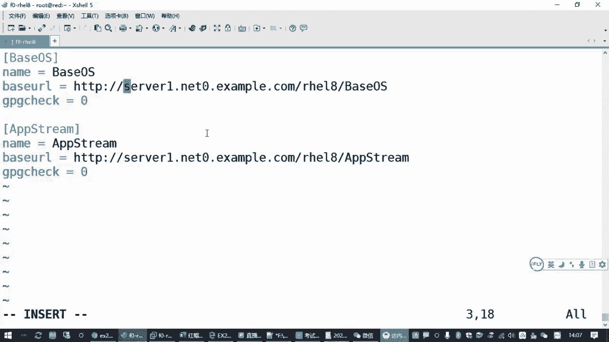

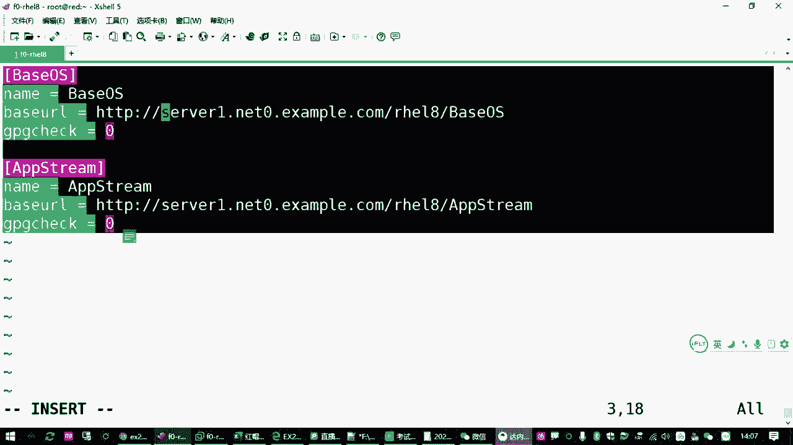

最直接的检查方式是执行 `yum repolist` 命令。如果命令执行成功并列出仓库信息，说明Yum源配置正确。如果配置有误，该命令会报错，例如提示“无法同步缓存”或“找不到源”。

如果你的Yum源无法正常工作，通常有以下三种原因：

1.  **服务器端问题**：提供Yum源的服务器本身不可用（例如，网站未开启）。在考试或标准练习环境中，这种情况较少见。
2.  **客户端网络配置问题**：你的主机（客户端）网络配置不正确，导致无法访问服务器域名或IP。
3.  **Yum配置文件错误**：`/etc/yum.repos.d/` 目录下的 `.repo` 配置文件内容有误。

以下是排查网络配置的常用命令：
*   检查IP地址：`ip address list`
*   检查路由/网关：`ip route` 或 `nmcli`
*   检查DNS配置：`cat /etc/resolv.conf`

如果确认网络无误，问题很可能出在配置文件上。此时，最快捷的排错方法是删除现有配置文件并重新创建。

你可以执行以下命令清空并重建配置：
```bash
rm -f /etc/yum.repos.d/*.repo
```
然后，使用 `vim` 重新创建正确的 `.repo` 文件。注意避免拼写错误、多余空格（特别是方括号 `[]` 内和行首），以及从网页复制时可能带入的不可见字符。

配置完成后，可以尝试清理Yum缓存再测试：
```bash
yum clean all
yum repolist
```

## SELinux基础与问题场景

现在，我们进入本节课的核心——SELinux调试。RHCSA考试中有一道题目要求调试SELinux，以确保Web服务能正常运行。

要解决这道题，你需要掌握两方面知识：
1.  SELinux的排错方法，包括其基本概念、模式切换和策略调整。
2.  简单的Web服务器（HTTPD）配置。

题目场景通常是：系统已预装HTTPD服务，但其配置文件被设置为监听 **82端口**（非标准的80端口）。在SELinux处于强制模式时，这会阻止服务启动。

SELinux（Security-Enhanced Linux）是一套内核级的安全增强机制，为进程和文件添加安全标签并实施访问控制。它有三种运行模式：
*   **enforcing**：强制模式，违反策略的行为将被阻止并记录。
*   **permissive**：宽容模式，仅记录违反策略的行为而不阻止。
*   **disabled**：关闭模式。

查看当前模式：
```bash
getenforce
```
临时切换模式（重启后失效）：
```bash
# 设置为宽容模式
setenforce 0
# 设置为强制模式
setenforce 1
```
永久修改模式需编辑 `/etc/selinux/config` 文件，将 `SELINUX=` 的值改为 `enforcing`、`permissive` 或 `disabled`。

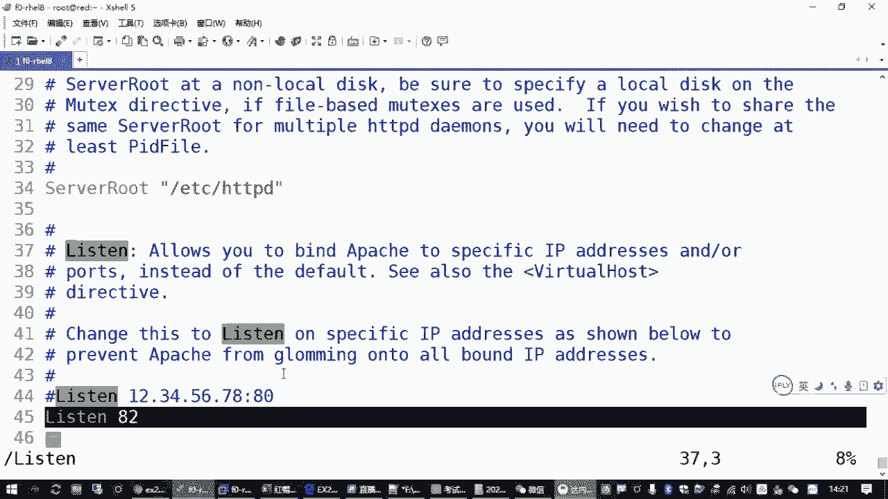

在考试环境中，SELinux默认处于 **enforcing** 模式。因此，尝试启动监听82端口的HTTPD服务会失败：
```bash
systemctl start httpd
# 会收到启动失败的错误信息
```
如果将SELinux临时设为 `permissive` 或 `disabled`，服务则可以启动。但考试要求是在 **SELinux开启** 的情况下解决问题，而非简单地关闭它。

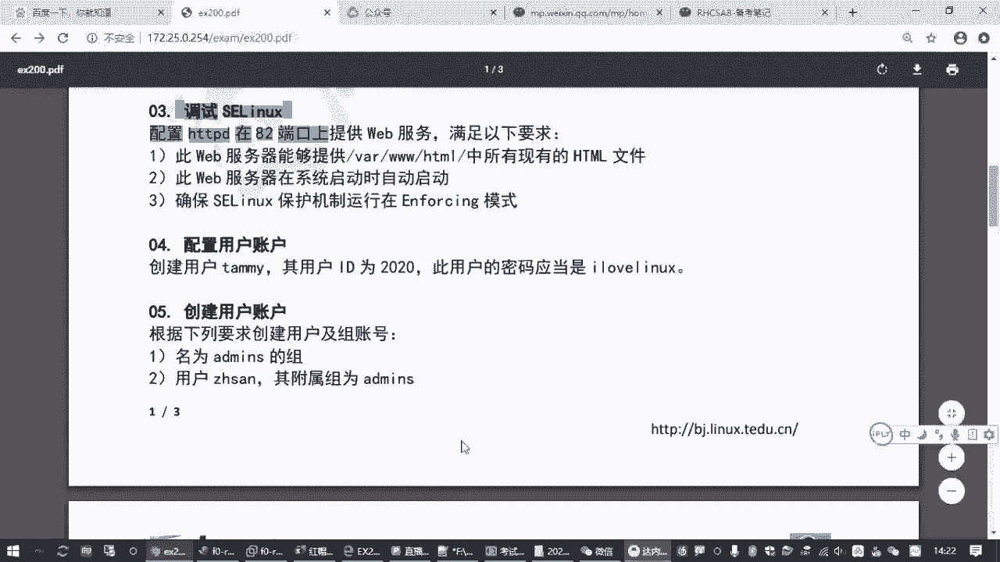

## SELinux排错实战

我们的目标是在SELinux为 `enforcing` 时，让HTTPD服务成功监听82端口并启动。

### 方法一：使用系统日志工具（推荐）

这是最直接的方法。当你启动服务失败后，系统日志会给出明确的修复建议。

1.  尝试启动HTTPD服务（必然会失败）：
    ```bash
    systemctl restart httpd
    ```
2.  查看系统日志，获取具体的修复命令。在RHEL8/CentOS8中，可以使用 `journalctl` 工具：
    ```bash
    journalctl | grep -i “httpd.*82”
    ```
    或者直接查看最新的日志条目：
    ```bash
    journalctl -xe
    ```
3.  在日志输出中，寻找类似这样的建议命令：
    > “If you want to allow httpd to bind to network port 82, you need to modify the port type.”
    > 然后会跟随一条具体的 `semanage` 命令，例如：
    ```bash
    semanage port -a -t http_port_t -p tcp 82
    ```
4.  直接复制并执行日志中给出的这条 `semanage` 命令。这条命令的含义是：向SELinux策略中添加一条规则，允许 `http_port_t` 类型的服务使用TCP协议的82端口。

### 方法二：安装排错工具并分析

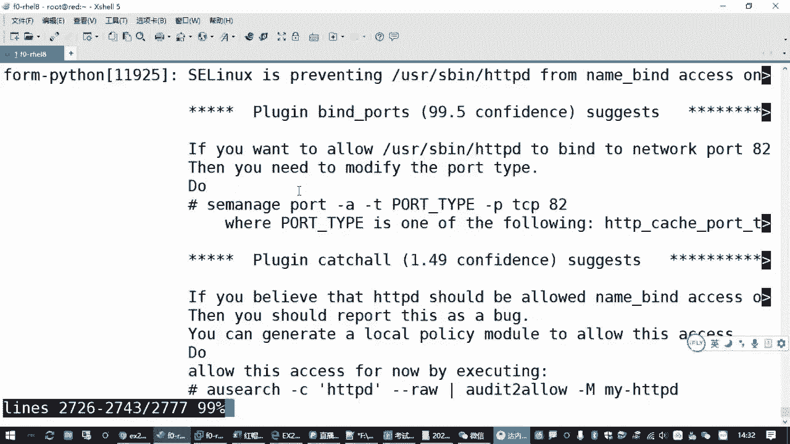

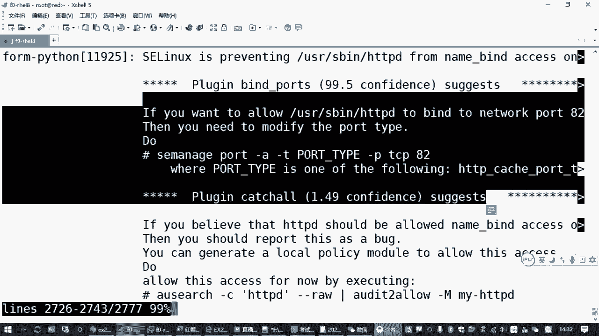

这是一种更标准但稍显复杂的排错流程。

1.  安装SELinux排错工具包：
    ```bash
    yum install -y setroubleshoot
    ```
2.  再次尝试启动HTTPD服务（触发错误记录）：
    ```bash
    systemctl restart httpd
    ```
3.  查看系统日志 `/var/log/messages` 或使用 `sealert` 工具分析错误。日志中会包含一个唯一的警报ID（AUID）。
4.  根据ID查看详细警报和建议：
    ```bash
    sealert -l <警报ID>
    ```
5.  执行警报详情中给出的修复命令（通常也是 `semanage port -a ...`）。

### 验证与端口管理

执行修复命令后，验证服务是否可以启动：
```bash
systemctl start httpd
systemctl status httpd
```
如果启动成功，说明端口策略已添加。

你还可以使用 `semanage` 命令查看当前所有允许的端口策略，确认82端口已加入：
```bash
semanage port -l | grep http_port_t
```
在输出列表中，你应该能看到 `tcp` 协议中包含 `82` 端口。

`semanage port` 命令常用操作：
*   `-a`：添加策略。
*   `-d`：删除策略。
*   `-l`：列出策略。
*   `-t`：指定类型（如 `http_port_t`）。
*   `-p`：指定协议（`tcp` 或 `udp`）。

## 配置Web服务器以列出文件

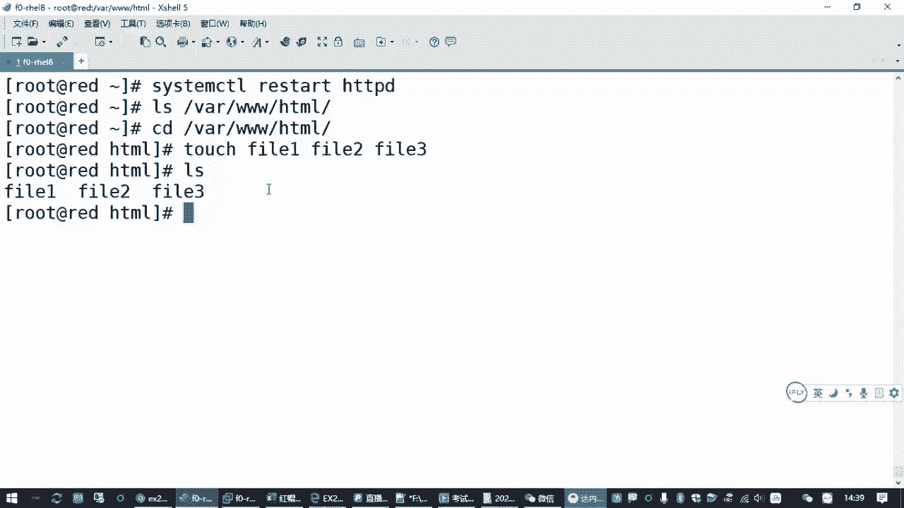

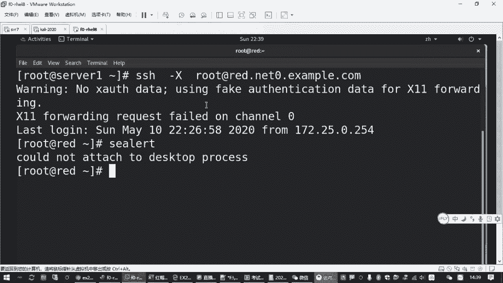

服务启动后，还需确保Web服务器能提供 `/var/www/html/` 目录下所有的现有HTML文件。

1.  首先，**关闭防火墙**或添加规则允许82端口。考试中通常直接关闭防火墙更方便：
    ```bash
    systemctl stop firewalld
    systemctl disable firewalld
    ```
2.  在 `/var/www/html/` 目录下创建几个测试文件：
    ```bash
    cd /var/www/html
    touch file{1..3}.html
    ```
3.  通过浏览器访问 `http://<你的服务器IP>:82`。此时，你很可能只看到Red Hat的默认测试页，而不是文件列表。
4.  这是因为HTTPD配置中包含一个“欢迎页”设置，它会阻止目录列表。需要删除或禁用这个配置：
    ```bash
    rm -f /etc/httpd/conf.d/welcome.conf
    ```
5.  重启HTTPD服务：
    ```bash
    systemctl restart httpd
    ```
6.  再次刷新浏览器，现在应该能看到 `file1.html`, `file2.html`, `file3.html` 的文件列表了。

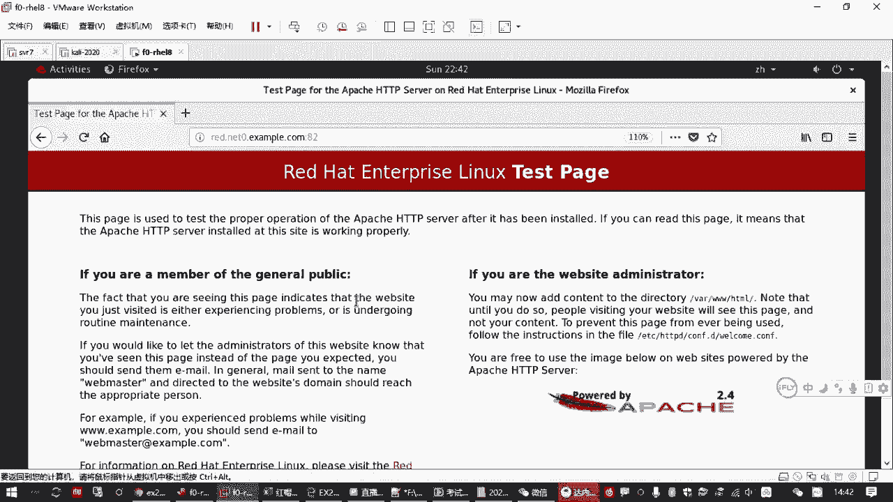

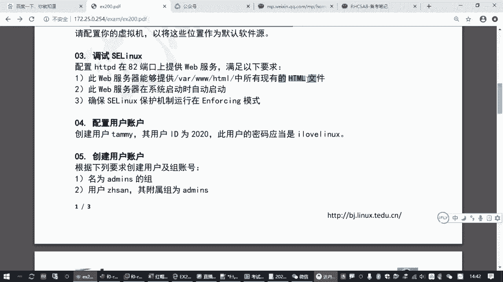

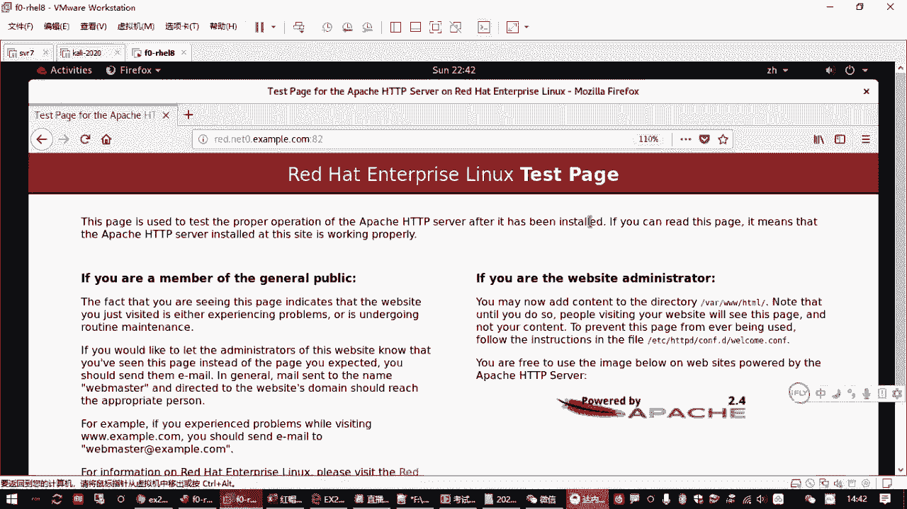

## 完成题目要求

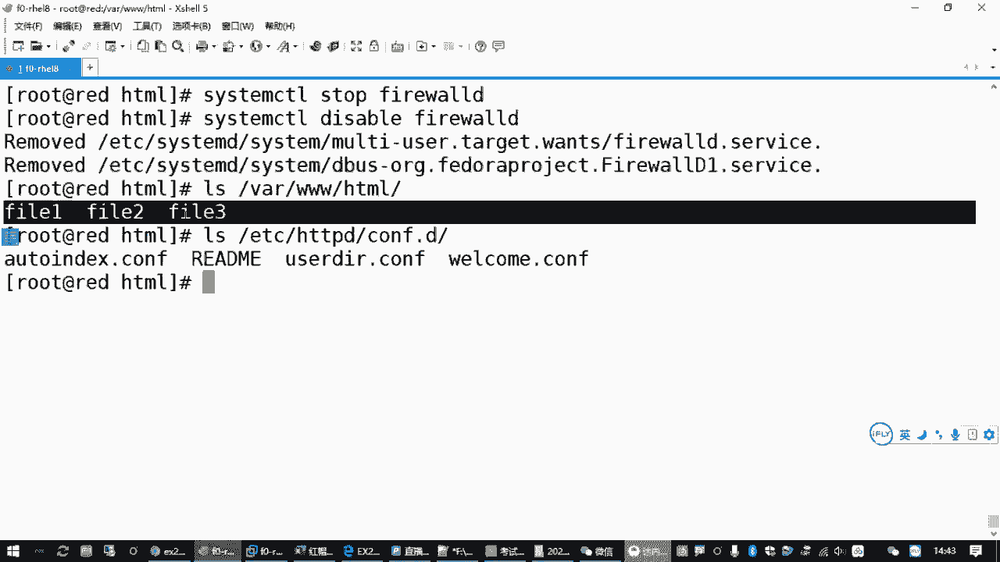

最后，确保所有设置持久生效：
1.  设置HTTPD服务开机自启：
    ```bash
    systemctl enable httpd
    ```
2.  确认SELinux模式为 `enforcing`（通常默认就是）：
    ```bash
    getenforce
    # 如果不是，使用 setenforce 1 临时设置，并编辑 /etc/selinux/config 永久设置。
    ```

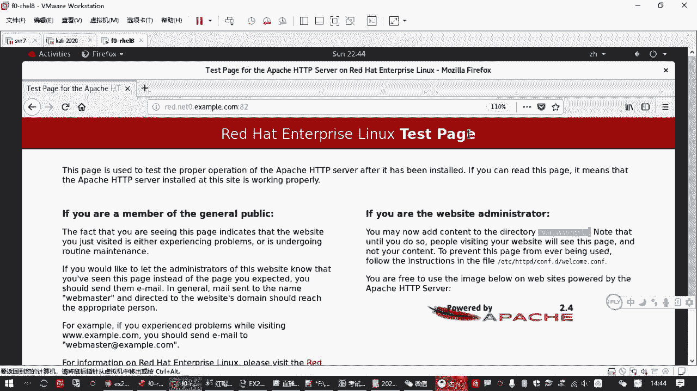

## 总结

本节课中我们一起学习了SELinux的调试方法。核心步骤总结如下：
1.  **定位问题**：在SELinux强制模式下，非标准端口服务启动失败。
2.  **获取方案**：通过 `journalctl` 查看系统日志，获取修复命令。
3.  **执行修复**：使用 `semanage port -a -t http_port_t -p tcp <端口号>` 命令添加端口策略。
4.  **配置服务**：关闭防火墙，移除HTTPD的欢迎页配置，确保能列出目录文件。
5.  **持久化**：启用HTTPD服务开机自启。

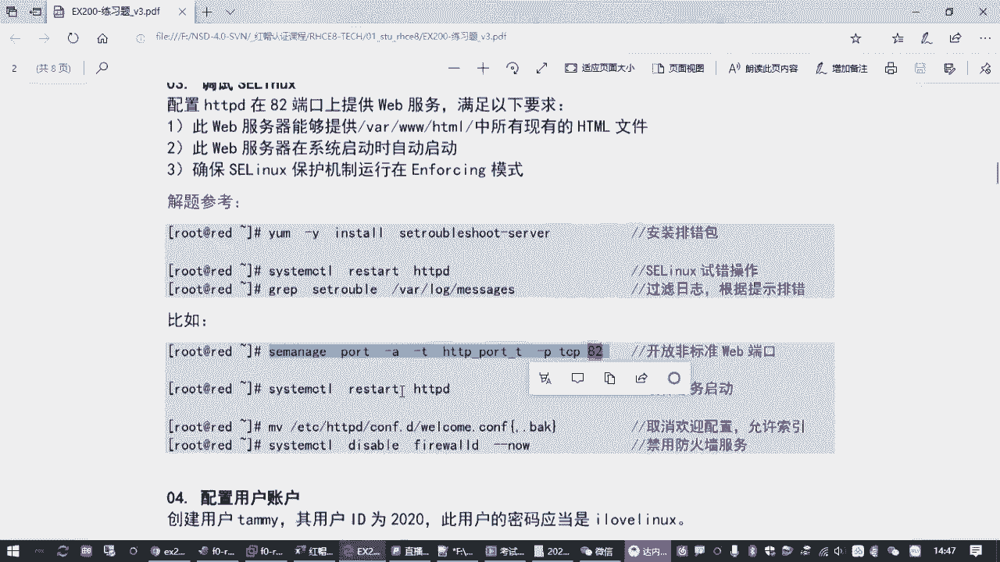

通过这个流程，你不仅解决了具体问题，也掌握了在强制安全策略下调试服务访问控制的基本思路。