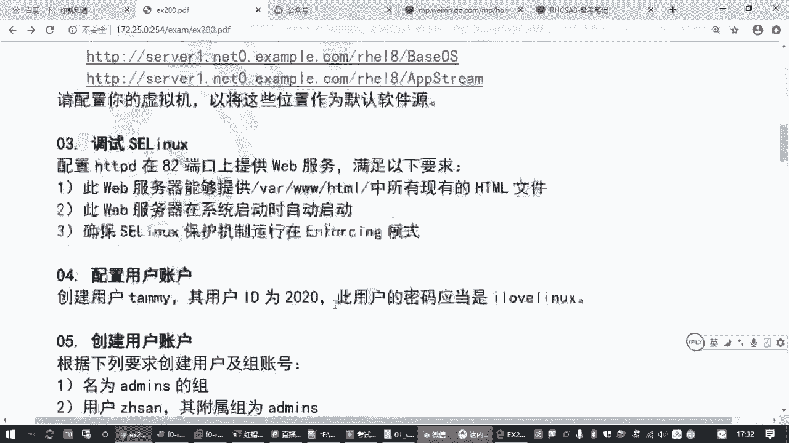
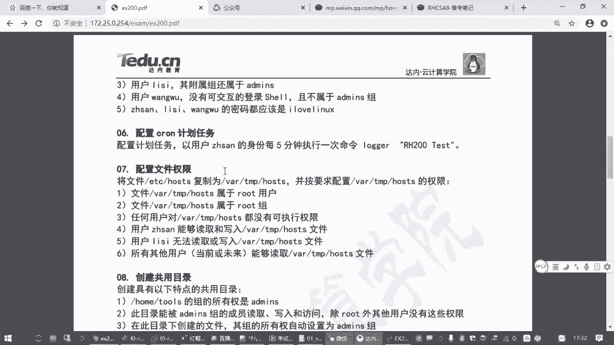
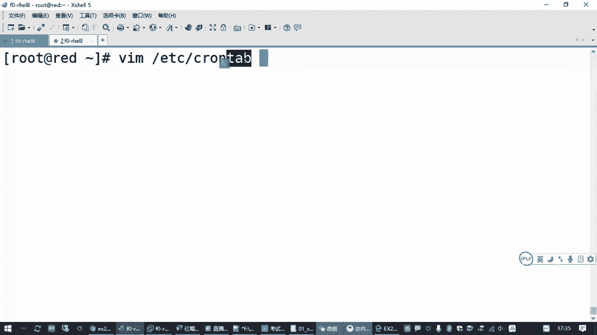
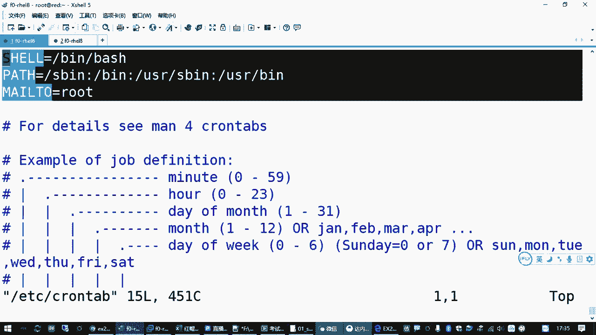
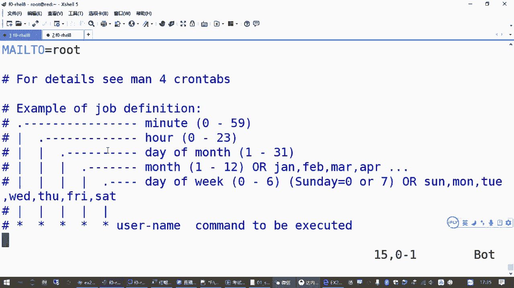
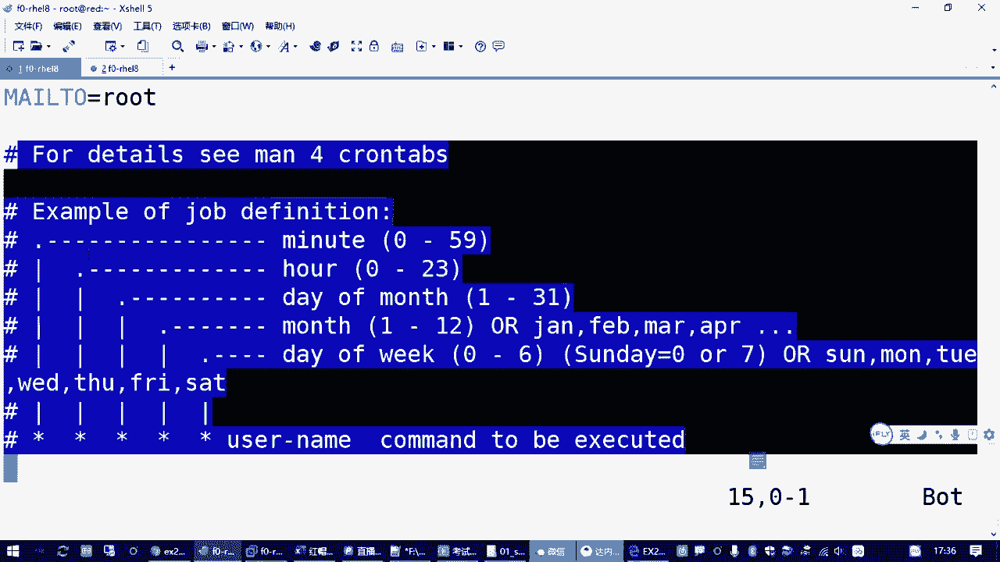
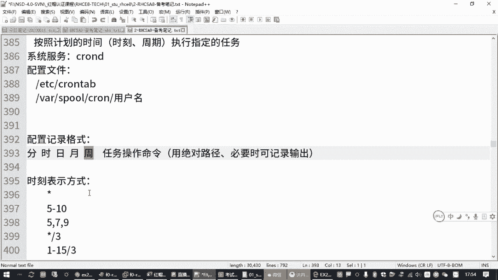

# RHCSA认证精讲教程：P14：2.09-cron计划任务 📅





在本节课中，我们将学习Linux系统中一个非常实用的功能——计划任务。我们将了解它的概念、作用，并掌握如何配置和管理计划任务，以满足自动化运维的需求。

## 什么是计划任务？ 🤔

计划任务，顾名思义，就是按照管理员预先规划好的时间点，在指定的时刻自动执行某个任务。例如，每周六晚上自动备份数据，或者工作日早上自动开启防火墙策略。这个功能对于系统运维工作至关重要。

在红帽（RHEL）系统中，实现计划任务功能的软件包是 `cron`。该软件包通常是系统默认安装并自动运行的，对应的服务名为 `crond`。我们可以通过以下命令检查其状态：

```bash
systemctl status crond
```





## 计划任务的配置文件 📄





计划任务的配置主要通过一个核心文件进行管理。系统全局的计划任务配置文件位于 `/etc/crontab`。我们可以查看这个文件来了解其基本结构：

```bash
cat /etc/crontab
```

该文件包含了一些环境变量的设置，并提供了一个配置示例。一条完整的计划任务记录格式如下：

```
* * * * * username command-to-be-executed
```

这五个星号（`*`）从左到右分别代表：
1.  **分钟** (0-59)
2.  **小时** (0-23)
3.  **日期** (1-31)
4.  **月份** (1-12)
5.  **星期几** (0-7，其中0和7都代表星期日)

最后的 `username` 指定执行命令的用户身份，`command-to-be-executed` 则是要执行的具体命令。

## 时间表示方法详解 ⏰

上一节我们介绍了计划任务的基本格式，本节中我们来看看如何具体表示时间。`cron` 的时间字段支持多种灵活的表示方法：

以下是几种常见的时间表示方式：
*   **星号 (`*`)**：代表该字段的所有有效值。例如，在分钟字段使用 `*` 表示“每一分钟”。
*   **具体数值**：指定一个确切的值。例如，在小时字段写 `22` 表示“22点”。
*   **范围 (`-`)**：表示一个连续的时间范围。例如，`1-5` 在星期字段表示“周一到周五”。
*   **列表 (`,`)**：表示多个不连续的时间点。例如，`0,15,30,45` 在分钟字段表示“每小时的第0、15、30、45分钟”。
*   **步长 (`/`)**：表示时间间隔。例如，`*/5` 在分钟字段表示“每5分钟”。`1-15/3` 在日期字段表示“每月1到15号期间，每3天一次”。

**重要提示**：日期（月中的第几天）和星期几（周几）这两个字段是“或”的关系。只要满足其中一个条件，任务就会执行。为避免混淆，通常只使用其中一个字段来定义执行日期。

## 管理计划任务的工具 🛠️

虽然可以直接编辑 `/etc/crontab` 文件，但更推荐使用专用的命令 `crontab` 来管理用户级别的计划任务。这样做更安全、更方便，因为命令会自动进行语法检查并通知 `crond` 服务重新加载配置。

以下是 `crontab` 命令的核心用法：
*   **编辑计划任务**：`crontab -e`
    *   此命令会调用默认文本编辑器（如vi）来编辑当前用户的计划任务列表。
*   **查看计划任务**：`crontab -l`
    *   此命令列出当前用户的所有计划任务。
*   **删除计划任务**：`crontab -r`
    *   **注意**：此命令会删除该用户的所有计划任务，请谨慎使用。

如果需要为其他用户管理计划任务（需要root权限），可以加上 `-u` 选项。例如，为用户 `zhangsan` 编辑计划任务：
```bash
crontab -e -u zhangsan
```

## 实战：配置一个计划任务 🎯

现在，让我们运用前面学到的知识来完成一个实际任务。假设我们需要以用户 `zhangsan` 的身份，每5分钟执行一次命令 `/bin/echo “Hello Cron”`。

以下是具体操作步骤：
1.  使用 `crontab` 命令为用户 `zhangsan` 编辑计划任务：
    ```bash
    crontab -e -u zhangsan
    ```
2.  在打开的编辑器中，按 `i` 键进入插入模式，输入以下内容：
    ```
    */5 * * * * /bin/echo “Hello Cron”
    ```
    *   `*/5`：表示每5分钟。
    *   后面的四个 `*`：分别表示每小时、每天、每月、每周的任何时间。
    *   命令部分使用了绝对路径 `/bin/echo`，这是生产环境中的推荐做法，可以避免因环境变量问题导致命令找不到。
3.  输入完毕后，按 `ESC` 键退出插入模式，然后输入 `:wq` 保存并退出编辑器。
4.  如果格式正确，系统会提示“crontab: installing new crontab”，表示任务已成功添加。

我们可以使用 `crontab -l -u zhangsan` 命令来验证任务是否已添加。

## 检查计划任务的执行情况 🔍

配置好计划任务后，如何确认它真的执行了呢？我们可以通过系统日志来查看。

计划任务服务 `crond` 会将所有执行记录写入日志文件 `/var/log/cron`。我们可以使用 `tail` 命令查看该文件的末尾，观察最近的执行记录：

```bash
tail -f /var/log/cron
```

等待几分钟（对于我们设置的每5分钟任务），你应该能在日志中看到类似以下的记录，这表明任务已成功执行：
```
Jul 10 14:05:01 localhost CROND[12345]: (zhangsan) CMD (/bin/echo “Hello Cron”)
```

## 总结 📝

本节课中我们一起学习了Linux计划任务 `cron` 的完整知识。
*   我们首先了解了**计划任务**的概念和作用，即按预定时间自动执行命令。
*   接着，我们学习了其核心配置文件 `/etc/crontab` 的格式和**时间字段**（分、时、日、月、周）的多种表示方法。
*   然后，我们掌握了使用 **`crontab` 命令**（`-e`， `-l`， `-r`， `-u`）来安全、便捷地管理计划任务。
*   最后，我们通过一个“每5分钟执行一次echo命令”的**实战案例**，串联了所有知识点，并学会了通过 `/var/log/cron` **日志文件**来验证任务的执行情况。



掌握计划任务的配置是系统管理员的基本功，它能极大地提升运维工作的自动化水平和效率。