# RHCSA精讲教程：P16：3.02-find查找及grep过滤 🔍

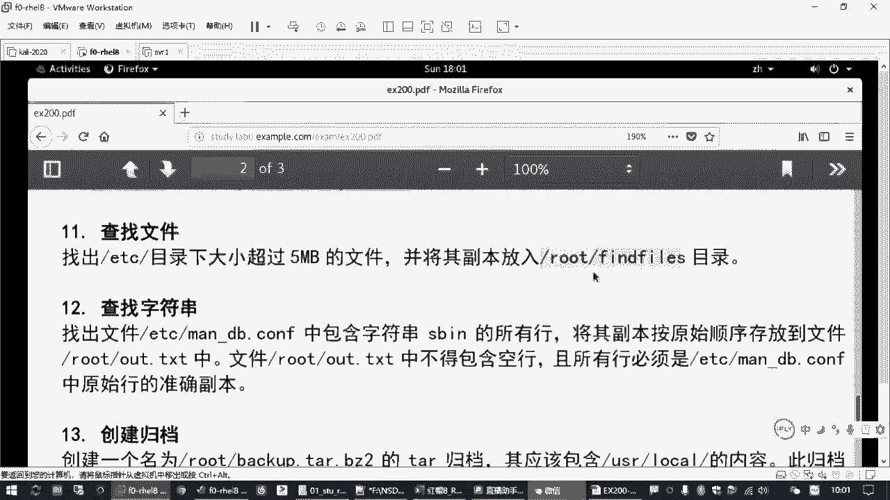

在本节课中，我们将学习两个在Linux系统管理中至关重要的命令：`find`和`grep`。`find`命令用于在文件系统中搜索符合条件的文件，而`grep`命令则用于在文本内容中过滤出包含特定字符串的行。掌握这两个命令是高效管理系统和通过RHCSA考试的关键。

## 查找文件：`find`命令详解

上一节我们介绍了文件系统的基本操作，本节中我们来看看如何在复杂的目录结构中精确地找到我们需要的文件。

`find`命令的基本格式是：`find [目录范围] [查找条件]`。如果不指定目录范围，则默认在当前目录下查找；如果不指定查找条件，则列出指定目录下的所有文件。

以下是`find`命令常用的几种查找条件：

*   **按名称查找 (`-name`)**: 根据文件名进行搜索。可以使用通配符，如星号`*`代表任意字符。
    *   示例：`find /etc -name "resolv.conf"` 查找`/etc`目录下名为`resolv.conf`的文件。
    *   示例：`find /boot -name "vmli*"` 查找`/boot`目录下以`vmli`开头的所有文件。

*   **按类型查找 (`-type`)**: 根据文件类型进行搜索。
    *   `f`: 常规文件
    *   `d`: 目录
    *   `l`: 符号链接文件
    *   `b`: 块设备文件
    *   `c`: 字符设备文件
    *   示例：`find /dev -type b` 列出`/dev`目录下所有的块设备文件。

*   **按大小查找 (`-size`)**: 根据文件大小进行搜索。可以使用`+`表示大于，`-`表示小于。单位需注意：`k`（小写）表示KB，`M`（大写）表示MB。
    *   示例：`find /etc -size +5M` 查找`/etc`目录下大小超过5MB的文件。

*   **按时间查找 (`-mtime`)**: 根据文件修改时间进行搜索，单位是天。
    *   `+n`: 查找在n天前修改的文件。
    *   `-n`: 查找在n天内修改的文件。
    *   `n`: 查找在正好n天前修改的文件（具体含义需参考手册）。
    *   示例：`find /var/log -mtime +30` 查找`/var/log`目录下超过30天未修改的文件。

*   **按用户/组查找 (`-user` / `-group`)**: 根据文件所有者或所属组进行搜索。
    *   示例：`find /home -user student` 查找`/home`目录下所有者为`student`的文件。

## 组合条件与处理结果

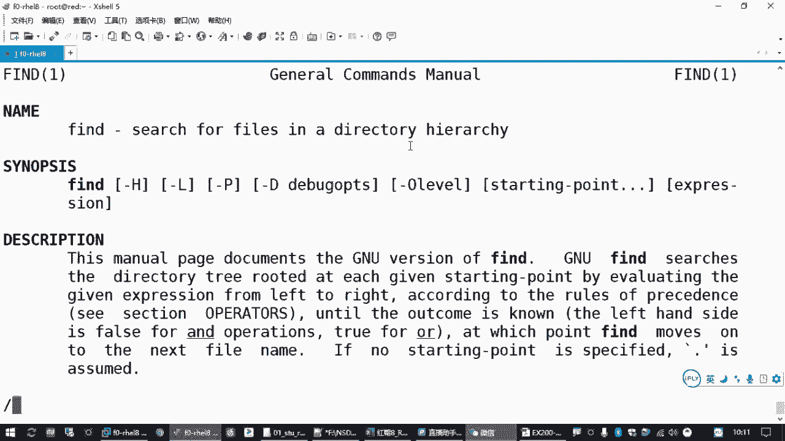

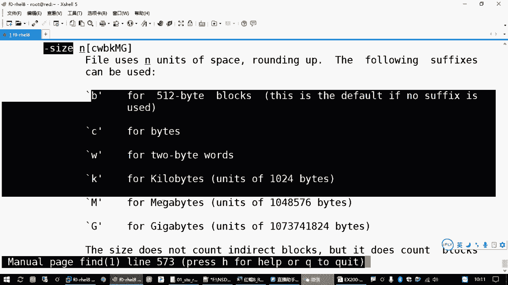

在实际应用中，我们经常需要组合多个条件进行查找。

*   **逻辑与 (`-a` 或 默认连接)**: 同时满足多个条件。`-a`（and）通常可以省略。
    *   示例：`find /etc -size +5k -name "file*"` 查找`/etc`目录下大小超过5KB且名字以`file`开头的文件。

*   **逻辑或 (`-o`)**: 满足任意一个条件即可。
    *   示例：`find . -name "*.txt" -o -name "*.log"` 查找当前目录下所有`.txt`或`.log`结尾的文件。

找到文件后，我们常常需要对结果进行处理。`find`命令提供了`-exec`选项来对找到的每一个文件执行指定的命令。

其基本格式为：`find ... -exec 命令 {} \;`。其中，`{}`是一个占位符，代表`find`命令找到的每一个文件路径，反斜杠分号`\;`用于标记命令的结束。

例如，我们想查看找到的每个文件的详细信息：
```bash
find /etc -size +5M -exec ls -lh {} \;
```
这条命令会先找到`/etc`下所有大于5MB的文件，然后对每个文件执行`ls -lh`命令来显示其详细信息。

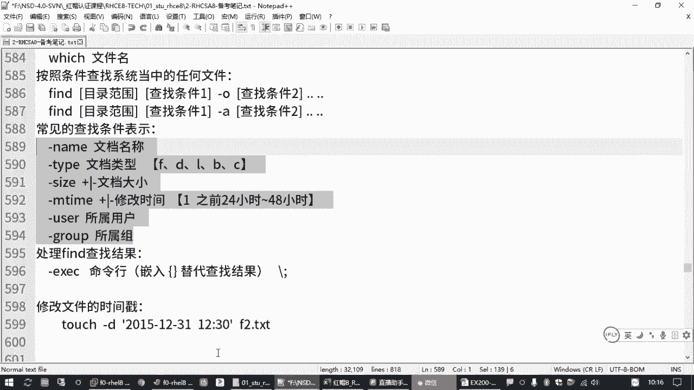

## 实战：查找并复制文件

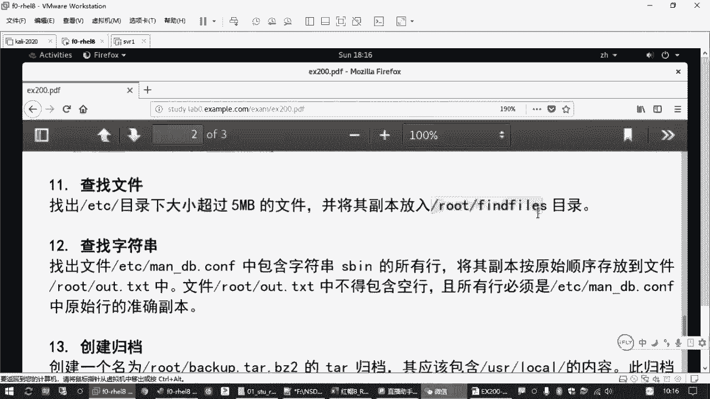

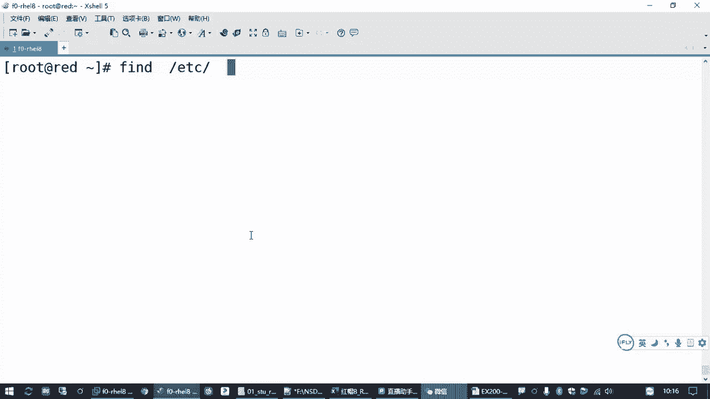

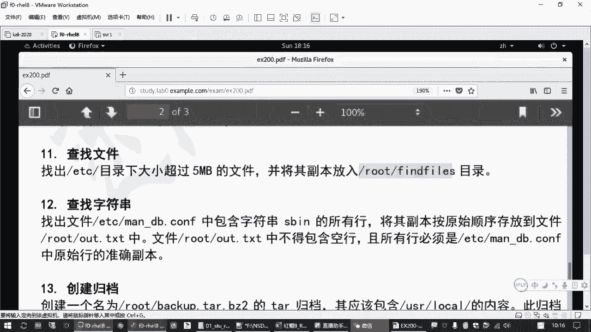

现在，让我们应用所学知识来解决一个实际问题：在`/etc`目录下查找所有大小超过5MB的文件，并将它们复制到`/root/findfiles`目录中。

首先，如果目标目录不存在，需要创建它：
```bash
mkdir /root/findfiles
```

然后，使用`find`命令进行查找，并用`-exec`执行复制操作：
```bash
find /etc -size +5M -exec cp -p {} /root/findfiles \;
```
*   `find /etc -size +5M`: 在`/etc`目录下查找大小超过5MB的文件。
*   `-exec cp -p {} /root/findfiles \;`: 对每个找到的文件，执行`cp -p`命令。`-p`选项用于保留文件的原始属性（如权限、时间戳）。`{}`被替换为具体的文件路径，最终复制到`/root/findfiles`目录。

最后，可以验证结果：
```bash
ls -lh /root/findfiles/
```

## 过滤文本：`grep`命令详解

处理完文件查找，我们再来看看如何从文件内容中提取信息。`grep`命令是进行文本过滤的利器。

`grep`最基本的用法是：`grep [选项] “关键词” 文件名`。它会在指定的文件中搜索包含“关键词”的行并输出。

例如，在`/etc/hosts`文件中查找包含`localhost`的行：
```bash
grep "localhost" /etc/hosts
```

另一种常见用法是通过管道`|`，将前一个命令的输出作为`grep`的输入进行过滤。例如，我们只想查看`ip addr`命令输出中关于IP地址的行：
```bash
ip addr | grep "inet "
```
这里，`ip addr`命令的输出被传递给`grep`，`grep`只输出其中包含字符串`inet `的行。

## `grep`的常用选项

`grep`命令拥有许多实用的选项来增强其过滤能力。

以下是几个关键的选项：

*   **`-v`**: 反向选择，即输出**不包含**关键词的行。
    *   示例：`grep -v “bash” /etc/passwd` 输出`/etc/passwd`中默认shell不是bash的用户行。

*   **`-i`**: 忽略大小写进行匹配。
    *   示例：`grep -i “error” /var/log/messages` 查找`/var/log/messages`中所有`error`、`Error`、`ERROR`等形式的记录。

*   **`-n`**: 显示匹配行所在的行号。
    *   示例：`grep -n “root” /etc/passwd` 查找`root`用户并显示其在文件中的行号。

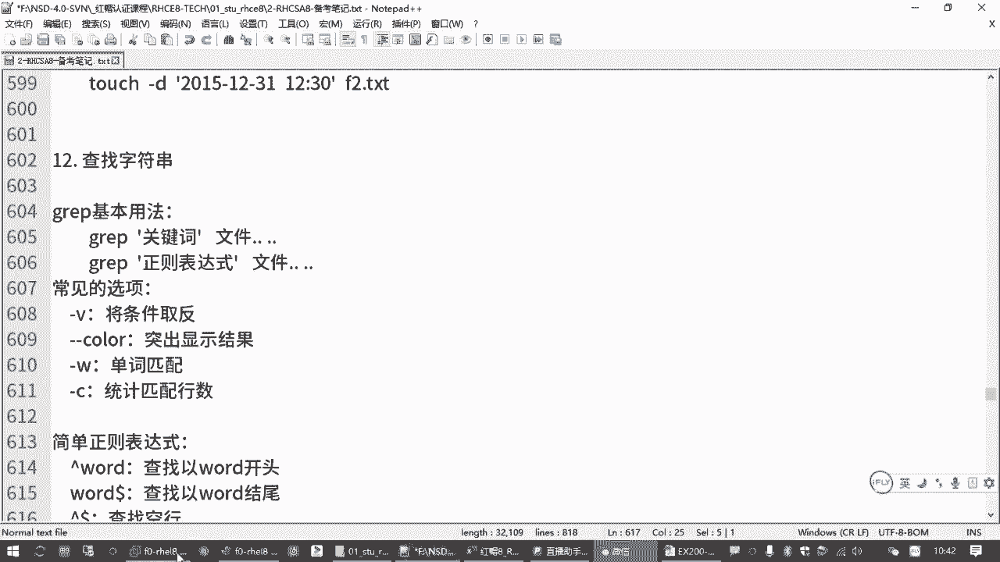

*   **`-E`**: 启用扩展正则表达式。或者可以直接使用`egrep`命令。
    *   示例：`grep -E “127|localhost” /etc/hosts` 查找包含`127`**或**`localhost`的行。

## 实战：过滤并保存结果

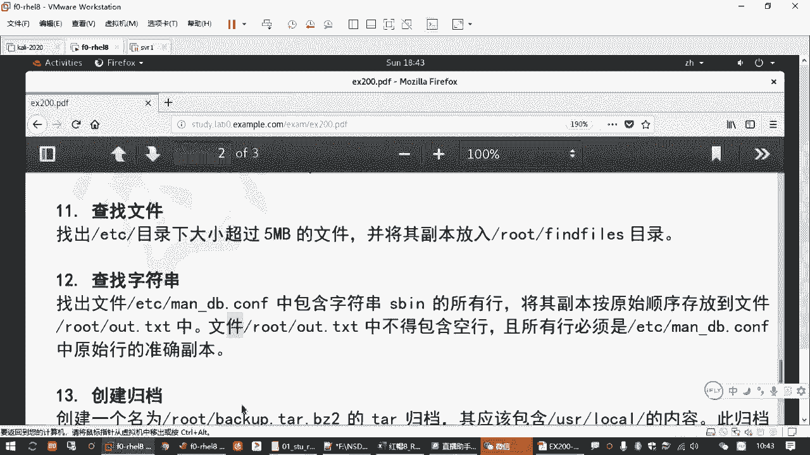

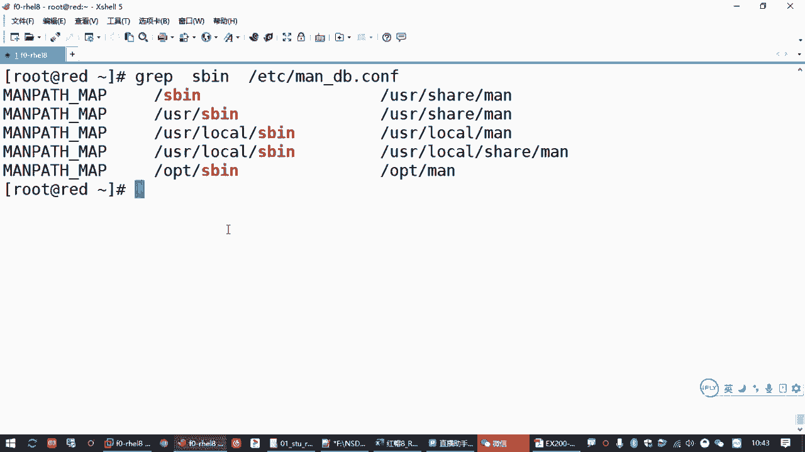

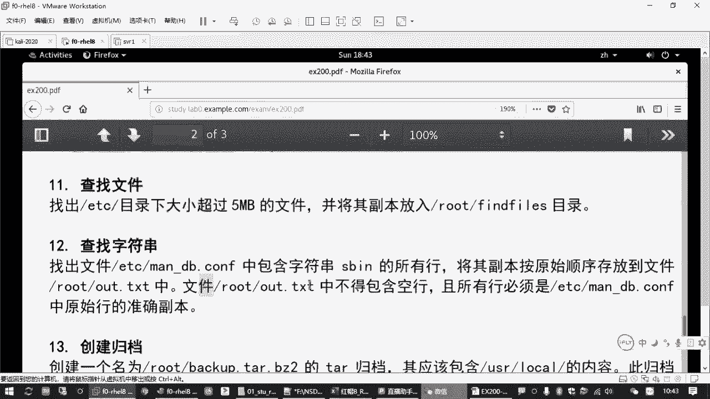

现在，我们完成另一个任务：从`/etc/man_db.conf`文件中，找出所有包含字符串`sb`的行，并将结果**原样**保存到`/root/alt.txt`文件中。

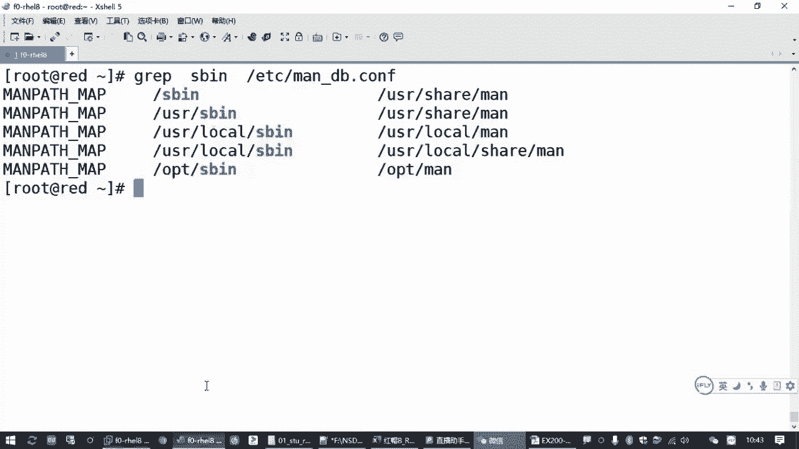

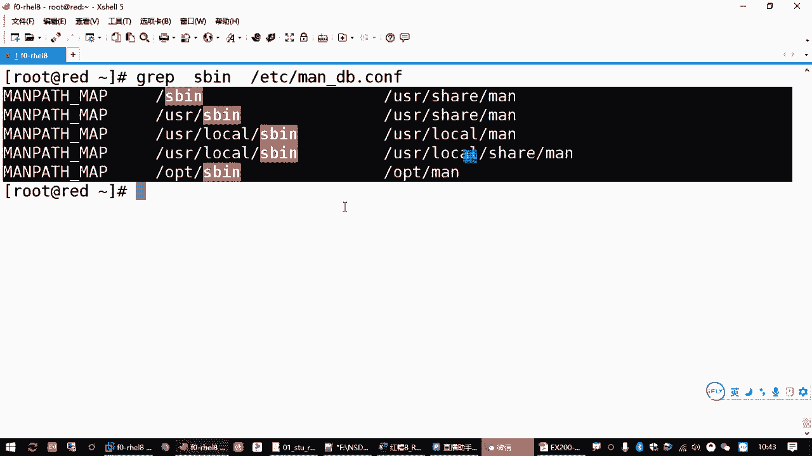

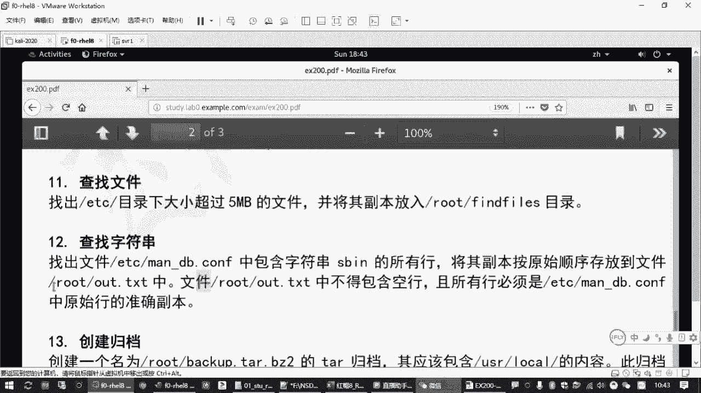

直接使用`grep`命令配合输出重定向可以完美地完成这个任务：
```bash
grep "sb" /etc/man_db.conf > /root/alt.txt
```
*   `grep “sb” /etc/man_db.conf`: 在指定文件中查找包含`sb`的行并输出到屏幕。
*   `> /root/alt.txt`: 这是输出重定向符号。它将前面命令的标准输出（即屏幕显示内容）**重定向**到`/root/alt.txt`文件中。如果文件不存在则创建，如果存在则覆盖其内容。

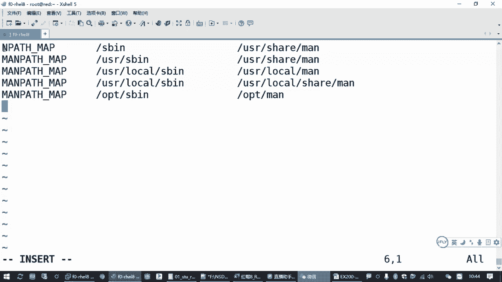

这种方法避免了手动复制粘贴可能引入的空行或格式错误，确保了结果是原始行的准确副本。如果要追加内容而不是覆盖，可以使用`>>`符号。

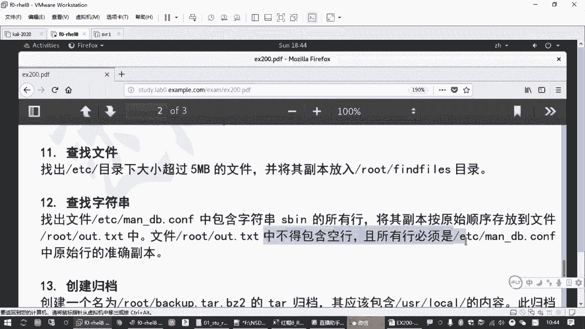

## 总结

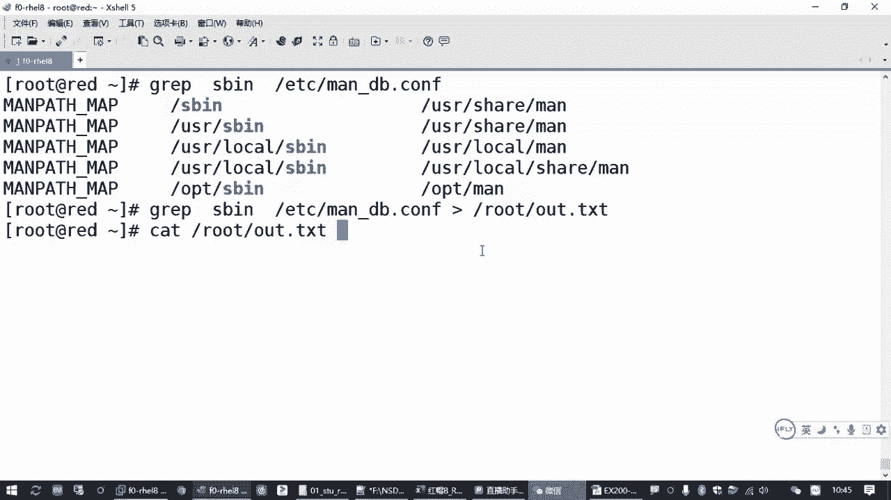

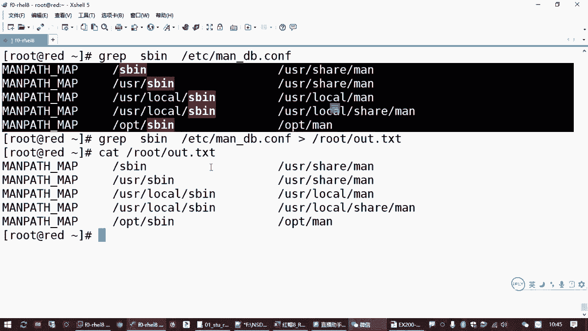

本节课中我们一起学习了Linux系统中两个强大的搜索和过滤工具：`find`和`grep`。

*   **`find`命令**用于在文件系统中根据名称、类型、大小、时间等多种属性查找文件，并能通过`-exec`选项对找到的文件执行后续操作。
*   **`grep`命令**用于在文本内容中根据关键词或正则表达式进行过滤，常用选项如`-v`、`-i`、`-n`等能应对各种复杂场景。
*   通过结合**管道 `|`** 和**输出重定向 `>`**，我们可以将多个命令串联起来，并将结果保存到文件，从而实现高效、自动化的文本处理流程。

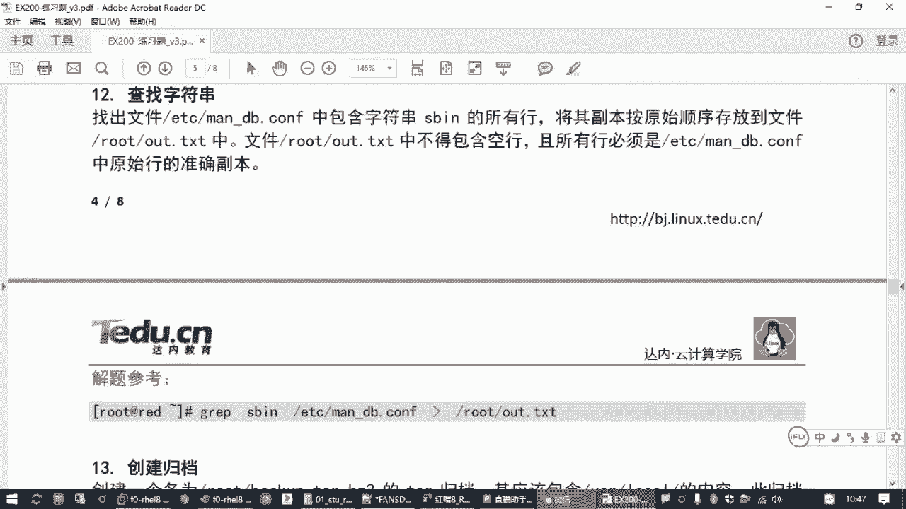

熟练掌握这两个命令，将极大提升你在Linux环境下的工作效率和问题排查能力。