# RHCSA认证精讲教程：P19：3.05-重置root密码 🔑

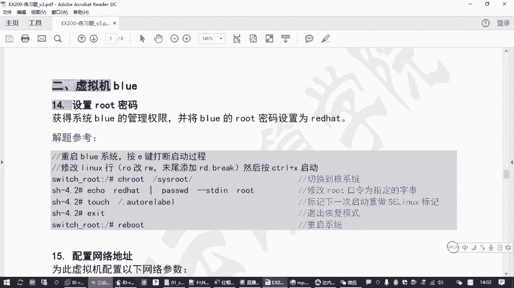

在本节课中，我们将学习如何重置Red Hat Enterprise Linux 8系统的root用户密码。这是RHCSA考试中的一个关键技能，也是系统管理员在忘记密码时进行系统恢复的必备操作。我们将分步讲解如何通过修改系统启动参数进入恢复模式，并最终成功修改密码。

## 环境与背景说明 💻

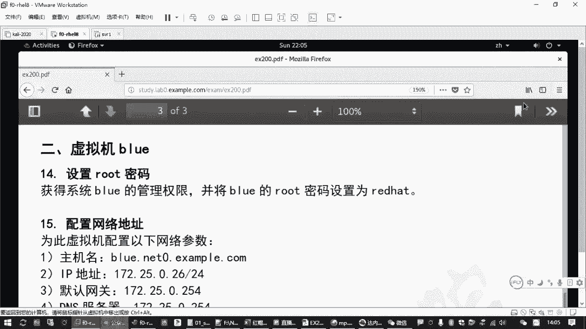

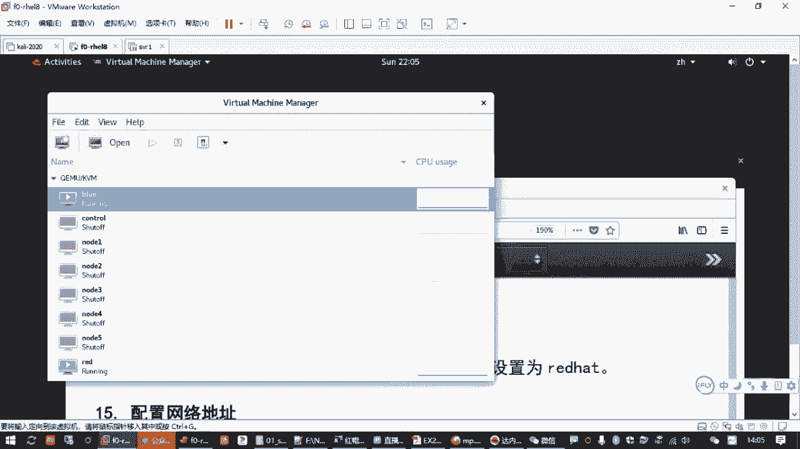

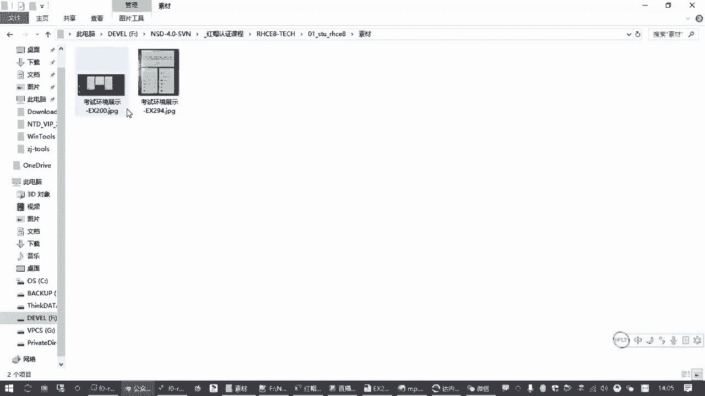

上一节我们介绍了在主要虚拟机（red）上的操作。本节中，我们来看看如何在第二台虚拟机（blue）上重置root密码。

RHCSA考试通常包含两台虚拟机：red和blue。较难的题目会安排在blue虚拟机上。重置root密码这道题可能出现在任何一台虚拟机上，但操作方法完全相同。考试时，你需要将blue虚拟机的root密码设置为指定值（例如`redhat`），但初始密码未知，因此需要先破解密码以获得管理员权限。

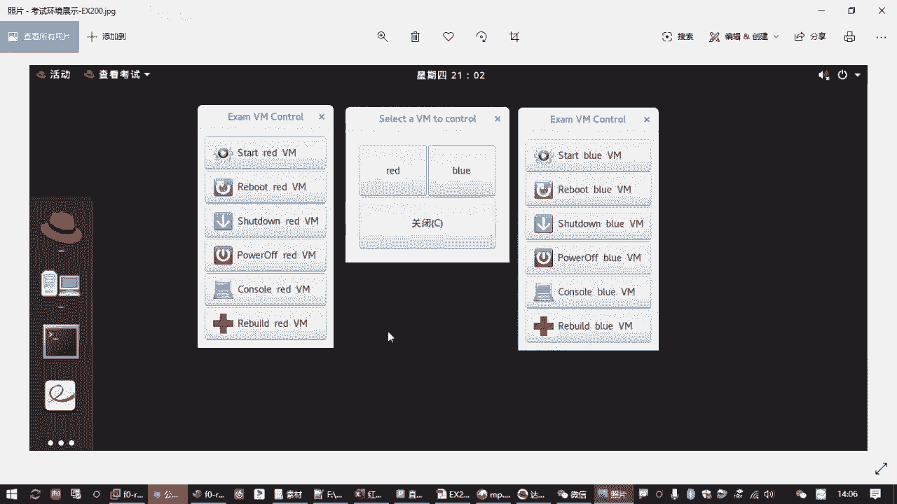

## 核心思路与步骤 🧠

破解密码主要解决两个问题：第一，如何绕过密码进入系统；第二，如何正确修改密码并处理SELinux带来的潜在问题。

以下是破解密码的核心步骤概览：
1.  强制关闭并快速重启虚拟机。
2.  在启动过程中按两次 `e` 键，打断引导过程并编辑启动参数。
3.  将内核参数中的 `ro` 改为 `rw`，并在行末添加 `rd.break`。
4.  按 `Ctrl+X` 启动，进入临时恢复环境。
5.  使用 `chroot` 命令切换到真实的系统根环境。
6.  使用 `passwd` 命令修改root密码。
7.  创建 `.autorelabel` 文件以通知SELinux在下次启动时重新标记文件系统。
8.  退出并重启系统。

## 详细操作指南 📝

### 第一步：重启并进入启动菜单

首先，需要将blue虚拟机关机并快速重启，以进入启动菜单。

1.  在虚拟机控制界面，将blue虚拟机关机（`power off`）。
2.  立即点击 `start` 启动虚拟机。
3.  启动后，迅速点击 `console` 打开控制台窗口，并将鼠标焦点置于窗口内。

**关键操作**：在虚拟机启动初期（出现启动画面时），快速连续按两次 `e` 键。
*   第一次按 `e`：显示被隐藏的启动菜单。
*   第二次按 `e`：编辑默认选中的启动项（即正常启动项）。

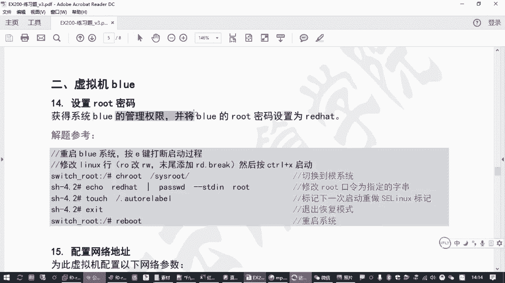

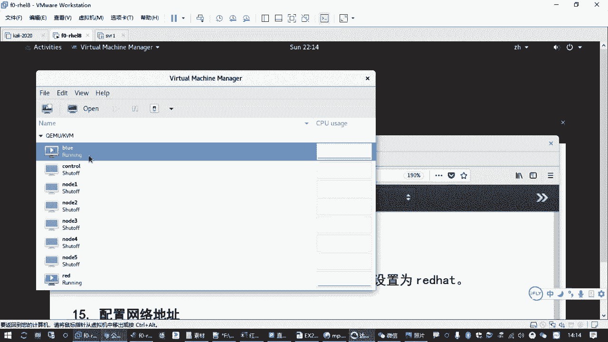

### 第二步：编辑内核启动参数

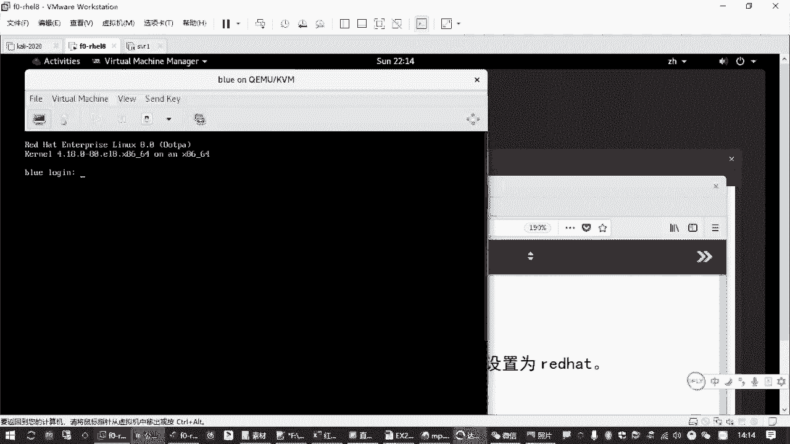

成功打断后，会进入一个编辑界面。你需要找到以 `linux` 开头的那一行。

1.  使用键盘方向键将光标移动到 `linux` 开头的行。
2.  找到该行中的 `ro` 参数（表示只读挂载根文件系统），将其修改为 `rw`（获得写入权限）。
3.  将光标移动到该行的末尾。
4.  添加一个空格，然后输入参数 `rd.break`。这个参数告诉内核进入恢复模式，并中断正常的启动流程，从而绕过密码验证。
5.  编辑完成后，按 `Ctrl+X` 组合键继续启动。**注意**：不是按回车键。

### 第三步：在恢复环境中修改密码

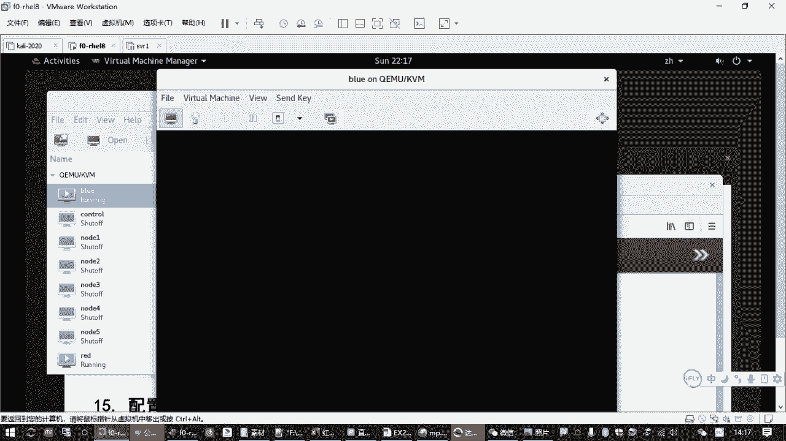

系统将引导进入一个临时的恢复环境，你会看到一个 `switch_root` 提示符。

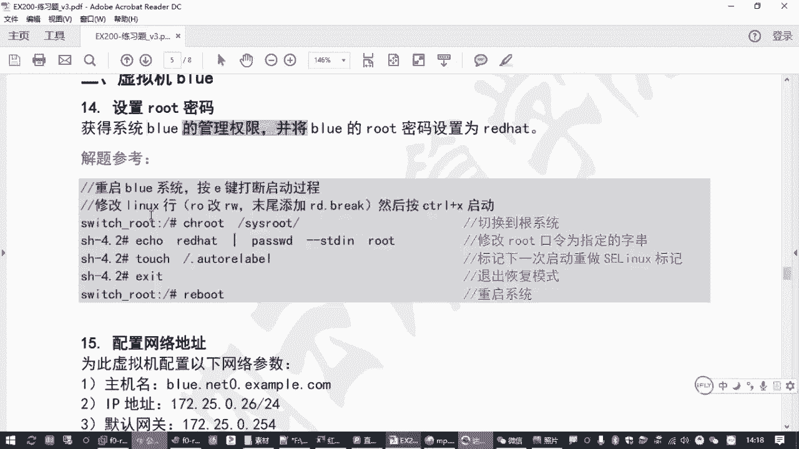

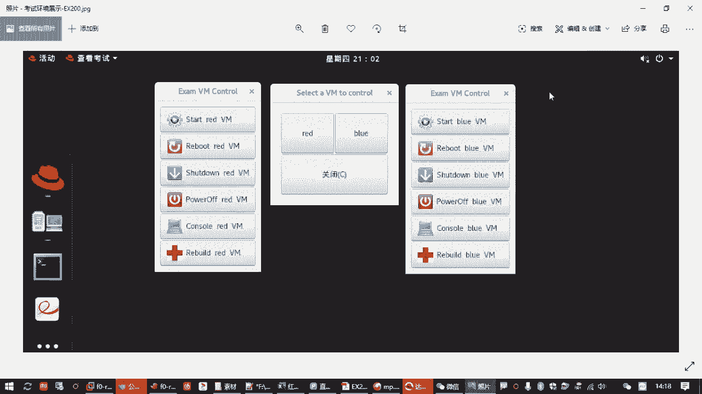

1.  默认的根目录 `/` 是内存中的临时环境。需要切换到硬盘上真实的系统根目录。执行以下命令：
    ```bash
    chroot /sysroot
    ```
2.  现在，你已经处于真实的系统环境中。可以开始修改root密码：
    ```bash
    passwd root
    ```
    根据提示，输入两次新密码（例如 `redhat`）。
3.  **处理SELinux**：如果系统启用了SELinux（默认启用），直接重启会导致无法登录。因为SELinux检测到关键文件（如密码文件）被修改，会认为系统不安全。需要创建一个标记文件，通知SELinux在下次启动时重新标记所有文件的安全上下文：
    ```bash
    touch /.autorelabel
    ```
    **注意**：文件名是 `.autorelabel`，不要拼写错误。
4.  操作完成后，退出chroot环境并重启系统：
    ```bash
    exit
    reboot
    ```
    或者连续按两次 `Ctrl+D` 退出chroot，然后执行 `reboot`。

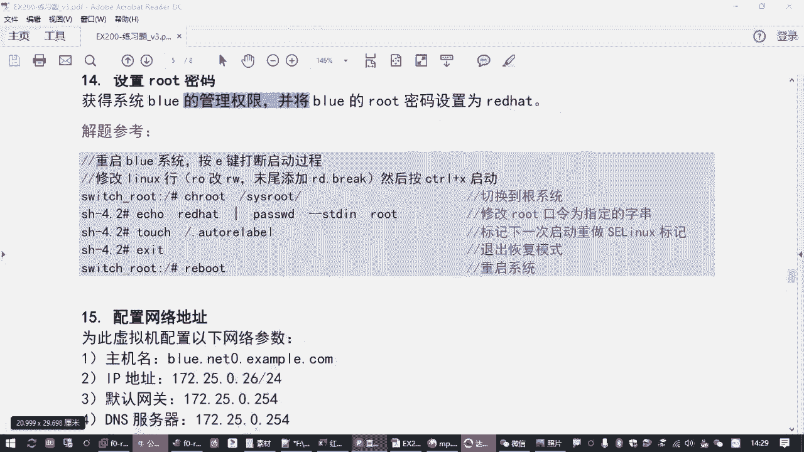

### 第四步：验证与后续配置

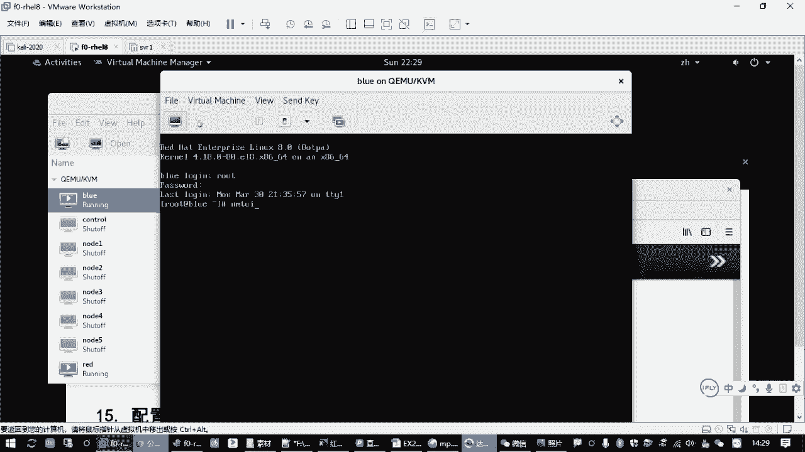

系统重启后，使用新设置的root密码（如 `redhat`）登录blue虚拟机。

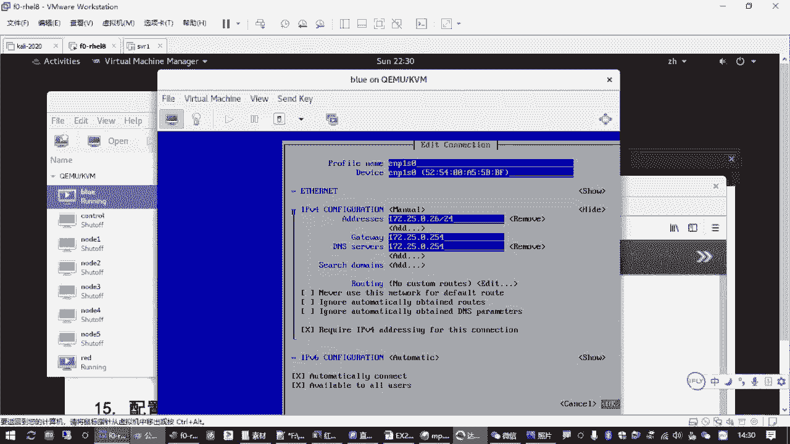

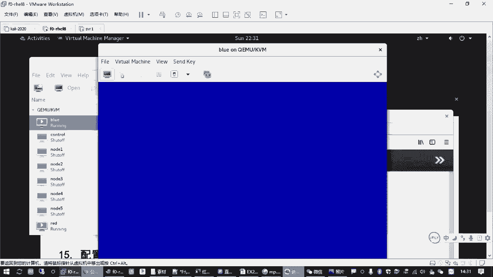

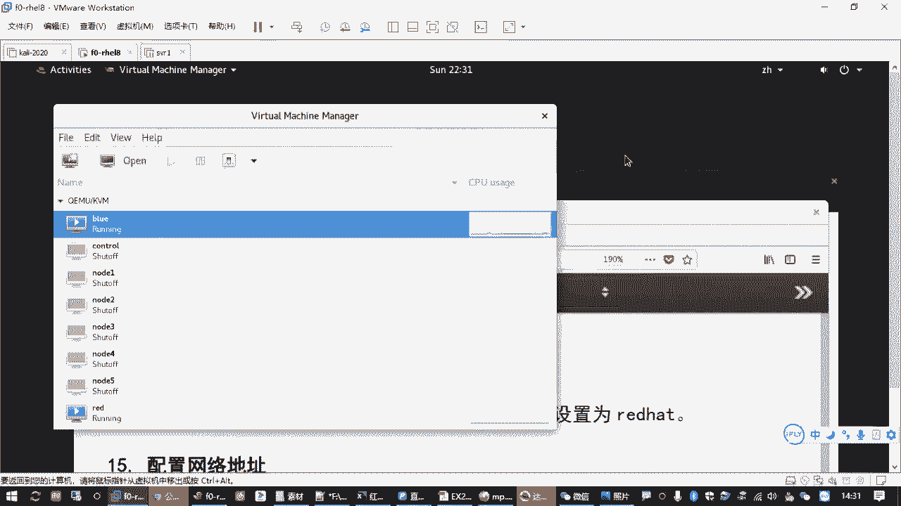

登录成功后，建议完成以下常规配置，以便后续操作：
1.  **配置网络与主机名**：使用 `nmtui` 命令配置静态IP地址、网关、DNS，并将主机名设置为 `blue.network0.example.com`。
2.  **配置Yum软件源**：可以从已配置好的red虚拟机直接拷贝Yum源配置文件，提高效率：
    ```bash
    # 在red虚拟机上执行
    scp /etc/yum.repos.d/*.repo root@blue的IP地址:/etc/yum.repos.d/
    ```
3.  **安装常用工具**：使用yum安装一些常用软件包，如 `bash-completion`（命令补全）、 `vim-enhanced`（增强版编辑器）、 `nmtui`（如果尚未安装）等。

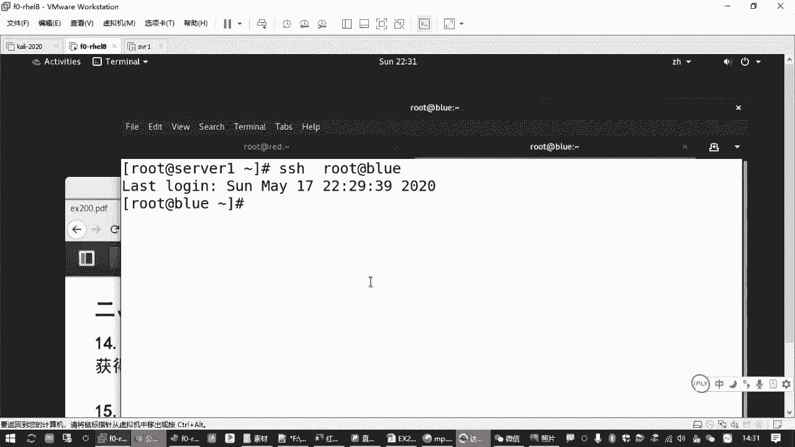

## 总结与要点回顾 ✅

本节课中我们一起学习了在RHEL 8中重置root密码的完整流程。

**核心要点总结**：
*   **操作前提**：需要物理或虚拟控制台访问权限。
*   **关键步骤**：快速按两次 `e` 键编辑启动参数，将 `ro` 改为 `rw` 并添加 `rd.break`。
*   **密码修改**：在恢复环境中使用 `chroot /sysroot` 切换根目录，再用 `passwd` 修改密码。
*   **SELinux处理**：修改密码后**必须**创建 `/.autorelabel` 文件，否则重启后可能无法登录。
*   **后续工作**：密码重置后，记得配置网络和软件源，为后续的考试题目或管理工作做好准备。

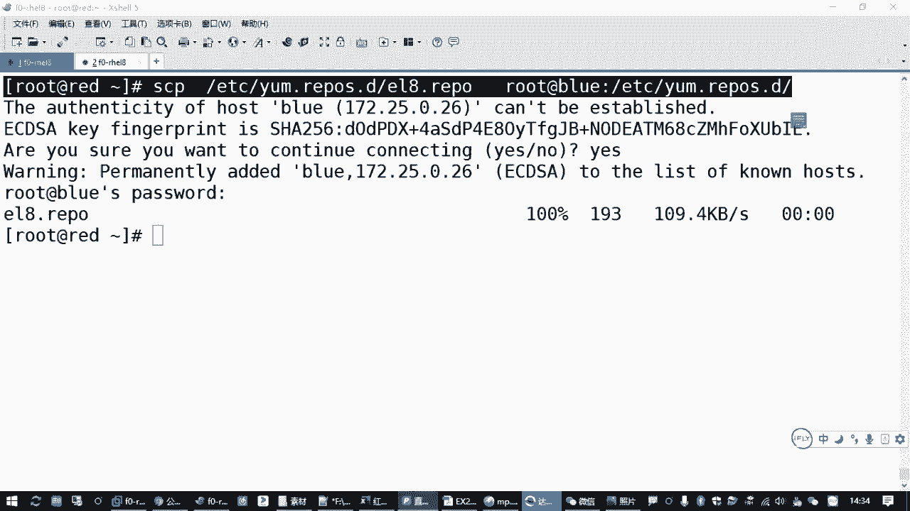

这道题是获得第二台虚拟机控制权的“敲门砖”，熟练掌握至关重要。请务必在实验环境中反复练习，确保在考试紧张环境下也能快速准确地完成。