# RHCSA考前串讲：P23：3.09-RHCSA考前串讲

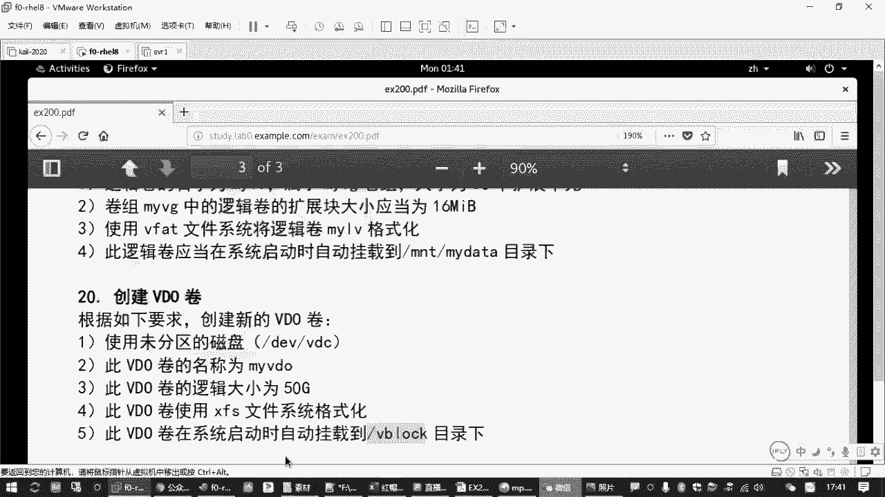

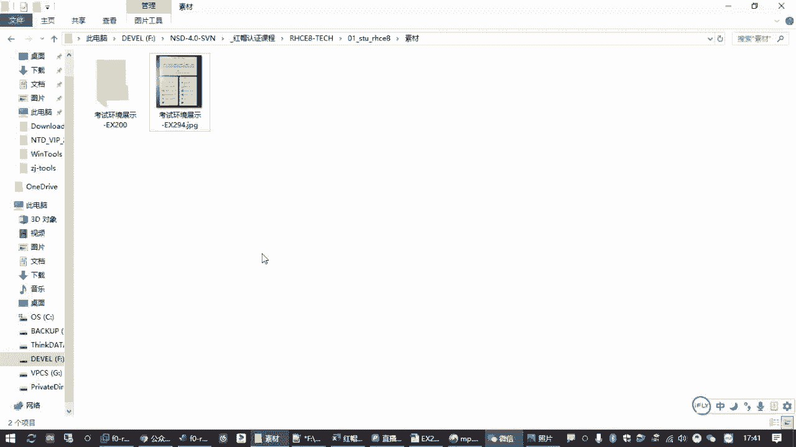

在本节课中，我们将对RHCSA上午考试的整体流程、环境、注意事项和关键考点进行系统性的梳理和总结，帮助你从容应对考试。

## 📋 考试环境与界面概述

上一节我们介绍了RHCSA考试的整体结构，本节中我们来看看考试的具体环境和操作界面。

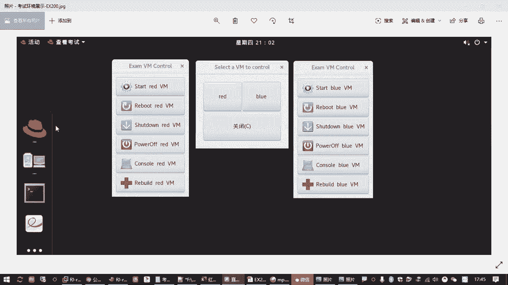

考试时，每位考生会操作一台真实的物理机。你登录后看到的桌面环境如下图所示，这是你进行所有操作的起点。

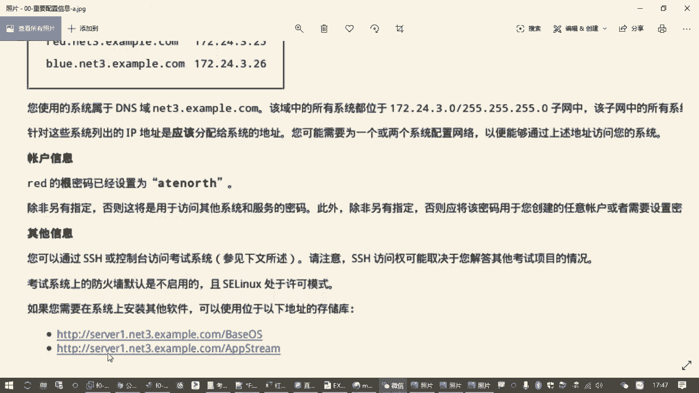

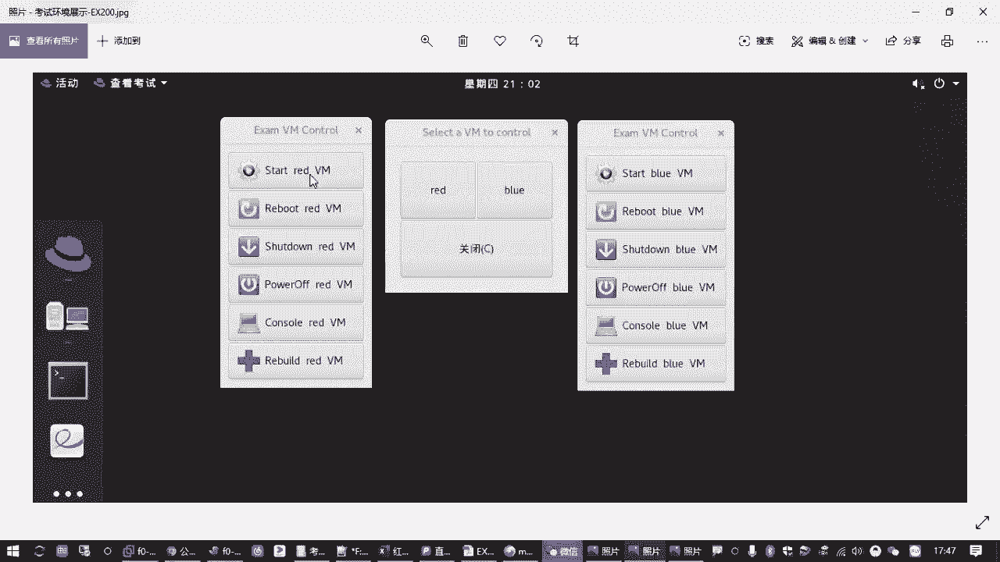

在物理机桌面上，你主要会使用到三个图标：
*   **红帽图标**：点击查看详细的考试要求和题目。
*   **虚拟机控制器图标**：用于控制考试中使用的虚拟机（如开机、关机、重启）。
*   **终端图标**：用于打开命令行终端。

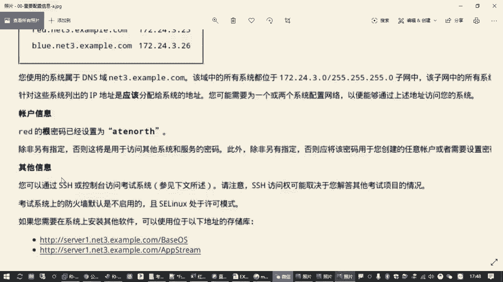

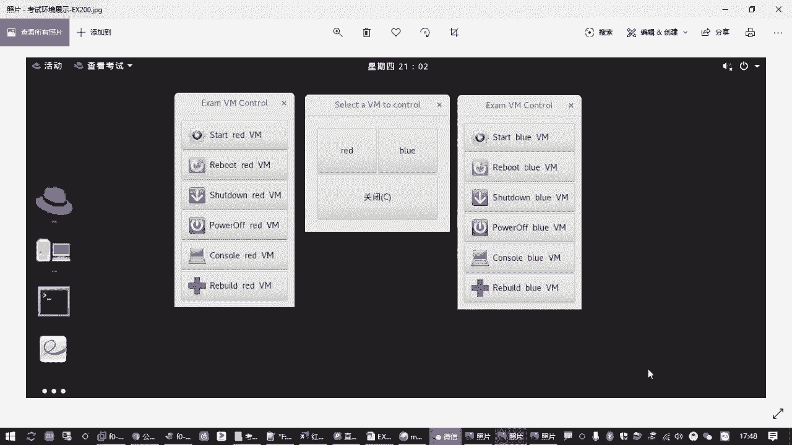

**核心概念**：所有考试操作都在虚拟机中完成，物理机桌面仅用于控制和查看题目。你在物理机上是普通用户，没有管理员权限。

## 📖 考试要求与重要信息

了解了操作界面后，我们来看看如何获取并理解考试的具体要求。

点击桌面上的红帽图标，会打开一个浏览器页面，其中包含了所有关键信息。页面通常分为几个部分，第一部分是“重要配置信息”。

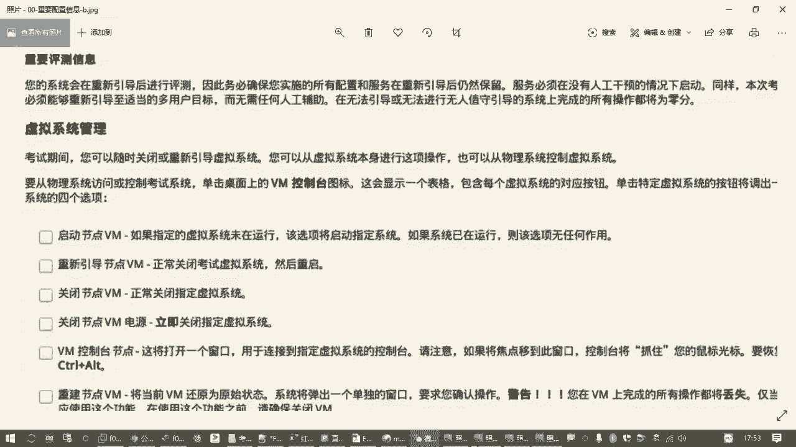

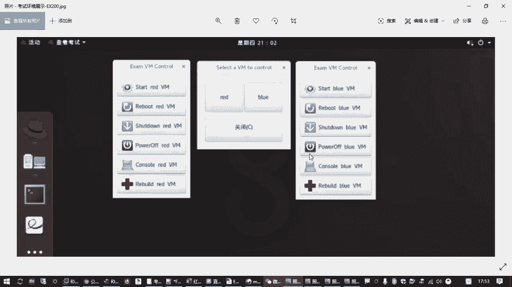

以下是“重要配置信息”中你需要关注的核心内容：
*   **虚拟机信息**：明确列出你将操作的两台虚拟机的主机名和IP地址。**注意**：IP地址和主机名（如`servera.lab.example.com`）与练习环境不同，务必以考试页面显示为准。
*   **管理员密码**：提供虚拟机的root用户密码。此密码用于登录虚拟机进行所有配置。
*   **访问方式**：说明可以通过SSH或控制台访问虚拟机。**强烈建议使用SSH**，因为从物理机终端通过SSH连接虚拟机后，可以方便地复制粘贴命令和文本，而控制台界面无法直接复制。
*   **防火墙与SELinux**：考试系统防火墙默认不启用。SELinux的状态可能开启，需根据题目要求处理。
*   **软件仓库**：提供软件包的下载地址。即使题目没有明确要求配置yum源，只要涉及安装软件包，你就需要根据此处提供的信息自行配置。考试环境无法访问外部互联网。

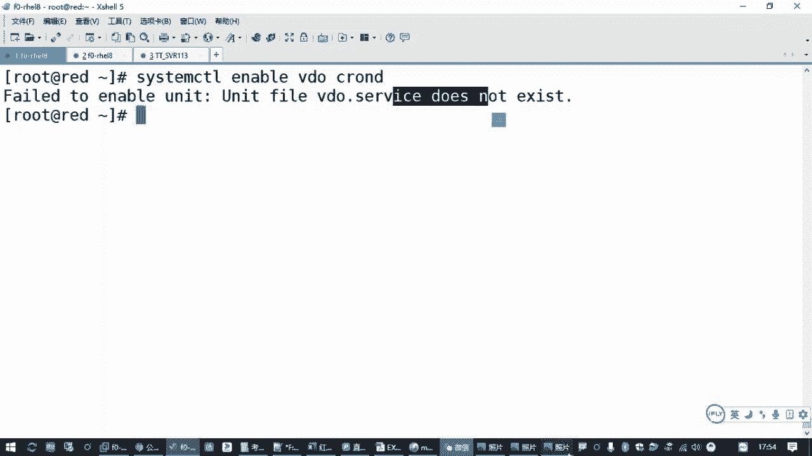

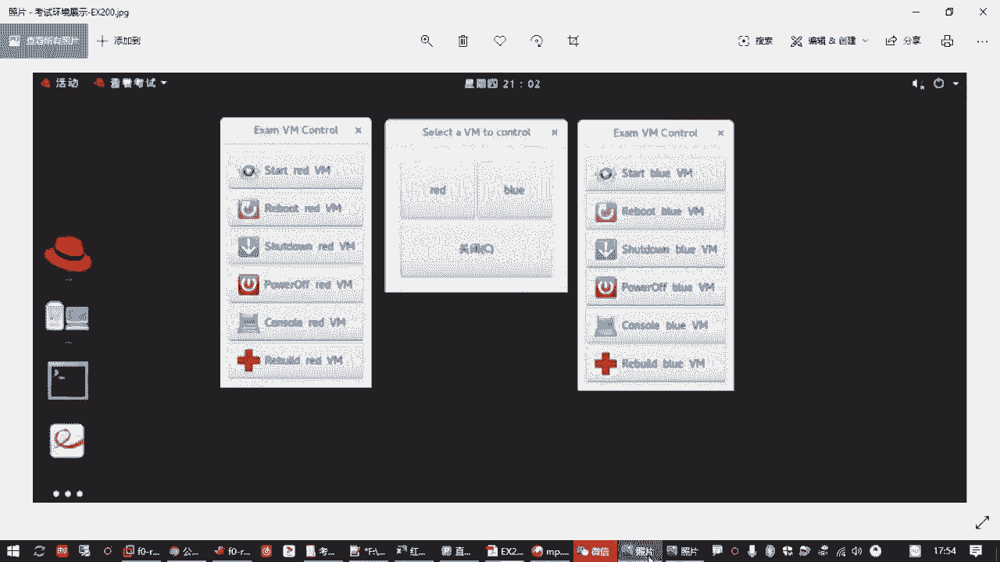

## ⚙️ 虚拟机管理与答题策略

掌握了考试信息，接下来我们看看如何有效地管理虚拟机和安排答题顺序。

在虚拟机控制器界面，你可以对每台虚拟机执行以下操作：
*   开机
*   重启
*   关机
*   强制关机
*   显示控制台界面
*   还原（重置虚拟机到初始状态）

**重要策略**：
1.  **谨慎使用“还原”功能**：除非虚拟机出现严重问题且时间充裕，否则不要轻易还原，因为这会丢失所有已完成的配置。
2.  **合理安排答题顺序**：建议先完成可能影响系统启动的题目（例如在第二台虚拟机上进行的磁盘分区、逻辑卷管理、破解root密码等）。这样如果操作失误导致系统无法启动，你还有时间利用“还原”功能重做。
3.  **确保配置持久有效**：考官在收集成绩前，会重启所有虚拟机。因此，你必须确保所有服务、配置（如挂载、网络、SELinux策略）在系统重启后依然生效。这意味着你需要：
    *   将服务设置为开机自启：`systemctl enable <服务名>`
    *   将挂载写入 `/etc/fstab` 文件
    *   使用 `firewall-cmd --permanent` 参数保存防火墙规则

## 🔍 题目类型与核心考点回顾

现在，我们来回顾一下上午考试中涉及的主要题目类型和需要注意的难点。

考试题目会明确指示每道题需要在哪台虚拟机（如 `servera` 或 `serverb`）上完成，务必仔细阅读，避免做错机器。

以下是各核心考点的简要提醒：
*   **系统调优（Tuned）**：通常为送分题，按题目要求配置即可。
*   **SELinux 排错**：这是上午考试的难点之一。关键步骤是：
    1.  在SELinux强制模式下，启动一个服务（如Web服务）使其失败。
    2.  安装排错工具包：`yum install setroubleshoot-server -y`
    3.  查看审计日志获取修复建议：`sealert -a /var/log/audit/audit.log` 或使用 `journalctl` 配合 `grep` 查找相关建议命令。
*   **自动挂载（Autofs）**：配置Autofs服务，实现指定目录被访问时自动挂载远程或本地存储。
*   **用户与目录管理**：按要求创建用户、组，设置权限和归属。
*   **破解Root密码**：必须熟练掌握。关键是在内核启动参数中加入 `rd.break`，然后按照流程修改密码。
*   **磁盘分区与逻辑卷管理**：小心操作，避免损坏现有系统分区。完成后务必重启测试。
*   **VDO卷配置**：创建和挂载VDO卷时，在 `/etc/fstab` 中必须添加 `_netdev` 或 `x-systemd.requires=network-online.target` 挂载选项，确保网络就绪后再挂载。

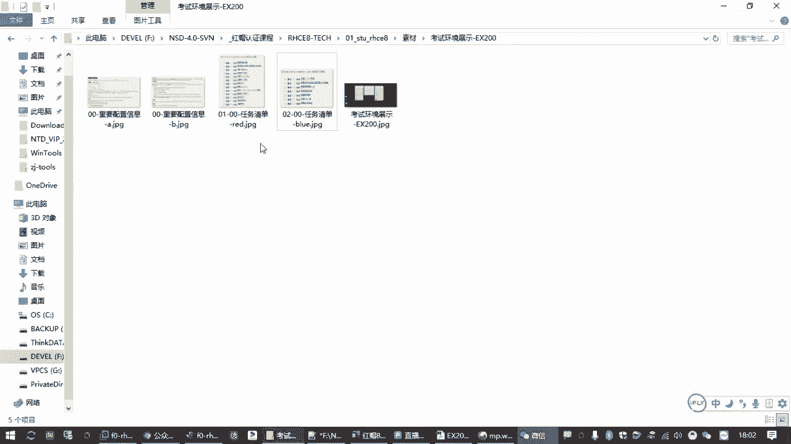

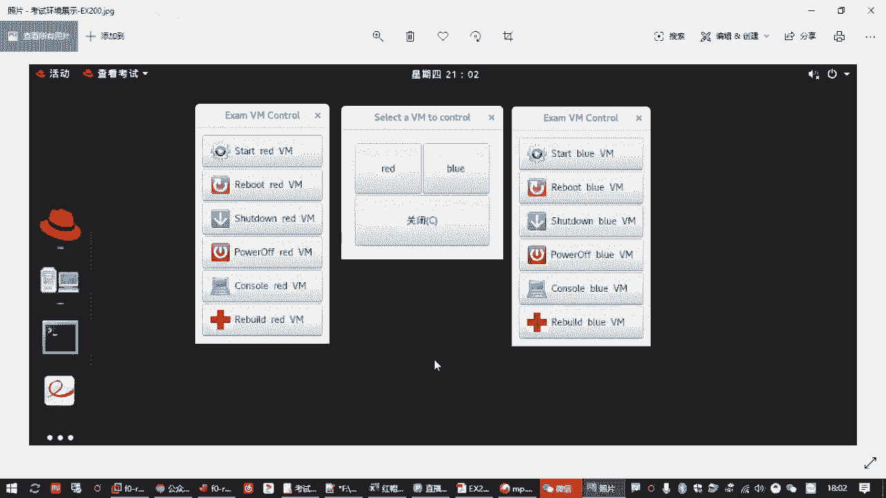

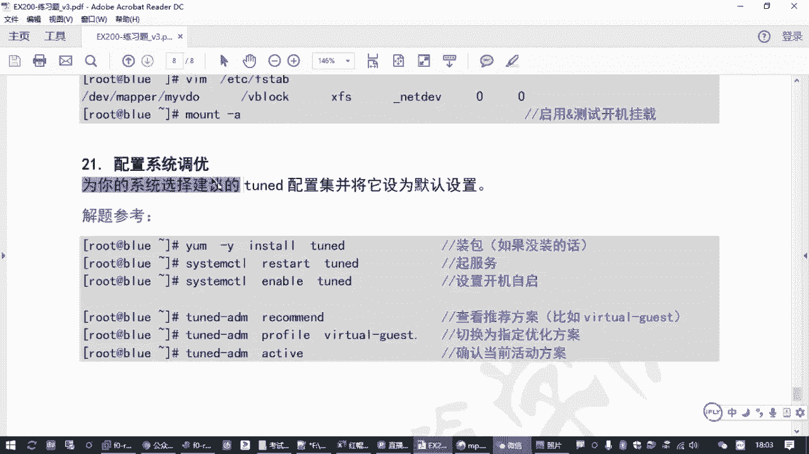

## ✅ 交卷前的检查与考场纪律

完成所有题目后，在交卷前进行系统性的检查至关重要。

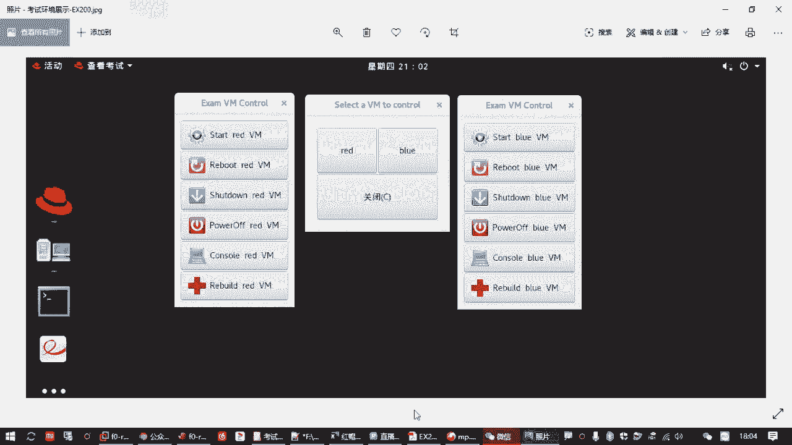

**最终检查流程**：
1.  在物理机桌面上，使用虚拟机控制器将两台虚拟机关机。
2.  重新启动两台虚拟机。
3.  通过SSH重新连接到虚拟机，逐项验证所有题目的要求是否仍然满足（例如，服务是否运行、挂载是否存在、配置是否生效）。
4.  确认无误后，即可告知考官交卷。

**严格的考场纪律**：
*   **证件与物品**：考试时需将身份证放在桌面备查。只能携带一支笔，考场会提供草稿纸。**交卷后，草稿纸必须留在座位上**，不得带出考场，否则可能被视为作弊。
*   **禁止作弊**：严禁使用手机、资料，严禁交头接耳或讨论试题。红帽对作弊处罚非常严厉，包括3年禁考甚至终身禁考。
*   **保密协议**：考试结束后，不得与任何人讨论考试具体内容。

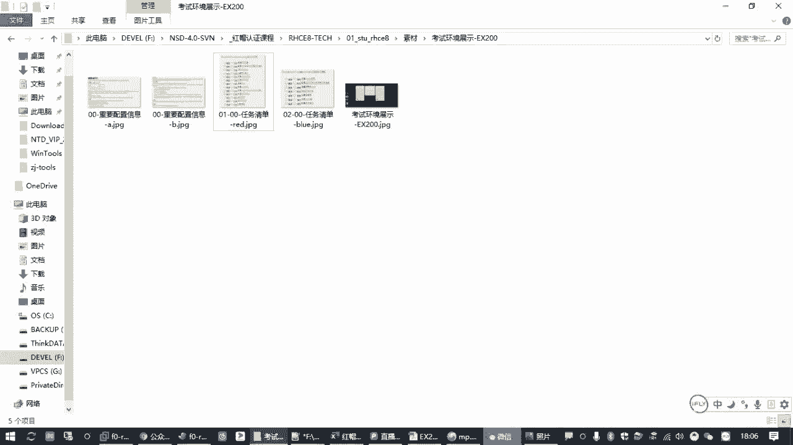

## 📊 模拟考试与成绩查询

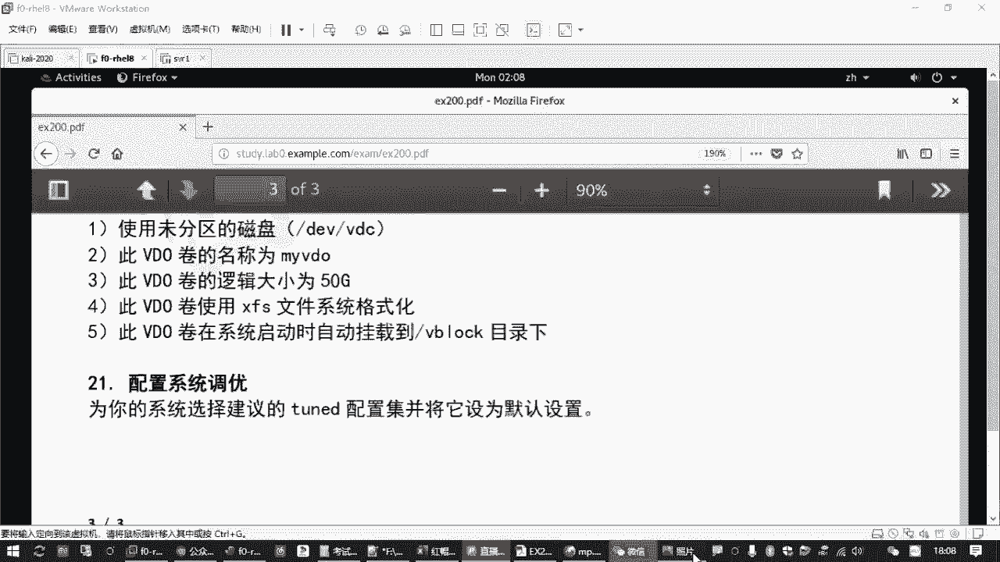

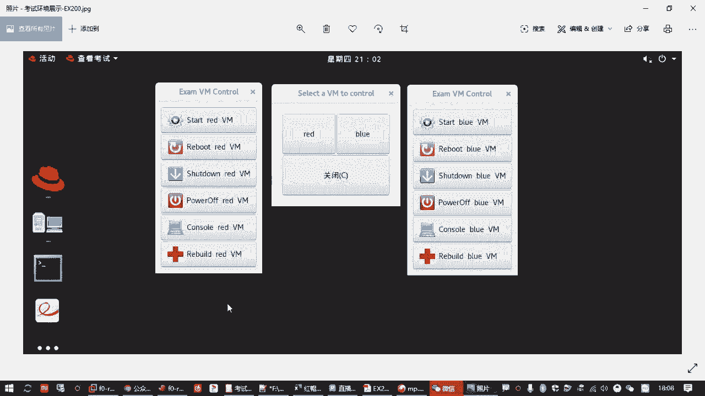

最后，我们介绍一下如何通过模拟考试进行自我检测，以及考后如何查询成绩。

**如何进行模拟考试**：
1.  使用提供的练习环境，严格按照题目要求（如 `study.lab.example.com`）进行操作，期间不查看任何资料。
2.  答题完成后，使用评测脚本检查结果。通常脚本名为 `RHT-lab-check` 或类似，运行后它会检查每道题的配置并给出对错提示。
3.  **目标**：反复练习，直到能在1小时内完成所有题目，且评测脚本显示全部为绿色对勾（通过）。

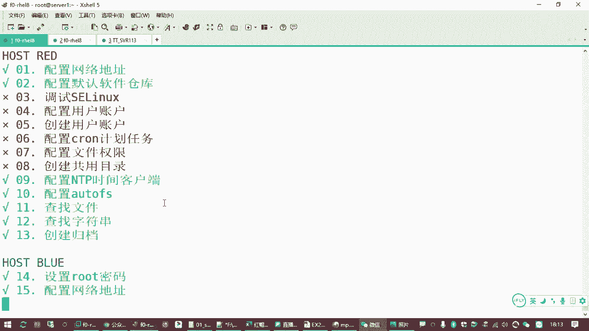

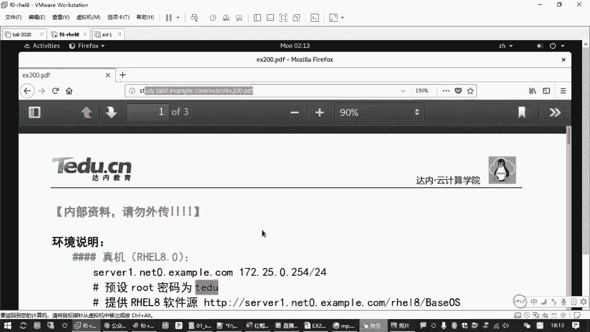

**成绩查询**：
*   考试结束后，通常需要**3个美国工作日**，你会收到红帽官方发送的电子邮件通知成绩。
*   登录红帽认证网站，即可查看详细的成绩报告。

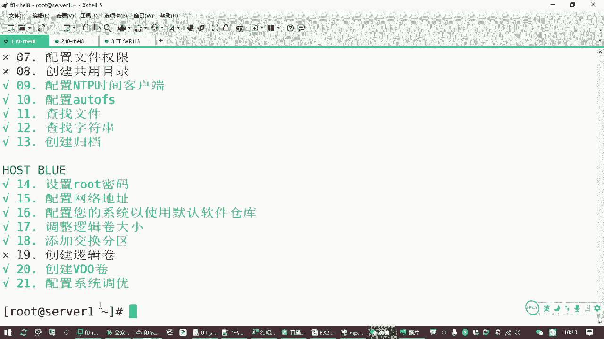

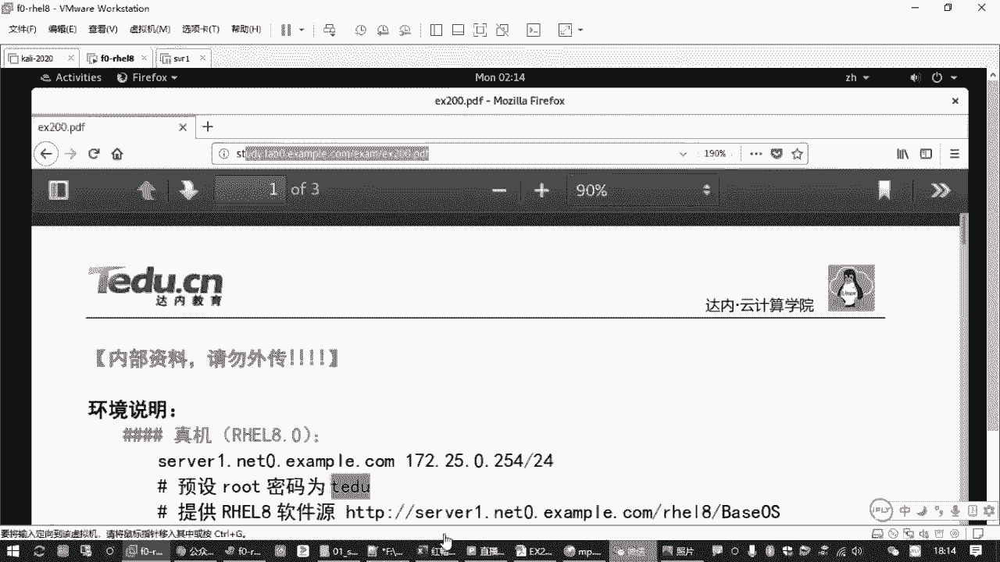

---

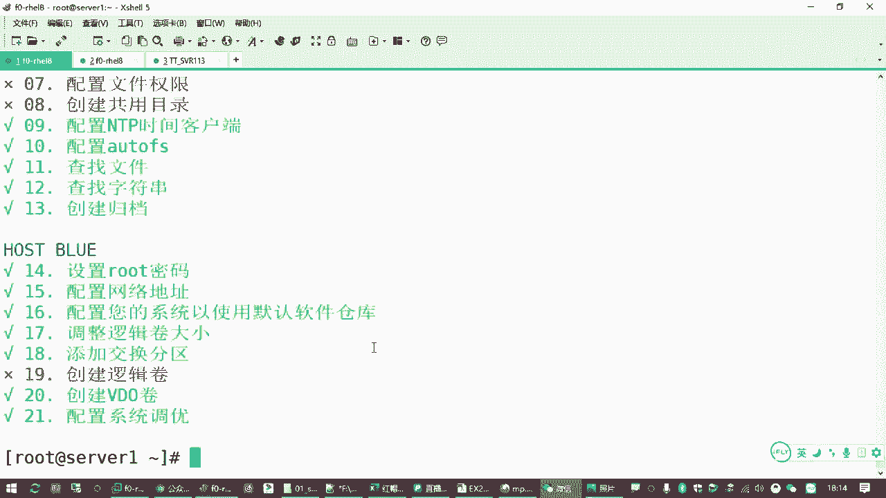

本节课中我们一起学习了RHCSA上午考试的全流程，从考试环境、界面操作、信息获取，到虚拟机管理、答题策略、核心考点回顾，以及考前的最终检查和必须遵守的考场纪律。记住，充分练习、熟悉流程、仔细阅读题目是成功通过考试的关键。祝你考试顺利！