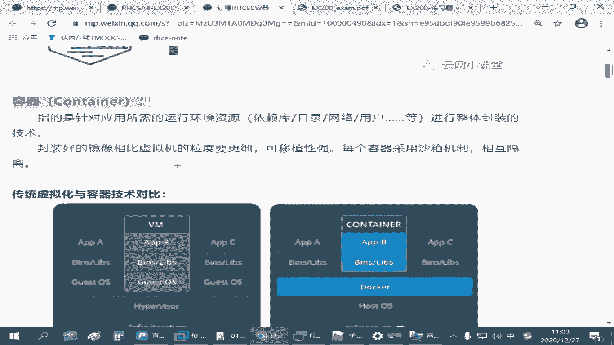
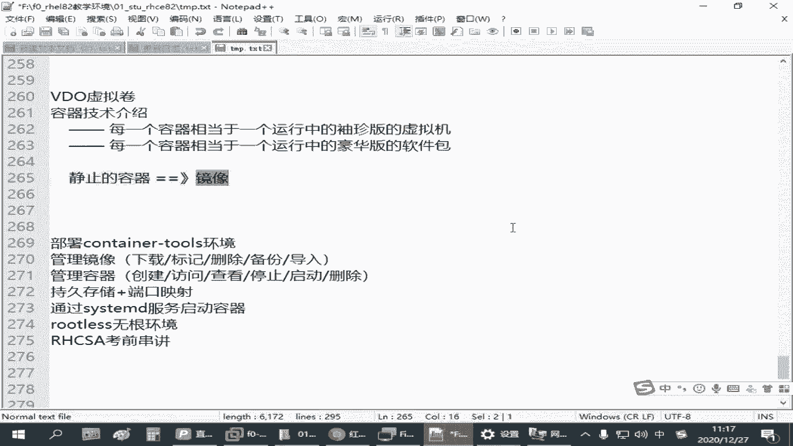
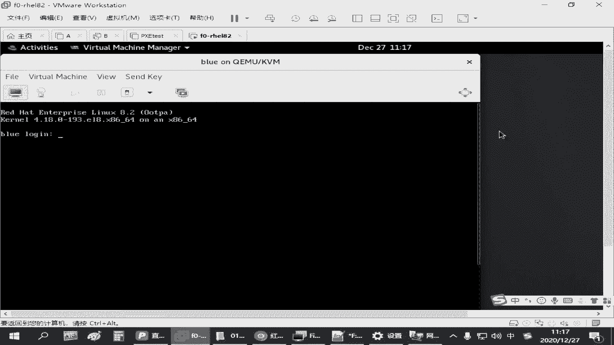
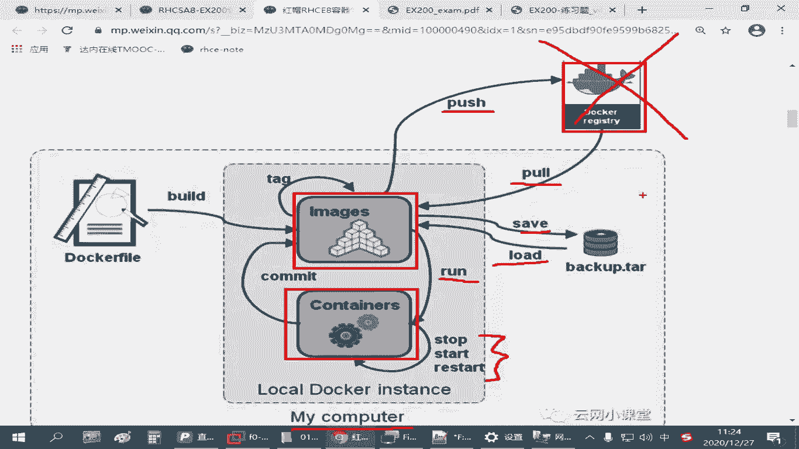

# 红帽认证RHCSA精讲教程：P24：4.01-容器技术介绍 🐳

在本节课中，我们将学习容器技术的基本概念。我们将了解什么是容器，它与传统虚拟机的区别，以及容器技术中的核心组件：镜像、容器和仓库。掌握这些基础知识，是后续学习使用 `podman` 工具管理容器的基础。

## 容器技术概述

容器技术是一种应用封装和交付技术。它可以将一个应用及其所需的运行环境（如软件包、库、配置文件、网络设置等）打包成一个独立的、可移植的单元。

在红帽企业 Linux 8 系统中，使用 `podman` 工具来管理容器。`podman` 可以看作是 `docker` 命令的替代品，大部分操作命令是兼容的，但功能更完整，执行效率可能更高。

## 容器与虚拟机的对比 🖥️ vs 📦

为了更好地理解容器，我们将其与传统的虚拟机技术进行对比。

以下是两者的核心区别：

*   **虚拟机**：每个虚拟机都包含完整的客户机操作系统、应用程序及其依赖。它运行在虚拟化层（Hypervisor）之上，对底层硬件进行虚拟化。
    *   **优点**：隔离性极强，可以运行不同的操作系统（如 Windows, Linux）。
    *   **缺点**：资源占用大（每个VM都需要完整的OS），启动较慢。
*   **容器**：容器共享宿主机的操作系统内核，但拥有独立的用户空间（如文件系统、进程、网络）。它只包含应用及其运行依赖。
    *   **优点**：轻量、快速启动、资源利用率高、更易于迁移和扩展。
    *   **缺点**：隔离性弱于虚拟机（因为共享内核），通常只能运行与宿主机相同内核的操作系统（如 Linux）。

我们可以用一个简单的比喻来理解：虚拟机好比是一栋独立的房子，有自己的地基（操作系统）；而容器则像是公寓楼里的一个房间，共享整栋楼的地基（宿主机内核），但拥有自己独立的室内空间（应用环境）。

## 核心概念解析

上一节我们介绍了容器的基本思想，本节中我们来看看构成容器技术的三个核心概念：镜像、容器和仓库。

### 镜像 (Image) 📷

镜像是容器的静态模板或“蓝图”。它是一个只读的文件，包含了运行容器所需的所有内容：代码、运行时、库、环境变量和配置文件。

*   **特点**：静止的、可存储、可传输。
*   **类比**：虚拟机的安装光盘（`.iso` 文件），或者软件包的安装包（`.rpm` 文件）。

### 容器 (Container) 🚀

容器是镜像的运行实例。当你启动一个镜像时，就创建了一个容器。容器是动态的、可操作的实体。

*   **特点**：运行中的、活动的、可交互。
*   **类比**：从光盘安装好并正在运行的虚拟机，或者安装并正在运行的软件。

**关系**：**镜像是定义，容器是实例**。你可以从一个镜像创建多个容器，就像可以用一个软件安装包在多台电脑上安装软件一样。

### 仓库 (Registry) 🏪

仓库是集中存储和分发镜像的地方。你可以从仓库拉取（下载）镜像到本地，也可以将本地构建的镜像推送（上传）到仓库。

*   **常见公共仓库**：
    *   Docker Hub: `docker.io`
    *   Red Hat 容器仓库: `registry.access.redhat.com`
    *   考试环境可能使用内部仓库，如 `registry.lab.example.com`
*   **私有仓库**：企业可以搭建自己的私有仓库来存储内部镜像。

**关系**：**仓库是镜像的“应用商店”**。`podman` 或 `docker` 从仓库获取镜像，然后用镜像来创建容器。

## 基本工作流程 🔄

理解了核心概念后，我们来看看它们是如何协同工作的。以下是使用容器的一个典型流程：

以下是关键操作命令的示例：

1.  **从仓库拉取镜像**：`podman pull <镜像名称>`
    *   例如：`podman pull nginx:latest`
2.  **运行容器**：`podman run <选项> <镜像名称>`
    *   例如：`podman run -d -p 80:80 --name myweb nginx`
3.  **管理容器生命周期**：
    *   停止容器：`podman stop <容器名/ID>`
    *   启动容器：`podman start <容器名/ID>`
    *   重启容器：`podman restart <容器名/ID>`
4.  **镜像导入/导出**（用于离线分享）：
    *   导出镜像为文件：`podman save -o nginx.tar nginx:latest`
    *   从文件导入镜像：`podman load -i nginx.tar`

## 容器技术的优势 ✨

基于以上的介绍，容器技术主要带来以下好处：

*   **一致性环境**：确保应用在开发、测试、生产环境中的行为一致。
*   **快速部署与扩展**：秒级启动，易于快速复制和横向扩展。
*   **资源高效**：共享内核，无需为每个应用负载完整的操作系统，节省内存和存储。
*   **简化配置**：将环境配置固化在镜像中，一键部署。
*   **良好的隔离性**：容器间的进程、文件系统、网络相对隔离，比直接部署在宿主机上更安全。

## 总结

本节课中我们一起学习了容器技术的基础知识。我们首先了解了容器作为一种轻量级虚拟化技术的定位，然后重点剖析了其三个核心概念：**镜像**（静态模板）、**容器**（运行实例）和**仓库**（镜像商店）。通过对比传统虚拟机，我们明确了容器轻量、快速、高效的特点。最后，我们梳理了从拉取镜像到运行容器的基本工作流程。理解这些概念是后续深入学习 `podman` 命令和应对相关考试题目的关键。