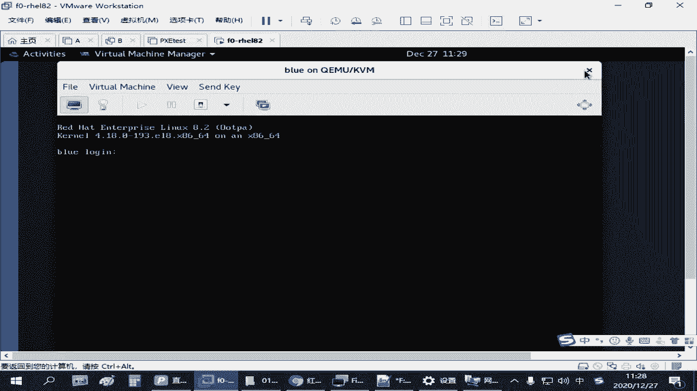
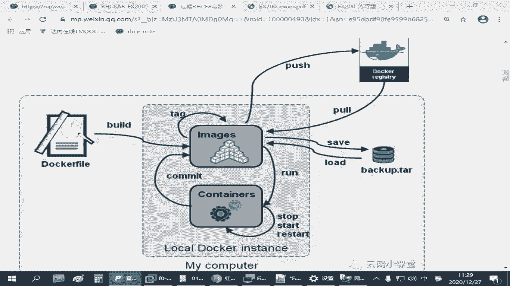
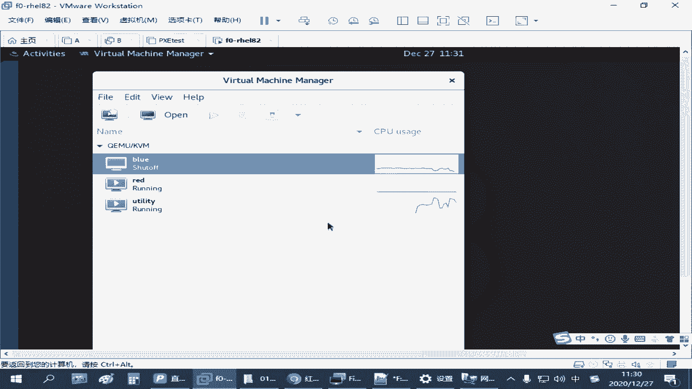
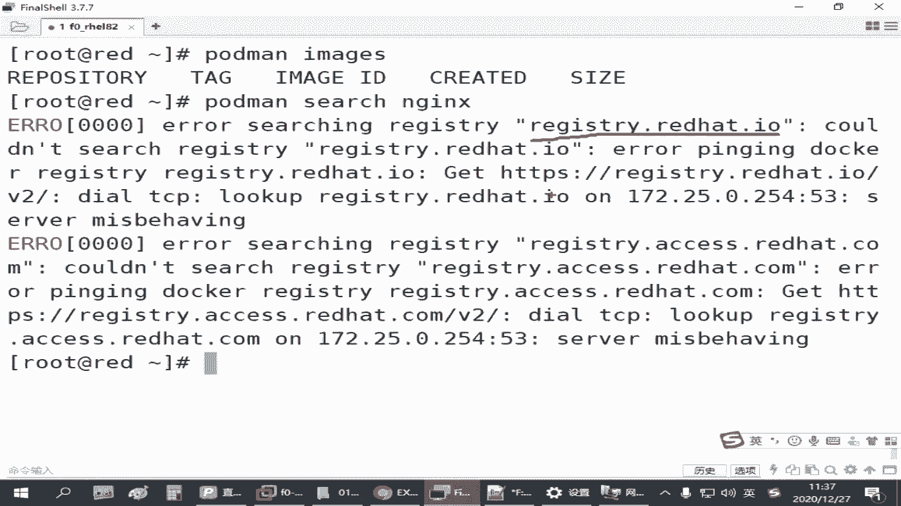
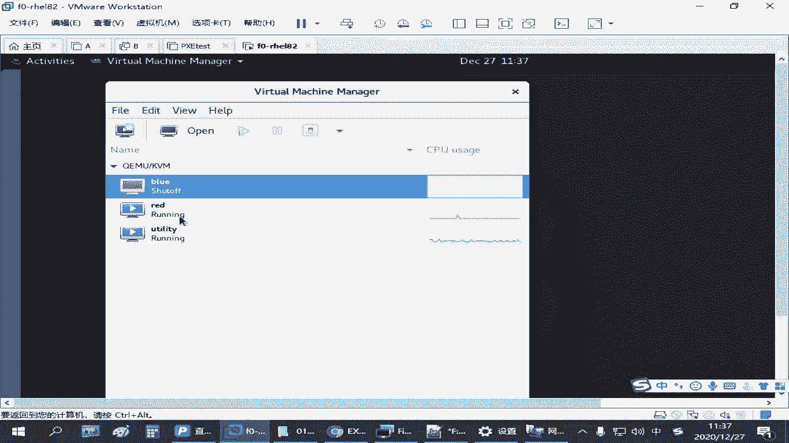

# 红帽认证RHCSA精讲教程：P25：4.02-仓库环境配置 🛠️






在本节课中，我们将学习如何在红帽练习环境中配置容器仓库。这是使用和管理容器的基础，我们将从启动仓库服务器开始，到安装必要的工具，最后配置并成功下载一个容器镜像。

## 仓库服务器准备 🖥️

上一节我们介绍了容器的基础概念，本节中我们来看看如何准备一个可用的仓库环境。



在红帽练习环境中，已经预先准备了一个名为 `utility` 的虚拟机。这个虚拟机的作用是作为私有容器仓库服务器。它默认存在于环境中，但处于关闭状态。

这个虚拟机无法还原，因此请勿将其删除。我们无需对其进行任何复杂的配置修改。

由于该虚拟机占用资源较多（内存约4GB以上），为了节省系统资源，在平时不练习容器相关操作时，它被设置为默认关闭。当你需要下载容器镜像时，才需要启动它。下载完成后，可以再次将其关闭以释放资源。

在考试或练习时，可以根据自己主机的性能决定运行哪些虚拟机。如果主机性能足够，可以同时运行所有需要的虚拟机。

## 安装容器环境 📦

准备好仓库服务器后，我们需要在练习主机（例如 `servera`）上安装使用容器所需的软件包。

首先，请确保你的系统已正确配置YUM软件源。配置完成后，即可安装容器环境。

安装容器环境需要使用模块化安装命令，这与普通的 `yum install` 略有不同。

以下是安装步骤：

1.  **安装核心容器工具**：使用以下命令安装 `containers-tools` 模块。
    ```bash
    yum module install -y container-tools
    ```
    这个命令会安装 `podman` 等核心容器管理工具及其相关配置。



2.  **（可选）安装Docker兼容工具**：如果你习惯使用Docker命令，可以安装 `podman-docker` 包以实现命令兼容。
    ```bash
    yum install -y podman-docker
    ```
    **注意**：此步骤在考试中不是必需的，考试使用 `podman` 命令即可。



安装完成后，核心的管理工具就是 `podman`。

## 配置仓库连接 🔗

安装好环境后，默认情况下 `podman` 会尝试连接红帽的官方仓库。为了连接我们自己的私有仓库，需要进行配置。

配置主要通过修改一个配置文件来完成。

以下是配置步骤：

1.  **修改仓库配置文件**：配置文件路径为 `/etc/containers/registries.conf`。你需要编辑此文件。
2.  **指定搜索仓库**：在配置文件中找到 `[registries.search]` 段落。将 `registries` 的值修改为我们的私有仓库地址，例如 `registry.lab.example.com`。如果有多个地址，用引号括起来并用逗号分隔。
    ```ini
    registries = ['registry.lab.example.com']
    ```
3.  **信任不安全仓库**：由于私有仓库可能使用自签名证书，`podman` 默认会拒绝连接。需要在 `[registries.insecure]` 段落中，将仓库地址添加进去，以表示信任此仓库。
    ```ini
    registries = ['registry.lab.example.com']
    ```

完成以上两项配置后保存文件，`podman` 就能正确连接并信任我们的私有仓库了。

## 镜像管理操作 🖼️

配置好仓库连接后，我们就可以进行镜像的搜索、下载和查看了。`podman` 是完成这些操作的核心命令。

以下是常用的镜像管理命令：

*   **搜索镜像**：使用 `podman search` 命令在配置的仓库中查找镜像。例如，搜索 `nginx` 镜像。
    ```bash
    podman search nginx
    ```
*   **下载镜像**：使用 `podman pull` 命令下载镜像。需要指定完整的镜像地址，通常格式为 `仓库地址/镜像名:标签`。
    ```bash
    podman pull registry.lab.example.com/nginx:latest
    ```
*   **列出本地镜像**：使用 `podman images` 命令查看所有已下载到本地的镜像。
    ```bash
    podman images
    ```
    该命令会显示镜像的仓库来源、标签（Tag）、镜像ID、大小和创建时间等信息。

**关于镜像标签**：镜像名后跟的标签（如 `:latest`）用于区分不同版本。同一个镜像（如 `nginx`）可以同时存在多个标签（如 `:1.19`, `:1.17`）的版本。使用 `仓库/镜像名:标签` 的格式可以唯一指定一个镜像。

下载的镜像默认存储在 `/var/lib/containers/` 目录下。

## 总结 📝


本节课中我们一起学习了容器仓库环境的配置。我们首先启动了作为私有仓库的 `utility` 虚拟机，然后在练习主机上使用 `yum module install` 安装了 `container-tools`。接着，我们通过编辑 `/etc/containers/registries.conf` 配置文件，指定了仓库地址并添加了信任设置。最后，我们使用 `podman search`、`podman pull` 和 `podman images` 命令完成了镜像的搜索、下载和查看操作。现在，你的环境已经准备好进行后续的容器运行与管理练习了。