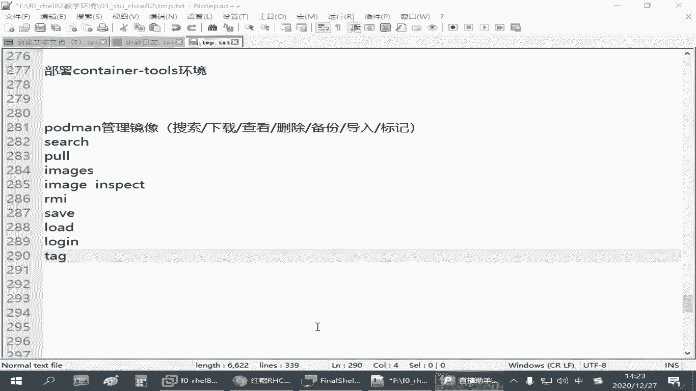
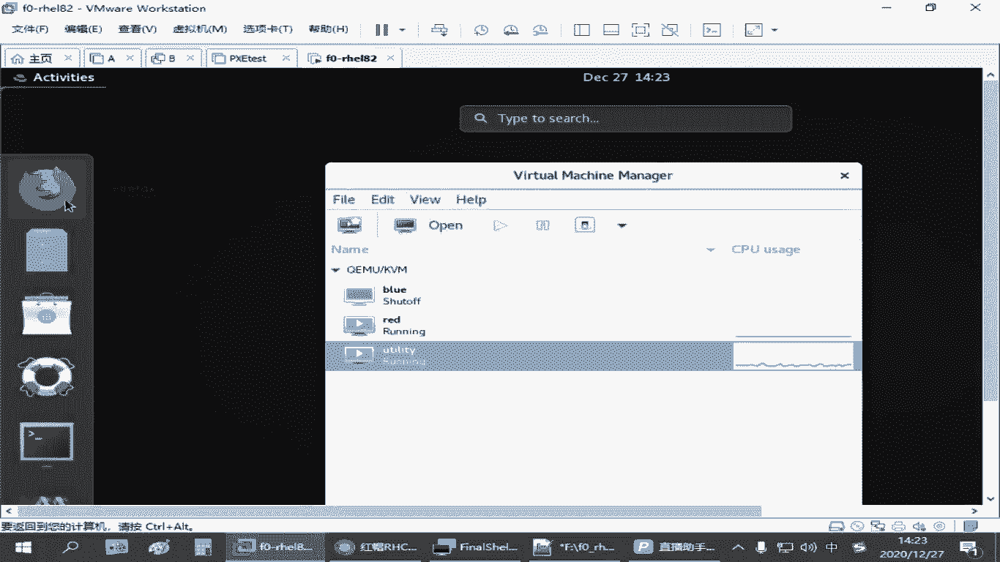
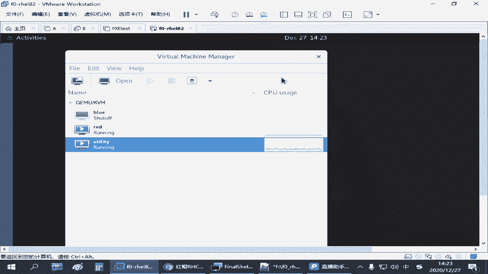
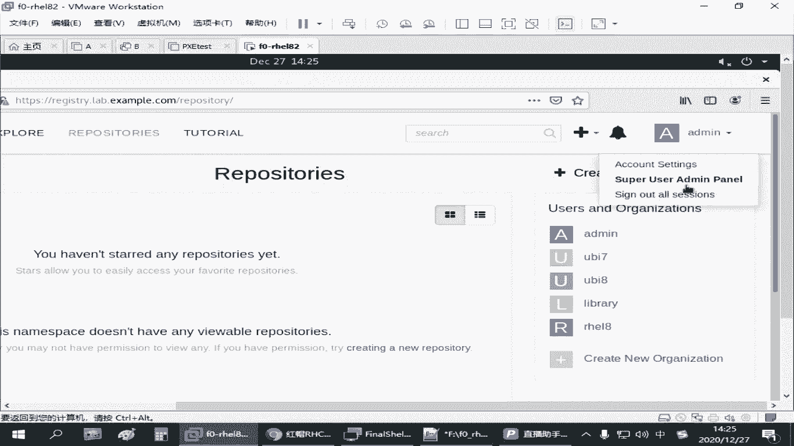

# Podman容器管理：P26：4.03-podman镜像操作

在本节课中，我们将学习如何使用Podman管理容器镜像。我们将涵盖搜索、下载、查看、删除、备份和导入镜像等核心操作，并了解如何登录到镜像仓库。这些是管理容器环境的基础技能。

## 搜索镜像

要搜索可用的容器镜像，可以使用 `podman search` 命令。该命令后跟关键词，用于在配置的镜像仓库中查找相关镜像。

以下是搜索镜像的基本语法：
```bash
podman search <关键词>
```

## 下载镜像

搜索到所需镜像后，可以使用 `podman pull` 命令将其下载到本地环境。

以下是下载镜像的基本语法：
```bash
podman pull <镜像名称>
```
其中，`<镜像名称>` 通常包含仓库地址和镜像标签，例如 `registry.lab.example.com/nginx:latest`。

## 列出本地镜像

要查看当前系统中已下载的所有镜像，可以使用 `podman images` 命令。

以下是列出镜像的命令：
```bash
podman images
```

## 查看镜像详细信息

如果想查看某个镜像的详细配置信息，例如其基于的操作系统、创建时间等，可以使用 `podman image inspect` 命令。

以下是查看镜像详情的语法：
```bash
podman image inspect <镜像名称>
```

## 删除镜像

当不再需要某个镜像时，可以使用 `podman rmi` 命令将其从本地删除。

以下是删除镜像的语法：
```bash
podman rmi <镜像名称>
```
为了准确删除，建议使用完整的镜像名称（包含标签），例如 `podman rmi registry.lab.example.com/nginx:latest`。

## 登录镜像仓库

某些镜像仓库需要身份验证才能进行上传或下载操作。这时，可以使用 `podman login` 命令登录。

以下是登录仓库的语法：
```bash
podman login <仓库地址>
```
执行后，系统会提示输入用户名和密码。登录成功后，即可与需要认证的仓库进行交互。请注意，对于大多数公共镜像的下载操作，通常不需要登录。

## 备份与导入镜像

上一节我们介绍了镜像的基本管理，本节中我们来看看如何备份本地镜像以及如何导入已备份的镜像文件。

### 备份（导出）镜像

要将本地镜像备份为一个文件，可以使用 `podman save` 命令。这常用于迁移或分享镜像。

以下是备份镜像的语法，其中 `-o` 参数指定输出文件：
```bash
podman save -o <备份文件路径> <镜像名称>
```
例如，`podman save -o /root/nginx.tar registry.lab.example.com/nginx:latest` 会将镜像保存到指定路径。

### 导入镜像

当需要从备份文件恢复镜像时，可以使用 `podman load` 命令。这在无法直接连接镜像仓库时非常有用。

以下是导入镜像的语法，其中 `-i` 参数指定输入文件：
```bash
podman load -i <备份文件路径>
```
导入时，可以为其指定一个新的名称和标签，例如 `podman load -i /root/nginx.tar nginx:myversion`。

## 修改镜像标签





在管理镜像时，有时需要修改其名称或标签。这可以通过 `podman tag` 命令实现。



以下是修改镜像标签的语法：
```bash
podman tag <原镜像名称> <新镜像名称>
```
例如，`podman tag nginx:latest mynginx:v1` 会创建一个指向原镜像的新标签。

## 通过Web界面访问仓库

除了命令行，还可以通过浏览器访问镜像仓库的Web界面进行查看和管理。例如，访问 `http://registry.lab.example.com` 并使用相应凭证（如 `admin` / `redhat321`）登录后，可以浏览仓库中所有可用的镜像。这提供了一个直观的方式来查找镜像，但下载等操作仍需在命令行中完成。

---



本节课中我们一起学习了Podman镜像管理的核心操作，包括搜索、拉取、查看、删除、备份、导入镜像以及登录仓库和修改标签。掌握这些命令是有效使用容器技术的基础。