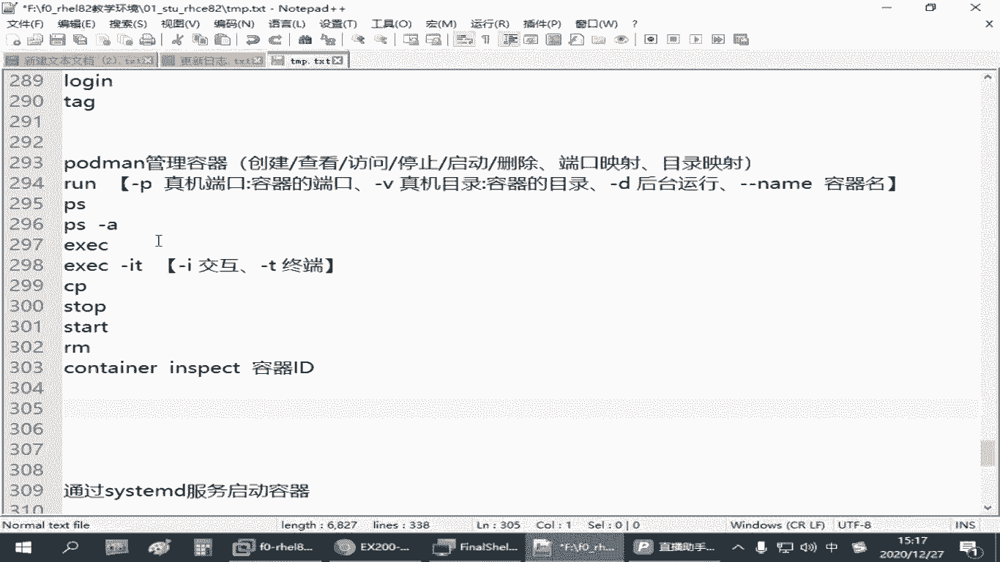
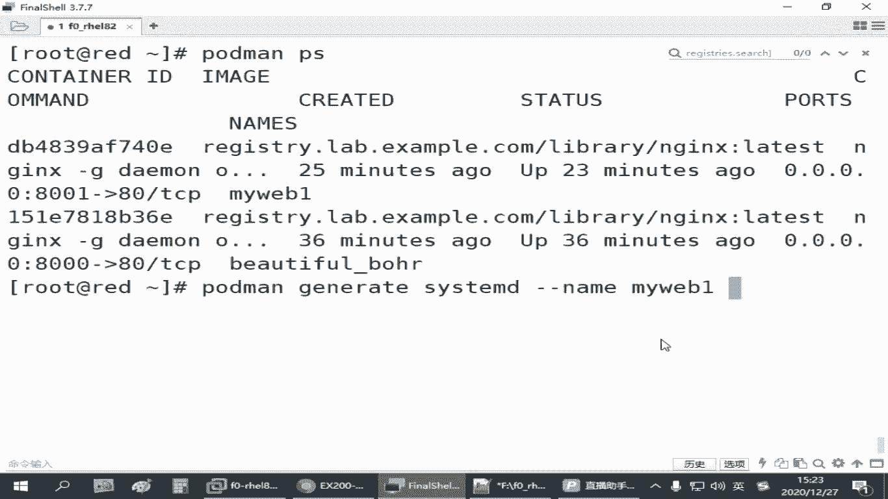
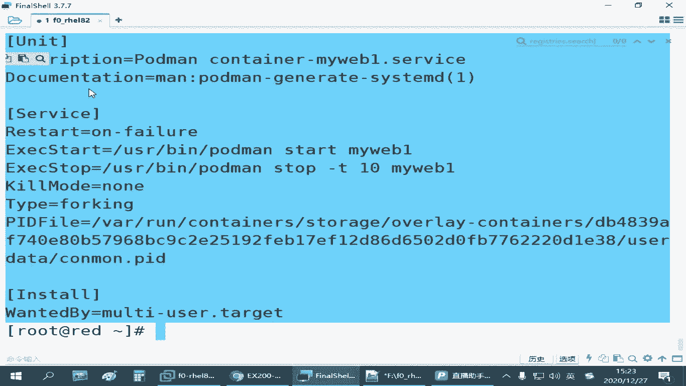
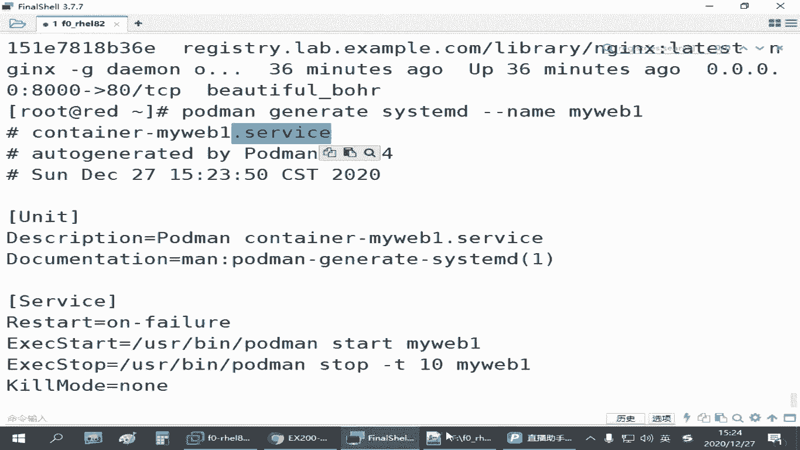
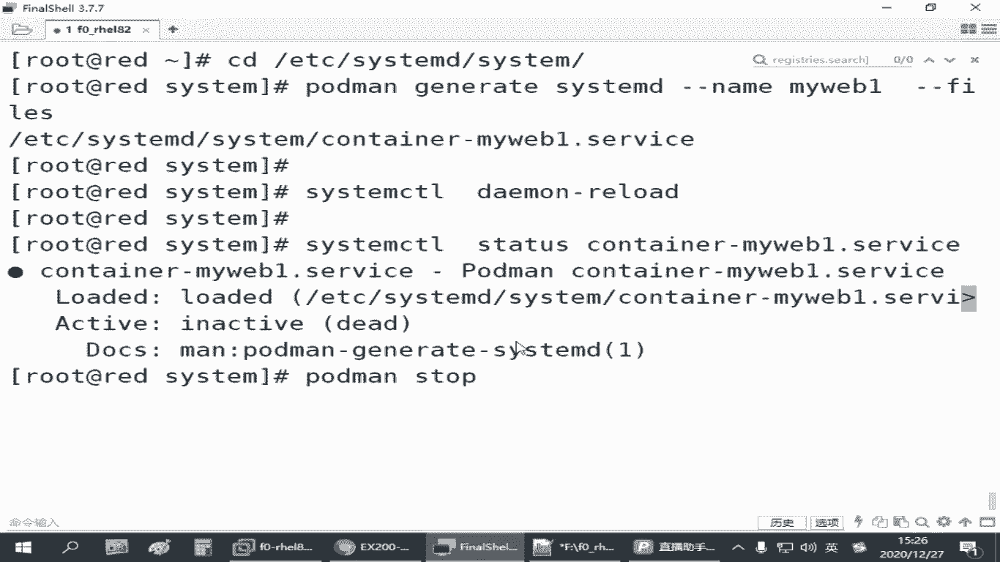
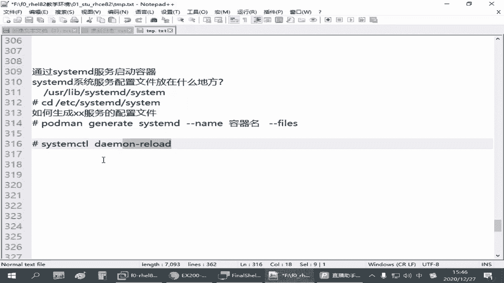

# 容器管理：4.05：容器服务化 🚀



在本节课中，我们将学习如何将手动运行的容器配置为系统服务，实现容器的开机自启动，从而简化运维管理。

上一节我们介绍了容器的基本操作，包括从仓库拉取镜像并运行容器。本节中我们来看看如何让容器像系统服务一样，在主机重启后自动运行。

## 容器服务化的必要性

手动运行的容器是临时的。例如，我们之前通过 `podman run` 命令在8001端口运行了一个Nginx容器。如果Red Hat主机重启，这个容器不会自动恢复，需要管理员再次手动执行那条冗长的命令。在实际工作中，命令参数可能更复杂，重复操作效率低下。

因此，我们需要实现**容器的服务化**，即将运行容器的命令转化为一个系统服务，让主机在开机时能自动启动容器。

## 系统服务配置基础

要通过SystemD服务启动容器，需要了解两个关键点：
1.  Linux系统服务的配置文件存放位置。
2.  如何快速生成特定服务的配置文件。



以下是Linux系统服务配置文件的常见存放目录：
*   `/usr/lib/systemd/system/`：存放系统原始的、由软件包安装的服务配置文件。
*   `/etc/systemd/system/`：建议管理员将自定义的系统服务配置文件放在此目录。



服务配置文件通常以 `.service` 作为后缀。我们需要在 `/etc/systemd/system/` 目录下为容器创建一个服务配置文件。



## 生成容器服务配置

Podman提供了生成服务配置的命令，无需手动编写复杂的配置。

以下是操作步骤：
1.  首先，确保目标容器正在运行。我们可以使用 `podman ps` 命令查看，例如我们之前创建的名为 `myweb1` 的容器。
2.  切换到系统服务配置目录：`cd /etc/systemd/system/`。
3.  使用 `podman generate systemd` 命令为正在运行的容器生成配置。命令格式为：
    ```bash
    podman generate systemd --name <容器名> --files
    ```
    其中，`--name`（可简写为 `-n`）指定容器名，`--files` 参数表示将生成的配置直接保存为文件。



例如，为容器 `myweb1` 生成服务配置并保存：
```bash
cd /etc/systemd/system/
podman generate systemd --name myweb1 --files
```
执行后，会在当前目录生成一个名为 `container-myweb1.service` 的配置文件。

## 启用并管理容器服务

生成配置文件后，需要通知系统加载新的服务配置。

以下是后续操作流程：
1.  **重新加载SystemD配置**：执行 `systemctl daemon-reload`，让系统识别新添加的服务。
2.  **停止原手动容器**：使用 `podman stop myweb1` 停止之前手动运行的容器。**注意**：请使用 `stop` 停止而非 `rm` 删除，否则服务会因找不到容器而失败。
3.  **使用服务方式启动容器**：现在可以通过系统服务命令管理容器了。
    *   启动服务：`systemctl start container-myweb1.service`
    *   查看状态：`systemctl status container-myweb1.service`
    *   停止服务：`systemctl stop container-myweb1.service`
    *   重启服务：`systemctl restart container-myweb1.service`
4.  **设置开机自启**：执行 `systemctl enable container-myweb1.service`，将服务设置为开机自动运行。
5.  **验证**：重启主机后，可以直接访问容器的服务（如 `curl localhost:8001`）来验证是否成功自启。如果从网络访问，请确保主机防火墙已开放相应端口（如8001）。

## 总结



本节课中我们一起学习了容器服务化的完整流程。关键步骤是：先运行容器，然后使用 `podman generate systemd` 命令在 `/etc/systemd/system/` 目录下生成服务配置文件，接着执行 `systemctl daemon-reload` 加载配置，最后便可以使用 `systemctl` 命令来启停、管理容器，并通过 `enable` 设置开机自启。这大大提升了容器管理的自动化程度和运维效率。