# RHCSA认证精讲教程：P29：4.06：Rootless无根环境 🐳

在本节课中，我们将要学习Rootless（无根）容器环境。这是指在没有管理员（root）权限的情况下，普通用户如何运行和管理容器。这对于系统安全和多用户环境非常重要。

上一节我们介绍了管理员如何管理容器服务，本节中我们来看看普通用户如何操作。

## 核心概念与限制

Rootless环境的核心是允许**非root用户**通过系统服务来启用和管理容器。这与管理员操作的主要区别在于权限和资源隔离。

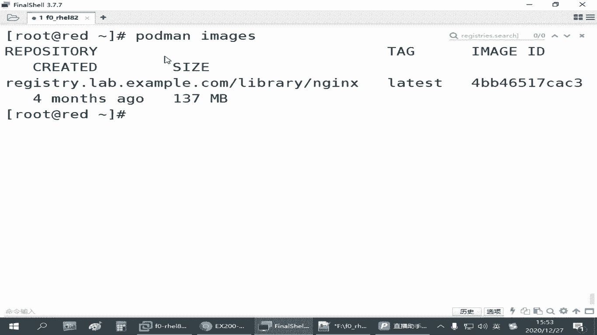

以下是普通用户运行容器时需要注意的几个关键点：


*   **端口限制**：普通用户默认只能使用1024以上的端口。1024以下的端口是系统保留范围。
*   **容器运行**：普通用户默认被允许运行容器，因为容器本身提供了隔离环境。
*   **服务管理**：普通用户需要管理自己的系统服务，这与管理员的系统服务是**完全隔离**的。

## 配置目录与操作差异


普通用户的系统服务配置目录位于其家目录下的一个特殊路径：
`~/.config/systemd/user/`

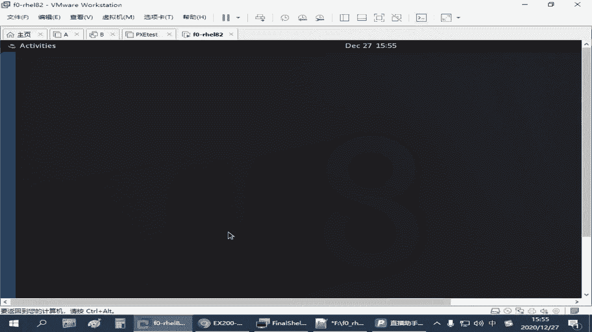

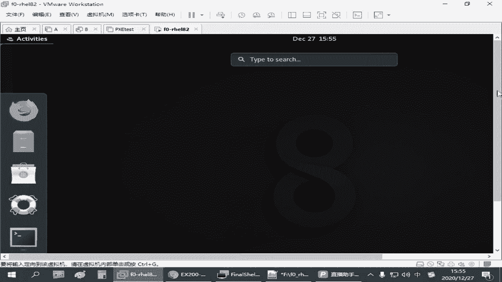

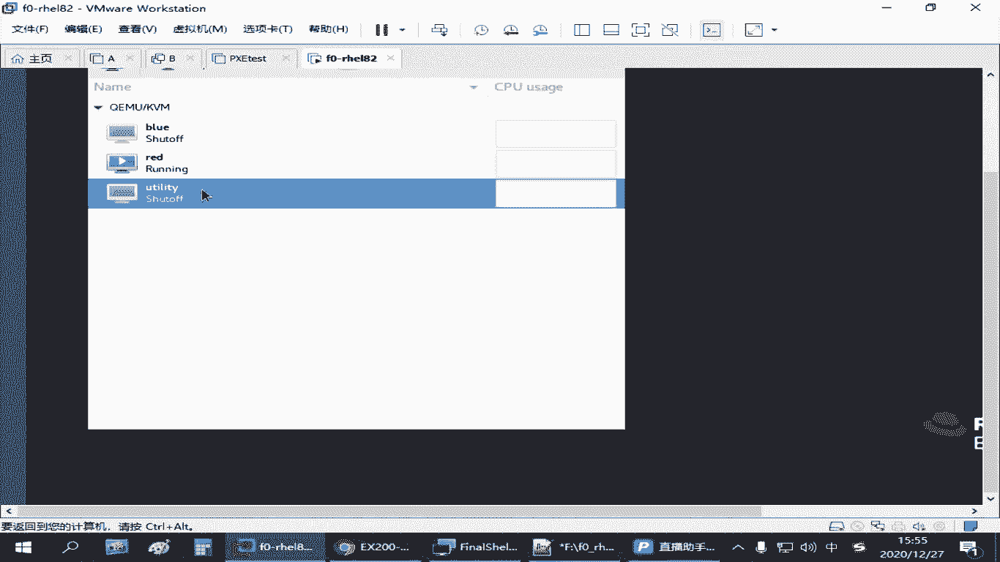

我们需要将服务配置文件放在这个目录下。用户的容器数据也存储在其独立的目录中，例如 `~/.local/share/containers/`，这意味着与管理员的容器存储是分开的。

因此，管理员下载的镜像（例如 `nginx`）对普通用户是不可见的，普通用户需要自己重新下载。

操作容器服务时，普通用户必须使用 `--user` 参数。基本命令格式如下：
`systemctl --user [动作] [服务名]`
例如：`systemctl --user start myweb3.service`

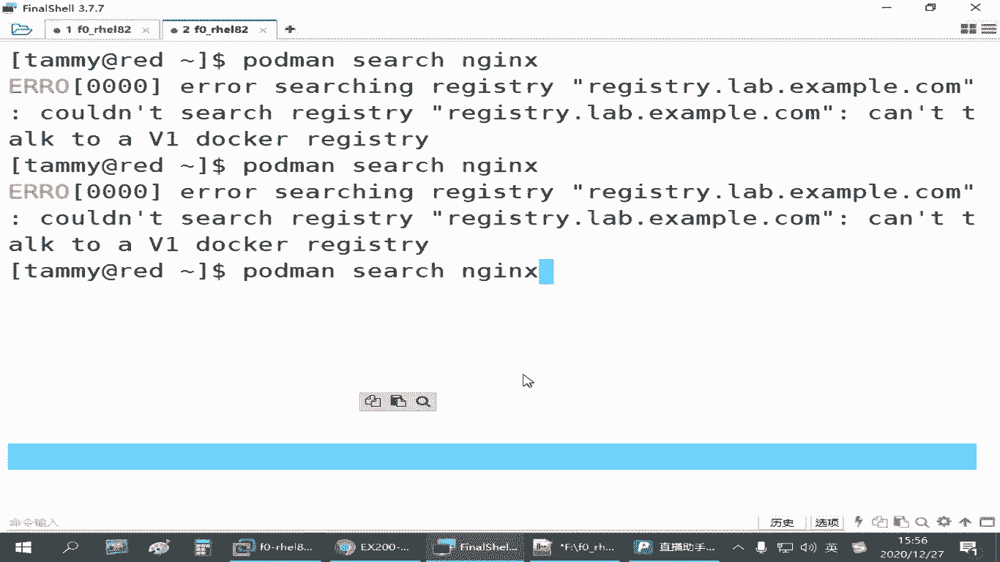

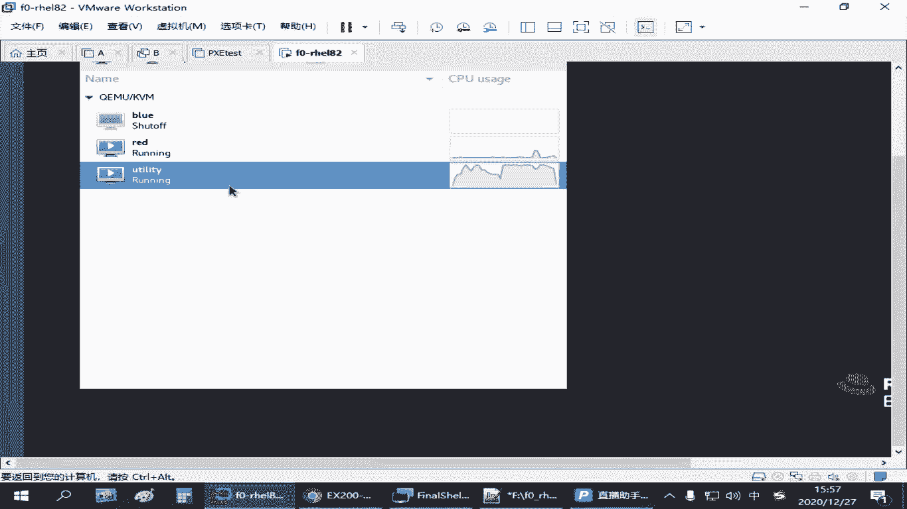

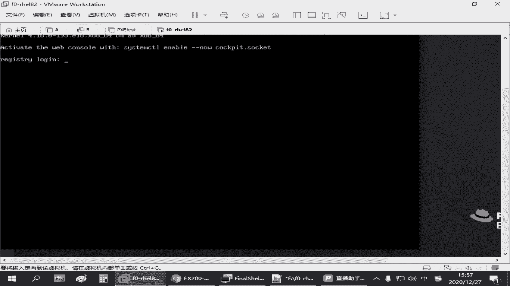

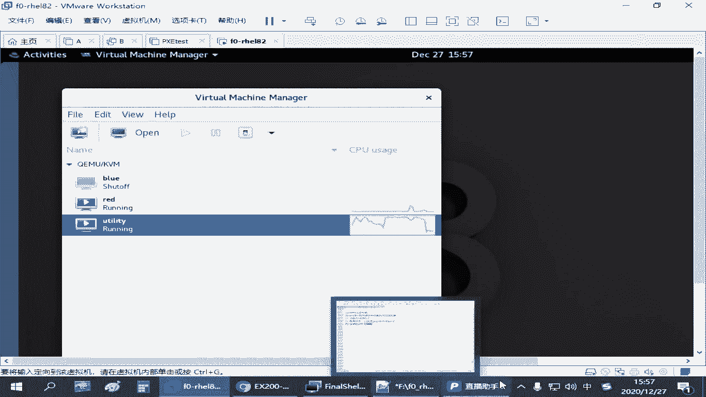

## 实战演练：普通用户运行容器服务

现在，我们以一个名为 `temi` 的普通用户为例，演示完整流程。

**第一步：准备环境与下载镜像**

1.  使用SSH直接登录到 `temi` 用户。**注意**：不能从root用户使用 `su` 切换，必须通过SSH登录，否则无根环境可能不生效。
2.  检查镜像，此时应为空：`podman images`
3.  从仓库搜索并下载 `nginx` 镜像：`podman pull nginx`

**第二步：运行测试容器**

1.  在用户家目录创建网页目录和文件：
    ```bash
    mkdir ~/container_web
    echo “temi’s site” > ~/container_web/index.html
    ```
2.  运行一个nginx测试容器，映射端口和目录：
    ```bash
    podman run -d -p 8080:80 -v ~/container_web:/usr/share/nginx/html --name myweb3 nginx
    ```
3.  测试容器是否运行成功：`curl localhost:8080`，应能看到 “temi’s site”。

**第三步：创建用户系统服务**

1.  创建用户级systemd服务配置目录：
    ```bash
    mkdir -p ~/.config/systemd/user/
    ```
2.  生成容器服务的systemd配置文件：
    ```bash
    cd ~/.config/systemd/user/
    podman generate systemd --name myweb3 --files
    ```
3.  重新加载用户systemd配置：
    ```bash
    systemctl --user daemon-reload
    ```
4.  现在可以像管理员一样管理这个服务了，但必须加上 `--user`：
    ```bash
    systemctl --user start myweb3.service
    systemctl --user enable myweb3.service # 尝试设置为开机自启
    ```

## 实现开机自启的挑战与解决方案

对于普通用户的服务，仅使用 `enable` 命令通常无法实现开机自启，因为系统启动时用户并未登录，相关资源未被分配。

红帽官方推荐的方法是启用“逗留”（lingering）功能，这需要管理员权限为用户设置：

1.  **管理员执行**：`loginctl enable-linger temi`
2.  **用户检查**：`loginctl show-user temi | grep Linger`，输出中 `Linger=yes` 表示设置成功。

如果上述方法在特定环境（如考试环境）中不生效，一个可靠的备选方案是使用**用户的Cron计划任务**。

以下是配置方法：

1.  编辑当前用户的Cron表：`crontab -e`
2.  添加一行，让系统在启动时自动启动该服务：
    ```bash
    @reboot /usr/bin/systemctl --user restart myweb3.service
    ```
    这条命令的意思是：在每次系统启动时，以当前用户的身份执行重启 `myweb3` 服务的命令。

这种方法利用了Cron的特性，即使用户未登录，`@reboot` 任务也会在启动时执行，从而可靠地启动容器服务。


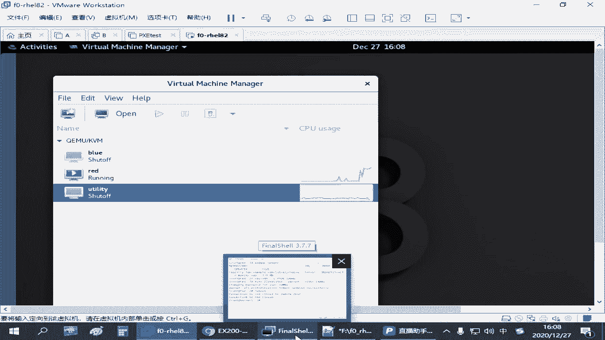

## 总结

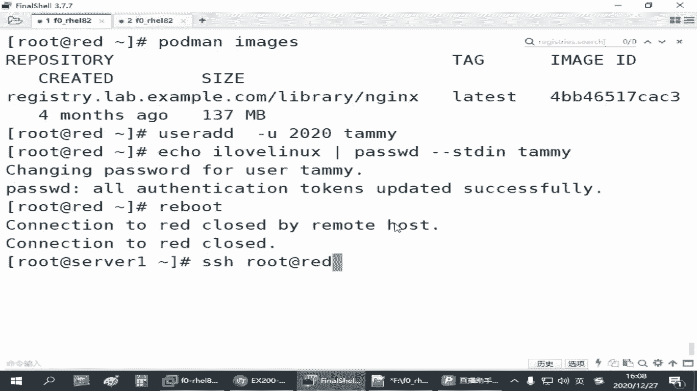

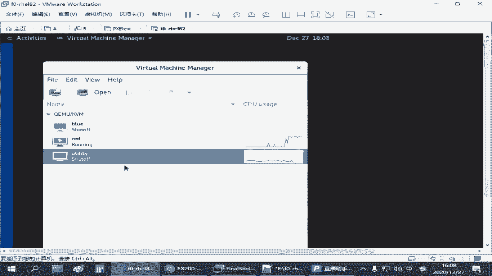

本节课中我们一起学习了Rootless无根容器环境。关键点总结如下：

*   **核心目的**：让非root用户能够安全地运行和管理容器。
*   **主要区别**：配置目录（`~/.config/systemd/user/`）、操作命令（需加 `--user` 参数）、资源（镜像、存储）与root用户完全隔离。
*   **服务自启**：普通用户的服务实现开机自启较复杂。可先尝试官方推荐的 `loginctl enable-linger` 方法。若无效，配置用户的 `@reboot` Cron任务是稳定可靠的备选方案。


通过掌握这些知识，你可以在没有管理员权限的情况下，依然有效地利用容器技术。