# RHCSA认证精讲教程：P2：1.01-Linux命令基础 📚

在本节课中，我们将要学习Linux命令行的基础知识。这是后续所有学习的基础，掌握这些概念和基本操作，能让你在管理Linux系统时更加得心应手。

## 命令行概述 💻

上一节我们介绍了课程的整体结构，本节中我们来看看Linux命令行的核心概念。

### 什么是命令行？

命令行是由管理员输入的一串字符，其作用是完成某个特定的系统任务。在按下回车键提交之前，这一串字符就构成了一个命令行。例如，输入 `ip address list` 命令可以查看网络接口的IP地址信息。

### 什么是解释器？

解释器是Linux系统中的一个特殊程序，它的作用是翻译或解释管理员提交的命令行。如果没有解释器，管理员将无法与系统内核进行有效沟通。解释器通常被称为“Shell”，其英文原意为“外壳”，因为它位于操作系统内核的外层。

**解释器的作用公式**：
```
用户命令 -> 解释器 -> 内核能理解的指令
```

在Linux系统中，默认的解释器程序通常是 `/bin/bash`。这个程序至关重要，如果被删除，用户将无法正常登录系统。


### 什么是内核？

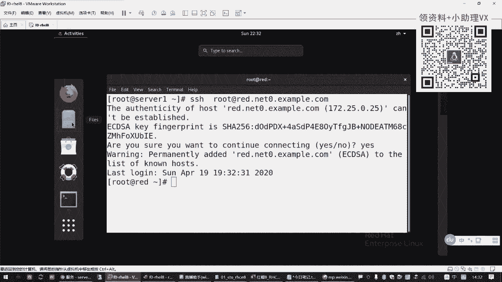

内核是操作系统的核心部分，负责直接管理计算机的硬件资源，如CPU、内存和各种硬件设备。Linux系统的内核通常被称为“Linux Kernel”。

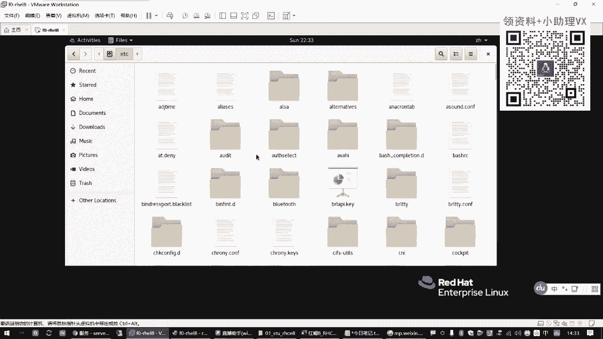

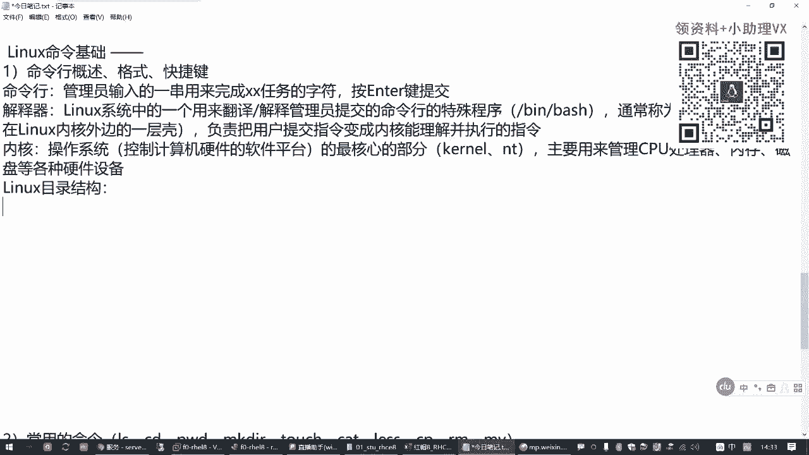

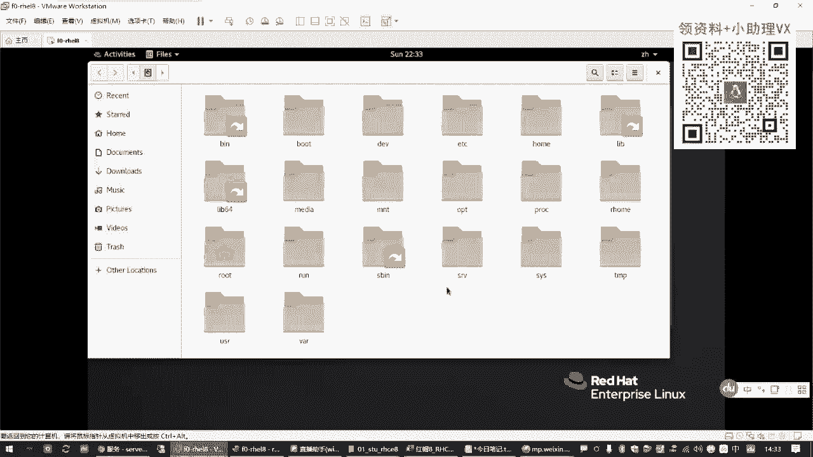

**关系总结**：用户通过命令行发出指令，解释器（Shell）将这些指令翻译成内核能理解的格式，内核再执行这些指令来操作硬件。

## Linux目录结构 📁


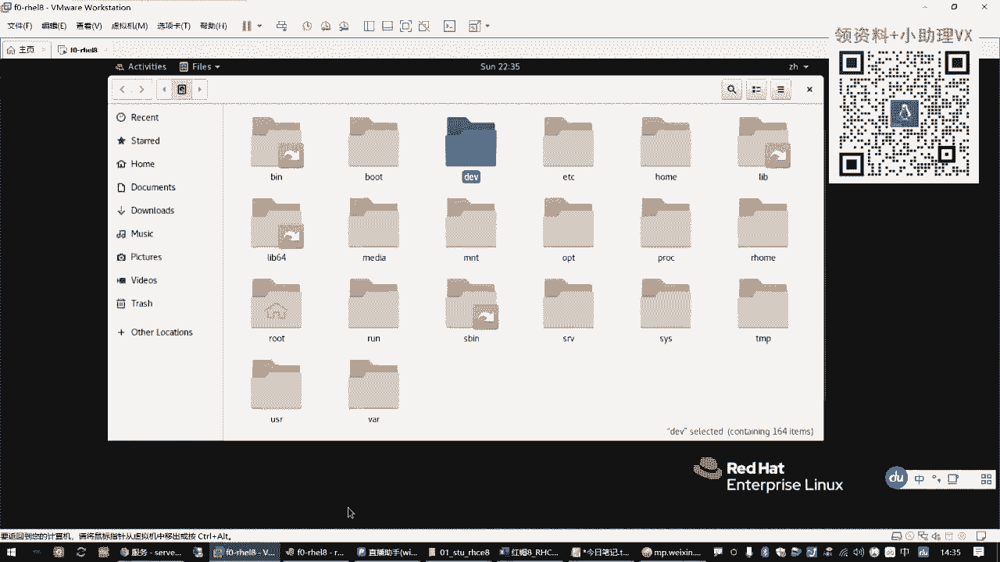

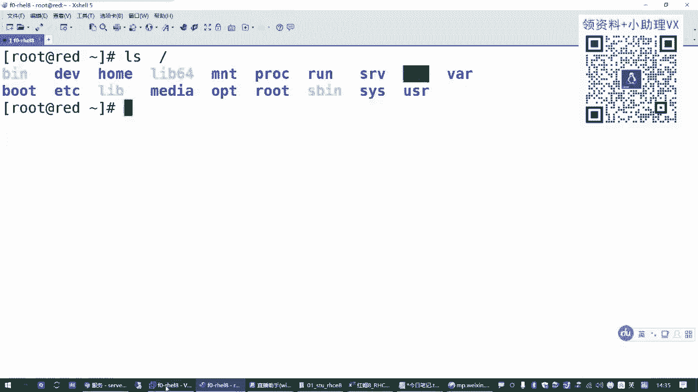

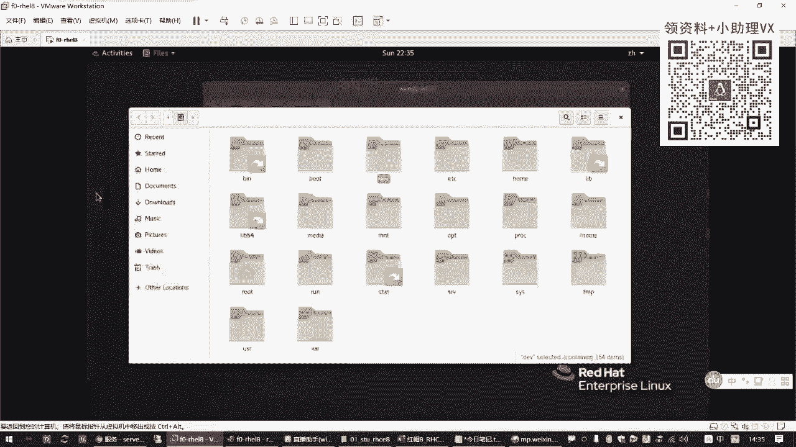

理解了命令行的基本概念后，我们需要了解Linux系统的“地图”——目录结构。这与Windows系统有所不同。


### 目录的层次与表示

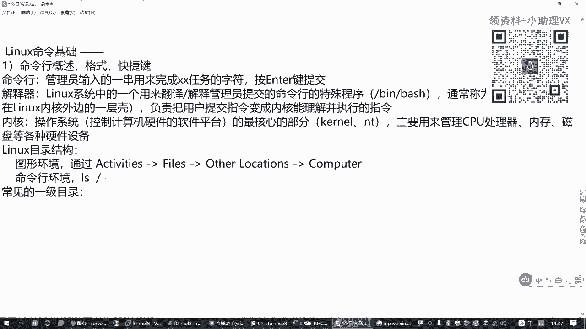

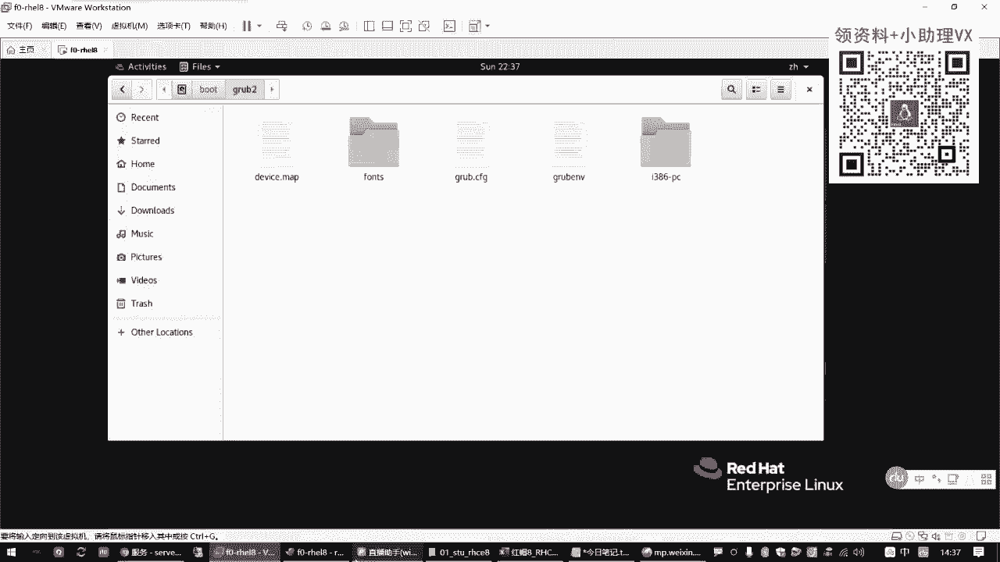

Linux目录采用树形结构。最顶层的目录称为“根目录”，用单个斜杠 `/` 表示。斜杠 `/` 同时也用作不同目录层级之间的分隔符。

**示例路径**：
```
/boot/grub2/grub.cfg
```
这个路径表示：在根目录 `/` 下，进入 `boot` 目录，再进入其子目录 `grub2`，找到文件 `grub.cfg`。

### 常见一级目录及其用途

以下是Linux系统中一些常见的一级目录及其主要用途的简要介绍：

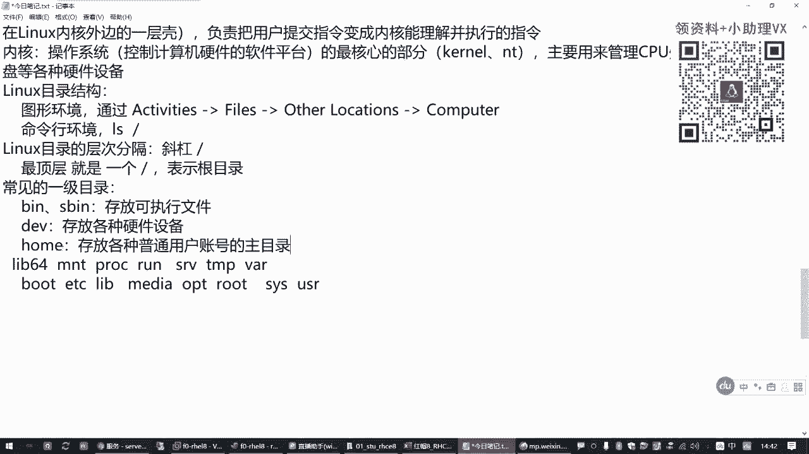

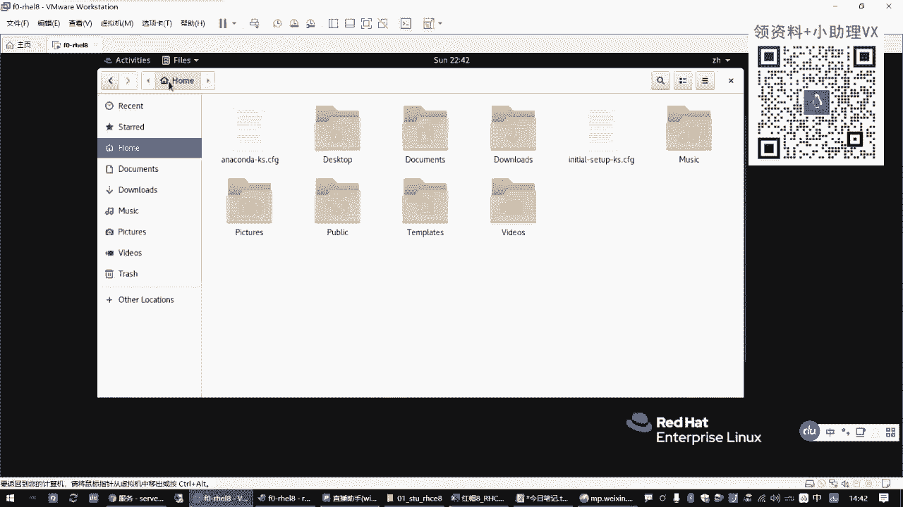

*   **/bin**：存放所有用户都可以执行的基本命令程序文件。
*   **/sbin**：存放供系统管理员（超级用户）使用的管理命令程序文件。
*   **/dev**：存放设备文件，代表系统中的硬件设备（如磁盘、光盘）。
*   **/home**：存放普通用户的主目录。例如，用户 `zhangsan` 的主目录通常是 `/home/zhangsan`。
*   **/root**：系统管理员（root用户）的主目录。
*   **/boot**：存放系统启动所需的文件。**切勿随意删除此目录**。
*   **/etc**：存放系统的配置文件。
*   **/var**：存放经常变化的（Variable）数据，如日志文件、邮件等。
*   **/tmp**：存放临时文件。
*   **/usr**：存放用户安装的应用程序和文件。
*   **/mnt** 或 **/media**：用于手动或自动挂载外部存储设备（如U盘、光盘）的目录。

了解这些目录的用途，有助于你在系统中快速定位文件。

## 命令行的基本格式 ⌨️

现在，我们来看看如何“书写”一个有效的命令行。大多数Linux命令都遵循一个基本的格式。

### 格式组成

一个典型的命令行由三部分组成：**命令字**、**选项**和**参数**。

**基本格式**：
```
命令字 [选项] [参数]
```
*   **命令字**：必须存在，指定要执行的操作（如 `ls`, `cp`）。
*   **选项**：可选，用于调节命令的具体行为或输出格式。通常以短横线 `-` 开头，后跟一个字母（如 `-l`），或者以双横线 `--` 开头，后跟一个单词（如 `--help`）。
*   **参数**：可选，指定命令操作的对象，通常是文件或目录的路径。

### 格式示例

以 `ls` 命令为例：
*   `ls`：仅列出当前目录下的文件名。
*   `ls -l`：使用 `-l`（long）选项，以长格式列出文件的详细信息（权限、大小、时间等）。
*   `ls -l /home`：结合选项和参数，以长格式列出 `/home` 目录下的文件信息。
*   `ls -lh /boot`：多个短选项可以合并，`-lh` 等同于 `-l -h`。`-h`（human-readable）选项使文件大小以易读的单位（K, M, G）显示。

**选项的作用**：控制命令的执行方式和效果。
**参数的作用**：为命令提供操作的具体对象。

## 常用快捷键 ⚡

熟练使用快捷键可以极大提高在命令行下的工作效率。以下是几个最常用的快捷键：

*   **Tab键**：**命令/路径补全**。输入命令或路径的前几个字母后按Tab，系统会自动补全。如果存在多个可能，按两次Tab会列出所有候选。
*   **Ctrl + L**：**清屏**。快速清除当前终端屏幕内容，等同于执行 `clear` 命令。
*   **Ctrl + C**：**中断当前任务**。强制终止正在前台运行的命令。
*   **Esc + .**：**粘贴上一个命令的最后一个参数**。在输入新命令时，可以快速引用上一条命令的参数，避免重复输入。

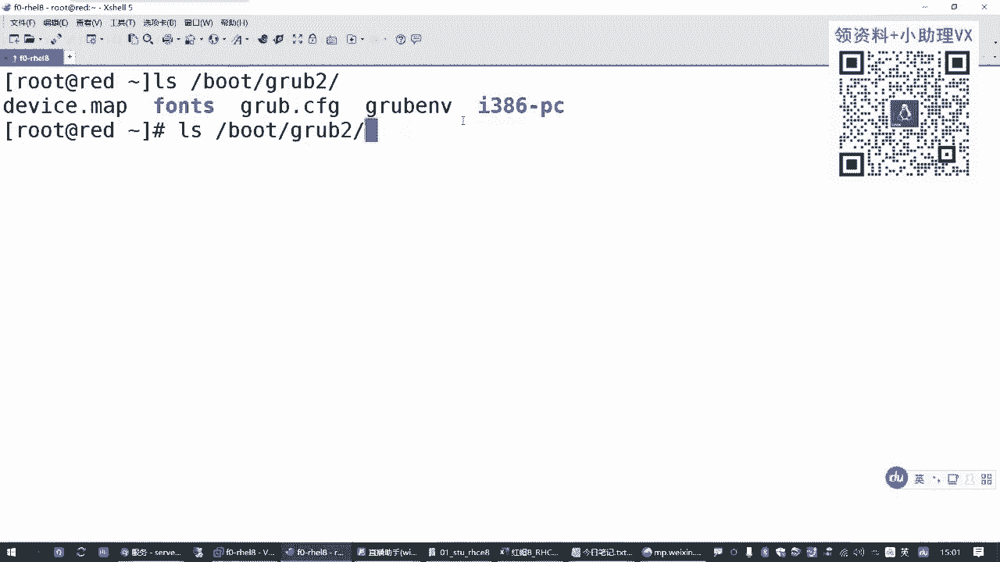

---


本节课中我们一起学习了Linux命令行的基础核心概念，包括命令行的定义、解释器与内核的作用、Linux的目录结构、命令行的基本格式以及提高效率的常用快捷键。这些知识是后续学习具体命令和系统管理的基石，请务必理解和掌握。从下节课开始，我们将深入讲解常用的Linux命令。