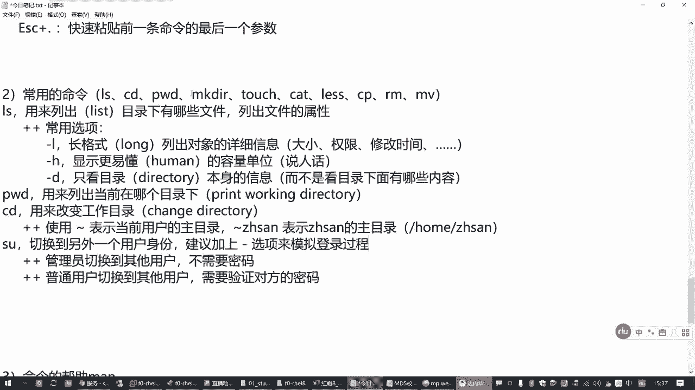
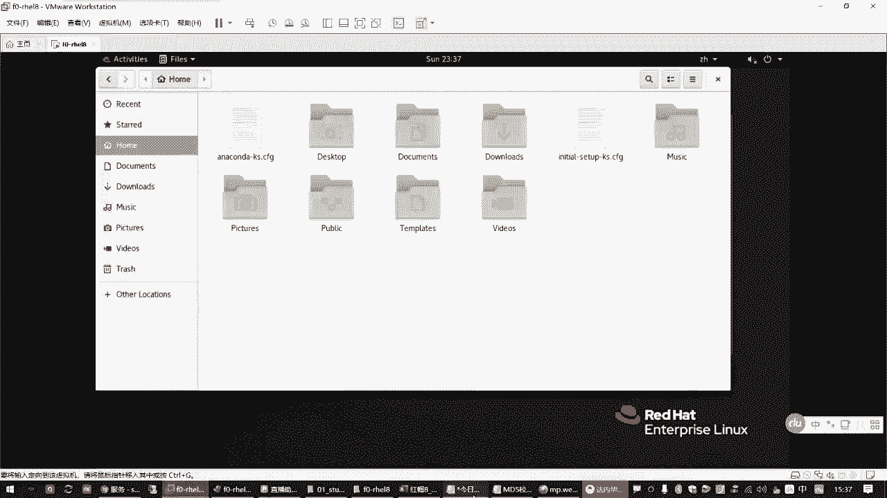
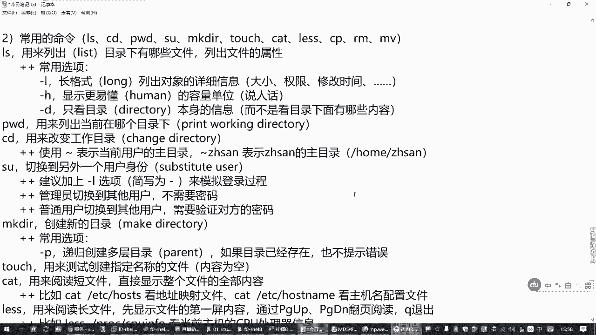
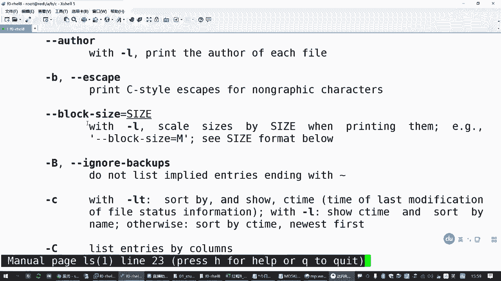
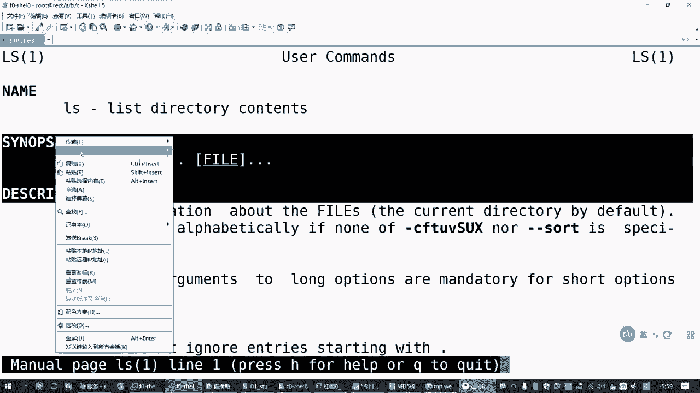
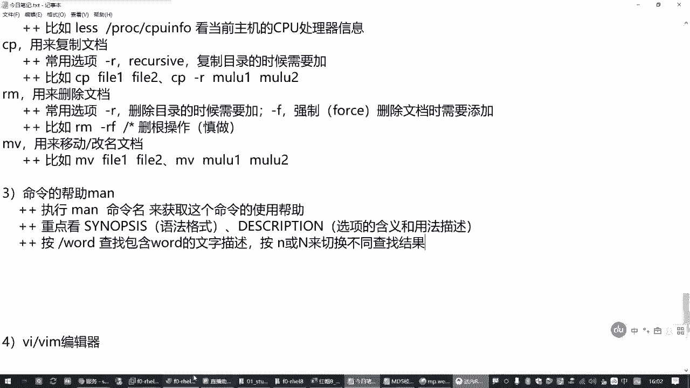
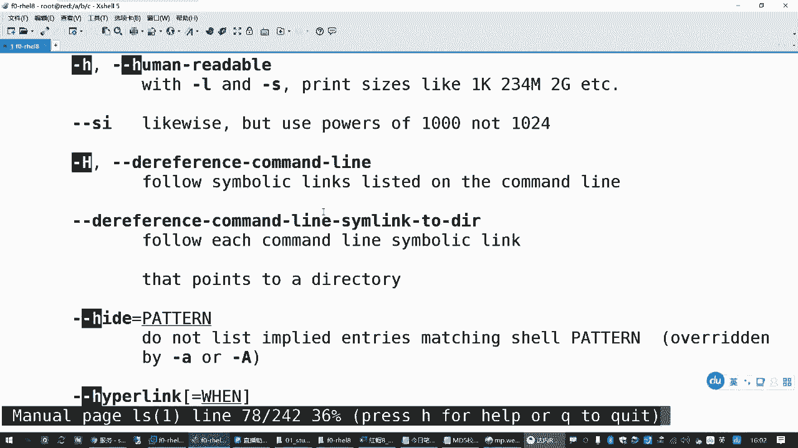
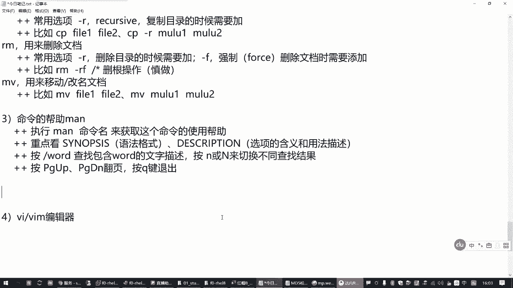

# Linux基础教程：P3：1.02：文档管理常用命令 📁

在本节课中，我们将要学习Linux系统中用于文档管理的一系列核心命令。这些命令是操作Linux系统的基础，掌握它们对于后续的学习至关重要。我们将从最简单的目录查看开始，逐步深入到文件的创建、复制、移动和删除等操作。

上一节我们介绍了Linux命令行的一些基本概念和目录结构，本节中我们来看看如何具体操作文件和目录。

## 探索目录的“三剑客” 🗺️

在Linux中，有三个命令常被用来探索目录结构，它们分别是`pwd`、`ls`和`cd`。

### 1. 查看当前目录：`pwd`

`pwd`命令用于**列出当前所在的工作目录**。它的名字来源于“Print Working Directory”（打印工作目录）。

**命令格式：**
```bash
pwd
```
执行此命令后，终端会显示你当前所处的完整目录路径。

### 2. 列出目录内容：`ls`

`ls`命令用于**列出指定目录下的文件和子目录**。它的名字来源于“list”（列表）。

**命令格式：**
```bash
ls [选项] [目录路径]
```
如果不指定目录路径，`ls`默认会列出当前目录下的内容。

以下是`ls`命令的一些常用选项：

*   **`-l`**：以长格式列出详细信息，包括文件权限、所有者、大小和修改时间等。
*   **`-h`**：与`-l`选项结合使用时，以更易读的单位（如K、M、G）显示文件大小。
*   **`-d`**：仅显示目录本身的信息，而不是目录下的内容。常与`-l`结合使用来查看目录属性。

**示例：**
*   `ls /boot`：列出`/boot`目录下的内容。
*   `ls -l /boot`：以长格式列出`/boot`目录的详细信息。
*   `ls -ld /boot`：仅查看`/boot`目录本身的属性。

### 3. 切换工作目录：`cd`

`cd`命令用于**改变当前的工作目录**。它的名字来源于“Change Directory”（改变目录）。

**命令格式：**
```bash
cd [目录路径]
```
如果不指定目录路径，直接输入`cd`，则会返回到当前用户的**家目录**。

**特殊符号：**
*   **`~`**：波浪号代表当前用户的家目录。例如，`cd ~` 等同于 `cd`。
*   **`~用户名`**：代表指定用户的家目录。例如，`cd ~zhangsan` 会切换到用户`zhangsan`的家目录。

**示例：**
*   `cd /`：切换到根目录。
*   `cd ..`：切换到上一级目录。
*   `cd` 或 `cd ~`：返回当前用户的家目录。

## 用户身份切换：`su` 👤

在操作过程中，有时需要临时切换到另一个用户身份，这时可以使用`su`命令。

**命令格式：**
```bash
su - [用户名]
```
**选项说明：**
*   **`-`**：建议加上此选项，它会模拟完整的登录过程，加载新用户的环境变量。



**注意：**
*   管理员（root）切换到任何其他用户都不需要密码。
*   普通用户切换到其他用户时，需要输入目标用户的密码。



**示例：**
*   `su - lwuser0`：切换到用户`lwuser0`。

## 创建目录与文件 🛠️

### 1. 创建目录：`mkdir`

`mkdir`命令用于**创建新的目录**。名字来源于“make directory”。

**命令格式：**
```bash
mkdir [选项] 目录名...
```
**常用选项：**
*   **`-p`**：递归创建多层目录。如果父目录不存在，则会一并创建。如果目标目录已存在，也不会报错。

**示例：**
*   `mkdir dir1`：在当前目录创建`dir1`。
*   `mkdir -p /a/b/c`：递归创建`/a/b/c`目录结构。

### 2. 创建空文件：`touch`

`touch`命令的主要用途是**创建空的测试文件**，或更新文件的时间戳。它不向文件写入内容。

**命令格式：**
```bash
touch 文件名...
```
**示例：**
*   `touch file1 file2`：在当前目录创建两个名为`file1`和`file2`的空文件。

## 查看文件内容 📖

### 1. 查看短文件：`cat`

`cat`命令用于**快速查看内容较短的文件的全部内容**。

**命令格式：**
```bash
cat 文件名
```
**示例：**
*   `cat /etc/hostname`：查看本机的主机名。
*   `cat /etc/hosts`：查看本机的域名映射文件。

### 2. 查看长文件：`less`

`less`命令用于**分页查看内容较长的文件**。它一次只显示一屏内容，便于浏览。

**命令格式：**
```bash
less 文件名
```
**操作方法：**
*   按 **空格键** 或 **Page Down**：向下翻页。
*   按 **Page Up**：向上翻页。
*   按 **`q`**：退出查看。

**示例：**
*   `less /proc/cpuinfo`：分页查看CPU的详细信息。

## 复制、移动与删除操作 🔄

### 1. 复制：`cp`

`cp`命令用于**复制文件或目录**。

**命令格式：**
```bash
cp [选项] 源文件/目录 目标文件/目录
```
**常用选项：**
*   **`-r`**：递归复制目录及其内部所有内容（复制目录时必须使用）。

**示例：**
*   `cp file1 file2`：将`file1`复制为`file2`。
*   `cp -r /boot /root/boot_new`：将`/boot`目录递归复制到`/root`目录下并重命名为`boot_new`。

### 2. 删除：`rm`

`rm`命令用于**删除文件或目录**。**此命令非常危险，请谨慎使用。**

**命令格式：**
```bash
rm [选项] 文件/目录...
```
**常用选项：**
*   **`-r`**：递归删除目录及其内部所有内容（删除目录时必须使用）。
*   **`-f`**：强制删除，不进行任何确认提示。

**警告：** `rm -rf /` 命令会尝试删除根目录下的所有文件，可能导致系统崩溃。在新版Linux中，此操作已被限制。

**示例：**
*   `rm file1`：删除文件`file1`。
*   `rm -rf dir1`：强制递归删除目录`dir1`及其所有内容。



### 3. 移动/重命名：`mv`

`mv`命令用于**移动文件或目录**，如果在同一目录下操作，效果就是**重命名**。

**命令格式：**
```bash
mv 源文件/目录 目标文件/目录
```
**示例：**
*   `mv file1 /tmp/`：将`file1`移动到`/tmp`目录。
*   `mv oldname newname`：将`oldname`重命名为`newname`。





## 获取命令帮助：`man` 📚

当忘记某个命令的用法时，可以使用`man`命令查看其详细的手册页。

**命令格式：**
```bash
man 命令名
```
**查看手册时的操作：**
*   按 **空格键** 或 **Page Down**：向下翻页。
*   按 **Page Up**：向上翻页。
*   按 **`/关键词`**：在手册内搜索指定关键词，按`n`查找下一个，按`N`查找上一个。
*   按 **`q`**：退出手册。



**重点查看部分：**
1.  **SYNOPSIS（语法格式）**：了解命令的基本用法。
2.  **DESCRIPTION（描述）**：查看命令和各个选项的详细说明。

**示例：**
*   `man ls`：查看`ls`命令的完整帮助手册。



---



本节课中我们一起学习了Linux文档管理的基础命令，包括如何使用`pwd`、`ls`、`cd`探索目录，使用`mkdir`、`touch`创建目录和文件，使用`cat`、`less`查看文件内容，以及使用`cp`、`rm`、`mv`进行复制、删除和移动操作。最后，我们还学会了在遇到困难时如何使用`man`命令寻求帮助。这些是操作Linux系统的基石，请务必多加练习，熟练掌握。