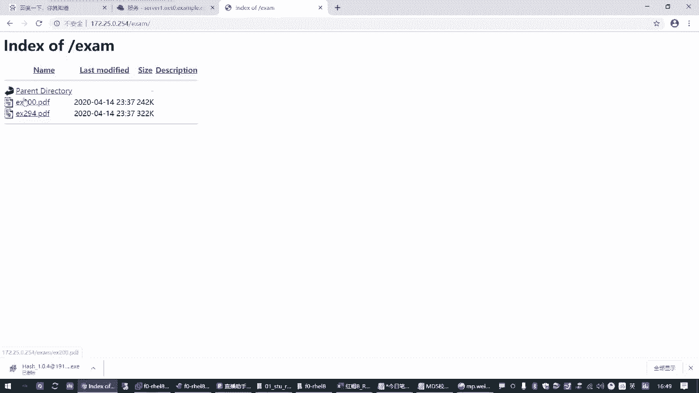
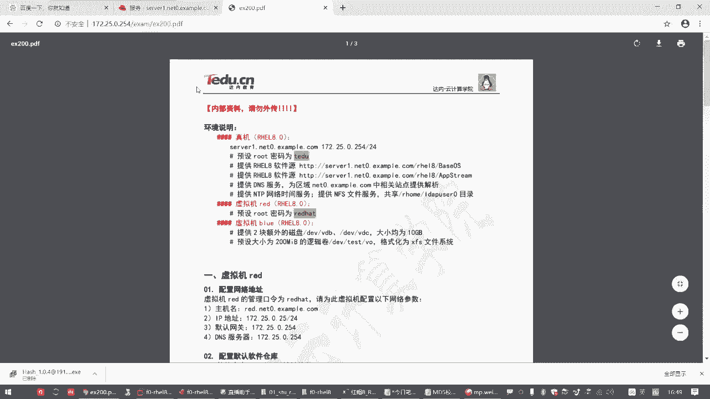
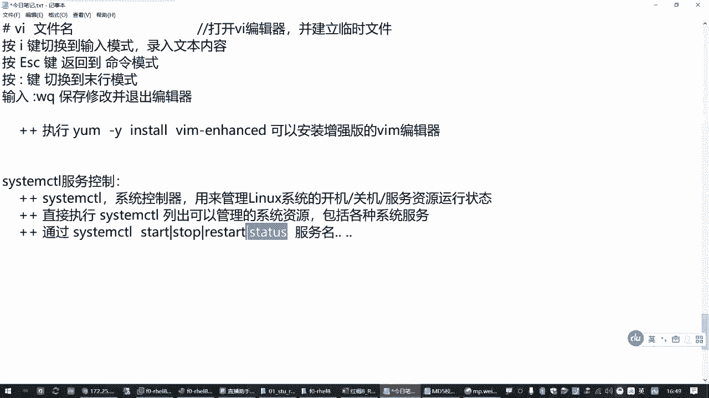
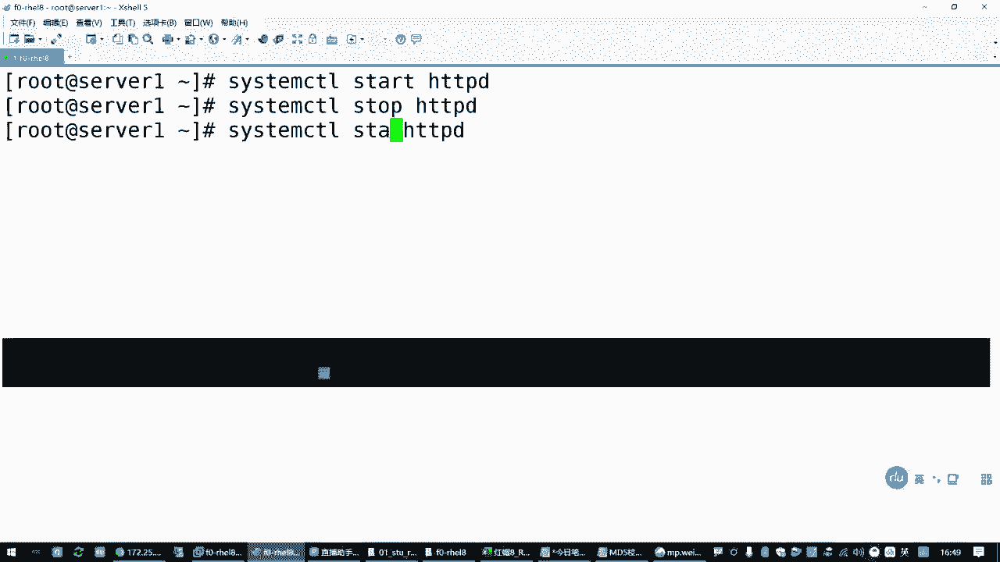
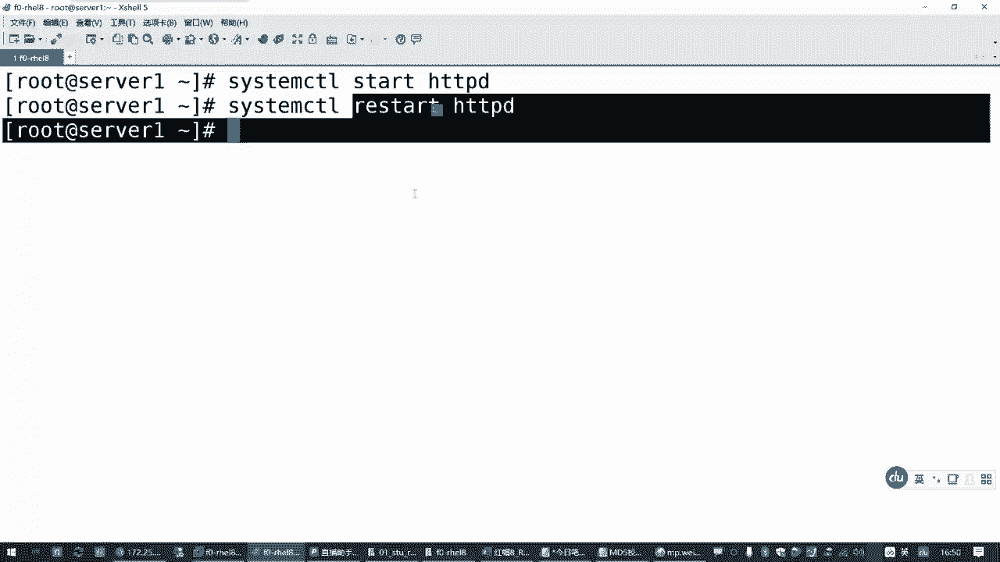
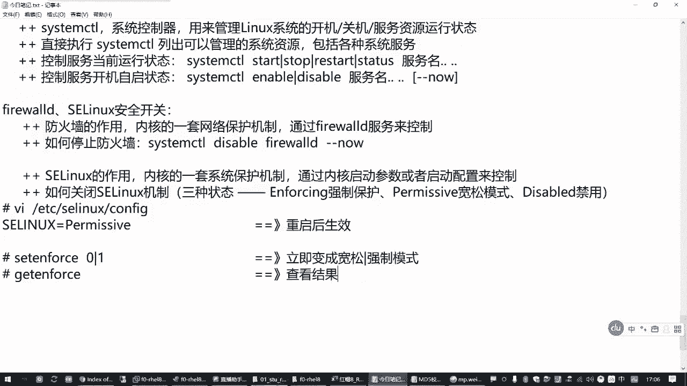
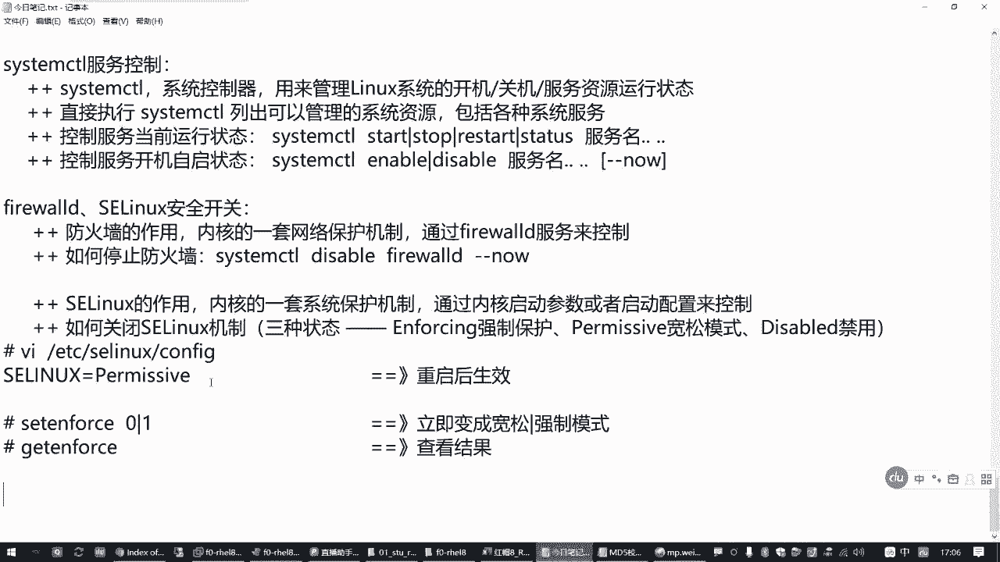
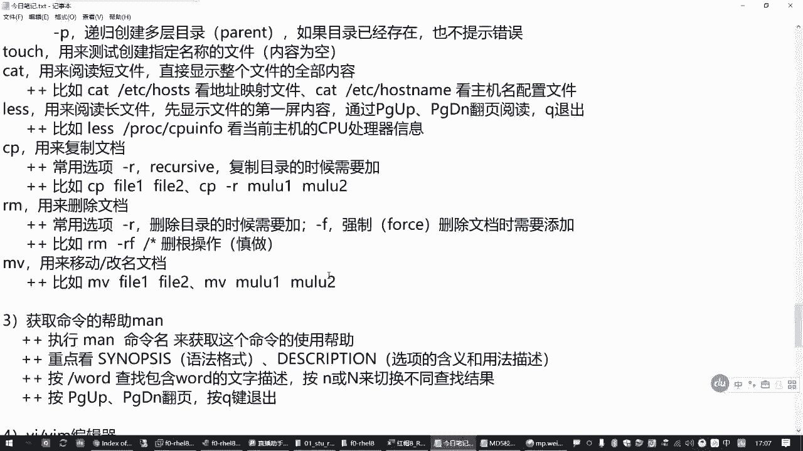
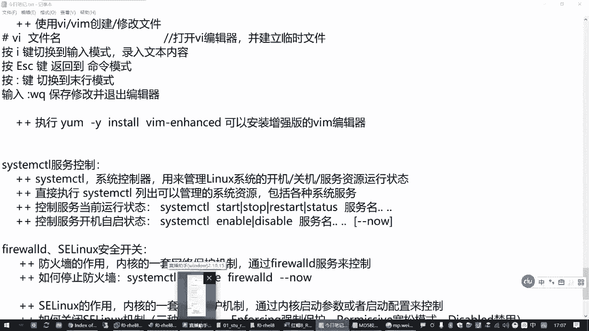

# RHCSA精讲教程：P5：1.04-服务控制和安全开关 🔧

在本节课中，我们将学习Linux系统中两个重要的管理概念：服务控制与安全开关。服务控制是管理后台程序运行状态的核心技能，而安全开关则涉及防火墙和SELinux的启用与关闭，这对于初学者搭建和测试环境至关重要。

## 服务控制：systemctl工具

上一节我们介绍了Linux的基础命令，本节中我们来看看如何管理系统服务。服务是Linux中提供特定功能（如网站、数据库）的后台程序。管理这些服务的主要工具是 **`systemctl`**，它被称为系统控制器。

**`systemctl`** 命令用于管理Linux操作系统的各种资源，包括系统的开关机以及所有系统服务的运行状态。

以下是`systemctl`命令的基本用法：





*   **列出可管理的资源**：直接执行 `systemctl` 可以列出当前系统能够管理的所有资源，包括各种系统服务。
*   **启动服务**：使用 `systemctl start <服务名>` 来启动一个服务。
*   **停止服务**：使用 `systemctl stop <服务名>` 来停止一个服务。
*   **重启服务**：使用 `systemctl restart <服务名>` 来重启一个服务。此操作会先停止再启动服务，可能造成服务短暂中断。
*   **查看服务状态**：使用 `systemctl status <服务名>` 来查看服务的当前运行状态（是活动还是停止）。





在红帽7和8系统中，`systemctl`可以同时控制多个服务，只需在命令后以空格分隔多个服务名即可。

例如，要启动一个名为`httpd`的网站服务，可以执行：
```bash
systemctl start httpd
```
启动后，你就能通过浏览器访问该网站。如果执行 `systemctl stop httpd` 停止服务，网站将无法访问。使用 `systemctl status httpd` 可以查看其详细状态，重点关注 **`Active:`** 一行，它会显示是 `active (running)` 还是 `inactive (dead)`。



## 设置服务开机自启

除了控制服务的即时运行状态，我们还需要管理服务在系统启动时是否自动运行。

以下是设置服务开机自启状态的命令：

*   **启用开机自启**：使用 `systemctl enable <服务名>` 让服务在开机后自动运行。
*   **禁用开机自启**：使用 `systemctl disable <服务名>` 禁止服务开机自动运行。

有时，我们希望在设置开机自启的同时，立即启动服务。这时可以使用组合命令：
```bash
systemctl enable --now <服务名>
```
参数 `--now` 是可选的，它表示“立即启用并启动”。

## 安全开关：防火墙与SELinux

了解了服务控制后，我们来看看两个重要的安全组件：防火墙和SELinux。在初学阶段，为了排除网络访问障碍，我们可能需要暂时关闭它们。

### 防火墙 (firewalld)

防火墙（`firewalld`）是内核的一套网络保护机制，用于控制网络访问，防御外部攻击。它本身也是一个系统服务。

因此，控制防火墙状态的方法与控制普通服务完全相同：

*   **关闭防火墙（立即并禁止开机启动）**：
    ```bash
    systemctl disable --now firewalld
    ```
*   **开启防火墙**：使用 `systemctl enable --now firewalld`。

在未配置任何规则的情况下，开启的防火墙默认会阻止大部分外部访问。对于学习环境，可以暂时关闭以简化操作。

### SELinux 安全机制

SELinux是Linux内核的另一套强制访问控制安全机制，它不通过某个服务管理，而是通过内核参数和配置文件控制。

SELinux有三种运行模式：

1.  **`enforcing`**：**强制模式**。严格执行安全策略，违规操作将被阻止。
2.  **`permissive`**：**宽容模式**。仅记录违规操作，但不阻止。
3.  **`disabled`**：**禁用模式**。完全关闭SELinux功能。

要永久更改SELinux模式，需要编辑其配置文件：
```bash
vim /etc/selinux/config
```
找到 `SELINUX=` 这一行，将其值改为 `enforcing`、`permissive` 或 `disabled` 之一。**此修改需要重启系统才能生效。**




如果不想重启，可以在 `enforcing` 和 `permissive` 模式之间临时切换：
*   **临时切换到宽容模式**：`setenforce 0`
*   **临时切换到强制模式**：`setenforce 1`
*   **查看当前模式**：`getenforce`



**注意**：`setenforce` 命令无法在 `disabled` 模式和其他模式间切换，只能通过修改配置文件并重启来实现。






## 总结


本节课中我们一起学习了Linux系统管理的两个核心部分。首先，我们掌握了使用 **`systemctl`** 工具控制服务运行状态（`start`/`stop`/`restart`/`status`）和设置开机自启（`enable`/`disable`）的方法。接着，我们了解了防火墙（`firewalld`）和SELinux这两个安全组件的基本概念，并学会了如何暂时关闭它们以方便初期的学习与测试。这些命令和概念是后续深入学习Linux系统管理和备考RHCSA的基础，请务必熟练掌握。