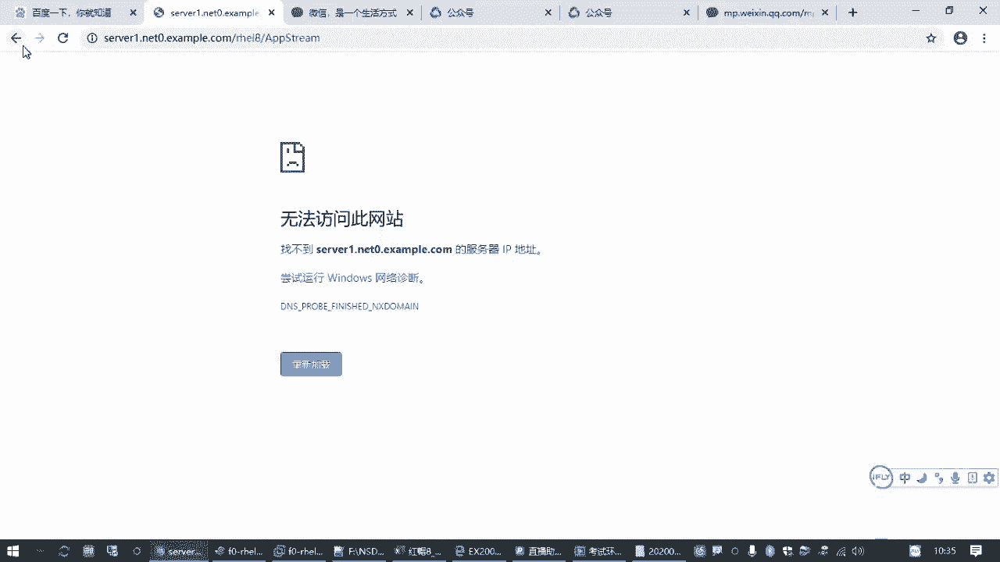
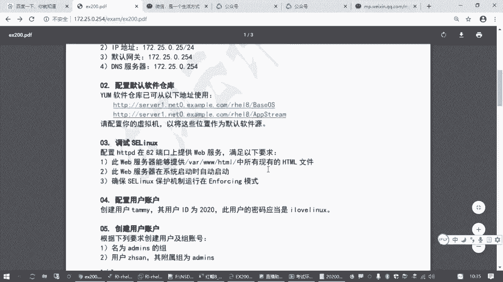
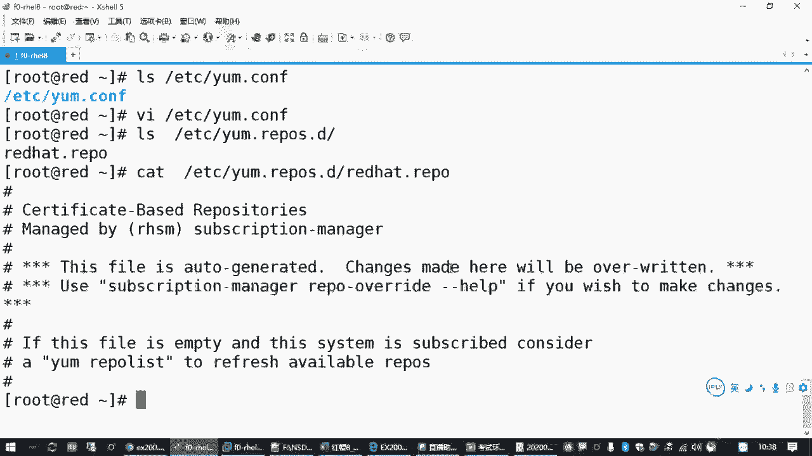
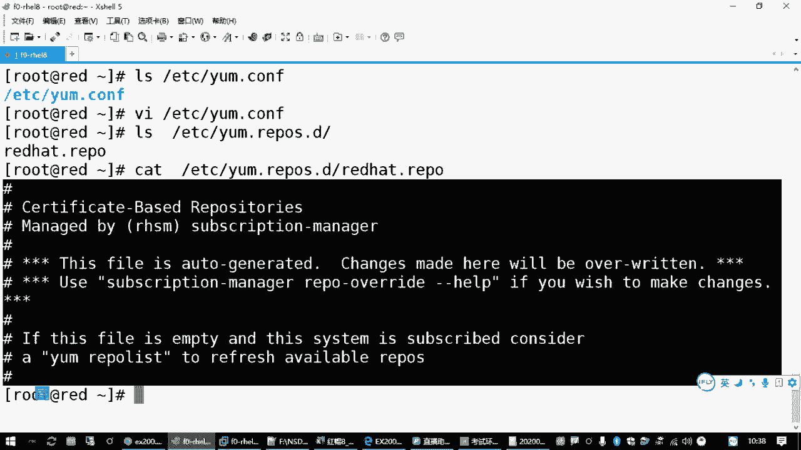
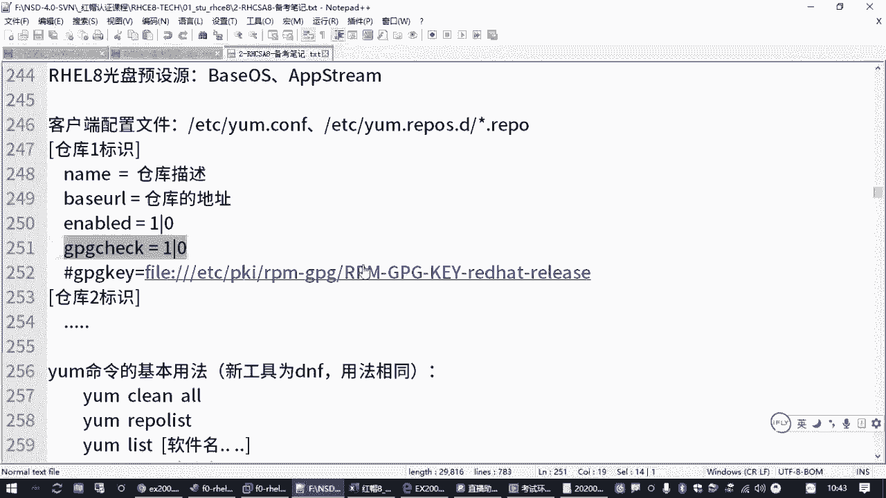
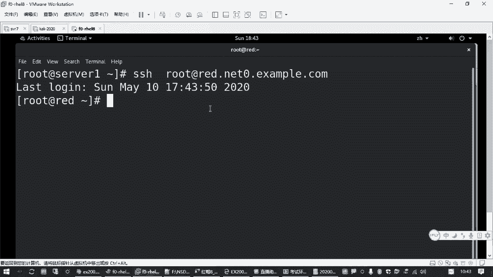
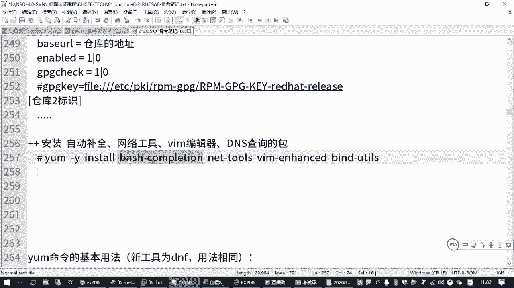

# RHCSA认证精讲教程：P7：2.02-配置yum源 📦


在本节课程中，我们将学习如何为红帽系统配置软件源（yum仓库）。这是RHCSA考试中的常见任务，也是日常系统管理中安装软件包的基础操作。配置正确的软件源，可以确保系统能够顺利地从指定位置获取并安装所需的软件包。

上一节我们介绍了如何配置网络地址，确保虚拟机能够连接到网络。本节中我们来看看如何配置软件源，为后续安装软件包做好准备。

## 软件源与yum命令简介 🔧

在红帽系统中，安装软件包通常使用 `yum` 命令（在RHEL 8中，其更新版本为 `dnf`，但两者命令兼容）。`yum` 命令需要知道从哪里获取软件包，这个提供软件包的地方就称为“软件仓库”或“软件源”。





例如，安装一个软件包的基本命令格式是：
```bash
yum install 软件包名
```
如果系统没有配置任何可用的软件源，执行此命令时会收到类似 `there are no enabled repos` 的错误提示。

## yum配置文件的位置 📁

`yum` 命令的配置文件主要位于两个位置：

1.  **全局配置文件**：`/etc/yum.conf`
    *   此文件主要控制 `yum` 命令的全局行为，例如是否进行软件包签名校验。





2.  **仓库源配置文件目录**：`/etc/yum.repos.d/`
    *   此目录下存放着具体的软件仓库配置文件，文件扩展名必须是 `.repo`。
    *   系统管理员可以在此目录下创建多个 `.repo` 文件来定义不同的软件源。

通常，我们只需要在 `/etc/yum.repos.d/` 目录下创建或修改 `.repo` 文件即可。

## 配置软件仓库的步骤 📝

考试通常会提供两个软件仓库的地址，要求你将其配置为系统的软件源。

以下是配置一个软件仓库的基本步骤和文件格式：

1.  **进入配置目录并创建文件**
    ```bash
    cd /etc/yum.repos.d/
    vim local.repo
    ```





2.  **编写仓库配置内容**
    用 `vim` 编辑器创建或打开文件后，按 `i` 键进入编辑模式，然后写入配置。一个仓库的基本配置格式如下：
    ```ini
    [baseos]                    # 仓库ID，必须唯一，不要有空格和特殊字符
    name=BaseOS Repository      # 仓库描述，可读性说明
    baseurl=http://提供的地址1  # 软件仓库的具体访问地址，这是核心配置
    enabled=1                   # 是否启用此仓库，1为启用，0为禁用（此项可省略，默认为启用）
    gpgcheck=0                  # 是否进行GPG签名校验，0为不检查（简化操作，考试通常不要求）
    ```
    *   `[baseos]`：方括号内是仓库的标识符（ID），用于在列表中区分不同仓库。
    *   `name`：是对仓库的简单描述。
    *   `baseurl`：是最关键的设置，必须填写题目或环境提供的准确网址。
    *   `enabled`：若不设置，默认即为启用状态。
    *   `gpgcheck`：设置为 `0` 可以跳过耗时的签名检查，简化考试操作。若需检查，则需额外配置 `gpgkey` 项。

3.  **配置多个仓库**
    如果题目提供了两个地址，就需要配置两个仓库区块。只需复制上述配置块，修改 `[ID]`、`name` 和 `baseurl` 即可。确保每个仓库的ID不同。
    ```ini
    [baseos]
    name=BaseOS Repository
    baseurl=http://提供的地址1
    gpgcheck=0

    [appstream]
    name=AppStream Repository
    baseurl=http://提供的地址2
    gpgcheck=0
    ```

4.  **保存并退出**
    编辑完成后，按 `Esc` 键退出编辑模式，输入 `:wq` 保存文件并退出 `vim`。

## 验证与测试 ✅

配置完成后，需要验证软件源是否可用。

1.  **列出已启用的仓库**
    执行以下命令，查看配置的仓库是否被正确识别：
    ```bash
    yum repolist
    ```
    如果配置正确，你将看到类似下面的输出，其中包含你设置的仓库ID和描述：
    ```
    仓库ID            仓库名称                        状态
    baseos           BaseOS Repository               10,072
    appstream        AppStream Repository            8,465
    ```

2.  **安装测试软件包**
    验证仓库可用的最好方法是尝试安装软件包。同时，可以安装一些常用工具包：
    ```bash
    yum -y install bash-completion net-tools bind-utils vim-enhanced
    ```
    这个命令会安装：
    *   `bash-completion`：提供命令自动补全功能。
    *   `net-tools`：提供 `ifconfig`、`netstat` 等传统网络工具。
    *   `bind-utils`：提供 `nslookup`、`host` 等DNS查询工具。
    *   `vim-enhanced`：功能更强大的Vim编辑器。

    **注意**：安装 `bash-completion` 后，需要**重新登录终端**或开启新的Shell会话，自动补全功能才会生效。

## 故障排查 🔍

如果 `yum repolist` 报错或 `yum install` 失败，请检查：
*   仓库配置文件 `.repo` 的**扩展名**是否正确。
*   文件中的**拼写**是否有误，特别是 `baseurl` 的地址。
*   `baseurl` 中的地址能否被虚拟机正常访问（网络是否通畅）。
*   每个仓库区块是否用 `[]` 正确括起。

## 总结 📚



本节课中我们一起学习了配置yum软件源的核心技能。我们了解了yum配置文件的位置，掌握了创建和编辑 `.repo` 文件来定义软件仓库的方法，并通过 `yum repolist` 和安装测试包来验证配置的正确性。这是保证系统能够顺利安装和管理软件包的基础，请务必熟练掌握。接下来，我们就可以利用配置好的软件源，为系统安装各种所需的工具和服务了。