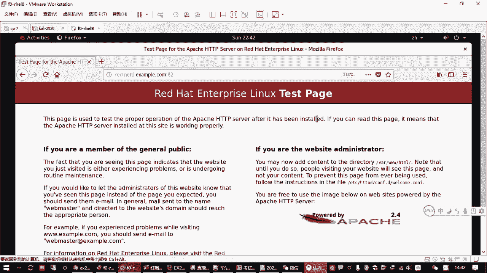

# 红帽认证RHCSA通过率90%以上的精讲教程，云计算大佬推荐 - P10：2.05-SELinux调试 - 达内视频 - BV1ya411R7Zs

那如果大家发现你那个样源不好不好用的话啊，那肯定会报各种错误，对不对？那最直接的方式就是大家就执行这个ymraplist的时候，它可能会报错。啊而不是像我们现在看到的这个样子啊。如果你看到现在这个样子。

能说明它就是没有问题的啊。如果有问题呢，他可能会报什么什么fa尔的，什么什么同步啊，是吧，或者告诉你那个原找不着啊，对不对？😊，那我们上午讲过的这个ymre不就是用来检查的吗？啊。

还有一些还有检查的就是你直接ym杠Yinsstore装包呗，你装不上，那就不好使嘛。这是最直接的啊检查亚美源好不好用的一个操作。那如果你的配置有错误。举个例子。我们直接去把这个文件故意改错呗。

你们大家练习为啥要练习呀？有时候大家练习的时候，你就可以故意去写错一些东西，什么什么意思啊？我们给他改一下。😊，因为这个错误的情况那就太多了是吧？比方说你这里加一个空格。😊，可以吧。

那或者下边呢这个写一个收啊。来保存退出去，我们看一下。大家练习的时间啊就是要各种试错啊，当然第一步呢肯定是要尽量把这个实验给做出来。然后你能做出来之后呢，然后你再去模拟各种错误。那如果你有错误的情况下。

你再来执行，你看不就不好使了吗？看见没？刚才有同学不在群里问这些问题吗，对不对？😡，我看刚刚那个同学呃问的那个报错，就这个题是吧？😊，就无法同步缓存啊，针对谁呀？就针对你这个圆。

那如果它提示你无法去找这个原去同步，那一般情况下呢。三60。啊，一般正常下三三种原因。第一种原因就是你刚刚设置的那个服务器端。就好像大家考试的时候，你这个地址，这个是我一，它给我的这个源是不能用的。

是吧？服务器根本那个比方说他的网站没开。对吧那就不可用。这第一种原因。但第一种原因呢也是我们最不大可能碰到的原因。因为考试环境这个给你的肯定是好用的嘛。咱们那个练习环境，只要你练习环境是正常的。

这个肯定是好用的。😡，那如果你服务端没问题，那还有什么可能导致你这个源防不了，那就是你客户端。那客户端导致你访问不了原的问题，就是你这个readd这台主机，它的IP地址。

因为咱们用的这个源呢啊刚才访问的时候是不是用了一个域名的方式啊？所以你要保证你的客户机的IP地址掩码DNS服务器要配置正确。考试的时候，包括你那个默认网关也要配置正确。对吧这是检查的方法。😊。

那如果是在我们的个讯机里边。你要检查你的IP地址，我们说可以用IP address list。对吧啊，你可以用这种方式去检查你这个主机的IB地址，你找下面找像这种的。呃，然后呢，如果你要看默认网关的话。

嗯，IP那个命令我也忘了那个用的不多，那正常应该有个命令叫root杠N啊，但是这个命令我们上午给大家讲过，它是需要先装这个包才有啊。那大家检查的时候呢，你可能就只能通过啊NMTUI呀、NMCLI呀是吧？

用那些命令去检查。那检查的结果呢，像我们如果你有rootroot命令啊，直接root杠N。看它有没有默认网关啊，如果默认网关正确，说明你这个机器呢可以访问别的网络。啊，通过这个网关出去。嗯。

DNS服务器的话呢，你配好之后，它就是一个文件，我们可以用cat命令去找这个文件。对吧你要看这个nameme server，对不对？😊，啊，如果都对，那说明你网络没问题。😡。

那你客户端和服务器连接也没问题，那这是第二种原因啊，你要排除网络配置的那种错误。啊，第三种原因呢，那就是你配置文件了。对不对？就你看你的yM源的配置文件有没有错误啊，这个大家就要仔细去检查。

包括像我们说的这里啊。你这些地址啊要要要写对。如果给你的是搜尾一，你要首首搜个二，那肯定不好用的，是吧？啊，当然主要是在很多时候呢，这种错误可能你。不好排查是吧，你找不着。

那大家就要把这个配置的过程来熟悉了啊。😡。

最好是从头敲一遍，我开始给大家做的时候，不是敲出来的吗？😡，最起码第一段是敲出来的，是吧？😊，呃，那如果你发现有错误怎么办呢？😡。

我用懒个去排查，最快的方式就是你把这个文件删除了。😡，对吧我管你有没有错，反正现在不好用，那肯定是有错。但是我现在不知道哪里有错，那咋办？😡，你直接删除ETCM给res点D这个目录底下的。

所有的扩展名式点IEPO的文件。你不要怕删啊，删了就删了。😡，这不就没了吗？是吧？没了之后呢，我们重新创建一个。😡，然后从里边往那填就行啊。啊，包括开始我们讲过的一些细节啊，包括这个方括号里边。

🎼不要有空格啊不要有空格。就这这些里边啊不要有空格，然后前边呢也不要有空格啊，你就挨着写啊。然后这个等号两边前后有没有空格都无所谓。然后呢，你这个网址。中间肯定不能有空格。

那有时候大家从网页复制的时候呢，你注意不要复制多了。啊，包括有时候你在后边可能不小心打了一个中文的空格是吧？啊，这些都要注意，就避免这些细节啊，避免这些细节。😊，啊，那些细节的错误呢，你排除了之后。

那其实这个问题就不大啊，你大不的重新写一份嘛，写一份之后呢，你再重新来执行rappper list。如果你发现rap list不好用呢，你还可以有一种办法。上我们讲过的有一个叫ym clean哦是吧？

清一下缓存，清完缓存之后再重新来ymrap list。😊，如果发现好用就好用。如果发现还不好用，你再去从我们刚才讲到的三个原因，对不对？服务端那个原因基本上我们不用管嘛。

那第二个原因就是你客户端的IP地址配置。然后第三个就你客户端那个配置文件，对不对？是吧你就就就搞定这个就行了嘛，那其他的没啥了。😡，那这是刚才我们给大家说的这个呃亚母园啊，亚母园它的一个检查啊。

它的一个检查啊一定要做对。好啊，那如果大家你发现有错误呢，就记住我们从零开始，就是你可以加一步这个啊。你可以把这个原配置文件那个删除啊，重新再来啊都行啊，O吧。咱们考试有一道题目呢是叫调试slin啊。

调试成linux。呃，那s相关的知识呢，我们在第一次课大概给大家介绍了一下啊，那正式的HCS的IHCSA的考试，你要解决这个题目的话呢，就需要知道两方面的知识。😊，第一方面，slinux怎么去排错？

最起码你要知道排错的方法啊，那包括你要知道这个slin是啥是吧？知道怎么去开启，怎么去关闭，怎么去改它的一个策略。然后第2块的知识的话呢，就是关于这个网站。网站的简单的一个配置啊。

其他的就是我们上次讲过的那些什么服务开机自动启动呀这些的是吧？然后你要开一个网站，需要排除哪些障碍啊？😊，啊，就是把这些问题解决，那我们就能搞定。啊，我们一个一开来看啊啊。

其中呢首先你要看这个网站服务HTTVD。考试的题目呢，他会要求说。这个网站服务它其实已经帮我们装好了啊，考试的时候也是装好的那但是呢装好了这个HTTBD服务，它的作用就是用来提供外部服务。

但是呢它已经配好了是监听82端口。😊，只不过呢他遇到了一点问题，这个外部服务器呢它启动不起来。😡，所以让我们去排除呃，启动不起来的原因呢，是因为它监听了82端口，不是标准的网站服务端口。Yeah。

那如果你监听的不是标准的网站服务端口，我们上次讲过的这个slinux会阻止你启动服务，说对不起，不行，你得先经过SElinux同意，他不同意，谁也不能监听82端口。特别是你这个网站。

网站只能在正常的80啊，还有个别那些端口，8080啊等等是吧？其他的端口不行。😊，所以我们需要知道这好几种知识啊。Okay。是。那我们看一下。

那首先呢slinux啊SElinux这个原称叫se security enhancedhlinux。叫安全增强版的linux机制。这个机制的话呢。

最早的话是由美国啊naSA啊叫NSA国家安全局提供的一套基于内核的增强保护机制。它的保护的方式就是为我们lininux主机上运行的用户进程和一些文件做了一些安全标标签和相关的一些限制。

你包括说有一些文件是比方说root用户加目录下的文件，这个文件是不允许给别人用的。你把root加目录下的东西呢，你拷贝出来可能可以。但你把它移动到另外一个位置，让别人去用，那就不行，对吧？

它有一套预设的方案。😡，那再包括像我们的网站，网站的默认只允许你提供8年端口。你在别的端口提供服务了也不行。啊，做了一套。保护机制。当然这一套保护机制呢，如果你用好了，那很很方便。但如果你用的不好呢。

那你会觉得哎这太碍手碍脚了啊。😡，特别费事是吧？嗯，那这一套安全机制呢，上次我们讲过，它有几种模式啊，一个叫强制强制生效的是吧？叫inforcing，还有一个叫宽松模式，permissive。

还有一个叫disabled。那切换的时候呢，我们是不是改了一个文件啊，对吧？这上次讲过的啊，说以这快快一点了啊。😊，你要改1个ETC下的slinux confi，把里边设成in。这个在考试的时候呢。

应该是默认的啊，上午的考试就做s牌做这道题目是默认的。啊，再然后的话呢呃就是如果你不想重启，你想临时去看它的一个状态，有个叫get in force。这是临时去检查啊。他的一个状态。你看它是哪一种模式。

如果是inverive，那就是强制启用的嘛，是吧？那如果你想把它变成另外一种模式，你用哪个重启，那就可以有一个st in force，会不会变一个0，那么可以暂时把它改成宽松模式啊。

这种模式呢只只盯着你，对吧？它不不不针对你做限制啊，呃也是叫临时把它放宽啊，条件放宽了啊。这是关于它的一个基本的安全的一个控制。呃，让考试的环境我们会遇到一个什么问题呢？就遇到我们开网站。

会因为你的slin。处于强制启用模式，而导致他服务启动失败。好，就是那个网站。那网站这一块的话呢，在我们的红包八系统里边用到了服务啊，有一个服务就叫HTTPD它的软件包也是这个。😊，考试的时候。

他会给我们把这个环境先做好，就这个包已经装好了啊。😡，但是它的问题在哪里呢？就是如果你的这个slinux是一啊，就是个inforcing状态啊。如果是invo状态，那么你的这个网站服务会起不来啊。

当我们想sstem controlstar HTTPD的时候，你这个服务会失败。它下面会报错啊，对吧？fd啊。😡，启动失败。但是呢如果你把这个服务。啊，把这个slinux啊把它再是个停用。

你再启这个服务就可以启动。对吧，就可以启动。😡，啊，那比方说像这种题，如果你按照题目要求的话。他如果没有上面这个标题啊，就是说让我在HDVD在82端口起这个服务。😡，对吧那其实在考试的时候。

好像只有上面这几条。😊，他如果没有说让我必须把slinux啊，必须把slinux处于强制使用模式啊，那么我们直接把它设成关闭，把它停了就好了。对吧但是呢考试的时候。😊，应该你别这么做哈。

因为它题目考的就是你的slinux排错。😡，那你不能简单的把这个slinux给关闭啊呃，那我们还是需要把这个slinux呢设成一的状态。但是呢这个服务你发现起不来是吧？😊，re start起伏。

你会发现起不来是吧？啊，起不来怎么办呢？😊，啊，起不来怎么办？你就是要在这个神linux开启的情况下，把它去呃服务给运行起来。那这里呢我们要了解我们slinux啊排错的。一些方面。啊。

另一方面以会这个关于这个网站的一些设置，它的一些方面啊，那我们先把这个服务要启动起来。那这个时候怎么办呢？就是关于slinux的一些知识啊。呃，关于这个神lin呢，如果你想去查看这个文件的那些安全标签。

这个其实咱们上午的考试用不到啊，有这一说啊。😊，我们刚才不是说那个slin是保护我们的文档的吗？啊，这是帮助大家理解啊。那我们可以用LS平时我们用LS杠LH。是不是可以去看一个文档的一个详细属性啊。好。

大家还记得吧？😊，比方说呢我们看VR3WH点ML。来加一个。D啊，就是看目录本身的属性。那我们是不是可以看到这个目录啊，本身它的一个什么大小呀之类的是吧？呃，但是我们要看那个。😊。

上次我们不是讲过L是长格式吗？H是说人话是吧？D是那个。看目录本身啊叫directctor。但是这样你是看不到slin那些属性的。如果你想看s那个SElin那些属性呢。

你要用一个什么呢用一个Z大写的Z啊大写的Z。大写的字。😡，对吧你会多看到一个东西，但你加那个L的话呢也行。😊，就是长格式，但你会发现给我们没有加杠大Z，它的区别在哪里？就多了一个这个东西啊。😡，啊。

这个东西我就不详细解释了啊，大概就是我们slin针对我们系统的文档。给他分了一些固定的一些角色啊，一些目标类型。对吧比方说我们这个网站目录。

这个目录就是我们外部服务器专门用来为我们的浏览浏览器提供网页的一个目录。就是刚才我们所说的这个网站。HTTBD他要打网站的话，提供的网页默认放在Y下的3WHTML底下。对吧，默认是方向错啊，默认方向错。

呃，然后呢呃那现在你像这个目录，它默认是就是专门用来提供给网站做内容的啊，所叫HTTPDs content。对不对？是用来做这个。那这一方面呢大家要了解这个网页的目录啊。

这是关于这个怎么去查看这个目录的属性，来找到我们的slinux安全标签。啊，然后呢那如果我们要排除。刚才我们讲过，这是目录这一块啊，那还有一个就是监听端口这一块。呃，刚才我们为什么启动不了这个？

HTTPD服务为什么我们把slin一关，它就能启动？😊，这是因为题目要求他要监听82端口。对吧要接听82端口，它在哪里去改正？我们是接听82端口呢？那有一个文件大家了解一下，这是帮助大家了解环境的啊。

啊，其实在我们这个HTDBD这个we部服务来说，它的配置文件放在这。😊，好，ETC下边HTTBDCONF下面有个HTTBD点CONF。但是咱们考试的时候不需要去改啊，不需要去改啊，这个大家你先搞清楚。

啊，不需要去改，那这是它的主要配置文件。另外呢还有一堆配置文件，在ETC下面的HTTVD底下有个CONF点D这个目录在这个目录下啊。😊，那有一堆文件来我们看一下。啊，这个文件的话呢。是它的主要的配置啊。

内容是最多的。然后另外还有一个目录。在这下边。对吧啊里面有个欢迎的网页啊，有个这个。😊，这个稍微有一个地方我们以会要改的啊，但其他的地方都不用改。那比方说它82端口就是在这个文件里面。好。

我们可以VIM打开看一下。う。🎼Yeah。来打开看一下，那在这个文件里面呢，我们往下找啊，你可以找到一个什么设置呢？😊，嗯，不知道大家用不用用过查找啊，如果用过查找的话，就很快啊。

要不然这就这么早的话呢。🎼你可以找到有一个叫。这个大概得在。看一下第几行啊，大概在第四5行左右，嗯，它会有一个叫什么，一个叫listson82是吧？就是因为这个82存在啊，所以才导致我们这个服务起不来。

😊，但是咱不能改呀，是吧？你也不能把它改成80080啊，因为题目要求你在82端口。😊。

所以这个是大家要了解的啊，知道它有这个设置。那他为啥开不了82端口呢？😡，关则到理原因就是神linux在捣鬼。啊，slinux再到位。那我们现在slin又不让光是吧？它要运行在inforcing。😡。

我得知道怎么去调整这个策略呀。😡，那关于这个策略的细节啊，那讲起来就多了啊。😊，啊，但是我们上次考试主要是让大家呢要学会排错的这种方法。啊，为什么呢？因为红帽的系统啊。

它给我们提供这种这个预先设置好的保护策略的时候。

他也给我们提供了相关的一些工具。呃，为什么呢？刚才我们讲过slinux是呃美国国家安全局做的是吧？后来呢引进到我们的lininux内核里面去。然后红帽它也在它的系统上准备了一套保护策略。

所以我们用红帽系统的时候呢，你直接利用它现成的一些工具和相关的一些方法去调用它的策略，去控制相关的一些开关啊，就好了啊。那比方说。它有一个叫slin的一个排错啊，一个排错啊，这些我们没讲到的。

大家到时候去参考一下啊，作为作为一个扩展啊，给大家留着啊，那如果我们要排错怎么办？啊，如果要排错的话。可以安装一个排错工具。有个叫SEtroubleho。啊，这troub short就是排错啊。

把麻烦给干掉是吧？要trouble嘛sure嘛S一就是slin。😊，这一个排错服务器啊，slinux排错服务端，你把这个装上，那么当你的slin出现错误的时候，它就会给你记录到你的日志里边。

你如果没有装这个包，它不会记录的啊。所以大家用用好这些工具。呃，那具体的时候，比方说你装好这个包之后。然后当你遇到一个问题，因为slin的一个限制，导致你这个服务起不来，是吧？

那他会在日志文件里面有所记录啊，会有所记录的啊。所以刚才我们装了一个包，对吧？装好包之后呢，然后我们。可以再次启动一下我们的HTCVD当然这个时候仍然是起不来的，但是这个时候起不来。

那刚刚我们装的这个包就起作用了。Okay。他会给我们记录相关的一些信息，记录到哪去了？记录在我们的系统的日志里边啊。所以大家可以用gap去查找SE trouble。啊，这个我们下一节个也要选择啊。

这是一个查找工具啊，这是一个查找工具。然后呢啊找我们的往下的logg message里边会有提示。啊，会有提示。这个下次课会讲啊，详细讲。那现在大家简单了解一下的一个简单用法啊。

其实就是在这个文件里面找一个关键词啊，叫SEtro。😊，可以去尝试找一下，对吧？这是一种方法。啊，你可以找到它相关的一个。报错啊，告诉你啊。

这个这个地方是不是应该有一个什么SE and杠L有个什么什么ID呀。然后这个ID呢，就是说你那个报错的那一条警报。😊，具体的消息啊，那你可能要执行这条命令。对吧根据他这条命令。再去粘贴看一下。

看相关的一个提示，对吧？那往下走。然后他提示里面会告诉你这条命令。怎么用？嗯看才有个描述告诉你啊，如果你想允许你的HTTBD绑定到82端口，那么你需要做这样一条命令。啊。

有个SEmanage9这个命令啊，这个命令呢就是开启82端口的。然后其中的port type要把它改成下边的这这个端口类型里的一个，我们用的就是HTTP下划线port下划线T。对吧改了这个。Sure。

大觉得这个是不是特别麻烦，对不对？😊，那有简单的方法啊，这方法有很多，我给大家都串一遍啊。😊，那还有一个什么办法呢？我看一下啊。ます。教程上讲的特别长啊啊，然后呢我们在瑞士大的这个服务的时候。

它有个提示，就是一方面呢我们可以通过st control status看状态。还一方面呢有一个这样的一个工具啊，也可以去看那个细节，对吧？这是红帽八的系统啊，一个叫做日志控制器，也可以用来看日志。

让我们试一下复制出来回车。😊，哎，这个地方你可以看到最新的日志消息啊，那这里这个简单啊这个简单。😊，OK吧，这个简单。那建议大家呢，你这个网站这个题，它如果启动服务启动不起来。

你可以直接根据它的一个提示执行这个日志相关的一个操作。那这里提示是不是有这个命令啊，你把这个命令复制出来。啊，复制出来这个命令之后呢，然后把它的那个不是有个叫port type，就这一串。

你要把它改成后边的一个值啊，改成这个HTTP协议的端口，它的一个类型啊。那么就搞定了。对吧这是那个命令。复制出来之后啊，然后粘贴。其中呢。这个要改成HTTP下划线port下划线T。

对吧这个操作这个操作怎么来的啊？就刚才这个。😡，排做的方法。这个排座的方法呢，你前面这个包肯定要装的啊，这个你放心，这肯定要破要装的。就是后边那样后边这两个啊。😊。

中间将相当于是你执行一下system control。呃，然后呢re startHTTBD这个相当于是我们根据题目的要求呢去试错是吧？你得让他先除现错误呀。😡，然后后边才是去查处啊。

根据提示去查看详细信息，这就是在查错。但是这种方法呢很麻烦是吧？很麻烦吧。😡，所以刚才我们给大家推荐的一个方法，怎么查出啊？就这两行命令啊，建议大家换一种方法啊换一种方法。就是你在试错的时候。

它其实就有提示啊就有提示。那我们查错的时候呢，可以怎么办呢？你可以直接根据它提示的有一条命令，这个命令其实你都不用记啊。不用记啊，啊，你现在起的是好了吧，是吧？你看刚才我们还做提示做了之后好了。

然后刚刚前面没做的时候，它不是有个提示吗？😊，这里。起服务的时候是不是报错了，这个提示里面就有一条这个命令，你把最后这个引号里面这条命令复制出来啊。😊，做一下这个。这也是在查处啊。所以这个你考试的时候。

其实你就不用管太多了啊，查错这个查错的含义呢是啊利用的。系统日志控制工具啊。OK吧，那最后我们获得的命令是什么？😡，🎼你都不用记是吧，或者命令就是你要做熟练了，知道这个命令怎么去改啊，知道怎么去改。😡。

🎼还记得吧？这个你要从这里面找到刚才我们那个操作，就你刚刚试错错的的时候，它里面是有提示的，就这里。

要找到吧是吧，你要学会走啊，学会走。😊。

你如果觉得这个找也很麻烦。😡，那大家要学会我们的slinux管理工具啊，SEmanage。好，SE managerage那SE manager呢就是SElinux后面这个manage就是管理。

那如果我们管理的是端口的策略啊。我们刚才用到的就是这一条。SE managerageport就管理端口杠A表示添加杠T指定它的策略类型。刚P就指定协议和多括号。那刚才我们说杠T这个车略类型用到的是啥？

你这这个日志里面都提示我，然后我们刚刚执行的是这个，你看啊Sin管理工具管理端口添加一个端口杠T类型是针对HTTP协议的端口。加的是啥端口呢？TCP协议的82端口。对吧所以有一个这个工具。

所以我们一边讲一边大家理解一下这个意思啊你别到时候光知道这敲这个命令，布知道这个命令干嘛的是吧？那为啥要做这个呢？那肯定是原来他没有82端口嘛，现在我们给它加上了，是吧？😊。

那加上之后到底有没有82端个加盟加成功啊？😡，最直接的方式就是你服务能不能起来啊。😊，如果你slinux开着服务能起来，那就加成功了嘛啊，当然还有一种方式。🎼呃。

SEmanageport杠A表示添加杠L表示查看。好，刚L表示查看。那查看的时候呢，把系统里面所有的这些端口策略都列出来了啊。那我们要找的是什么？要找的是HTTP。有个HTTPport啊这一串。啊。

你要找到这里。对吧你要找到这个。找了这个呢，你要检查一下，看看这个地方这个地方啊有没有82端口，如果有就添加上了。Oh。OK吧，这是刚才我们讲到slinux的管理port杠L列出所有预设端口开放策略。

这查看啊这查看。啊，但是如果你加错了，你可以把它删除。就是杠D就和这个杠A这个策略后面内容是一模一样的啊，就把杠A改成杠D杠D就是删除delete嘛，对吧？所以端口管理策略基本上就这几个啊。😊，呃。

然后呃文件策略啊文件访问策略，这个咱们的考试不涉及啊，有兴趣的同学呢课下再去搜索一下啊，我这个资料给大家留到这里啊。😊，还是蛮有用的哈。在这控制一个目录。🎼它有什么样的一个条件是吧？有什么样的一个规则。

因为这个说来话长啊，咱们这里就不做太多的介绍了啊，那其他的控制我们slinux会有一些开关啊，你像这里了解一下吧，有一个工具叫set S一部。这就好像我们盖一栋大楼，这大楼里有很多房子。

每个房子里面都有电灯开关，对吧？那你可以去控制这些每一个房间的开关。😊，那前面我们讲过的控制整个slinux用还是不用，是否在这里你看有一个强制启用和宽松，这就相当于相当于这一栋楼的总开关。

对吧或者你改这个配置文件，这就相当于总开关。呃，然后呢还有一个分支的每个房间的开关。😊，这可以用st S一部，那到底有哪些开关呀？啊，不知道不知道没关系，有个get S一步，可以列出来。😡。

这个在有些时候呢大家可能能用得到，但是用的不多啊。实际上你像大家如果你接触过那个云服务器云主机，你会发现啊阿里云也好，华为云也好，默认情况下那些云服务器全都是把lin给关了的哈，全都是关闭的啊。

所以只给大家一说，大家了解一下啊get一杠A你看一下里边好多策略，包括做监控的呀啊，包括说虚拟虚拟化的呀，对吧？然后tca的呀是吧？TFTB的呀啊，还有好多好多做商伴共享的远程同步的等等等等，对吧？

这就太多了哈。😊，然后个别的开关呢，你看这每一个开关后面都是一个on或者off。你如果想控制它的话呢，就按刚才我们给大家讲过的啊，用这种方式啊。去操控它就行。但是考试的时候，咱这里用不到啊，用不到。

所以给他稍微扩展了一下，呃，留这笔记里边给大家做参考啊。那回到咱们这个考试题目里边来啊。所以刚才我们说slinux，是不是你只要保证它在inforcing模式就行啊。考试的时候默认的。

所以这个模式一般你不用管。来我跟大家说的啊，说一般你不用管意思就是说你要去确认一下。那万一考试的时候，他给你挖了个坑呢。明白这意思吧。但是呢我告诉你这个意思就是说你心里可以踏实一点，你不要太担心啊。

那我们要管的是什么呢？就是82端口，它肯定服务是开不了，开不起来的。你需要去设置我们的。😊，slinux策略就这一条这一条怎么来的？刚才我们是讲过几个操作，想干嘛？😊，要先装这个排错的包，然后呢试错。

然后执行这个吧。给大家推荐这个用法啊，这个最简单的。下面这个方法呢是官方推荐的。啊，就你们那个教材上推荐的。就是你要先去查那个日志，日志里边有1个ID，然后你找到那个提示，再根据ID只看那一条错误。

对不对？也行啊，但是考试的时候呢，这个是最节省时间的啊。嗯，明白这意思吧，是吧？😊，好，那刚才我们做完这个操作之后呢，我们的HTTBB服务。是不是就可以起来了？😊，起来了对吧？起来之后呢。

我是不是要去访问啊，看题目要求这个外部服器能够提供哇下的3WHTML当中所有现有的HTML文件。😊，考试的时候啊。😡，在这个目录下。可能有几多文件。我们CD到这个目录，创建几个文件。fill ef2。

范号3。你创建三个目录也行啊。有个创建文件的tat是不是上上次讲过的？可以创建几个文件，有这几个文件。但是题目要求的是我也不知道他叫啥文件啊。

他要求你的外部服务器能够提供这个目录下的所有现有的HTML文件。意思就是意思就是说这下面有哪些文件，我都要能够通过浏览器访问到。😡。

那我在这个去那个练习环境，那咱就打开浏览器看一下嘛，是吧？

从浏览器访问的时候。HTTP冒号两个斜杠，然后是你的red。这个地址吧。你说IP也行，172。25。0。5。换输read点let0点ex点com，然后他说是82端口啊，记住啊。😊，要加个冒号82。

She。对吧你要去访问这个82端口。但是你这个时候你会发现防不了。😡，对吧还有一个很大的啊unable to connect。😊，I。好，还不了。那这个是又是啥原因呢？还的原因好多啊。

那最简单的原因它下面会告诉你啊，请检查你的计算机或网络是否受防火墙保护。😊，对吧。😊，那防火程上次我们讲过的啊。😊，那如果你的防火墙服务是开着的。你看一下状态。如果你防火墙开走。

那么基本上只等只允许你远程的机器，远程SSH连过去能拼别的几乎所有的服务都不允许你访问。对吧所以上午的考试没有要求我们做防火墙，但是它默认是开着的。因此大家记得把你的防火墙要关闭啊。

要把防火墙服务给停止。你别看这道题目，就几句话，他涉及到的点还挺多的。😡，对吧你要把防火键停了，而且呢最好建议大家你要加一个disable，禁止它以后每次开机这个又把防火键给开起来。好。

你把防火墙障碍扫清楚啊，扫除了啊，重新再来测试。你会看到一个红帽的测试页。alread hat enterpriselin测试页。但是这个还不行啊。😡。

为啥题目要求我说这个服务器能够提供这个网页当这个目录当中所有现有的HTML文件，你现在看到了吗？

没有吧，它里面有哪线文件我不知道。😡，我只能看到一个测试页啊只能看到一个测试页。那为啥会有这个情况呢？那明明我这个目录下边，刚才我们不是创建了几个网页吗？😊。

为啥看不到？我如果想看到怎么办啊，是吧？啊，这个是因为。😊，在HTTPT这个web服务来说啊。你如果要做一个默认的网页。你需要有一个名字叫index点HDM。那如果你没有默认网页。😡。

如果你没有默认网页HTCBD它是有一个功能的啊。这个。它会为我们生成一个网页，生成一个网页干嘛呢？就把这几个目录下的文件啊，把这个目录下的几个文件都列出来。😊，但是很可惜，在红猫八的系统里面就有个坑啊。

有个坑，还有个什么坑啊，就是开始我们讲过的。😊，🎼在这个配置目录下边，它有一个欢迎的配置。如果你在这个网页目录下边，你没有给他建立默认第一份网页。这个为了安全起见，这个欢迎的网页它会显示出来。

而不是把这三个文件给列出来。正因为如此，那所以大家只能看到一个测试页。

这个测试页呢，你慢慢看，他会告诉你，其实说你是不是管理员啊，你是管理员呢啊，请你把1个VR3WHDML这个目录下面呢给创建一个首页，是不是这样的好，这样的啊。😊，那咱们考试的时候，我不需要这个欢迎啊。

我要的就是把那个目录下的文件全都列出来。

那因此大家考试的时候。请大家把这个文件给删除。很简单吧，直接把这个配置文件删除就好了啊。删除之后呢，重新启动一下。HTTBD服务。就是因为有这个默认的欢迎页面啊，在在在捣在在捣乱啊。😊，它一捣乱了。

你就看不到这个目录下的文件。所以呢啊建议大家把这个配置删除，删除之后，你这个页面再来刷新，对吧？是不是就看见了？你看fin号一范号2、范号三全都给你列出来了啊。那做到这一步，那咱们这个题就做完了。

OK吧，来刚才我们的题目内容啊，大家仔细看一下。😊，然后要求你的HDBD在82端口提供服务。默认情况下，slinux是inforcing模式，你别光。那我们操作的时候呢。

就最终的目的你得让HTTBD啊HTTBD能够启动起来。😊，而且它有一条在系统启动的时候能够自动启动啊。所以大家别忘了。是不是也需要enableHTTPD呀，对不对？你这个如果忘了的话，你瞬机一关一开。

这就白做了啊，这个符还是没起来。😊，所以这是这个题目。所以刚才我们答这个题目的时候，其实我们在做啥了？😊，Yeah。调调试slin，我们在做啥？是不是就装了一个包，然后呢重启服务试错啊。

重启服务试错的时候呢，然后你再去排错，找到那条命令啊，那条命令就是我们下面写的这条命令啊。把它做好之后，然后这个服务是不是就可以起来了，对吧？然后你把那个文件删除，或者像我们这里啊。

这这个操作操作有点复杂点，就是把那个做做了一个备份。😊，你要是用不着那个文件，直接删了就行啊。😡，这把防火墙是不是要启动起来？😡，呃，然后这是临时做的啊，然后我们考试的时候。

所有的题目大家都要记得把它设成开机之后自动运行啊。最要做那个啊，要不然到时候就容易忘东西。然后省令那一块那些细节的信息，扩展的信息啊，这个大家先放一边啊，这课下再慢慢消化。

现在我们先要把这个题目把效果做出来啊，最简单的方法。😊，其实大家如果你只是追求考试结果的话，前面这些装包啊都不用管啊。你如果你记性好的话，直接记住s这个命令。然后把这个命令一敲，然后重启服务。

设开机自习，防火墙关了就好了。

对吧。