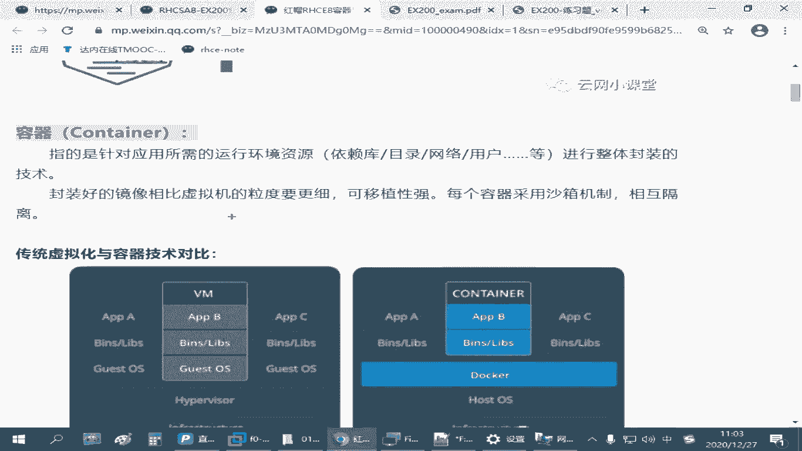

# 红帽认证RHCSA通过率90%以上的精讲教程，云计算大佬推荐 - P24：4.01-容器技术介绍 - 达内视频 - BV1ya411R7Zs

那容器技术呢？呃，实际上在红梦吧里边啊，他用到了这个port man管理工具。他官方的资料介绍的是呃简单的说你可以认为port man它是可以用来用来代替我们这个刀刻的。

如果你以前用刀客这个命令去管理我们这些容器，那你现在用portman也一样，就把这个命令名字给换一下就行了。大部分的操作是兼容的啊是兼容的。但是它的功能会更加完整。可能说执行的效率会更高。同时呢。

红猫八的系统里面这个容器技术。它会整合就在我们更高级的这种云架构里面，像open shift呀啊酷巴S呀，它都是利用利用这种技术来做的。是吧他可能在迁移的时候做云计算，架构部署的时候会更加方便。

当然咱们考试的考试的时候啊，C一的考试它不会考这么个更深入的东西。基本上就是我们在一个红帽八的主机上，相当于做一个单主机的容器服器。所以那这个地方呢我们最后后边啊要学会的一个最核心的命令。

就是叫PODMAN啊，叫papa man，其实是叫port的一个管理啊，名字来源啊。呃，POD呢它的英文单词的含义应该叫什么豌豆是吧？还有那个什么。飞船的那个叫什么飞分离舱啊。啊，如果叫豌豆的话呢。

就像那种。他在家里吃过那种豆子是吧？那豆子长在那个里边是一个一个的一颗一颗的，是不是长成一排的？对吧这个形状的。那其中的这一个豆子我们就可以理解成是一个容器。那一个泡的呢就相当于一个豆荚一样。

豆荚里面是可以放很多容器的。那关键在哪？关键就在于我们这个容器市啥呢，是吧？那核心的工具叫portman，是叫叫这个叫豆荚管理器。那其中的一个豆子叫一个溶剂，那溶剂又是啥呢？是吧？我们说的容器啊嗯。

大家如果第一次接触这个概念，可能你会觉得不太好理解是吧？其实我们说容器的话啊。它指的是我们针对某一种某一种应用，他把需要用到的系统环境。

依赖的软件包需要具备的网那种是那种目录目录结构、网络IP地址、端口、用户账号等等等等啊，把它封装在一个整体的单位里面。所以容器那就我们说瓶子一样嘛？是吧？你就来装东西的啊，那么容器它也是。

封装的一种技术。那原来在刀客的资料里边啊。

一般会拿容器和我们的数拟化做对比。那左边这个是虚拟化，右边这个是容器。那最终我们说一个虚拟机也好啊，一个容器也好。那我们哪怕用来做什么呢？都是用来对我们的用户来提供服务的。比方说我们要做一个网站。

是不是那你要做一个网站的话，假如我要有一个un键。假设我们用讯机来做。你像左面这个啊，中间我们要跑一个虚拟机。那这个虚拟机呢，我们是在我们的虚拟化平台上来搞的。那我们需要有底层的硬件是吧？

底层的硬件上面你需要有虚拟化的环境。不管是那种企业企业版的啊虚息化平台，还是我们现在在windows里面装的run。啊，不管哪种方式，那中间呢我们需要去在这个虚拟化平台上安装一个一个的。汛机是不是在的？

这叫汛机。那这一个一个的训拟机呢，它相对来说就是独立的啊。就是独立的怎么个独立法呢？第一个虚拟机我可以装一个s6S7。第二个虚拟机我可以装一个红帽8。第三个虚拟机，我可以装一个windows。

没你吧是吧。那每一个瞬间呢，其实我。可以给他准备。独立的操作系统。既然有独立的操作系统，那它就可以有独立的软件包。我可以给他建独立的配置，给他准备独立的IP地址。没对吧，是吧，所以这个是一个完整的啊。

基于操作系统环境的封装，这个我们把它叫虚拟机。那容器。基于我们刚才讲的一个目标啊，还是为我们的用户提供一个N这个的一个网站。那如果我们用容器技术来做的话呢，我们不需要这么麻烦。

因为容器技术它封装的力度力度呢会更小。容器技术它只需要包括。只需要包括他用到的软件包和为了运行这个软件包，它所需要的用到的依赖的软件包，一些函数库。还有一些目录，刚才我们讲到的网络啊、用户啊这些。

那其他的比方说lininux操作系统内核，它不需要。那每一个容器它也不需要有独立的操作系统。但是它能够达到我们相同的目标。就是最终呢我们可以。假设外边有个用户啊。那用户呢要访问我们的一个NG的一个网站。

我可以访问我们的一台讯拟机。在讯拟机里边呢装了一套NG，装了数据库是吧？跑了一个网页，没问题。我们用户也可以来访问我们一个容器，它同样也可以访问我们的那N可能呢N里也有数据库，访问它的网银也没问题。

但是它的好处在哪里？容器它的底层是和我们lininux系统是够用的。同样底下需要有硬件设施啊，上边有操作系统。容器技术所给予的操作性统环境，目前为止就是linux啊。嗯，所以没有windows平台的啊。

就linux。那linux平台上跑一个刀客，或者我们现在要讲的这个红猫巴黎的容器技术。基于这个容器技术往上面提供一个一个的这种小盒子。这个小盒子叫容器，它对比我们的虚拟机来说。

这个容器它封装占用的空间会更小。因为它的底层lininux系统的内核啊和那些共用的部分啊。是重复的。如果你这些不同的容器，它底层相同的内容，它可以除用。主要就是我们lininux核心那部分。

啊他是可以重用的。那你每一个容器，比方说。Okay。假设我在这个呃容器服务器上啊，我需要有个操作系统。😊，像假假设我也需要有一个无盘图是吧？我可以单独准备一个无斑图的容器。

这个容器呢其实linux核心跟你底层核心都是林ux斯的内核是吧？那是差不多，它只需要把乌班图独有的那些东西给你准备好就行。那假设你有一个无班的容乌班图的容器了，你上面再想跑一些其他的资源。

那你只要基于这个容器的基础之上，在上面再封装另外一层就行。可以一层一层的叠加的啊，这个跟剥洋葱一样，一层一层往上挪是吧？所以它这个封装的力度就很细，你可以有基于操作系统的这种容器。

也我们也可以有基于NJ的容器啊。那我们也可以有基于HTTP的容器啊。甚至你NG的容器呢，你可以跑好几个。你这个左边这个容器和右边这个容器之间呢。它的环境是相对封闭的。

虽然它不需要有具有底层的整个完整的内核代码。但是他上层的。应用只要我们愿意，你可以把它分开。意思就是说你在第一个容器里边啊，左边的第一个右边这个中间那个第二个，再右边是第三个。这三个容器里面。

它都可以有独立的管理员账号root。他可以有独立的根目录。可以有独立的那个。网络设备。可以有独立的程序，对吧？这个环境是分开的啊。其实它这种区分的方式跟我们虚拟机差不多，就是独立这叫什么沙香机是吧？

就隔离的啊隔离的。这种方式呢就可以让我们的管理员啊在部署一个，比方说你要搭一个网站。你要快速交付一个网站，你就会很方便。那正常情况下，比方说我们有一个linux服务器，你说你要。

部署一个基于NG的环境的网站。那我们是不是要去装NG一个包啊，对吧？装好包去配相关的配置文件，准备网页资料，然后再配置IP地址端口，然后往外发布。但是如果你有一个NG容器的话，你只要一条命令。

启用一个N的一个容器。在启用这个容器的过程当中，你告诉他你应该建定什么端口，应该用哪个网页目录。马上就可以了，这个包不需要我们装。

因为ND这个容器里边已经把它运行这个NG网站程序所需要的那些依赖的包都已经准备好了。甚至我们都不用去考虑这个包的版本啊，这个圆呀是吧？那容器就是基于这个目的诞生的啊，要简化我们做应用交付它的一个难度啊。

那你刚刚用NG发布了一个网站。那假设我现在又要做一个time cat。那你现在在平时训机这个技术来做的话，你可能要单独做一个训机。如果是正常的真机，你还得单独去装汤姆卡。是吧再换句话说。

那我同样基于N这，我可能要准备两套或者三套网站。它用到的那个端口不一样，或者算是IP地址不一样，域名不一样。都有可能实现的。那如果你在我们的真真实际平台上，或者你通过不同的讯机来实现，都会特别麻烦。

你一套机器用一套NGX，你得配置虚拟主机。然后一旦你这个NG个是坏了，那所有的虚据主机都发不了。是不是啊？那如果你要是每一个虚拟机机虚拟机来做啊，那第一个虚拟机提供一套安吉斯。

第二套虚拟机提供另一套安吉克斯。这这个代价太大了是吧？成本太高了。但是基于容器很方便，一条命令起第一个，另外一条命令起第二个。很快就可以开启不同的N这服务器啊。

所以这个就是我们容器技术给我们带来的好处啊。

那么换句话说，我们说的容器。正好昨天我们跟那个。有个拓展班做串讲是吧，打了个比方。你可以把它理解成啊，如果他觉得不好理解的话，它相当于什么呢？相当于一个更加袖珍版的啊或者是迷你版的。

更加袖珍版的虚拟机啊。每一个容器相当于一个。Yeah。相当于一个袖珍版的训机。我们指的容器指的都是正在运行当中的啊。运行中的袖整版的讯机。那从另外一个角度来说。

和我们单独去装一个安ex或者什么某某某某软件包对比。他有相当于一个。运行当中的豪华版的。软件包。也就是说容器它是封装在一起的一个整体。它比我们虚拟机，它的力度要小是吧？要细啊更加细致。

但是呢它比我们的单个的软件包呢比要大，是不是啊？你说我要装一个NG，你肯定不只装一个包，你要配置很多东西的。装衣赖包呀，是准备往年目录了，发布很多东西，是不是啊？但是呢那容器比单个的软件包呢。

它的力力度要大。是鉴于我们的讯拟机和我们的软件包中间的一个单位啊。哎，这叫容器是吧？所以他可以解决我们。通过装单个软件包再一个一个来配置，这个很麻烦。但是也很灵活是吧？那就很费劲。😊。

他把这个很多的包呢组装到一起啊，封装成一个整体，让我们用户呢更加简单。但是呢它又不像我们虚机。那么大。那熏机呢其实它也很方便。但它占的空间太大。比方说大家下载的我们这个红猫的练习环境。

那十好几个G呢是吧？😊，很方便呀，大家只要把这个环境下载回去之后，你看我们那个什么ro的捕助顺据不都有了吗？😊，但是你在迁移的时候不方便吧，是吧？😡，你运行起来之很吃力啊。你在我们这个真机上。

你跑一个火爆的环境，跑一个没问题，你再跑两个呢，可能就就跑不动嘛，是不是？你像我们那有些虚拟技呢重启之后呢，可能就花屏了。啊就是这种情况，但是你跑容器的时候，那每一个容器它运行运行的时候。

其实其实就相当于一组多个程序把它开启开启。并不需要有独立的操作系统啊，所以它比较节省资源。你如果只是在做应用交付，那其实很很简单的啊。这就是它的一个关键点啊。那这个关键点理解了之后，后面还有一个概念啊。

大家要了要理解的。刚才我们强调了每一个容器，它相当于一个正在运行当中的。讯机或者是运行状态的软件包。那一定还有一个没有运行的是吧？就静止状态的，我可以下载，我可以用U盘拷贝的。

这个状态啊就静止的那个容器的一个状态。啊，叫什么呢？叫镜像。你肯定有一个静态的东西嘛，是吧？静止的容器，这个一般我们把它叫做镜像啊。你如果再跟我们平时用的那种环境打比方的话啊。Yeah。

这个镜像就好像我们给大家分享的网盘里边的东西是吧？红帽练习环境往盘里那一个压缩包。什么F0RHEL82是吧？然后1个120201207这样的点ZIP那个叫镜像啊。那容容器呢真正运行起来之后啊，这个容器。

他就好像大建你把这个镜像下载回来之后，解包完成，并且开机是吧？这个状态就是我们所说的容器啊。但对我们用户来说，这个容器才有价值。你一个镜像它好像没用，它一定子跑起来是不是才有用啊，是吧？

所以很多时候我们就简称简称容器技术啊。但是你要用容器，你必须先有镜像。你如果没有镜像，你那个容器没法跑。你如果不从网盘里面下载那个那个那个咱们那个练习环境，或者你没有拿U盘拷贝。

你要打开我们这个虚拟机环境，是不是也没有？

那这是不可能的吧，不能凭空生成啊，所以我们跑容器也一样，需要先有镜像啊。

那这个关系你要理解关系的话，就得把它倒过来是吧？先有镜像，你把它运行起来之后再成为一个容器。所以这是一个叫运行中的啊。运行状态的叫run time是吧？运行中的。

或者说起码你不管在内存里面状态是不正在使用，它一定是在和内存里边有一个地方把这个记录的啊记录下来的，它是可以使用的一个状态，活动的一个状态啊。但是镜像呢是静止的可以存储的啊。禁止的。可以存储传递的是吧？

传输的。呃，容器这个呢就是动态的啊运行中可以使用的。两个概念啊，一个镜像，一个东西。这两个概念理解完成之后，再理解这个概念。那这个镜像谁来给我呀？是吧谁给我提供这个镜像呀？😊，你如果把它当虚拟机对比。

那这个虚拟机咋来的？要么我们自己创建一个虚拟机，重新装系统，一步一步给做一个镜像，可以吧，是吧？要么。那老师给你朋友给你。或者找一些网站下载可以吧？所以你需要有一个来源啊，一个途径。

你如果拿它和软件包做对比也一样。平时我在我的这个linux环境，我要装一个NG的一个包。呃，亚么杠Yinsstore或者雾漫图环境ABDgt杠外instore是吧？那你是不是要提前配一个圆啊。

你配好圆之后，你才能够装那个包啊。如果你是手动装包，你是不是得找网站上下载那个扩展名是RPM的那个文件，或者你要去下载乌班图环境那种点DB的那种文件，是不是才能装这个包？那我们现在要用容器。

这个镜像你也得找一个地方来获取。Yeah。那从哪获取呢？你也可以一样啊，找别人打好的包，直接给你提供。这是没问题的。那咱们在我们给大家提供这个网盘里面啊。给大家提供了一个叫破破 image杠NG点套。

这个就是打包好的一个迹象。如果大家在你们自己家里练习的时候，你那个真机跑不动，跑不动我们那个环境是吧？你可以直接找一个正常的linux红包8或者3noS8的主机，你把这个镜线下载回去，导入也可以练习。

闷吧，这个大概100多兆。但是我们考试的环境的时候呢，你没法拿这种方式去考呀，是吧？所以考试环境呢它会给我们一个叫什么呢？叫仓库啊，叫仓库服务器。仓库服务器啊，我们可以通过仓库服务器来下载。

用来跑容器的这个镜像啊。这个仓库服具呢？就是提供镜像的啊提供镜像资源的。它可以让我们下载镜像。如果你在这个仓库服务器上，你注册了一个账号。人家给你这个权限的话，你还可以上传镜像。

把你自己准备的镜像呢给传上去。你从这个仓库下载的镜像，我们后面是可以改的。你改完之后，你可以提交存到这个仓库服务上去。Yeah。这个英文名称呢一般叫那个什么叫reg群。另外写一行。

这个仓库服务器有时候也叫做注册表。啊，注册表浮起啊。这是翻译的问题啊，一般叫什么呢？叫reg tree啊。镜像的话呢叫image啊。容器叫coneno。对吧。真。😡，所以这三个关系啊要理解一下。

那其中的其中的这个仓库服务器啊。Okay。常见的。仓库服务器。这个仓库。可以有官方的仓库啊，像红猫的仓库的话呢，叫reg tree。点excess。点red hat。这 come。这个我们去测试过啊。

有可能需要去订阅啊，有些特殊的镜像是你需要去订阅红包的服务，你才能够去下载的对吧？那也有一部分是公开的，可以免费下载的。然后还有一个第三方呢，原来是一个叫刀cker刀cker点IO。IO啊。

原来那个刀客刀克的镜像。我们今天用的这个port man和docker是兼容的。说你如果自己在家练习的时候，你把仓库服务器指向docker点IO也能用。OK吧，就你没有印镜像环境也能练习啊，没问题。😡。

当然这些是官方的或者第三方的这些仓库服务器啊。那除了这些仓库服务器以外呢，我们还可以有私有仓库啊。私有仓库就是我们自己建的。如果你咱们自己会部署这种镜像，会制作镜像，我们可以把它放到仓库服器里面是吧？

去发布也是可以的。比方说。咱们那个考试环境。考试环境呢你不能上互联网呀，是吧？他会去他会给我们提供这样一个仓库。那个仓库呢叫regstry点LAB点。啊，一个 example就 come。

这是在我们练习环境才能用的啊，在外边用不了。是吧很内部的，上面这两个呢是叫官方的啊，官方红帽官方的。Yeah。Yeah。当然也有一些其他的一些官方的是吧？哎，后面这个是刀刻的啊。

你可以把中文翻译成这个啊啊docker那个官方网站啊提供了一个仓库，也有还可能还有那种第三方的开源的。所以这个仓库服务器，你现在看我们写的这一堆换软件包子那个打个比方的话，有点像我们那个养员。

是不是样么园不就是给我们提供那种软件包的吗？😡，那软件包的话，我们平时你也可以用红帽官方的源呀，也可以用sWS的源呀，也可以用我们国内的阿里巴巴的源呀，是吧？问题三问呢也一大堆。😊。

所以你这么一比较的话呢，你就更加要了解我们这个容器技术，就是一个豪华版的软件包。封装的更多啊，装了很多个软件包在里面。它可以直接运行啊啊，这它的好处啊。那其中呢。仓库服务器镜像啊和容器。

那在我们那个微信笔记上呢，下面有个图片，这也是来自于刀cker的啊。可以更好的阐述他们之间的一个关系啊。刚才我们讲的这个镜像，就中间这一块这里一个镜像，这是静止的啊。这个镜像呢我们可以嗯下载从哪下载呢？

从那个仓库右上角这是仓库，这刀刻的那个regstry是吧？仓库下载的动作叫破啊PULL如果你在这个仓库上有账号，你可以上传。或者这个镜像呢下载的时候有要求授权是吧？那你也要去提供账号啊，提供账号密码。

如果要上传上传的操作呢叫poush。就是往上推。破是往下拉是吧？你下载镜像，下载回来之后呢，你就可以离线使用。一旦你从仓库里面把这件下载回来，你说暂时我不想用这个仓库了。嗯。你就可以不上网也能用啊。

就在你这个机上，不上网也能用。因为你看这个叫卖computer嘛，就你这台机器。后边这个仓库呢是另外一台机器啊，网上的。上传下载镜像啊。上传咱不用管，在考试的时候下载，你一定能会。😡。

因为考试环境它会给你一个这样的一个服务器，告诉你仓库地址，告诉你账号名和密码。那你得下载完，下载一个指定的镜校到你的这个主机上，然后你才有条件去运行容器。明白这意思吧，是吧？😊，那有了镜像之后。

我们就可以把它跑起来。你看较乱啊。把它运行起来之后啊，它就变成了容器，这叫运行的状态。其中在正在运行状态的这个容器呢，我们在控制的时候很灵活。这个时候你可以把它当成我们跑到一个进程一样。

正在进行当中的一个程序啊，你可以给它控制它的一个。呃，启动。可以暂停是吧，可以重启这样，是他有三个控制指令。一个叫stop，一个叫start啊，还有一个叫restar。

对吧这是你去控制这个运行当中的这个。容器啊。这叫容器。呃，其中呢我们在管理镜像的时候，比方说你下载完了一个镜像，这个镜像。因为你下载的操作是直接和仓库联系的。这就好像我们平时用亚么装包一样，亚么装包呢。

你可能我们并不关注你那个软件包在哪里。但是我不希望我每一次我要装这个包，我都去联网。因为有时候我想离线安装呀，是吧？这个时候怎么办？我是希望把这个包存下来的。那我们下载完的这个镜像呢，我想把它导出来。

方便拷到我的U盘里边，方便分享给别人是吧？这个时候可以有个操作叫C。这叫备份。可以把镜像导出，导出之后呢，默认的格式是扩展明示点它啊。你只要做一个image导出啊C。它就自动生成一个点tt文件。

要用重电向那个大于号啊。那如果别的人分享你一个镜像，比方说刚才我们给大家讲的，在网盘里边不是给大家提供了一个镜像嘛，是吧？那那个镜像你们拿回去之后，你怎么用呢？那这个时候就算你没有这个仓库，没关系。

你可以导入。有个note，所以大家要学会怎么把这个镜像导入，导入到你这个环境之后，你就可以用这个镜像来运行容器也是可以的。左边这个。是我们用来制作镜像的啊，这个咱们不讲了，考试也不考。

如果我们想从零开始生成一个镜像，需要做一个制作清单啊。然后根据这个清单呢去提供我这个容器容器里面要包含哪些东西，可以一步一步的，然后把这个刨起来，就可以生成一个镜像，是这么制作的。

咱们暂时先不涉及到这一块啊，这会麻烦一点。OK吧，那这个单家就理解了这个容器镜像仓库他们的关系了。

