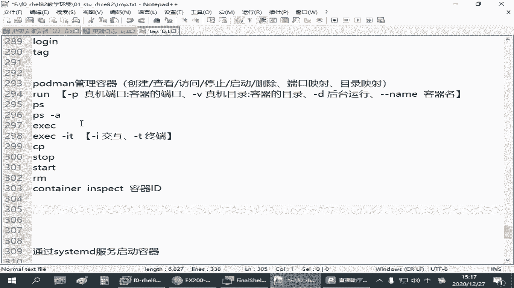
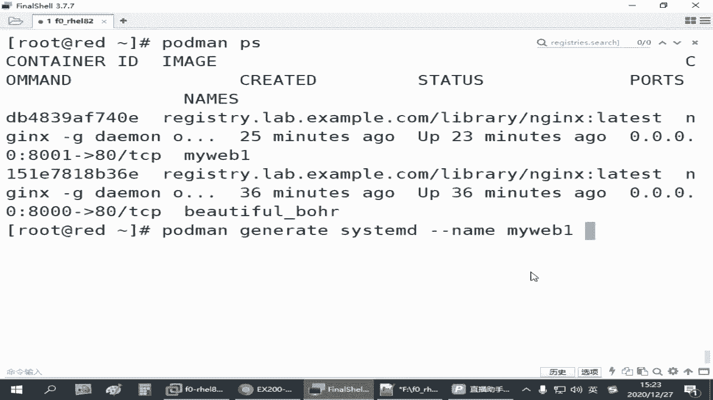
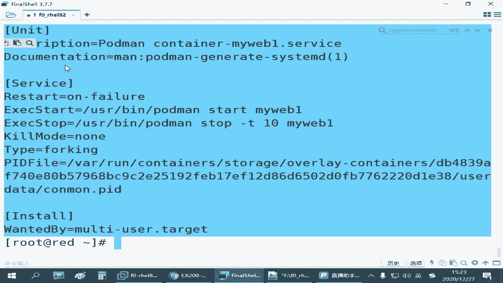
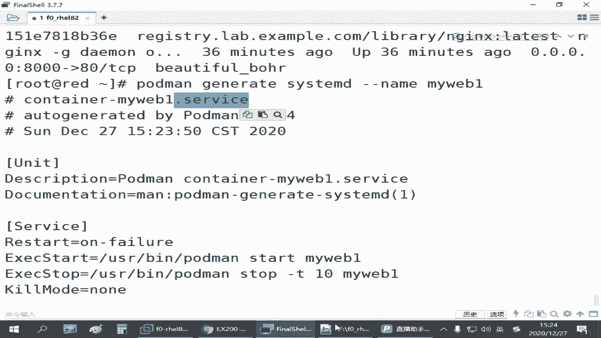
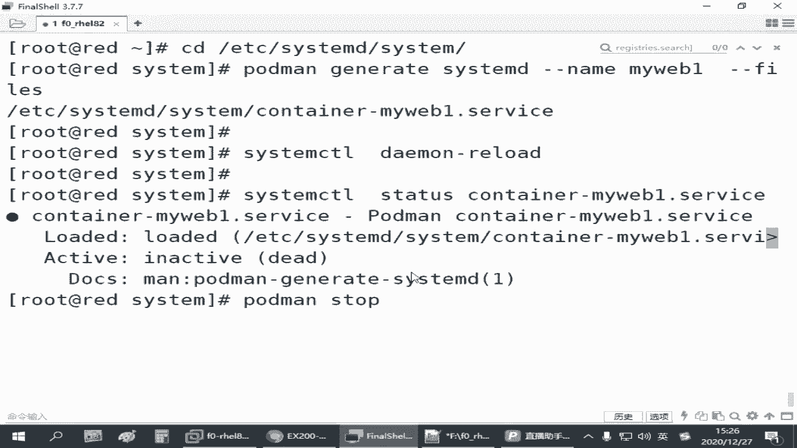
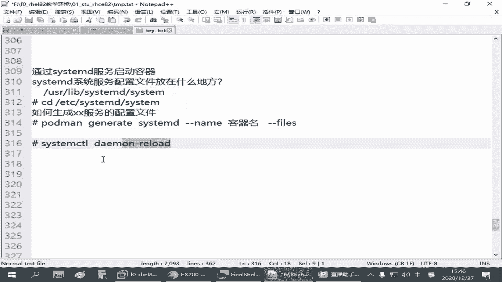

# 红帽认证RHCSA通过率90%以上的精讲教程，云计算大佬推荐 - P28：4.05-容器服务化 - 达内视频 - BV1ya411R7Zs

来，那刚才我们学会了这个容器的操作啊。从仓库里边下载镜像，然后把镜像跑起来是吧，就变成了容器。让大家通过容器呢提供了一个网站服务，是吧？呃，但是他有个问题啊，就是我们手动开启的这些容器。

他是临时的啊。呃，怎么个意思呢？就跟我们开那个系统服务一样。跑程序一样。它不是永久开的啊，一旦我们这个red这台主机呢重启。他其实这个容器呢每一次都得让我们手动去跑一次。对吧他没有办法实现开机自习啊。

像刚才我们。那刚才我们通过port man run这个命令啊，在我们8001这个端口提供了一个呃N的一个容器服务，并且给它指定了一个名称。那这个你的瑞主机一再重启。

这个容器呢你都得手动来跑这样一条命令啊，但你看我们这一条命令好像写起来老长了，是不是？那实际工作当中呢，有可能还还需要有更多的参数。那你每次都这么敲的，敲的很累的。那所以我们后面有一个点啊，叫什么呢？

呃，叫做。容器的服务化，我能不能把这样一条命令？变成一个系统服务。使得我们瑞的这台主机在开机的时候能够自动运行这个容器。那我们管理员不就轻松了吗？是不是这样的是吧？Yeah。

如果要通过sstemD服务启动容器，那我们需要了解的地方啊，第一个方面就是我们linux系统服务。就关于这个CTMD控制的是吧，它的系统服务的配置文件。放在什么地方？Yeah。对吧这个要知道。

其次呢就如何生成。我们要求的某某服务的配置文件。大家不要想去手写啊，这手写太累了啊，就如何快速生存啊，某某服务的。配置。最后呢就是关于这个服务怎么让怎怎么样让让他把它给启动起来。那这两个搞定。

那就没啥难的了啊。那其中呢。呃，系统的啊linux系统的CCD。就由那个ssteem controll控制的啊，那些配置的数据呢呃正常情况下应该是放在我们的。有两个目录吧。

一个目录呢是在我们的user map下边有一个叫sstteem B，下边还有一个叫sstteem啊，在这个目录下。你会发现有一堆啊扩展名是点servs的是吧，还有一些别的类型的啊。

这些配置文件啊都在这里面啊。这是一个目录。是吧这是系统的原始的那些系统配置啊，一般都在这。那除了这个以外呢，一般我们管理员，如果我们自己另外再建的系统服务啊，一般建议大家放到我们的ETC下。

ETC下面有个叫CtDCS team啊。这个s teamD就是我们linux系统现在用的比较新的。前面是不讲过是吧？那个叫系统控制器啊，然后系统服务一般在一个ss team这个目录目录底下。

你把那些配置文件放到这个底下。服务的配置呢，一般后面要加一个，它会有一个什么点servs啊，买个后缀的。你有这个之后，然后把它给启用啊，然后就可以了啊。所以这是它的目录。

如果我们要把容器作为一个服务启动，我们需要在这在这个目录下边或者上面这个目录下面啊。建一个某某某某服务的配置。服务的配置啊建好之后呢，然后我们再。把它给重新加载一下，通知系统说哥们，我这多了一个服务。

你帮我更新一下是吧？等你更新完成之后，那么我们以后就可以像管理其他的服务一样啊。来管理这个容器了。那如何生成这个呢？还有个只能叫port慢啊，port慢。

还是portmanport man那个叫什么叫什么呢？一个叫genegenerate。有个叫ssteem地。这个到时候你敲的时候多用t键啊，万一我这敲错了是吧？呃，后边。😊，要跟上一个什么呢？

杠杠类目指定你当前已经运行的。容器的名字啊。这个是读取当前已经启用的容器的数据。这样的话他会快速生成一个配置。啊，给我们，只不过这个配置呢是显示在我们的屏幕上的啊。然后我们看一下。

比方说我们port manPS看一下刚才我们是不是有一个。8001端口的是吧？啊，找这个吧呃，名字我们给它定义成了外卖Y1。所以这是已经开启的一个容器啊。那如果我要把这个容器把它变成一个系统服务。

每次开机之后呢，我就我就自动能访问801端口，拿到它的一个网页。是不是啊那这个时候怎么办呢？我们可以用port man啊jalonrate table播出来。江rateCT5D推不出来。

是吧然后后面跟上刚刚类目。跟上卖外部一也能推破。啊，这个杠杆类目在这里啊可以简写成个N啊，就一个杠一个N就行啊。这个操作我们直接回车。

你看他生成了一份这样的一个文件是吧？这个就是我们标准的啊，现在红帽七红帽八这些统现在都用到的方式。

的标准的那种系统服务的配置啊。啊，它的内容，你看它它生成的这个服务的配置啊，一般如果你把它存下来，它会给你定义成一个叫container横杠，再跟上容器的名字。

所以其实就是conttainer杠跟容器名是吧，就某某容器，它的系统服务的配置可以是这个样子的。来我们得把它保存下来。啊，你不保存，那也没得打，但是显示在屏幕上的。如果要保存下来的话呢。

在后面又加一个刚刚f。

Yeah。再一个这个。就保存为文件。默认存在当前目录上。那比较简单的方式啊，你想想用起来就更简单的话呢，就我们可以先CD到这个目录，然后再执行下面这个命令。就可以生成这个配置文件放到正确的位置。

因为你只有放到正确的位置，系统一会才能找得到啊，要不然找不到。所以刚才这个操作。来，我们CD到ETC下边的C题目。D下的Ct。再把刚刚这个命令调出来啊，后边加一个杠杠fis。

这个时候你看它是不是就生成了一个这样的一个配准价。那你在这个目录下有这个文件之后，我怎么样让它生效呢？系统里边直接执行CScont。叫demonreno。重新加载。啊，这这个关键啊。

进到正确的服务配置目录，然后使用你当前已经运行的my web一叫这个名字的容器，为它生成一份服务配置啊。生成好了之后，执行sctrl im re啊，把它加载。从现在开始。

你的系统当中就多了一个这样的一个服务啊。就多了一个这样的一个服务。这个服务如果我们要用它的话。我们就可以用CS题目。cttrorl statuss来检查它的一个状态，后面跟一个conter。

tableable一下是吧？你看现在反应的一个状态啊，当然啊你现在看的时候呢，它是一个。没起来的是吧？😊，因为刚刚那个容器是我们手动洗的啊，他没有看到啊，我们手动洗的，你现在通过这个服务的配置去管理它。

那如果你想使用它怎么办呢？我们可以先获慢啊，stop。把你刚刚那个容器呢先停掉啊，先停止。

我们先确认一下ID啊。8001这个DB48是吧？你先把它停止掉啊，然后通过服务的通过服务的方式来控制它。就是port的man stop。跟上这个。系啲。停止。注意啊，是停止啊，不是删除啊，千万别删。

你删除了之后，以后用服务再控制，它会找不到这个容器啊。那那那就那那你到时候还得重新再运行一个容器，重新生成一遍啊。你是把它停止，别删啊，用stop，然后我们就可以Cte controlstar。

Container啊。起起来啊起来之后呢，再检查它的状态。是不是正在运行了，对吧？这就正在运行了。那如果你要停止，就是stop嘛，要重启，就是瑞大，这个大就就亏了吧，是吧？那我前面讲过的。

以服务的方式来控制。那现在我们说希望它重新开机之后自动运行。怎么办？你内部吧，对，就这个啊，会面会跟上我们这个服务的名称啊。M web was。就设成开机之后自动运行。那这个做完之后。

我们可以重启验证一下啊。既然开机自动运行了嘛，是吧？我们把readide重启一下，重启完成之后呢，我直接访问刚刚那个8001端口，如果好用那就没问题。啊，当然你6的主机。

他的这个防火墙什么要开这个端口啊？你假设你从别的机器去验证的话。要不然你防火墙不开也不行是吧？你本机测试呢可能就无所谓。重新启动我们的ro主机啊。稍微等一会儿啊。嗯。写的慢是吧，重新掰一下。哎。

连过来了是吧，然后CURL。就是咱们不管做的怎么样啊，一定要去验证啊，因为验证结果是对的，才说明你这个做的是对的。不要太相信自己的眼睛是吧？😊，8001。嗯嗯。好，那这是刚才我们给大家讲到的呃。

容器的服务化。我们先CD。到这个目录啊。然后再执行这个命令。是吧还是要先先运行这个容器啊，你甚至执行这个第二个命令的时候呢，我们打个警号方式，这就是咱们的两个操作嘛。首先这个之后呢。

你要做一个那个叫什么CScontrl是吧？然后面跟上我们的那个叫dere啊，这会重新加载这些目录下的。那些新增加的配置文件，或者有些配置文件，你内容改过了是吧，它会去重新读取啊，所以叫重载嘛。

那个叫rero啊。你这个如果重载成功了，你那些配置文件，包括你S100那个属性都没问题的话，你现在才能够看到那个服务。否则的话你直接去操作，他会告诉你没有这个服务的。如果有那个服务之后呢。

你就可以去把原来的容器停止，再把它用服务的方式啊，CS team看错。去把它给start。对吧把它个star，然后你再把它设成enable重启验证啊就可以了。

