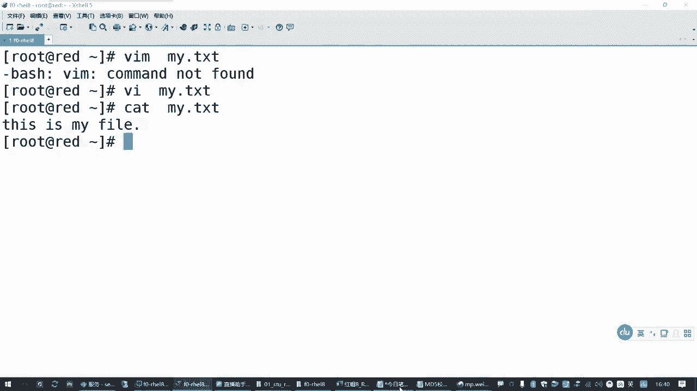

# 红帽认证RHCSA通过率90%以上的精讲教程，云计算大佬推荐 - P4：1.03-使用vi文本编辑器 - 达内视频 - BV1ya411R7Zs

呃，刚才有同学问到的。只看目录是吧？

就LSDLS杠D我们给他讲了一个选项，只看目录嘛。

那这个其实用的比较多，但是呢我们说是只显示目录本身的信息。这个如果你看的这个是个文件，它也包括啊也包括就相当于你看的这个参数呢，它不是目录，它就。忽略了也把它当成文件本身，看这个文件本身的属性。

所以这个大家别误会啊别误会。他是按照目录去理解的，但是你不是目录怎么办呢？他也得给你列出来呀，是吧？😡。

🎼所以LS这个命令它本身没有给做过滤，没有给做过滤。Yeah。🎼举个例子。我们现在在刚刚我们创建的这个目录下啊，这个目录下不是有目录，也有文件吗？那如果你用LS mini杠D。So。

你如果只看A下的B下的C。你底下加个星号，这是代表任何任何文件吧，是吧？这是linux mini行一个特殊字符啊，叫通配符，信号可以代表你任何你懒着敲的字符。或者你根本你就不知道你也不知道是啥是吧？

我就懒得写了，给用一个星号代替啊。😊，他其实会把这些都列出来啊。虽然我加了一个杠低，那后边这两个不是目录，那它就当成一个目录本身，只看它本身的属性。对吧，是这样的啊是这样的。

所以D它的本本质上就是看你给它的一个参数自己的属性。而不看它底下有没有呃，对于文件来说呢，它其实底下没东西了，但是它也只能这样啊也只能这样啊。哪怕你在后面加一个饭啊。对吧他也是能看到的。那这个时候呢。

其实你在看文件的时候，你加不加钢低，那个意义不大。对不对？只不过他他在他在这里就是凑数的啊，就凑速的。😊，本来你只想看底下的这些。本身的属性。那恰巧你把这个二给包含了，把这个四也给包含了。

那你既然提到他的时候，他也不能出了，不出来呀。所以这个不能做过滤啊不能做过滤。那大家如果要做过滤的话呢，你可能需要结合我们后面要讲到的一个，现在还没讲到啊。所以大家刚刚有同学说要举个例子，我举个例子。

你可能要结合这个杠L。杠L你在列结果的时候呢，它的目录和文件属性是有区别的。对于目录来说呢，第一个应该是一个D，就代表的是directctor。呃，文件的话呢，第一个就是一个横杠。

那如果你要做过滤的话呢。要结合后面我们要学到，这个这个不着急啊，因为今天讲不完这个呃，后面用到的时候我们再讲。那今天就相当于针对我们前面这个结果，上面这个结果啊做个过滤。我只想看字母D开头的。😊。

那你就可以做一个这样的一个操作，对吧？就把目录给拿出来。那如果你要查一个目录下面所有的东西。那我们现在这么查，是不是只能查ABC底下这一个层次啊。如果你要查很多个层次，那其实还有一个选项。Yeah。

有个杠大写的啊，这也叫递归。当然对于我们这个目录来说呢，底下没多少东西了，你价格当更大了好像没没多没多大意义啊，其实效果是一样的。😊，但是咱们换一个目录就不一样。😡，比方说。我们把这个D去掉。

在所有的结果里边啊，我们找了个bo。boot目录列出底下的东西，过滤出目录相关的那这就是目录相关的是吧？你看全都是D开头的。

Yeah。所以这个刚刚问到的同学呢，你可以体会一下。这是咱们后话啊，咱们后边再再讲啊，现在不着急。

就说LS本身杠D那个选项呢，它不能只过滤目录，它不做过滤的那个功能啊。

或者我们把它优化一下，只看目录或者文件。本身的信息。那即使它是目录，下边有东西他也不看。给你写准确一点是吧？即使这个参数是一个目录，它下面是有东西的。

Okay。Yes。下面还有内容，它也不会显示。

这个可能更准确的是吧？那其他的呢还有一个就是隐藏文件啊。这个比较简单的给补充一下吧。但谢。这是列出隐藏文档啊。在lininux系统里边，隐藏文档指的是名称。以一个点号开头的。这些文档。包括目录。

包括文件啊，只要它是一个点开头的那你在看的时候呢，你必须加一个杠大A才能够列出来，要不然看不出来。

举个例子。我们CP到。root这个目录下不去，正常你LS跳一下，你会发现下面就一个文件。但是实际上，对于root管理员用户来说，他的主目的下门拉远远不止一个文件。还有很多文件呢被系统给藏起来了。

如果你想看这些藏起来的文件，就加一个杠大A。对吧加一个这个哎，你会发现哎这还有隐藏目录了是吧？还有好多隐藏文件啊，它的特点就是用一个点开头。😊，已点开头的文件默认不会显示，除非你用LS来看的时候。

加一个杠大写的A。啊，就这么简单。

好，那这是刚刚前面给大家给大家讲到的这些命令啊。😊。

来再看一个啊闭绘的一个工具，叫VIM啊编辑器。呃，那大家需要知道的是VI和VIM是两个软件包啊，也是两个命令。嗯，那么在最小安装的lininux系统里边呢，默认提供的应该就是1个VI。

所以你可能敲VIM没用啊。那VI的话呢指的是什么呢？VI指的是一个叫好像是叫motioncer。Interface。叫可视化界面。这是用来编辑lininux文件的一个编辑器啊。

这个编辑器呢以前是那个java的一个作者写的啊，还是很牛的。所以VI也是我们linux或者unux系统里边默认的文本编辑器。因此，你最小会安装的系统也有。它是unux。原来在s系统上的哈。

unuxlinux系统中。默认的啊。文件编辑器就是它呃，那为什么我们又给它提了1个VIM呢？啊，因为因为VIM它比VI还好用。它是VI编辑器的一个增强版。一个增强版啊。好像叫什么in blue啊。

大概是这个意思，叫VIM啊这么来的。那其实是VI编辑器的增强版。那后面大家下午考试要写这个什么。嗯，aner伯啊这些脚本啊是吧？那有时候你用这种增强版，它就可以支持安er伯的一些语法一些特点。

这个用起来会更加方便。对吧所以建议大家用这个。但是这个呢是另外一个软件包啊。需要另外安装。啊，你们考试的时候也是默认这个包是没有的，这个命令是没有的啊。它有一个软件包呢叫VM enhance。😊。

由这个软件包提供。这是河南啊一个自由工程师写的。跟原来不是一个作者。但是一般情况下，我们用的时候呢，就就把它当成VI和VIM1样用。其实现在在工作当中单独用VI的也不多了，大多数时候都是用VIM。

那万一你没有VIM，你就放心，VI肯定有啊。😡，那基本的用法这一块的话呢嗯那我们需要知道的一些概念啊。既然是VIM编辑器嘛，那大家在用这个编辑器的时候。几个目标。嗯。

首先呢我们要学会使用VI或者VIM啊，随便选一个是吧？用这个编辑器。要学会去修改文件。W。Yeah。修改文件啊，那还有一个呢就是创建新的文件。Yes。就这两个功能，这两个功能你会了不就完了吗？😡。

那基本的流程，我们在打开一个文件的时候，那你首先要学会是吧？我们用这个命令怎么去打开一个文件？那很简单。😊，VI或者VIM你去编辑哪一个文件，把这个文件在哪里，你得告诉他。😡。

如果你就是在你当前系统里系就在在你当前这个目录下，你要创建一个文件，那更简单，直接在后边写一个文件就行。😡。

起个名字。或者叫卖点TXT。对吧加一个这个。那么它就会你看这提示VIM没有吧，是吧？那这个时候你就没装那个包啊，当你可以装了再用啊，但是我们这里呢直接打开VI是有的。他会打开一个新的临时文件。

嗯，但是打开这个你执行这个命令之后呢。你写一个新的文件名啊。包括他在哪个目录都可以一起写。😊，这个呢可以打开一个编辑器。打开VI编辑器。并建立临时文件啊。呃，然后你打开之后怎么用呢？啊。

然后大家要知道的一点就是你打开之后，这不像我们。😊，我们windows系统里边这个有什么菜单啊什么什么的，没有啊，还没有。所以你打开之后，仍然是一个命令行界面的。😊。

那在这个命令行界面我们怎么用啊，你需要知道我们VIM编辑器它有个工作模式啊。有三种工作模式。这个要知道。其中呢。打开一个编辑器，刚进去之后所在的一个状态叫命令模式。就你可以做一些复制粘贴啊，这些操作。

对吧？可以做这些操作。😊，呃，然后呢嗯还有一种模式呢，就是你你可以往里边录文字的。😊，啊，录入文本那个叫输入模式。就添加是吧，退格删除啊，做这些操作的。啊后边还有一个模式呢叫墨行模式。

这三种模式大家要知道。那我们刚打开一个文件之后，进去所在的一个状态就叫做命令模式。那这个时候我想往里面写东西怎么办呢？你必须先进入到输入模式。

啊，那从命令模式怎么切换到我们这个输入模式呢？这个方法有很多啊，但是一般最常用的一种方式。就是按字母键I啊。按这个键。可以从命令模式。切换到输入模式。

所以我们打开一个文件之后，按一下字母键，哎，它底下会变成insert是吧？那，这个时候就换了一种工作模式了，你可以往里边写东西。😊，写this is my file是吧？随便写啊，你敲的这些东西呢。

他都认为你是在往这个文件里面填空啊。😊，这个状态叫输入模式。

因此，这个大家要熟悉的。啊，那输入模式我写了一堆东西，我想退出来，我想保存。😡，怎么办？对吧？那要保存这个文件的话呢，我们需要去返回到另外一个模式。啊，返回到一个另行另外一个模式叫墨寒模式。啊。

那怎么样从我们的输入模式切换到我们的墨行模式呢？输入模式，另外一个叫墨寒模式。因为墨罕模式呢，它主要是最常用的操作就是保存。退出编辑器。输入模式它最主要的一个作用就是录入文字。那命令模式呢。

一般是用来给我们阅读的。还有查找复制粘贴。啊，做这些操作的。这每一个模式它功能不一样啊。那现在我们刚才给大家举的例子，我录了一堆文件啊，录了一堆文字。我们现在想从我们的输入模式切换到墨行模式。行不行呢？

不行啊。不能直接切换。那如果你想保存退出呢，你先得回到命令模式啊。你不能从输入模式直接切换到墨罕模式。那这个时候怎么回去呢？Escape啊。键盘上的escape。你现在在任何模式都可以按escape键。

回到我们的命令模式。所以按一k键可以从任何模式啊，不管你现在在哪个状态。你在命令模式本身你再按一下，无非多按一下是吧？你如果在默幻模式也可以按这个。😊，在输入模式也可以按这个啊，所以是从任何模式返回到。

你也可以叫切换，也可以叫返回命令模式。那如果我要保存退出怎么办呢？啊，这个只能从我们的命令模式。再去切换。Sure。哎，这这个地方有点。😊，枯燥啊。那我们按什么键可以从命令模式切换到我们的墨行模式。

是吧那这个就不是I了啊，是什么呢？是个冒号。😊，就你键盘上那个冒号啊，跳了个冒号就行。😡，这样就可以回到这个模式。

哎，因此呢你看我们刚刚改了一个段东西，要回去要退要保存退出，先要按键盘上的Escape回到命令模式，再输入一下冒号，回到墨行模式啊，为啥叫默行模式啊？是因为你按了一个冒号之后。

在这个编辑器最底下的一行会显示一个冒号，在冒号后边我们可以执行退出的操作。

啊，主要是这样来的啊。那默罕模式怎么退出？Yeah。Yeah。在墨航模式下。常见的退出方式。有两种啊。一种方式呢。冒号后边打一个W扣。这是保存你所做的修改并退出。嗯，还有一种呢就是在冒号后面打一个扣。

感叹号。这是放弃保存。不存盘啊，放弃保存并退出。这两个是用的最常见。当然如果你根本就没有改过，其实你就超一个客户也也就退出了。😡，但如果你做过修改，你就不想要了，请加一个感叹号啊。

这就是VIM编辑器最基本的用法。那刚才我们说的这三种功作模式，大家可以认为这是VIM编辑器或者VI编辑器啊。😊。

它的三种变声的一个状态。嗯，很多同学应该都看过那个蜘蛛侠，看过变形金刚是吧？😊，那你像变形金刚。他正常的情况是不是一个汽车人啊？😡，那他有时候想想跑的快一点。😡，那是不是就变成一个汽车了？

那么正常情况下，这个轮子是不能滚的，它要变身变身成汽车之后，那个轮子才能在地上滚着走。对吧那我们VIM编辑器，它也有几种不同的模式。你刚进去这个程序的时候呢，叫命令模式。那他如果想录文字要变一下声啊。

变成输入模式。那像保存退出呢，要再变一下声变成默行模式，这就是它不同的编程的一个状态。Yeah。那其中的这些快捷键呢，I呀什么冒后呀，这就是切换到不同模式的那个咒语和口诀是吧？你按了就可以过去。

啊，因此刚才我们给他举例子，如果你要打开一个编辑器，建立一个临时文件是吧？然后你想录入一个内容的话呢，要按。挨键啊。切换到输入模式，然后录入。就根据你自己需要录入相关的一个文本内容啊。然后要保存的话。

要按一个escape键。返回到。秘密模式吧是吧？这VM的一个初始的一个状态。那回到这个模式之后呢，还要再按一个冒号键。这一个基本操作的一个流程啊，按一个冒号键呢呃切换到。末行模式如果要保存这个文件。

然后要输入，就是你冒号后边要输一个WQ。保存修改。并且退出编辑器。Yes。这些VIM基本的使用啊基本的使用。那其他关于VM编辑器的一个用法啊，那后面我们用到的时候再给大家讲啊。

这是一个最基础的啊最基础的。

你看冒号后边打一个WQ，这就保存退出。那退出之后呢，你想确认一下你改的这个文件对不对？用我们之前讲过的ca命令。查看一下。是不是就有这个内容啊，对吧？那你学会这些操作之后，什么删除复制你都可以用啊。😡。

Yes。好，那刚才我们给大家讲的是创建一个新文件啊。那如果我要改一个文件怎么办呢？

方法是一样的啊。方法是一样的。你只要把这个新的文件呢改成一个已经存在的文件。那你就是在修改嘛，如果这个文件原来没有，那不就是在创建吗？😡，因此，在使用VIM编辑器的时候，这个文件新的还是旧的那无所谓。

比方说刚才这个文件我已经有了，我想改一下。😡，在里面再加一行行不行啊，那肯定行嘛，是吧？😡，啊，VI啊。把这个打开按I键到末尾再往里面再加一行，可以吧？同样的再Escape键冒号WQ退出。所以新同学。

你这个必须会啊。😡，就你要学会打开一个文件，或者修改一个文件，或者创建一个文件都要会。要知道怎么切换到我们的录入模式，在更改更改完成之后呢，再退出编辑器，要把它保存嘛。

好，这是VM编辑啊。

这后面让大家花时间去练习一下，因为这个也是我们的一个基础。后边我们课程啊我们讲这个后边的知识点的时候，有可能会天天都要用。

啊，关于VM编辑器呢，可能有一些更多的那些操作不会涉及太多。但是这几个操作你一定得会。😊。

你怎么也得学会把一个文件打开，改改点东西啊，对吧？😡，呃，那VIM呢一般情况下，大家可能不会觉得有太多的什么提升它的一个使用体验。但大家你后边写那个安er伯脚本的时候哈，你就会有一定的感觉啊。

那在我们这个练习环境里面，如果你希望用VIM的话。你可以装一个包，因为环境都是给我们装好的嘛。呃，亚母杠YinstVIM。Enhanced。你要是实在想偷懒的话呢，你写到这这个地方也可以了。

在红包八里面，它也能帮我们找到啊。需要装包以后才能够有这个VIM编辑器。安装增强版。VM。对吧是这个啊。

好，这是VIM编辑器这一块啊。