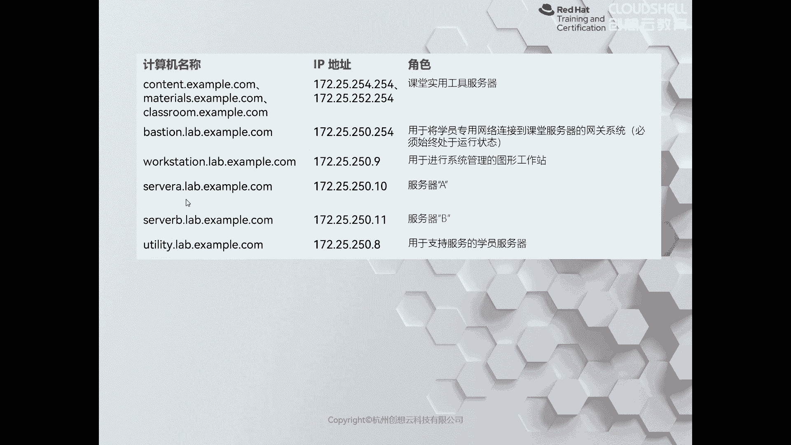
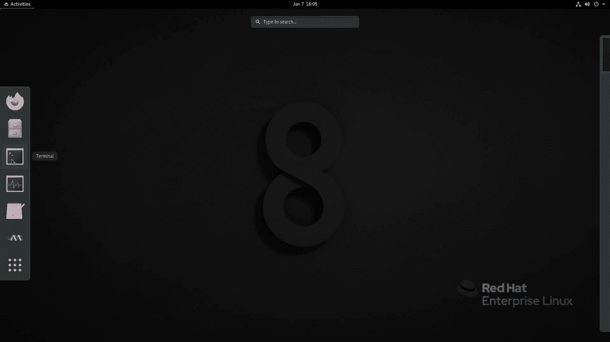
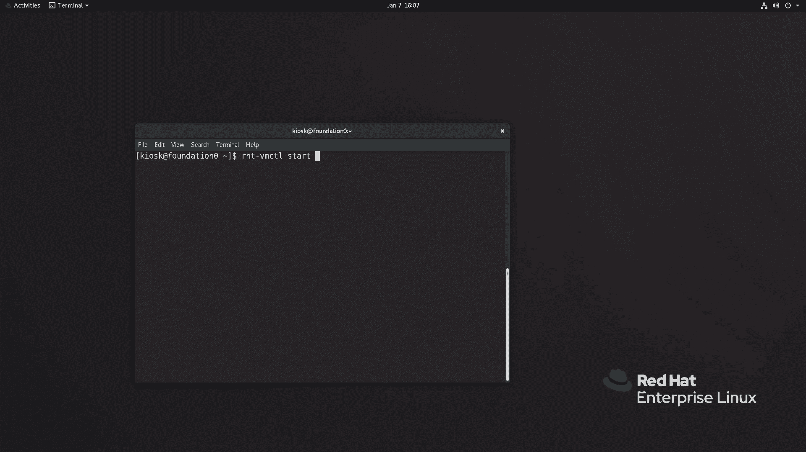
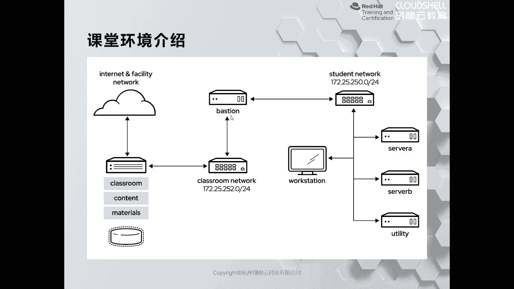
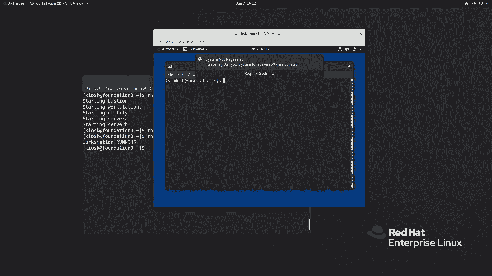
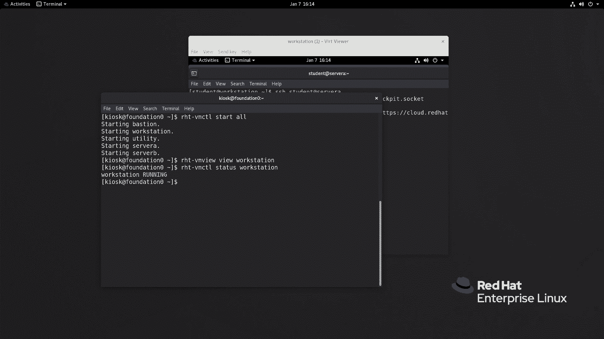
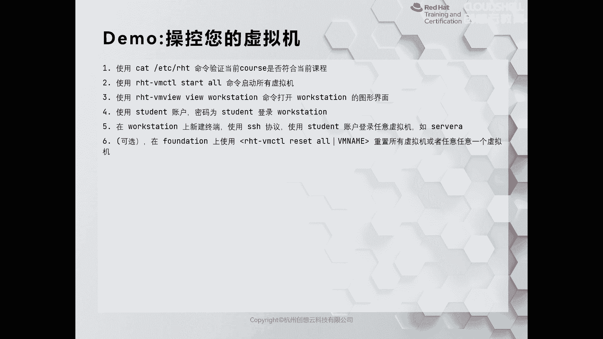

# 红帽认证系列工程师RHCE RH124-Chapter00-课程介绍及准备工作 - P1 - 杭州创想云教育 - BV1ke4y1f74d

。hello，小伙伴们，大家好。欢迎观看和学习有创想云教育为大家推出的红帽认证培训线课程。那我是本次授课的讲师啊，行万里。那么大家知道红猫一直以来呢，在整个IT培音领域呢都是比较出名的。

那么再加上现在随着互联网的发展啊，大数据、人工智能等等领域的兴起，以及目前最火的云原生啊，基本上呢都是要依赖于linux平台啊，因此呢学习linux人呢是越来越多啊。那么在linux相关的频当中呢。

红帽呢又是最权威的。那么根据最近最近几年啊，红贸GL部门呢进行统计。啊，那么中国是参加红贸认证培训的人数呢，一直处于全球number one的位置。O那么红贸这么推出认证这么多年以来啊。

那么大家对它的认可度为什么没有下降呢？那么我个人认为啊，那么这个原因呢主要在于红帽对于培训啊，那么有足够的一个培训体系。比如有质量较高的教材啊，和教材紧密结合的配套培训环境啊。

以及上课以及这个上机操作的一个考试模式啊，都是离不开的。那么这里提到了呃这个培训环境呢，因为我们是一个线上的课程，因此大家手里呢呃理论上来说是没有我们的这个对应的环境的啊。

那么这个环境呢其实可以分为两种啊，第一种呢就是说你仅仅呢是为了学习一个linux的入门课啊。那么你可以呢在网络上查找一点啊安装红帽切板linux的资料。根据上面的步骤呢来安装啊这个几台啊。

红帽切板八的这种虚拟机就可以了。啊，这是这种。第二种情况呢，就是说当你学习完之后啊，或者说在学习之前就有啊在完成整个课程结束之后呢，想参加红帽的啊这个认证考试的。

那么我们是强烈推荐大家呢使用红帽对应的配套环境的啊。O那么这个配套环境呢，我这边呢已经啊利用viewview stationation啊做好了一个啊，放在云盘上面。

那么大家呢学习完之后啊或者学习期间想使用这套环境的可以在评论区啊，像我们的啊老师索要啊，我们两位唉老师呢一个是朱老师，一个是刘老师啊，都会在评论区呢关注大家。OK好，那么除此之外呢，学习完本课程之后啊。

那么如果啊你想啊参加考试的，或者你想了解我们公司其他的啊比较优质的认证培训的课程的小伙伴们，也可以啊向我们的朱老师和刘老师进行咨询啊，他们都会耐心的为大家解答O啊，那么本次课程呢是属于是红猫系统管理啊。

这块的一个内容啊。那么这个内容呢一共分成了三个部分。OK第一部分呢叫鸿贸系统管理一啊，第二部分呢是鸿贸系统管理。2。那么这两门课程呢组成了鸿贸的一个入门的课程。啊，红帽的每一门课程呢都有自己对应的编号。

比如说我们今天看到的这门课程，鸿猫系统管理一，那么它的课程的编号呢是2H124。那么我们后面呢还会带大家学习鸿帽系统管理2，叫2去134。啊。

这两门课程都是面向于没有任何linux基础的啊小伙伴们而开展的。当然如果啊你有一定的经验。那有一定的经验啊，那么这一块的话呢就是啊推荐大家呢啊让公司啊去这个啊让大家去参与一个快速一个课程啊。

叫RHH199啊，那么无论是R199，还是我们今天学习的RH124134。啊，它的环境里面的东西呢是一样的。啊，只是上课进度不一样啊是上课进度不一样。

因此呢我在做这个环境的训机的时候呢啊为了缩减这个体积啊，我把环境里面用到124，和134的部分合成了1199啊，所以说我们后面会看到我们在执行命令的时候呢，用的是199里面的环境部署命令。O好。

那么第三本书呢是红帽708里面变变化最大的一门啊，叫做什么呀？叫做使用linux的自动化。在这门课程当中会给大家介绍如何使用安ci这个自动化工具来实现一些简单的自动化管理。okK那么第三本书学完之后呢。

就可以参加红帽的。中级的认证考试啊叫EX294，拿到认证呢就是RHCE啊，三门课两门考试啊，第一门和第二门对应的是EX200啊。

考试呢拿到认证呢叫RHHCSAO第三本书啊是建立在前两本书的记录之上那么考到认证呢？是RHCE啊，啊，这个地方呢给大家做一个简单简单的介绍啊，这个预祝大家学习过程当中啊愉快啊，那么大家有什么问题呢？

也可以在评论区呢留言啊，我这边看到之后呢，会给大家家啊这个进行解答啊。O好，那么我这里呢先给大家做一个啊自我介绍啊，让大家更多的啊了解我一下。OK呃，我的名字呢非常的好记啊。

叫行万里O那么目前的话呢是获得是红帽架构师里面的level3啊，level3O因为对于我们讲师而言呢哎我们为了上课啊，那么一般来说呢会考更多的认证啊，考更多的认证O。呃，目前的话呢。

我的证书呢是在level3。那么整个疫情期间呢呃因为疫情的原因啊，那么这个认证呢没有再去额外考其他的啊，没有额外考其他的啊呃疫情将来这个不是那么高的时候呢，我这边会继续啊增加我的level啊。

那么除此之外呢，我也我也对这个阿里云啊和这个wevi啊，涉及到的一些内容呢，也有有一定的了解啊一个了解。那么还有呢就是现在最火的云原生啊，里面一个工具呢叫cobernet啊。

那么本人呢也拿到了它的一个认证啊。呃，那么CKA的这门认证的话呢，我们公司也是在啊2022年也会主推啊，因为啊这门课啊再结合我们的linux啊，都是非常重要的两门课。

O感兴趣的同学呢希望大家呢能够积极的去咨询了解啊，了解O。Yeah。那么大家呢如果有些其他的内容想咨询的话呢，也可以去访问我们的网站啊，里面有大量的相关课程的介绍啊，以及一些呃咨询的信息呢都在里面啊。

那么第一本书呢，我们称之为是系统管理一啊，主要面向的是没有linux基础的学员啊设计的。那么整个个程当中呢，我们从最简单的图英化界面介绍啊，然后呢接着是命令行，依次的去深入啊。

主要涉及到的有一些什么用户管理啊，权限管理啊，这种啊来管理方式啊，来做一个入门O那么再加上我们第二门课R去134啊相比较而言啊，那么我们第一本书呢占整个知识点里面的40%左右啊，40%左右O啊。

那么我这里呢给大家看张top图啊，那么这个图呢是我们配套的练习环境当中的O那么在这道环境当中，我们看到啊，那么一共呢有。有4台虚拟机是供我们去使用的。那么除此之外。

将来给大家会拷贝一份啊虚拟机叫做foundditionok那么在这台fodition上面呢，有运行了一套啊服务端叫classroomok那么这个classclassroom呢不需要我们人为的干预和管理。

O那么我们所关心的呢就是啊这四台啊，是需要我们去用到的，其中还有一台也是不需要去管理的，就是我们的basition啊，ba堡垒机。O那么它也充当了我们的网关啊，网关。那么在整个的学习环节呢。

我们都会在word stationationservve a和serv B上进行操作。啊，进行操作。我们在学习过程当中，首先呢会通过SH协议。

或者直接打开word stationation的cil来进行管理。在word station上面呢，也可以通过SH协议登录到我们的COA和COB来进行管理啊，那么我们可以这样来理解。

就说其他的机子呢我们不不关心，但是呢要保证它是运行的。那么就把word station呢当做我们日常工作当中所用到的个人PC就可以了。你通过个人PC。远程连接到服务器进行管理。OK这是整个环境啊。

那么为了大家加深印象呢，我这里呢把所有的主机名和对应的IP地址以及承担的角色做了一个简要描述。O其中在我们的classroom上面，它对应的站点，一个呢叫content点example点com。

第二个呢叫做m点examp点com。这两个站点，我们在课程当中都会用到啊，比如说安装软件啊，就会用到这里的内容O那么word stationation刚才介绍过了啊，它属于是一个图化界面啊，通化界面的。

我们可以用它来管理。啊如果你觉得打开通话界面，比较消耗资源。啊么你可以在我们的放ition上面，通过SI协议登录到word station啊，然后呢再通过word station呢去连接到A和B。

其中从A从word stationation连接到A和B的时候呢，我们配置了免密码登录啊免密码登录啊。

接着呢如何呢去使用我们知道环境呢？那么这里呢给大家介绍了几个的命令啊，那么首先我们第一次使用的时候啊，使用的时候，那么先使用一个叫做RRT啊，杠sitch course的脚本啊。

后面跟上一个参数叫做RH199来设置学习第一本书和第二本书的课程内容当它设置完了之后，啊么我们就可以执行一个RRT杠VMTL这是一个命令啊，跟上一个动词啊，start啊，后面跟上你的虚拟机的名称啊。

比如说word station呢servve a呀，serv B啊这种啊，把它基引起来。那么其实第一次在我们设置环境课程的时候呢，我们的讯机呢就已经运行起来了。那么从运行训机开始。

下面的这些命令呢是我们后面在关闭了访定之后，在开机需要用的命令，对吧？这个命令啊，叫什么RTswitch course命令，只需要运行一次就可以了。

第二次呢就是我们在学习第三本书的时候再进行一次就可以了。中间是不需要的。而下面的这些有RHT杠VMCTL开头的，相反呢是用的频率比较高的。啊，这些命令呢都是我们配套环境当中特有的一套指令。啊。

你自己安装的环境呢是没有的啊是没有的。好，呃，那么我这里呢给大家呢去演示一下我们这道环境如何呢去使用。啊，现在呢我去登录到我的虚拟机啊。好，现在呢我打开一个终端。

在桌面的左上角有一个activities，打开之后左侧呢会有一个dashboard，在dashboard当中选择第三个termin终端选择打开。

打开之后。好，那么我这里呢为了大家看起来方便，我把字体呢稍微设置的带一点。我把我的字体呢设成14号。好。接着呢我们先去设置环境课程。注意，这是一个命令啊这是一个命令啊。

在这个大使前面是没有空格的这是一个命令啊是一个命令。好，空格写上RH199啊，19。那如果你不知道怎么用，可以直接回车。那这里呢会告知我们后面。需要啊指定courseurse啊。

而Cse的话呢就是1个199和1个294啊，字母不区分大小写啊。那么我为了方便呢，我已经事先的啊执行结束了，已经设置过设置完课程了啊。那么这里呢就不再执行了，我让大家看一下我当前的环境。啊。

我现在的话呢课程呢就已经是R199了啊，已经是了啊，所以说呢我只需要干嘛呢？我只需要去执行我们虚拟机提到的第二个部分。运行虚拟机。好，左个命令RHT杠VMCTL空格start。那么star谁呢？

刚才提到了是servver，而servver就是我们PPT上面提到的。

啊，bastion啊，或者说看第一张图也行啊，s aserv be utility word stationba啊，这些名称这些名称很多很复杂，我们操作起来呢不够方便，因此我们可以执行一个通配叫什么呢？

用all注意啊，这个通配加双引号的ok哦就代表了所有的虚拟机回车，那么它就会把我们所有讯音呢运行起来啊，运行起来。

那么当我们学习完课程之后啊，你可以执行1个RTVMCTLpa off后面跟上虚拟的名称来执行关机。随着学习，如果我们对虚拟机本身做了一些破坏性的操作，或者我想把它恢复到最原始的状态。

我们可以执行RHTVMCTLresite跟上我们的虚拟机的名称啊。那么哪一个需要还原就跟上哪一个虚拟机的名称即可。啊，即可OK那么如果我们的虚机已经在running状态啊，running状态。

那么我们可以啊使用RT杠VM view命令去打开它的控制台。比如说我现在呢想打开我的word station。那么就之上执行回车。哎，就会打开它的图形化界面。

那么我们在这个界面呢就可以做一些其他额外的操作。啊，因为讯机比较多，我们的讯机呢还正在开机，没有完全运行起来。但是呢在这个时候，我们如果执行RT杠VMCTL status。

out的时候或者是看一个讯机的时候，它已经是running了。因此，当我们看到讯机是running的时候，只能代表我们的讯机呢已经通电，但不能够证明它能够进行什么呀运行业务。这个地方大家一定要知道。好。

我们稍等片刻，让我们的虚金呢运行起来。那么在这个期间呢，我们再来看一条命令。如果我们对讯机的伤害是没有办法通过resite进行恢复的。那么我们大家呢就可以提供一个叫做RGTVMCTL什么什么呀？

for recite的命令啊，for recite命令啊，去指还原完全重置掉某个讯机啊。那这个过程是比较慢的啊，是需要我们对我们的磁盘本身一定的要求的啊一定要求的。啊，OK轻易的话呢不要执行这个命令啊。

好，接着呢我们来看一看我们的啊讯机有没有起来。啊，我们训机呢已经等待的起来了哈，回车啊，那么大家能看到这里面有一个默认的用户呢叫student user。那么它的密码呢就是谁呢？也是student。

它的密码是小写的student我点点击去登录STUDENT回车。第一次开机呢，它速度比较慢啊，因为它要做一个初始化okK那么我们看到的就是我们word station的图码界面。

同样我们可以点击左上角的activities呢，打开它的 dashboard和终端进行管理。

好，那么接着呢我们可以通过这个demon来看一下我们的整个过程啊。我呢已经刚才呢通过过程呢已经给大家演示过了啊。那么首先通过catETCT命令来查看当前的course是否符合当前的课程，对吧？

我们刚才看到的课程名称呢是RH199，适合RH124和RH134。接着呢我们执行了HTLstar out命令来启动了缩虚拟机。接着呢，我们又执行了HTVMV啊。

view were station的指令来打开了wa station。并使用s账户和s密码来登录到了我们的word stationation。啊，dtationok好，那么这时候呢我们可以走个第五步。

比如说我现在呢在word station上面通过IA协议来登录我的servve A。

啊，SH啊。我呢那么这些呢账户呢都是通用的啊，所以说呢我这边啊写一个SH多少呢？SH啊student at server a回车。啊，我们是不需要密码，就可以登录到服务器上面的。O。啊。

那么在整个学习的过程当中呢，大家一定要注意，先把啊环境按照我当前的方法设定完，就可以正式的学习红包的课程了。

