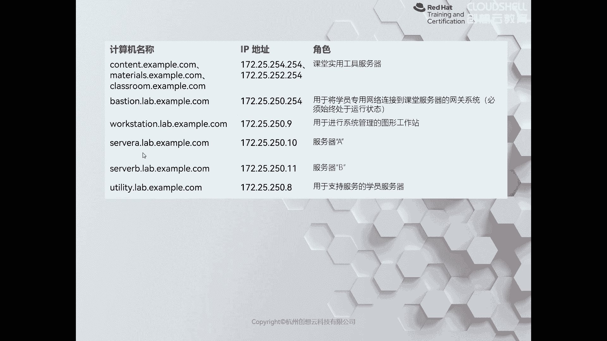
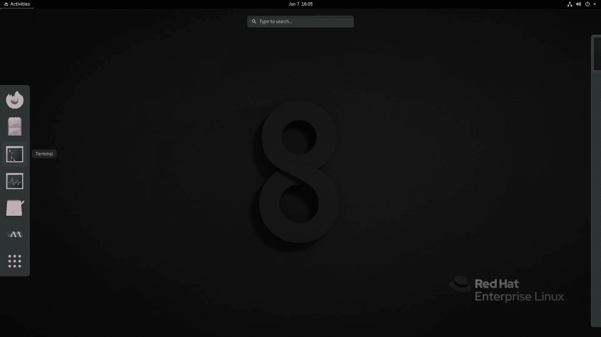
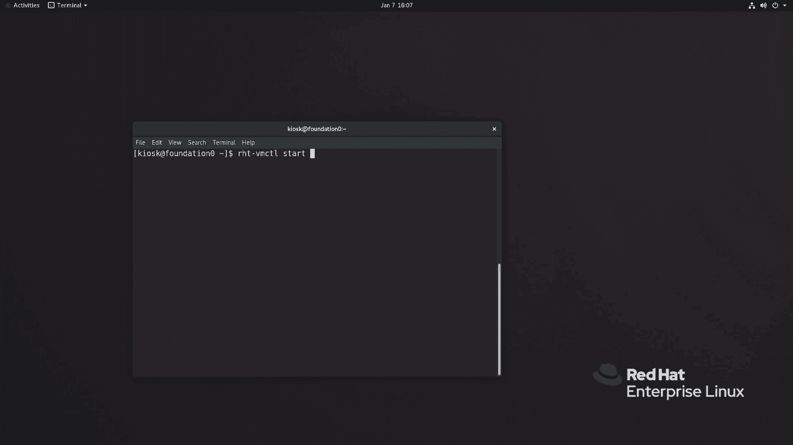
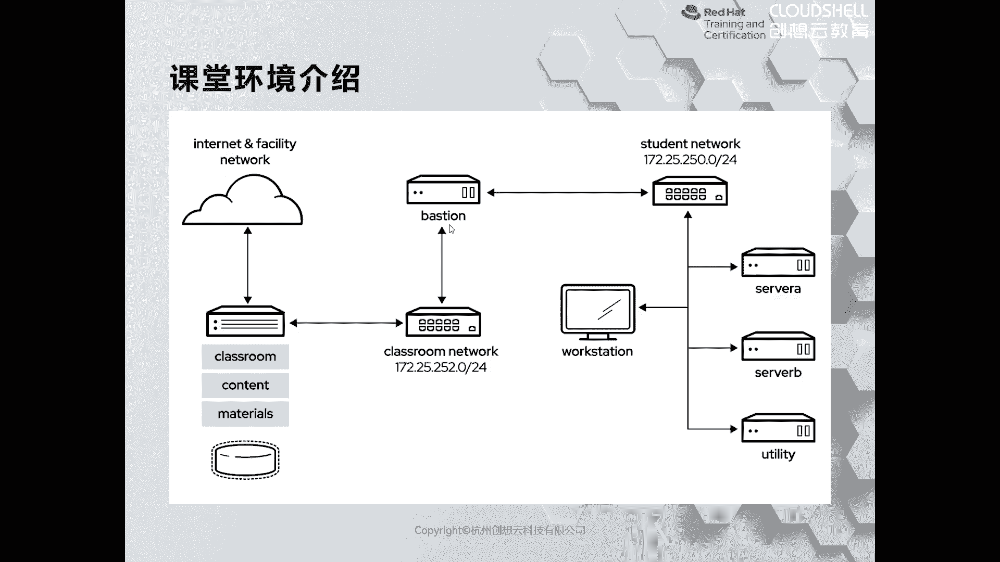
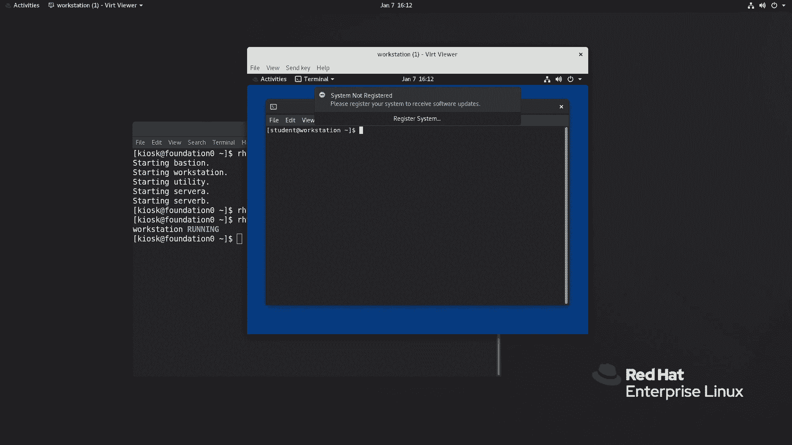
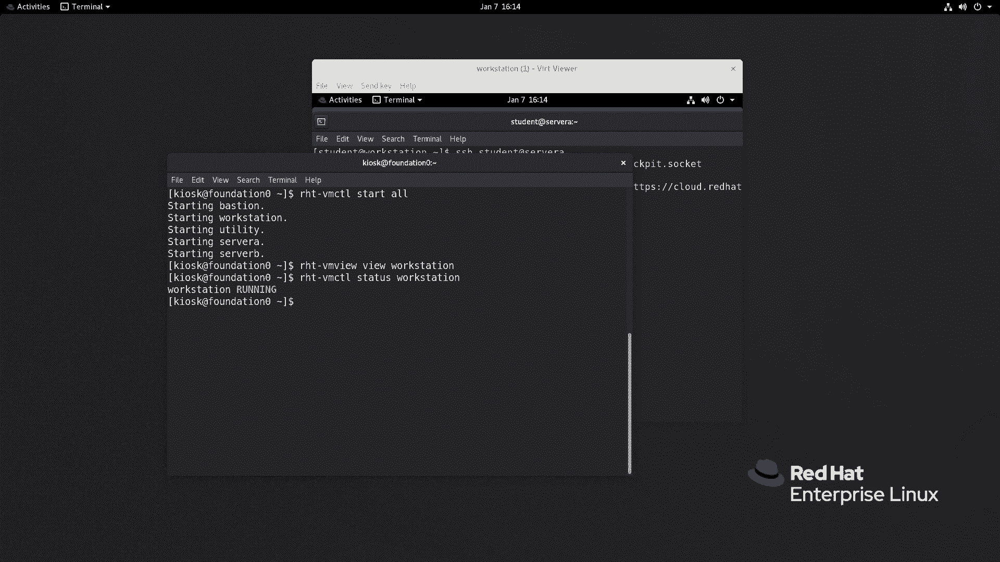
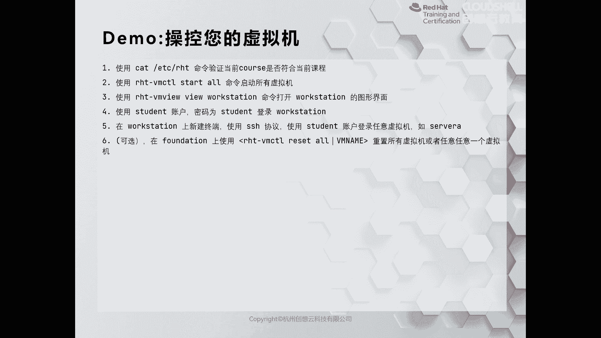

# 红帽认证系列工程师RHCE：RH124-Chapter00：课程介绍及准备工作 📚

在本节课中，我们将要学习红帽认证课程的入门知识，了解课程的整体结构，并掌握学习环境的搭建与使用方法。

---

## 课程概述

红帽认证在IT培训领域享有盛誉。随着互联网、大数据、人工智能及云原生技术的发展，Linux平台的重要性日益凸显，学习Linux的人数也越来越多。在Linux相关的认证中，红帽认证是最权威的。近年来，中国参加红帽认证培训的人数一直位居全球第一。

红帽认证的认可度之所以持续不减，主要归功于其完善的培训体系。这包括高质量的教材、与教材紧密结合的配套培训环境，以及注重实践操作的上课和考试模式。

## 学习环境准备

由于本课程是线上课程，学员通常没有现成的实验环境。这里提供两种获取环境的方式：

*   **仅学习入门课程**：可以在网络上查找安装红帽企业版Linux（RHEL）的资料，并按照步骤自行安装几台RHEL 8虚拟机。
*   **计划参加认证考试**：强烈推荐使用红帽官方的配套实验环境。讲师已利用VMware Workstation准备好了一套环境并存储在云盘。学习期间如需使用，可在视频评论区向朱老师或刘老师索要。

学习完本课程后，如有意参加考试或了解公司其他优质认证培训课程，也可向朱老师或刘老师咨询。

## 课程体系介绍

本次课程属于红帽系统管理范畴，内容分为三个部分：

1.  **红帽系统管理一**：课程编号为 **RH124**。
2.  **红帽系统管理二**：课程编号为 **RH134**。

以上两门课程面向没有任何Linux基础的学员。如果学员有一定经验，可以参加快速课程 **RH199**。RH199与RH124、RH134的实验环境内容相同，只是教学进度不同。为缩减虚拟机体积，本课程提供的环境已整合为RH199环境，因此后续操作命令会使用RH199的部署指令。

3.  **使用Linux的自动化**：这是红帽RHEL 8中变化最大的一门课程，主要介绍如何使用 **Ansible** 自动化工具实现简单的系统管理自动化。

**认证路径说明**：
*   学完前两门课程（RH124 & RH134）可参加 **EX200** 考试，通过后获得 **RHCSA** 认证。
*   第三门课程建立在前面两门的基础上，学完后可参加 **EX294** 考试，通过后获得 **RHCE** 认证。

## 实验环境详解

上一节我们介绍了课程体系，本节中我们来看看具体的学习环境。配套的实验环境包含多台虚拟机，其拓扑结构如下：



环境中共有4台主要供学员操作的虚拟机，另有一台 `foundation` 虚拟机运行着 `classroom` 服务端，无需人工干预。还有一台 `bastion` 堡垒机，也充当网关，同样无需管理。


在学习过程中，我们主要在 `workstation`、`servera` 和 `serverb` 上进行操作。可以这样理解：将 `workstation` 视为日常工作使用的个人电脑，通过它远程连接到服务器（`servera`、`serverb`）进行管理。

以下是各主机名、IP地址及角色的简要描述：

| 主机名 | IP地址 | 角色/用途 |
| :--- | :--- | :--- |
| `classroom.example.com` | 172.25.254.254 | 提供课程内容 (`content.example.com`) 和软件仓库 (`materials.example.com`) |
| `workstation.example.com` | 172.25.250.9 | 图形化界面主机，用于管理其他服务器 |
| `servera.example.com` | 172.25.250.10 | 被管理的服务器A |
| `serverb.example.com` | 172.25.250.11 | 被管理的服务器B |
| `bastion.example.com` | 172.25.250.250 | 堡垒机/网关 |

## 环境使用命令




以下是管理这套实验环境的核心命令，这些是配套环境特有的指令，自行安装的环境中没有。

**首次使用或切换课程时，只需运行一次：**
```bash
rht-setcourse RH199
```
此命令用于设置当前学习课程为RH199（涵盖RH124和RH134内容）。参数不区分大小写。

**日常虚拟机管理命令（使用频率高）：**
*   启动所有虚拟机：
    ```bash
    rht-vmctl start all
    ```
*   启动指定虚拟机（如 `workstation`）：
    ```bash
    rht-vmctl start workstation
    ```
*   关闭指定虚拟机：
    ```bash
    rht-vmctl poweroff workstation
    ```
*   重置指定虚拟机到初始状态（用于恢复实验操作）：
    ```bash
    rht-vmctl reset workstation
    ```
*   完全重置指定虚拟机（耗时较长，谨慎使用）：
    ```bash
    rht-vmctl fullreset workstation
    ```
*   查看虚拟机状态：
    ```bash
    rht-vmctl status workstation
    ```
*   打开虚拟机的图形控制台（仅当虚拟机为 `running` 状态时）：
    ```bash
    rht-vmview workstation
    ```



**注意**：`rht-vmctl status` 显示 `running` 仅表示虚拟机已通电启动，并不代表系统服务已完全就绪，可以运行业务。



## 环境使用演示

现在，我们来实际演示一下如何使用这套环境。

1.  **登录 `foundation` 虚拟机**：打开终端（Terminal）。
    
    

2.  **（可选）设置课程**：如果首次使用，执行 `rht-setcourse RH199`。本演示环境已设置完毕。
    

3.  **启动所有虚拟机**：
    ```bash
    rht-vmctl start all
    ```
    



4.  **打开 `workstation` 图形界面**：当虚拟机状态变为 `running` 后。
    ```bash
    rht-vmview workstation
    ```
    使用用户名 **student** 和密码 **student** 登录。
    

5.  **从 `workstation` 连接到 `servera`**：在 `workstation` 的终端中，通过SSH免密登录。
    ```bash
    ssh student@servera
    ```
    
    
    

---


## 总结


本节课中我们一起学习了红帽认证课程（RHCSA/RHCE）的入门知识。我们了解了课程的三部分结构（RH124, RH134, Ansible），明确了RHCSA和RHCE的认证路径。更重要的是，我们详细介绍了配套实验环境的拓扑结构、各主机角色，并掌握了使用 `rht-setcourse` 和 `rht-vmctl` 等系列命令来管理虚拟机环境的方法。请务必按照演示步骤先搭建好实验环境，为后续正式学习红帽课程做好准备。