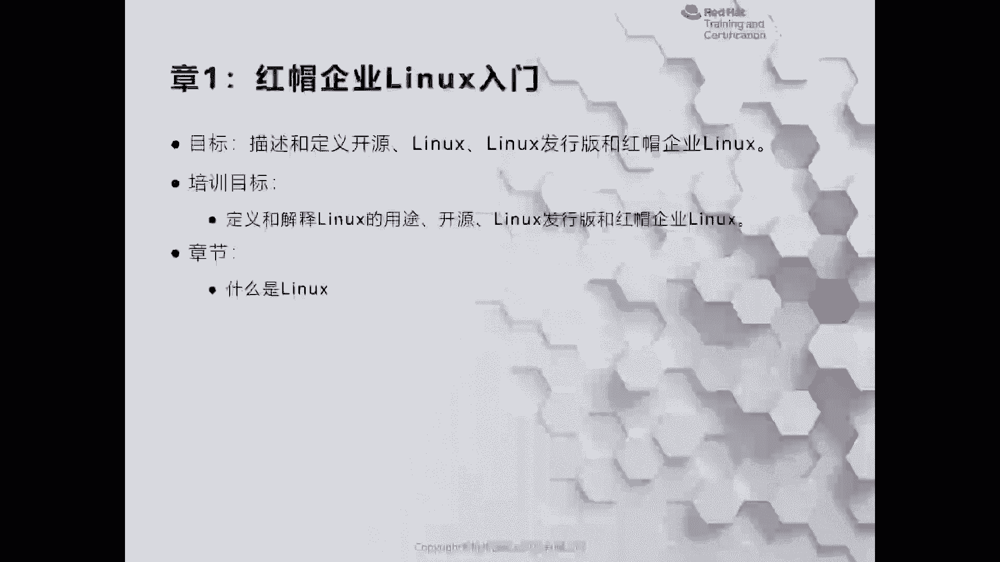
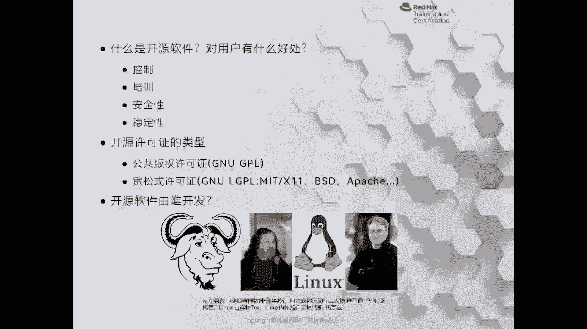
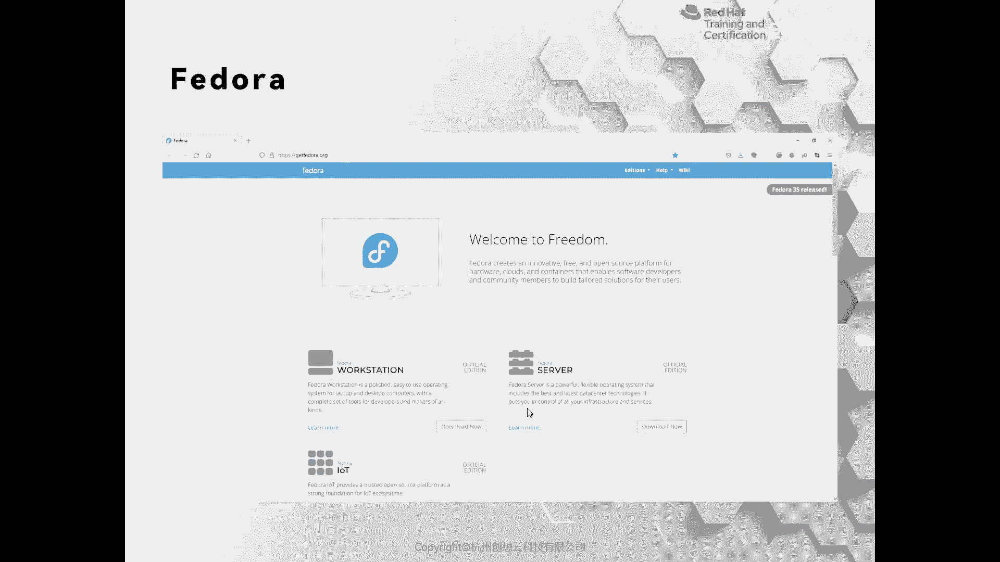
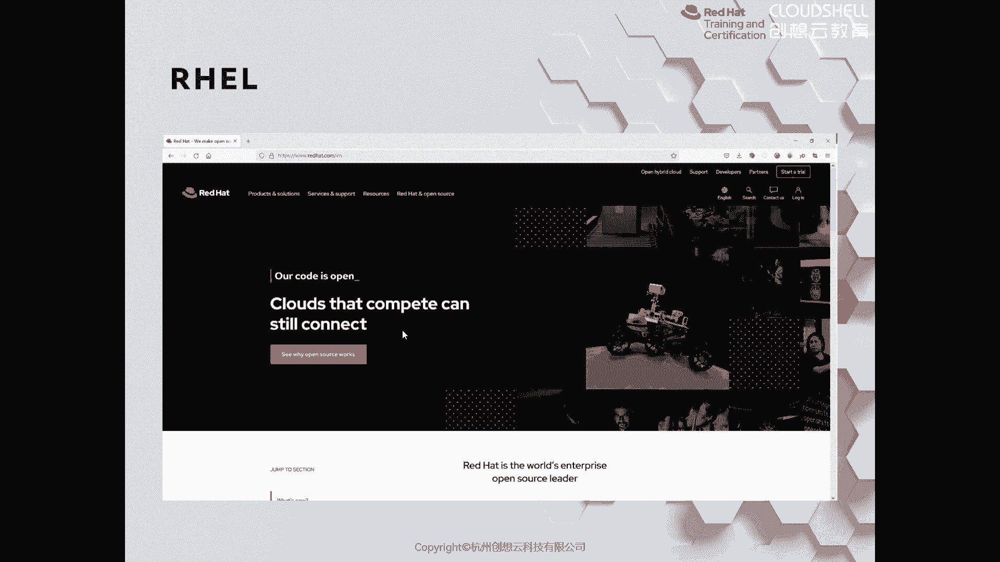

# 红帽认证系列工程师RHCE RH124-Chapter01-红帽企业Linux入门 - P1 - 杭州创想云教育 - BV1vN4y1V7s7

hello，小伙伴们，大家好。今天呢我们一起来了解一下在当前的IT环境当中。我们接触最多的开源是什么？以及我们为什么要学习linux。那么我们身边的linux有哪些发言板？

那么这些发言板呢又和红帽前linux到底有什么样区别？首先我们来看一看什么是linux。那么我们知道在我们的身边，可能很多人以为linux呢离我们很遥远，其实linux无处不在。比如说。

我们在上班的途中啊，有些小伙伴可能要去啊乘坐公交车。啊，以杭州的公交车为例。那么杭州的公交车的这个啊计费的系统呢，其实里面就是一个简单的linux操作系统。

同样比如说我们很多人用的手机都是由安卓系统来运行的。那么安卓呢其实呢也属于是linux的一个分支。啊，那么这样的例子呢数不胜数。因此，我们可以看到linux是非常广泛的。它就像空气一样，无处不在。

而作为我们从事于IT这个行业的人而言，那么linkux更应该有所了解。对于很多人而言，windows系统啊，那么在操作上面呢是非常简单的啊，然后呢想到lininux呢，就会想到啊纯黑的背景啊。

加上快速敲击的指令啊，让人头痛不已。其实随着我们的学习，发现处理命令行的效率要比。windows在做服务的时候呢，效率更加的高啊，虽然它在操作的时候的简易程度相比而言没有windows容易。

但是它的各方面优点都是要优于windows的。除此之外，在应用程序的开发过程当中，或者是现有的各种云平台，包括公有云、私有云啊，甚至我们所谓的什么呀，合云啊，很多的啊实力呢都是以linux作为操系统的。

并且现在我们都称为是云原生的时代。那么云原生里面所运行的呢，应用程序呢也是以容器的方式来运行的，而这且容器则是以linux作为基础。随着互联网的发展，也催生了更多的智能化的设备。

那么这些智能化的设备也体现在我们的生活当中的各个方面。比如说带有智能功能的冰箱、家用电，其他的家用电器啊等等。那么这些呢。设备啊为了运行更加的方便啊，也会使用linux操系统。

OK所以说无论你在IT行业从事了哪一方面，无论是刚入门的小白，还是已经是从事于其他领域的IT的职位。比如说啊。数据库啊想从事于数据库，想从事开发啊，或者说想从事我们这门课针对性更强的运维。那么我们。

了解linkux也是非常的重要的。啊，哪怕你不是从事于这个行业啊，对linkux的一些了解也是非常的有用的。OK那么这么多的系统当中，单单是因为它应用广泛。我们才学习的嘛，实时恰好相反。

正是因为它的优点来决定了它的范围很广泛。因此我们再去学习的。首先我们知道linux呢，它属于是开源的软件。OK那么什么是开源呢？开源就意味着它的源代码是公开在互联网上面的，任何人可以去下载去使用。

甚至呢修改再发行。那么这样对于任何用户而言。那么这些代码都是公开透明的。啊，不存在里面。包含一些，比如说后台的代码等等。特别是在一些敏感的领域，或者说对数据呢比较敏感的方向。那么对于开人员而言。

是首选的方案。并且linux从在发明的之初到现在，一直保留着。可脚本化的强大的命令行接口。啊，管理人员呢可以通过这些命令行来管理任何程度的啊任务作业。okK并且呢linux呢是一种模块化操系统。

我们根据需要可以对linux呢进行定制和管理。如果你觉得linkux的内核比较庞大，哎，我们可以进行切割啊，让它印行在比如说单片机等等这种比较小的设备上面。OK并且呢我们也可以针对自己的需要啊。

对linkux内核呢做其他方面的更改。啊，那么我们刚才提到了开源软件。那么开软件的话呢，优点呢我也简单说了一下，就是刚才提到的控制啊，任何用户呢把源代码的功能呢掌握在自己的手中啊。

不存在后门植入等等这样方面的这种隐患。并且呢对于学习开源的人而言，无论是使用啊还是去开发。那么通过学习开源也可以增强我们的技能，这是体现在培训方面。

OK安全性同样我也是啊说了一下okK那么里面的啊代码啊，我们都是所掌握的稳定性啊。稳定性的话呢，这一块呢主要是体现在那么开源的软件呢是公开在互联网上面的。参与这个项目的开发人员呢分布在全球各地。

那么任何一个人呢都有可能在短时间内发现其中啊不啊其中这些啊不能够使应用程序正常运行的一些隐患。比如说安全漏洞等等。那么我们通过快速的发现，从而出现快速的去增加补丁啊，那么这块啊都是我们开源的好处。

那么同样开源的话呢也是受保护的。但是呢它的许可协议呢和啊类似于windows这种闭源的版权是不太一样的啊，那么我们常见的许可协议呢有兼优啊啊GPL或者是什么呀MIT呀BSD啊取啊等等这种啊。

那么这些软件从头到尾啊，很多人不知道哎这些软件到底谁开发的啊，开源是不是就意味着啊某些开发人员啊，在空余的时间啊，这个无私的奉献。那说这种无私奉献。啊，那么可能会导致什么呀？代码比较零，这个零碎。

那么代码的质量是否是？很高呢。其实啊这个是很多人对开源软件的一种哎片面的这个认识啊。哎，那么要想知道开源软件的质量如何啊，那么其实啊这件事情呢要啊最早呢要呃归功于我们图片当中第二个这位唉这个。

领军人物啊，那么他是自由软件的一个领导的一个呃这种代表人物啊，那么叫什么呢？叫做理查德marsusman啊，那么这样一个人物，那么。你像我们图片上展示的这两位大佬呢。

我们可以把它称之为是真正意义上的黑客啊。黑客OK那么操系统啊，从应用层到最下面的各种硬件，都是他们掌握的玩物啊。那么我们有一点计算机知识的人呢，大家都知道。那么在早期的时候呢。计算机刚发明的时候呢。

那么我们这个所接触到这种操作系统。那么被须熟知的呢就是呃这个unix啊unix那么unix这种系统的话呢，随着发展呢出现了很多的分支，并且呢应用在商业环境当中。又意味着要想去使用它的产品啊，它的软件啊。

系统和硬件都是绑定的，并且呢有高昂的授权费用。那么其中啊这个双引号引起来的受害人啊，那么就是我们的啊理理查德mar storeman这个哎人士啊，那么在早期的时候呢，他想去呃做一些事情啊做些事情。

那么他就想去向他的同僚啊去借助一个计算机来去开发一款软件，但是因为版权的问题啊，版权的问题他没有办法去使用，没有办法去使用。O那么当时到了什么程度呢？就是说你还不能够在论坛上去相互交流，啊。

我遇要这个问题怎么去解决，你是不能讨论的。那么这种问题呢只能有什么呀？该产品的啊售后人员去做这些事情。啊，所以说呢这位大佬呢就干嘛呢？就一气之下呢去开发了啊一款操系统啊，还有一些编辑器啊等等啊。

其中他在开发这个系统的时候呢，叫什么叫GNU啊。GNU叫什么呢？叫GNUis not un这样一个书写，它是一种操系统啊，叫GNU你可以称之为按照现在的逻辑呢？叫GNUOS。

OK那么这个系统里面呢有一个内核呢叫hart啊hart。但是这个内核呢并不是很好用啊？那么在这个时间呢，正好啊那么在这个。哎，这个布兰索大学里面呢有个学生啊叫雷纳斯啊。

他呢呃使用了啊一个教授开发的一个叫做什么呢？叫做呃minix这样的一个操系统来做了一个二次的更改啊，那么主要是呢在内核上面啊，主要是做借鉴了minux啊，然后呢去开发了第一行的啊内核啊。

那么这个内核开发之后呢，他本人其实当时是并没有这个啊开源的这个理念的啊，但是呢在这个众多的身边的人啊去推荐说哎你把这个。代码放在互联网上边吧，那可能也是因为呃雷纳斯这个人呢也有一点点的这样想法啊。

那么放去之后呢，发现啊那么就像现在网红一样，突然之间呢就。提起了大家兴趣啊，下载量非常多啊，那么然后呢这个。雷达斯呢你就。把这个重心呢就放在了这一块上面。OK那么但是呢他。去发布的这个东西呢。

我们称之为是linux内核啊，然后呢内核特别的好。然后再加上今之前的GNU啊，那么正好缺一个内核啊，那么这种场景下呢就催生了GNUlinuxok所以说我们现在在看到linux反应板的时候呢。

我们都称之为什么GNUlinuxok那么它的发现呢，它的发这个出现呢，然后呢就啊引起了一一场盛势浩大的开源运动。OK那么这么现在的话呢，这个我们说开源基本上都是围绕linux来来说的啊来说的。

O那么在开源当中，我们现在的话呢，主要是有啊一些公司。比如说谷歌红帽啊这样的大公司呢去介入呢去开发这样的软件，还有一些团体和组织社区啊来进行以开发。那么无论是哪种形式啊。

已经已经不再是那种个人的开发为主要的都是一种团体。因此在开发代码的时候呢，质量是非常高的啊非常高的。那么在这些这些开源团体当中啊，然后呢成立那个商业公司呢，就是红帽，红帽是把开源这块玩的最熟的一个公司。

没有之一啊，所以说我们看到啊非常优秀的开软件，被红帽收购之后呢，都是变得更加的。好用啊，更加的这个呃如虎添翼吧。可以这样说啊，要比某些闭远的公司啊，为了一些专利啊什么的，把工司收购之后呢。

我们看到的是备售公司的什么呀，最后变成走向消亡啊，而不像红帽一样，让它勃勃生机OK那么很多人在了解红帽的时候呢，那么可能认为红帽呢只是做这个linux投系统的。其实呢不是的啊，我们来看一下红帽啊。

它的产品有哪些。那么对于红帽而言，它的产品呢最底层的系统也是我们熟知的正式linux发行版红帽企业版linux，我们称之为是real啊，就是RHEL的缩写。那么在红帽企业版linux发行之前呢。

它的系统呢叫做right hatlinux中间是没有企业的。那我们在说红帽8和红帽企业版8的时候呢，其实是两种不同的操系统。OK是两种不同的操作系统。当然红帽八已经很早很早了。

所以说我们也在默认现在说红帽八呢指的是红帽前百8，其实严格意上来说呢并不对啊，那么它的上游呢正是社区版本的斐多ra啊斐多啊O正好你看它的名字啊，斐do呢正是啊美国早期的时候的这种。

假绅士啊戴的那种毡帽对吧？而红帽的logo呢也是一个红色的毡帽啊，它们相辅相成。O那么除此之外呢，红帽还有一些其他额外的产品，其中对于我们而言，我们所常见的有啊哎overt的下游啊，over上游产品啊。

下游的是红帽企业级的虚拟化，还有红帽中间键啊，jabook还有现在非常火的存储啊s啊，那么gster的话呢。他是一个呃。是一个网络文件系统啊类型的。那么这种存储的话，现在已经逐渐的没落了。

OK还有红猫的这个啊云计算平台啊，一个呢是什么呢？opent，还有一个是open shift其实open shift现在非常的火爆啊，它里面集成了kuernets啊。

那么K8啊bernets大家所熟知而让ubernets火起来的，正是open shiftO啊，除此之外呢还有什么呀，还有它的这个云管理平台cloudform啊，还有卫星服务啊。

slight这些都是非常出名的，其实除此之外还有很多还有很多，这里呢只是主要的产品。OK那么这些呢产品是红帽的啊，那么是给大家介绍一下红帽这个公司的一些产品信息。那么而我们刚才提到的Glinux呢。

更多的指的是linux内核而我们所学习的红帽解版linux是它的发行版本啊，什么是发行版本呢？那么如果我们从互联网上去下载一个内核，直接去使用难度是非常高的啊，我们需要用到它的一些应用程序啊。

那么在早期的时候呢，那么这些使用linux人员呢？就是从。啊，这个商啊去那个厂商那里去购买软盘，然后呢在自己的系统上呢去编译，然后呢安装门槛非常高啊。多的一些人呢为了普及linux或者提高它应用性啊。

应用性。那么就把常的应用程序啊，和内核以及引导呢封装成一个镜像，然后再发售。那么这个东西呢，我们就称为什么呢？称之为是发行版O那么这些图片呢是我们身边多多少少呢都接触过的linux发行版。

比如说红帽系列的就是pho多raok然后呢，sinow s和红帽啊，红帽。那么我们身边用的桌面版比较多的，可能就是U版图了。OK当然了，国内啊深度做的也非常的不错啊。

还有一些非常的忠实的粉丝呢是linux，是那个arch links的粉丝。如果你觉得啊这个啊想更加的方便使用，那么你可以使用这里的gleO呃，如果你想用优班图这种开箱即用的。

那么我推荐你用什么linux mateO如果你想啊更加的啊好看啊，然后这个软件丰富，那么可以使用这里的pOSO。这些呢都是非常多的那个方行版本。哎，我就我个人而言，如果你是国内的用户。

又想喜欢使用国内的一些生态，比如说微信啊这种，那么我是推荐你有深度的那如果你想接社会的这个国际的主流OK。一些开发呀什么的，你可以用优盘图OKU盘图。哎，非常多啊非常的呃让人第一次用，可能是眼花缭乱。

对吧？但是如果服务器的话呢，那么我们可以学习sowOS或者涉及的红帽的企业pl都是可以的。那么红帽的软件为什么如此的优秀呢？啊，为什么去选择学习呢？那么这和它的整个的流程是息相关的。

同样我们现在在国内的linux方向版当中也是在看到了红帽的影子。那么红帽呢首先去构建一些上游的社区啊，那么它从这些社区里面的各个优秀软件当中呢去挑选大家啊这个推荐出生最高的。

然后呢集成在自己的社区里面啊，上游社区里面。然后呢经过大批量测试，然后呢把稳定的版本集成出来呢，然后再发售。那么可以理解为啊这里呢就是些上游的应用程序。然后呢，这个社区呢，你可以理解为是photora。

然后呢，后面呢这个呢就是红帽这样一个产品线。OK好，那接着带大家呢来认识一下鸿猫常用的这个它的一些上游的一些系统版本。其中面向桌面居多的呢是phodora啊fdoraO呃，phodora的话呢。

它的软件呢可能会少一些啊是少一些，但是啊但是呢它的这个。呃，各方面的技术呢都是在前沿的啊前沿的。当然它也有服务器版本和面向物联网的产品。

接着呢是红帽企业版，我们商用级别啊，企业里面用的比较多的O但是我们这里多指的是一些，比如说金融机构啊这种方面的啊，电信行业啊，但是如果是互联网行业或者中小型企业的话呢，而我们选择是sno比较多。

那么现在的sow的话呢，我们只能称之为是sno stream啊，而sow的话呢已经可以理解为是不存在了啊，红帽呢把sow呢原有的下游产品变成了红帽的上游产品。

OK好，那这里呢给大家推荐一些网站，可以用来学习linux。比如说GNU啊内核啊，红猫这个旗下的一个open source，还有一些linux的 foundation啊，基金会啊，还有一些文档啊。

TLDP还有和这个我们linux很多产品相关的fred desktop top啊，还有一些linux confi呀，国内的XCN都是非常不错的网站。这些呢都是推荐大家呢来学习的。

