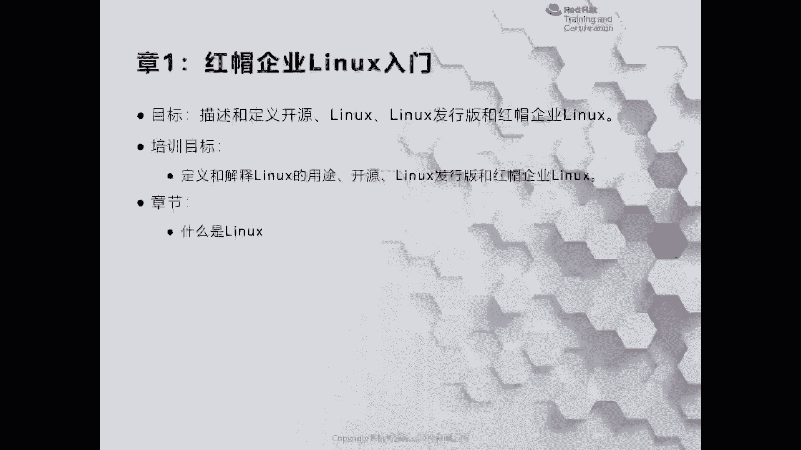
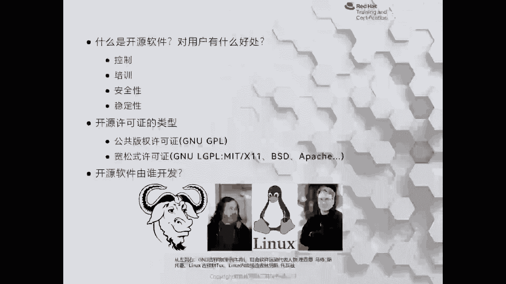
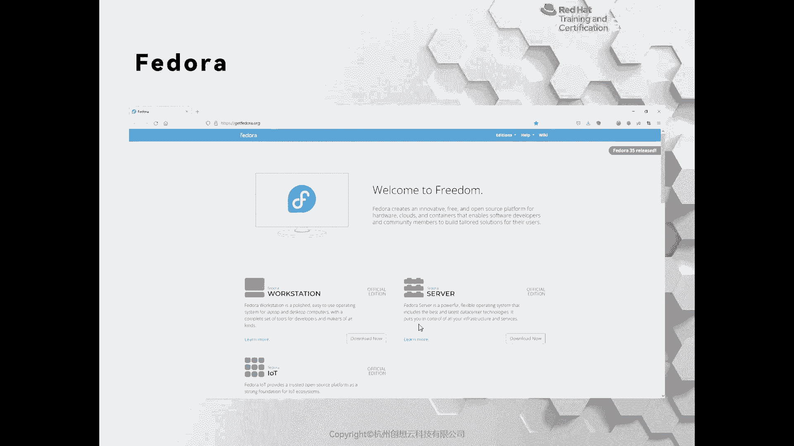
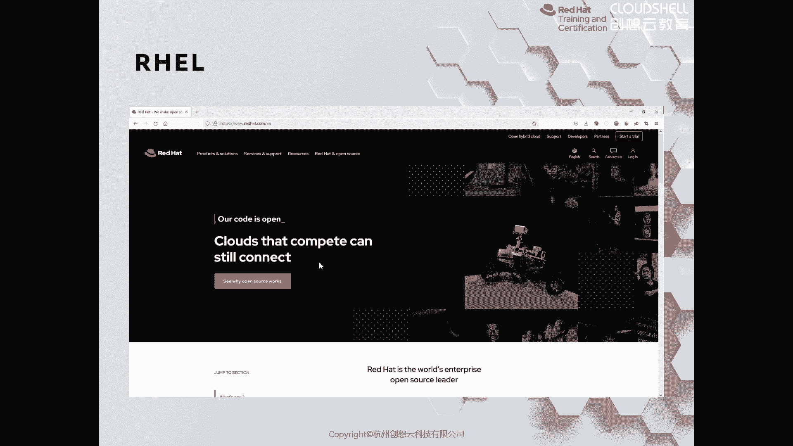

# 红帽认证系列工程师RHCE：RH124-Chapter01：红帽企业Linux入门 🐧

在本节课中，我们将要学习Linux操作系统的基础知识，了解其重要性、开源特性以及红帽企业Linux的独特之处。我们将探讨Linux为何无处不在，以及学习它对于IT从业者的价值。

## 什么是Linux？

Linux是一种开源操作系统，其核心称为内核。它广泛应用于各种设备和场景中，从公共交通的计费系统到智能手机的安卓系统，再到云平台和智能家电，Linux无处不在。对于IT行业而言，无论是开发、运维还是数据库管理，了解Linux都至关重要。

## 为何选择Linux而非Windows？

虽然Windows在操作上可能更直观，但Linux在作为服务器或进行系统管理时，效率通常更高。它拥有强大的命令行接口，允许管理员高效地处理各种任务。此外，在应用程序开发、云平台（公有云、私有云、混合云）以及云原生时代的容器技术中，Linux都是基础运行环境。

## 开源软件的优势

Linux属于开源软件，这意味着其源代码对公众开放，任何人都可以查看、使用、修改和重新分发。这带来了几个核心优势：
*   **透明与控制**：用户可以完全掌控软件，避免了闭源软件可能存在的“后门”隐患。
*   **协作与质量**：全球开发者共同参与，能快速发现并修复漏洞，软件质量和安全性高。
*   **灵活与定制**：Linux采用模块化设计，可以根据需要裁剪或定制，使其能运行在从大型服务器到小型嵌入式设备的各种硬件上。
*   **许可协议**：开源软件受GPL、MIT、BSD等许可协议保护，这与闭源的版权模式不同。

## Linux的起源与发展

Linux的诞生与两位关键人物密不可分：
1.  **理查德·斯托曼**：他发起了GNU项目，旨在创建一个完全自由的操作系统（GNU is Not Unix的递归缩写），但其内核（Hurd）发展并不顺利。
2.  **林纳斯·托瓦兹**：他借鉴Minix系统，开发了最初的Linux内核，并将其开源。

最终，GNU项目的用户空间工具与Linux内核结合，形成了我们今天所说的**GNU/Linux**操作系统。这场开源运动催生了众多由公司、社区和组织维护的高质量项目。

## 红帽公司及其产品

红帽是将开源商业模式运用得最成功的公司之一。其核心产品线包括：
*   **红帽企业Linux**：即RHEL，是企业级Linux发行版的标杆。其上游社区版本是**Fedora**。
*   **虚拟化与云平台**：如**Red Hat Virtualization**、**OpenStack**（开源云平台）和**OpenShift**（基于Kubernetes的容器平台）。
*   **中间件与存储**：如**JBoss**应用服务器和**Gluster**存储。
*   **管理工具**：如**CloudForms**云管理平台和**Satellite**系统管理工具。

## Linux发行版简介

仅使用Linux内核非常困难，因此出现了**发行版**——它们将内核、常用软件和安装工具打包成易于使用的系统镜像。常见的发行版家族包括：
*   **红帽系**：Fedora（社区版）、RHEL（企业版）、CentOS Stream（社区企业操作系统，现为RHEL的上游）。
*   **Debian/Ubuntu系**：以易用性著称，如Ubuntu、Linux Mint。
*   **其他**：如Arch Linux（高度可定制）、openSUSE、Deepin（国产优秀发行版）等。

对于服务器环境，学习**CentOS Stream**或**RHEL**是主流选择。对于桌面用户，若追求易用性和国内生态，可考虑**Deepin**；若想与国际主流开发环境接轨，**Ubuntu**是不错的选择。

## 红帽为何优秀？

红帽产品的质量与其开发流程密切相关。它积极参与并主导上游开源社区（如Fedora），从中筛选和集成最优秀的软件，经过严格的测试后，形成稳定的企业级产品（RHEL）。这种从社区到企业、再反馈社区的模式，保证了其技术的先进性和产品的稳定性。

## 学习资源推荐

以下网站是学习Linux和开源技术的优秀资源：
*   GNU官方网站
*   Linux内核官方网站
*   Red Hat Open Source
*   The Linux Foundation
*   The Linux Documentation Project
*   Freedesktop.org
*   Linux.com
*   国内社区：如ChinaUnix等

---

本节课中我们一起学习了Linux操作系统的基础概念、开源模式的优势、Linux的发展简史以及红帽公司的产品生态。我们了解到Linux因其开源、高效、稳定和灵活的特性，已成为IT基础设施的基石，而红帽企业Linux则是其中重要的商业发行版。理解这些背景知识，将为后续深入学习系统管理打下坚实的基础。