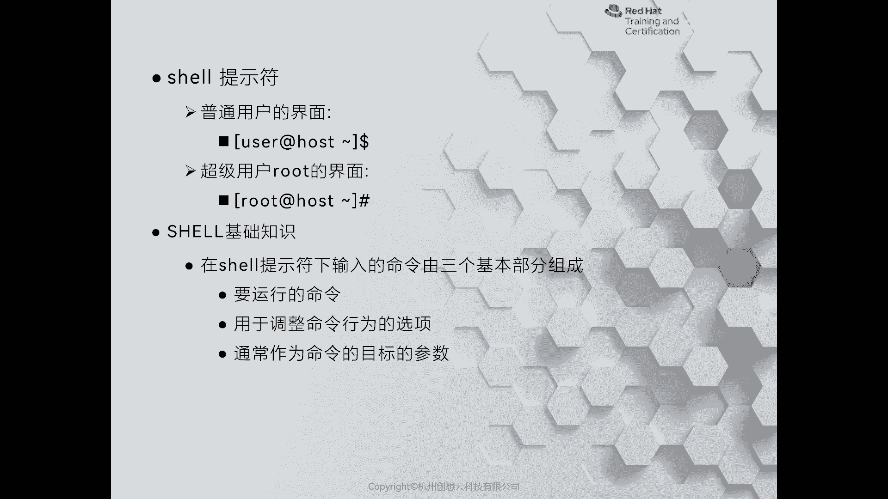
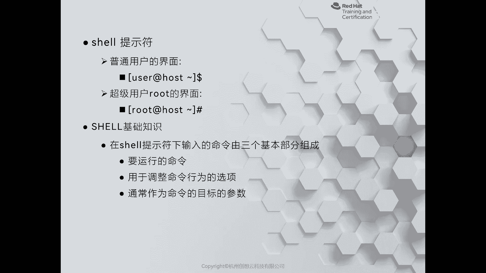

# 红帽认证系列工程师RHCE RH124-Chapter02-访问命令行 - P1：02-1-访问命令行-访问命令行 - 杭州创想云教育 - BV1PU4y1k7ti

好，那么我们刚才呢认识了lininux啊，发译版相关的信息以及简单认识一下什么是红帽。那么今天呢接着我们来学习如何利用命令行来管理lininux操作系统。那么这是这一章的重点知识。啊。

首先呢我们会带着大家啊学习在本地文本空台当中来登录我们的linux操作系统啊，并可执行一些简单的使用命令啊。那么同时呢也会给大家介绍如何使用啊，这个linux的桌面O那么第三部分的话呢。

是给大家介绍一下常用的快捷键啊，这样可以来提高我们的执行命令效率和降低它的出错可能性。OK那么首先要想学习links，我们要认识一个啊这个工具叫什么呢？叫做shall啊，那么什么是shall呢？

那么shall的话呢，我们按照字面意思呢，可以把它翻译成什么呢？翻译成壳对吧？乌龟的壳，O那么这个东西呢是干嘛用的呢？它是用来啊将管理人员的指令。转变成linux系统识别的命令。

所以说呢它是将外界和系统内部啊进行交互的一个介质。那么在这种事要当中呢，我们见的最多的啊。用的频率比较高的呢就是什么呢？就是bsh shell。

那baar shell的话呢是早期unix上面啊SS shell的一个改进版本啊改版本。那么这个shall呢它是一个应用程序，我们要想在这个上面敲接命令，就需要用到三个功能啊，三个工具。

一个呢叫termin终端。第二个呢叫conl控制台。第三个呢。讲TDY。我们称之为是电传打字机，那么这个三个产品呢，其实我们现在是看不到的。OK都是一些古老的产品。在这个图片里面的左侧。

第一个呢就是我们提到的终端。因为在早期的时候呢，计算机呢是非常昂贵的。啊，昂贵的。那么为了让各种工作人员呢去使用，会给每个人呢分配一个终端啊，那么我们可以在终端上的敲击指令啊，来去发送各方面的任务等等。

OK那么第二个图呢是我们所谓的控程台啊，中叫工程台啊，叫做cilc。那么cole的话呢，在这个图片上，我们可以看到啊，那么它有点像有点像我们的机柜，对吧？啊，极柜，但是呢上面有非常丰富的功能。

比如说这里看到的啊这各种按钮，对吧？各种按钮OK我们可以在这个上面呢去控制我们的计算机啊，那么现在呢这个东西呢也是没有的。但是呢我们的linux是遵循po six协议的。

因此它认为我们的个人PC是一个小型机。啊，然后呢把我们的显示器啊当做什么呀？cl来理解啊，cl来理解啊。OK那么第三个图呢是电传打字机。OK就是GY。那么它和第一个图的不一的区别在于什么呢？

它在传输信号的时候呢，用的是电信号。OK电信号okK然后呢，我们呃敲击指令的时候呢，用的是什么呀？纸带啊，纸带条带啊，然后去发送的指令。这些图片呢都是一些古老的内容啊，大家感兴趣的话呢。

可以去线上去计算机的博物馆去查看。OK有听验同学呢可以去国外的一些计算机博物馆去参观。完。O好，那么接着呢我们来看一下这个sha的提示服啊。

刚才给大家介绍的啊termincon和而言呢都是啊现在呢都是通过软件啊来模拟出来的啊来模拟出来的。那么用户呢可以在这些界面上去敲指令啊，首先呢我们提到的一个概念呢？就是什么呢？就是shael的提示服啊。

提实服。那么其实服的话呢，有两种啊，有两种。那么你像我的PPT里面显示的这种啊，像这种。其中第一种我们能看到的啊，有个中国糊啊，里面包含了一个用户名艾主机名啊，然后呢在中括号后面呢可以看到个do。啊。

那么这个dollar符呢就是我们啊这个来提示用户输入指令的地方。因此呢我们称之为是提示符。贴符我们看到有两种，一个呢是doller符，一个呢是景字符。okK那么doller符的话呢是面向于普通用户的。

而精景字符呢则是面向于我们的。超级管理员入root用户的啊root用户的OK好，那现在呢我去啊在我们的环境当中啊，这个调用出来一个终端。

那么大家看到的这个存化界面呢是我们的红帽78000。我们可以在桌面的左上方的活动概栏里面点击在左侧的dashboard的第三个啊啊看到一个termin，点鼠标，点击打开。

那么现在看到这个终端呢啊就是一个gome的终端啊，就jimailn这个桌面啊，然后提供了一个软件啊，叫gome啊shall。

OK然后呢，按照我们之前学习的指令，通过RTT。杠VM view啊，空格啊view空格sver a可以打开一个讯拟机，但是我们看到提示讯拟机没有运行，对吧？那么我们就先去把它运行起来啊。

VMCTL空格啊，start on回车。啊，等命令执行完了，我们再去执行一个viewserv a就可以打开servve a的文本控制台。我们的虚拟机呢已经正常的启动了啊已经正常启动了。

那么接着呢我再回过头啊，看一下我们刚才敲击命令的地方。那么刚才呢打开这个窗口呢，我们称为是终端啊。那么在敲击命令的时候呢，左侧呢就是刚才提到的啊这个命令用户的提示符啊，提示服okK是doller符。

那么后面呢这个部分呢就是我们的命令啊，是我们命令。

ok好，接着呢我们来给大家介绍一下，在啊shael上去敲击命令的时候常见的部分。那么在。我们的终端上面在敲击的时候呢，首先我们要知道，那么要干什么事情啊，当你选择啊确定了干什么事情呢之后呢。

就要选择一个合适的工具去执行这个任务。那么这个工具呢，我们就把它称之为是命令OK。啊，那么命令的话呢，在我们系统当中呢有一个专门的路径来存放的啊，它就类似于我们windows上面啊。

你比如说啊这个在桌面上运行1个QQ软件啊，或者是比如说钉钉啊这样的软件啊一样的OK然后呢，有的时候呢，我们在执行命令的时候呀，可能需要一些。啊，其他的动作啊以下其他动作。

就比如说我们刚才在执行命令的时候啊，那么敲接了一个这样的信息。

啊，叫做什么呢？叫做啊view对吧？view ok那么这个view的话呢，我们可以把它当做啊我们前面2RT杠VM view的一个选项啊，这是命令，这是选项啊，选项的话呢来决定了我们命令的动作。

OK动作啊，那么不同的命令呢可能有不同的选项啊，它们的含义呢都是不一样的。

那么第三个组成部分呢是什么呢？第三个组成部分就是我们提到的一个参数啊，参数我们把它当做命令的一个目标行为。一般呢我会这样来比喻啊，比如说我们可以把命令呢当做一辆车啊，一辆汽车啊。

而这个选项呢就相当于汽车上面的导航设备。而目标呢正是我们将要到达的目的地。啊，我可以开着车啊，漫有漫无目的的去去跑是可以的啊，只有命令OK第二个情况呢，我根据我的导航仪的路径去执行，对吧？去开车。啊。

用选项，那么导航仪说了，前方路口右转，那我就往右转。那么所以说呢我们可以把它理解为选项呢，可以调整命令的行为。啊，当我去决定去西湖游玩，那么西湖呢就是我的目标啊，目的地啊，那么放在选项的后面。

或者说直接放在命令的后面，具体该怎么去调整去放。哎，我们需要呢根据命令的不一样去选择。OK好，那么接着呢我们来看第二张PPT啊，我们来给大家介绍一下啊，如何去使用我们的文本界面。

啊，那么文本界面的话呢，我们可以啊在刚才打开的soA的窗口来给大家演示。我们的虚拟机呢是运行在KVM的虚拟化平台上面。

那么我们看到的这个黑色的背景呢，就是文本界面。如果我们的servA是一台物理服务器，那么这个呢就是我们的显示器，哎，就是concilok那么我们现在呢看到有一个光标呢在闪烁等待用户的登录。

我们输入我们的用户名啊，student。密码也是student。那么当我们在输密码的时候呢，是没有任何的提示的。所以说输完之后直接回车即可。啊，回车即可。那么同样我们在这个界面你会发现有光标在闪烁。

就是等待我们执行命令啊执行命令ok。那么一个红帽78的话呢，上面是有6个。终端的啊，我们可以通过control加alt键，加F1到F6这些功能键进行组合。因为虚拟机呢它是没有办法直接发行这些快捷键的。

因此我们可以使用上方的send key来选择发送你的组合按键。啊，现在呢我现在先不去切换，我先输一个指令呢，叫TTY。TDY可以帮助我们查看当前所在的终端。现在呢是在第一个终端啊。

然后呢我去发送一个controrl out F3。啊，你会发现又需要登录。这次呢我们换一个账户呢叫DVOPS。输入密码，red hat。啊，然后呢输5TDY。你会发现我们来到TTY3。

也就是说我们在发送的K的F1到F6，正好对应了我们的终端TTY1到TTY6。okK但是呢在我们的linux上面不要去发送contrl out和delete按键。

因为这个组合键在我们的linux上面代表的是重新启动操作系统。OK这是非常危险的啊非常危险的。这是通过控台的登录方式，适合本地登录。啊，但是呢我们知道啊我们在。日常当中使用我们的服务器的时候呢。

并不是通过这种方法来。登录的更多的时候呢，当我们的服务器出现故障的时候，需要本地进行排查，才会通过这种本地控谈来登录。而更多的时候呢是选择远程的方式来登录。

okK那么我们课堂上呢是推荐大家使用overtation。来连到虚拟来管理的，而不是直接在我们的。放d上面去执行。因此我现在呢想去over station，那我就可以去啊打开一下。

那么大家看一下这个界面和刚才soA呢是不一样的啊，so A是黑白的对吧？而我们的这个呢是彩色的那这个呢就是一个图形化的界面啊，图形化的界面啊，我们选择student用户然后输入密码。

你会发现在这里呢会有提示，这正是字符界面和图形化界面之间的区别。好，我们先登录。登录成功之后，我们会看到一个和房地产一样的桌面环境。初次登录呢可能会慢一点点啊，因为它要做初始化。

好，然后呢我们接着呢在左上角的actities的话呢，就可以打开和我们的finition一样的啊dashboard来进行管理。啊，这是两种啊，一个呢是通过文本界面登录，一个呢是通过统一化界面登录啊。

无论是哪一种方式呢，我们更多的的话呢是用远程的方式进行登录。OK好，那么我这边呢通过啊这个word station来演示一下如何去登录到word station。

SH啊空格，然后呢选择用户student at worktation啊， at work stationation好，然后呢输下回车。OK然后呢就立即登录到了我们的服务器上面。那么理论上来说呢。

我们这里会选择要求是输入密码的，但是没有，为什么呢？因为我们的教学环境当中呢啊为了方便我们配置了啊免密码认证登录啊，所以说可以通过这个指令呢，直接来连接到我们的服务器。

O那其实我们的命令呢相当于走了一个这指令，叫SH跟I啊，第SH下面的1个IB啊2C啊，这样一个命令啊，那么刚I的话呢是已跟上一个啊。私钥啊通过这个私钥呢来去干嘛呢？去认证啊证。在我们的服务器上呢。

已经配好了公钥认证啊，用它来进行解密啊解密。是三种登录的方法啊，本地控台啊图形化界面或者是通过网络SIG的登录。当我们在服务器上登录成功之后啊，登录成功之后，那么比如说啊我们这个图这个。网络的方式啊。

登录成功之后呢，我们可以通过exact来退出我们的远程绘画。那么图话界面的话呢，可以选择右上角的啊这个。用户点击这里的登出啊，就可以来登出我们的用户信息。同样在字符界面的话呢，和远程是一样的啊。

我们在登出的时候呢，执行一个exit即可。

